# NandFlash_BBM解析指南
## 1 简介
**BBM (BBM)：Bad Block Management 坏块管理** 
Nand Flash 由于其物理特性，只有有限的擦写次数，超过那个次数，基本上就是坏了。在使用过程中，有些 Nand Flash的 block 会出现被用坏了，当发现了，要及时将此 block 标注为坏块，不再使用，对应坏块物理地址映射到其他正常坏读写。于此相关的管理工作，属于 Nand Flash 的坏块管理的一部分工作(通常Nand Flash出厂可能存在部分坏块)。如果采用eMMC存储，这部分软件工作已经在eMMC内控制芯片内完成。 
**eMMC（Embedded MultiMediaCard）介绍** 
是一种集成化的存储模块，它将NAND Flash 芯片和控制芯片（Controller） 封装在一个芯片上，并集成了标准的接口协议（如 MMC 协议）。简单来说，eMMC = NAND Flash + 控制器 + 接口，是一个 “即插即用” 的完整存储解决方案。 集成了控制器，能自主完成： 
1. 接收处理器的读写指令（通过标准接口）； 
2. 进行坏块管理（屏蔽损坏的存储单元）； 
3. 实现磨损均衡（均匀使用各存储单元，避免局部过度损耗）； 
4. 数据校验与纠错（ECC）等。 

因此，采用eMMC就不需要再考虑Nand Flash必须的BBM坏块管理算法和选择Flashdb来实现磨损均衡，更加易于开发。

## 2 BBM管理方式
sif_bbm_init函数会把一个全新的Nand颗粒内存大小，分成32份，物理地址空间最后的1/32用于BBM管理，对于前31份内发现了个别坏坏，会映射到最后的1/32中的正常块来读写，对应用户来说，Nand读写地址还是连续的。 
**BBM管理区地址计算**   
对于52X，基地址为0x62000000， 对于56X， 基地址为0x64000000。
目前使用的NAND颗粒多为512MB或1Gb的颗粒，分别对应大小为0X4000000和 0x8000000， 而保留给BBM的大小为总大小的1/32， 所以分别保留0x200000和 0x400000， 而且划分的地址是从最后开始划分的， 所以针对52X/56X 以及不同的大小，BBM区域的起始地址是不同的， 另外BBM信息同时保存在2个块中， 除了ID和CRC值其他的内容都应该相同， 如果不是坏块，两个保存BBM的块是相邻的，地址分别为：  
对512Mb 52X 起始地址为：0x65e00000 / 0x65e20000  
对1Gb 52X 起始地址为：0x69c00000 / 0x69c20000  
对512Mb 56X 起始地址为：0x67e00000 / 0x67e20000  
对512Mb 56X 起始地址为：0x6bc00000 / 0x6bc20000  
长度可以是一个page， 也可以是多个PAGE， 建议直接读多个PAGE。读多个PAGE的原因是每次BBM版本更新，都会再下一个PAGE重新写一次，每个PAGE的开始数据要么是BBM的magic num(0X4D 42 66 53)， 要么就是全FF, 当下一个PAGE的开始数据为全FF时，则当前PAGE是最新版本号，即需要分析的数据。
另外可以同时通过read back读取2个块的信息分屏进行比较分析  

## 3 BBM管理表读取
Jlink驱动，要用Original原始的驱动，不带BBM管理的驱动，`SF32LB52X_EXT_ORG_NAND2.elf`
`\tools\flash\jlink_drv\sf32lb52x_nand_nobbm\SF32LB52X_EXT_ORG_NAND2.elf`
Uart驱动，要用`tools\uart_download\file\ram_patch_52X_NAND_NOBBM.bin`或`Butterfli\file\ram_patch_52X_NAND_NOBBM.bin`来读取，正常带BBM管理的驱动，读到的颗粒的内容，是已经经过BBM映射的数据。 
**Jflash的读取方式演示**  
通过JLINK链接到板子，在PC端打开JFlash.exe 

 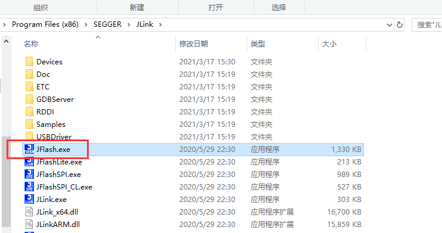  
创建project并选中正确的device 进行连接
对于52x 系列选择SF32LB52X_NAND_NOBBM。 
对于56X系列选择SF32LB56X_NAND_NOBBM。
非NOBBM版本无法正确访问后面预留的几兆BBM地址，所以只能选择带NOBBM后缀的版本 

 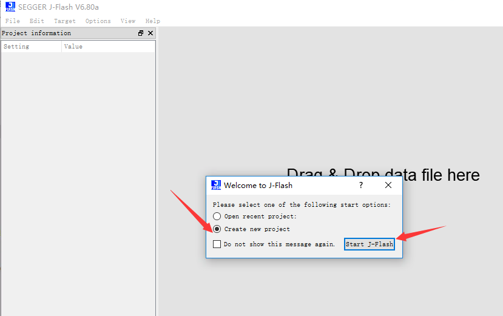  
 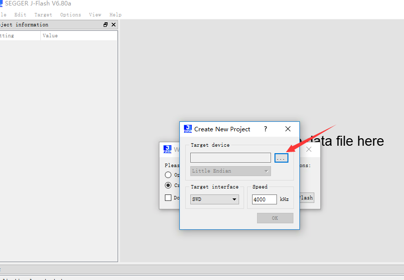  
 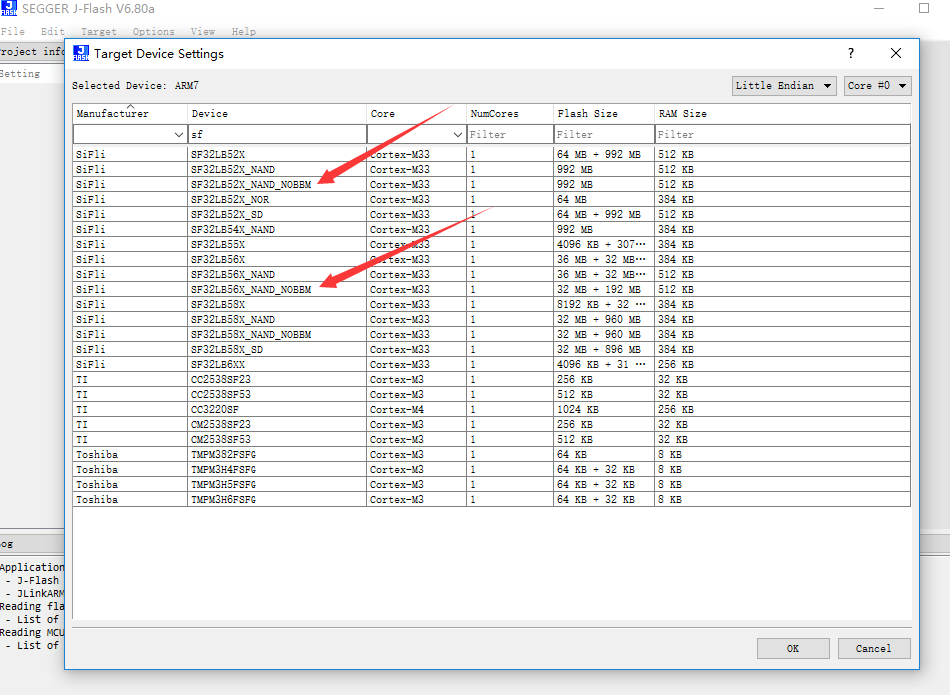  
 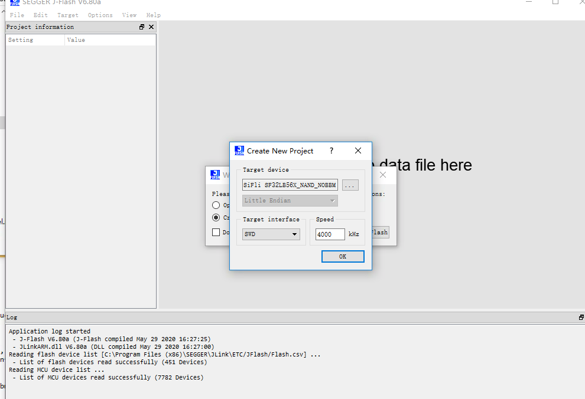  
 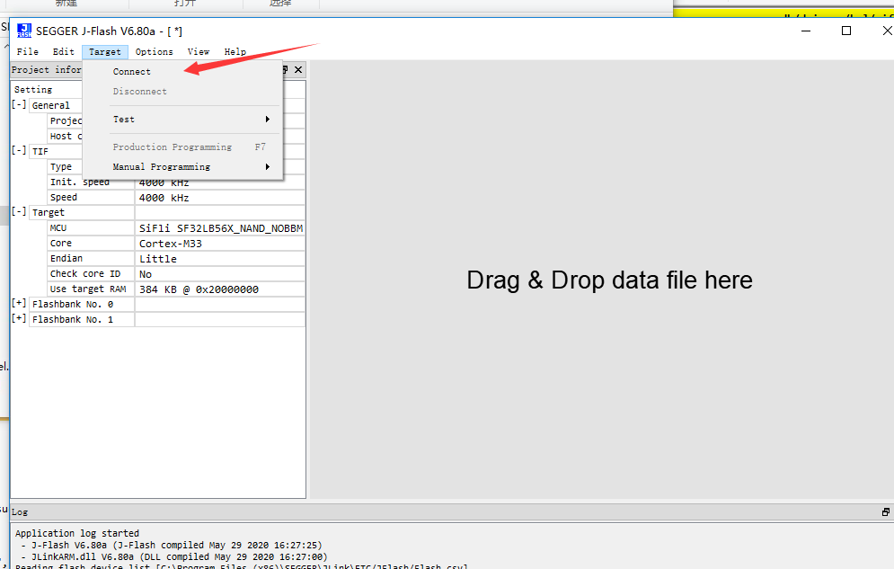  
 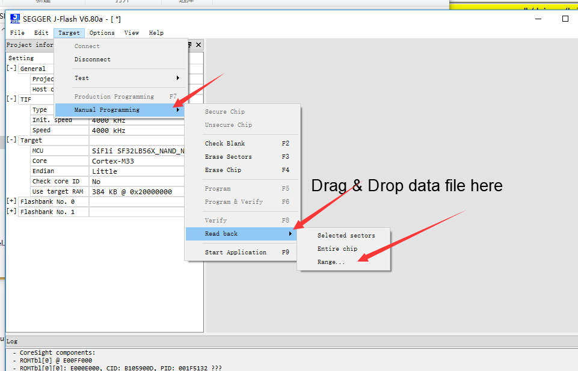  
对于512M的56X读一个PAGE地址示例：
 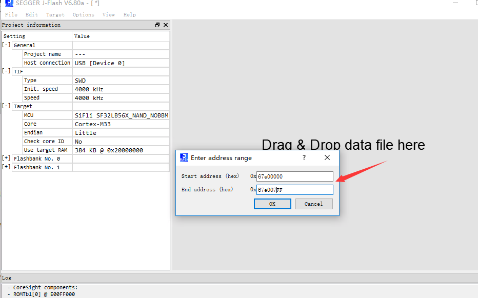  
对于1Gb的56X读4个PAGE 地址示例：
 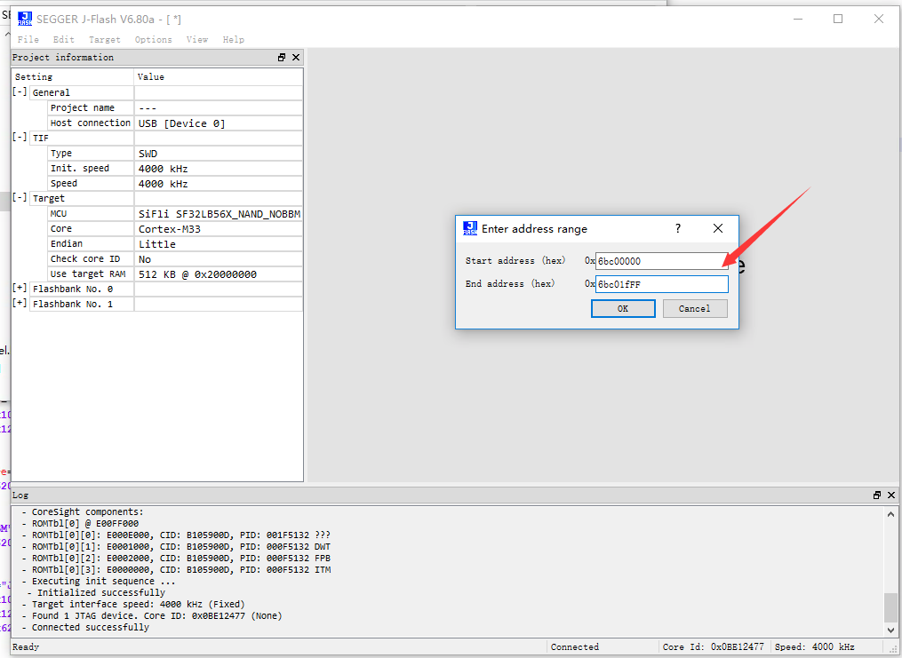 

## 4 BBM数据分析
下图为56X上1Gb颗粒没有坏块信息的BBM表格数据
 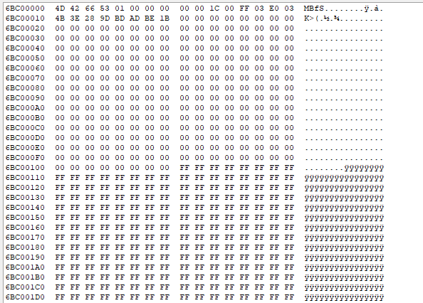 
读取两个块中的BBM信息，除了index和CRC不同，其他信息都是相同的。
另外数据是以小端格式保存，比如下图reserv_blk_start (E0 03) 对用是数据大小为0x03e0， free_blk_start (FF 03) 对应的数据大小为0x3ff.
 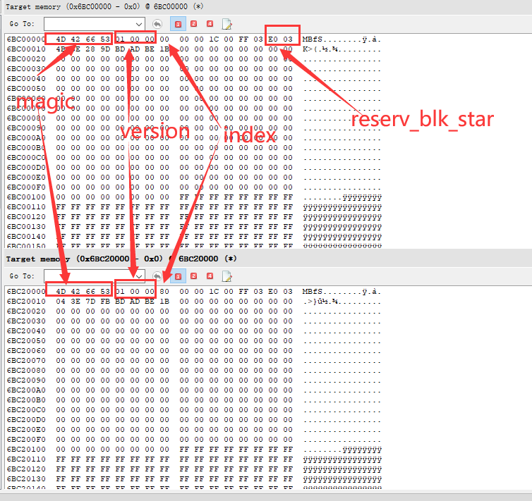 
下图是5个坏块的映射表数据，可以从表中分析出用户区哪些块是坏块，以及对应映射的备份块地址：
  
**BBM 数据格式** 
 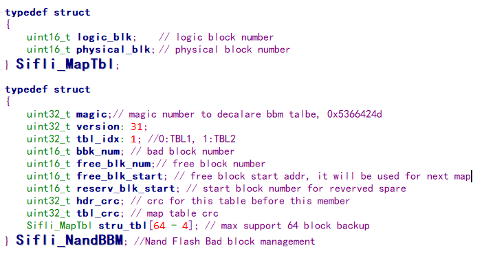 

## 5 BBM常见问题

现在主要遇到的问题包括： 
a) 没有生成BBM表或BBM保存的位置错误，表现为从上面指定的位置不能读到包含magic num的有效表格。 
b)	Free_blk_start 或 reserve_blk_start的数据不对，其中reserve_blk_start 是固定的，即使表格版本更新了，这个数据也不应改变，而固定为BBM起始块号。Free_blk_start 是可变的，而且数据是逐渐递减，初始化时应该是总块号减1 （比如1Gb的颗粒有1024个块，则初始化数应该为0123）；最下不能比reserve_blk_start 还小（理论最小值应该是reserve_blk_start + 4） 
c)	Struc_tbl 里面的数据不合理， 这个数组如果没有发现坏块时，应该数据全部为0， 如果出现坏块需要映射， 则logic_blk 的数据应该为用户区地址的块号 【0 ： reserve_blk_start – 1】； physical_blk的数据应该是备份区可用的块号【reserve_blk_start + 4 ： 最大块号-1】。
