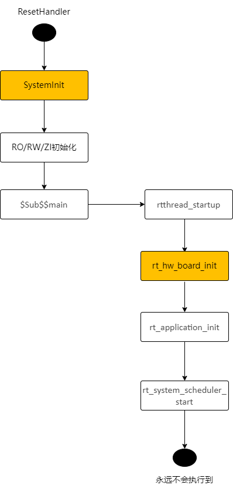
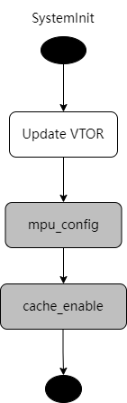
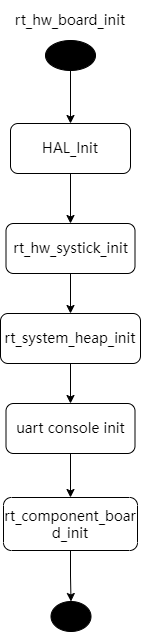
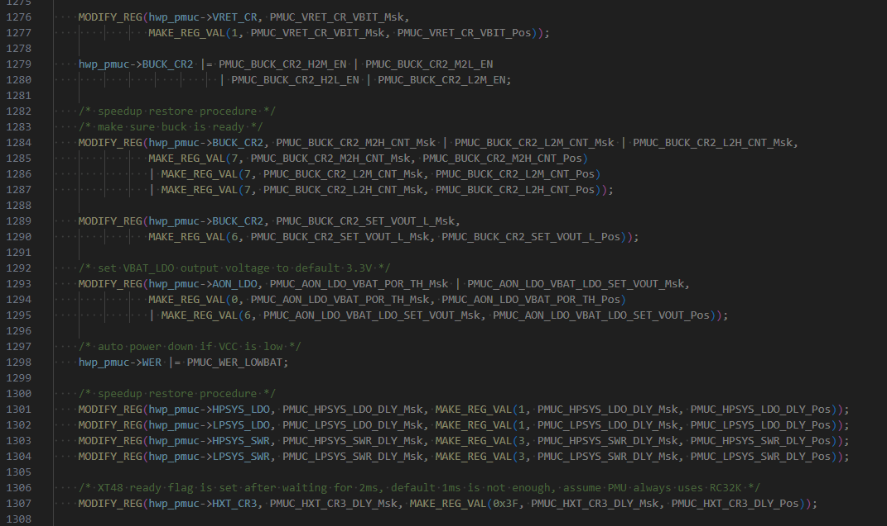
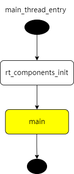

# 1	应用程序启动流程
SF32LB52X为双核芯片，有内置和外置多个存储接口，MPI1为内置存储接口，可接PSRAM与NOR Flash，MPI2和SDMMC为外置存储，MPI2可接NOR/PSRAM/NAND，SDMMC可接SD-NAND或SD-eMMC。应用程序运行在大核，蓝牙Controller协议栈运行在小核，小核不对用户开放，小核的启动由大核的蓝牙Host协议栈控制，用户无需关心。<br>
大核上的应用程序启动流程分为三个阶段：<br>
* 1)	一级Bootloader：固化在SF32LB52X内部的ROM中，加载Flash中的二级Bootloader到RAM中跳转运行
* 2)	二级Bootloader：加载Flash中的应用程序并跳转执行
* 3)	应用程序：用户程序
## 1.1	 一级Bootloader
一级Bootloader固化在了芯片的ROM中，其中断向量表地址为0。上电后会首先运行一级Bootloader，根据芯片封装类型，确定Flash分区表的位置（内部或者外部Flash，下文称为启动Flash），根据Flash分区表指示的二级Bootloader地址（必须在启动Flash上），拷贝二级Bootloader代码到RAM中并跳转运行。<br>
一级Bootloader阶段大核以上电默认的时钟频率运行，初始化启动Flash的IO配置。<br>
## 1.2	 二级Bootloader
二级Bootloader根据芯片封装类型以及Flash分区表，加载应用程序并跳转执行。根据芯片封装类型，应用程序分为以下几种启动方式，运行方式分为XIP（直接以NOR Flash地址执行代码，代码的存储地址与执行地址相同）和非XIP（从Flash拷贝代码到RAM中执行，即代码的存储地址与执行地址不同）两种，不论是哪种启动方式，应用程序与二级Bootloader均存放在同一个启动Flash上，区别只是应用程序代码的运行方式不同：<br>
* 1. 内置NOR Flash（MPI1）：启动Flash为内置NOR Flash，应用程序存储在内置NOR Flash上，以XIP方式运行<br>
* 2. 无内置NOR Flash：<br>
  a. 外置NOR Flash（MPI2）：启动Flash为外置NOR Flash，应用程序存储在外置NOR Flash上，以XIP方式运行<br>
  b. 内置PSRAM（MPI1），外置NAND Flash（MPI2）：启动Flash为外置NAND Flash，应用程序存储在外置NAND Flash上，非XIP执行，即代码被拷贝到内置PSRAM执行<br>
  c. 内置PSRAM，外置SD Flash（SDIO）：同 b)<br>
对于有内置PSRAM的封装类型，二级bootloader会打开LDO1V8并初始化PSRAM。<br>
二级Bootloader会修改默认的时钟配置，具体见下表<br>

|模块|时钟源|频率（MHz）|
|:----|:----|:----|
|DLL1|	/|	144MHz|
|DLL2	|/|	288MHz|
|大核系统时钟|	DLL1|	144MHz|
|内置NOR Flash|	系统时钟|	48MHz|
|内置PSRAM|	DLL2|	144MHz|
|外置Flash|	DLL2|	48MHz|
|外置SD|	DLL2|	|	
|PMU|	默认值	||
|MPU|	Disabled|	|
|Cache|	Disabled|	|

二级Bootloader不加载PMU的校准参数，仅修改所使用的存储相关的IO设置。<br>
Cache未使能，MPU未使能<br>
## 1.3	 应用程序
应用程序的入口函数为ResetHandler（位于drivers\cmsis\sf32lb52x\Templates\arm\startup_bf0_hcpu.S），其执行流程如图1所示，用户主函数main则由rt_application_init创建的main线程调用，见图5 main_thread_entry流程。<br><br>   
Figure 1 ResetHandler流程<br>
SystemInit（drivers/cmsis/sf32lb52x/Templates/system_bf0_ap.c）在变量初始化之前执行（因此这期间不能使用带初值的变量，零段变量也要避免依赖于初值0），更新VTOR寄存器重定向中断向量表，调用mpu_config和cache_enable初始化MPU并使能Cache，这两个函数为weak函数，应用程序中可以重新实现来替换默认的实现。<br>
<br><br> 

Figure 2 SystemInit流程<br> 

rt_hw_board_init完成底层硬件初始化，例如时钟和IO配置，PSRAM和NOR Flash初始化，heap和串口console的初始化。rt_component_board_init是应用程序自定义的初始化函数，随应用程序配置的不同而调用不同的函数。<br>
<br><br>  
Figure 3 rt_hw_board_init流程<br>

HAL_Init完成HAL初始化，加载PMU的校准参数，更新时钟、IO设置， 初始化PSRAM和NOR Flash（根据新的时钟配置），下图中绿色函数为板级驱动函数，每个板子有独立的实现，包括HAL_PreInit、BSP_IO_Init、BSP_PIN_Init和BSP_Power_Up等，灰色函数为虚函数，由应用程序实现，独立于板子，目的是相同板子不同的应用程序可以有自定义的实现，比如不同应用程序在同一块板子上使用不同的IO配置。图4流程图中横向为函数内的嵌套调用子函数，比如HAL_PreInit调用了时钟配置的函数，HAL_MspInit调用BSP_IO_Init，纵向为串行执行的几个函数，如HAL_PreInit执行完再执行HAL_PostMspInit。<br> 
<br><br>   
Figure 4 HAL_Init流程<br> 
Config Clock修改的设置包括：<br> 
* 加载PMU校准值
* 启动GTimer
* 切换PMU到RC32K
* 如果使用外置XT32K，则切换RTC到XT32K
* 配置系统时钟为240MHz(DLL1)
* 配置DLL2为288MHz（与二级bootloader的设置相同）

加载的PMU校准值包括：<br> 
* BUCK_CR1_BG_BUF_VOS_POLAR
* BUCK_CR1_BG_BUF_VOS_TRIM
* LPSYS_VOUT_VOUT
* VRET_CR_TRIM
* PERI_LDO_LDO18_VREF_SEL
* PERI_LDO_LDO33_LDO2_SET_VOUT
* PERI_LDO_LDO33_LDO3_SET_VOUT
* AON_BG_BUF_VOS_POLAR
* AON_BG_BUF_VOS_TRIM
* HXT_CR1_CBANK_SEL（小米分支新增，之前是在rt_component_board_init阶段）
加载校准值的代码可能运行在Flash或PSRAM上。<br> 
HAL_PMU_Init初始化的PMU参数见下图<br> 
<br><br>   

rt_application_init中创建main线程，线程入口函数为main_thread_entry，当放开线程调度后（即调用rt_system_scheduler_start之后），main线程得到调度，进入main_thread_entry函数，先调用rt_components_init初始化组件，随后即调用main函数（应用程序实现），用户代码即从main函数开始，比如rt_driver示例的主函数在example/rt_driver/src/main.c中。
<br><br>   
Figure 5 main_thread_entry流程<br>
对于使用外置NOR的SF32LB523手表方案，可以认为存在两个应用程序，一个是OTA Manager，另一个是User App，二级bootloader先跳转到OTA Manager执行完上述的应用程序启动流程，再跳转到User App中再执行一遍相同的启动流程，区别是一些应用程序自定义的模块初始化会有所不同

## 1.4	 板级驱动接口
每块板子需要实现如下板级驱动函数，可参考customer/boards/eh-lb52xu，
函数名|	必选|	说明
:--|:--|:--
HAL_PreInit|	YES|	建议保持HDK的默认实现
BSP_Power_Up|	NO|唤醒后调用
BSP_IO_Power_Down|	NO|睡眠前调用
BSP_LCD_Reset|	NO| 
BSP_LCD_PowerUp|	NO|屏幕上电时调用
BSP_LCD_PowerDown|	NO|屏幕断电时调用
BSP_TP_Reset|NO| 
BSP_TP_PowerUp|	NO|触控上电时调用
BSP_TP_PowerDown|	NO|触控断电时调用
HAL_MspInit|	NO|	应用程序
HAL_PostMspInit|	NO	| 
BSP_IO_Init|NO(?)|由HAL_MspInit决定是否调用，现在HAL_MspInit默认实现为空函数就，以后可以改成调用BSP_IO_Init，并且提供BSP_IO_Init的标准实现为依次调用BSP_IO_Init和BSP_Power_Up 
BSP_PIN_Init|NO(?)|	由BSP_IO_Init调用，IO配置函数
		

## 1.5	应用程序自定义驱动接口
如果同一块板子的不同应用程序需要实现不同的HAL_MspInit功能，建议将HAL_MspInit的实现置于应用程序目录下，否则可以放在板子目录下。<br> 
函数名|	必选|	说明
:--|:--|:--
HAL_MspInit|NO| 
HAL_PostMspInit|NO| 	


# 2	低功耗流程
## 2.1	睡眠流程
建议使用deepsleep低功耗模式（睡眠模式），该模式下所有RAM数据和硬件配置都能保持，从睡眠模式回到工作状态所需的恢复时间也较短，睡眠期间IO电平可以保持在工作时的状态，但睡眠模式下外设停止工作，CPU只能被有限几个唤醒源唤醒，包括GPIO中断、RTC中断、LPTIM中断以及核间通信中断。对应用程序而言，睡眠模式与工作模式间的切换是透明的，是否进入睡眠模式由最低优先级的IDLE线程控制，当所有高优先级线程都没有任务执行，IDLE线程得到调度后，IDLE线程会检查是否满足睡眠条件，当满足以下所有条件后，即可进入睡眠模式：<br> 
* 1. 没有禁止睡眠模式<br>
* 2. 操作系统最近一个将要超时的定时器时间大于门限，默认门限为100ms<br>
* 3. 不满足唤醒条件，比如使能了某个唤醒源，该唤醒源并未被激活<br>
* 4. 发送给小核的数据已被读走<br> 
进入睡眠模式前会根据操作系统最近一个定时器的超时时间启动LPTIM，LPTIM的中断时间设置为操作系统定时器的超时时间，比如最近一个定时器在200ms后超时，会把LPTIM配置成200ms后触发中断，即200ms后唤醒大核，因此即使进入了睡眠模式，应用程序仍旧可以按时醒来调用操作系统定时器超时函数。<br>
应用程序使用rt_pm_request(PM_SLEEP_MODE_IDLE)禁止进入睡眠模式，直到调用rt_pm_release(PM_SLEEP_MODE_IDLE)释放请求。外设工作时，基于RT-Thread的驱动框架会自动调用rt_pm_request禁止睡眠，避免中断模式下误进入睡眠模式。<br>
deepsleep模式默认的定时器门限为100ms（见下表，定义在bf0_pm.c中），可以使用rt_pm_policy_register注册自定义的策略表，其中thresh表示定时器门限，mode表示大于该门限后可以进入的睡眠模式。<br>
```c
RT_WEAK const pm_policy_t pm_policy[] =
{
#ifdef PM_STANDBY_ENABLE
#ifdef SOC_BF0_HCPU
    {100, PM_SLEEP_MODE_STANDBY},
#else
    {10, PM_SLEEP_MODE_STANDBY},
#endif /* SOC_BF0_HCPU */
#elif defined(PM_DEEP_ENABLE)
#ifdef SOC_BF0_HCPU
    {100, PM_SLEEP_MODE_DEEP},
#else
    {10, PM_SLEEP_MODE_DEEP},
#endif /* SOC_BF0_HCPU */
#else
#ifdef SOC_BF0_HCPU
    {100, PM_SLEEP_MODE_LIGHT},
#else
    {15, PM_SLEEP_MODE_LIGHT},
#endif /* SOC_BF0_HCPU */
#endif /* PM_STANDBY_ENABLE */
};
```
进入睡眠时如果有外设需要掉电降低功耗，可以在BSP_IO_Power_Down中修改配置，相应的可以在BSP_Power_Up中给外设上电，该函数在睡眠醒来后会被调用。<br>
## 2.2	WFI自动降频
进入IDLE线程，但不满足睡眠条件时，大核可以通过降频来降低WFI期间的电流，降频的条件为高速外设不在工作，高速外设包括：
-	EPIC
-	EZIP
-	LCDC
-	USB
-	SD<br>
检查EPIC/EZIP是否在工作并未置于HAL驱动中，而是集成在LVGL图形库中，如果没有使用SDK自带的LVGL实现，需要调用rt_pm_hw_device_start指示高速外设开始工作，避免降频执行WFI，外设结束工作后调用rt_pm_hw_device_stop。<br>
LCDC/USB/SD是否工作的判断集成在了RT_Thread的LCD Device驱动中。<br>
降频后的WFI频率由函数HAL_RCC_HCPU_SetDeepWFIDiv配置，需要注意当有音频外设在工作时，只能降频到48MHz，除此以外可以降频到4MHz，同时要把hwp_hpsys_rcc->DBGR的HPSYS_RCC_DBGR_FORCE_HP比特置1。<br>
## 2.3	场景化动态调频
对于无需高性能计算的场景，大核还可以通过降频降压来降低工作功耗，比如手表灭屏后运行抬腕算法，可以将系统频率降到48MHz，虽然随着CPU频率变慢，算法执行时间也会变长，但总功耗（即电流与时间的乘积）仍旧会更低，可以实测不同运行模式的场景功耗，选择功耗最优的模式。<br>
使用rt_pm_run_enter函数配置当前的运行模式，大核支持下表四个运行模式，推荐使用HIGH_SPEED和MEDIUM_SPEED两个模式。应用程序启动后默认工作在HIGH_SPEED模式。<br>往高速模式切换为立即生效，即当rt_pm_run_enter退出后已切换到高速模式，往低速模式切会延迟到IDLE线程完成，即退出函数后仍旧在原模式，需要等到IDLE得到调度后才会完成切换。<br>
 模式|系统时钟（MHz）
:--|:--:
PM_RUN_MODE_HIGH_SPEED|	240
PM_RUN_MODE_NORMAL_SPEED|	144
PM_RUN_MODE_MEDIUM_SPEED|	48
PM_RUN_MODE_LOW_SPEED|	24

SDK还提供了pm_scenario_start、pm_scenario_stop两个函数方便应用程序根据场景切换，目前支持的场景有UI和Audio，当UI或者Audio场景开启后，使用HIGH_SPEED模式，UI和Audio均为开启时，使用MEDIUM_SPEED模式。<br>
