# 低功耗开发指南
## 1 简介
本文介绍了如何在客户硬件平台上基于 SiFli MCU 芯片的低功耗调试过程。 SiFli MCU 芯片 为双核 Cortex-M33 STAR SoC 芯片。大核 HCPU 工作频率为 0~240MHz，属于 HPSYS 子系统，适用于进行图形、音频、神经网络等高性能运算；小核 LCPU 工作频率为 0~48MHz，属于 LPSYS 子系统，适用于运行蓝牙、传感器收集与运算等任务。<br>
- 低功耗开发例程参考`SDK\example\rt_device\pm\project`
## 2 配置低功耗模式
### 2.1 打开低功耗模式
1. 在 HCPU 和 LCPU 的工程目录下运行 menuconfig 打开软件配置菜单
2. 进入 SiFli Middleware，选中“Enable Low Power Support”，打开中间件的低功耗模式支持，“Enable PM
Debug”为调试开关，如图2-1,打开则会输出低功耗相关的日志，日志具体说明参考3.3节;
<br>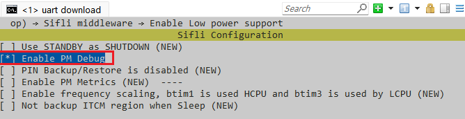<br>   
图 2-1: Middleware Low Power 配置菜单<br>
3. 进入 RTOS → RT-Thread Components → Device Drivers，“Using Power Management Device Drivers”为操作系统的低功耗服务选项，因为已经打开了中间件的低功耗支持，该选项已默认选中。“Enable Standby Mode”用于配置系统是否可进入 STANDBY 低功耗模式，选中则可以进入 STANDBY 模式，如图2-2,未选中则只能进入 LIGHT低功耗模式。需要注意，如果 LCPU 打开了 STANDBY 模式，那么 HCPU 也必须打开 STANDBY 模式。<br>
<br>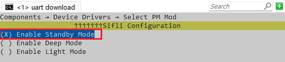<br>  
图 2-2: Device Driver Low Power 配置菜单
1. 配置好后,确认工程配置文件`rtconfig.h`内已包含下面的定义:<br>
```c
#define RT_USING_PM 1 //启动PM模块
//#define PM_DEEP_ENABLE 1 //52 MCU建议用DEEP休眠模式
#define PM_STANDBY_ENABLE 1 //55,58,56建议用STANDBY休眠模式
#define BSP_USING_PM 1  //启动PM模块
#define BSP_PM_DEBUG 1 //打印PM[S],[W]的log
````

### 2.2 关闭低功耗模式
1. 在 HCPU 和 LCPU 的工程目录下运行 menuconfig 打开软件配置菜单
2. 进入 SiFli Middleware，不勾选“Enable Low Power Support”，关闭中间件的低功耗模式支持
3. 进入 RTOS → RT-Thread Components → Device Drivers，不勾选“Using Power Management Device Drivers”，关闭操作系统的低功耗服务。
### 2.3 按键唤醒配置
配置方法参照SDK\example\rt_device\pm\common例程<br>
1. 待机唤醒配置(可以用于standby/deep/light唤醒)<br>

如下是hal层的待机唤醒API函数示例,如果IO唤醒需要处理事件,需要再配置GPIO中断:<br>
```c
HAL_HPAON_EnableWakeupSrc(HPAON_WAKEUP_SRC_PIN3, AON_PIN_MODE_LOW); //55x PA80 #WKUP_A3
HAL_LPAON_EnableWakeupSrc(LPAON_WAKEUP_SRC_PIN5, AON_PIN_MODE_NEG_EDGE);//55x PB48 #WKUP_PIN5
//配置是否生效,可以对照芯片手册查看对应的寄存器:
rt_kprintf("wsr:0x%x,wer:0x%x,\n",hwp_hpsys_aon->WSR,hwp_hpsys_aon->WER); //hcpu
rt_kprintf("wsr:0x%x,wer:0x%x,\n",hwp_lpsys_aon->WSR,hwp_lpsys_aon->WER); //lcpu
```

2. 关机唤醒配置(可以用于hibernate唤醒)<br>

55系列MCU，Hibernate下，只有Lcpu的唤醒PIN0-5才具有唤醒功能，具体查看55系列用户手册PMUC WER寄存器配置
55系列以后的MCU，允许同时存在两个唤醒源PIN0和PIN1，每一个唤醒源可以指定到任意Hcpu/Lcpu的唤醒PIN，具体配置查看用户手册PMUC CR寄存器配置<br>
如下是hal层的关机唤醒API函数示例:<br>
```c
//55x配置方法:
HAL_PMU_EnablePinWakeup(5, AON_PIN_MODE_NEG_EDGE); //55x PB48 #WKUP_PIN5
//配置是否生效,可以对照芯片手册查看对应的寄存器:
rt_kprintf("CR:0x%x,WER:0x%x\n",hwp_pmuc->CR,hwp_pmuc->WER);
//58x,58x,52x配置方法:
HAL_PMU_SelectWakeupPin(0, HAL_HPAON_QueryWakeupPin(hwp_gpio1,BSP_KEY1_PIN)); //select PA34 to wake_pin0
HAL_PMU_EnablePinWakeup(0, AON_PIN_MODE_HIGH);  //enable wake_pin0 
rt_kprintf("CR:0x%x,WER:0x%x\n",hwp_pmuc->CR,hwp_pmuc->WER);
```
Hibernate关机后，唤醒后等同于冷启动（但有PM_HIBERNATE_BOOT标志位），不同于Standby唤醒能恢复到原有程序继续跑，唤醒PIN和电平模式由PMU寄存器来控制,相关配置是否生效，可以打印对应PMU的WER, CR寄存器值对照查看;<br>
**注意:**<br>
如果一个IO口，需要待机和关机都需要唤醒，上述两者都需要配置;<br>
## 3 低功耗模式调试方法
### 3.1 低功耗模式
HPSYS 和 LPSYS 均支持以下四种低功耗模式，方案中仅使用了 IDLE、LIGHT 和 STANDBY 三种模式<br>


* PM_SLEEP_MODE_IDLE：<br>
CPU 停在 WFI 或 WFE 指令，系统有高速时钟，外设可以工作，所有中断都能
唤醒系统退出 WFI 或 WFI 指令
* PM_SLEEP_MODE_LIGHT：<br>
子系统进入 LIGHT 低功耗模式，系统高速时钟关闭，切换到 32K 时钟，外设
停止工作，CPU 与外设均不掉电，可被有限的唤醒源唤醒
* PM_SLEEP_MODE_DEEP：<br>
子系统进入 DEEP 低功耗模式，供电切换到 RET_LDO，系统高速时钟关闭，切
换到 32K 时钟，外设停止工作，CPU 与外设均不掉电，可被有限的唤醒源唤醒
* PM_SLEEP_MODE_STANDBY：<br>
子系统进入 STANDBY 低功耗模式，供电切换到 RET_LDO，系统高速时钟
关闭，切换到 32K 时钟，CPU 与外设均掉电，可被有限的唤醒源唤醒。HCPU 只有 64KB 的 Retention RAM
保持供电，其上的数据不会丢失，其它 RAM 均会掉电，数据无法保留。LCPU 的 RAM 保持供电，数据可
以保持。<br>


各种低功耗模式的电流见表3-1。<br>
方案中，若存在 PSRAM，HCPU 会将掉电 RAM 上需要保存的数据备份到 PSRAM 中，醒来后从 PSRAM 恢复数
据，如果没有 PSRAM，则将 RAM 上需要保存的数据备份到 64KB 的 Retention RAM 中。<br>
下文如无特别说明，子系统进入睡眠模式是指进入 IDLE 模式以外的低功耗模式，唤醒则指退出 IDLE 模式以外
的低功耗模式。<br>
除了每个子系统提供上述四种低功耗模式外，芯片还提供了两个系统级的关机模式（见表3-2）：<br>
• Hibernate 模式：<br>所有子系统掉电，系统切换到 32K 晶体，可以被 PIN 和 RTC 唤醒，RTC 唤醒时间准确。<br>
软件接口为 HAL_PMU_EnterHibernate。<br>
• Shutdown 模式：<br>所有子系统掉电，系统切换到 RC10K，可以被 PIN 和 RTC 唤醒，但 RTC 唤醒时间不准
确。软件接口为 HAL_PMU_EnterShutdown。<br>


表 3-1: 低功耗模式

低功耗模式 |CPU状态 |外设状态| SRAM| 唤醒源| 唤醒时间 |芯片电流 @1.8V
:--|:--|:--|:--|:--|:--|:--
PM_SLEEP_MODE_IDLE| stop| run| 可访问| 任意中断| <0.5us|LPSYS: 0.2mA~0.8mA HPSYS: 1.2mA~5.5mA
PM_SLEEP_MODE_LIGHT| stop| stop| 不可访问，全保留| 唤醒中断| 30us~100us|LPSYS: 186uA HPSYS: 1155uA
PM_SLEEP_MODE_DEEP| stop| stop|LPSYS：不可访问，全保留 HPSYS：不可访问，只保留 64KB|唤醒中断| 100us~1ms|LPSYS: 93uA HPSYS: 316uA
PM_SLEEP_MODE_STANDBY| reset| reset|LPSYS：不可访问，全保留 HPSYS：不可访问，只保留 64KB|唤醒中断| 1ms~2ms| <5uA


表 3-2: 关机模式


|低功耗模式|CPU状态|外设状态|SRAM|IO|唤醒源|唤醒时间|芯片电流 @1.8V|
|:--|:--|:--|:--|:--|:--|:---|:---|
|Hibernate|reset|reset|数据不保留|高阻| RTC和PIN|>2ms|600nA|
|Shutdown|reset|reset|数据不保留|高阻| RTC和PIN|>2ms|250nA|


注：以上电流数据仅供参考，实际数值会因为外设的使能和 IO 设置不同有所增大。stop 表示停止工作，退出低
功耗模式后不需要重新配置即可继续工作；reset 表示停止工作且退出低功耗模式后已被复位，对于 CPU 会从
ROM 开始执行，对于外设需要重新配置才能工作。
### 3.2 低功耗流程
方案中，只有在熄屏之后，HPSYS 才能进入睡眠模式，亮屏状态下，当 HCPU 不工作时，HPSYS 只能进入 IDLE
模式。只有当 HPSYS 进入睡眠模式后，LPSYS 才能进入睡眠模式，如果 HPSYS 没有睡眠，即使 LCPU 不工作，
LPSYS 也只能进入 IDLE 模式(52系列，HCPU和LCPU可以独立休眠的)，在 HPSYS 已睡眠的情况下，LPSYS 可以自由进出睡眠模式，不必唤醒 HPSYS。
#### 3.2.1 熄屏
锁屏时间可在设置界面选择，当屏幕无操作超过锁屏时间后屏幕熄灭，在 IDLE 线程中检查睡眠条件，若满足条
件，则 HPSYS 进入睡眠模式，LPSYS 随之也可进入睡眠模式。
<br>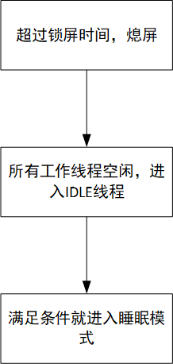<br>
图 3-1: 熄屏流程<br>

#### 3.2.2 HYSYS 唤醒
HPSYS 可被以下事件唤醒
* 按键
* 来自手机 APP 的事件（BLE Notification/ Setting/ Incoming call/ Find device/ 推送……）
* 来自 Sensor 算法的事件（目标达成、久坐提醒、抬腕亮屏、心率异常、历史缓存超出……）
* 闹钟
* 低电池电量提醒
* 充电器插入
HPSYS 被唤醒后可有选择的亮屏，对于以下几种事件，无需亮屏，其它事件都需要唤醒屏幕：
1. 来自手机 APP 的 setting 事件
2. Sensor 的历史缓存超出事件
以按键唤醒亮屏为例，流程如图3-2所示，亮屏之后就进入新一轮的熄屏判断流程。
来自手机 APP 的 setting 事件触发的唤醒流程如下图3-3所示，当处理完 Setting 请求回到 IDLE 线程后可立即进
入睡眠模式。
<br>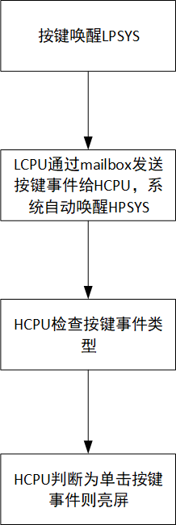<br>
图 3-2: 按键亮屏熄屏流程
<br>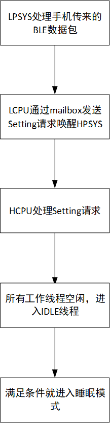<br>
图 3-3: 收到手机 Setting 事件的唤醒流程

#### 3.2.3 LPSYS 唤醒
LPSYS 可被以下事件唤醒
* 按键
* HPSYS 醒来
* Sensor 数据采集定时器超时
* BLE 周期性定时器超时
### 3.3 日志解读
HCPU 和 LCPU 会通过 console 输出日志，按照2.1节的方法打开低功耗调试开关后，可以在日志中搜索表格中的
关键字分析系统的低功耗流程。
表 3-3: 日志关键字解析
日志| 含义
:--|:--
gui_suspend| 熄屏
gui_resume| 亮屏
[pm]S: mode,gtime|进入睡眠模式，mode 指示低功耗模式，2 表示 LIGHT，4 表示 STANDBY。gtime 为当前时间，单位为 32768Hz
[pm]W: gtime| 退出睡眠模式，gtime 为当前时间，单位为 32768Hz
[pm]WSR:0xXXXXX| 唤醒原因

gtime 显示的时间在 HCPU 和 LCPU 两侧是同步的，比如下图3-4中绿色框中的表示系统在 2136602 时刻进入睡
眠，在 2142330 时刻醒来，唤醒原因为 0x200，由此可知睡眠时长为 sleep_time=(2142330-2136602)/32768=175ms，
唤醒原因为 LPSYS 触发的 mailbox 中断。WSR 的某个比特为 1 表示因为相应的源触发了唤醒，每个比特的含义参见对应芯片手册寄存器表;<br>
表3-4，表3-5，表3-6为55系列MCU相关配置(数据来源于SF32LB55x-用户手册,4.3 HPSYS_AON 寄存器,4.4 LPSYS_AON 寄存器)。
<br>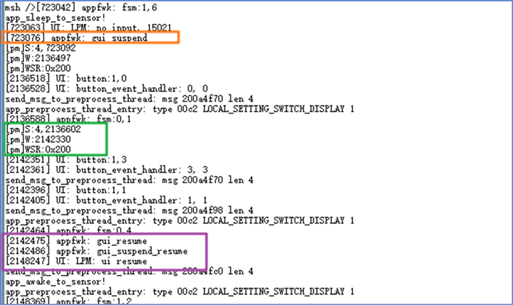<br>
图 3-4: 低功耗日志日志示例

**表 3-4: 55系列 HPSYS 的 WSR 含义**
|比特域| 含义|
|:--|:--
|[0]| RTC 唤醒|
|[1]| LPTIM1 唤醒|
|[2]| PIN0 唤醒|
|[3]| PIN1 唤醒|
|[4]| PIN2 唤醒|
|[5]| PIN3 唤醒|
|[8]| LPSYS 手动唤醒 HPSYS|
|[9]| LPSYS 使用 Mailbox 唤醒 HPSYS|

**表 3-5: 55系列 HPSYS 唤醒 PIN 映射表**

|唤醒| PIN 含义|
:--|:--
PIN0| PA77
PIN1| PA78
PIN2| PA79
PIN3| PA80

**表 3-6: 55系列 LPSYS 的 WSR 含义**

比特域| 含义
:--|:--
[0]| RTC 唤醒
[1]| LPTIM2 唤醒
[2]| LPCOMP1 唤醒
[3]| LPCOMP2 唤醒
[4]| BLE 唤醒
[5]| PIN0 唤醒
[6]| PIN1 唤醒
[7]| PIN2 唤醒
[8]| PIN3 唤醒
[9]| PIN4 唤醒
[10]| PIN5 唤醒
[11]| HPSYS 手动唤醒 LPSYS
[12]| HPSYS 使用 Mailbox 唤醒 LPSYS

**表 3-7: 55系列 LPSYS 唤醒 PIN 映射表**

唤醒| PIN 含义
:--|:--
PIN0| PB43
PIN1| PB44
PIN2| PB45
PIN3| PB46
PIN4| PB47
PIN5| PB48

### 3.4 常见问题分析
由于进入睡眠模式后 SWD 无法连接，必须使用 UART 作为 console 端口抓取日志分析问题。
#### 3.4.1 是否进入睡眠模式
如果满足以下任意一个条件，则很有可能 HPSYS 进入了睡眠模式

- SWD 无法连接
- HCPU 的 console 没有应答
- HCPU 的日志中出现“s: mode, gtime”
  
如果满足以下任意一个条件，则很有可能 LPSYS 进入了睡眠模式

- LCPU 的 console 没有应答
- LCPU 的日志中出现“s: mode, gtime”
  
需要确认 LCPU 已打开了 Command shell 中的 finsh shell 选项。
- 也可以通过测量芯片的电源管脚电压，可以判断当前处于何种低功耗模式。<br>
当 HPSYS 处于 active，sleep 或 deepsleep 模
式时，LDO1_VOUT 电压保持 1.1V。当 HPSYS 处于 standby 模式时，LDO1_VOUT 电压无法保持，会逐渐下降到
0V。当 LPSYS 处于 active，sleep 或 deepsleep 模式时，LDO2_VOUT 或 BUCK2_VOUT 电压保持 0.9V。当 LPSYS
处于 standby 模式时，LDO2_VOUT 或 BUCK2_VOUT 电压无法保持，会逐渐下降到 0V。当芯片进入 hibernate 模
式时，LDO1_VOUT，LDO2_VOUT，BUCK2_VOUT 和 VDD_RET 都下降到 0V。<br>
55系列 低功耗模式下的电源管脚电压,参照图 3-5(数据来源于SF32LB55x-用户手册,4.2.9 判断当前低功耗模式)
<br>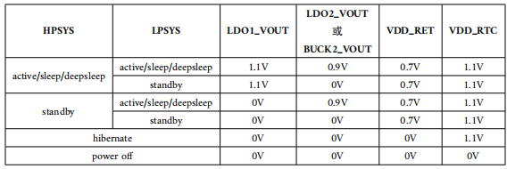<br>

**图 3-5: 55系列 低功耗模式下的电源管脚电压**

#### 3.4.2 为什么没有进入睡眠模式
当CPU空闲时进入睡眠模式需要同时满足以下条件：
- 打开了PM模块
- CPU已空闲并进入idle线程
- 未禁止进入睡眠模式
- 操作系统的定时器超时时间大于睡眠门限
- 没有唤醒源存在
- 发送给另外一个核的数据已经被读走
若HCPU或者LCPU出现无法睡眠，可以参考例程`SDK\example\rt_device\PM`,按以下方法逐个排查,Hcpu和Lcpu排查方法一样
1. 打开PM模块<br>
确认rtconfig.h中已经生成了如下宏:
```c
#define RT_USING_PM 1
#define BSP_USING_PM 1 //开启低功耗模式
#define PM_STANDBY_ENABLE 1 //进入standby模式的低功耗 # 55,58,56系列建议standby休眠
//#define PM_DEEP_ENABLE 1 //进入Deep模式的低功耗 # 52系列建议Deep休眠
#define BSP_PM_DEBUG 1 //打开低功耗模式调试log
```
2. 确认CPU已空闲并进入idle线程<br>
可以通过finsh串口命令：list_thread看下所有线程的状态，只有除了tshell和tidle是ready的，其他应该都是suspend状态，否则一直处于 ready 的线程会导致 IDLE 线程无法运行，系统进入不了睡眠。 如下图，我在app_watch_entry()函数中，添加了一条__asm("B .");死循环指令，导致app_watch的线程无法进入suspend，导致无法睡眠
<br>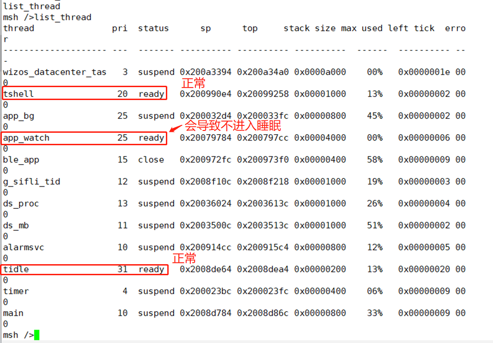<br>
图 3-6: list_thread 命令返回的信息

3. 确认未禁止进入睡眠<br>
在console中发送命令`pm_dump`，出现如图3-7信息，如果 Idle Mode 的 Counter 大于 0，则表示有模块调
用`rt_pm_request(PM_SLEEP_MODE_IDLE)`禁止了睡眠，检查代码是否漏调用了`rt_pm_release(PM_SLEEP_MODE_IDLE)`解除了睡眠抑制。如果为 0，则表示没有禁止睡眠。
<br>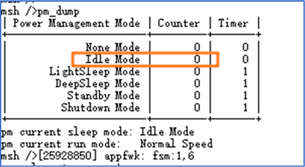<br>
图 3-7: pm_dump 命令返回的信息

4. 确认操作系统的定时器超时时间大于睡眠门限<br>
在 console 中发送命令`list_timer`，显示操作系统的所有已创建的定时器，将 flag 为 activated 定时器的 timeout
值与睡眠门限作比较，若小于睡眠门限，则表示因为该定时器导致无法进入睡眠。操作系统定时器timeout 的单位为 ms。
<br>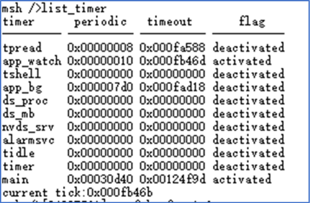<br>
图 3-8: list_timer 命令返回的信息
见如下配置,HPSYS 的睡眠门限默认为100ms，LPSYS 的睡眠门限为 10ms<br>
```c
RT_WEAK const pm_policy_t pm_policy[] =
{
#ifdef PM_STANDBY_ENABLE
#ifdef SOC_BF0_HCPU
    {100, PM_SLEEP_MODE_STANDBY}, //Hcpu 当100ms之内没有定时器唤醒,就进入standby休眠
#else
    {10, PM_SLEEP_MODE_STANDBY}, //Lcpu 当10ms之内没有定时器唤醒,就进入standby休眠
#endif /* SOC_BF0_HCPU */
#elif defined(PM_DEEP_ENABLE)
#ifdef SOC_BF0_HCPU
    {100, PM_SLEEP_MODE_DEEP}, //Hcpu 当100ms之内没有定时器唤醒,就进入Deep休眠
#else
    {10, PM_SLEEP_MODE_DEEP}, //Lcpu 当10ms之内没有定时器唤醒,就进入Deep休眠
#endif /* SOC_BF0_HCPU */
#else
#ifdef SOC_BF0_HCPU
    {100, PM_SLEEP_MODE_LIGHT},
#else
```
见如下代码,如果Hcpu代码中存在90ms的延时(90ms定时器唤醒),Hcpu则永远不会进入休眠<br>
```c
while(1)
{
    rt_thread_delay(90); //90ms delay
}
```

**注意延时函数区别:**<br>
a. HAL 层延时函数：（等同于 while 中指令循环，延时时不会切到其他线程）<br>
```c
HAL_Delay(10); /* 延时 10ms */<br>
HAL_Delay_us(10); /* 延时 10us */<br>
```
b. RTT 接口的延时函数：<br>
```c
rt_thread_delay(100); /* 延时 100ms */<br>
```
RTT 接口的延时函数执行时，会切换到其他线程，比如 ilde 线程，<br>
当睡眠门限低于延时时长时会进入 Standby 睡眠。<br>
5. 确认没有存在没有处理的唤醒源<br>
如果存在唤醒源，没有清掉，就不会进入睡眠(因为睡下去也会被唤醒)，可以通过串口命令，去读Hcpu和Lcpu的WSR寄存器， 在 console 中发送命令 regop read 读取 WER 和 WSR 寄存器，检查是否有唤醒源导致无法睡眠。例如55系列HPSYS 的寄存器地址为 0x40030018 和 0x4003001C，LPSYS 的寄存器地址为 0x40070018 和 0x4007001C。<br>
```
regop unlock 0000
regop read 4007001c 1
regop read 4003001c 1
```
也可以连上Jlink/SifliUsartServer等调试器读取寄存器的值，还可以通过log打印的方式，获取WSR的值，参照对应芯片手册寄WSR寄存器对照具体唤醒源.
```c
rt_kprintf("wsr:0x%x,wer:0x%x,\n",hwp_hpsys_aon->WSR,hwp_hpsys_aon->WER); //hcpu
rt_kprintf("wsr:0x%x,wer:0x%x,\n",hwp_lpsys_aon->WSR,hwp_lpsys_aon->WER); //lcpu
```
常见的就是唤醒pin的电平状态不对，比如设置的低电平唤醒，但是该唤醒pin电平却是一直低电平<br>
6. 确认给另外一个核的数据已经被读走<br>
可以通过Ozone连接、dump内存后用trace32查看或者log打印的方式，查看看ipc_ctx变量中每一个queues为active的tx_buffer，来看是否存在数据没有被取走，如图3-9，read_idx_mirror和write_idx_mirror正常为相等或者为空，如果不相等， 即有数据没有被取走， 会导致无法进入睡眠,如下非空数据没取走不能睡眠情况：
<br>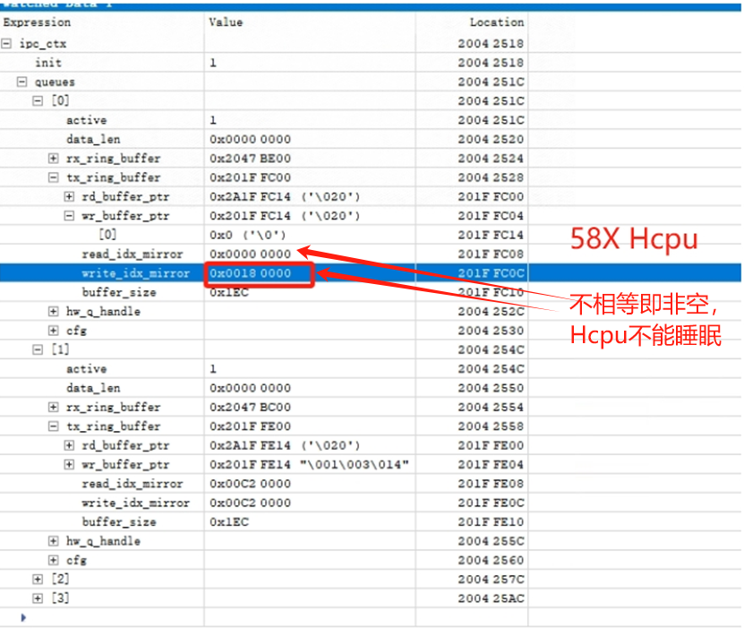<br>
图 3-9: read_idx_mirror和write_idx_mirror非空的情形<br>
如图3-10为数据为空的情形<br>
<br><br>
图 3-10: read_idx_mirror和write_idx_mirror空的情形<br>
下面是log打印出每个active为1的read_idx_mirror和write_idx_mirror内容<br>
```c
for(i=0;i<IPC_LOGICAL_QUEUE_NUM;i++)
{
    if(ipc_ctx.queues[i].active == true)
    {
        if(ipc_ctx.queues[i].rx_ring_buffer != NULL)
        {
            if(ipc_ctx.queues[i].tx_ring_buffer != NULL)
            {
                LOG_I("ipc_ctx.queues[%d].tx read_idx_mirror=0x%x,write_idx_mirror=0x%x\n",i,ipc_ctx.queues[i].tx_ring_buffer->read_idx_mirror,ipc_ctx.queues[i].tx_ring_buffer->write_idx_mirror);
            }
        }
    }
}
```
如图3-11，Hcpu由于Lcpu没有开启data service服务，缺失qid=1的通道，Hcpu发的数据，Lcpu没有取走，导致Hcpu不进入睡眠的例子
<br><br>

## 4 功耗优化方法
### 4.1 待机漏电分析
如果 HPSYS 和 LPSYS 都已进入睡眠模式，整机功耗优化的重点从下面三点展开:<br>
1，屏,外设sensor，充电ic，这些能拆掉的先拆掉,查看最小系统电流;<br>
2，软件上IO电平配置不对，形成电压差，导致漏电，输入IO没有上下拉导致浮空漏电;<br>
3，芯片内部psram/flash和外部nand/flash/emmc没有进入休眠;<br>
如果硬件可以拆解电流，可以具体用电流表查看是哪一路供电的漏电，VSYS,VLDO2,VLDO3,VDD_SIP,VDDIOA?<br>
这样可以缩少查的范围<br>

#### 4.1.1 外设漏电
1） 板级器件未断电<br>
2） 板级器件已掉电，但芯片管脚设置不正确导致电流由芯片管脚倒灌入板级器件<br>
针对 2），要避免连接掉电器件的芯片管脚输出高或者使能了上拉电阻。
根据前述对漏电原因的分析，常用外设管脚在工作状态和睡眠状态下的配置方法见表格4-1，当外部电路不掉电时，由于电路状态没有发生变化，即使进入睡眠模式也无需改变管脚配置，只有当外部电路掉电时才需修改相关管脚的设置，因此如果在未睡眠的情况下外部电路就已掉电，应立即修改管脚设置降低功耗，类似的，如果睡眠醒来后外部电路仍旧处于掉电状态，因为管脚设置会因为掉电而恢复默认值，需要再次修改为掉电状态的设置。
<br>表 4-1: 管脚推荐设置<br>
外设| 管脚| 方向| 工作状态| 睡眠（外部电路不掉电）|睡眠（外部电路掉电）
:--|:--|:--|:--|:--|:--
PSRAM|PSRAM_CLK| O| 数字输出| 数字输出| GPIO 模式输出低
PSRAM|PSRAM_CLKB| O| 数字输出| 数字输出| GPIO 模式输出低
PSRAM|PSRAM_CS| O |数字输出| 数字输出 |GPIO 模式输出低
PSRAM|PSRAM_DM0| O |数字输出 |数字输出| GPIO 模式输出低
PSRAM|PSRAM_DM1| O| 数字输出| 数字输出| GPIO 模式输出低
PSRAM|PSRAM_DQS0| I/O| 数字输入下拉| 数字输入下拉| 数字输入下拉
PSRAM|PSRAM_DQS1| I/O |数字输入下拉| 数字输入下拉| 数字输入下拉
PSRAM|PSRAM_DQx |I/O |数字输入下拉| 数字输入下拉 |数字输入下拉
QSPI|QSPIx_CLK| O| 数字输出| 数字输出| GPIO 模式输出低
QSPI|QSPIx_CS| O| 数字输出| 数字输出| GPIO 模式输出低
QSPI|QSPIx_DIO0| I/O| 数字输入下拉| 数字输入下拉| 数字输入下拉
QSPI|QSPIx_DIO1| I/O| 数字输入下拉| 数字输入下拉| 数字输入下拉
QSPI|QSPIx_DIO2| I/O| 数字输入上拉| 数字输入上拉| 数字输入下拉
QSPI|QSPIx_DIO3| I/O| 数字输入上拉| 数字输入上拉| 数字输入下拉
QSPI|QSPIx_DIO4| I/O| 数字输入下拉| 数字输入下拉| 数字输入下拉
QSPI|QSPIx_DIO5| I/O| 数字输入下拉| 数字输入下拉| 数字输入下拉
QSPI|QSPIx_DIO6| I/O| 数字输入上拉| 数字输入上拉| 数字输入下拉
QSPI|QSPIx_DIO7| I/O| 数字输入上拉| 数字输入上拉| 数字输入下拉
USART|USARTx_RXD| I |数字输入上拉| 数字输入上拉| 数字输入下拉
USART|USARTx_TXD| O |数字输出| 数字输出| 数字输出
USART|USARTx_CTS| I| 数字输入上拉| 数字输入上拉 |数字输入下拉
USART|USARTx_RTS| O |数字输出| 数字输出 |数字输出
I2C|I2Cx_SCL| I/O| 数字输入| 数字输入| 数字输入下拉
I2C|I2Cx_SDA| I/O |数字输入| 数字输入| 数字输入下拉
SPI Master|SPIx_CLK| O |数字输出| 数字输出| GPIO 模式输出低
SPI Master|SPIx_CS| O |数字输出| 数字输出| GPIO 模式输出低
SPI Master|SPIx_DI| I |数字输入下拉| 数字输入下拉| 数字输入下拉
SPI Master|SPIx_DO| O |数字输出 |数字输出| GPIO 模式输出低
SPI Master|SPIx_DIO| I/O| 数字输入下拉| 数字输入下拉| 数字输入下拉
LCDC SPI|LCDCx_SPI_CS| O |数字输出| 数字输出| GPIO模式输入下拉
LCDC SPI|LCDCx_SPI_CLK| O |数字输出 |数字输出| GPIO 模式输入下拉
LCDC SPI|LCDCx_SPI_DIO0| I/O| 数字输入下拉| 数字输入下拉| GPIO 模式输入下拉
LCDC SPI|LCDCx_SPI_DIO1| O |数字输出| 数字输出 |GPIO 模式输入下拉
LCDC SPI|LCDCx_SPI_DIO2| O |数字输出| 数字输出| GPIO 模式输入下拉
LCDC SPI|LCDCx_SPI_DIO3| O |数字输出| 数字输出| GPIO 模式输入下拉
LCDC SPI|LCDCx_SPI_RSTB| O |数字输出| 数字输出| GPIO 输出低
LCDC SPI|LCDCx_SPI_TE| I |数字输入| 数字输入| GPIO 模式输入下拉
SDIO|SD_CLK| O |数字输出 |数字输出| GPIO 模式输出低
SDIO|SD_CMD| I/O| 数字输入上拉| 数字输入上拉| 数字输入下拉
SDIO|SD_DIOx| I/O |数字输入上拉| 数字输入上拉| 数字输入下拉
I2S|I2S1_BCK| O |数字输出 |数字输出 |GPIO 模式输出低
I2S|I2S1_LRCK |O |数字输出 |数字输出 |GPIO 模式输出低
I2S|I2S1_SDI |I |数字输入下拉 |数字输入下拉 |数字输入下拉
I2S|I2S2_BCK |O |数字输出| 数字输出| GPIO 模式输出低
I2S|I2S2_LRCK| O |数字输出| 数字输出 |GPIO 模式输出低
I2S|I2S2_SDI| I |数字输入下拉| 数字输入下拉| 数字输入下拉
I2S|I2S2_SDO| O |数字输出 |数字输出 |GPIO 模式输出低
PDM|PDM_CLK |O |数字输出| 数字输出 |GPIO 模式输出低
PDM|PDM_DATA| I| 数字输入下拉| 数字输入下拉| 数字输入下拉
GPTIM输出| GPTIMx_CHx| O |数字输出| 数字输出 |GPIO 模式输出低
GPTIM输入| GPTIMx_CHx| I |数字输入下拉| 数字输入下拉| 数字输入下拉
GPTIM |GPTIMx_ETR |I |数字输入下拉| 数字输入下拉 |数字输入下拉
GPIO Input| GPIO| I| 数字输入| 数字输入| GPIO 输出低或者数字输入下拉
GPIO Output| GPIO| O |数字输出 |数字输出| GPIO 模式输出低

#### 4.1.2 芯片IO内部漏电
在FAQ常见问题解答的
[8.7 Standby待机和Standby关机IO内部常见的漏电模型](../../faq/mcu/low_power.md#87_Standby待机和Standby关机IO内部常见的漏电模型)和
[8.8 Hibernate关机常见的唤醒IO内部漏电模型](../../faq/mcu/low_power.md#88_Hibernate关机常见的唤醒IO内部漏电模型)中有详细介绍;<br>
可以归纳为:<br>
1） 输入管脚悬空（对端设备断电等同于管脚悬空）导致电平不确定<br>
2） IO输出电平和内外部上下拉电阻不匹配<br>
如图 4-1: 管脚内部结构图,功能描述如下：<br>
-	DS – driving strength
-	OE – output enable
-	O   – output
-	I     – input
-	IE   – input enable
-	PE  – pull enable
-	PS  – pull select
组合控制可以实现日常使用的功能；<br>
推挽输出（push-pull）<br>
-	OE = 1，O = 0/1
开漏输出（open-drain）<br>
-	OE = 0/1，O = 0
<br>图 4-1: 管脚内部结构图<br>
<br><br>
**注意:**<br>
55系列,USB的PA01口内部默认有个 18K 欧姆的下拉电阻，当输出高或者外接高电平时会产生漏电，处理方法参考FAQ常见问题解答的章节 [1.6 55系列MCU复用USB的PA01/PA03漏电风险](../../faq/mcu/gpio.md#16_55系列MCU复用USB的PA01)

#### 4.1.3 芯片内外部存储芯片漏电
1. PSRAM进出Half_sleep的方法<br>
```c
void BSP_Power_Up(bool is_deep_sleep)
{
#ifdef SOC_BF0_HCPU
    if (!is_deep_sleep)
    {
#if defined(BSP_USING_PSRAM1)
        rt_psram_exit_low_power("psram1"); //退出half_sleep
#endif
    }
    //以下省略
}
void BSP_IO_Power_Down(int coreid, bool is_deep_sleep)
{
#ifdef SOC_BF0_HCPU
    if (coreid == CORE_ID_HCPU)
    {
#if defined(BSP_USING_PSRAM1)
        rt_psram_enter_low_power("psram1");  //进入half_sleep
#endif
    }
#else
    //以下省略
#endif
}
```
2. Flash掉电和进出deep_sleep的方法<br>
下面代码演示nor flash掉电和进出deep sleep的方法:<br>
```c
HAL_RAM_RET_CODE_SECT(BSP_PowerDownCustom, void BSP_PowerDownCustom(int coreid, bool is_deep_sleep))
{
#ifdef SOC_BF0_HCPU
#ifdef BSP_USING_NOR_FLASH2
    HAL_PMU_ConfigPeriLdo(PMU_PERI_LDO2_3V3, false, true); //关闭nor flash供电的方法

    HAL_PIN_Set(PAD_PA16, GPIO_A16, PIN_PULLDOWN, 1); //关闭供电后,flash的IO需要改成下拉
    HAL_PIN_Set(PAD_PA12, GPIO_A12, PIN_PULLDOWN, 1);
    HAL_PIN_Set(PAD_PA15, GPIO_A15, PIN_PULLDOWN, 1);
    HAL_PIN_Set(PAD_PA13, GPIO_A13, PIN_PULLDOWN, 1);
    HAL_PIN_Set(PAD_PA14, GPIO_A14, PIN_PULLDOWN, 1);
    HAL_PIN_Set(PAD_PA17, GPIO_A17, PIN_PULLDOWN, 1);

    HAL_PIN_Set(PAD_PA35, GPIO_A35, PIN_PULLDOWN, 1);
    HAL_PIN_Set(PAD_PA36, GPIO_A36, PIN_PULLDOWN, 1);
#elif defined(BSP_USING_NOR_FLASH1)
    FLASH_HandleTypeDef *flash_handle;
    flash_handle = (FLASH_HandleTypeDef *)rt_flash_get_handle_by_addr(MPI1_MEM_BASE);
    HAL_FLASH_DEEP_PWRDOWN(flash_handle); //nor flash 进入deep sleep的方法,这种方式,IO的状态不需要修改
    HAL_Delay_us(3);
#endif /* BSP_USING_NOR_FLASH2 */
#else
    {
        ;
    }
#endif

HAL_RAM_RET_CODE_SECT(BSP_PowerUpCustom, void BSP_PowerUpCustom(bool is_deep_sleep))
{
#ifdef SOC_BF0_HCPU
    if (!is_deep_sleep)
    {
#ifdef BSP_USING_NOR_FLASH2
        HAL_PIN_Set(PAD_PA16, MPI2_CLK,  PIN_NOPULL,   1); //打开nor flash供电前,先配置IO为工作态
        HAL_PIN_Set(PAD_PA12, MPI2_CS,   PIN_NOPULL,   1);
        HAL_PIN_Set(PAD_PA15, MPI2_DIO0, PIN_PULLDOWN, 1);
        HAL_PIN_Set(PAD_PA13, MPI2_DIO1, PIN_PULLDOWN, 1);
        HAL_PIN_Set(PAD_PA14, MPI2_DIO2, PIN_PULLUP,   1);
        HAL_PIN_Set(PAD_PA17, MPI2_DIO3, PIN_PULLUP, 1);

        HAL_PIN_Set(PAD_PA35, GPIO_A35, PIN_PULLUP, 1);
        HAL_PIN_Set(PAD_PA36, GPIO_A36, PIN_PULLUP, 1);

        HAL_PMU_ConfigPeriLdo(PMU_PERI_LDO2_3V3, true, true); // 打开nor flash供电

        BSP_Flash_hw2_init(); //断电后,需要重初始化nor flash
#elif defined(BSP_USING_NOR_FLASH1)
        FLASH_HandleTypeDef *flash_handle;
        flash_handle = (FLASH_HandleTypeDef *)rt_flash_get_handle_by_addr(MPI1_MEM_BASE);
        HAL_FLASH_RELEASE_DPD(flash_handle); //nor flash退出deep sleep
        HAL_Delay_us(20); //退出 deep sleep后需要一定延时,具体延时需要查看flash芯片手册(ABH命令后的tRES1时间)
#endif
#endif /* BSP_USING_NOR_FLASH2 */
    }
    else if (PM_STANDBY_BOOT == SystemPowerOnModeGet())
    {
    }
#elif defined(SOC_BF0_LCPU)
    {
        ;
    }
#endif
}
```
**注意:**<br>
对于代码XIP运行在nor flash的情况下,操作nor flash进入休眠的代码要声明放在RAM内运行`HAL_RAM_RET_CODE_SECT`
### 4.2 代码实现
管脚的配置代码实现在开发板的 pinmux.c 和 drv_io.c(55系列),bsp_power.c(58,56,52系列) 文件中，需要根据开发板的 IO 功能定义与硬件设计实现
`BSP_PIN_Init`、`BSP_Power_Up` 和 `BSP_IO_Power_Down` 等接口。

#### 4.2.1 工作状态管脚设置
BSP_PIN_Init 在冷启动和 STANDBY 醒来都会被执行一次，可以在 BSP_PIN_Init 中设定工作状态下每个管脚的
功能和输入输出模式。<br>
使用函数 HAL_PIN_Set 选择管脚的功能以及上下拉属性。比如下面的示例代码将 PB46 管脚配置为 USART3_RX 功能，并设置为数字输入上拉模式。
```c
HAL_PIN_Set (PAD_PB46, USART3_RXD, PIN_PULLUP, 0);
```
对于用于输出的IO，如果配置了`PIN_NOPULL`模式,而又没有进行GPIO输出，就会出现输入口悬空漏电的情况，<br>
```c
HAL_PIN_Set(PAD_PA35, GPIO_A35, PIN_NOPULL, 1);
```
如上:如果只是配置PA35为IO,`PIN_NOPULL`,后续并没有配置GPIO输出高低，否则 GPIO 管脚默认为输入模式，就会出现输入口悬空漏电的情况,还需要调用 GPIO 接口输出确定电平，可以HAL层函数 BSP_GPIO_Set 设置 GPIO 的输出电平,RTOS起来后,用diver层输出高低也可以。<br>
如果想恢复到输入模式，可以调用 HAL_GPIO_DeInit。<br>
#### 4.2.2 睡眠状态管脚设置
在drv_io.c(55系列),bsp_power.c(58,56,52系列) 文件中用户可以实现以下几个虚函数，用于在进出睡眠模式时动态切换管脚设置，优化整机功耗。<br>
<br>表 4-2: 睡眠状态的管脚设置 API<br>
函数名 |说明|
:--|:--
BSP_IO_Power_Down| 进入睡眠前执行
BSP_Power_Up| 唤醒后执行(对于 STANDBY 模式唤醒，在 BSP_PIN_Init 后执行)
BSP_TP_PowerDown| 熄屏后执行
BSP_TP_PowerUp| 亮屏前执行
BSP_LCD_PowerDown| 熄屏后执行
BSP_LCD_PowerUp| 亮屏前执行

<br>**注意:**<br>
52系列采用Deep休眠,流程会不太一样,参考休眠流程52系列章节<br>

如果板级器件的掉电和上电控制都伴随睡眠进行，可以在 BSP_IO_Power_Down 中将板级器件断电并修改相应的
管脚设置，反向操作则在 BSP_Power_Up 中完成。但这种方法的缺点是控制不够精细，比如熄屏后，可能过一段
时间 HPSYS 才会进入睡眠，在此之前如果仍旧给 LCD 供电的话就会增加耗电，或者当 HPSYS 被唤醒执行一段
时间任务但又不需要亮屏时，如果在 BSP_Power_Up 中就打开屏幕的供电，也会增加耗电。
为此，用户可以在 BSP_IO_Power_Down 和 BSP_Power_Up 中实现更复杂的控制逻辑。以屏幕与触控为例，将屏幕
与触控的掉电处理放在 BSP_TP_PowerDown 和 BSP_LCD_PowerDown 中，这样一旦熄屏后屏幕与触控芯片即可
马上断电，而在 BSP_Power_Up 里需要再次调用 BSP_TP_PowerDown 和 BSP_LCD_PowerDown，这样即使 HPSYS
被唤醒，也可以将管脚的设置恢复到掉电状态，如果满足了亮屏条件，系统会在亮屏前调用 BSP_TP_PowerUp 和
BSP_LCD_PowerUp 恢复屏幕与触控的供电与工作状态下的管脚设置。
### 4.3 休眠流程
#### 56系列
* hcpu休眠唤醒<br>
在 hcpu 进入 idle 线程，并判断是否符合休眠条件，会按下面流程进行休眠和唤醒<br>
`rt_thread_idle_entry->rt_system_power_manager->_pm_enter_sleep->'pm->ops->sleep(pm, mode);->sifli_sleep -> log 打印[pm]S:4,11620140 -> RT_DEVICE_CTRL_SUSPEND 设备挂起 -> 
sifli_standby_handler ->BSP_IO_Power_Down-> 汇编 WFI 进入 standby-> 定时器或者IO唤醒 -> 函数
SystemInitFromStandby -> HAL_Init -> BSP_IO_Init-> restore_context-> PC 指针设置到 sifli_standby_handler 函数 WFI 后指令继续运行 -> BSP_Power_Up-> 执行 RTT 设备 RT_DEVICE_CTRL_RESUME 设备恢复函数 -> log 打印[pm]W:11620520 -> log 打印[pm]WSR:0x80`<br>
* LCPU休眠唤醒<br>
Lcpu休眠唤醒流程跟 hcpu 待机流程基本一样，差异点：<br>
`sifli_standby_handler-> sifli_standby_handler_core->休眠时IO配置函数BSP_IO_Power_Down->内存休眠函数soc_power_down-> 汇编 WFI 进入 standby->定时器或者IO唤醒 -> 函数 SystemPowerOnModeInit ->SystemPowerOnInitLCPU-> HAL_Init-> BSP_IO_Init-> restore_context-> 设置到 WFI 指令后继续执行  -> 内存退出休眠函数soc_power_up-> IO休眠后配置函数BSP_Power_Up-> 执行 RTT 设备 RT_DEVICE_CTRL_RESUME 设备恢复函数 -> log 打印[pm]W:11620520 -> log 打印[pm]WSR:0x80`<br>
#### 55系列
* 55系列跟56系列待机流程一样，差异点在唤醒的函数不一样<br>
`定时器或者IO唤醒 -> 函数SystemPowerOnModeInit -> HAL_Init -> BSP_IO_Init->restore_context-> PC 指针设置到 sifli_standby_handler 函数 WFI 后指令继续运行 -> BSP_Power_Up-> 执行 RTT 设备 RT_DEVICE_CTRL_RESUME 设备恢复函数 -> log 打印[pm]W:11620520 -> log 打印[pm]WSR:0x80`<br>

* Lcpu唤醒流程56系列一样<br>
#### 52系列
* 52系列跟56系列的待机流程差异的点在进的是`sifli_deep_handler();`待机函数,并且少了外设的SUSPEND/RESUME和恢复现场过程，睡眠唤醒更快<br>
`sifli_sleep -> log 打印[pm]S:3,11620140 -> sifli_deep_handler ->BSP_IO_Power_Down-> 汇编 WFI 进入 deep-> 定时器或者IO唤醒 ->  WFI 后指令继续运行 -> BSP_Power_Up->  log 打印
[pm]W:11620520 -> log 打印[pm]WSR:0x80`<br>

* 52系列的Lcpu不开放代码修改，这块不用考虑<br>
### 4.4 Hibernate关机漏电分析
#### 4.4.1 Hibernate关机流程
* 进入Hibernate<br>
进入Hibernate流程相对简单，调用`HAL_PMU_EnterHibernate();`函数，芯片在休眠前，都需要配置好Hibernate后PMU的唤醒PIN和唤醒电平，55系列MCU不需要再做其他处理，56，56系列MCU，由于唤醒PIN多了一套在Hibernate生效的PMU上下拉系统，避免漏电，可以用函数`HAL_PIN_Set`配置好唤醒PIN的上下拉，52系列MCU由于内置了3个LDO，需要查看你的硬件连接，来考虑是否通过函数`HAL_PMU_ConfigPeriLdo`配置关闭。<br>
* Hibernate唤醒<br>
按下唤醒PIN从Hibernate唤醒后，可以判断`(PM_HIBERNATE_BOOT == SystemPowerOnModeGet())`是否为`hibernate boot`和按键的时间长短来判断是否需要开机。<br>
#### 4.4.2 Hibernate关机配置
- 进入Hibernate冬眠关机模式<br>
调用函数HAL_PMU_EnterHibernate();，在进入Hibernate前，配置好PMU的唤醒PIN和唤醒电平，确保进入Hibernate冬眠关机模式后能够被唤醒，55系列MCU在hibernate下唤醒PIN都为浮空输入态， 为防止浮空漏电，需要外部电路给定上下拉状态； 58，56，52系列MCU，为了解决55系列MCU进入Hibernate关机模式需要外部额外上下拉电阻的问题，在唤醒PIN多了一套在Hibernate下生效的PMU上下拉系统（对应软件寄存器为:<br>
`hwp_rtc->PAWK1R,hwp_rtc->PAWK2R）`,建议用函数`HAL_PIN_Set`配置好唤醒PIN的上下拉， 52系列MCU由于内置了3个LDO（软件对应为：`PMU_PERI_LDO_1V8`、`PMU_PERI_LDO2_3V3`、`PMU_PERI_LDO3_3V3`)，需要查看你的硬件连接，来考虑是否通过函数`HAL_PMU_ConfigPeriLdo`配置关闭。<br>
`hwp_pmuc->WKUP_CNT`寄存器可以配置在hibernate后外部信号需要持续多长时间可以唤醒（只限58，56，52系列MCU）；<br>
如下代码是52系列MCU进入Hibernate前的配置：
```c
rt_kprintf("SF32LB52X entry_hibernate\n");
HAL_PMU_SelectWakeupPin(0, HAL_HPAON_QueryWakeupPin(hwp_gpio1,BSP_KEY1_PIN)); //select PA34 to wake_pin0
HAL_PMU_EnablePinWakeup(0, AON_PIN_MODE_HIGH);  //enable wake_pin0 
hwp_pmuc->WKUP_CNT = 0x50005;    //31-16bit:config PIN1 wake CNT , 15-0bit:PIN0 wake CNT
rt_kprintf("SF32LB52X CR:0x%x,WER:0x%x\n",hwp_pmuc->CR,hwp_pmuc->WER);
HAL_PIN_Set(PAD_PA24, GPIO_A24, PIN_PULLDOWN, 1); //#WKUP_PIN0
HAL_PIN_Set(PAD_PA25, GPIO_A25, PIN_PULLDOWN, 1); //#WKUP_PIN1
HAL_PIN_Set(PAD_PA26, GPIO_A26, PIN_PULLDOWN, 1); //#WKUP_PIN2
HAL_PIN_Set(PAD_PA27, GPIO_A27, PIN_PULLDOWN, 1); //#WKUP_PIN3

HAL_PIN_Set(PAD_PA34, GPIO_A34, PIN_PULLDOWN, 1); //#WKUP_PIN10
HAL_PIN_Set(PAD_PA35, GPIO_A35, PIN_PULLDOWN, 1); //#WKUP_PIN11
HAL_PIN_Set(PAD_PA36, GPIO_A36, PIN_PULLDOWN, 1); //#WKUP_PIN12
HAL_PIN_Set(PAD_PA37, GPIO_A37, PIN_PULLDOWN, 1); //#WKUP_PIN13
HAL_PIN_Set(PAD_PA38, GPIO_A38, PIN_PULLDOWN, 1); //#WKUP_PIN14
HAL_PIN_Set(PAD_PA39, GPIO_A39, PIN_PULLDOWN, 1); //#WKUP_PIN15
HAL_PIN_Set(PAD_PA40, GPIO_A40, PIN_PULLDOWN, 1); //#WKUP_PIN16
HAL_PIN_Set(PAD_PA41, GPIO_A41, PIN_PULLDOWN, 1); //#WKUP_PIN17
HAL_PIN_Set(PAD_PA42, GPIO_A42, PIN_PULLDOWN, 1); //#WKUP_PIN18
HAL_PIN_Set(PAD_PA43, GPIO_A43, PIN_PULLDOWN, 1); //#WKUP_PIN19
HAL_PIN_Set(PAD_PA44, GPIO_A44, PIN_PULLDOWN, 1); //#WKUP_PIN20

rt_hw_interrupt_disable();
HAL_PMU_ConfigPeriLdo(PMU_PERI_LDO2_3V3, false, false); 
HAL_PMU_ConfigPeriLdo(PMU_PERI_LDO3_3V3, false, false);
HAL_PMU_ConfigPeriLdo(PMU_PERI_LDO_1V8, false, false);
HAL_PMU_EnterHibernate();
```
<br>**注意：**<br>
- 55系列MCU，由于每个唤醒pin都可以单独使能，配置Hibernate唤醒源只需要调用函数HAL_PMU_EnablePinWakeup使能对应的唤醒pin就可以了;<br>
- 58，56，52系列MCU只允许同时存在2个唤醒源pin0,pin1,这里就需要多一个步骤，调用函数HAL_PMU_SelectWakeupPin选择的pin0，pin1对应哪一个具体唤醒pin，对应寄存器配置参考hwp_pmuc->CR；<br>
- 52系列MCU的#WKUP_PIN4-9（PA28-PA33）由于内部和ADC复用，已经取消唤醒口功能，当作普通IO口，处理方式见下图红框内，断开了外部IO，并且内部拉低（Hibernate下不用处理不会漏电），但不能直接操作寄存器`hwp_rtc->PAWK1R,hwp_rtc->PAWK2R`为上拉，否则可能会漏电。
<br>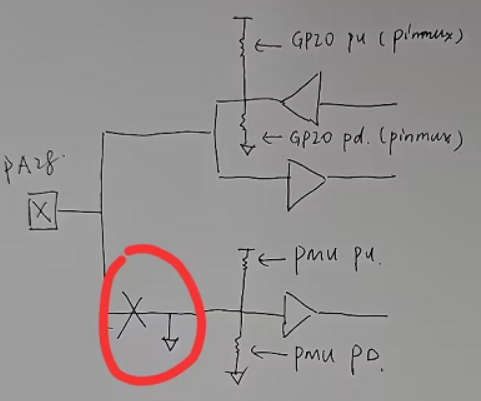<br> 

- Hibernate唤醒判断<br>
按下唤醒PIN从Hibernate唤醒后，可以判断`if(PM_HIBERNATE_BOOT == SystemPowerOnModeGet())`是否为`hibernate boot`和按键的时间长短来判断是否需要开机
