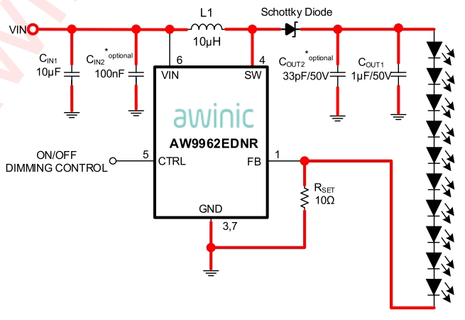
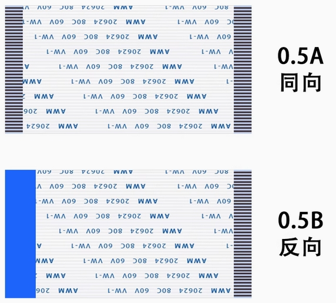
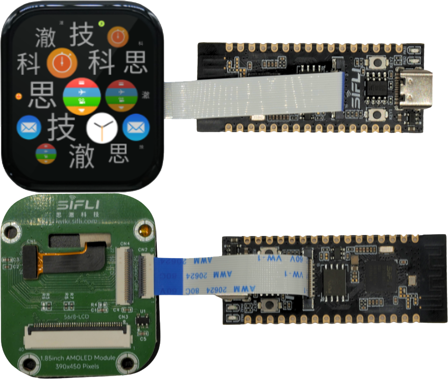
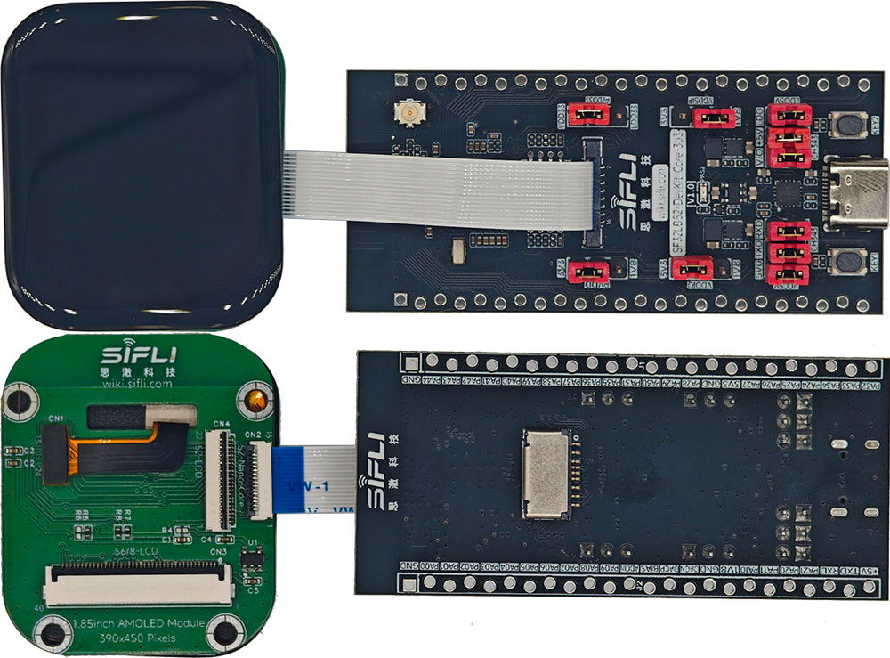
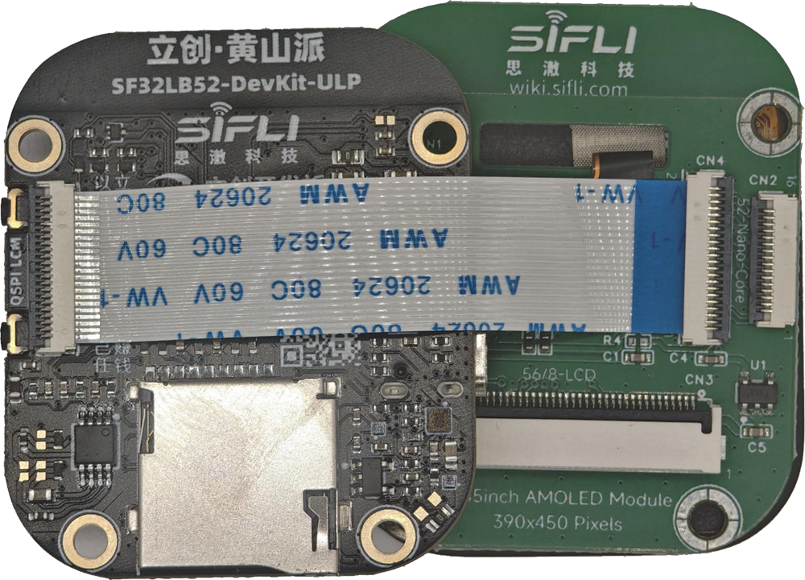
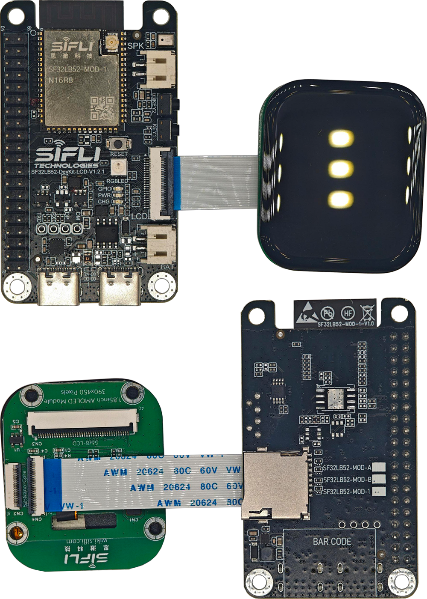
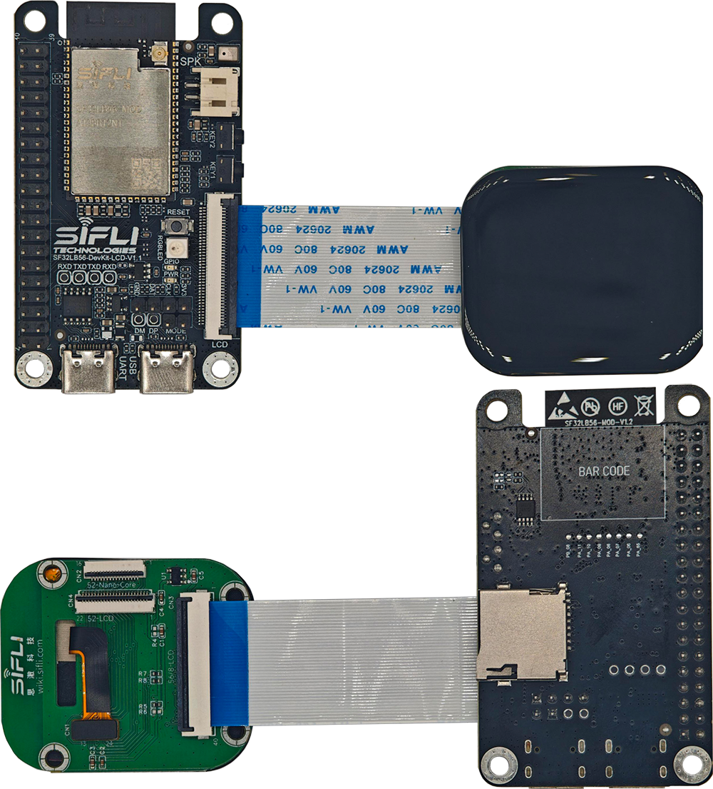
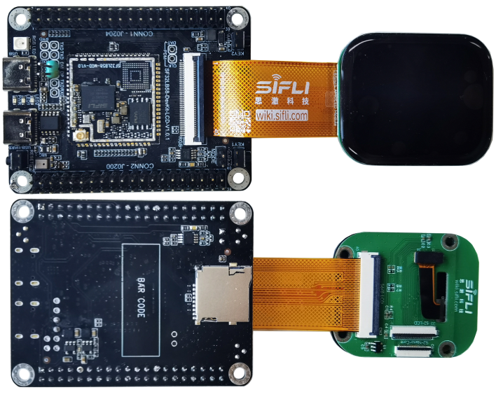

# 思澈开发板LCM转接板制作指南

本文指导如何给思澈开发板做配套转接板，用来调试第三方显示屏。

## 思澈开发板屏幕接口类型

- 16p QSPI FPC
	- SF32LB52-DevKit-Nano
	- SF32LB52-DevKit-Core
- 22p QSPI FPC
	- SF32LB52-DevKit-LCD
	- SF32LB52-DevKit-ULP（立创.黄山派）
- 40p RGB FPC
	- SF32LB56-DevKit-LCD
	- SF32LB58-DevKit-LCD
- 30p MIPI-DSI FPC
	- SF32LB58-DevKit-LCD

## 思澈开发板屏幕接口定义


### 16p QSPI FPC接口

<div align="center"> 16p FPC接口信号定义  </div>

```{table}
:align: center
|PIN| DevKit FPC CON PIN-Name      | Descriptions  | LCM PIN-Name |
|:--|:---------|:-----------                       |------    |
|1  | GND      | Power Supply Ground               | GND      |  
|2  | LCD_RST  | LCD reset output Active low       | RESX     |
|3  | BL_PWM   | Back light PWM control output     | BL       |
|4  | TE       | Tearing effect input              | TE       |
|5  | QSPI_CS  | LCD QSPI Chip select output       | CSx      | 
|6  | QSPI_CLK | LCD QSPI clock output             | CLK/WRx  |
|7  | QSPI_D0  | LCD QSPI data 0 inout             | D0/RDx   |
|8  | QSPI_D1  | LCD QSPI data 1 output            | D1/DCx   |
|9  | QSPI_D2  | LCD QSPI data 2 output            | D2       |
|10 | QSPI_D3  | LCD QSPI data 3 output            | D3       |
|11 | 3.3V     | DC 3.3V Power Supply              | VCI      | 
|22 | GND      | Power Supply Ground               | GND      | 
|13 | TP_INT   | TP Interrupt signal inout         | TP-INT   |
|14 | TP_SDA   | TP I2C data signal                | TP-SDA   |
|15 | TP_SCL   | TP I2C clock signal               | TP-SCL   |
|16 | TP_RST   | TP Reset                          | TP-RTN   |

```

### 22p QSPI FPC接口

<div align="center"> 22p FPC接口信号定义  </div>

```{table}
:align: center
|PIN| DevKit FPC CON PIN-Name      | Descriptions  | LCM PIN-Name |
|:--|:---------|:-----------                       |------    |
|1  | LEDK     | LED cathode                       | LEDK     | 
|2  | LEDA     | LED anode                         | LEDA     | 
|3  | D2/DB0   | LCD QSPI data 2,8080 data 0       | DB0      |
|4  | D3/DB1   | LCD QSPI data 3,8080 data 1       | DB1      |
|5  | DB2      | 8080 data 2                       | DB2      |
|6  | DB3      | 8080 data 3                       | DB3      |
|7  | DB4      | 8080 data 4                       | DB4      |
|8  | DB5      | 8080 data 5                       | DB5      |
|9  | DB6      | 8080 data 6                       | DB6      |
|10 | DB7      | 8080 data 7                       | DB7      |
|11 | TE       | Tearing effect input              | TE       |
|12 | LCD_RST  | LCD reset output Active low       | RESX     |
|13 | CLK      | LCD QSPI clock output             | CLK/WRx  |
|14 | D0/RD    | LCD QSPI data 0 inout             | D0/RDx   |
|15 | CS       | LCD QSPI Chip select output       | CSx      | 
|16 | D1/DC    | LCD QSPI data 1 output            | D1/DCx   |
|17 | 3.3V     | DC 3.3V Power Supply              | VCI      | 
|18 | TP_INT   | TP Interrupt signal inout         | TP-INT   |
|19 | TP_SDA   | TP I2C data signal                | TP-SDA   |
|20 | TP_SCL   | TP I2C clock signal               | TP-SCL   |
|21 | TP_RST   | TP Reset                          | TP-RTN   |
|22 | GND      | Power Supply Ground               | GND      |  

```

### 40p RGB FPC接口

<div align="center"> 40p FPC接口信号定义  </div>

```{table}
:align: center
|PIN| DevKit FPC CON PIN-Name      | Descriptions  | LCM PIN-Name |
|:--|:---------|:-----------                       |------    |
|1  | 5V       | DC 5V Power Supply                | DC5V     | 
|2  | 5V       | DC 5V Power Supply                | DC5V     | 
|3  | R0       | Red data 0                        | DR0      |
|4  | R1       | Red data 1                        | DR1      |
|5  | R2       | Red data 2                        | DR2      |
|6  | R3       | Red data 3                        | DR3      |
|7  | R4       | Red data 4                        | DR4      |
|8  | R5       | Red data 5                        | DR5      |
|9  | R6       | Red data 6                        | DR6      |
|10 | R7       | Red data 7                        | DR7      |
|11 | GND      | Power Supply Ground               | GND      |
|12 | G0       | Green data 0                      | DG0      |
|13 | G1       | Green data 1                      | DG1      |
|14 | G2       | Green data 2                      | DG2      |
|15 | G3       | Green data 3                      | DG3      |
|16 | G4       | Green data 4                      | DG4      |
|17 | G5       | Green data 5                      | DG5      |
|18 | G6       | Green data 6                      | DG6      |
|19 | G7       | Green data 7                      | DG7      |
|20 | GND      | Power Supply Ground               | GND      |
|21 | B0       | Blue data 0                       | DB0      |
|22 | B1       | Blue data 1                       | DB1      |
|23 | B2       | Blue data 2                       | DB2      |
|24 | B3       | Blue data 3                       | DB3      |
|25 | B4       | Blue data 4                       | DB4      |
|26 | B5       | Blue data 5                       | DB5      |
|27 | B6       | Blue data 6                       | DB6      |
|28 | B7       | Blue data 7                       | DB7      |
|29 | GND      | Power Supply Ground               | GND      |
|30 | CLK      | clock output                      | PCLK     |
|31 | HSYNC    | Horizontal sync signal output     | HSD      |
|32 | VSYNC    | Vertical sync signal output       | VSD      |
|33 | DE       | DE signal when DE mode            | DEN      |
|34 | BL_PWM   | Backlight brightness adjustment signal  | BL-PWM   |
|35 | TP_RST   | TP Reset                          | TP-RTN   |
|36 | TP_SDA   | TP I2C data signal                | TP-SDA   |
|37 | NC       | None connect                      | NC       |
|38 | TP_SCL   | TP I2C clock signal               | TP-SCL   |
|39 | TP_INT   | TP Interrupt signal inout         | TP-INT   |
|40 | LCD_RST  | LCD reset output Active low       | RESX     | 

```

### 30p MIPI-DSI FPC接口


<div align="center"> 30p FPC接口信号定义  </div>

```{table}
:align: center
|PIN| DevKit FPC CON PIN-Name      | Descriptions  | LCM PIN-Name |
|:--|:---------|:-----------                       |------    |
|1  | GND      | Power Supply Ground               | GND      |
|2  | NC       | None connect                      | NC       | 
|3  | NC       | None connect                      | NC       |
|4  | GND      | Power Supply Ground               | GND      |
|5  | D1P      | MIPI data Lane 1 positive-end output pin   | D1P      |
|6  | D1N      | MIPI data Lane 1 negative-end output pin   | D1N      |
|7  | GND      | Power Supply Groud                | GND      |
|8  | DCKP     | MIPI clock Lane positive-end output pin    | DCKP     |
|9  | DCKN     | MIPI clock Lane negative-end output pin    | DCKN     |
|10 | GND      | Power Supply Ground               | GND      |
|11 | D0P      | MIPI data Lane 0 positive-end output pin   | D0P      |
|12 | D0N      | MIPI data Lane 0 negative-end output pin   | D0N      |
|13 | GND      | Power Supply Ground               | GND      |
|14 | NC       | None connect                      | NC       |
|15 | NC       | None connect                      | NC       |
|16 | GND      | Power Supply Ground               | GND      |
|17 | TE       | Tearing effect input              | TE       |
|18 | LCD_RST  | LCD reset output Active low       | RESX     |
|19 | 1.8V     | I/O interface power supply,1.8V output     | IOVCC    |
|20 | 3.3V     | VCI interface power supply,3.3V output     | VCI      |
|21 | 3.3V     | TP power supply,3.3V output       | TP-VDD   |
|22 | TP_INT   | TP Interrupt signal inout         | TP-INT   |
|23 | TP_SDA   | TP I2C data signal                | TP-SDA   |
|24 | TP_SCL   | TP I2C clock signal               | TP-SCL   |
|25 | TP_RST   | TP Reset                          | TP-RTN   |
|26 | LEDK     | LED cathode                       | LEDK     |
|27 | LEDK     | LED cathode                       | LEDK     |
|28 | NC       | None connect                      | NC       |
|29 | LEDA     | LED anode                         | LEDA     |
|30 | LEDA     | LED anode                         | LEDA     |

```

## LCM转接板信号连接

思澈科技多个系列的开发板，使用一套图形界面完美支持SPI(SPI、DSPI和QSPI)、8080、8bit并口墨水屏、JDI、RGB和DSI等常见接口类型的屏。

### SPI、DSPI和QSPI接口屏

<div align="center"> 16p FPC接口连接SPI、DSPI和QSPI屏  </div>

```{table}
:align: center
|PIN| DevKit FPC CON PIN-Name | 3W-SPI  | 4W-SPI | DSPI  | QSPI  |
|:--|:------------------------|:--------|:-------|:------|:------|
|1  | GND                     | GND     | GND    | GND   | GND   | 
|2  | LCD_RST                 | RESX    | RESX   | RESX  | RESX  |
|3  | BL_PWM                  | BL      | BL     | BL    | BL    |
|4  | TE                      | NC      | NC     | NC    | TE    |
|5  | QSPI_CS                 | CSx     | CSx    | CSx   | CSx   | 
|6  | QSPI_CLK                | CLK     | CLK    | CLK   | CLK   |
|7  | QSPI_D0                 | RDx     | RDx    | D0    | D0    |
|8  | QSPI_D1                 | NC      | DCx    | D1    | D1    |
|9  | QSPI_D2                 | NC      | NC     | NC    | D2    |
|10 | QSPI_D3                 | NC      | NC     | NC    | D3    |
|11 | 3.3V                    | VDD     | VDD    | VDD   | VDD   | 

```
<br>

<div align="center"> 22p FPC接口连接SPI、DSPI和QSPI屏  </div>

```{table}
:align: center
|PIN| DevKit FPC CON PIN-Name | 3W-SPI  | 4W-SPI | DSPI  | QSPI  |
|:--|:------------------------|:--------|:-------|:------|:------|
|1  | LEDK                    | LEDK    | LEDK   | LEDK  | LEDK  | 
|2  | LEDA                    | LEDA    | LEDA   | LEDA  | LEDA  | 
|3  | D2/DB0                  | NC      | NC     | NC    | D2    |
|4  | D3/DB1                  | NC      | NC     | NC    | D3    |
|11 | TE                      | NC      | NC     | NC    | TE    |
|12 | LCD_RST                 | RESX    | RESX   | RESX  | RESX  |
|13 | CLK                     | CLK     | CLK    | CLK   | CLK   |
|14 | D0/RD                   | RDx     | RDx    | D0    | D0    |
|15 | CS                      | CSx     | CSx    | CSx   | CSx   |
|16 | D1/DC                   | NC      | DCx    | D1    | D1    | 
|17 | 3.3V                    | VDD     | VDD    | VDD   | VDD   | 

```
<br>

<div align="center"> 56LCD开发板40p FPC接口连接SPI、DSPI和QSPI屏  </div>

```{table}
:align: center
|PIN| 56-LCD | 3W-SPI  | 4W-SPI | DSPI  | QSPI  |
|:--|:-------|:--------|:-------|:------|:------|
|1  | 5V     | 5V      | 5V     | 5V    | 5V    | 
|2  | 5V     | 5V      | 5V     | 5V    | 5V    | 
|11 | GND    | GND     | GND    | GND   | GND   | 
|15 | G3     | NC      | NC     | NC    | TE    |
|20 | GND    | GND     | GND    | GND   | GND   | 
|21 | B0     | CSx     | CSx    | CSx   | CSx   |
|22 | B1     | CLK     | CLK    | CLK   | CLK   |
|23 | B2     | RDx     | RDx    | D0    | D0    |
|25 | B4     | NC      | NC     | NC    | D3    |
|26 | B5     | NC      | DCx    | D1    | D1    | 
|27 | B6     | NC      | NC     | NC    | D2    |
|29 | GND    | GND     | GND    | GND   | GND   | 
|40 | LCD_RST| RESX    | RESX   | RESX  | RESX  |

```
<br>

<div align="center"> 58LCD开发板40p FPC接口连接SPI、DSPI和QSPI屏  </div>

```{table}
:align: center
|PIN| 58-LCD | 3W-SPI  | 4W-SPI | DSPI  | QSPI  |
|:--|:-------|:--------|:-------|:------|:------|
|1  | 5V     | 5V      | 5V     | 5V    | 5V    | 
|2  | 5V     | 5V      | 5V     | 5V    | 5V    | 
|9  | R6     | NC      | NC     | NC    | TE    |
|10 | R7     | CSx     | CSx    | CSx   | CSx   |
|11 | GND    | GND     | GND    | GND   | GND   | 
|12 | G0     | NC      | NC     | NC    | D3    |
|13 | G1     | CLK     | CLK    | CLK   | CLK   |
|14 | G2     | NC      | NC     | NC    | D2    |
|15 | G3     | NC      | DCx    | D1    | D1    | 
|16 | G4     | RDx     | RDx    | D0    | D0    |
|20 | GND    | GND     | GND    | GND   | GND   | 
|29 | GND    | GND     | GND    | GND   | GND   | 
|40 | LCD_RST| RESX    | RESX   | RESX  | RESX  |

```
### MCU-8080接口屏

8bit MCU-8080 只有22p和40p（56-DevKit-LCD）FPC接口支持，连接方式如下面2个表格。

<div align="center"> 22p FPC接口连接MCU-8080屏  </div>

```{table}
:align: center
|PIN| DevKit FPC CON PIN-Name      | Descriptions  | MCU-8080 |
|:--|:---------|:-----------                       |------    |
|1  | LEDK     | LED cathode                       | LEDK     | 
|2  | LEDA     | LED anode                         | LEDA     | 
|3  | D2/DB0   | 8080 data 0                       | DB0      |
|4  | D3/DB1   | 8080 data 1                       | DB1      |
|5  | DB2      | 8080 data 2                       | DB2      |
|6  | DB3      | 8080 data 3                       | DB3      |
|7  | DB4      | 8080 data 4                       | DB4      |
|8  | DB5      | 8080 data 5                       | DB5      |
|9  | DB6      | 8080 data 6                       | DB6      |
|10 | DB7      | 8080 data 7                       | DB7      |
|11 | TE       | Tearing effect input              | TE       |
|12 | LCD_RST  | LCD reset output Active low       | RESX     |
|13 | CLK      | Write enable output               | WRx      |
|14 | D0/RD    | Read enable output                | RDx      |
|15 | CS       | Chip select output                | CSx      | 
|16 | D1/DC    | Display data/command select output| DCx      |
|17 | 3.3V     | DC 3.3V Power Supply              | VCI      | 
|18 | TP_INT   | TP Interrupt signal inout         | TP-INT   |
|19 | TP_SDA   | TP I2C data signal                | TP-SDA   |
|20 | TP_SCL   | TP I2C clock signal               | TP-SCL   |
|21 | TP_RST   | TP Reset                          | TP-RTN   |
|22 | GND      | Power Supply Ground               | GND      |  

```
<br>

<div align="center"> 56LCD开发板40p FPC接口连接MCU-8080屏  </div>

```{table}
:align: center
|PIN| DevKit FPC CON PIN-Name      | Descriptions  | MCU-8080 |
|:--|:---------|:-----------                       |------    |
|1  | 5V       | DC 5V Power Supply                | DC5V     | 
|2  | 5V       | DC 5V Power Supply                | DC5V     | 
|11 | GND      | Power Supply Ground               | GND      |
|12 | G0       | 8080 data 2                       | DB2      |
|13 | G1       | 8080 data 4                       | DB4      |
|14 | G2       | 8080 data 6                       | DB6      |
|15 | G3       | Tearing effect input              | TE       |
|16 | G4       | 8080 data 7                       | DB7      |
|17 | G5       | 8080 data 3                       | DB3      |
|18 | G6       | 8080 data 5                       | DB5      |
|20 | GND      | Power Supply Ground               | GND      |
|21 | B0       | Chip select output                | CSx      |
|22 | B1       | Write enable output               | WRx      |
|23 | B2       | Read enable output                | RDx      |
|25 | B4       | 8080 data 1                       | DB1      |
|26 | B5       | Display data/command select output| DCx      |
|27 | B6       | 8080 data 0                       | DB0      |
|29 | GND      | Power Supply Ground               | GND      |
|40 | LCD_RST  | LCD reset output Active low       | RESX     | 

```
### 8bit并口墨水屏接口

8bit并口墨水屏需要的IO接口较多，思澈开发板FPC屏幕接口无法满足IO数量要求。

详细的设计指南，请参考[8bit并口墨水屏硬件设计指南](http://wiki.sifli.com)。

### JDI并行接口屏

JDI屏常见的接口有24p并口和10p串口，接口线序如下面2个表格。

<div align="center"> 24p并口JDI信号定义  </div>

```{table}
:align: center
|PIN| Signal       | Descriptions                                           | Connect to      |
|:--|:-------------|:-------------------------------------------------------|:----------------|
|1  | LED Cathode 1| Power supply for the LED (Cathode)                     | Onboard circuit | 
|2  | NC           | NC                                                     | NC              | 
|3  | VDD2         | Power supply for the vertical driver and pixel memory  | Onboard circuit |
|4  | JDI_VST      | Start signal for the vertical driver                   | MCU             |
|5  | JDI_ENB      | Write enable signal for the pixel memory               | MCU             |
|6  | FRP          | Liguid crystal driving signal ("Off" pixel)            | MCU             |
|7  | VDD1         | Power supply for the horizontal driver and pixel memory| Onboard circuit |
|8  | JDI_HST      | Start signal for the horizontal driver                 | MCU             |
|9  | JDI_R1       | Red image data (odd pixels)                            | MCU             |
|10 | JDI_G1       | Green image data (odd pixels)                          | MCU             |
|11 | JDI_B1       | Blue image data (odd pixels)                           | MCU             |
|12 | HOUT         | Output from the end of the horizontal shift register   | MCU             |
|13 | VCOM         | Common electrode driving signal                        | MCU             |
|14 | JDI_B2       | Blue image data (odd pixels)                           | MCU             |
|15 | JDI_G2       | Green image data (odd pixels)                          | MCU             |
|16 | JDI_R2       | Red image data (odd pixels)                            | MCU             |
|17 | JDI_HCK      | Shift clock for the horizontal driver                  | MCU             |
|18 | GND          | Ground                                                 | GND             |
|19 | XFRP         | Liguid crystal driving signal ("On" pixel)             | MCU             |
|20 | JDI_XRST     | Reset signal for the horizontal and vertical driver    | MCU             |
|21 | JDI_VCK      | Shift clock for the vertical driver                    | MCU             |
|22 | VOUT         | Output from the end of the vertical shift register     | MCU             |
|23 | LED Anode    | Power supply for the LED (Anode)                       | Onboard circuit |
|24 | LED Cathode 1| Power supply for the LED 2 (Cathode)                   | Onboard circuit |

```
<br>

<div align="center"> 10p串口JDI信号定义  </div>

```{table}
:align: center
|PIN| Signal       | Descriptions                                           | Connect to      |
|:--|:-------------|:-------------------------------------------------------|:----------------|
|1  | JDI_SCLK     | Serial clock signal                                    | MCU             | 
|2  | JDI_SI       | Serial data input signal                               | MCU             | 
|3  | JDI_SCS      | Chip select signal                                     | MCU             |
|4  | JDI_EXTCOMIN | COM inversion polarity input                           | MCU             |
|5  | JDI_DISP     | Display ON/OFF switching signal                        | MCU             |
|6  | VDDA         | Power supply for analog                                | Onboard circuit |
|7  | VDD1         | Power supply for logic                                 | Onboard circuit |
|8  | EXTMODE      | COM inversion mode select terminal                     | Onboard circuit |
|9  | VSS          | Logic ground                                           | Onboard circuit |
|10 | VSSA         | Analog ground                                          | Onboard circuit |

```
详细的设计指南，请参考[JDI屏硬件设计指南](http://wiki.sifli.com)。

### RGB(MIPI-DPI)接口屏

只有SF32LB56-DevKit-LCD和SF32LB56-DevKit-LCD开发板支持RGB接口屏。开发板的40p FPC插座线序兼容正点原子线序，可以直接插上正点原子的RGB屏使用。

开发者可以参考上文定义的40p FPC座线序和正点原子RGB屏资料来制作显示转接板。

第三方RGB屏链接：
* [IPS版7寸RGB屏模块1024*600（正点原子）](https://detail.tmall.com/item.htm?abbucket=17&id=609758563397&rn=b8068af8e33ece4aa2c043b54a77a153&spm=a1z10.5-b-s.w4011-24686329149.72.255354adb0S1oV)
* [HTM-H070A20-RGB-A01C_V0-1](https://item.taobao.com/item.htm?id=845117257237&spm=a213gs.v2success.0.0.42674831Eg7yk8&skuId=5791172462409)

### MIPI(MIPI-DSI)接口屏

如上文的30p FPC插座信号定义所示，思澈SF32LB58-DevKit-LCD开发板最高支持 2lane数据传输，最高支持1280*800分辨率的MIPI屏。

转接板信号连接可以参考上文的30p FPC座线序，其中开发板上已经集成了恒流WLED驱动源电路，背光LEDK和LEDA可以提供100mA的驱动电流，屏幕背光最高支持并行6路LED。可以根据屏幕具体的LED结构来调整开发板上的Rset电阻，来满足实际的驱动电流要求。

```{important}
1. 开发板的IO是3.3V电平，如果LCD转接板上的驱动芯片的IO电平是1.8V，请使用Level shift芯片来转换电平。
2. QSPI、8080和RGB的数据和时钟线需要串接22~47欧姆的电阻如果。
3. *-Nano和*-Core开发板上I2C信号没有加上拉电阻，需要在屏转接板上加I2C上拉电阻。
```
## 转接板背光电路

### TFT屏背光电路

TFT屏的背光一般由串并联的LED发光管组成，根据屏幕尺寸大小不同，背光的串并联LED数量也不同，一般裸屏规格书里有背光LED的组成介绍，以此来设计背光驱动电路。

<div align="center"> TFT常见尺寸屏幕背光组成  </div>

```{table}
:align: center
|Size      | LED Structure        | LED VF&IF            | LED drive circuit |
|:---------|:---------------------|:---------------------|:------------------|
|1.3inch   | 2 parallel           | VF=3.3V,IF=15*2mA    | 3.3V DC drive     |
|2.4inch   | 4 parallel           | VF=3.3V,IF=15*4mA    | 3.3V DC drive     | 
|2.8inch   | 4 parallel           | VF=3.3V,IF=15*4mA    | 3.3V DC drive     |
|3.5inch   | 6 parallel           | VF=3.3V,IF=15*6mA    | 3.3V DC drive     |
|4.2inch   | 8 serial             | VF=25.6V,IF=15mA     | Boost WLED driver |
|5.5inch   | 2 serial *7 parallel | VF=6.4V,IF=105mA     | Boost WLED driver |
|7inch     | 3 serial *6 parallel | VF=9.6V,IF=90mA      | Boost WLED driver |
|10.1inch  | 4 serial *7 parallel | VF=12.8V,IF=105mA    | Boost WLED driver |

```
采用1个LED并联方式的背光驱动电路，LEDA可以直接接3.3V电源，LEDK可以直接接GND。

有多个LED串联的背光驱动电路，常见的5V和3.3V不够VF电压的要求，只能通过升压的方式来驱动LED，推荐使用恒流LED驱动芯片来驱动背光LED。并联LED的通路数量 x 15mA及为屏幕背光的电流需求。如下图所示，Rset来设置IF驱动电流，芯片的FB一般为200mV，IF=VFB/Rset为驱动电流。

 

<div align="center"> 常见恒流LED驱动芯片电路</div>  <br>  <br>  <br>

### AMOLED屏背光电路

AMOLED是采用像素级自发光技术，没有像TFT屏一样的背光源，亮度调节一般是调节像素点的颜色，例如黑色为不发光，白色为最亮，所以无需专门提供PWM信号来调整背光亮度。

AMOLED屏一般自带PMIC芯片，给面板提供VGH、VGL和VCOM电压，屏驱芯片通过1W接口来调整相应的电压值。PMIC的供电范围一般支持2.7~5.5V，所以可以引开发板FPC接口上的5V或3.3V给屏上PMIC供电。

 

<div align="center"> 常见AMOLED PMIC芯片电路</div>  <br>  <br>  <br>


### 墨水屏背光电路

墨水屏的背光电路比较复杂，使用专用PMIC芯片来提供墨水屏各个电源的电压。

常用的PMIC电源芯片有TPS65185和SY7637A。

详细的设计指南，请参考[8bit并口墨水屏硬件设计指南](http://wiki.sifli.com)。

## FPC软排线的选择

思澈开发板FPC插座采用的是上翻下接触类型，建议制作转接板时，转接板上面的FPC插座采用上翻-上下双侧接触类型。

推荐FPC插座：
- [16p-0.5mm](https://item.szlcsc.com/5909045.html?fromZone=s_s__%2522C5213753%2522&spm=sc.gbn.xh1.zy.n___sc.cidn.hd.ss&lcsc_vid=QAcLUgJQQlQLU1RQEQQKBVEAFAIIU1NQQ1ZZAgJVFVYxVlNTR1FZVFZTTlRfUTsOAxUeFF5JWBIBSRccGwIdBEoFGAxB)
- [22p-0.5mm](https://item.szlcsc.com/5909048.html?fromZone=s_s__%2522C5213756%2522&spm=sc.gbn.xh1.zy.n___sc.gbn.hd.ss&lcsc_vid=QAcLUgJQQlQLU1RQEQQKBVEAFAIIU1NQQ1ZZAgJVFVYxVlNTR1FZVFZTTlRfUTsOAxUeFF5JWBIBSRccGwIdBEoFGAxB)
- [30p-0.5mm](https://item.szlcsc.com/3056931.html?fromZone=s_s__%2522FPC-05FB-30PH20%2522&spm=sc.gbn.xh1.zy.n___sc.it.hd.ss&lcsc_vid=QAcLUgJQQlQLU1RQEQQKBVEAFAIIU1NQQ1ZZAgJVFVYxVlNTR1FZVFZTTlRfUTsOAxUeFF5JWBIBSRccGwIdBEoFGAxB)
- [40p-0.5mm](https://item.szlcsc.com/3056935.html?fromZone=s_s__%2522C2856837%2522&spm=sc.gbn.xh1.zy.n___sc.it.hd.ss&lcsc_vid=QAcLUgJQQlQLU1RQEQQKBVEAFAIIU1NQQ1ZZAgJVFVYxVlNTR1FZVFZTTlRfUTsOAxUeFF5JWBIBSRccGwIdBEoFGAxB)

转接板上采用上翻-上下双侧接触类型FPC插座，FPC软排线可以选择16p、22p、30p和40p，0.5mm间距的FPC软排线，排线接触点同面或异面的都可以。

 

<div align="center"> 参考FPC软排线</div>  <br>  <br>  <br>

```{important}
转接板设计时，注意FPC插座的1脚位置，如果转接板直接参考开发板原理图的线序和1脚位置，实际用软排线对接时就会造成信号交叉而无法使用。解决方法有：
1. 修改转接板上的插座的PCB库的1脚位置，从相反方向开始命名管脚序号，原理图符合不变。
2. 修改转接板上的插座的原理图符号库1的1脚位置，从相反方向开始命名管脚序号，PCB库不变。
```

## 思澈LCM模组

为了方便开发者使用思澈科技的开发板来调试显示功能，思澈科技推出多款LCM屏幕模组，包括QSPI、RGB和DSI接口。屏幕尺寸有1.85寸 AMOLED 390450 手表屏、4.3寸 TFT 800480显示屏、7寸 TFT 1024x600显示屏和8寸 TFT 1280x800显示屏。

### 1.85inch AMOLED Module

#### 特性

- 尺寸：1.85inch 长方形圆角AMOLED手表屏，裸屏型号：ZC-A1D85W-010
- 分辨率：390x450
- 亮度：800 cd/m2
- 显示数据接口：QSPI
- 触摸数据接口：I2C
- OLED Driver IC: CO5300AF-01
- Power IC: BV6802W
- TP IC: FT6146-M00

#### 开发板支持列表

- SF32LB52-DevKit-Nano
	- [16p-0.5mm间距-5cm长度-反向-FPC](https://detail.tmall.com/item.htm?detail_redpacket_pop=true&id=680458377217&ltk2=1750067224011jye1g23u8nodzodf4cqbwg&ns=1&priceTId=213e035a17500671977881818e1d06&query=FPC%2022P%200.5&spm=a21n57.1.hoverItem.4&utparam=%7B%22aplus_abtest%22%3A%229f477038981a766efe59de49bfe14d1d%22%7D&xxc=ad_ztc&sku_properties=148242406%3A56086872)
- SF32LB52-DevKit-Core-****
	- [16p-0.5mm间距-5cm长度-反向-FPC](https://detail.tmall.com/item.htm?detail_redpacket_pop=true&id=680458377217&ltk2=1750067224011jye1g23u8nodzodf4cqbwg&ns=1&priceTId=213e035a17500671977881818e1d06&query=FPC%2022P%200.5&spm=a21n57.1.hoverItem.4&utparam=%7B%22aplus_abtest%22%3A%229f477038981a766efe59de49bfe14d1d%22%7D&xxc=ad_ztc&sku_properties=148242406%3A56086872)
- SF32LB52-DevKit-ULP(立创.黄山派)
	- [22p-0.5mm间距-5cm长度-反向-FPC](https://detail.tmall.com/item.htm?detail_redpacket_pop=true&id=680458377217&ltk2=1750067224011jye1g23u8nodzodf4cqbwg&ns=1&priceTId=213e035a17500671977881818e1d06&query=FPC%2022P%200.5&spm=a21n57.1.hoverItem.4&utparam=%7B%22aplus_abtest%22%3A%229f477038981a766efe59de49bfe14d1d%22%7D&xxc=ad_ztc&skuId=5623637216836)
- SF32LB52-DevKit-LCD
	- [22p-0.5mm间距-5cm长度-反向-FPC](https://detail.tmall.com/item.htm?detail_redpacket_pop=true&id=680458377217&ltk2=1750067224011jye1g23u8nodzodf4cqbwg&ns=1&priceTId=213e035a17500671977881818e1d06&query=FPC%2022P%200.5&spm=a21n57.1.hoverItem.4&utparam=%7B%22aplus_abtest%22%3A%229f477038981a766efe59de49bfe14d1d%22%7D&xxc=ad_ztc&skuId=5623637216836)
- SF32LB56-DevKit-LCD
	- [40p-0.5mm间距-5cm长度-反向-FPC](https://detail.tmall.com/item.htm?detail_redpacket_pop=true&id=680458377217&ltk2=1750067224011jye1g23u8nodzodf4cqbwg&ns=1&priceTId=213e035a17500671977881818e1d06&query=FPC%2022P%200.5&skuId=5791728402036&spm=a21n57.1.hoverItem.4&utparam=%7B%22aplus_abtest%22%3A%229f477038981a766efe59de49bfe14d1d%22%7D&xxc=ad_ztc)
- SF32LB58-DevKit-LCD
	- [40p-0.5mm间距-5cm长度-正向-FPC](http://10.23.10.196:19000/web-file/hardware/files/documentation/FPC_40p_to_1p85-AMOLED-Module%E8%BD%AF%E6%8E%92%E7%BA%BF_2025-07-04.epro?)

#### 开发板和显示屏安装方式

 

<div align="center"> SF32LB52-DevKit-Nano开发板安装方式</div>  <br>  <br>  <br>

 

<div align="center"> SF32LB52-DevKit-Core-****开发板安装方式</div>  <br>  <br>  <br>

 

<div align="center"> SF32LB52-DevKit-ULP(立创.黄山派)开发板安装方式</div>  <br>  <br>  <br>

 

<div align="center"> SF32LB52-DevKit-LCD开发板安装方式</div>  <br>  <br>  <br>

 

<div align="center"> SF32LB56-DevKit-LCD开发板安装方式</div>  <br>  <br>  <br>

 

<div align="center"> SF32LB58-DevKit-LCD开发板安装方式</div>  <br>  <br>  <br>

[转接板参考设计资料](https://downloads.sifli.com/hardware/files/documentation/SFLCM1p85-A-390-450-Adapter_V1.0.epro?)

### 4.3inch TFT Module
（敬请期待）
### 7inch TFT Module
（敬请期待）
### 8inch TFT Module
（敬请期待）


