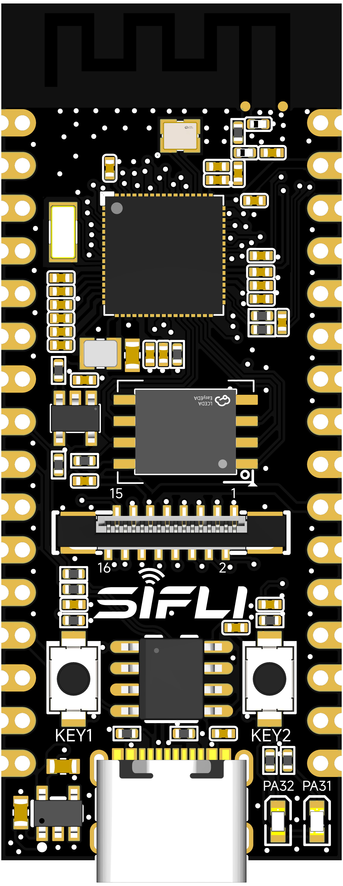
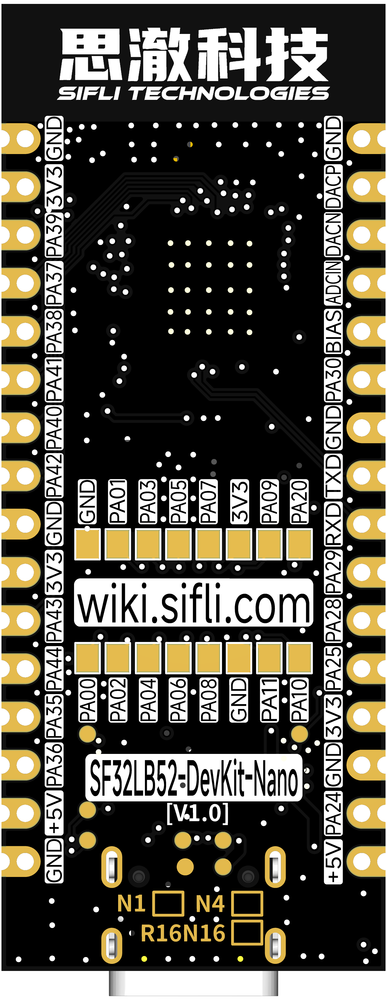
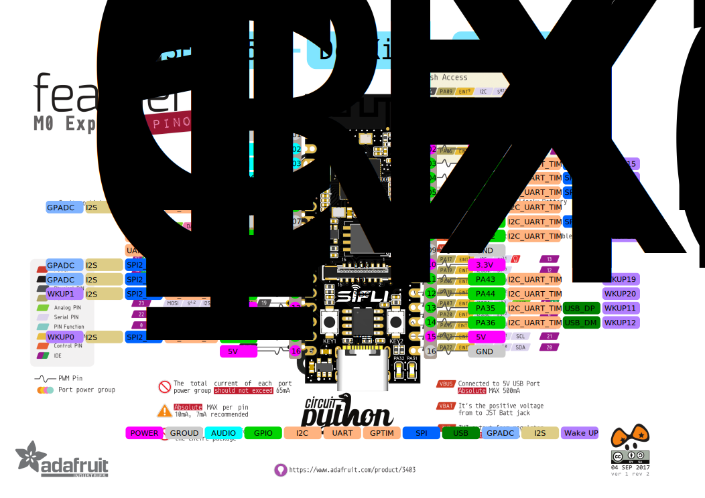

# SF32LB52-DevKit-Nano开发板使用指南


## 开发板版本信息：

* *-N4-V1.0.0：配置SF32LB52BU56芯片(内部合封4MB NOR Flash)，当前版本
* *-R16N16-V1.0.0：配置SF32LB52JUD6(内部合封16MB PSRAM) + 16MB NOR Flash，当前版本

## 1. 开发板概述

SF32LB52-DevKit-Nano是基于思澈科技SF32LB52BU56/SF32LB52JUD6芯片的开发板，尺寸仅有21mm*51mm，板边采用邮票孔设计，方便开发者在不同场景下使用。开发板支持GPIO、UART、I2C、SPI，LCD、I2S、GPADC，PWM和模拟音频输入输出。

 

<div align="center"> 开发板实物正面照 </div>  <br>  <br>  <br>

 

<div align="center"> 开发板实物背面照 </div>  <br>  <br>  <br>


## 2. 特性列表
该开发板具有以下特性：
1.	板型：
    - -N4：板载SF32LB52BU56芯片，配置如下：
    
        - 合封配置为：
            - 4MB NOR Flash，接口频率96MHz
        
    - -R16N16：板载SF32LB52JUD6芯片，配置如下：
    
        - 合封配置为：
            - 16MB OPI-PSRAM，接口频率144MHz
        
        - 板载128Mb QSPI-NOR Flash，接口频率72MHz，STR模式 
2.	晶体
    - 48MHz晶体
    - 32.768KHz晶体
3.	天线
    - 板载PCBA天线
4.	GPIO
    - LCC半孔支持17个GPIO
    - LGA管脚支持13个GPIO
5.	UART-I2C-GPTIM
    - 3x UART
    - 4x I2C
    - 2x GPTIM
    - 所有GPIO都支持配置为UART、I2C和GPTIM
6.	SPI
    - 2x SPI
7.	GPADC
    - 3x GPADC
9.	显示
    - FPC16P，0.5mm间距接插件扩展显示
    - SPI/DSPI/Quad SPI，支持DDR模式QSPI显示接口
    - 支持I2C接口的触摸屏
    - 通过16p转22p排线，支持黄山派1.85寸AMOLED屏
10.	音频
    - 支持音频ADC输入，可以接模拟麦克风或硅麦克风
    - 支持PDM数字麦克风输入
    - 模拟音频输出，需要外接Class-AB/D音频PA来驱动喇叭
    - 所有接口通过LCC半孔引出
11.	USB
    - Type C-UART接口，板载CH340N串口芯片，实现程序下载和软件DEBUG，可供电
    - USB接口，支持USB2.0 FS，通过LCC半孔引出
12.  按键
    - 1x 功能按键
    - 1x 开关机按键，支持长按10s复位功能
13.  LED灯
    - 2x LED灯，GPIO控制
14. 电源
    - 通过USB Type-C接口供电
    - 板载VBUS 5V转3.3V的LDO芯片
    - 板载电源开关，可以通过CH340N的RTS#管脚控制使能，来实现MCU的复位 

## 3. 管脚定义

 

<div align="center"> 开发板正面Pinout（点击放大） </div>  <br>  <br>  <br>

 

<div align="center"> 开发板反面PinOut（点击放大） </div>  <br>  <br>  <br>

### 管脚详细描述

下表为 SF32LB52-DevKit-Nano 开发板管脚的详细描述。

<div align="center"> LEFT LCC（J1）管脚描述表 </div>

```{table}

|管脚|	管脚名称           	   |   复位默认及复用功能  | 上下拉 |
|:--|:-----------------------|:-----------|------|
|1 | GND   | 接地                     |  |
|2 | DACP  | 模拟音频输出信号          |  |
|3 | DACN  | 模拟音频输出信号          |  |
|4 | MIC_ADC  | MIC输入信号           |  |
|5 | MIC_BIAS | MIC偏置电压           |  |
|6 | PA30  | **PA30**、UART、I2C、GPTIM、I2S1_LRCK和GPADC2  | PD |
|7 | GND   | 接地                     | 
|8 | PA19  | **UART0_TXD**,调试和下载口，PA19、SWCLK、I2C、GPTIM    | 无 |
|9 | PA18  | **UART0_RXD**,调试和下载口，PA18、SWDIO、I2C、GPTIM    | PU |
|10 | PA29 | **PA29**、UART、I2C、GPTIM、SPI1_CS、I2S1_BCK和GPADC1   | PD |
|11 | PA28 | **PA28**、UART、I2C、GPTIM、SPI1_CLK、I2S1_SDI和GPADC0  | PD |
|12 | PA25 | **PA25**、UART、I2C、GPTIM、SPI1_DI、I2S1_SDO和WKUP1    | PD |
|13 | 3.3V | 3.3V电源，USB TypeC不插时，可以当做3.3V输入；当USB TypeC插入时，可以当做3.3V输出    |  |
|14 | GND  | 接地                     |  |
|15 | PA24 | **PA24**、UART、I2C、GPTIM、SPI1_DIO、I2S1_MCLK和WKUP0  | PD |
|16 | 5V   | 5V电源，USB TypeC不插时，可以当做5V输入；当USB TypeC插入时，可以当做5V输出    |

```

<div align="center"> RIGHT LCC（J2）管脚描述表 </div>

```{table}

|管脚|	管脚名称           	   |   复位默认及复用功能  | 上下拉 |
|:--|:-----------------------|:-----------|------|
|1 | GND   | 接地                     |  |
|2 | 3.3V  | 3.3V电源，USB TypeC不插时，可以当做3.3V输入；当USB TypeC插入时，可以当做3.3V输出    |  |
|3 | PA39  | **PA39**、UART、I2C、GPTIM、SPI2_CLK和WKUP15   | PU |
|4 | PA37  | **PA37**、UART、I2C、GPTIM、SPI2_DIO和WKUP13   | PD |
|5 | PA38  | **PA38**、UART、I2C、GPTIM、SPI2_DI和WKUP14    | PD |
|6 | PA41  | **PA41**、UART、I2C、GPTIM和WKUP17             | PU |
|7 | PA40  | **PA40**、UART、I2C、GPTIM、SPI2_CS和WKUP16    | PU |
|8 | PA42  | **PA42**、UART、I2C、GPTIM和WKUP18             | PU |
|9 | GND   | 接地                     |  |
|10 | 3.3V | 3.3V电源，USB TypeC不插时，可以当做3.3V输入；当USB TypeC插入时，可以当做3.3V输出    |  |
|11 | PA43 | **PA43**、UART、I2C、GPTIM和WKUP19             | PD |
|12 | PA44 | **PA44**、UART、I2C、GPTIM和WKUP20             | PD |
|13 | PA35 | **PA35**、UART、I2C、GPTIM、USB_DP和WKUP11     | PD |
|14 | PA36 | **PA36**、UART、I2C、GPTIM、USB_DM和WKUP12     | PD |
|15 | 5V   | 5V电源，USB TypeC不插时，可以当做5V输入；当USB TypeC插入时，可以当做5V输出    |  |
|16 | GND   | 接地                     |  |

```


### 16p QSPI线序FPC接口定义

<div align="center"> 16p FPC接口信号定义  </div>

```{table}

|管脚|	管脚名称           	   |   复位默认及复用功能  | 上下拉 |
|:--|:-----------------------|:-----------|------|
|1  | GND    | 接地                        |      | 
|2  | PA_00 | **PA00**、UART、I2C、GPTIM和LCD_RST   | PD   |
|3  | PA_01 | **PA01**、UART、I2C、GPTIM和BL_PWM    | PD   |
|4  | PA_02 | **PA02**、UART、I2C、GPTIM、LCD_TE和I2S1_MCLK   | PD   |
|5  | PA_03 | **PA03**、UART、I2C、GPTIM、LCD_CS和I2S1_SDO    | PU   | 
|6  | PA_04 | **PA04**、UART、I2C、GPTIM、LCD_CLK和I2S1_SDI   | PD   |
|7  | PA_05 | **PA05**、UART、I2C、GPTIM、LCD_D0和I2S1_BCK    | PD   |
|8  | PA_06 | **PA06**、UART、I2C、GPTIM、LCD_D1和I2S1_LRCK   | PD   |
|9  | PA_07 | **PA07**、UART、I2C、GPTIM、LCD_D2和PDM1_CLK    | PD   |
|10 | PA_08 | **PA08**、UART、I2C、GPTIM、LCD_D3和PDM1_DAT    | PD   |
|11 | 3.3V  | 3.3V电源输出                  |      | 
|12 | GND    | 接地                        |      | 
|13 | PA_09 | **PA09**、UART、I2C、GPTIM和CTP_INT    | PD   |
|14 | PA_11 | **PA11**、UART、I2C、GPTIM和CTP_SDA    | PU   |
|15 | PA_20 | **PA20**、UART、I2C、GPTIM和CTP_SCL    | PD   |
|16 | PA_10 | **PA10**、UART、I2C、GPTIM和CTP_RST    | PD   |

```

## 4. 功能介绍

### 供电说明

开发板支持以下3种供电方式：

- USB Type-C接口供电（默认）
- 5V和GND排针供电
- 3.3V和GND排针供电

调试过程中优先推荐的供电方式：TYPE-C USB接口供电。

### LED控制

开发板板载2颗LED，开发者可参考下表进行对应管脚的控制。

<div align="center"> LED灯信号控制表  </div>

```{table}

|LED编号|	对应GPIO           	   |   描述  |
|:--|:-----------------------|:-----------|
|LED1  | PA31    | 低电平亮                 |
|LED2  | PA32    | 低电平亮                 |
```

### 外置Flash

开发板板载一颗Flash（区分板型，有的焊接，有的不焊接），支持类型：

- SPI NOR  Flash，WSON8-8x6mm或WSON8-6x5mm
- SPI NAND Flash，WSON8-8x6mm
- SD  NAND Flash，WSON8-8x6mm

<div align="center"> Flash信号定义  </div>

```{table}

|管脚|	管脚名称           	   |   复位默认及复用功能  | 上下拉 |
|:--|:-----------------------|:-----------|------|
|1  | PA_12 | **PA12**、UART、I2C、GPTIM、MPI2_CS 和SD1_D2    | PU   |
|2  | PA_13 | **PA13**、UART、I2C、GPTIM、MPI2_D1 和SD1_D3    | PD   |
|3  | PA_14 | **PA14**、UART、I2C、GPTIM、MPI2_D2 和SD1_CLK   | PD   |
|4  | PA_15 | **PA15**、UART、I2C、GPTIM、MPI2_D0 和SD1_CMD   | PD   |
|5  | PA_16 | **PA16**、UART、I2C、GPTIM、MPI2_CLK和SD1_D0    | PD   | 
|6  | PA_17 | **PA17**、UART、I2C、GPTIM、MPI2_D3 和SD1_D1    | PD   |
```

<div align="center"> 板型和Flash信息对应表  </div>

```{table}

|开发板型号|	MCU合封规格           	   |   板载规格  |
|:--|:-----------------------|:-----------|
|SF32LB52-DevKit-Nano-N4      | 4MB SPI NOR Flash | 无    |
|SF32LB52-DevKit-Nano-R16N16  | 16MB OPI PSRAM | 16MB SPI NOR Flash    |
```

### 按键

开发板板载2个按键，需要软件自定义功能，其中KEY1支持硬件长按10秒复位功能，开发者可参考下表进行对应管脚的控制。

<div align="center"> 按键信号控制表  </div>

```{table}

|按键编号|	对应GPIO           	   |   描述  |
|:--|:-----------------------|:-----------|
|KEY1  | PA34    | 高电平有效，支持长按10秒复位 |
|KEY2  | PA33    | 高电平有效                |
```

### 下载和调试

通过USB-to-UART端口连上USB线，打开思澈科技的程序下载工具，选取相应的COM口和程序。
1.  下载模式
    - 勾选BOOT项，上电，开机后进入下载模式，就可以完成程序的下载。
2.  软件开发模式
    - 去掉BOOT项，上电，开机后进入串口log打印模式，便进入软件调试模式。
3. 开发板复位
    - 通过上位机工具控制CH340N的RTS#管脚来复位MCU。

**具体请参考&emsp;[固件烧录工具 Impeller](烧录工具)**


### LCD显示屏接口

开发板支持QSPI接口LCD屏，接插件为立式16p-0.5pitch FPC，上翻下接触。
信号线序请参考上文定义，线序不同需要做转接板测试，请参考《SF32LB52-DevKit-LCD转接板制作指南》。

通过FPC-22p转16p排线可以直接接黄山派的屏。

 

<div align="center"> FPC转接排线 </div>  <br>  <br>  <br>

[参考资料](https://downloads.sifli.com/hardware/files/documentation/ProPrj_FPC_22p_to_16p%E8%BD%AF%E6%8E%92%E7%BA%BF.epro?) 

### 音频扩展

开发板需要外挂麦克风和差分音频功放。

- [参考驻极体麦克风板](https://item.taobao.com/item.htm?id=891546819215&pisk=g3ttX5NYqXciCTxOKdu3mg2lmpDkD2vNvCJ7msfglBdphC1GiNsbdM6A3l1f5K6fDBOmQ1vj_IKAOG_2SsfGMip2wFhoq0vwQiSSZbmk_owrJgP_f1Ncdk6RDONxuxqpQiSjZbmoqdJwNSry3l6fdvBG3tsfGl1IpT6lcl_bfyNCT6sbfO__Ry6fhSZ1GIwIAtX8crZf5D_CnTIfGI6jpp1Fhi1j9jlAOR10DUgQANrLBEqbcHBORwv11a7-n97T3dfac9-NB05WC6Ebm14gj8ppIfEyKG-MwTAiAldJhL8fJnFIws-pdhTXL5hAXpAw2Gt-6lXhv1Q5d3M0z6xdsItORYqRoMtlPGTn8fbcXts1zek4SsTXe3IMsXrfsUpB9ax3tujWzBKAPgsr_3xJmCVlwt4tpna4uN6E_bxHypqU4QWdZAnYur7ELo49mA44uw-Pp_DtWrzV8X5..&spm=a21xtw.29178619.product_shelf.3.34d33772zuSkO1&skuId=5740404937614)
- [参考MEMS麦克风板](https://detail.tmall.com/item.htm?id=814534179060&ns=1&pisk=g53Se-TCQTXSM7adOuA4GovZEnUEB2t27L5IsfeFzMU-hJej6Q2yx3DIcvH048eyZyZKpYHQxQ2UpJME90oW7FloZy4KRd8w7X1wqAH79uIJ9ZF_9IPRFEzkwy4pQd8w7bcu-A0VoWbdDSe0NMFKpuIvk72Y9gUKp-EY65W8JvHpksF3TaILvWIvG7VCJge8prBYaWILpvUpGje09yF-pyhh41NBV8cWwk_r8dRlbJwfJw3bMJDrGUSQ3cNSvRGRYjGxlNq7Bbef8d9YgqwQnVp2cjDr2YPmdF9bWcDjRlUBPOVSDfaYUPLRkzuowcEKWpjKNzwSpkiDCNP7zmZsP0AhHbHaFcUoT19rGkFsrzo2FNetfbnai2JcyJixv4ru-TpQKqGxyDsrmNy1kVsCGlbLGgAXGMjHuIb4G5SWKTq8i7Z2GI6-xObd8iRXGTnu2SV77IOfevf..&priceTId=213e054e17429838198525727ea59a&skuId=5678321102126&spm=a21n57.1.hoverItem.1&utparam=%7B%22aplus_abtest%22%3A%22730abba11fa183522caa7f9e2e59074c%22%7D&xxc=ad_ztc)
- [参考音频功放板](https://item.taobao.com/item.htm?id=12602258834&pisk=g0_-U1DKS-2uuY_Ji_rm-FD4yzVGJofPMT5s-pvoAtBAOT9kKBTBGjOptDiCOpYdp9BpEHwyrwBvzZjo-L2yJ66MWR2gSPfPaF8QIRD0Vn9v5CJINvAShrTH9SVDsp5Pae8QIR4gS_kKdDDKAB9QMrOBteOBRHNYlBpjPBgWOxNv3KgWN3tWhrOkwQiCd3tjcBRHO0gIRKOX3BTBd9TQMs92OfrQpKGWK2I_ccEC086nR2_vwntcNLGv-ZOJCdCSx2gIYQKJC_94QNZ2_n1evwlEJnf5b9R1FYwpLZCfPG6_n0v5XBCGvOUs8IS5eZtdoWzNMUIAkUb7Lc5cMLt9oiq4EHYReGJwVoyVChCGjU7_HV9dVTWebw2ZzL1C_NSMWzHwwi19kgyOSNQhEAv9t0FARDoeVIyzIZjt6G1omIpgwynEYnPq-0Q3ZDoe0NRvI7E-YD-43&spm=a21xtw.29178619.product_shelf.2.654a20dbhEwOYd)

### PCB元件位置查询

<a href="../../_static/SF32LB52-DevKit-Nano-%E8%BE%85%E5%8A%A9%E7%84%8A%E6%8E%A5.html">SF32LB52-DevKit-Nano-PCB</a> 

## 5. 样品获取

零售样品与小批量可直接在[淘宝](https://sifli.taobao.com/)购买，批量客户可发邮件到sales@sifli.com或淘宝找客服获取销售联系方式。
参与开源可以免费申请样品，可加入QQ群674699679进行交流。


## 6. 相关文档

- [SF32LB52x芯片技术规格书](https://wiki.sifli.com/silicon/index.html)
- [SF32LB52x用户手册](https://wiki.sifli.com/silicon/index.html)
- [SF32LB52-DevKit-Nano设计图纸](https://downloads.sifli.com/hardware/files/documentation/SF32LB52-DevKit-Nano_V1.0.0.zip?)
- [SF32LB52-DevKit-LCD转接板制作指南](SF32LB52-DevKit-LCD-Adapter)

