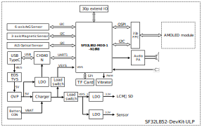
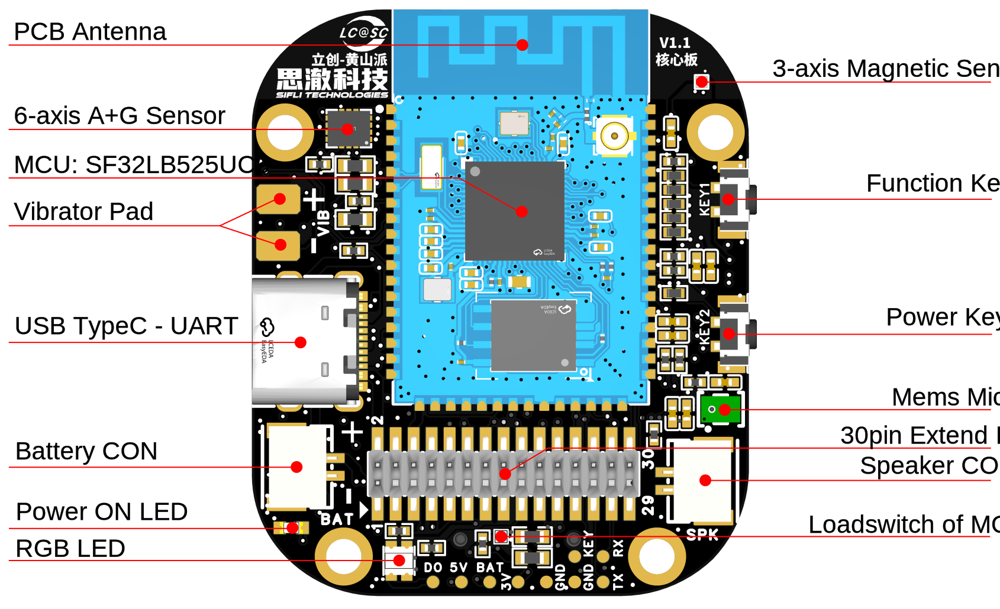
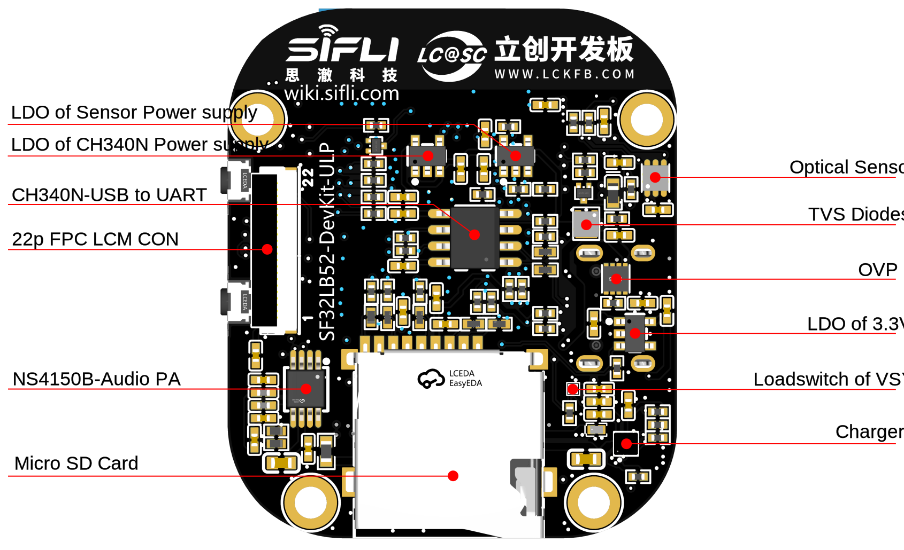
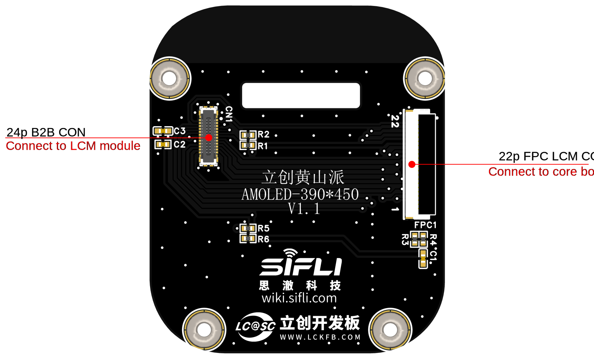
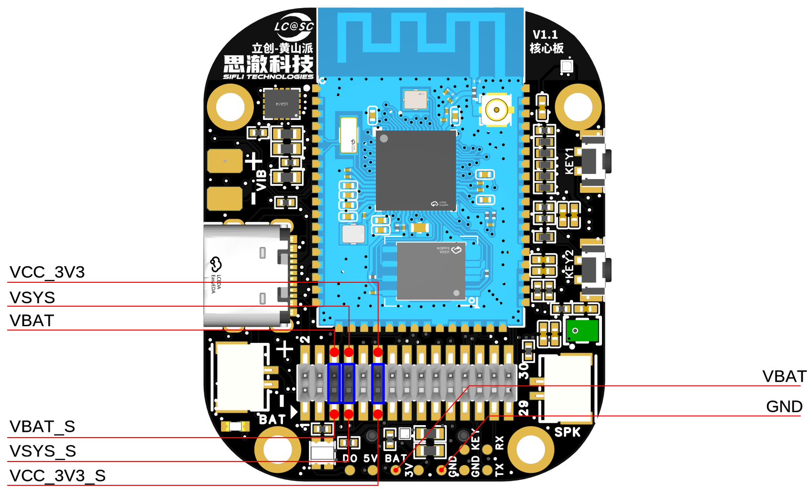

# 立创·黄山派开发板使用指南

（本开发板目前供内部试用，未来将经修改完善后将对外发布）

## 开发板版本信息：

* V1.0.0：采用SF32LB52-MOD-1模组，当前版本

## 开发板概述


立创黄山派是一款基于思澈科技SF32LB52-MOD-1模组的开发板，同时也是智能手表手环的原型机。开发者可以基于此开发板进行智能手表手环的原型设计。

<!--  

<div align="center"> 开发板实物正面照 </div>  <br>  <br>  <br>

 

<div align="center"> 开发板实物背面照 </div>  <br>  <br>  <br> -->


### 特性列表
该开发板具有以下特性：
1.	模组：板载基于SF32LB52x芯片的SF32LB52x-MOD-1-N16R8模组，模组配置如下：
    - 标配SF32LB525UC6芯片，内置合封配置为：
        - 8MB OPI-PSRAM，接口频率144MHz
    - 128Mb QSPI-NOR Flash，接口频率72MHz，STR模式
    - 48MHz晶体
    - 32.768KHz晶体
    - 板载PCBA天线
2.	显示
    - AMOLED 屏幕，型号: ZC-A1D85W-010
    - 1.85寸
    - 390*450
    - 800 cd/m2
    - Quad SPI 显示接口
    - OLED Driver IC: CO5300AF-01
    - Power IC: BV6802W
    - TP IC: FT6146-M00
3.	专用屏幕接口
    - SPI/DSPI/Quad SPI，支持DDR模式QSPI，通过22pin FPC和40pin排针引出
    - 支持I2C接口的触摸屏
4.	音频
    - 板载集成Mems MIC
    - 模拟音频输出，板载Class-D音频PA
    - 外接GH-1.25mm接口的3W/4欧或2W/8欧喇叭
5.	USB
    - Type C-UART接口，板载CH340N串口芯片，实现程序下载和软件DEBUG，可供电
    - USB接口，支持USB2.0 FS，通过30p接口引出
6.	SD卡
    - 支持采用SPI接口的TF卡，板载Micro SD卡插槽
7.  按键
    - 1x 功能按键
    - 1x 开关机按键，支持长按10s复位功能
8.  RGB-LED
    - 1x RGB-LED，SK6812MINI-HS，GPIO控制
9.  马达
    - 板载马达驱动电路，预留外接马达焊接点
10. 传感器
    - 六轴IMU-惯性测量单元，LSM6DS3TR-C
    - 三轴地磁传感器，MMC5603NJ
    - 环境光传感器，LTR-303ALS-01
11. 电源
    - OVP，SY5320
    - Charger，SY6103
    - Loadswitch，LP5240HVF
    - LDO，ETA5055V330DS2F
    - 支持外接GH1.25mm正向线序接口的锂电池，最高充电电压4.5V，最大充电电流500mA
12. 30p 功能扩展接口
    - 2x15p，1.27mm间距排针
    - 扩展GPIO
    - 支持功耗测试


### 功能框图

 

<div align="center"> 开发板功能框图 </div>  <br>  <br>  <br>


### 组件介绍

SF32LB52黄山派开发板包含：

    - 核心板 
    - 屏幕板 
    - 电池 
    - 喇叭 

 

<div align="center"> 核心板正面（点击放大） </div>  <br>  <br>  <br>

 

<div align="center"> 核心板背面（点击放大） </div>  <br>  <br>  <br>

 

<div align="center"> 屏幕板背面（点击放大） </div>  <br>  <br>  <br>

 

<div align="center"> 核心板跳线帽和测试点描述（点击放大） </div>  <br>  <br>  <br>


## 应用程序开发

本节主要介绍硬件和软件的设置方法，以及烧录固件至开发板以及开发应用程序的说明。

### 必备硬件

- 1 x SF32LB52黄山派（含SF32LB52X-MOD-1-N16R8模组）
- 1 x USB2.0数据线（标准A型转Type-C型）
- 1 x电脑（Windows、Linux或macOS）

```{note}
1. 如果需要既通过UART调试，也要使用USB接口，需要两根USB2.0数据线；
2. 请确保使用适当的USB数据线，部分数据线仅可用于充电，无法用于数据传输和程序烧录。
```
### 可选硬件

- 1x 扬声器
- 1x TF Card
- 1x 大于450mAh锂电池

### 硬件设置

准备好开发板，加载第一个示例应用程序：

1.	打开思澈的SifliTrace工具软件，选择正确的COM口；
2.	插入USB数据线，分别连接PC与开发板的USB to UART端口；
3.	LCD屏幕亮起，可以用手指与触摸屏进行交互。

硬件设置完成，接下来可以进行软件设置。


### 软件设置

如何快速设置开发环境，请参考软件相关文档。 

## 硬件参考

本节提供关于开发板硬件的更多信息。

### GPIO分配列表

下表为 SF32LB52-MOD-1-N16R8 模组管脚的 GPIO 分配列表，用于控制开发板的特定组件或功能。

<div align="center"> 信号定义表  </div>

```{table}

|管脚|	管脚名称           	   |   功能  |
|:--|:-----------------------|:-----------|
|1 | GND   | 接地                     |
|2 | PA_44 | VBUS_DET，充电器插入检测   |
|3 | PA_43 | KEY2                    |
|4 | PA_42 | Audio_PA_EN             |
|5 | PA_23 | XTAL32K_XO，默认NC       |
|6 | PA_22 | XTAL32K_XI，默认NC       |
|7 | PA_41 | 触摸屏中断INT             |
|8 | PA_40 | 传感器I2C1_SCL           |
|9 | PA_39 | 传感器I2C1_SDA            |
|10 | PA_38 | VSYS to VSYS_1切换控制   |
|11 | PA_37 | 触摸屏I2C_SCL            |
|12 | PA_36 | USB_DM                  |
|13 | PA_35 | USB_DP                  |
|14 | PA_34 | HOME和长按复位按键        |
|15 | PA_33 | 触摸屏I2C_SDA            |
|16 | PA_32 | RGB LED                 |
|17 | VDD33_VOUT2 | 3.3V电源输出       |
|18 | PA_24 | SPI1_DIO，SD卡接口信号    |
|19 | PA_25 | SPI1_DI，SD卡接口信号     |
|20 | PA_26 | VSYS_1 to VCC33切换控制  |
|21 | PA_27 | SD卡_CD信号              |
|22 | PA_28 | SPI1_CLK，SD卡接口信号    |
|23 | PA_29 | SPI1_CS，SD卡接口信号     |
|24 | PA_30 | VSYS_1 to HR3V3切换控制  |
|25 | PA_31 | 传感器INT1               |
|26 | GND | 接地                       |
|27 | VBAT  | 3.7~4.7V电源输入          |
|28 | PA_20 | vibrator PWM            |
|29 | PA_19 | DB_UART_TXD, 程序下载及软件调试接口 |
|30 | PA_18 | DB_UART_RXD, 程序下载及软件调试接口 |
|31 | PA_11 | Charger I2C0_SDA        |
|32 | PA_10 | Charger I2C0_SCL        |
|33 | AU_DAC1P_OUT | 模拟音频输出信号    |
|34 | AU_DAC1N_OUT | 模拟音频输出信号    |
|35 | GND | 接地                       |
|36 | MIC_BIAS | MIC偏置电压            |
|37 | MIC_ADC_IN | MIC输入信号          |
|38 | PA_09 | 触摸屏中断RST             |
|39 | PA_08 | QSPI D3，LCD接口信号 |
|40 | PA_07 | QSPI D2，LCD接口信号 |
|41 | PA_06 | QSPI D1，E-Paper DC，LCD接口信号 |
|42 | PA_05 | QSPI D0，E-Paper SDI，LCD接口信号 |
|43 | PA_04 | QSPI CLK，E-Paper SCLK，LCD接口信号 |
|44 | PA_03 | QSPI CS，E-Paper CS，LCD接口信号 |
|45 | PA_02 | QSPI TE，E-Paper BUSY，LCD接口信号 |
|46 | PA_01 | BL PWM，LCD接口信号      |
|47 | PA_00 | RSTB，LCD接口信号        |
|48 | GND | 接地                      |
|49 | GND | 接地                      |
|50 | GND | 接地                      |
|51 | GND | 接地                      |
|52 | GND | 接地                      |
|53 | GND | 接地                      |
|54 | GND | 接地                      |
|55 | GND | 接地                      |
|56 | GND | 接地                      |
|57 | GND | 接地                      |
|58 | GND | 接地                      |
|58 | GND | 接地                      |
|60 | GND | 接地                      |
|61 | VBATS | 电池电压检测输入          |
|62 | NC  | NC                        |
|63 | PA_15 | MPI2_D0，SD1_CMD        |
|64 | PA_16 | MPI2_CLK，SD1_D0        |
|65 | PA_17 | MPI2_D3，SD1_D1         |
|66 | PA_14 | MPI2_D2，SD1_CLK        |
|67 | PA_13 | MPI2_D1，SD1_D3         |
|68 | PA_12 | MPI2_CS，SD1_D2         |

```

```{important}
1. SF32LB52-DevKit-ULP适配SF32LB-MOD-1模组。
2. 模组17管脚VDD33_VOUT是3.3V电源输出，默认无输出，需要软件打开内部的LDO使能。
3. 模组27管脚VBAT是电源输入脚，可以直接接锂电池。当不用电池供电，改用常压供电时，输入范围3.7V~4.7V，推荐接3.8V。
4. SF32LB-MOD-1-N16R8模组的VBAT电源的开机阈值软件设置为3.58V，关机阈值软件设置为3.48V。
5. SF32LB-MOD-1-N16R8模组的62~68管脚默认为模组内部连接Nor Flash，开发板无法使用；若要使用SDIO接口，请选择无flash版本的模组。
```

### 30P排针接口定义


<div align="center"> 30p排针接口定义  </div>

```{table}

|管脚|	管脚名称           	   |   功能  |
|:--|:-----------------------|:-----------|
|1  | USB_VBUS_5V    | USB TypeC VBUS                     
|2  | USB_VBUS_5V    | USB TypeC VBUS     
|3  | GND     | 接地 
|4  | GND     | 接地 
|5  | VBAT_S  | VBAT电源输出，需和VBAT管脚短接 
|6  | VBAT    | VBAT电源输入，需和VBAT_S管脚短接 
|7  | VSYS_S  | VSYS电源输出，需和VSYS管脚短接 
|8  | VSYS    | VSYS电源输入，需和VSYS_S管脚短接  
|9  | GND     | 接地 
|10 | GND     | 接地                 
|11 | VCC_3V3_S  | VCC_3V3电源输出，需和VCC_3V3管脚短接                   
|12 | VCC_3V3    | VCC_3V3电源输入，需和VCC_3V3_S管脚短接 
|13 | PA_36   | Default USB_DM 
|14 | PB_39   | Default I2C1_SDA         
|15 | PA_35   | Default USB_DP             
|16 | PA_40   | Default I2C1_SCL 
|17 | PA_32   | Default RGN-LED data, 可以用做GPIO 
|18 | PA_30   | Default Sensor power control，当GPIO使用时，会影响PA39和PA40
|19 | PA_29   | Default SPI1_CS，可以用做GPIO，扩展时核心板上的TF卡不能插入 
|20 | PA_24   | Default SPI1_DO，可以用做GPIO，扩展时核心板上的TF卡不能插入  
|21 | PA_28   | Default SPI1_CLK，可以用做GPIO，扩展时核心板上的TF卡不能插入  
|22 | PA_25   | Default SPI1_DI，可以用做GPIO，扩展时核心板上的TF卡不能插入 
|23 | PA_27   | Default SD_DET，可以用做GPIO，扩展时核心板上的TF卡不能插入
|24 | PA_20   | Default VIB PWM，可以用做GPIO，扩展时核心板上的马达不能焊接 
|25 | PA_19   | Debug UART_TXD 
|26 | PA_34   | KEY1，开关机和长按10s复位 
|27 | PA_18   | Debug UART_RXD 
|28 | PA_43   | KEY2，功能按键 
|29 | PA_11   | Default I2C0_SDA
|30 | PA_10   | Default I2C0_SCL 
```

```{important}
1. 30p的1，2脚连接是USB-TypeC的VBUS输入，当开发板插入USB线时，该管脚可以当5V输出；当开发板未插入USB线是，该管脚可以当5V输入。
2. 30p的5脚是连接在开发板的电池座上，未和下游连接，工作时需要用跳线帽把VBAT_S和VBAT短接。
3. 30p的6脚是连接在开发板的充电IC的VBAT引脚和模组的VBATS引脚上，这里把VBAT_S和VBAT断开是为了方便串电流表测试功耗。
4. 30p的7脚是连接在开发板的充电IC的VSYS引脚上，未和下游连接，工作时需要用跳线帽把VSYS_S和VSYS短接。
5. 30p的8脚是连接在模组的VSYS引脚和其他VSYS输入引脚上，这里把VSYS_S和VSYS断开是为了方便串电流表测试功耗。
6. 30p的11脚是连接在开发板的VSYS_1转VCC_3V3的LDO输出引脚上，未和下游连接，工作时需要用跳线帽把VCC_3V3_S和VCC_3V3短接。
7. 30p的12脚是连接在开发板的的VCC_3V3主电上，这里把VSYS_S和VSYS断开是为了方便串电流表测试功耗。
```

### 22p QSPI线序FPC接口定义

<div align="center"> 22p FPC接口信号定义  </div>

```{table}

|管脚|	管脚名称           	   |   功能  |
|:--|:-----------------------|:-----------|
|1  | VBAT    | VBAT电源输出                     
|2  | PA_01   | BL_PWM信号（TFT屏时使用）    
|3  | PA_07   | QSPI D2，LCD接口信号 
|4  | PA_08   | QSPI D3，LCD接口信号 
|5  | NC      | NC 
|6  | NC      | NC 
|7  | NC      | NC 
|8  | NC      | NC  
|9  | NC      | NC 
|10 | NC      | NC                 
|11 | PA_02   | QSPI TE，LCD接口信号                   
|12 | PA_00   | LCD Reset，LCD接口信号 
|13 | PA_04   | QSPI CLK，SPI CLK，LCD接口信号 
|14 | PB_05   | QSPI D0，SPI SDI，LCD接口信号         
|15 | PA_03   | QSPI CS，SPI CS，LCD接口信号             
|16 | PA_06   | QSPI D1，SPI DC，LCD接口信号 
|17 | VDD_3V3 | 3.3V电源输出 
|18 | PA_41   | 触摸屏INT中断信号
|19 | PA_33   | 触摸屏I2C_SDA信号 
|20 | PA_37   | 触摸屏I2C_SCL信号 
|21 | PA_09   | 触摸屏RTN复位信号 
|22 | GND     | 接地      

```

### 供电说明

SF32LB52黄山派开发板有2种供电方式：USB Type-C和电池供电。

1.  板上USB Type-C接口可以给板子供电。
2.  可以电池单独供电，便于脱离电脑独立运行。

### 硬件设置选项

通过USB-to-UART端口连上USB线，打开思澈科技的程序下载工具，选取相应的COM口和程序。
1.  下载模式
- 勾选BOOT项，上电，开机后进入下载模式，就可以完成程序的下载。
2.  软件开发模式
- 去掉BOOT项，上电，开机后进入串口log打印模式，便进入软件调试模式。
3.  复位
- 通过CH340N的RTS#管脚拉低再拉高实现模组的复位。

**具体请参考&emsp;[固件烧录工具 Impeller](烧录工具)**

### 充电及电池选型

SF32LB52-黄山派开发板集成了SY6103线性充电芯片，最大支持500mA充电电流，默认设置为450mA恒流电流。

电池推荐选取450mAh~500mAh单芯聚合物锂电池，电池接口为GH-1.25mm母座，正向线序，极性请参考开发板上电池座丝印。

### LCD显示屏接口

SF32LB52-黄山派核心板支持QSPI接口LCD屏，接插件为22p-0.5pitch FPC，上翻上下双接触。
信号线序请参考上文定义，线序不同需要做转接板测试，请参考《SF32LB52-DevKit-LCD转接板制作指南》。

### 音频接口

SF32LB52-黄山派核心板集成MEMS MIC和音频功放芯片。
* 支持板上mic的音频信号输入。
* 支持外接喇叭（最大支持3W/4欧姆），喇叭接插件规格（GH-1.25mm母座）。

## 样品获取

联系思澈科技的FAE，获取开发板。

## 相关文档

- [SF32LB52x芯片技术规格书](https://downloads.sifli.com/silicon/DS0052-SF32LB52x-%E8%8A%AF%E7%89%87%E6%8A%80%E6%9C%AF%E8%A7%84%E6%A0%BC%E4%B9%A6%20V2p4.pdf?)
- [SF32LB52x用户手册](https://downloads.sifli.com/silicon/UM0052-SF32LB52x-%E7%94%A8%E6%88%B7%E6%89%8B%E5%86%8C%20V0p3.pdf?)
- [SF32LB52-MOD-1技术规格书](https://downloads.sifli.com/silicon/DS5203-SF32LB52-MOD-1%E6%8A%80%E6%9C%AF%E8%A7%84%E6%A0%BC%E4%B9%A6%20V0p1.pdf?)
- [SF32LB52-MOD-1设计图纸](https://downloads.sifli.com/hardware/files/documentation/SF32LB52-MOD-1-V1.0.0.zip?)
- [SF32LB52-黄山派设计图纸](https://downloads.sifli.com/hardware/files/documentation/SF32LB52-HSPDevKit_V1.1.0.zip?)
- [SF32LB52-DevKit-LCD转接板制作指南](SF32LB52-DevKit-LCD-Adapter)

