# SF32LB58-DevKit-LCD开发板使用指南

## 模组版本信息：

* V1.0.1：SF32LB58-MOD-N16R32N1和SF32LB58-MOD-A128R32N1，采用SF32LB586VDD36芯片，当前版本
```{table} 
:align: center
|序号 | V1.0.1更新内容 |
|:-- |:------ |
|1 | 修改eMMC电源控制IO，存储颗粒的VCC和VCCQ电源控制IO由PA80修改为：PA74控制VCC，PA80控制VCCQ。增加电阻R0115。   
```
* V1.0.0：SF32LB58-MOD-N16R32N1，采用SF32LB586VDD36芯片


## 开发板版本信息：

* V1.0.1：采用SF32LB58-MOD-N16R32N1-V1.0.1和SF32LB58-MOD-A128R32N1-V1.0.1模组，内部焊接SF32LB586VDD36芯片，当前版本
```{table} 
:align: center
|序号 | V1.0.1更新内容 |
|:-- |:------ |
|1 | 增加USB拔插检查功能，采用PB_24。   
|2 | 修改PTC为2A/6V，解决双音频最大功率输出时，供电电流不足的问题。 
|3 | 去掉RGBLED电路里的电平转换部分，该电路不满足RGBLED的时序。
|4 | 更换DCDC芯片，解决输出纹波大的问题。
|5 | 去掉USB dp信号上的上拉电阻，解决USB slave时无法中断的问题。
```
* V1.0.0：采用SF32LB58-MOD-N16R32N1-V1.0.0模组，内部焊接SF32LB587VEE56芯片，初始版本

## 开发板概述

SF32LB58-DevKit-LCD是一款基于SF32LB58-MOD模组的开发板，主要用于开发基于`DSI`，`DPI`和`QSPI`接口显示屏的各种应用。

开发板同时搭载模拟MIC输入，模拟音频输出，SDIO接口，USB-C接口，支持TF卡等，为开发者提供丰富的硬件接口资源，可以用于开发各种接口外设的驱动，帮助开发者简化硬件开发过程和缩短产品的上市时间。

 

<div align="center"> SF32LB58_DevKit-LCD开发板实物正面照 </div>   <br> <br> <br> 


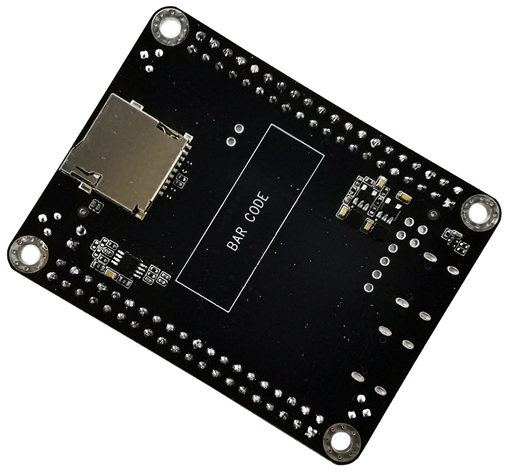 

<div align="center"> SF32LB58_DevKit-LCD开发板实物背面照 </div>   <br> <br> <br>  


### 特性列表
该开发板具有以下特性：
1.	模组：板载基于SF32LB58x芯片的SF32LB58-MOD-N16R32N1或SF32LB58-MOD-A128R32N1模组，模组配置如下：
    - 标配SF32LB586VDD36芯片，内置合封配置为：
        - 16MB HPI-PSRAM，接口频率144MHz
        - 16MB HPI-PSRAM，接口频率144MHz
        - 1MB  QSPI-NOR Flash，接口频率48MHz
    - 16MB QSPI-NOR Flash，接口频率72MHz，STR模式（SF32LB58-MOD-N16R32N1版本）
    - 128MB QSPI-Nand Flash，接口频率72MHz，STR模式（SF32LB58-MOD-A128R32N1版本）
    - 48MHz晶体
    - 32.768KHz晶体
    - IPEX天线座
    - 射频匹配网络及其它阻容感器件
2.	专用屏幕接口
    - DSI/RGB888，最高2lane数据传输，通用30pin线序FPC连接器
    - DPI/RGB888，支持串行8bit RGB，正点原子40pin线序FPC连接器
    - 双路SPI/DSPI/QSPI，支持DDR模式QSPI，通过40pin排针引出
    - 支持I2C接口的触摸屏
3.	音频
    - 支持双路模拟MIC输入，默认板载一路模拟MIC输入，通过电阻跳选板载MIC或40pin排针输入
    - 支持立体声模拟音频输出，板载Class-D音频PA，最高2.8W/4欧姆喇叭输出，喇叭连接40pin排针
4.	USB
    - Type C接口，支持板载USB转串口芯片，实现程序下载和软件DEBUG，可供电
    - Type C接口，支持USB2.0 HS，可供电
5.	SD卡
    - 支持采用SDIO接口的TF卡，板载Micro SD卡插槽
6.  排针
    - 大核GPIO输入输出接口，40pin排针
    - 小核GPIO输入输出接口，40pin排针


### 功能框图

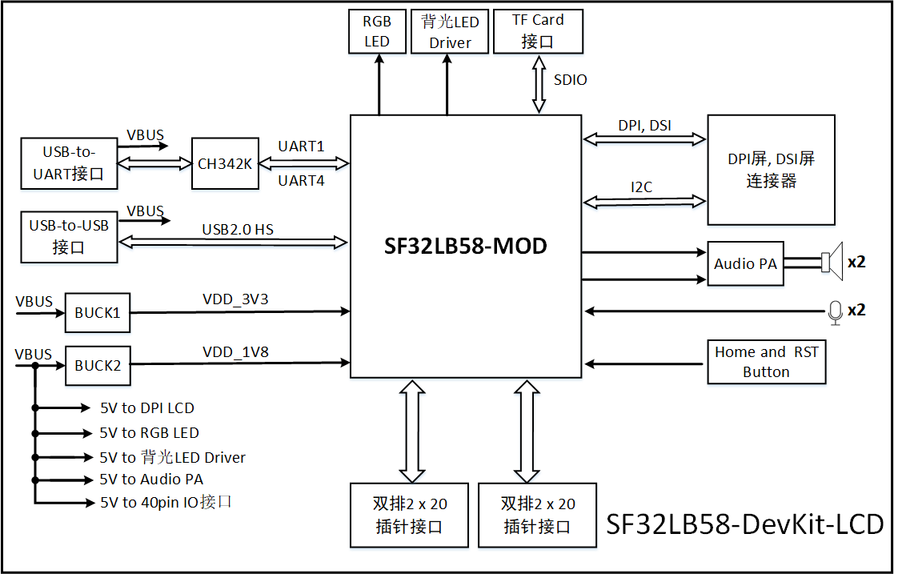 

<div align="center"> 开发板功能框图 </div>   <br> <br> <br> 

 
### 组件介绍

SF32LB58-DevKit-LCD开发板的主板是整个套件的核心，该主板集成了SF32LB58-MOD-N16R32N1模组，并提供MIPI-DSI和DPI/RGB888的LCD连接座

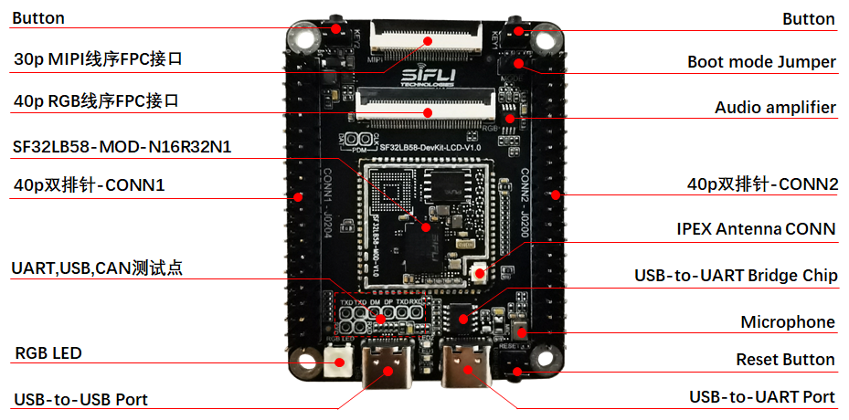 

<div align="center"> SF32LB58-DevKit-LCD Board - 正面（点击放大） </div>   <br> <br> <br> 


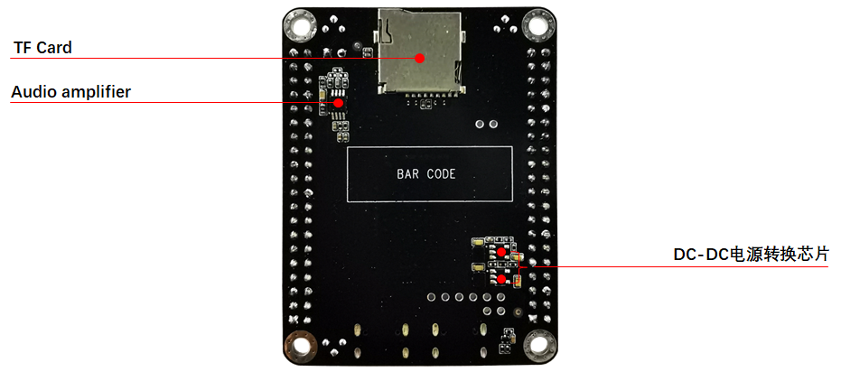 

<div align="center"> SF32LB58-DevKit-LCD Board - 背面（点击放大） </div>   <br> <br> <br> 

 
## 应用程序开发

本节主要介绍硬件和软件的设置方法，以及烧录固件至开发板以及开发应用程序的说明。

### 必备硬件

- 1 x SF32LB58-DevKit-LCD（含SF32LB58-MOD-N16R32N1模组）
- 1 x 屏幕模组(MIPI-DSI或DPI/RGB888)
- 1 x USB2.0数据线（标准A型转Type-C型）
- 1 x电脑（Windows、Linux或macOS）

```{note}

1. 如果需要既通过UART调试，也要使用USB接口，需要两根USB2.0数据线；
2. 请确保使用适当的USB数据线，部分数据线仅可用于充电，无法用于数据传输和程序烧录。

```
### 可选硬件

- 2 x扬声器
- 1 x TF Card

### 硬件设置

准备好开发板，加载第一个示例应用程序：

1.	连接屏幕模组至相应的LCD连接器接口；
2.	打开思澈的SifliTrace工具软件，选择正确的COM口；
3.	插入USB数据线，分别连接PC与开发板的USB to UART端口；
4.	屏幕亮起，可以用手指与触摸屏进行交互。

硬件设置完成，接下来可以进行软件设置。


### 软件设置

SF32LB58-DevKit-LCD的开发板，如何快速设置开发环境，请参考软件相关文档。 

## 硬件参考

本节提供关于开发板硬件的更多信息。

### GPIO分配列表

下表为 SF32LB58-MOD-N16R32N1 模组管脚的 GPIO 分配列表，用于控制开发板的特定组件或功能。

<div align="center"> SF32LB58-MOD-N16R32N1 GPIO分配 </div>

```{table}
:align: center
|管脚|	管脚名称           	   |   功能  |
|:--|:-----------------------|:-----------|
|1   | VDDIOB   | PB域GPIO电源输入                 
|2   | PB_36    | DB_UART_RXD, 程序下载及软件调试接口   
|3   | PB_37    | DB_UART_TXD, 程序下载及软件调试接口   
|4   | PB_54    | HOME和长按复位按键        
|5   | PA_75    | SD2_DIO1，SD卡接口信号    
|6   | PA_76    | SD2_DIO0，SD卡接口信号    
|7   | PA_77    | SD2_CLK， SD卡接口信号    
|8   | PA_70    | SD2_CND， SD卡接口信号    
|9   | PA_81    | SD2_DIO3，SD卡接口信号    
|10  | PA_79    | SD2_DIO2，SD卡接口信号    
|11  | Boot_Mode | Boot方式选择信号，=1时，下载模式；=0时，运行模式  
|12  | RSTN     | MCU复位信号 
|13  | VDD_1V8  | 1.8V电源输入                
|14  | GND      | 接地         
|15  | VDDIOA   | PA12~PA93 电源输入       
|16  | VDD_3V3  | 3.3V电源输入                 
|17  | PA_13    | DPI DE，LCDC1接口信号       
|18  | PA_15    | DPI VSYNC，LCDC1接口信号    
|19  | PA_14    | DPI HSYNC，LCDC1接口信号    
|20  | PA_12    | DPI CLK，LCDC1接口信号      
|21  | PA_67    | DPI B7，LCDC1接口信号       
|22  | PA_65    | DPI B6，LCDC1接口信号       
|23  | PA_63    | DPI B5，LCDC1接口信号       
|24  | PA_62    | DPI B4，LCDC1接口信号       
|25  | PA_61    | DPI B3，LCDC1接口信号       
|26  | PA_58    | DPI B2，LCDC1接口信号       
|27  | PA_57    | DPI B1，LCDC1接口信号       
|28  | PA_56    | DPI B0，LCDC1接口信号       
|29  | PA_55    | DPI G7，LCDC1接口信号       
|30  | PA_54    | DPI G6，LCDC1接口信号       
|31  | PA_53    | DPI G5，LCDC1接口信号       
|32  | PA_50    | DPI G4，LCDC1接口信号       
|33  | PA_48    | DPI G3，LCDC1接口信号       
|34  | PA_47    | DPI G2，LCDC1接口信号       
|35  | PA_46    | DPI G1，LCDC1接口信号       
|36  | PA_45    | DPI G0，LCDC1接口信号       
|37  | PA_44    | DPI R7，LCDC1接口信号       
|38  | PA_43    | DPI R6，LCDC1接口信号       
|39  | PA_27    | DPI R5，LCDC1接口信号       
|40  | PA_26    | DPI R4，LCDC1接口信号       
|41  | PA_25    | DPI R3，LCDC1接口信号       
|42  | PA_24    | DPI R2，LCDC1接口信号       
|43  | PA_23    | DPI R1，LCDC1接口信号       
|44  | PA_22    | DPI R0，LCDC1接口信号       
|45  | VDDIOA2  | PA00~PA11 电源输入        
|46  | GND      | 接地  
|47  | DSI_D0N  | MIPI-DSI D0N，LCDC1接口信号   
|48  | DSI_D0P  | MIPI-DSI D0P，LCDC1接口信号   
|49  | DSI_CLKN | MIPI-DSI CLKN，LCDC1接口信号   
|50  | DSI_CLKP | MIPI-DSI CLKP，LCDC1接口信号   
|51  | DSI_D1N  | MIPI-DSI D1N，LCDC1接口信号   
|52  | DSI_D1P  | MIPI-DSI D1P，LCDC1接口信号   
|53  | PA_32    | GPIO，UART1_RXD 
|54  | PA_31    | GPIO，UART1_TXD 
|55  | USB_DN   | USB_DN 
|56  | USB_DP   | USB_DP 
|57  | PA_17    | CTP Interrupt，DSI/DPI LCDC1接口信号  
|58  | PA_16    | CTP Reset，DSI/DPI LCDC1接口信号 
|59  | PA_00    | GPIO，SD1_DIO7，CAN1_TXD 
|60  | PA_03    | GPIO，SD1_DIO5，CAN1_RXD 
|61  | PB_17    | GPIO 
|62  | PB_18    | GPIO 
|63  | PB_11    | SWD_DIO 
|64  | PB_07    | SWD_CLK 
|65  | GND      | 接地     
|66  | AU_DAC1N_OUT | 模拟音频输出信号    
|67  | AU_DAC1P_OUT | 模拟音频输出信号    
|68  | MIC_BIAS | MIC偏置电压            
|69  | AU_ADC1N_IN  | MIC输入信号        
|70  | AU_ADC1P_IN  | MIC输入信号        
|71  | GND      | 接地     
|72  | BT_ANT   | 蓝牙天线信号 
|73  | PB_51    | GPIO 
|74  | PB_52    | GPIO 
|75  | PB_56    | GPIO，KEY2 Input 
|76  | PB_57    | GPIO 
|77  | PB_58    | GPIO，TF卡 Detect信号 
|78  | PB_59    | GPIO 
|79  | PA_93    | CTP Reset， LCDC1接口信号 
|80  | PA_92    | CTP Interrupt， LCDC1接口信号
|81  | PA_91    | QSPI D0， LCDC1接口信号 
|82  | PA_90    | QSPI CLK，LCDC1接口信号 
|83  | PA_88    | QSPI CS， LCDC1接口信号 
|84  | PA_86    | QSPI D3， LCDC1接口信号 
|85  | PA_84    | QSPI D2， LCDC1接口信号 
|86  | PA_82    | QSPI D1， LCDC1接口信号 
|87  | PA_60    | CTP I2C_SCL，DSI/DPI LCDC1接口信号 
|88  | PA_59    | CTP I2C_SDA，DSI/DPI LCDC1接口信号 
|89  | PA_52    | BL PWM，QSPI LCDC1接口信号   
|90  | PA_51    | LCD Reset， QSPI LCDC1接口信号   
|91  | PA_42    | BL PWM，DSI/DPI LCDC1接口信号   
|92  | PA_20    | GPIO，UART3_RXD 
|93  | PA_21    | GPIO，UART3_TXD 
|94  | PA_29    | GPIO，I2C2_SDA 
|95  | PA_28    | GPIO，I2C2_SCL
|96  | PA_18    | LCD Reset，DSI/DPI LCDC1接口信号 
|97  | PA_02    | GPIO，CAN2_RXD 
|98  | PA_11    | GPIO，CAN2_TXD，SCI_RST 
|99  | PA_08    | GPIO，SD1_DIO6，SCI_DIO，UART2_RXD 
|100 | PA_07    | GPIO，SD1_DIO4，SCI_CLK，UART2_TXD  
|101 | PA_10    | GPIO，SD1_CMD， MPI4_CS 
|102 | PA_09    | GPIO，SD1_CLK， MPI4_CLK 
|103 | PA_06    | GPIO，SD1_DIO3，MPI4_DIO3 
|104 | PA_04    | GPIO，SD1_DIO1，MPI4_DIO1
|105 | PA_05    | GPIO，SD1_DIO0，MPI4_DIO0 
|106 | PA_01    | GPIO，SD1_DIO2，MPI4_DIO2 
|107 | PB_10    | QSPI CLK，LCDC2接口信号 
|108 | PB_09    | QSPI D0， LCDC2接口信号 
|109 | PB_08    | QSPI CS， LCDC2接口信号 
|110 | PB_06    | QSPI D3， LCDC2接口信号 
|111 | PB_04    | QSPI D2， LCDC2接口信号 
|112 | PB_03    | QSPI D1， LCDC2接口信号 
|113 | PB_02    | TE，      LCDC2接口信号 
|116 | PB_23    | Audio PA 使能信号 
|117 | PB_26    | GPIO
|118 | PB_28    | GPIO，I2C6_SCL 
|119 | PB_29    | GPIO，I2C6_SDA 
|120 | PB_24    | GPIO 
|121 | PB_27    | CTP Reset，LCDC2接口信号 
|122 | PB_31    | BL PWM，   LCDC2接口信号 
|123 | PB_30    | LCD Reset，LCDC2接口信号  
|124 | PB_34    | CTP Interrupt，LCDC2接口信号 
|125 | PB_39    | RGB-LED 控制信号 
|126 | PB_38    | GPIO 
|127 | PB_47    | Green-LED 控制信号 
|128 | PB_48    | Blue-LED  控制信号 
|129 | AU_DAC2N_OUT | 模拟音频输出信号    
|130 | AU_DAC2P_OUT | 模拟音频输出信号    
|131 | AU_ADC2N_IN  | MIC输入信号        
|132 | AU_ADC2P_IN  | MIC输入信号        
|133 | GND      | 接地    
|134 | GND      | 接地    
|135 | GND      | 接地    
|136 | GND      | 接地    
|137 | GND      | 接地    
|138 | GND      | 接地    

```

模组内部存储器GPIO分配表：

<div align="center"> SF32LB58-MOD-N16R32N1 模组内部Nor Flash存储器GPIO分配 </div>

```{table}
:align: center
|管脚|	管脚名称           	   |   功能  |
|:--|:-----------------------|:-----------|
|1   | PA_30    | MPI4_CS                 
|2   | PA_36    | MPI4_D2   
|3   | PA_37    | MPI4_D1   
|4   | PA_38    | MPI4_D3  
|5   | PA_39    | MPI4_CLK  
|6   | PA_40    | MPI4_D0 
|7   | PA_87    | MPI4 Flash存储器电源使能；=1 打开电源，=0 关闭电源 &emsp; &emsp; &emsp; &emsp;

```

<div align="center"> SF32LB58-MOD-N16R32N1 模组内部eMMC存储器GPIO分配 </div>

```{table}
:align: center
|管脚|	管脚名称           	   |   功能  |
|:--|:-----------------------|:-----------|
|1   | PA_30    | SD1_D1   
|2   | PA_33    | SD1_D7   
|3   | PA_34    | SD1_CMD  
|4   | PA_35    | SD1_D6             
|5   | PA_36    | SD1_D2   
|6   | PA_37    | SD1_D5   
|7   | PA_38    | SD1_D4  
|8   | PA_39    | SD1_CLK  
|9   | PA_40    | SD1_D3 
|10  | PA_41    | SD1_D0   
|11  | PA_49    | RESET(GPIO复位)  
|12  | PA_80    | SD1 eMMC存储器电源使能；=1 打开电源，=0 关闭电源 &emsp; &emsp; &emsp; &emsp;

```

### 40P排针接口定义

<div align="center"> CONN1-J0204 信号定义 </div>

```{table}
:align: center
|管脚|	管脚名称           	   |   功能  |
|:--|:-----------------------|:-----------|
|1   | 3V3      | 3v3 power                 
|2   | 5V       | 5v power   
|3   | IO2      | PB_29，**I2C6_SDA**，UART6_TXD，LPCOMP1_N   
|4   | 5V       | 5v power        
|5   | IO3      | PB_28，**I2C6_SCL**，UART6_RXD，LPCOMP1_P     
|6   | GND      | 接地    
|7   | IO4      | PB_38，GPTIM3_CH3，GPADC_CH6，UART6_CTS    
|8   | IO14     | PB_01，**UART6_TXD**，I2C7_SCL，GPTIM3_CH2，LPTIM3_OUT    
|9   | GND      | 接地    
|10  | IO15     | PB_00，**UART6_RXD**，I2C7_SDA，GPTIM3_CH1，LPTIM3_IN     
|11  | IO17     | PB_17，UART5_RXD，SPI3_CLK   
|12  | IO18     | PB_18，UART5_TXD，SPI3_DI 
|13  | IO27     | PB_34，SPI4_CS，I2S3_MCLK，GPADC_CH2                
|14  | GND      | 接地         
|15  | IO22     | PB_27       
|16  | IO23     | PB_30                 
|17  | 3V3      | 3v3 power       
|18  | IO24     | PB_31    
|19  | IO10     | PB_02    
|20  | GND      | 接地      
|21  | IO9      | PB_04       
|22  | IO25     | PB_03       
|23  | IO11     | PB_08       
|24  | IO8      | PB_06       
|25  | GND      | 接地       
|26  | IO7      | PB_09       
|27  | IO0      | PB_10       
|28  | IO1      | PA_01       
|29  | IO5      | PA_05       
|30  | GND      | 接地      
|31  | IO6      | PA_04       
|32  | IO12     | PA_06       
|33  | IO13     | PA_09       
|34  | GND      | 接地       
|35  | IO19     | PA_07       
|36  | IO16     | PA_10       
|37  | IO26     | PA_11       
|38  | IO20     | PA_08       
|39  | GND      | 接地       
|40  | IO21     | PA_02            
```

<div align="center"> CONN2-J0200 信号定义 </div>

```{table}
:align: center
|管脚|	管脚名称           	   |   功能  |
|:--|:-----------------------|:-----------|
|1   | 3V3      | 3v3 power                 
|2   | 5V       | 5v power   
|3   | IO2      | PA_29   
|4   | 5V       | 5v power        
|5   | IO3      | PA_28     
|6   | GND      | 接地    
|7   | IO4      | PB_07    
|8   | IO14     | PA_21   
|9   | GND      | 接地    
|10  | IO15     | PA_20     
|11  | IO17     | MIC_BIAS   
|12  | IO18     | PB_11 
|13  | IO27     | ADC1N_IN，模拟音频通道1差分输入N端 &emsp; &emsp; &emsp; &emsp; &emsp; &emsp; &emsp; &emsp; &emsp; &emsp; &emsp;               
|14  | GND      | 接地         
|15  | IO22     | ADC1P_IN，模拟音频通道1差分输入P端        
|16  | IO23     | ADC2N_IN，模拟音频通道2差分输入N端                 
|17  | 3V3      | 3v3 power       
|18  | IO24     | ADC2P_IN，模拟音频通道2差分输入P端     
|19  | IO10     | PA_43    
|20  | GND      | 接地      
|21  | IO9      | PA_84       
|22  | IO25     | PA_82       
|23  | IO11     | PA_88       
|24  | IO8      | PA_86       
|25  | GND      | 接地       
|26  | IO7      | PA_91       
|27  | IO0      | PA_90       
|28  | IO1      | PA_51       
|29  | IO5      | PA_92       
|30  | GND      | 接地      
|31  | IO6      | PA_93       
|32  | IO12     | PA_52       
|33  | IO13     | PB_57       
|34  | GND      | 接地       
|35  | IO19     | SPK1_P，左声道喇叭输出P端       
|36  | IO16     | SPK1_N，左声道喇叭输出N端        
|37  | IO26     | SPK2_P，右声道喇叭输出P端       
|38  | IO20     | SPK2_N，右声道喇叭输出N端       
|39  | GND      | 接地       
|40  | IO21     | PB_59            

```

### 40p RGB线序FPC接口定义

**兼容正点原子40pin线序FPC接口**

<div align="center"> RGB-FPC-J0201 信号定义 </div>

```{table}
:align: center
|管脚|	管脚名称           	   |   功能  |
|:--|:-----------------------|:-----------|
|1   | 5V       | 5V电源输出                 
|2   | 5V       | 5V电源输出   
|3   | R0       | PA_22，LCDC1_DPI_R0  &emsp; &emsp; &emsp; &emsp; &emsp; &emsp; &emsp; &emsp; &emsp; &emsp; &emsp; &emsp; &emsp; &emsp; &emsp; &emsp; &emsp; &emsp;  
|4   | R1       | PA_23，LCDC1_DPI_R1        
|5   | R2       | PA_24，LCDC1_DPI_R2    
|6   | R3       | PA_25，LCDC1_DPI_R3    
|7   | R4       | PA_26，LCDC1_DPI_R4    
|8   | R5       | PA_27，LCDC1_DPI_R5    
|9   | R6       | PA_43，LCDC1_DPI_R6    
|10  | R7       | PA_44，LCDC1_DPI_R7    
|11  | GND      | 接地  
|12  | G0       | PA_45，LCDC1_DPI_G0 
|13  | G1       | PA_46，LCDC1_DPI_G1                
|14  | G2       | PA_47，LCDC1_DPI_G2         
|15  | G3       | PA_48，LCDC1_DPI_G3       
|16  | G4       | PA_50，LCDC1_DPI_G4                 
|17  | G5       | PA_53，LCDC1_DPI_G5       
|18  | G6       | PA_54，LCDC1_DPI_G6    
|19  | G7       | PA_55，LCDC1_DPI_G7    
|20  | GND      | 接地      
|21  | B0       | PA_56，LCDC1_DPI_B0       
|22  | B1       | PA_57，LCDC1_DPI_B1       
|23  | B2       | PA_58，LCDC1_DPI_B2       
|24  | B3       | PA_61，LCDC1_DPI_B3       
|25  | B4       | PA_62，LCDC1_DPI_B4       
|26  | B5       | PA_63，LCDC1_DPI_B5       
|27  | B6       | PA_65，LCDC1_DPI_B6       
|28  | B7       | PA_67，LCDC1_DPI_B7       
|29  | GND      | 接地       
|30  | CLK      | PA_12，LCDC1_DPI_CLK        
|31  | HSYNC    | PA_14，LCDC1_DPI_HSYNC       
|32  | VSYNC    | PA_15，LCDC1_DPI_VSYNC       
|33  | DE       | PA_13，LCDC1_DPI_DE       
|34  | BL       | PA_42，BL_PWM       
|35  | CTP_RST  | PA_16       
|36  | CTP_SDA  | PA_59，I2C4_SDA       
|37  | NC       | -       
|38  | CTP_SCL  | PA_60，I2C4_SCL       
|39  | CTP_INT  | PA_17       
|40  | RESET    | PA_18            

```

### 30p MIPI线序FPC接口定义

<div align="center"> MIPI-FPC-J0202 信号定义 </div>

```{table}
:align: center
|管脚|	管脚名称           	   |   功能  |
|:--|:-----------------------|:-----------|
|1   | GND      | 接地                 
|2   | D2P      | MIPI-DSI信号，Data lane2 positive 输出  
|3   | D2N      | MIPI-DSI信号，Data lane2 negative 输出   
|4   | GND      | 接地        
|5   | D1P      | MIPI-DSI信号，Data lane1 positive 输出   
|6   | D1N      | MIPI-DSI信号，Data lane1 negative 输出    
|7   | GND      | 接地    
|8   | DCKP     | MIPI-DSI信号，clock positive 输出     
|9   | DCKN     | MIPI-DSI信号，clock negative 输出     
|10  | GND      | 接地    
|11  | D0P      | MIPI-DSI信号，Data lane0 positive 输出  
|12  | D0N      | MIPI-DSI信号，Data lane0 negative 输出 
|13  | GND      | 接地                
|14  | D3P      | MIPI-DSI信号，Data lane3 positive 输出         
|15  | D3N      | MIPI-DSI信号，Data lane3 negative 输出       
|16  | GND      | 接地                 
|17  | TE/NC    | PA_43，Tearing effect to MCU frame signal &emsp; &emsp; &emsp; &emsp; &emsp; &emsp; &emsp; &emsp; &emsp; &emsp;    
|18  | RESX     | PA_18，LCD RESET信号    
|19  | IOVCC    | MIPI-DSI 屏驱I/O电源，1.8V输出    
|20  | VCI      | MIPI-DSI 屏驱VDD电源，3.3V输出      
|21  | CTP_VDD  | CTP 驱动VDD电源，3.3V输出       
|22  | CTP_INT  | PA_17，触摸屏中断输入       
|23  | CTP_SDA  | PA_59，触摸屏I2C SDA信号       
|24  | CTP_SCL  | PA_60，触摸屏I2C SCL信号       
|25  | CTP_RTN  | PA_59，触摸屏RESET信号       
|26  | LEDK     | 背光二极管阴极       
|27  | LEDK     | 背光二极管阴极       
|28  | NC       | -       
|29  | LEDA     | 背光二极管阳极       
|30  | LEDA     | 背光二极管阳极       

```

### 供电说明

SF32LB58-DevKit-LCD开发板支持 USB Type-C 供电。

板上2个USB Type-C接口都可以给板子供电，下载和调试时，请用 USB-to-UART 端口。


### 烧录测试固件

#### 固件烧录工具 Impeller 下载
通过USB-to-UART端口连上USB线，打开思澈科技的程序下载工具，选取相应的COM口和程序。
1.  下载模式
- 插上Mode跳线帽，上电，开机后进入下载模式，就可以完成程序的下载。
2.  软件开发模式
- 去掉Mode跳线帽，上电，开机后进入串口log打印模式，便进入软件调试模式。

**具体请参考&emsp;[固件烧录工具 Impeller](../tools/烧录工具.md)**

#### Jlink SWD工具下载和调试

如下面两图所示，用杜邦线把对应的IO连接起来。

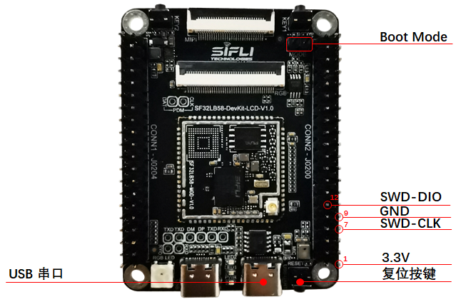 

<div align="center"> SF32LB58-DevKit-LCD Jlink调试接线图 </div>   <br> <br> <br> 

 
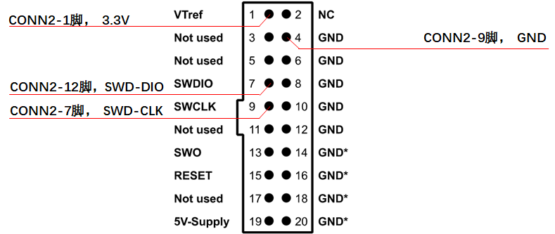 

<div align="center"> Jlink调试器接线图 </div>   <br> <br> <br> 

 
为了方便连接，开发板附带了下图的转接板，转接板可以按缺口方向连接到JLink调试器，再插上附带的杜邦线，并将杜邦线的另一端连接到{numref}`SF32LB58-DevKit-LCD-Jlink-PIN`对应的管脚，其中VCC即3.3V管脚。

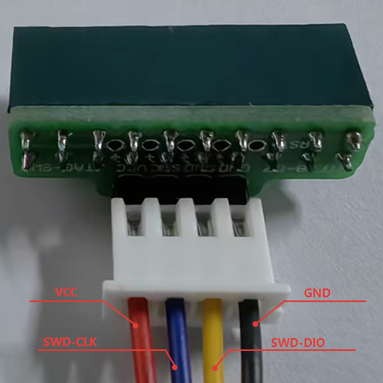 

<div align="center"> SWD调试器接线图 </div>   <br> <br> <br> 


### LCD显示屏接口

SF32LB58-DevKit-LCD开发板支持：
- MIPI-DSI接口（30p 0.5mm间距 FPC座），最高支持 2lane数据传输，最高支持1280*800分辨率
    * 已支持屏型号：[TFT-H080A11HDIFT4C30_V0-1](鑫洪泰)
- RGB接口（40p 0.5mm间距 FPC座），最高支持RGB888 24bit数据传输，最高支持1280*800分辨率
    * 已支持屏型号：
        * [IPS版7寸RGB屏模块1024*600（正点原子）](https://detail.tmall.com/item.htm?abbucket=17&id=609758563397&rn=b8068af8e33ece4aa2c043b54a77a153&spm=a1z10.5-b-s.w4011-24686329149.72.255354adb0S1oV)
        * [HTM-H070A20-RGB-A01C_V0-1](https://item.taobao.com/item.htm?id=845117257237&spm=a213gs.v2success.0.0.42674831Eg7yk8&skuId=5791172462409)
- QSPI接口（通过40p接口引出），最高支持512*512分辨率

**具体请参考&emsp;[屏幕调试工具](../tools/屏幕调试工具.md)**

#### MIPI屏接口

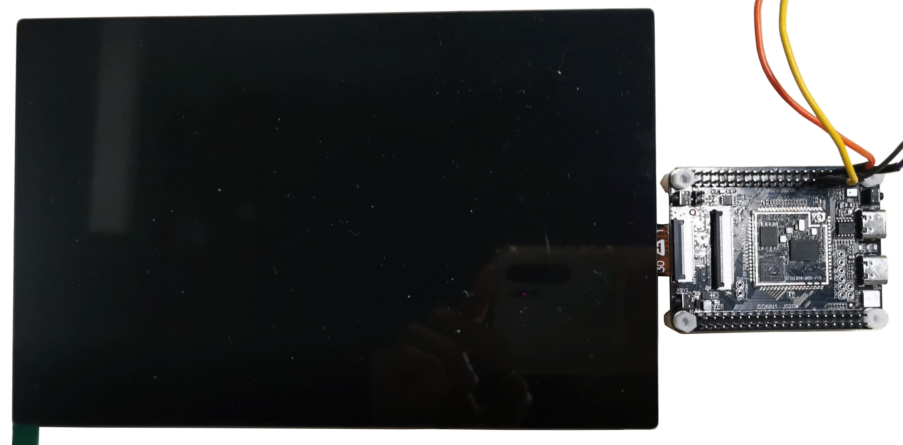 

<div align="center"> MIPI接口屏调试接线图 </div>   <br> <br> <br> 


#### RGB屏接口

#### QSPI屏接口

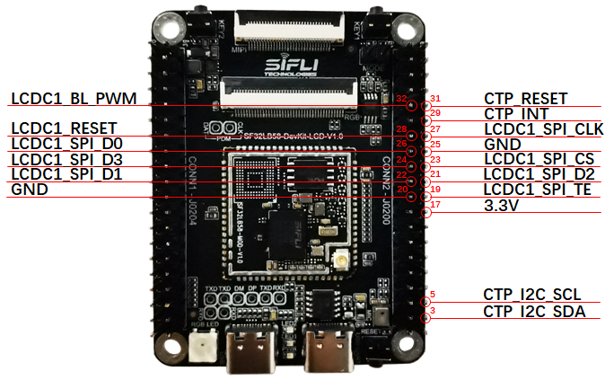 

<div align="center"> 大核QSPI接口屏调试接线图 </div>   <br> <br> <br> 


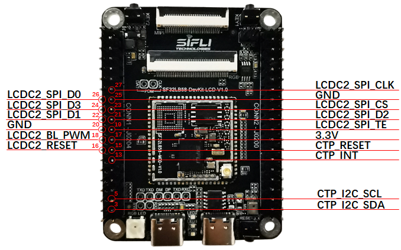 

<div align="center"> 小核QSPI接口屏调试接线图 </div>   <br> <br> <br> 

 
### 音频接口

SF32LB58-DevKit-LCD开发板支持：
- 1路板载麦克风输入
- 2路音频ADC输入（有1路和板载麦克风复用，通过电阻跳选）
- 2路SPK输出（最大支持3W/4欧喇叭）
- 1路PDM信号(和RGB信号复用，RGB屏工作时无法使用)

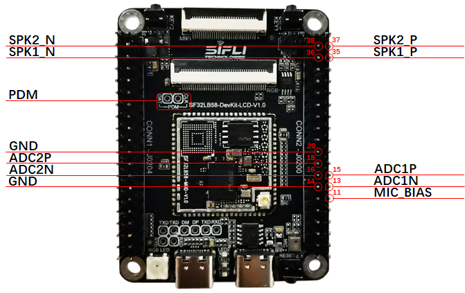 

<div align="center"> 音频调试接线图 </div>   <br> <br> <br> 

 
### CAN接口

SF32LB58-MOD模组内置CAN控制器，开发板引出CAN接口，需要外接CAN总线发送接收器使用。

参考 &emsp; [CAN总线发送接收模块](https://www.waveshare.net/shop/SN65HVD230-CAN-Board.htm)

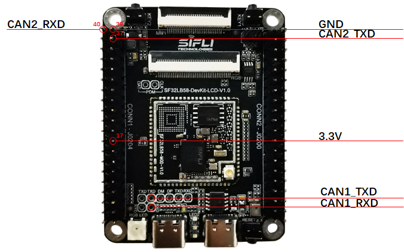 

<div align="center"> CAN调试接线图 </div>   <br> <br> <br> 


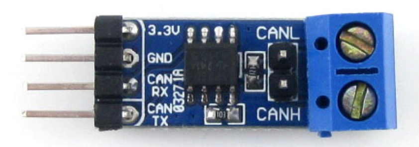 

<div align="center"> 参考CAN总线收发模块 </div>   <br> <br> <br> 

 
### SDIO WiFi接口

参考 &emsp; [SDIO WiFi 模块](http://www.openedv.com/docs/modules/iot/atk-sdio-wifi.html)


 

<div align="center"> 参考SDIO WiFi模块 </div>   <br> <br> <br> 


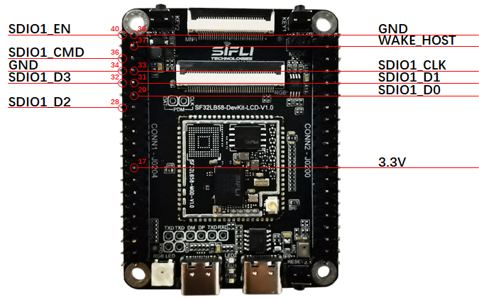 

<div align="center"> SDIO WiFi接线图 </div>   <br> <br> <br> 


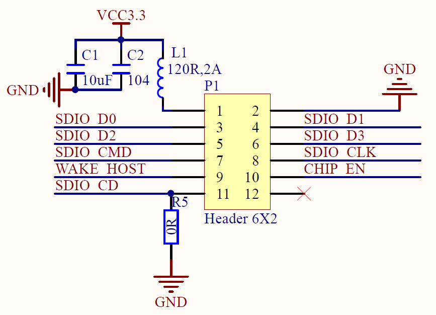 

<div align="center"> 参考SDIO WiFi模块原理图 </div>   <br> <br> <br> 

 
## 样品获取

获取芯片:
- [SF32LB583VCC36](https://item.taobao.com/item.htm?id=933517354004&pisk=gv7sWM4jUAD_VujJfEPEAjyseKT2hWzPBjOAZs3ZMFL9Hr65p1-v3lXXctWHDN8N_99AI9v2BISZlxIditJwushXM989mGJ2QKTfiTs_UzzPs1YDy8yzzmhRoyY96q3tXSnpgIPe6utzUA8Dk8yrYqKgPEXtrvQsHDdpKCGtHtp99epHGAnAHdKKpQOkkKBAHHCpgIOxXCn9pWOwiVn9XVpKJQAvHqBvkW1pKILv6tLYO6pHMfyrNIZ6I1N8Tghwj2SO6pgxkNLDfKto0qgfxCKsj6pBYH7B1h9yDf1zlNBFMN7Mxom2o6S5hiB8LcJOVQ6B4GwS5T6MM9ddQSoDOi1ArFxsMqL1DObXjGG0Z6LOKgvkXk2HON7ycLxIC49VSO7BVaeKRBfFaNxhl8MpnGRkJI_0wm9XDgoozLgdPmGBqqdIjWNImm0ROnNkHXMKthdH1HPQOAImEq3qYWNIBGx9tCTzOWMOn&spm=a21xtw.29178619.0.0&skuId=5988791102029)
- [SF32LB586VDD36](https://item.taobao.com/item.htm?id=933517354004&pisk=gv7sWM4jUAD_VujJfEPEAjyseKT2hWzPBjOAZs3ZMFL9Hr65p1-v3lXXctWHDN8N_99AI9v2BISZlxIditJwushXM989mGJ2QKTfiTs_UzzPs1YDy8yzzmhRoyY96q3tXSnpgIPe6utzUA8Dk8yrYqKgPEXtrvQsHDdpKCGtHtp99epHGAnAHdKKpQOkkKBAHHCpgIOxXCn9pWOwiVn9XVpKJQAvHqBvkW1pKILv6tLYO6pHMfyrNIZ6I1N8Tghwj2SO6pgxkNLDfKto0qgfxCKsj6pBYH7B1h9yDf1zlNBFMN7Mxom2o6S5hiB8LcJOVQ6B4GwS5T6MM9ddQSoDOi1ArFxsMqL1DObXjGG0Z6LOKgvkXk2HON7ycLxIC49VSO7BVaeKRBfFaNxhl8MpnGRkJI_0wm9XDgoozLgdPmGBqqdIjWNImm0ROnNkHXMKthdH1HPQOAImEq3qYWNIBGx9tCTzOWMOn&skuId=5988791102030&spm=a21xtw.29178619.0.0)
- [SF32LB587VEE56](https://item.taobao.com/item.htm?id=933517354004&pisk=gv7sWM4jUAD_VujJfEPEAjyseKT2hWzPBjOAZs3ZMFL9Hr65p1-v3lXXctWHDN8N_99AI9v2BISZlxIditJwushXM989mGJ2QKTfiTs_UzzPs1YDy8yzzmhRoyY96q3tXSnpgIPe6utzUA8Dk8yrYqKgPEXtrvQsHDdpKCGtHtp99epHGAnAHdKKpQOkkKBAHHCpgIOxXCn9pWOwiVn9XVpKJQAvHqBvkW1pKILv6tLYO6pHMfyrNIZ6I1N8Tghwj2SO6pgxkNLDfKto0qgfxCKsj6pBYH7B1h9yDf1zlNBFMN7Mxom2o6S5hiB8LcJOVQ6B4GwS5T6MM9ddQSoDOi1ArFxsMqL1DObXjGG0Z6LOKgvkXk2HON7ycLxIC49VSO7BVaeKRBfFaNxhl8MpnGRkJI_0wm9XDgoozLgdPmGBqqdIjWNImm0ROnNkHXMKthdH1HPQOAImEq3qYWNIBGx9tCTzOWMOn&skuId=5988791102031&spm=a21xtw.29178619.0.0)

获取模组：
[SF32LB58-MOD模组](https://item.taobao.com/item.htm?id=940017626621&pisk=gpws56XXzFY_gHP-1xSeOn76yqMqfMWzWniYqopwDAHtkta7Jllxu14jGrznMRkabygYSy0qWmPwhEFLmruZ3oKjDykti5uq7qMbmzN1zTWzjlDmea7PUIK8n9DkWdh9upnKjxiOVb8H7lDmHa-eH_W7jPAJJDLxDDIIbcTxHV3xpMiqfdHxWjLp903KkxUxMkHK0mR96C3OA9noDqn9Bmhp90iqXxHYkDIIm2ntHxUYvMimtKxSc1ggfgIUwhlGo9qmRKpYdD3myk_e3Dwnf9g7f2inqJTo14EtRK7N19YEl22R86Z375UZxr65RYFuR-G-hOTofWESpVkRBpHaIlF-M8QDMlMs5rhbta9rfAPINRNGmeETzVN-Io-57kGxVRDaTN9-y7ZTaD2V-d3b9SeZsxYOlq2QvRFf43vrPpeWGHGkHDOGAMODiLEIGg0vAeKn6DmsTMsBWSYkHKRFAMTTsfnnfYSCAFUc.&spm=a21xtw.29178619.0.0)

获取开发板：
[SF32LB58-DevKit-LCD开发板](https://item.taobao.com/item.htm?id=946577283968&pisk=gK6x53gtKz4m49uqDNVuI1gYYlEH67j4yZSIIFYm1aQRfZCMIsj6fdQ5So8cfr7OBUsNSEvMhfwO-MzqnOvcf_QVAIbObo-65N_9SsquKiS2QdahBJ2h07Z4epQv5n97fH-KCuAb9EaHOda3-JcoVIzDCNDEFgqSNH8ScmM15UtWjUt65n_6PQtBxq96CNZJNh-9chtXc8TWznHs1nMjPQt2bmGsCNs72HLW5dOf5gZJbUTs9yz9PmTiBstZ_zvnmrHrUTKvMFBMyvpcUvADRHTSC3WwDv8CcUHsIe38zfSRmrHFqKWcJHb0FxQdfM56wO37JFWRVt114qU9HgbVpK6LkxxkeEdBV9ZiTUXJoN6vNkDpsL6HOK1uarAMHh9XT_rZiF11v9pcozk6o6I5yBXorvvCTaB9OpszF9XdIZ0HJhcY2OGZ_ItrWwN9Cgxk_F-J-oet_fRz4AcAIocZ_QWe2eqYMflwaz5..&spm=a21xtw.29178619.0.0)


## 相关文档

- [SF32LB58x芯片技术规格书](https://wiki.sifli.com/silicon/index.html)
- [SF32LB58x用户手册](https://wiki.sifli.com/silicon/index.html)
- [SF32LB58-MOD技术规格书](https://wiki.sifli.com/silicon/index.html)
- [SF32LB58-MOD设计图纸](https://downloads.sifli.com/hardware/files/documentation/SF32LB58-MOD-V1.0.1.zip?)
- [SF32LB58-DevKit-LCD设计图纸](https://downloads.sifli.com/hardware/files/documentation/SF32LB58-DevKit-LCD-V1.0.1.zip?)
- [SF32LB58-DevKit-LCD设计图纸-LCEDA工程](https://downloads.sifli.com/hardware/files/documentation/ProPrj_SF32LB58-DevKit-LCD_2025-09-24.epro?)
