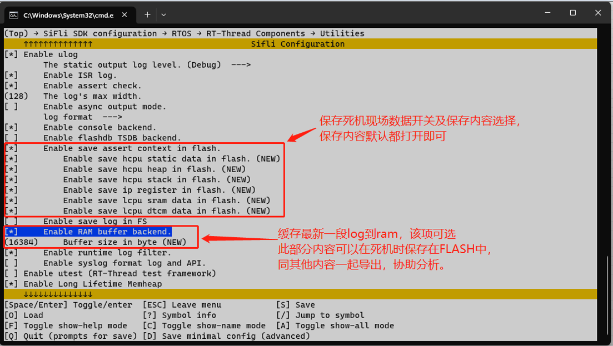
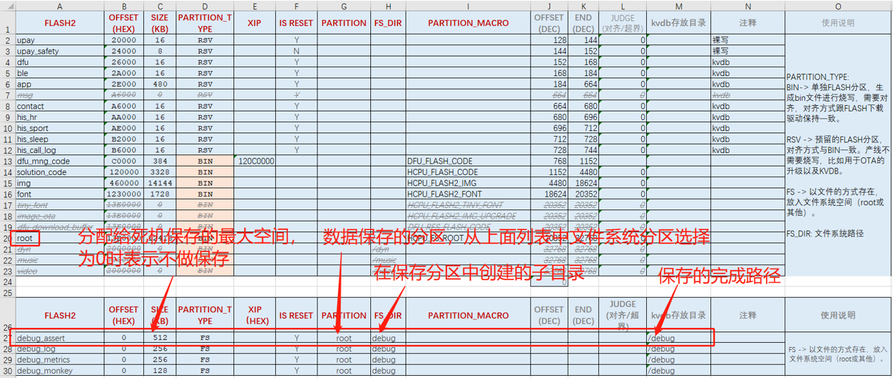
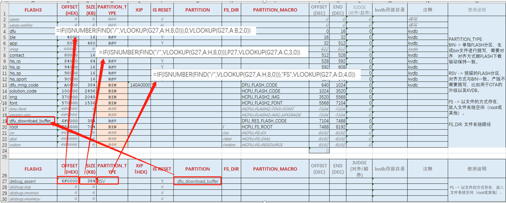
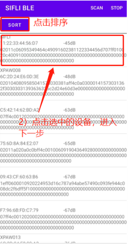
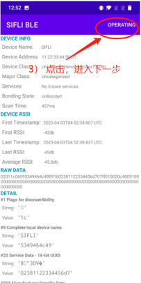
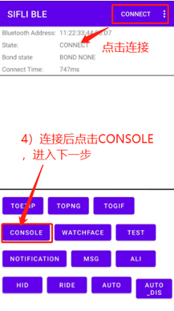
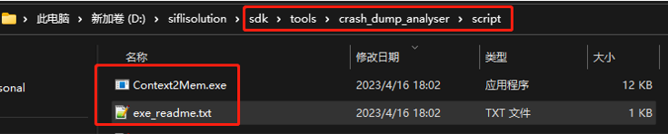
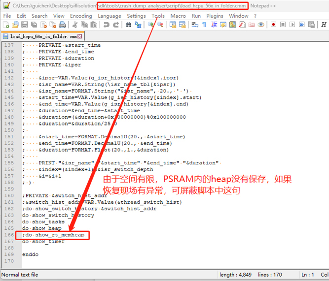

# 4 死机现场保存方法
## 4.1 死机现场保存到FLASH内
1. menuconfig配置 
 `(Top) → RTOS → RT-Thread Components → Utilities → Enable save assert context in flash. ` 
  

2. 空间分配(文件系统) 
在flash_map excel表中配置死机保存所用的空间及分区，以文件方式保存直接SIZE/分区/子目录即可(仅供参考，flash_map excel表，目前仅solution方案支持)，可以自行创建文件存储。
  
在flash_map excel表中配置死机保存所用的空间及分区，可以采用共享buffer的方式，在分区里面填写共享buffer的分区名字，地址/SIZE/分区类型使用下图公式自动获取
  

3. 数据导出 
终端死机后，会保存数据到配置的位置，在重启后可以用手机APP`SiFli_BLE`导出，步骤如下：
  

4. 数据解析 
导出的文件用如下工具解析，即可直接用trace32工具进行死机现场分析
  
  
分析方法可以参照章节： 
[6.1 用Trace32恢复Hcpu死机现场](../tools/trace32.md/#61-用trace32恢复hcpu死机现场)