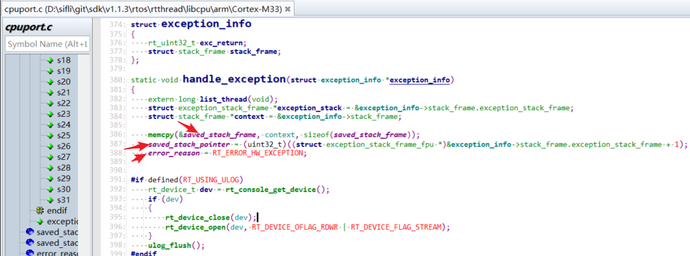
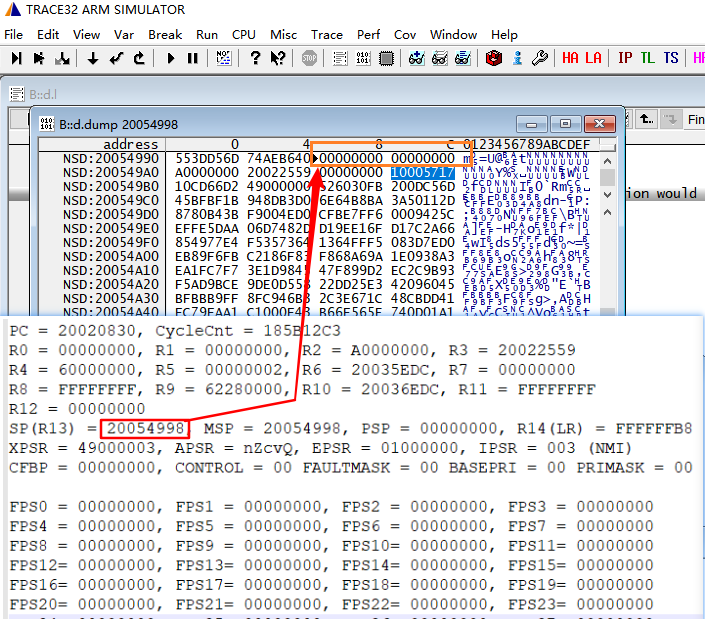
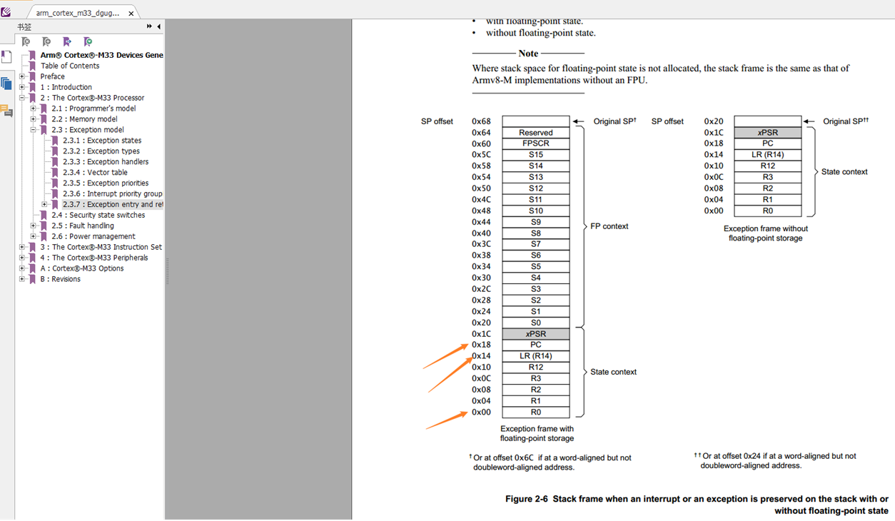

# 3 Dump内存恢复死机现场
## 3.1 Dump内存方法
参照章节[5.8 Dump内存方法](../tools/sifli.md/#58-dump内存方法)dump死机内存现场<br>
## 3.2 Trace32自动恢复死机现场方法
参照章节[6.1 用Trace32恢复Hcpu死机现场](../tools/trace32.md/#61-用trace32恢复hcpu死机现场)<br>
## 3.3 Trace32手动恢复死机现场方法
在自动恢复现场不成功时，可以根据死机现场手动填入寄存器值，恢复死机现场<br>
中断发生时（hardfault也是中断）中断函数：<br>
```
HardFault_Handler->rt_hw_hard_fault_exception->handle_exception
```
函数内会把寄存器R0-R4,R12,R14(LR),PC压栈到`saved_stack_frame`和`saved_stack_pointer`变量中，
<br><br>    
 压栈的寄存器可以看下图二，如下图一的死机现场，地址0x20054998上是R0,地址0x200549AC是LR，地址0x200549B0是PC:0x10CD6602，<br>
寄存器PC：存放死机前的程序PC指针<br>
寄存器LR：存放程序执行完要返回的程序指针<br>
可以拿这些寄存器可以恢复死机现场，<br>
全局变量saved_stack_pointer存的就是压栈的基地址<br>
全局变量saved_stack_frame存的就是压栈的数据<br>
<br><br>
<br><br>
 
 


