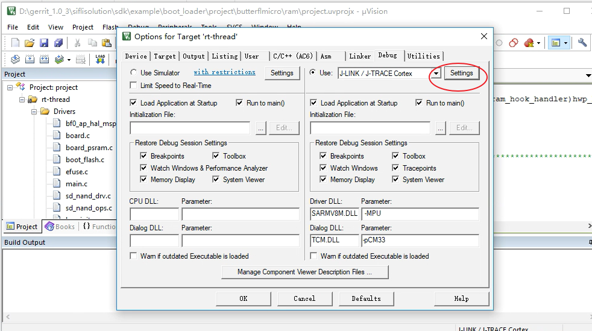
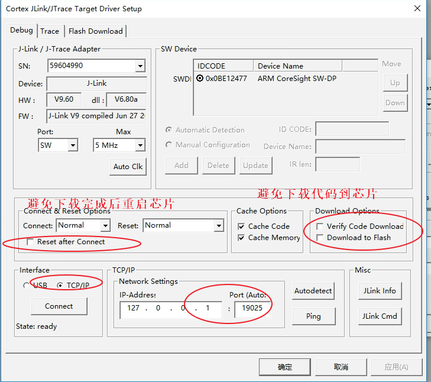
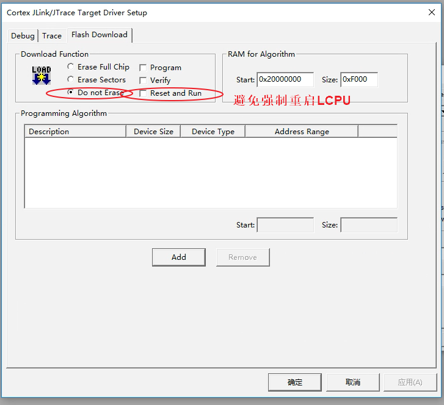
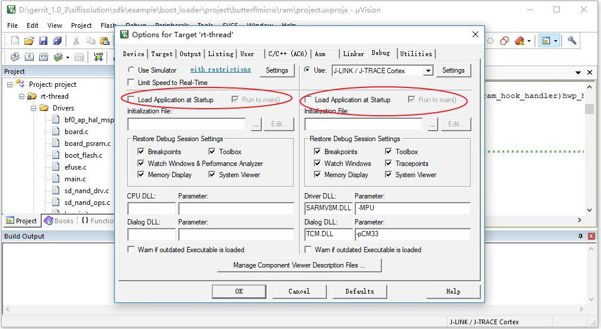
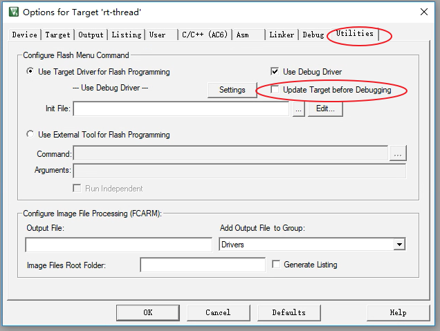
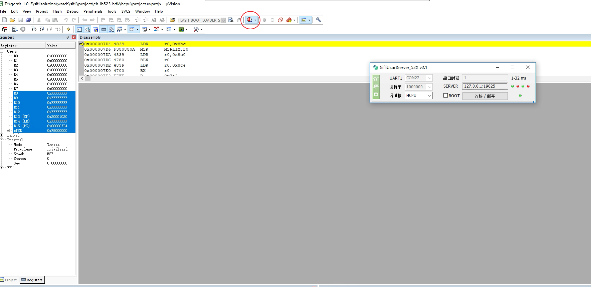
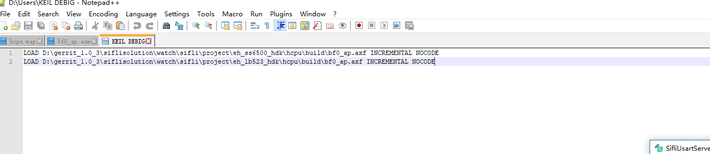
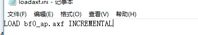
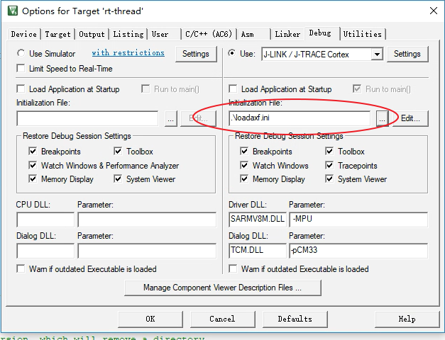

# 2 在线调试方法
## 2.1 断点调试方法
在bootloader代码中、系统启动和休眠唤醒时发生的死机，Jlink或串口都可能已经不通，死机现象往往很难定位，可以采取在确认还没死机的代码位置添加断点，然后再通过SifliUsartServer或者Jlink在线进行连接，进行在线单步运行定位问题，可以在系统复位最开始的时候添加断点:<br>
HCPU启动汇编代码为`drivers/cmsis/sf32lb55x/Templates/arm/startup_bf0_hcpu.S`
LCPU启动汇编代码为`drivers/cmsis/sf32lb55x/Templates/arm/startup_bf0_lcpu.S`
<br>在Reset_Handler中的第一条指令去掉注释 ';'， 变为`B .`
```c
; Reset Handler
Reset_Handler   PROC
                EXPORT   Reset_Handler             [WEAK]
                IMPORT   SystemInit
                IMPORT   __main

                B        . ;//MCU复位后第一条指令执行的位置，添加断点

                LDR      R0, =__stack_limit
                MSR      MSPLIM, R0                          ; Non-secure version of MSPLIM is RAZ/WI

                LDR      R0, =SystemInit ;//对应c语言函数void SystemInit(void)
                BLX      R0
                LDR      R0, =__main ;//对应c语言函数int $Sub$$main(void)->rtthread_startup();
                BX       R0
                ENDP
```

这样MCU启动，就会停留在第一条指令，当Jlink连接成功后，结合Ozone或者keil可以改变PC寄存器 (+2)， 设置所需断点，从而调试初始化过程。<br>
也可以在c文件`SystemInit()`或者`rtthread_startup()`内添加汇编指令:` __asm("B .");`
```c
__ROM_USED int rtthread_startup(void)
{
    rt_hw_interrupt_disable();

    /* board level initialization
     * NOTE: please initialize heap inside board initialization.
     */
#ifdef RT_USING_PM
    rt_application_init_power_on_mode();
#endif // RT_USING_PM
    __asm("B ."); //设置断点
    rt_hw_board_init();
```
可以使系统停留在这个指令，这个时候，再连接Jlink， 结合Ozone或者keil改变PC寄存器 (+2)， 继续单步或者断点调试.

## 2.2 Ozone单步调试配置
请参考Ozone工具相关章节：<br>
[4.3 Ozone单步调试Debug](../tools/ozone.md/#43Ozone单步调试Debug)
## 2.3 Keil单步调试配置
<br><br>
- 导入axf文件的方法：<br>
1. 通过命令导入
<br><br>
2. 通过脚本文件导入<br>
在keil根目录增加脚本文件loadaxf.ini，内容如下；
<br><br>
注意：axf文件bf0_ap.axf，需要放到keil根目录下；
添加loadaxf.ini 到配置界面；
<br><br>
