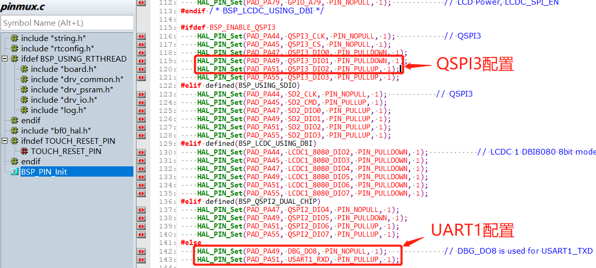
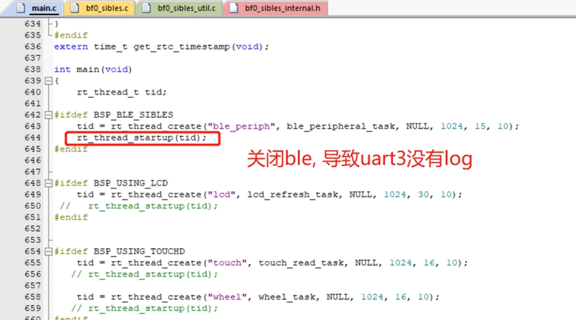

# 1 Log调试
## 1.1 Hcpu没有log出来
1，menuconfig→ RTOS → RT-Thread Kernel → Kernel Device Object→uart1配置为uart1
2，menuconfig → RTOS → RT-Thread Components → Utilities→Enable ulog打开
TIPS: menuconfig中可以输入 "/" 搜索"ulog"
3,pinmux.c中UART1的配置是否正确配置为UART1配置，常见的是开启了BSP_ENABLE_QSPI3，如下图：
<br><br>    

## 1.2 Lcpu没有log出来
如下配置后， 依然没有打印，<br>
  1，menuconfig→ RTOS → RT-Thread Kernel → Kernel Device Object→uart3配置为uart3<br>
  2，menuconfig → RTOS → RT-Thread Components → Utilities→Enable ulog打开<br>
  3，确认hcpu中，在menuconfig→ RTOS → RT-Thread Kernel → Kernel Device Object→uart1 这里没有没有配置为uart3，不然会冲突.<br>
  4, 确认pinmux.c中，PB45,PB46这两个UART3的模式配置正确，默认配置正确，如下：<br>
  ```c
    HAL_PIN_Set(PAD_PB45, USART3_TXD, PIN_NOPULL, 0);           // USART3 TX/SPI3_INT
    HAL_PIN_Set(PAD_PB46, USART3_RXD, PIN_PULLUP, 0);           // USART3 RX
```	
其他原因1: <br>
用的V0.9.9\example\rt_driver\project\ec-lb551工程，ble线程没有开启， 导致Lcpu程序没有加载，<br>
<br><br>       
解决方案:<br>
打开ble线程或者单独调用函数lcpu_power_on(); 启动lcpu的代码.<br>
其他原因2：<br>
```
example\multicore\ipc_queue\
example\pm\coremark\
```
这些工程，需要在HCPU的console里发送命令`lcpu on`启动LCPU，启动成功后可以在LCPU的console上看到启动log<br>
解决方案：<br>
相应的工程下，有readme.txt文件，可以参考里面的内容发命令打开Lcpu<br>

## 1.3 代码中打印寄存器方法
直接地址读操作:
```c
static uint32_t pinmode19;
pinmode19= *(volatile uint32_t *)0x4004304c; //读取寄存器0x4004304c的值
uint32_t reg_printf= *(volatile uint32_t *)0x50016000; //打印寄存器0x50016000的值
rt_kprintf("0x50016000:0x%x\n",reg_printf);
```
直接地址写操作：
```c
#define _WWORD(reg,value) \
{ \
    volatile uint32_t * p_reg=(uint32_t *) reg; \
    *p_reg=value; \
}
_WWORD(0x40003050,0x200);  //PA01 pinmux寄存器写值0x00000200
```
寄存器定义读操作：
```c
rt_kprintf("hwp_hpsys_rcc->CFGR:0x%x\n",hwp_hpsys_rcc->CFGR);
uint32_t reg_printf= hwp_hpsys_rcc->CFGR; //打印寄存器
rt_kprintf("hwp_hpsys_rcc->CFGR:0x%x\n",reg_printf);
```
寄存器定义写操作：
```c
hwp_hpsys_rcc->CFGR = 0x40003050;//直接写值
MODIFY_REG(hwp_pmuc->LPSYS_SWR, PMUC_LPSYS_SWR_PSW_RET_Msk,
			MAKE_REG_VAL(1, PMUC_LPSYS_SWR_PSW_RET_Msk, PMUC_LPSYS_SWR_PSW_RET_Pos)); //只修改PMUC_LPSYS_SWR_PSW_RET_Msk的值为1，其他地方不变；

```
## 1.4 Log定位死机方法
1. 提示对方核crash<br>
如下的log，提示LCPU crash后，是Hcpu主动触发的Assert，需要看LCPU死机在哪里<br>
```
07-11 10:31:55:616    [351767] E/mw.sys ISR: LCPU crash
07-11 10:31:55:617    Assertion failed at function:debug_queue_rx_ind, line number:221 ,(0)
07-11 10:31:55:617    Previous ISR enable 0
```
**说明**：在双核开发时，当一边cpu已经死机，另一cpu其实是未知的，可能还会持续跑很长一段时间，会导致问题不容易发现，目前软件上设计成了一边cpu出现了已知的assert或者hardfaul的情况下，都会通知对方核，对方核收到后，会触发自身的assert，便于查找问题； 

2. Assert行号提示<br>
如下的log提示了，Assert发生在drv_io.c文件的517行
```
07-10 16:41:16:382    [572392] I/drv.lcd lcd_task: HW close
07-10 16:41:16:385    HAL assertion failed in file:drv_io.c, line number:517 
07-10 16:41:16:388    Assertion failed at function:HAL_AssertFailed, line number:616 ,(0)
07-10 16:41:16:389    Previous ISR enable 1
```
对应drv_io.c文件的517行如下图：<br>
`RT_ASSERT(0);`或者`HAL_ASSERT(s_lcd_power > 0);`括号内值为0（False）时，就会出现死机;<br>
此处出现死机，代表`s_lcd_power > 0`为假（s_lcd_power没有大于0）
<br><br>  

3. Log提示死机PC指针信息<br>
如下Log，在出现hard fault情况下，此时的PC指针因为已经跳转异常中断`HardFault_Handler`或`MemManage_Handler`里面的`rt_hw_mem_manage_exception`或`rt_hw_hard_fault_exception`函数内了，连接上看到的PC指针可能已经不是第一死机现场，此时Log打印出来的PC等一系列地址，就是第一死机现场，可以用于恢复死机第一现场，如下表示死在PC`0x0007ef00`这个地址，可以通过编译出来的对应`*.asm`文件，查看为什么这条指令会死机，通常是访问的内存或者地址不可达，出现异常中断死机。<br> 
**说明**: 函数`handle_exception`中,变量`saved_stack_frame`、`saved_stack_pointer`和`error_reason`在出现以上异常死机时，也会存储如下Log内死机的堆栈、死机堆栈地址和死机的原因，可以对照源代码数据结构来分析死机原因。
```
06-24 15:48:41:031     sp: 0x200195c8
06-24 15:48:41:037    psr: 0x80000000
06-24 15:48:41:041    r00: 0x00000000
06-24 15:48:41:042    r01: 0x2001960c
06-24 15:48:41:043    r02: 0x00000010
06-24 15:48:41:044    r03: 0x0007ef00
06-24 15:48:41:045    r04: 0x00000000
06-24 15:48:41:046    r05: 0x00000010
06-24 15:48:41:046    r06: 0x00000000
06-24 15:48:41:047    r07: 0x00000010
06-24 15:48:41:047    r08: 0x2001960c
06-24 15:48:41:048    r09: 0x2001965c
06-24 15:48:41:049    r10: 0x60000000
06-24 15:48:41:049    r11: 0x00000000
06-24 15:48:41:050    r12: 0x200001cd
06-24 15:48:41:051     lr: 0x12064845
06-24 15:48:41:052     pc: 0x0007ef00
06-24 15:48:41:052    hard fault on thread: mbox
06-24 15:48:41:053    
06-24 15:48:41:053    =====================
06-24 15:48:41:054    PSP: 0x20019534, MSP: 0x2001419c
06-24 15:48:41:055    ===================
```