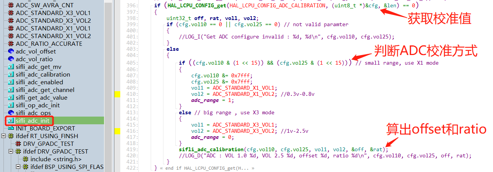
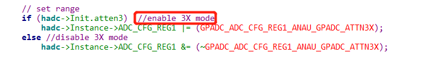
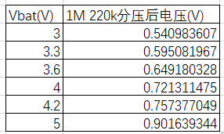
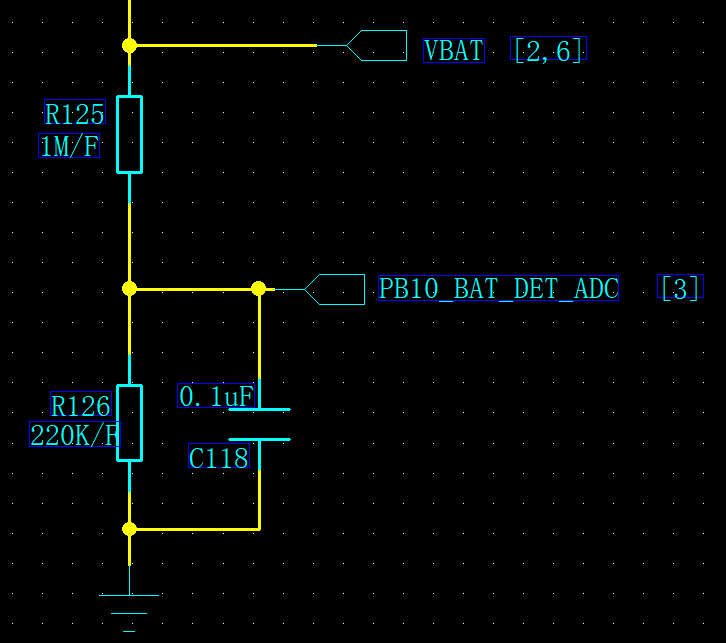
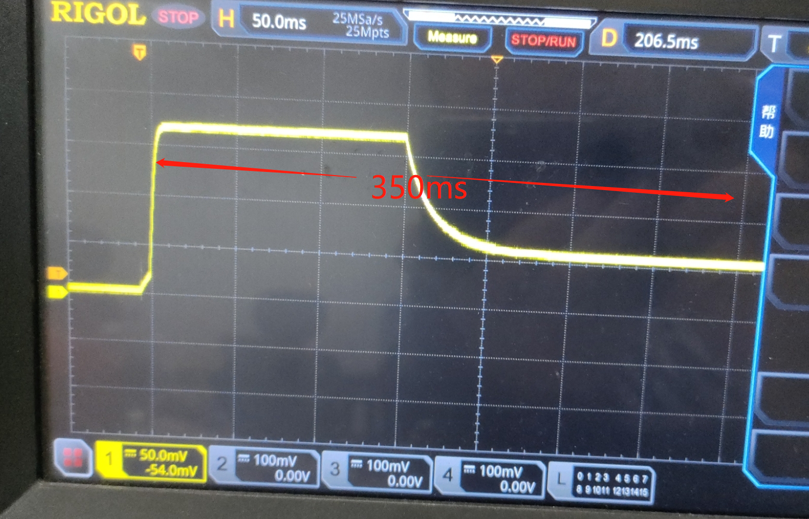
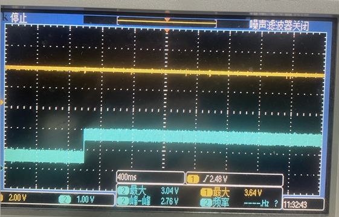
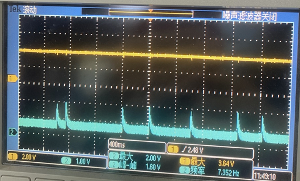
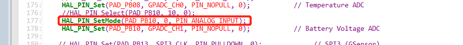

# 6 ADC相关
## 6.1 55系列ADC校准原理
sf32lb55x芯片，为10bit的ADC，为了保证ADC采样精确度;<br> 
校准原理: <br> 
芯片出厂时， 会测量每个芯片在1.0V和2.5V的ADC值，写入到flash内factory区，ID为FACTORY_CFG_ID_ADC.;<br> 
ADC初始化sifli_adc_init时， 会从flash的factory区域，读出这两个值，即变量vol10，vol25， 也就是对应的电压值1.0v和2.5v；<br>  
通过函数
```c
sifli_adc_calibration(cfg.vol10, cfg.vol25, vol1, vol2, &off, &rat);
#define ADC_STANDARD_X3_VOL1           (1000)
#define ADC_STANDARD_X3_VOL2           (2500)
```
算出对应寄存器的ADC值和电压值之间的一条线性直线；<br> 
得到该直线的偏移值offset和线性比率ratio， offset 值是计算出来的0V对应的寄存器值；<br> 

以后ADC读到的值，都是通过这个offset和radio比例得到对应的电压值；<br> 
**备注:**<br> 
早期版本采用的1V 2.5V两个采样点作为ADC校验点<br> 
```c
#define ADC_STANDARD_X3_VOL1           (1000)
#define ADC_STANDARD_X3_VOL2           (2500)
```
新的版本， 采用的0.3V和0.8V两个采样点作为ADC校验点<br> 
```c
#define ADC_STANDARD_X1_VOL1           (300)
#define ADC_STANDARD_X1_VOL2           (800)
```
区别0.3V和0.8V两个采样点的校准方法， 这两个校准值最高bit被置1，
如下:<br> 
<br><br>
```c
if ((cfg.vol10 & (1 << 15)) && (cfg.vol25 & (1 << 15))) // small range, use X1 mode
``` 
对应的sifli_adc_get_mv计算方法， 也会针对两种校准范围adc_range不同， 算法也会不一样;<br> 

在0.3V和0.8V两个采样点的校准方法时， 电压在接近0V和超过1V之后，精准度都不够，另外该模式下，软件寄存器ADC_CFG_RE关闭了GPADC_ADC_CFG_REG1_ANAU_GPADC_ATTN3X模式， 即关闭了内部的分压电阻，因此ADC测试点不能直接接超过1.1V电压，否则可能会烧芯片;<br> 
 <br><br>
在采用1V，2.5V两个采样点作为ADC校验点的校准方式时，会寄存器配置开启GPADC_ADC_CFG_REG1_ANAU_GPADC_ATTN3X模式， 芯片内的分压电阻会被启用，衰减3倍，输入电压即不能超过3.3V<br> 

## 6.2 ADC采样Vbat电池电压不准 debug方法
a，万用表测试采样点电平，目前推荐分压电路为 1M/220k 1%精度的分压电阻;<br> 
因此采样处电平应该在如下对应电压内，如果不对应，需要确认分压电阻值和精度;<br> 
(注意:用万用表或者示波器测量采样点电压， 由于有引入设备输入阻抗，会导致30mV的电压跌落)<br> 
<br><br> 
<br><br> 
b，上电开机后，睡眠唤醒后，ADC前面300ms左右采样可能不准，如下图:<br> 
<br><br> 
用示波器抓ADC开机时候的采样波形，可以发现ADC波形除了一开始默认高电平外，还有rc电路引起的充放电导致采样要大概350ms后才能平稳。实际应用中需要根据实际情况加延时采样或者过滤前面不稳定的采样值<br> 
c，还有出现进入standby后，如下的采样点波形:<br> 
<br><br> 
从standby醒来后，采样点如下波形:<br> 
<br><br> 
此处的原因是PB10默认未初始时内部是上拉状态，用作ADC输入，需要pinmux.c中，需要配置为PIN_NOPULL，并且为PIN_ANALOG_INPUT模式;<br> 
如下图，缺少如下红框这条设置为PIN_ANALOG_INPUT模式，导致如上的PB10内部上拉电阻被使能，
出现偶尔采样电压很高;<br> 
<br><br> 
d， 55x芯片没有进行过校准;<br> 
芯片出厂都会校准过，校准后，会在flash的工厂区有ADC校准参数， 具体参考ADC校准原理一章l
<br> 
## 6.3 ADC注意事项
a， 55x采样最大值为1.1V，56x，52x为3.3V，采样电压不能大于该值，否则容易打坏ADC模块<br> 
b， 56x的log uart打印接外部PC时，使用的外部硬件串口工具参考电平要跟IO电平匹配，否则会影响ADC的采样准度，比如IO电平是3.3v，外部连接的硬件串口工具参考电平为5V，采样出来的adc就会比正常低很多，4V电池有可能检测出来只有3.3V。<br> 
c, 用万用表量采样点电压，由于引入了电阻，量出来的值一般会比实际值偏小一点点<br> 
