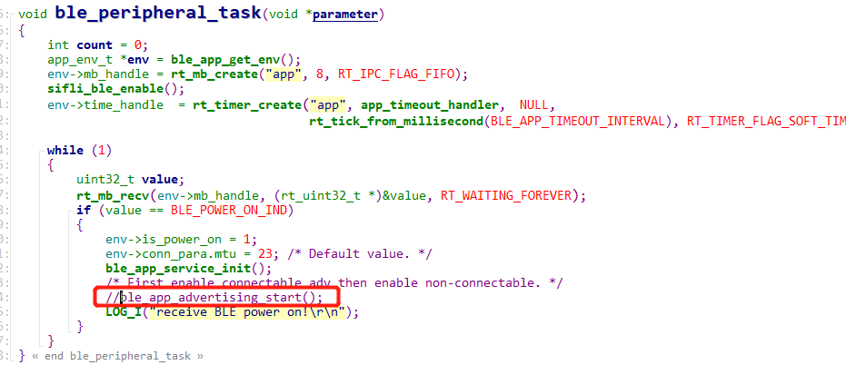
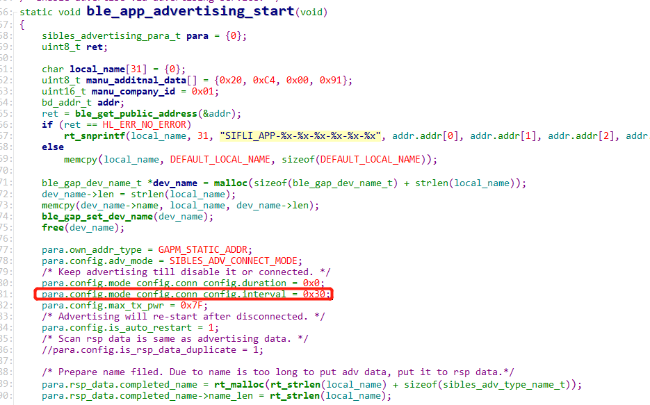

# 11 蓝牙
## 11.1 ble广播关闭和ble广播时间修改
ble_peripheral_task函数中去掉: ble_app_advertising_start();调用， 
如下图:
    
ble广播时间修改: 
ble_app_advertising_start函数中，
    
para.config.mode_config.conn_config.interval = 0x30; //0x30*0.625=30ms广播一次 
0x30为十进制48 * 0.625=30ms广播一次. 
如果要修改为500ms广播一次， 修改为800， 
