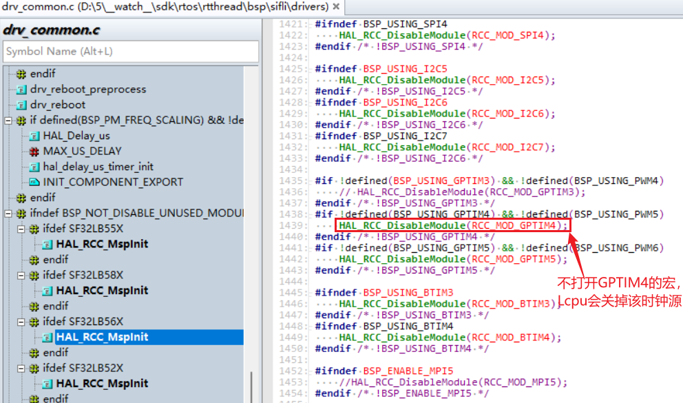
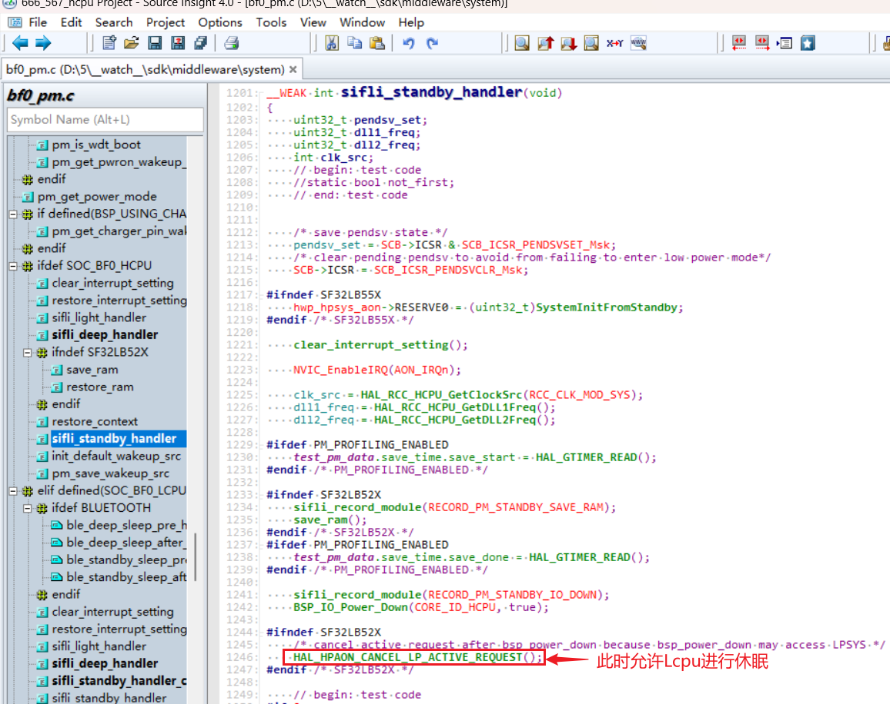
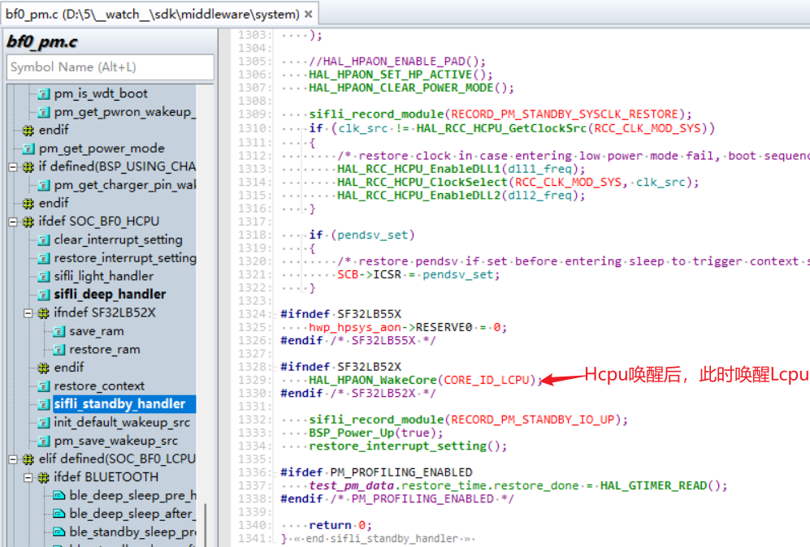
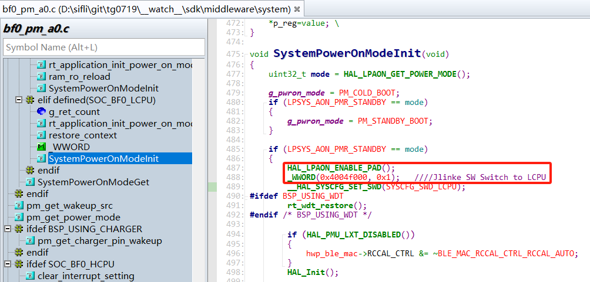
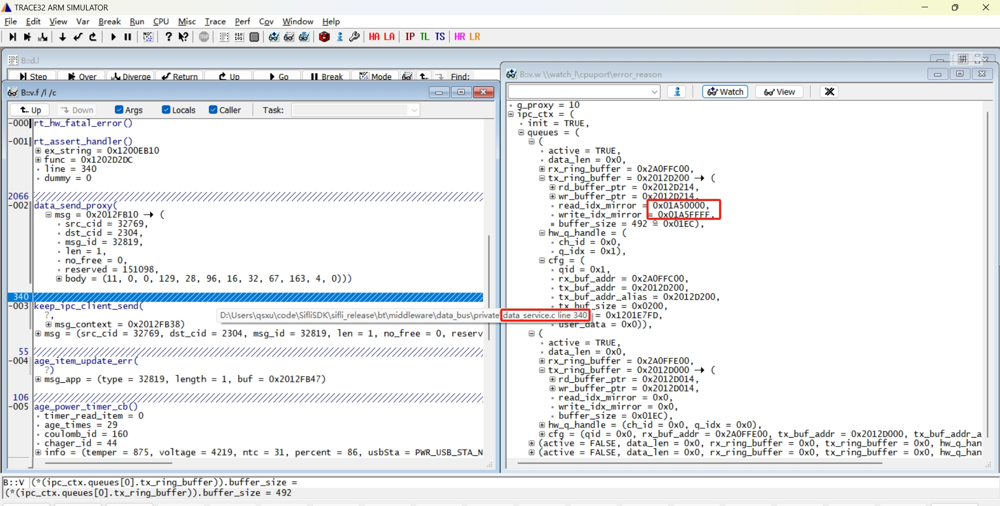

# 14 双核相关
## 14.1 双核资源访问规则
1） Hcpu在Lcpu唤醒状态可以使用Lcpu包括PB口、I2C、UART等全部外设资源；<br>
2） Hcpu在使用Lcpu外设时，Lcpu对应外设的宏定义，也需要打开，比如Hcpu要使用Lcpu PWM5驱动马达，如果代码中Lcpu的GPTIM4和PWM5没有打开，Lcpu在初始化后，现有SDK代码为了省电会把这个模块关掉了，导致Hcpu操作GPTIM4输出PWM5失败；<br>
```c
 HAL_RCC_DisableModule(RCC_MOD_GPTIM4);//关闭GPTIM4模块
```
<br><br>   
同理Hcpu使用Lcpu的I2C、UART、SPI资源都需要一样操作；<br>
3）56x、52x系列中，各核的IO只能配置为各核拥有的资源<br>
例如：PA05的PA05_I2C_UART功能，该IO可以配置任一组I2C或者UART来用，需要遵循PA口只能指定Hcpu有的I2C资源，比如56x，PA口只能配置属于Hcpu的资源i2c1-i2c4，不能配置为属于Lcpu的资源i2c5-i2c7,<br>
同理Lcpu同理PB口只能配置该核的资源，同样PA05_TIM，这样的PWM配置也需要遵循该原则。<br>
4） Lcpu不能使用Hcpu的PA口等外设资源，也不能访问Hcpu的寄存器，访问会出现Hardfault死机；<br>
例如：在bsp_pinmux.c，bsp_power.c文件的BSP_PIN_Init，BSP_Power_Up，BSP_IO_Power_Down，等这些Hcpu，Lcpu共用的函数，对PA口的操作，一定要放在#ifdef SOC_BF0_HCPU宏定义之类，避免Lcpu去调用PA的IO操作函数。<br>
5） 55x、58x、56x系列SDK配置中，软件已规划为Hcpu唤醒时都会唤醒Lcpu，在Hcpu唤醒后，会通过HAL_HPAON_WakeCore(CORE_ID_LCPU);函数唤醒Lcpu（52x系列Hcpu/Lcpu分别单独休眠），在Hcpu休眠函数sifli_standby_handler或者sifli_deep_handler中，通过函数HAL_HPAON_CANCEL_LP_ACTIVE_REQUEST();允许Lcpu进行休眠；<br>
在允许Lcpu休眠后，Hcpu此时访问Lcpu外设资源，也会出现Hardfault，因此在休眠过程中，要谨慎处理，代码如下：
<br><br>
<br><br>   

## 14.2 大小核通讯通讯接口
可以查阅，思澈科技软件开发工具包文档，以及查看example\multicore\下两个双核通讯例程ipc_queue，data_service<br>
### 14.2.1 可以采用datasevice的注册和订阅方式通讯
```c
datas_register(btn_service_name, &button_service_cb); //#注册按键发布
sensors_service_handle = datas_register("SENSORS_APP", &sensors_service_cb); //#注册sensor发布
datas_push_data_to_client(service, sizeof(action), &action); //#发布消息到客户端
datac_subscribe(key2_button_handle, "btn1", button_service_callback_key2, 0); //#注册订阅
```

### 14.2.2 直接通过solution现有的sensor或者ble的IPC机制通讯
通过现有的sensor通道：<br>
```c
ipc_send_msg_from_sensor_to_app(SENSOR_APP_EVENT_BATTERY_IND, sizeof(event_remind_t), &remind_ind); //发消息给Hcpu
ipc_send_msg_from_app_to_sensor(&msgx); //Hcpu发给Lcpu的sensor
```
通过现有的ble通道：<br>
```c
ipc_send_msg_from_ble_to_app(BLE_APP_OTA_RECV_IND, len, (uint8_t *)param); //发消息给Hcpu
ipc_send_msg_from_app_to_ble(&msgx); //Hcpu发给Lcpu
```
调试双核通讯问题，可以查看ipc_cxt这个全局结构体变量的的具体内容<br>
```c
typedef struct
{
    bool active;                          /**< whether the queue is opened, true: opened  */
    uint32_t data_len;                    /**< len of data in rx_ring_buffer */
    struct circular_buf *rx_ring_buffer;
    struct circular_buf *tx_ring_buffer;
    ipc_hw_q_handle_t hw_q_handle;        /**< handle of hw queue */
    ipc_queue_cfg_t cfg;                  /**< queue configuration */
} ipc_queue_t;
```
## 14.3 Jlink(SWD)切换到不同核调试
使用场景：Hcpu已经休眠情况下jlink连接调试Lcpu或者Ozone在线调试Lcpu<br>
操作方法: 操作hwp_lpsys_cfg中寄存器SWCR的SWSEL位
- SWSEL
- 0: SWD connected to HCPU
- 1: SWD connected to LCPU
方法1：在Hcpu连接jlink时，执行SDK目录下对应\tools\segger\jlink_lcpu_56x.bat批处理<br>
55系列调用jlink_lcpu_a0.bat<br>
55系列调用jlink_lcpu_pro.bat<br>
方法2：在代码中进行修改<br>
```c
//直接寄存器物理地址操作
#define _WWORD(reg,value) \
{ \
    volatile uint32_t * p_reg=(uint32_t *) reg; \
    *p_reg=value; \
}
_WWORD(0x4004f000, 0x1);   // 55X Jlink SW Switch to LCPU
_WWORD(0x4004f000, 0x0);   // 55X Jlink SW Switch to HCPU
_WWORD(0x5000f000, 0x1);   // 56X，58X Jlink SW Switch to LCPU
_WWORD(0x5000f000, 0x0);   // 56X，58X Jlink SW Switch to HCPU
```
或者指定寄存器操作
```c
hwp_lpsys_cfg->SWCR = 1; // Jlink SW Switch to LCPU
hwp_lpsys_cfg->SWCR = 0; // Jlink SW Switch to HCPU
```
如果Lcpu死机发生在唤醒后比较早的地方，建议添加在Lcpu唤醒的入口处，具体参照 56X standby待机流程，但需要注意需要提前打开GPIO的配置:<br>
```c
HAL_LPAON_ENABLE_PAD();//打开Lcpu的GPIO配置
```
<br><br>    

## 14.4 双核通讯如何判断dataservice队列满导致的死机
1） 如下图，Assert发生在Lcpu的data_send_proxy函数内。<br>
2） 看此时的tx_ring_buffer里的read_idx_mirror和write_idx_mirror是不是高16位相等，低16位一个都是0，一个都是1，反之如果高16位相等，低16位也相等，那说明buffer是空的。<br>
如下图，前16bit都为0x01AF相等，后16bit，一个是全0，一个是全1，代表buffer已满，导致的死机。<br>
3） 此类死机，通常是因为对方核（此处是Hcpu）死机了或者任务忙导致来不及处理dataservice的消息导致，需要看对方核死机或者任务忙的原因。<br>
<br><br>     
