# 1 GPIO相关
## 1.1 GPIO操作和调试方法
### 1.1.1 RTT driver层操作方法
思澈系列MCU为双核架构，Hcpu包含了PA口，Lcpu包含了PB口，58,56系列还包含了低功耗IO：PBR口<br>
为了便于RTT操作系统统一操作GPIO口，目前PA,PB口，以及PBR口在RTThread操作系统的pin设备操作上，采用统一GPIO编排方式：<br>
PA01即对应1, PA78对应78，<br>
PB口加上96，即PB0对应96，PB1对应97, PB40对应136<br>
PBR0口加上160，即PBR0对应160,PBR1,对应161, PBR2对应162<br>

PA,PB,PBR可以采用函数GET_PIN或者GET_PIN_2获取pin号，<br>
GET_PIN函数的第一个参数是0，1，2，分别对应PBR，GPIO1(PA)和GPIO2(PB)，  <br>
例如<br>
```
pin_numble=GET_PIN(0, 0)；//PBR0 对应值为160
PBR1就是GET_PIN(0, 1)=161，
PB1就是GET_PIN(2, 1)=97，
PA1就是GET_PIN(1, 1)=1
```
GET_PIN_2的第一个参数是hwp_pbr，hwp_gpio1，hwp_gpio2,<br>
```c
pin_numble=GET_PIN_2(hwp_pbr,1);  //PBR1 值为161
pin_numble=GET_PIN_2(hwp_gpio2,1); //PB1 值为97
pin_numble=GET_PIN_2(hwp_gpio1,1); //PA1 值为1
```
通过统一GPIO编排之后，就可以按照通用接口操作IO，操作代码如下：<br>
```c
rt_pin_mode(160, PIN_MODE_OUTPUT);  /* 配置PBR0输出 */
rt_pin_write(160, PIN_LOW);  /* PBR0输出低电平 */
rt_pin_mode(160, PIN_MODE_INPUT_PULLUP); /* 配置PBR0为输入口，注意此处配置上下拉，目前代码没有生效，需用HAL函数配置 */
if (1 == rt_pin_read(160)) /* 读PBR0状态 */
//
rt_pin_mode(78, PIN_MODE_OUTPUT);  /* 配置PA78输出 */
rt_pin_write(78, 0);/* PA78 输出低 */
//
rt_pin_mode(79, PIN_MODE_INPUT_PULLUP);/* 配置PA79为输入口，注意此处配置上下拉，目前代码没有生效，需用HAL函数配置 */
if (1 == rt_pin_read(79)) /* 读PA79状态 */
```
配置为中断输入方式：
```C
rt_pin_mode(144, PIN_MODE_INPUT_PULLUP);//配置PB48为输入口（48+96=144），注意此处配置上下拉，目前代码没有生效，需用HAL函数配置
curr_state = rt_pin_read(144); /* 读 PB48口状态 */
rt_pin_attach_irq(144, PIN_IRQ_MODE_FALLING, chsc5816tp_irq_handler, RT_NULL);/*配置为下降沿触发，中断函数为chsc5816tp_irq_handler */
rt_pin_irq_enable(144, 1);/* 启动 PB48 GPIO中断*/
//
rt_pin_mode(160,PIN_MODE_INPUT); //配置PBR0为输入模式，注意此处配置上下拉，目前代码没有生效，需用HAL函数配置
rt_pin_attach_irq(160,PIN_IRQ_MODE_FALLING,(void*)bt5376a_wakeup_event_handle, (void*)(rt_uint32_t)160); //配置为下降沿中断和中断处理函数bt5376a_wakeup_event_handle
rt_pin_irq_enable(160,1); //使能中断
```

**注意：**<br>
1，DRV层函数不能修改GPIO的Funtion，需要用HAL层函数，默认在芯片上电或者standby醒来过程中，pin初始化BSP_PIN_Init函数内设置;<br>
2，Hcpu可以完全操作Lcpu的资源，包括PB口，但是Lcpu不能直接读写PA口，否则会出现Hardfault;<br>
3，采用pin的设备读写操作前，需要rt_pin_mode先设置mode，hal层设置了输入输出也不行;<br>
4，采用RTT层操作GPIO，进入Standby休眠后，IO状态已经做了自动备份和恢复，备份函数`pm_pin_backup();`恢复函数`pm_pin_restore();`,执行`HAL_HPAON_DISABLE_PAD();`后，此时操作GPIO，GPIO对外输出电平也会保持不变，执行`HAL_HPAON_ENABLE_PAD();`后，GPIO和pinmux的寄存器配置就会输出到外部GPIO；Deep休眠GPIO状态会保持，不会变;<br>
5，RTT层的GPIO操作，也可以参考RTT官网:<br> [PIN设备 (rt-thread.org)](https://www.rt-thread.org/document/site/#/)：
<br>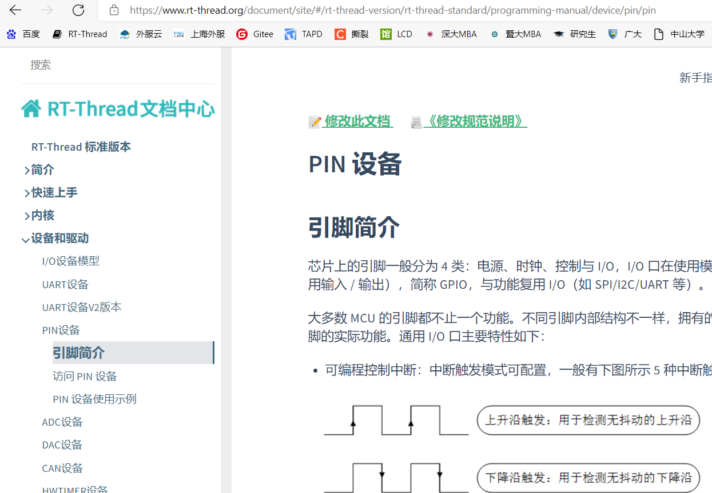<br> 

### 1.1.2 HAL层操作方法
在RTT操作系统还没起来时，比如drv_io.c的底层可以直接调用HAL接口的GPIO函数读写GPIO口<br>
* PA/PB口操作方法：<br>
设置PA/PB功能和上下拉函数，PA/PB需用一个参数来区分：<br>
```c
HAL_PIN_Set(PAD_PA03,GPIO_A3,PIN_NOPULL, 1); //设置PA03为GPIO模式，无上下拉
```
输出高低：<br>
```c
BSP_GPIO_Set(3, 0, 1); //PA03输出低
BSP_GPIO_Set(3, 0, 0); //PB03输出低
```
GPIO配置为输入输出方式，PA24配置为输入模式如下图：<br>
```c
GPIO_InitTypeDef GPIO_InitStruct;           
GPIO_InitStruct.Mode = GPIO_MODE_INPUT;                
GPIO_InitStruct.Pin = 24;                 
GPIO_InitStruct.Pull = GPIO_NOPULL;         
HAL_GPIO_Init(hwp_gpio1, &GPIO_InitStruct); 
```
读取IO数值:<br>
```c
int value;
value = HAL_GPIO_ReadPin((GPIO_TypeDef *)hwp_gpio1, 48); //读PA48的值：
value = HAL_GPIO_ReadPin((GPIO_TypeDef *)hwp_gpio2, 48); //读PB48的值：
```
**注意:**<br> 
1，HAL层操作GPIO，要参数来区分hcpu和lcpu，因此不能再用DRV层把PB48 当作96+48来操作；<br>
2，HAL层操作GPIO，进入Standby休眠后，IO状态已经做了自动备份和恢复，备份函数`pm_pin_backup();`恢复函数`pm_pin_restore();`,执行后`HAL_HPAON_DISABLE_PAD();`后GPIO对外输出电平会保持不变，执行`HAL_HPAON_ENABLE_PAD();`后，GPIO和pinmux的寄存器就会输出到外部GPIO；<br>


* PBR口操作方法：<br>
```c
HAL_PBR_ConfigMode(2,1);//配置PBR2为输出模式，第1个参数0对应PBR0, 2对应PBR2；第2个参数，1为输出，0位输入；
HAL_PBR_WritePin(2,1); //配置PBR2输出高
value=HAL_PBR_ReadPin(0); //读取PBR0的值，返回0或者1，返回值少于1表示有错误，比如输入pin为无效值
HAL_PIN_Set_Analog(PAD_PBR1, 0); //设置PBR1为模拟输入，对外为高阻态
HAL_PIN_Set(PAD_PBR1, PBR_GPO, PIN_NOPULL, 0); //配置PBR1为GPIO模式 
```
具体各个IO支持哪些function，查看文件`bf0_pin_const.c中pin_pad_func_hcpu`或者硬件文档SF32LB5XX_Pin config_X.xlsx<br>
<br>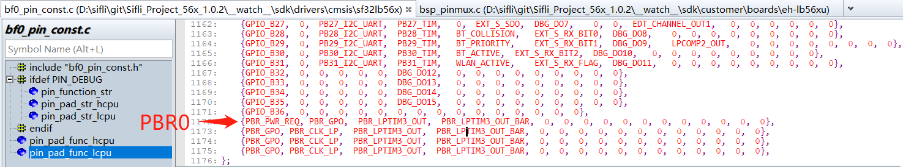<br>   

**注意:**<br>
PBR0默认是在PWR_REQ模式上，这个模式是硬件自动控制输出电平的高和低，LCPU醒的时候输出高，睡的时候输出低, 所以当有的板子用这个PIN控制大核PSRAM或者NOR的供电时，就要FORCE输出高了，以免小核睡了后，PSRAM掉电，操作如下:<br>
HAL_PBR0_FORCE1_ENABLE();

### 1.1.3 寄存器操作GPIO方法
下面是直接操作GPIO寄存器PA24输出高、低、翻转：（需预先配置好GPIO输出状态），寄存器含义参照芯片手册<br>
```c
#define PM_DEBUG_PIN_HIGH()      ((GPIO1_TypeDef *)hwp_gpio1)->DOSR0 |= (1UL << 24)//PA00 - PA31
#define PM_DEBUG_PIN_LOW()       ((GPIO1_TypeDef *)hwp_gpio1)->DOCR0 |= (1UL << 24)
#define PM_DEBUG_PIN_TOGGLE()    ((GPIO1_TypeDef *)hwp_gpio1)->DOR0  ^= (1UL << 24)
```
下面是寄存器操作IO初始化和读写操作的示例：<br>
pin_test为测试程序：<br>
```c
#ifdef SOC_BF0_HCPU
#define PA_HIGH(port) (port > 31) ? (((GPIO1_TypeDef *)hwp_gpio1)->DOR1 |= (1UL << (port-32))) : (((GPIO1_TypeDef *)hwp_gpio1)->DOR0 |= (1UL << port))
#define PA_LOW(port) (port > 31) ? (((GPIO1_TypeDef *)hwp_gpio1)->DOR1 &= (~(1UL << (port-32)))) : (((GPIO1_TypeDef *)hwp_gpio1)->DOR0 &= (~(1UL << port)))
#define PA_TOGGLE(port) (port > 31) ? (((GPIO1_TypeDef *)hwp_gpio1)->DOR1 ^= (1UL << (port-32))) : (((GPIO1_TypeDef *)hwp_gpio1)->DOR0 ^= (1UL << port))
#define PA_VALUE(port) (port > 31) ? (((GPIO1_TypeDef *)hwp_gpio1)->DIR1 &= (1UL << (port-32))) : (((GPIO1_TypeDef *)hwp_gpio1)->DIR0 &= (1UL << port))
#define PA_INIT(port,mode)                              \
        do                                              \
        {                                               \
            GPIO_InitTypeDef GPIO_InitStruct;           \
            GPIO_InitStruct.Mode = mode;                \
            GPIO_InitStruct.Pin = port;                 \
            GPIO_InitStruct.Pull = GPIO_NOPULL;         \
            HAL_PIN_Set(PAD_PA00+port, GPIO_A0+port, PIN_NOPULL, 1); \
            HAL_GPIO_Init(hwp_gpio1, &GPIO_InitStruct); \
        }                                               \
        while (0)
            
#ifndef SF32LB52X
#define PB_HIGH(port) (port > 31) ? (((GPIO2_TypeDef *)hwp_gpio2)->DOR1 |= (1UL << (port-32))) : (((GPIO2_TypeDef *)hwp_gpio2)->DOR0 |= (1UL << port))
#define PB_LOW(port) (port > 31) ? (((GPIO2_TypeDef *)hwp_gpio2)->DOR1 &= (~(1UL << (port-32)))) : (((GPIO2_TypeDef *)hwp_gpio2)->DOR0 &= (~(1UL << port)))
#define PB_TOGGLE(port) (port > 31) ? (((GPIO2_TypeDef *)hwp_gpio2)->DOR1 ^= (1UL << (port-32))) : (((GPIO2_TypeDef *)hwp_gpio2)->DOR0 ^= (1UL << port))
#define PB_VALUE(port) (port > 31) ? (((GPIO2_TypeDef *)hwp_gpio2)->DIR1 &= (1UL << (port-32))) : (((GPIO2_TypeDef *)hwp_gpio2)->DIR0 &= (1UL << port))
#define PB_INIT(port,mode)                              \
                do                                              \
                {                                               \
                    GPIO_InitTypeDef GPIO_InitStruct;           \
                    GPIO_InitStruct.Mode = mode;                \
                    GPIO_InitStruct.Pin = port;                 \
                    GPIO_InitStruct.Pull = GPIO_NOPULL;         \
                    HAL_PIN_Set(PAD_PB00+port, GPIO_B0+port, PIN_NOPULL, 0); \
                    HAL_GPIO_Init(hwp_gpio2, &GPIO_InitStruct); \
                }                                               \
                while (0)
#endif

int pin_test(int argc, char **argv)
{
    char i;
    uint8_t pin,value;
     if (argc > 1)
     {
        pin = strtoul(argv[3], 0, 10);
        value = strtoul(argv[4], 0, 10);
        rt_kprintf("pin:%d,value:%d,\n",pin,value);
        if ((strcmp("pa", argv[1]) == 0) || (strcmp("PA", argv[1]) == 0))
        {
            if (strcmp("-w", argv[2]) == 0)
            {
                if(value == 1)
                {
                    PA_HIGH(pin);
                    rt_kprintf("PA%d set high\n",pin);
                }
                else if(value == 0)
                {
                    PA_LOW(pin);
                    rt_kprintf("PA%d set low\n",pin);
                }
                else 
                {
                    PA_TOGGLE(pin);
                    rt_kprintf("PA%d toggle\n",pin);
                }
            }
            else if (strcmp("-r", argv[2]) == 0)
            {
                if(PA_VALUE(pin))
                    rt_kprintf("PA%d is high, %x\n",pin,PA_VALUE(pin));
                else
                    rt_kprintf("PA%d is low, %x\n",pin,PA_VALUE(pin));
            }
            else if (strcmp("-init", argv[2]) == 0)
            {
                if(value == 0)
                {
                    PA_INIT(pin,GPIO_MODE_INPUT);
                    rt_kprintf("PA%d INIT set input\n",pin);
                }
                else
                {
                    PA_INIT(pin,GPIO_MODE_OUTPUT);
                    rt_kprintf("PA%d INIT set output\n",pin);
                }
            }
        }
#ifndef SF32LB52X
        else if ((strcmp("pb", argv[1]) == 0) || (strcmp("PB", argv[1]) == 0))
        {
            if (strcmp("-w", argv[2]) == 0)
            {
                if(value == 1)
                {
                    PB_HIGH(pin);
                    rt_kprintf("PB%d set high\n",pin);
                }
                else if(value == 0)
                {
                    PB_LOW(pin);
                    rt_kprintf("PB%d set low\n",pin);
                }
                else 
                {
                    PB_TOGGLE(pin);
                    rt_kprintf("PA%d toggle\n",pin);
                }
            }
            else if (strcmp("-r", argv[2]) == 0)
            {
                if(PB_VALUE(pin))
                    rt_kprintf("PB%d is high, %x\n",pin,PB_VALUE(pin));
                else
                    rt_kprintf("PB%d is low, %x\n",pin,PB_VALUE(pin));
            }
            else if (strcmp("-init", argv[2]) == 0)
            {
                if(value == 0)
                {
                    PB_INIT(pin,GPIO_MODE_INPUT);
                    rt_kprintf("PB%d INIT set input\n",pin);
                }
                else
                {
                    PB_INIT(pin,GPIO_MODE_OUTPUT);
                    rt_kprintf("PB%d INIT set output\n",pin);
                }
            }
        }
#endif         
     }
     else
     {
         rt_kprintf("example:\npin_test pa -init 29 0  #set PA29 to input \n");
         rt_kprintf("pin_test pa -init 29 1  #set PA29 to output\n");
         rt_kprintf("pin_test pa -w 29 1  #write PA29 to high level\n");
         rt_kprintf("pin_test pa -w 29 0  #write PA29 to low level\n");
         rt_kprintf("pin_test pa -r 29  #read PA29\n");
         rt_kprintf("pin_test pb -init 29 1  #set PB29 to output\n");
     }
     return 0;
}

MSH_CMD_EXPORT(pin_test, forward pin_test command); /* 导出到 msh 命令列表中 */
#endif

```
调用方法：<br>
```c
PA_INIT(29,GPIO_MODE_OUTPUT); //PA29初始化为输出口
PA_HIGH(29);//PA29输出高
PA_TOGGLE(29);//PA29电平翻转
PA_INIT(33,GPIO_MODE_INPUT);//PA33配置为输入口
uint8_t value = PA_VALUE(33);//读取PA33,值非0代表高，0代表低电平
PB_INIT(2,GPIO_MODE_OUTPUT); //PB02初始化为输出口
```

### 1.1.4 GPIO调试方法
* 方法1：<br>
采用串口finsh命令，对应实现函数为：`int cmd_pin(int argc, char **argv)`
Hcpu/Lcpu打开finsh功能后（Hcpu默认已打开），在串口console平台， 可以采用pin命令行来查看gpio状态，让GPIO输出高或低电平，比如:
```
pin //查看命令提示
pin status all //查看所有GPIO状态.
pin status 120 //查看120-96=24 PB24的状态41
pin mode 120 0 //设置PB24为输出mode
pin write 78 1 //设置PA78输出高
pin mux 106 2 //设置106-96=10 PB10为功能2 I2C4_SDA功能
pin status 160 //160-160=0 获取PBR0状态
```
<br>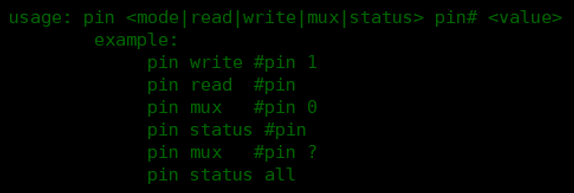<br>  

* 方法2：<br>
采用Ozone，Jlink等工具连到MCU，读取pinmux和gpio寄存器，跟用户手册对比，是否配置正确；<br>
* pinmux寄存器地址对应方法：<br>
`register.h`中PA口对应`PINMUX1_BASE或hwp_pinmux1`，PB口对应`PINMUX2_BASE或者hwp_pinmux2`，<br>
例如PA03的pinmux寄存器地址为：`hwp_pinmux1->PAD_PA03`<br>
* gpio寄存器地址对应方法：<br>
PA口`GPIO1_BASE或hwp_gpio1`，PB口对应`GPIO2_BASE或hwp_gpio2`
PBR口IO(PBR) 的输入使能、输出使能、上下拉电阻等功能可以通过 RTC 的 PBRxR 寄存器配置，比如PBR0地址为`hwp_rtc->BKP0R`


## 1.2 55X系列 PA口在睡眠唤醒后会有电平波动
    HCPU PA口睡眠唤醒后会先恢复到芯片默认的上下拉，如下图: <br>
<br>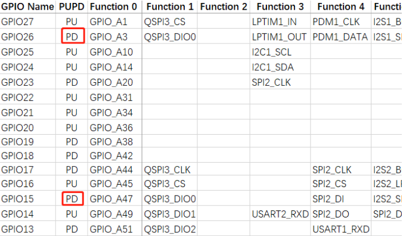<br>  
这个时候用户程序还没有跑起来， 然后再执行代码pinmux.c文件BSP_IO_Init里面设置的值，<br>
所以HCPU GPIO如果睡眠的时候电平与默认上下拉不一致，唤醒后有可能存在10ms左右的跳变；<br>
LCPU PB口睡眠唤醒后，唤醒前的值可以一直保存到BSP_IO_Init函数执行，所以只要在BSP_IO_Init设置好GPIO口状态，LCPU GPIO 的值睡眠是可以保持的.<br>
比如 PA03你想开机后一直保持高电平，但由于PA03默认是下拉的，所以睡眠唤醒后会有10ms左右的低电平，再实际使用中，你需要找个默认是上拉的脚来替换PA03，比如PA10.<br>

**备注:** <br>
56X,52X系列PA口不存在此问题

## 1.3 TP的驱动 IRQ中断怎么配置
1，Menuconfig配置 <br>
配置完， 会在rtconfig.h中生成: <br>
```c
#define TOUCH_IRQ_PIN 79
```
<br>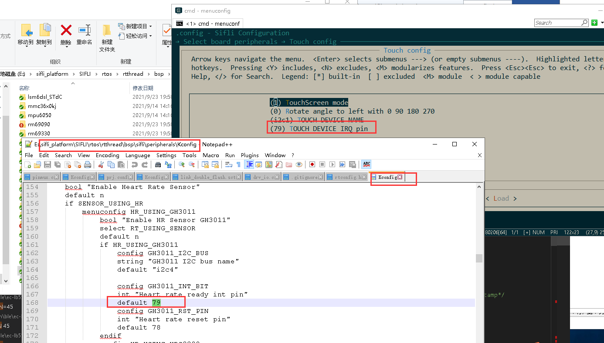<br>  
2，pinmux.c中，需要确认该IO口的模式和上下拉状态：<br>
```c
HAL_PIN_Set(PAD_PA79, GPIO_A79, PIN_NOPULL, 1); // GPIO模式，无上拉，
```
3，在drv_touch.c会用到该定义，驱动可以直接使用drv_touch.c中两个函数：<br>
```c
    rt_touch_irq_pin_attach(PIN_IRQ_MODE_FALLING, cst816_irq_handler, NULL);
    rt_touch_irq_pin_enable(1);
```
或者自己在初始化函数中定义该中断：<br>
```c
    rt_pin_mode(TOUCH_IRQ_PIN, PIN_MODE_INPUT); //配置为input
    rt_pin_attach_irq(TOUCH_IRQ_PIN, PIN_IRQ_MODE_FALLING, (void *) cst816_irq_handler,(void *)(rt_uint32_t)TOUCH_IRQ_PIN);//配置下降沿中断和中断回调函数
    rt_pin_irq_enable(TOUCH_IRQ_PIN, 1); //使能中断
```
4，Hcpu的串口输入命令：pin status 79 确认该配置是否正确。<br>

## 1.4 如何detach touch irq
在touch驱动deinit函数中，在detach irq之前，需要先关闭该pin的中断：<br>
```c
static rt_err_t deinit(void)
{
    rt_pin_irq_enable(TOUCH_IRQ_PIN, 0); //disable irq
    rt_pin_detach_irq(TOUCH_IRQ_PIN);
...
```
## 1.5 为什么PA55口为默认下拉口PD，但是上电我不做任何操作，PA55测试为高电平?
根本原因: 客户的OTA代码中， 有对PA55进行拉高操作.<br>
让客户在用户程序pinmux.c中，添加`__asm("B .");`断点命令，<br>
<br>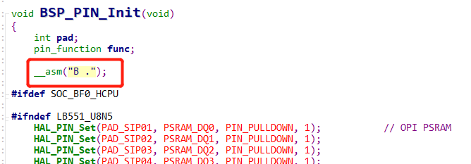<br>   
测试PA55口，为高，
```
mem32 0x50000038 20 读了相应的寄存器，有输出高的操作，
```
jlink输入r，让芯片复位，<br>
在读寄存器值恢复正常， PA55电平也正常，<br>
由于用户程序是从0x10060000开始跑的， 复位后 是从0x10020000 OTA的代码开始跑， 然后跳到用户的0x1006000的代码， 而OTA代码drv_io.c中操作了，PA55，导致该现象.
<a name="16_55系列MCU复用USB的PA01"></a>
## 1.6 55系列MCU复用USB的PA01/PA03漏电风险
通常情况下，建议客户不使用PA01，<br>
由于PA01，PA03是复用USB口功能， PA01，PA03当作GPIO使用时， 要特别谨慎；<br>
1， PA01内部在active，light_sleep模式下存在18K的下拉电阻，输出高电平，否则存在漏电，standby，deep_sleep模式下18k下拉电阻不生效.<br>
2，在standby模式下， PA01，PA03输出电平不一致， 会出现通过USB电路，出现漏电流，
具体而言，当满足以下条件时会存在漏电约20uA: <br>
a，进入standby睡眠 <br>
b，PA01和PA03配置电平不一致(其中一个输出高或上拉，另一个输出低或下拉)。该漏电大小是不确定的值，可能随板子或环境变化有差异。<br>
c，消除漏电的补丁方案：当进入睡眠时，使两个IO的电平一致，或至少将其中一个置为高阻状态(无上下拉)。<br>
d，细节上有一些补充：1. PA01的下拉电阻在standby和deep_sleep模式下反而不会漏电，是在active或light_sleep的时候才漏 2. 高阻不仅是我们的配置，也要板子上没有上下拉，<br>
可以采用下面方式输出高阻态:<br>
```c
HAL_PIN_Set_Analog(PAD_PA01,1); /* 模拟输入为Func10，关断GPIO输出，输入使能IE关闭，即为高阻态 */
HAL_PIN_Set_Analog(PAD_PA03,1);
```
## 1.7 55系列MCU-PB47/PB48配置32768时钟输出

使用前，需确认MCU这边贴了32768晶体，并关闭了`#define LXT_DISABLE 1`<br>
另外需要修改两点：
1，使能标志位，以PB47为例：<br>
```c
     #define LPSYS_AON_DBGMUX_PB47_SEL_LPCLK  (0x1UL << LPSYS_AON_DBGMUX_PB47_SEL_Pos)
        MODIFY_REG(hwp_lpsys_aon->DBGMUX,LPSYS_AON_DBGMUX_PB47_SEL_Msk,LPSYS_AON_DBGMUX_PB47_SEL_LPCLK);
```
 2，如果需要睡眠的时候保持32k输出，需要屏蔽如下截图部分。<br>
    因为如果LPSYS_AON_ANACR_PB_AON_ISO置1，唤醒管脚PB43~PB48睡眠时就能保持电平，但代价就是不能输出32k或者lptim3控制的波形。屏蔽后PB43~PB48这几个唤醒管脚睡眠期间不能保持电平，所以不能用作GPIO输出管脚 
<br>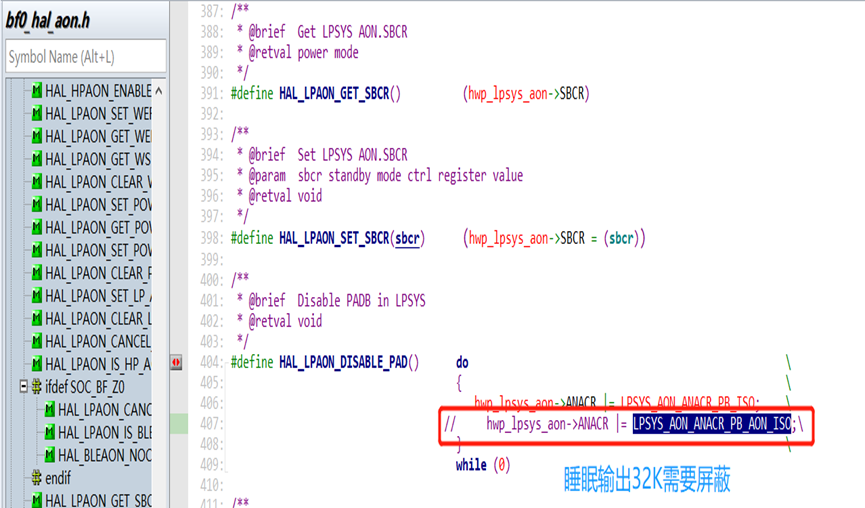<br>      
3，需要注意：<br>
因为步骤2，PB为了输出32k关闭了standy下IO保持功能， 因此PB口的唤醒脚PB43-48在standby模式下，由于内部上下拉不再生效，外部要必须给确定电平或者视外部连接设为输出高或者低，防止standby模式下PB43-PB48漏电。

## 1.8 增加PB25为按键KEY2 
1，Lcpu中 menuconfig  → Sifli middleware → Enable button library 设置按键个数为2<br>
2，Lcpu中 menuconfig  → Select board peripherals → Key config 设置KEY2对应GPIO为121（96+25）
<br>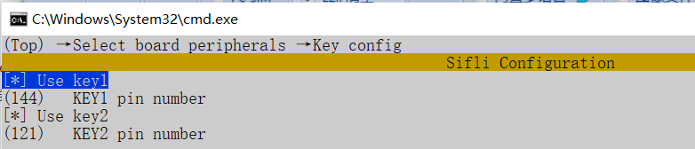<br>   
3，Lcpu中 menuconfig  → Sifli middleware → Enable button library 设置按键个数为2<br>
4，Lcpu中 menuconfig  → Select board peripherals → Key config 设置KEY2对应GPIO为121（96+25）<br>
5，Lcpu中，在sensor_service.c 函数init_pin中配置KEY2的初始化和唤醒源
<br>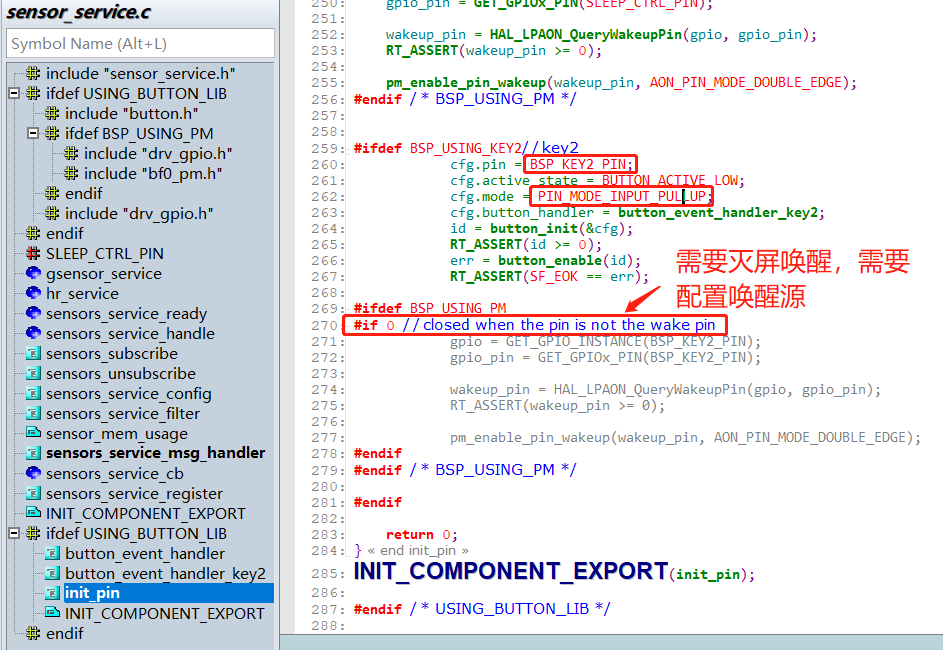<br>   
6，Hcpu中，在watch_demo.c函数init_pin中配置KEY2的消息订阅
<br>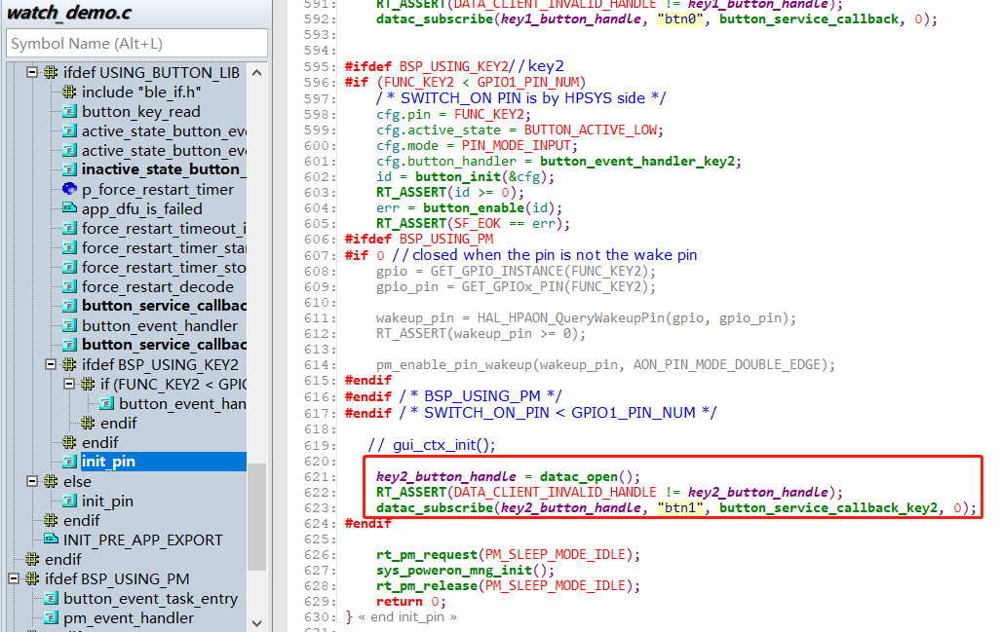<br>  

## 1.9 提高GPIO驱动能力 
DS0,DS1位都置1，驱动能力最强<br>
```c
HAL_PIN_Set_DS0(PAD_PA10,1,1); //PA10 DS0置1
HAL_PIN_Set_DS1(PAD_PA10,1,1); //PA10 DS1置1
HAL_PIN_Set_DS1(PAD_PB16,0,1); //PB16 DS1置1
```

## 1.10 GPIO配置为高阻模式
如下，设置该IO为模拟输入态，该IO口对外即为高阻态<br>
```c
HAL_PIN_Set_Analog(PAD_PA17, 1); //PA17 设置为模拟输入，对外高阻
HAL_PIN_Set_Analog(PAD_PB27, 0);  //PB27 设置为模拟输入，对外高阻
```
从高阻态恢复为原IO状态，如下：<br>
```c
HAL_PIN_Set(PAD_PA17, GPIO_A17, PIN_NOPULL, 1);
HAL_PIN_Set(PAD_PB27, GPIO_B27, PIN_NOPULL, 0);
HAL_PIN_SetMode(PAD_PA17, 1, PIN_DIGITAL_IO_PULLDOWN);  //sdk版本v2.2.0后，不再需要
HAL_PIN_SetMode(PAD_PB27, 0, PIN_DIGITAL_IO_PULLUP); //sdk版本v2.2.0后，不再需要
```
HAL_PIN_Set_Analog会把IO的IE位置0，如果只调用的HAL_PIN_Set函数配置，该函数不会操作IE位，此时输入不能用，需要IO恢复成输入口使用，还需调用HAL_PIN_SetMode函数配置，把IE为恢复为1(sdk版本v2.2.0后，不再需要)。<br>

**注意：**<br>
sdk版本v2.2.0后，在HAL_PIN_Set函数中，已经添加IE恢复为1操作，不需要再多添加HAL_PIN_SetMode函数

## 1.11 52X PA22/PA23 32K晶体复用IO, I2C无法输出波形问题
原因：<br>52X，其他IO的IE默认是1，而32k的两个IO是IE为默认为0，<br>
默认的流程，HAL_PIN_Set函数，不会把IE置1，而PA22,23这两个IO，而默认IE是0，所以不能输出波形
<br>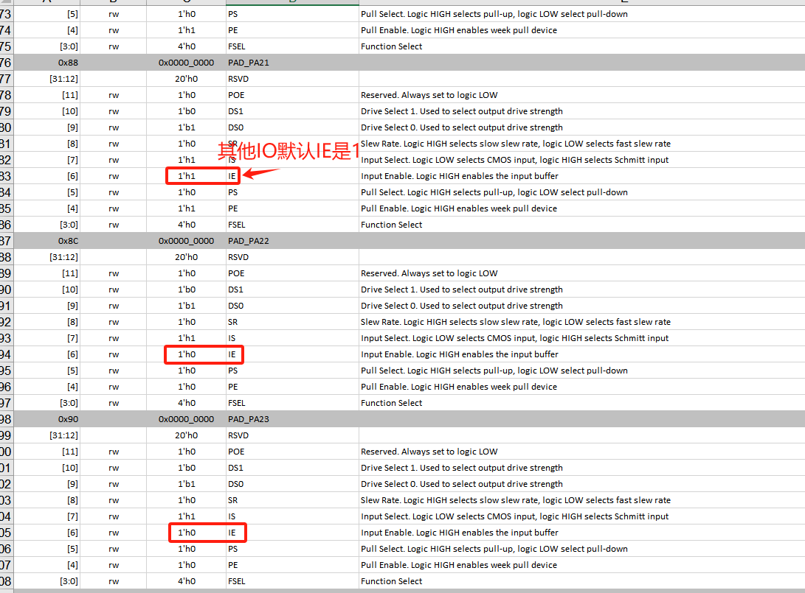<br>   
解决方法：<br>
添加HAL_PIN_SetMode函数把IO设置为正常IO后，IE位会置1，I2C可以正常输出。
<br>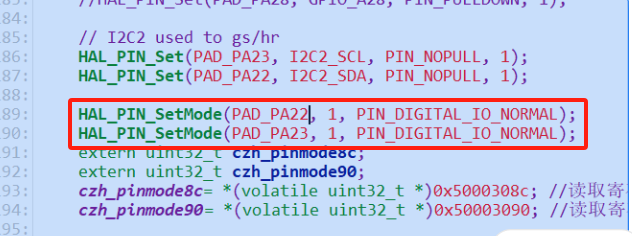<br>  

**注意：**<br>
56X的PA55,PA56两个32K IO的IE位默认位1，不存在此问题。<br>
sdk版本v2.2.0后，在HAL_PIN_Set函数中，已经添加IE恢复为1操作，不需要再多添加HAL_PIN_SetMode函数

## 1.12 PAXX_I2C_UART和PAXX_TIM配置方法
55，58系列MCU，每个IO都是固定的I2C,UART,PWM输出口，从56，52系列后的MCU，为了增加IO的灵活性，如下图，变成了灵活配置：
<br>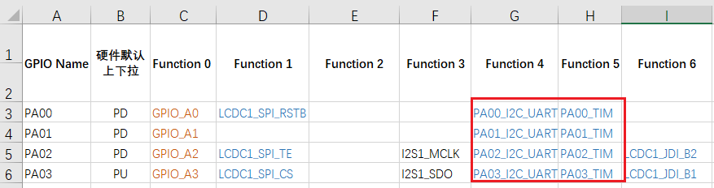<br>  
因为在HPSYS_CFG，LPSYS_CFG引入了I2CX_PINR，USART1_PINR，GPTIMX_PINR寄存器，如下图:
<br>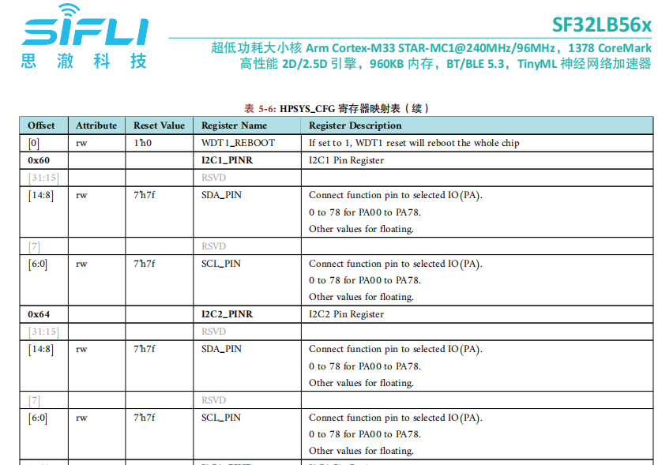<br> 
如上图寄存器内描述：对应的I2C1，I2C2都可以配置到PA00-PA78上来输出，具体PA口可以配置哪几路I2C，UART，TIMER输出，取决于HCPU拥有哪几路I2C，UART和TIMER，注意不能把LCPU才拥有的（例如I2C5,UART5)配置到PA口，同理不能把HCPU才拥有的（例如I2C1，UART1)配置到LCPU的PB口上，详细HCPU拥有哪几路资源，可以查看芯片用户手册，代码中hpsys_cfg.h中HPSYS_CFG_TypeDef，lpsys_cfg.h中LPSYS_CFG_TypeDef，都可以查看到对应的寄存器，另外bf0_pin_const.h文件中MCU可以配置的功能都有列出，如下图：
<br>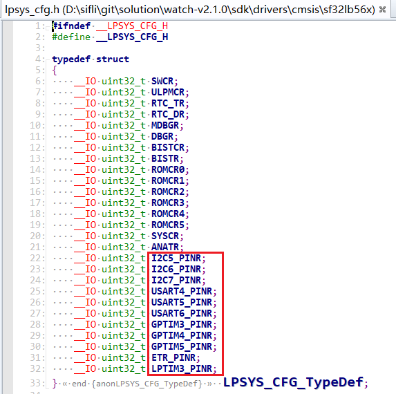<br>  
例如，正确的配置（举例为56系列MCU）:
```c
HAL_PIN_Set(PAD_PA32, USART1_RXD, PIN_PULLUP, 1);
HAL_PIN_Set(PAD_PA32, I2C1_SCL, PIN_PULLUP, 1);
HAL_PIN_Set(PAD_PA42, GPTIM2_CH4, PIN_NOPULL, 1);//GPTIM2_CH1-GPTIM2_CH4都可以，GPTIM2_CH5不行，因为没有此配置，详情查看对应芯片手册的寄存器:hwp_hpsys_cfg->GPTIM2_PINR
```
错误的配置:
```c
HAL_PIN_Set(PAD_PA42,USART4_TXD,PIN_NOPULL, 1);//错误，UART4在Lcpu上，不能配置到Hcpu的PA口
HAL_PIN_Set(PAD_PB37,GPTIM2_CH4,PIN_NOPULL, 0);//错误，GPTIM2在Hcpu上，不能配置到Lcpu的PB口

