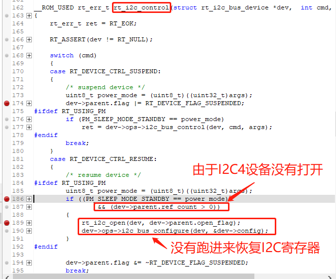
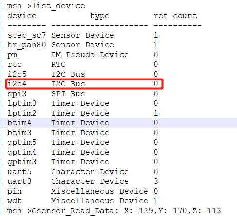
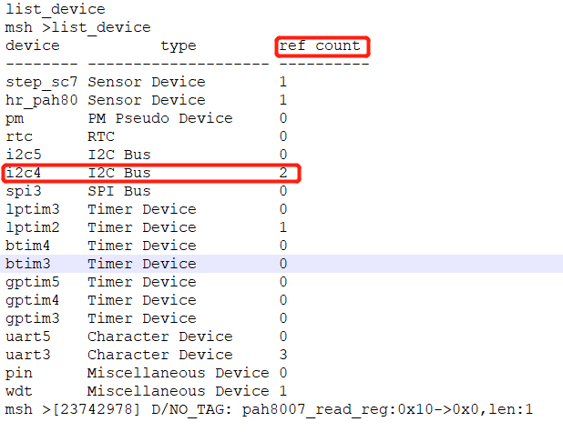
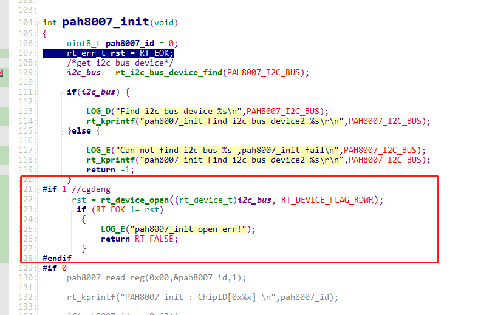
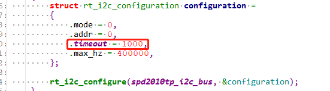
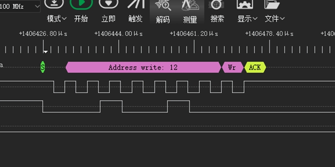
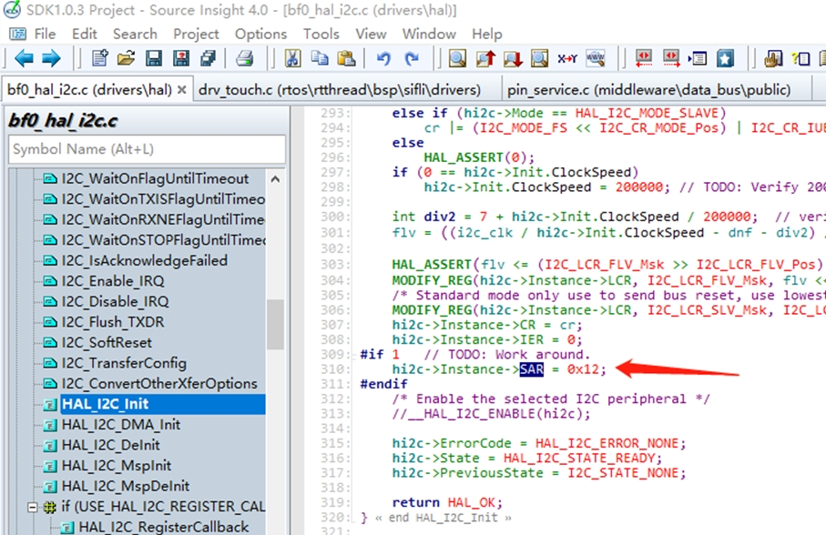
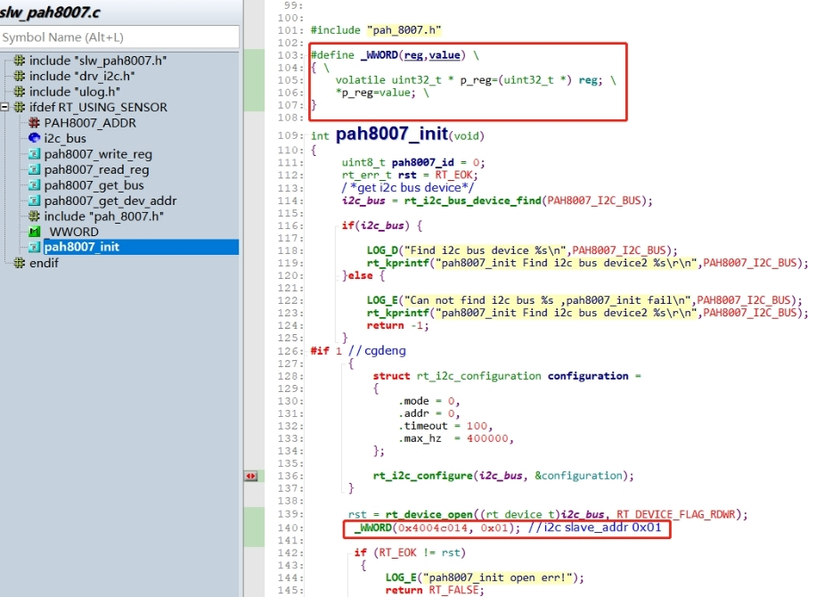
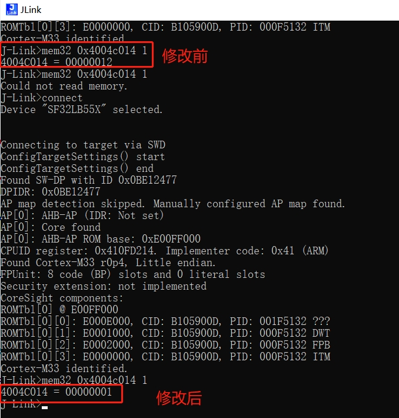

# 7 I2C相关
## 7.1 I2C正确的初始化方式
I2C的使用，需要严格的采用如下三步的方式来初始化和使用，否则存在睡眠唤醒后I2C恢复异常问题：
```
rt_i2c_bus_device_find /*第一步find I2C设备*/
rt_device_open /*第二步open I2C设备*/
rt_i2c_configure /*第三步配置 I2C设备*/
```
```c
static struct rt_i2c_bus_device *i2c_bus = RT_NULL;     /* I2C总线设备句柄 */
int sc7a20_i2c_init()
{
/*第一步find I2C设备*/
   i2c_bus = rt_i2c_bus_device_find("i2c4");
    if (i2c_bus)
    {
        LOG_D("Find i2c bus device I2C4\n");
/*第二步open I2C设备*/
rt_device_open((rt_device_t)i2c_bus, RT_DEVICE_FLAG_RDWR);
/* 或者采用rt_i2c_open函数，但是list_device时I2C不会显示open状态 */
	   	//rt_i2c_open(i2c_bus, RT_DEVICE_FLAG_RDWR);
 
		struct rt_i2c_configuration configuration =
        {
            .mode = 0,
            .addr = 0,
            .timeout = 500, //超时时间（ms）
            .max_hz  = 400000, //I2C速率（hz）
        };
/*第三步配置 I2C设备*/
        rt_i2c_configure(i2c_bus, &configuration);
    }
    else
    {
        LOG_E("Can not found i2c bus I2C4, init fail\n");
        return -1;
    }
    return 0;
   }
```   
## 7.2 I2C4进入睡眠standby醒来后I2C通讯错误
根本原因: 操作I2C设备，只使用了rt_i2c_bus_device_find I2C4设备，没有rt_device_open该设备，
而我们软件架构从standby醒来后， 会看I2C设备是open状态来决定是否恢复I2C配置，由于I2C4没有被open，所以从standby醒来没有恢复I2C4配置，导致I2C4不可用.
如下图:
<br><br>  
<br><br>   
解决方案:
添加如下open i2c4操作后，问题解决.
<br><br>    
<br><br>  

## 7.3 I2C概率性出错
1，rt_i2c_configure 初始化的timeout时间设置比较短，由于线程切换的原因，I2C线程得不到执行，容易导致超时，建议150ms比较合适，设置过长，当I2C出现ERR时，会导致系统卡死在I2C线程里面，如下图1000为1秒：
<br><br>   
2，I2C速率和上拉电阻不匹配，I2C波形上升下降沿过缓，400Kbps推荐1.5K-2.2K上拉电阻。
3，I2C飞线调试，飞线调试I2C设备Touch等芯片，过长总线，会出现I2C波形出现干扰毛刺，导致I2C波形识别错误。
4，某些I2C设备出现Error情况下，可能SDA会被I2C外设拉低不放的情形，当SDA被拉低时，I2C控制器识别到总线忙，SDA就发不出波形，log会打印ERR，此时可以通过复位外设，通常复位方法：
A，开关外设供电或者复位脚。
B，发送I2C bus reset(9个空clock)复位外设，（SDK中在I2C ERR时，在HAL层已经做了复位I2C控制器和发9个空clock的操作）。

## 7.4 当I2C设备地址为0x12时I2C波形无法发出
SDA被拉低后，I2C控制器再也发不出波形，如下图：
<br><br>   
根本原因：
SF32LB55x芯片支持i2c slave模式，
而这个slave模式的地址正好在驱动中被配置成了0x12，导致识别到0x12，芯片进入了i2c slave模式
驱动如下：
<br><br>   
解决方案1：
Lcpu这部分代码是在ROM里面，直接修改会不起效，从rom.sym删除lcpu中rom内函数：HAL_I2C_Init
并修改此处地址。
解决方案2：
在I2C4设备初始化完成后，直接重新配置该寄存器：
<br><br> 
```c
#define _WWORD(reg,value) \
{ \
    volatile uint32_t * p_reg=(uint32_t *) reg; \
    *p_reg=value; \
}
_WWORD(0x4004c014, 0x01);   //i2c slave_addr 0x01
``` 
<br><br>   