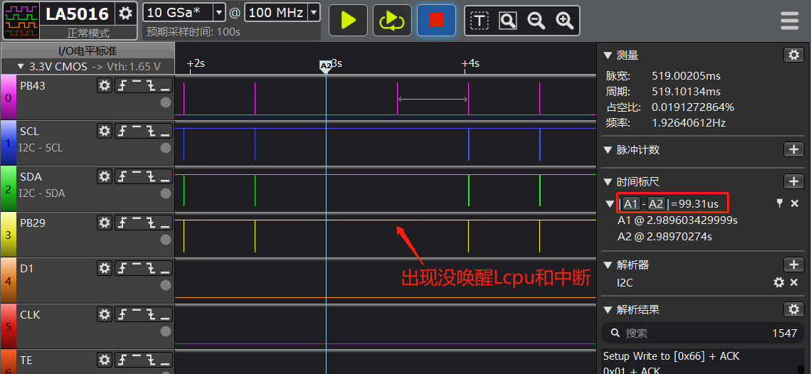

# 3 中断相关
## 3.1 中断唤醒standby睡眠的脉冲宽度要求
如下图，出现概率没法唤醒Lcpu和产生中断。<br>
根本原因：<br>
当PB43心率中断脉宽只有99us的时候，该客户standby下用的是RC10K振荡器，频率在8k-10k之间，对应的最大时钟周期为125us，因此该99us脉冲可能存在standby下无法唤醒Lcpu的情况出现。
解决方案：<br>
修改外设的寄存器或者固件，中断脉宽要大于时钟周期，RC10K振荡器下脉宽至少大于125us。
<br><br>  

## 3.2 开关总中断函数
```c
uint32_t mask;
 mask = rt_hw_interrupt_disable(); /*关中断*/
 rt_hw_interrupt_enable(mask);  /*开中断*/
 ```

