# 8 低功耗相关
## 8.1 Hcpu不能进入standby睡眠的debug方法
CPU进入睡眠模式，需要满足如下条件，如出现无法睡眠，可以按下面方法逐个排查:<br>
a，确认rtconfig.h中已经生成了如下宏:<br>
```c
#define RT_USING_PM 1
#define BSP_USING_PM 1 //开启低功耗模式
#define PM_STANDBY_ENABLE 1 //进入standby模式的低功耗,
//#define PM_DEEP_ENABLE 1  //52系列建议关掉上面standby，改用deep休眠
#define BSP_PM_DEBUG 1 //打开低功耗模式调试log
```
开启方法:，menuconfig选择如下::<br>
<br>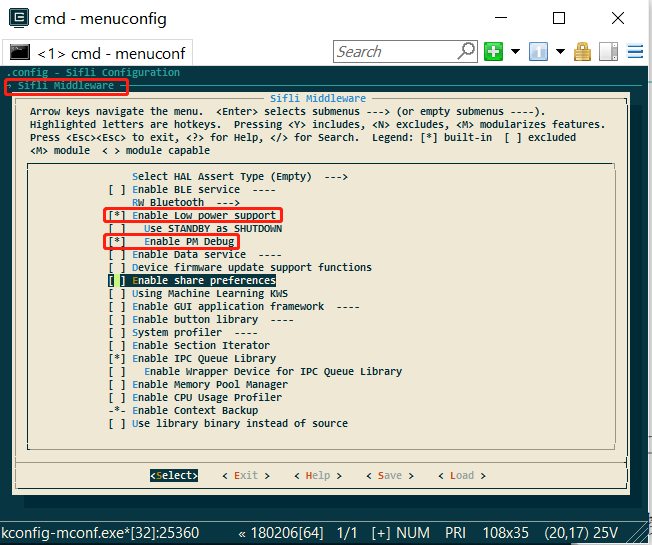<br>  
<br>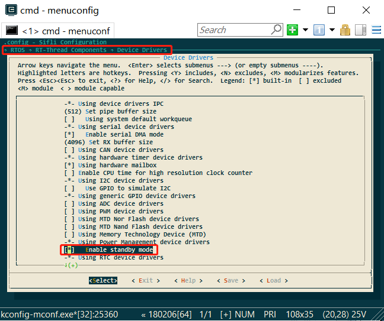<br>   
 
b，未禁止进入睡眠模式；:<br>

如果程序中调用了，rt_pm_request(PM_SLEEP_MODE_IDLE);函数， 就会被禁止进入睡眠，可以通过串口输入命令 pm_dump 查看， 如果为 1或者大于1，则使能了禁止睡眠，为0，允许睡眠；<br>
<br>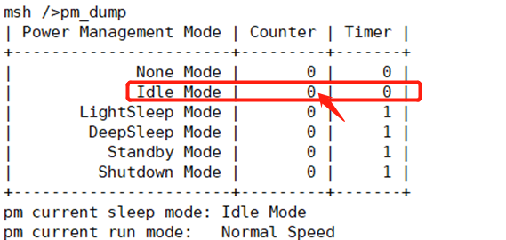<br> 

**备注：**<br>
`rt_pm_request(PM_SLEEP_MODE_IDLE); `和 `rt_pm_release(PM_SLEEP_MODE_IDLE)`;需要成对使用;<br>
c，操作系统的定时器超时时间大于睡眠门限;<br>
见const pm_policy_t pm_policy[]的配置，如下所示， 如果hcpu这里设置为100，即100ms，<br>
如果程序内， 存在低于100ms要唤醒的定时器，就不会进入睡眠，<br>
<br>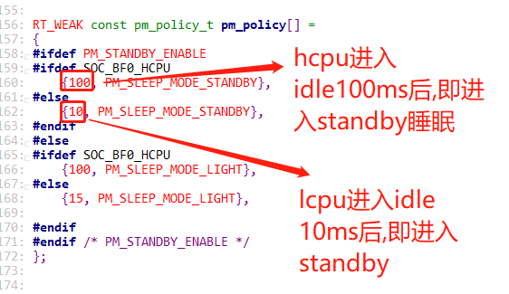<br> 
比如如下task中， 存在rt_thread_mdelay(90); 90<100，就不会睡眠，也可以串口命令 list_timer 查看timer的状态.
<br><br> 
d，唤醒源存在，<br>
如果存在唤醒源，没有清掉，就不会进入睡眠， 因为睡下去，也会被唤醒，<br>
常见的就是各个唤醒pin的电平状态不对， 比如设置的低电平唤醒， 但是该唤醒pin电平却是一直低电平.<br>
可以通过串口命令、Jllink或者log电压，去读hcpu和lcpu的wsr寄存器，各个系列的WSR寄存器地址和各个bit的定义都会不一样，请查询对应芯片手册，对照wsr的具体唤醒源.<br>
```c
regop unlock 0000
regop read 4007001c 1
regop read 4003001c 1
```
<br>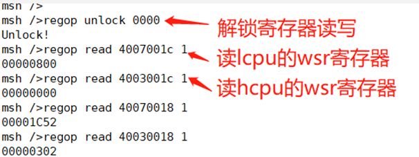<br> 
e，发给送另外一个核的数据没被读走.<br>
这里，可以通过Ozone连接或者dump内存用trace32，查看看ipc_ctx变量的tx buffer，来看是否存在数据没有被取走，<br>
如下图，read_idx_mirror和write_idx_mirror正常为相等或者为空，如果不相等， 即有数据没有被取走， 会导致无法进入睡眠,如下非空数据没取走不能睡眠情况：<br>
<br><br> 
如下图是正常情况：<br>
<br>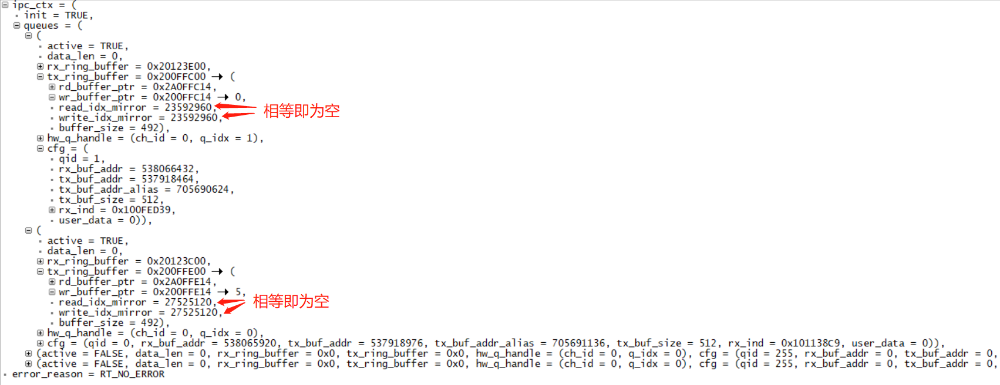<br>  
如下一个Hcpu由于Lcpu没有开启data service服务，缺失qid=1的通道，Hcpu发的数据，Lcpu没有取走，导致Hcpu不进入睡眠<br>
<br>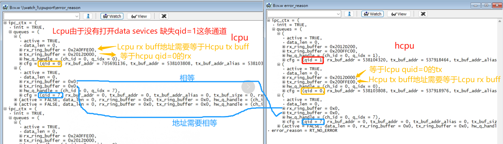<br> 
f，cpu没有进入idle进程.<br>
可以通过串口命令：list_thread看下所有线程的状态，只有除了tshell和tidle是ready的，其他应该都是suspend状态，否则会导致进入不了睡眠， <br>
如下图，我在app_watch_entry()函数中，添加了一条__asm("B .");死循环指令，导致app_watch的线程无法进入suspend，导致无法睡眠.<br>
<br><br>  
下面是检查的一些命令截图:<br>
<br>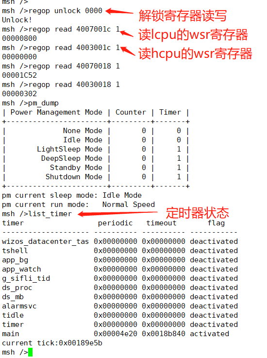<br> 

list_timer的状态说明，<br>
第一列"timer"为定时器名字;<br>
第二列"periodic"为定时器周期（十六进制）;<br>
第三列"timeout"为下一次定时器到来的时间戳;<br>
第四列"flag"为该定时器是否为激活状态;<br>
如上图，生效的定时器只有"main"的定时器（延时函数也是一个定时器），唤醒周期为0x4e20（20000ms）。

## 8.2 Hcpu已睡眠， Lcpu不睡眠
Lcpu不进入睡眠的原因，基本同问题## 8.1一样，可以参考## 8.1，此处只讲到几个Lcpu不通过串口命令debug的几个细节：<br>
a，由于此时Jlink不能连接，可以在Hcpu未睡眠时，执行SDK\tools\segger\jlink_lcpu_a0.bat切换Jlink连接到Lcpu,再进行debug。<br>
b， 检查是否存在唤醒源，在jlink连接到Lcpu后， mem32 0x4007001c 1 读取WSR寄存器。<br>
c， 发给Hcpu的数没有被读走<br>
可以通过编译出的map文件找到ipc_ctx变量，用jlink mem32读取，打印ipc_ctx变量或者Ozone.exe连接，读取该变量是不是发送数据没有被Hcpu读走。<br>

常见原因1：<br>
Jlink通过 mem32 0x4007001c 1 读取WSR寄存器值为： 0x200，提示PB47存在唤醒源未清掉，如下图为55X相关机器：<br>
<br>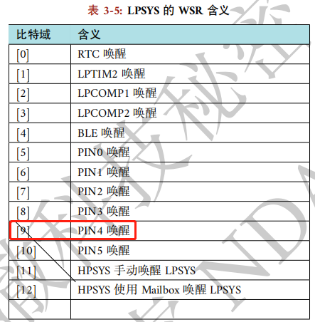<br> 
因为唤醒沿被配成了双沿触发，如下：<br>
```c
pm_enable_pin_wakeup(4, AON_PIN_MODE_DOUBLE_EDGE);  /* PB47 */
```
而，GPIO中断又配置了成了下降沿触发：<br>
```c
rt_pin_attach_irq(BATT_USB_POW_PIN, PIN_IRQ_MODE_FALLING, battery_device_calback, RT_NULL);
```
而清唤醒源又在GPIO中断回调函数内，这样就会导致上升沿的唤醒源，会出现不能清掉，导致Lcpu不睡的情况。<br>

## 8.3 充电如何唤醒
a，把充电检测pin，配置为睡眠后的唤醒源， 在standby模式下， 就能被唤醒，如下：<br>
```c
pm_enable_pin_wakeup(4, AON_PIN_MODE_NEG_EDGE); //4-> 对应为PB47，可以通过GPIO映射表来查找
```
如下图：<br>
<br>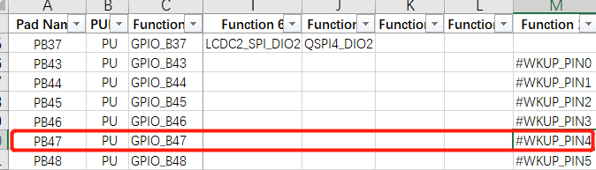<br> 
或者：<br>
```c
HAL_LPAON_EnableWakeupSrc(LPAON_WAKEUP_SRC_PIN4, AON_PIN_MODE_NEG_EDGE);//对应为PB47和下降沿唤醒
```
b，设置唤醒pin的中断：<br>
```c
#define PIN_CHG_DET (47 + 96) /* PB47 */
    rt_pin_mode(PIN_CHG_DET, PIN_MODE_INPUT); /*设置为输入模式*/
    rt_pin_attach_irq(PIN_CHG_DET, PIN_IRQ_MODE_FALLING, (void *) battery_charger_input_handle,(void *)(rt_uint32_t) PIN_CHG_DET); /*配置PB47为下降沿中断*/
    rt_pin_irq_enable(PIN_CHG_DET, 1); /* 使能中断 */
```    
c，注册pin的中断函数，唤醒后，就会进入下面中断函数;<br>
```c
void battery_charger_input_handle(void)
{
    rt_sem_release(&charger_int_sem);
}
```
如下是充电检测初始化代码说明：<br>
```c
#define PIN_CHG_DET (47 + 96) /* PB47 需加96 */
int battery_charger_pin_init(void)
{
#ifdef BSP_USING_PM
#ifdef BSP_USING_CHARGER
    GPIO_TypeDef *gpio = GET_GPIO_INSTANCE(PIN_CHG_DET);
    uint16_t gpio_pin = GET_GPIOx_PIN(PIN_CHG_DET);
    int8_t wakeup_pin = HAL_LPAON_QueryWakeupPin(gpio, gpio_pin);/* 查询PB47为哪个唤醒源 */
    RT_ASSERT(wakeup_pin >= 0); /* 非唤醒pin，会assert */
    //rt_kprintf("HAL_LPAON_QueryWakeupPin :%d\n", wakeup_pin);
    pm_enable_pin_wakeup(wakeup_pin, AON_PIN_MODE_NEG_EDGE); /* 配置唤醒源，wakeup_pin值为0-5对应上面表格的#WKUP_PIN0 - 5 */
#endif
#endif /* BSP_USING_PM */
    _batt_filter_init(&batt_inf);
    rt_pin_mode(PIN_CHG_EN, PIN_MODE_INPUT);
    rt_pin_mode(PIN_CHG_DET, PIN_MODE_INPUT);/*设置PB47为输入模式*/
    rt_pin_attach_irq(PIN_CHG_DET, PIN_IRQ_MODE_FALLING, (void *) battery_charger_input_handle,(void *)(rt_uint32_t) PIN_CHG_DET); /*配置PB47为下降沿中断*/
    rt_pin_irq_enable(PIN_CHG_DET, 1); /* 使能中断 */
    return 0;
}
```

**注意：**<br>
a，唤醒源配置为AON_PIN_MODE_NEG_EDGE或者AON_PIN_MODE_POS_EDGE边沿唤醒模式的话，<br>
则AON_PIN_MODE_NEG_EDGE 和 PIN_IRQ_MODE_FALLING唤醒触发方式必须要跟pin中断触发方式一致（都是下降沿触发或都是上升沿触发），<br>
因为清WSR是在pin中断函数HAL_GPIO_EXTI_IRQHandler里面进行的，否则会导致被唤醒一次后WSR寄存器没有清除，无法进入睡眠。<br>
b，唤醒源配置为AON_PIN_MODE_HIGH或者AON_PIN_MODE_LOW电平触发模式的话，唤醒WSR标志位，不需要软件清除，电平变化后，WSR标志位，就会自动清除。<br>

## 8.4 进入Hibernate后，机器重启
常见原因1：<br>
就是进入hibernate前配置的唤醒pin，电平异常，比如配置的PB44为低电平唤醒key脚， 但该PB44没有上拉电源，导致该pin一直为低电平，一旦进入hiberante就开机了.<br>
常见原因2：<br>
比如Lcpu的sensor中断唤醒，采用了pm_enable_pin_wakeup函数配置中断唤醒，此函数还默认会配置hibernate关机唤醒，<br>
而sensor 在关机时中断电平变化，导致睡下去又被唤醒，<br>
<br>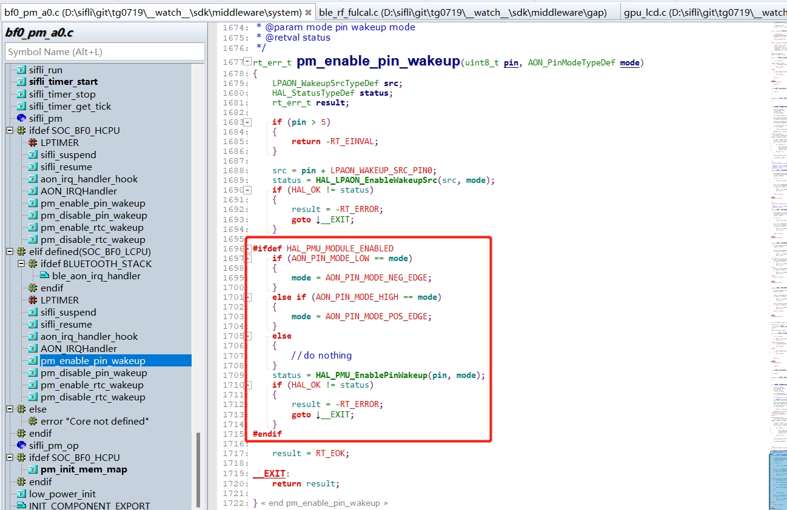<br> 
解决方案：<br>
pm_enable_pin_wakeup的唤醒函数调用，换成HAL_LPAON_EnableWakeupSrc(src, mode); 只配置中断唤醒，不配置关机唤醒，问题解决。<br>
常见原因3：<br>
比如充电唤醒，按键唤醒后PMU的WSR标志位置1，但是用户程序没有处理去清掉该WSR标志位，导致睡眠后又醒来<br>
解决方案：<br>
在进入关机前，即pm_shutdown函数内，调用HAL_PMU_CLEAR_WSR(hwp_pmuc->WSR); 先清掉WSR标志位， 再进入睡眠。<br>
```c
void pm_shutdown(void)
{
#ifdef BSP_PM_STANDBY_SHUTDOWN
    rt_err_t err;
    s_sys_poweron_mng.is_poweron = false;
    gui_pm_fsm(GUI_PM_ACTION_SLEEP);
#else
   HAL_PMU_CLEAR_WSR(hwp_pmuc->WSR);//清掉PMU_WSR
    rt_hw_interrupt_disable();
    HAL_PMU_EnterHibernate();
    while (1) {};
#endif
}
```
常见原因4：<br>
没有按我们标准的操作，即HAL_PMU_EnterHibernate();被执行后，机器没有马上进入Hibernate模式，还会继续往下跑。<br>
必须要按如下图进行，先关中断，执行HAL_PMU_EnterHibernate();后，要添加while(1);死循环。避免执行执行后续代码，导致死机或者重启等不可预料问题。 如下图：
<br>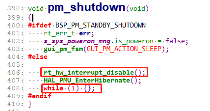<br> 

## 8.5 hibernate唤醒后启动流程
进入hibernate睡眠模式后，rtc，wdt，lcpu的唤醒pin都可以唤醒整机，hcpu的唤醒pin不能唤醒hibernate的睡眠，<br>
唤醒后，启动相当于冷启动，程序从Hcpu开始跑.<br>
配置唤醒源， hcpu不能唤醒hibernate的睡眠，lcpu采用:HAL_LPAON_EnableWakeupSrc函数配置，<br>
对应的唤醒源，可以在SF32LB55X_Pin config_xxx.xlsx文档中找到，如下图:<br>
<br>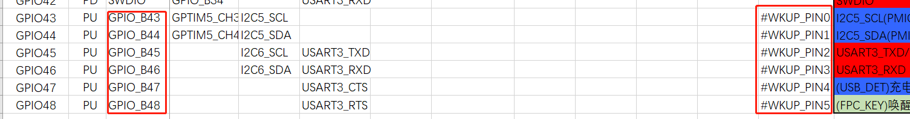<br> 
在函数rt_application_init_power_on_mode内可以判断冷启动的方式，如下图:
<br>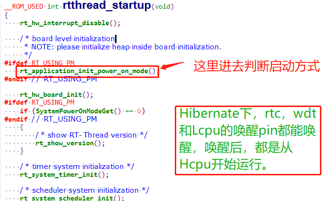<br> 
启动方式会存在变量g_pwron_mode，唤醒源会保存在g_wakeup_src
<br>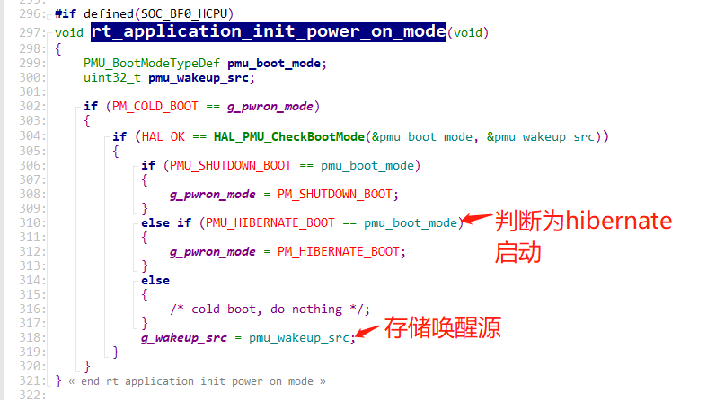<br> 
函数sys_pwron_fsm_handle_evt_init 处理，唤醒后事件
<br>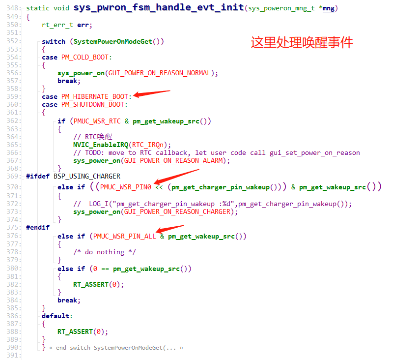<br>
可以手动读取pmu的wsr寄存器看看状态，如下命令:(各个系列的WSR寄存器地址会不一样，请查询对应芯片手册)<br>
```c
regop unlock 0000
regop read 4007a008 1
```
代码中对应: `*wakeup_src = hwp_pmuc->WSR;`
<br>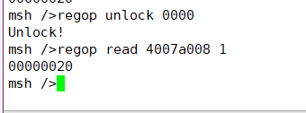<br> 
寄存器对应的bit:<br>
<br>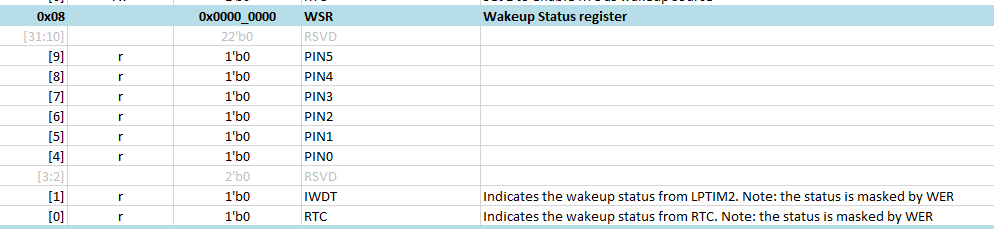<br>

## 8.6  串口命令控制进入睡眠
1， 在main函数中， 添加rt_pm_request(PM_SLEEP_MODE_IDLE); 调用， 默认就会禁入睡眠<br>
<br>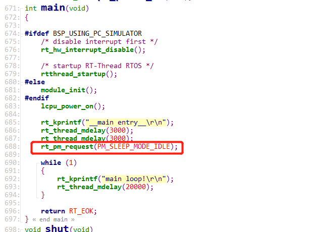<br> 
2， 添加控制命令sleep<br>
```c
int sleep(int argc, char **argv)
{
char i;
    if (argc > 1)
    {
        if (strcmp("standby", argv[1]) == 0)
        {
        		rt_kprintf("sleep on\r\n");
		rt_pm_release(PM_SLEEP_MODE_IDLE);
        }
        else if (strcmp("off", argv[1]) == 0)
        {
        		rt_kprintf("sleep off\r\n");   
		rt_pm_request(PM_SLEEP_MODE_IDLE);
        }
        else if (strcmp("down", argv[1]) == 0)
        {
		rt_kprintf("entry_hibernate\r\n");
		rt_hw_interrupt_disable();
		HAL_PMU_EnterHibernate(); 
		while (1) {};
        }		
        else
        {
        	rt_kprintf("sleep err\r\n");
        }
    }
    return 0;
}
MSH_CMD_EXPORT(sleep, forward sleep command); /* 导出到 msh 命令列表中 */
```
3，串口shell，输入sleep standby，允许睡眠，输入sleep off，不允许进入睡眠，输入sleep down 进入hibernate关机模式。<br>

## 8.7  Standby待机和Standby关机IO内部常见的漏电模型
### 8.7.1 标准IO口模型
<br>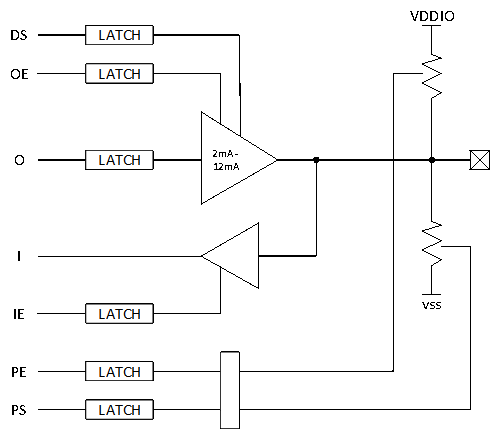<br> 
功能描述如下：<br>
|DS | driving strength|
| --- | ------ |
|OE | output enable|
|O| output|
|I| input|
|IE| input enable|
|PE | pull enable|
|PS | pull select|
<br>组合控制可以实现日常使用的功能；<br>
推挽输出（push-pull）<br>
*	OE = 1，O = 0/1
<br>开漏输出（open-drain）<br>
*	OE = 0/1，O = 0

### 8.7.2 IO漏电模型一
OE=1，O=1，PE = 1, PS= 0；<br>
OE=1，O=1表示输出为高；<br>
PE=1，PS=0 表示有下拉电阻；<br>
电流流动如下：<br>
电流值：I = Vo/Rpd;	Rpd下拉电阻；<br>
<br>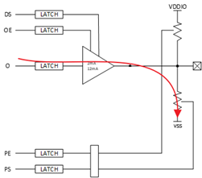<br> 
对应的漏电模型模型如下<br>
```c
HAL_PIN_Set(PAD_PA31, GPIO_A31, PIN_PULLDOWN, 1);  //PA31配置为下拉
BSP_GPIO_Set(31, 1, 1); //PA31输出高电平
```
正确配置应该为<br>
```c
HAL_PIN_Set(PAD_PA31, GPIO_A31, PIN_NOPULL, 1);  //PA31配置无上下拉
BSP_GPIO_Set(31, 1, 1); //PA31输出高电平
```

### 8.7.3 IO漏电模型二
OE=1，O=0，PE = 1, PS= 1；<br>
OE=1，O=1表示输出为低；<br>
PE=1，PS=1 表示有上拉电阻；<br>
电流流动如下：<br>
电流值：I = VDDIO/Rpu;	Rpu 上拉电阻；<br>
<br>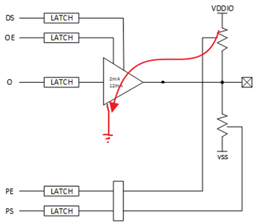<br> 
对应的漏电模型模型如下<br>
```c
HAL_PIN_Set(PAD_PA31, GPIO_A31, PIN_PULLUP, 1);  //PA31配置为上拉
BSP_GPIO_Set(LCD_VCC_EN, 0, 1); //PA31输出低电平
```
正确配置应该为
```c
HAL_PIN_Set(PAD_PA31, GPIO_A31, PIN_NOPULL, 1);  //PA31配置无上下拉
BSP_GPIO_Set(LCD_VCC_EN, 0, 1); //PA31输出低电平
```

### 8.7.4 IO漏电模型三
IE= 1, OE=0，O=0，PE = 0, PS= 0；<br>
如果out 电压处于0~ VDDIO之间的某个电压，会导致input的IO单元的NMOS和PMOS处于半导通状态导致漏电，依据这个漏电模型，IO内部漏电约为0uA - 200uA漏电不等（不同板子会有差异）<br>
<br>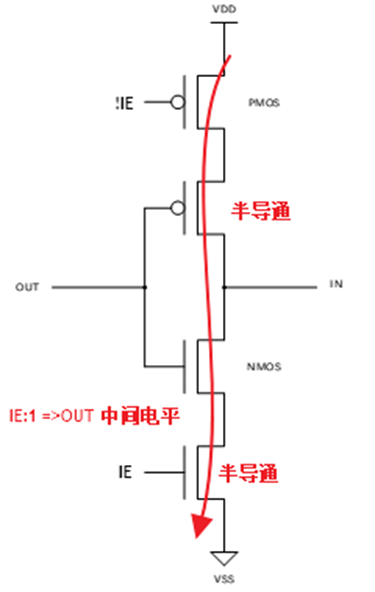<br> 
电流值：I=VDD/(Rnmos+Rpmos) <br>
*	对应的漏电模型如下<br>
```c
HAL_PIN_Set(PAD_PA31, GPIO_A31, PIN_NOPULL, 1);  //PA31配置无上下拉
```
同时满足下列两项条件<br>
A, 没有调用BSP_GPIO_Set或者 rt_pin_write输出高或低电平<br>
B, IO外部处于浮空状态，没有对应的上下拉固定电平<br>

*	正确配置可以为下面任意一种
*	IO口为NC，不用的IO，不要初始化，IO默认会自带上下拉，不需要配置，下图为IO默认上下拉状态
 <br>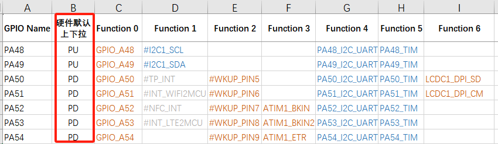<br>

*	IO作为输出口，输出高或低电平
```c
HAL_PIN_Set(PAD_PA31, GPIO_A31, PIN_NOPULL, 1);  //PA31配置无上下拉
BSP_GPIO_Set(LCD_VCC_EN, 0, 1); //PA31输出低电平
```

*	IO作为输入口，有外部上下拉电阻或者外设能持续给予稳定的电平
```c
    HAL_PIN_Set(PAD_PB45, USART3_TXD, PIN_NOPULL, 0);           // USART3 TX/SPI3_INT
    HAL_PIN_Set(PAD_PB46, USART3_RXD, PIN_NOPULL, 0);           // USART3 RX
```
或者：
```c
    HAL_PIN_Set(PAD_PB45, USART3_TXD, PIN_PULLUP, 0);           // USART3 TX/SPI3_INT
    HAL_PIN_Set(PAD_PB46, USART3_RXD, PIN_PULLUP, 0);           // USART3 RX
```    
外部存在外部上拉
<br>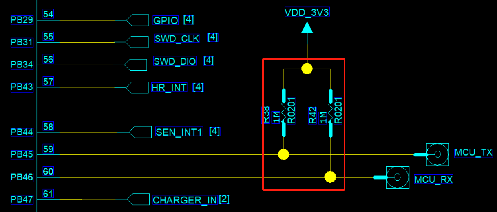<br> 
*	IO作为输入口，外部没有上下拉，也没有外设能给予持续的稳定的电平<br>
依据外部电路，配置为内部上拉或者下拉（适用所有IO）<br>
```c
    HAL_PIN_Set(PAD_PB45, USART3_TXD, PIN_PULLUP, 0);        // USART3 TX
    HAL_PIN_Set(PAD_PB46, USART3_RXD, PIN_PULLUP, 0);        // USART3 RX
```    
非唤醒IO，配置为高阻态，对应的PAD的IE位会关闭<br>
```c
	HAL_PIN_Set_Analog(PAD_PB45, 0);  //设置为高阻
	HAL_PIN_Set_Analog(PAD_PB46, 0);  //设置为高阻
```    
带唤醒功能的IO口，还有唤醒输入另一套输入通道，配置为高阻态，唤醒输入通道还有漏电风险，必须有内部或外部上拉，如下图，不同芯片唤醒源IO不同，需要查看对应的Pin_config文档<br>
<br>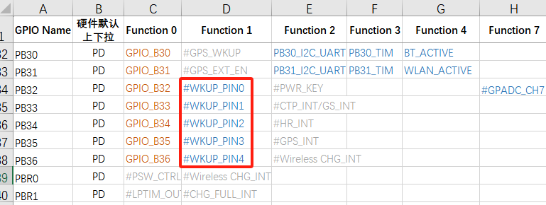<br> 

## 8.8  Hibernate关机常见的唤醒IO内部漏电模型
### 8.8.1 Hibernate关机下IO的状态
	普通IO（不带唤醒功能）<br>
在进入hibernate关机后，都为高阻态，内部不漏电，对外为高阻<br>
	带唤醒功能的IO<br>
比普通IO多一个唤醒输入电路，这部分电路需要在hibernate下唤醒MCU，需要外部或者内部有一个内部上下拉电平，确保唤醒IO不漏电<br>
	55X hibernate关机后，pinmux的上下拉会掉电，唤醒IO内部没有带PMU的上下拉, 只能依赖外部上下拉<br>
	56X,52X hibernate关机后，pinmux的上下拉会掉电，唤醒IO另有带可配置的不掉电PMU上下拉<br>
### 8.8.2 Hibernate关机下55X唤醒IO漏电模型
55X hibernate关机后，pinmux的上下拉掉电，唤醒IO内部没有带PMU的上下拉, 只能依赖外部上下拉。<br>
在外部悬空的情况下，依据这个漏电模型，唤醒IO内部漏电约为0uA - 200uA漏电不等（不同板子会有差异）<br>
<br><br>
 
### 8.8.3 Hibernate关机下52X唤醒IO漏电模型一
52X hibernate关机后，唤醒IO带可配置的PMU上下拉，在hibernate关机前，配置为PMU无上下拉，而且外部也没有确定上下拉电平时，依据这个漏电模型（如## 8.7.2附图），唤醒IO内部漏电约为0uA - 200uA漏电不等（不同板子会有差异）<br>
```c
HAL_PIN_Set(PAD_PA24, GPIO_A24, PIN_NOPULL, 1);//唤醒IO PA24配置为无上下拉，外部也无上下拉
```
正确配置如下：<br>
pm_shutdown函数中，对唤醒IO，PA28-PA44的统一配置如下<br>
```c
hwp_rtc->PAWK1R = 0x0001ffff;; //PA28-PA44唤醒IO上下拉使能,bit0:PA28,bit1:PA29
hwp_rtc->PAWK2R = 0x0000; //PA28-PA44唤醒IO都配置为下拉，对应bit， 0:下拉，1:上拉 
```
下图，PE对应bit为上下拉使能，PS为上下拉选择<br>
<br>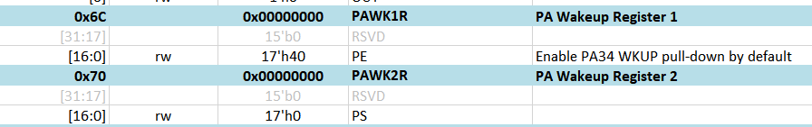<br> 

PA24~PA27跟PBR0~3用同一个PAD，PA24~PA44都可以用HAL_PIN_Set函数配置PMU上下拉，例如<br>
```c
HAL_PIN_Set(PAD_PA24, GPIO_A24, PIN_PULLDOWN, 1); //唤醒IO PA24 同时设置pinmux下拉和PMU下拉
HAL_PIN_Set(PAD_PA25, GPIO_A25, PIN_PULLDOWN, 1); 
HAL_PIN_Set(PAD_PA26, GPIO_A26, PIN_PULLDOWN, 1); 
HAL_PIN_Set(PAD_PA27, GPIO_A27, PIN_PULLDOWN, 1); 
```
HAL_PIN_Set操作对应的唤醒脚PA24~PA44时，会把IO的pinmux配成上下拉，PMU内部的上下拉也会同时配置，<br>
Hibernate关机时，IO的pinmux上下拉会失效，PMU部分的上下拉不会掉电，还会存在
<br>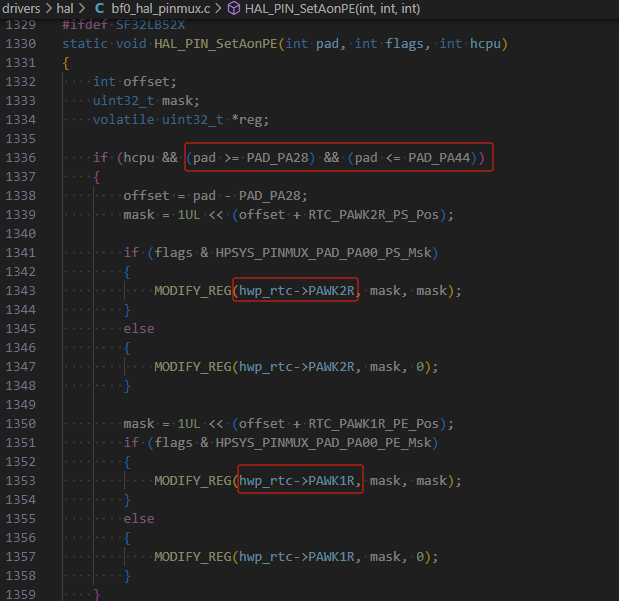<br> 

### 8.8.4 Hibernate关机下52X唤醒IO漏电模型二
52X hibernate关机后，唤醒IO带可配置的不掉电PMU上下拉，在hibernate关机前，配置为PMU上下拉与外部电平相反时<br>
```c
HAL_PIN_Set(PAD_PA24, GPIO_A24, PIN_PULLUP, 1);//唤醒IO PA24配置为PMU内部上拉，导致外设漏电
```
## 8.9 低功耗调试经验分享

**Hibernate下的功耗**<br>
55系列MCU：<br>
软件不用做任何处理，IO都已经为高阻态，因为唤醒PIN无内部上下拉，需要外部上下拉保证电平确保唤醒PIN不会漏电；<br>
58，56，52系列MCU：<br>
除了唤醒PIN外，其他IO都已经为高阻态，软件上只需要确认进入Hibernate前，已经配置好相应的正确PIN上下拉；<br>
52系列的还有内部3个LDO需要关掉；<br>
Hibernate通常会低于5uA，其他的耗电，都是来着外设硬件电路了；<br>
**Deep/Standby待机功耗**<br>
首先确保Hcpu/Lcpu，都已经进入低功耗，Log已经打印pm[s],而且能pm[w]唤醒，确保睡眠唤醒过程不死机；<br>
也可以通过测量硬件的hpsys，lpsys的ldo的电压判断是否进入低功耗；电压睡眠会下降，唤醒会恢复；<br>
功耗主要专注3方面：<br>
```
1，外设漏电，包括MCU与外设IO电平差导致漏电<br>
2，MCU内部IO漏电，见FAQ的IO漏电模型，<br>
常见输出高而下拉，内部上拉而外部下拉，输入口而无上下拉，<br>
3，MCU内部或者外部存储单元Flash，Psram，EMMC没有进入低功耗，<br>
```
* 关于第一点：最好是能拆除所有外设，让系统变成最小系统,一一排除外设漏电;<br>
* 关于第二点，见下面代码，普通IO休眠改成高阻，唤醒pin依据外部电路配置上拉或下拉；<br>
**注意点：**<br>
1，需要使用的IO配置为高阻后，唤醒则需要配回来，否则会影响功能；<br>
2，有些外设，比如nor flash，比如QSPI的CS需要配置为高才行，配置为高阻反而会漏电更多；<br>
```c
    HAL_PIN_Set_Analog(PAD_PA44, 1);
    HAL_PIN_Set(PAD_PA24, GPIO_A24, PIN_PULLDOWN, 1); //set pulldown or pullup all wakesrc pin
```    
* 关于第三点，依据MCU内外部flash，psrma，emmc的供电和IO，进行关电（对应IO下拉或者高阻），睡眠操作；<br>
具体每个存储设备选择断电还是睡眠操作，需要依据从休眠唤醒后的存储设备的数据是否会丢失、是否需要保留，进出休眠的时间开销和参考内存规格书的电流参数选择满足功能的最优方案；<br>
下面是一些psram和flash进出睡眠的一些操作接口；<br>
```c
#ifdef BSP_USING_PSRAM1
    rt_psram_enter_low_power("psram1");
#endif
#ifdef BSP_USING_PSRAM1
    rt_psram_exit_low_power("psram1");
#endif
#if defined(BSP_USING_NOR_FLASH1)
        FLASH_HandleTypeDef hflash;
        hflash.Instance = FLASH1;
        HAL_FLASH_RELEASE_DPD(&hflash);
        HAL_Delay_us(8);
#endif /* BSP_USING_NOR_FLASH2 */
```