# 9 PWM
## 9.1 PB24当作motor pwm口配置方法
1，查找到PB24对应为GPTIM5和Channel 2<br>
<br><br>  
2, pinmux.c中， 配置PB24为GPTIM5_CH2功能口<br>
```c
HAL_PIN_Set(PAD_PB24, GPTIM5_CH2, PIN_NOPULL, 0);             // Motor PWM
```
3，查看pwm_config.h中的配置，查看是GPTIM5对应为pwm6，<br>
<br><br>  
4， → RTOS → On-chip Peripheral Drivers → Enable pwm 选择PWM6,使能下面宏：<br>
```c 
#define BSP_USING_PWM6 1
```
5，修改配置PB24对应的pwm6和channel 2<br>
```c
#define PORT_MOTO        (96+24)
#ifndef  MOTOR_DRV_MODE_GPIO
#define PWM_DEV_NAME      "pwm6"  /* PWM设备名称 */
#define PWM_DEV_CHANNEL     2    /* PWM通道 */
#endif
```
<br>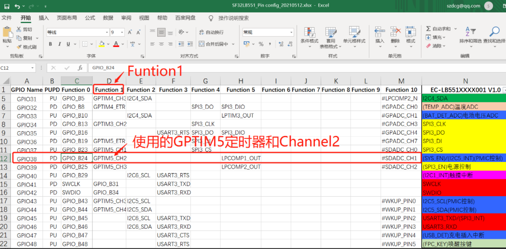<br>  
6，如何开启配置pwm输出，可以参考motor的代码，修改为你对应的PWM输出配置，如下图:
<br>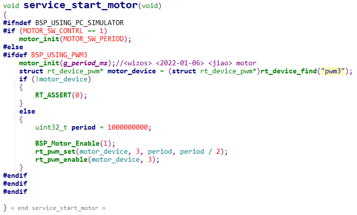<br>  

## 9.2 PA47 当LCD背光， 怎么配置?
1，找到PA47对应为GPTIM1和Channel4<br>
<br>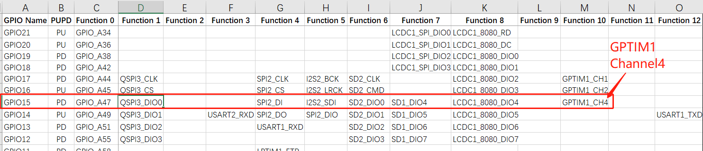<br>  
2，pinmux.c文件中，配置为 GPTIM1_CH4功能口，如下：<br>
```c
#define LCD_BACKLIGHT_USING_PWM
#ifdef LCD_BACKLIGHT_USING_PWM
    HAL_PIN_Set(PAD_PA47, GPTIM1_CH4, PIN_NOPULL, 1);  //backlight pwm  
#else
    HAL_PIN_Set(PAD_PA47, GPIO_A47, PIN_NOPULL, 1);  /GPIO backlight
#endif 
```
3，查看pwm_config.h中的配置，查看是GPTIM1对应为pwm2，
<br>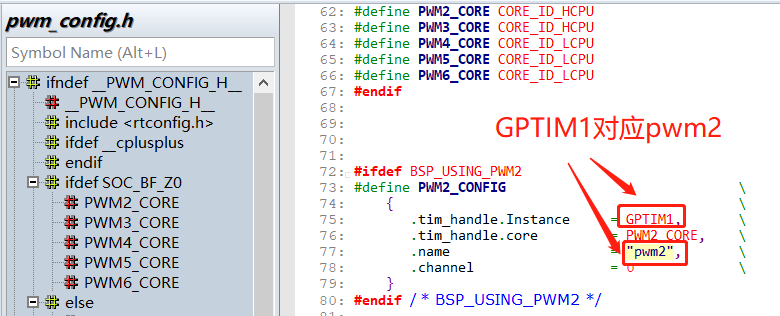<br>  
4， menuconfig中<br>
`→ RTOS → On-chip Peripheral Drivers → Enable pwm` 选择PWM2,使能下面宏： <br>
```c
#define BSP_USING_PWM2 1
```
5，在对应屏驱动SPD2010_SetBrightness设置亮度函数中，并配置PA47对应的pwm2和channel 4，代码如下：<br>
```c
#define LCD_BACKLIGHT_USING_PWM
#ifdef LCD_BACKLIGHT_USING_PWM
#define LCD_BACKLIGHT_PWM_DEV_NAME "pwm2"
#define LCD_BACKLIGHT_PWM_PERIOD (1 * 1000 * 1000)
#define LCD_BACKLIGHT_PWM_CHANNEL 4
#endif
void SPD2010_SetBrightness(LCDC_HandleTypeDef *hlcdc, uint8_t br)
{
    uint8_t bright = (uint8_t)((int)SPD2010_BRIGHTNESS_MAX * br / 100);
    SPD2010_WriteReg(hlcdc, SPD2010_WBRIGHT, &bright, 1);
//	rt_kprintf("SPD2010_SetBrightness val=%d \n",br);
#ifndef LCD_BACKLIGHT_USING_PWM //不用PWM，就直接拉高拉低GPIO点亮背光
	/* PA70 Backlight ,PA47 1V8_EN*/
		uint8_t bright = (uint8_t)((int)SPD2010_BRIGHTNESS_MAX * br / 100);
		GC9B71_WriteReg(hlcdc, SPD2010_WBRIGHT, &bright, 1);
		rt_pin_mode(LCD_BACKLIGHT_POWER_PIN, PIN_MODE_OUTPUT);
		rt_pin_write(LCD_BACKLIGHT_POWER_PIN, 1);
		LOG_I("SPD2010_SetBrightness,br:%d\n",br);	
	/* PA70 Backlight */
#else
	/* PA47 Backlight PWM,PA70_NC*/
		rt_uint32_t pulse = br * LCD_BACKLIGHT_PWM_PERIOD / 100;
		struct rt_device_pwm *device = RT_NULL;
		device = (struct rt_device_pwm *)rt_device_find(LCD_BACKLIGHT_PWM_DEV_NAME);
		if (!device)
		{
			LOG_I("find pwm:LCD_BACKLIGHT_PWM_DEV_NAME err!",br,pulse);
			return;
		}
		rt_pwm_set(device,LCD_BACKLIGHT_PWM_CHANNEL,LCD_BACKLIGHT_PWM_PERIOD,pulse);
		rt_pwm_enable(device, LCD_BACKLIGHT_PWM_CHANNEL);
		LOG_I("SPD2010_SetBrightness,br:%d,pulse:%d\n",br,pulse);
	/* PA47 Backlight PWM */	
#endif	
}
```
**注意：**<br>
在用PA口输出PWM时，如果打开了`#define BSP_PM_FREQ_SCALING 1` 的Hcpu主频降频功能，<br>
Hcpu进入idle线程后，主频会变低，相对应Hcpu的PA31口的PWM频率也会变化<br>
解决方案1：<br>
关闭#define BSP_PM_FREQ_SCALING 1宏，牺牲hcpu亮屏功耗<br>
根本解决方案2:<br>
换成PB口来输出PWM<br>

## 9.3 睡眠下输出PWM方法
应用场景：在睡眠状态下也能继续输出PWM，需要使用Lcpu lptim3控制的pwm<br>
使用方法：<br>
1、需要在menuconfig 使能Lcpu 的lptim3定时器及PWM
<br>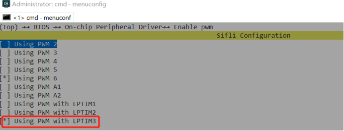<br>
<br>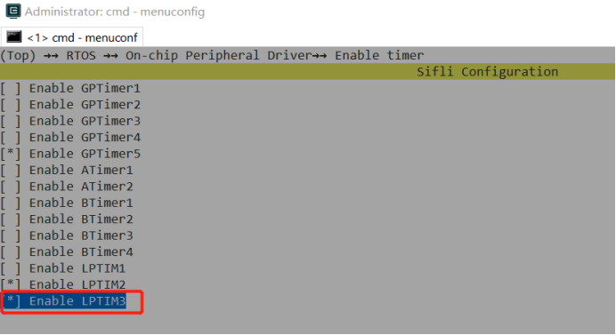<br>    
2、设置对应脚为lptim3_pwm模式,比如PB44，常用的引脚为PB43~PB46<br>
```c
HAL_PIN_Set(PAD_PB44, LPTIM3_OUT, PIN_NOPULL, 0)；
MODIFY_REG(hwp_lpsys_aon->DBGMUX,LPSYS_AON_DBGMUX_PB44_SEL_Msk,                        MAKE_REG_VAL(1,LPSYS_AON_DBGMUX_PB44_SEL_Msk,LPSYS_AON_DBGMUX_PB44_SEL_Pos));
```
3、定义宏PM_WAKEUP_PIN_AS_OUTPUT_IN_SLEEP 让睡眠下也继续输出
<br>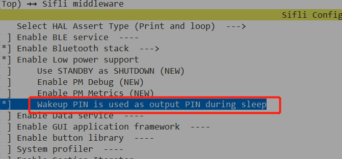<br> 
4、修改sdk1.1.3前原有的bug，后续sdk会更新<br>
<br>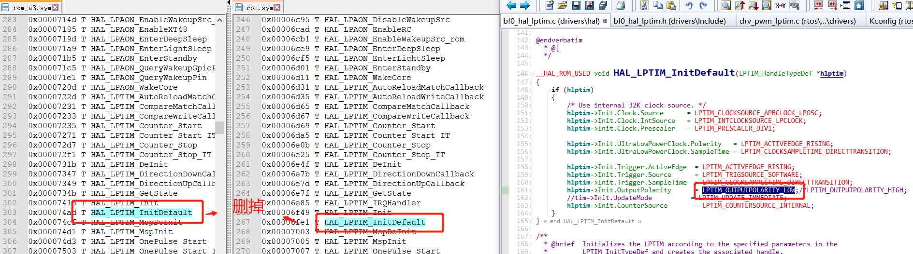<br>  
<br>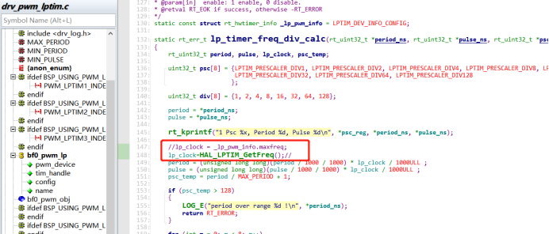<br>
 
5、参考代码如下：使用PB44作为pwm输出<br>
<br>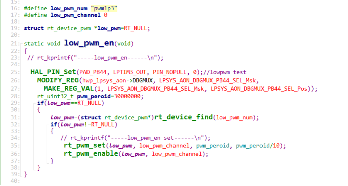<br>      
6、使用注意事项：<br>
由于使能睡眠情况下PB44也输出波形，所以PB其它的唤醒脚，硬件上面需要接固定上下拉，要不然会漏电。<br>

## 9.4 55X系列，56X系列，52X系统 PWM差异
1，55X系列，只能输出PWM的IO口固定，参考## 9.2，而56X,52X系列，任一带有PXXX_TIM功能的都能输出PWM
 <br>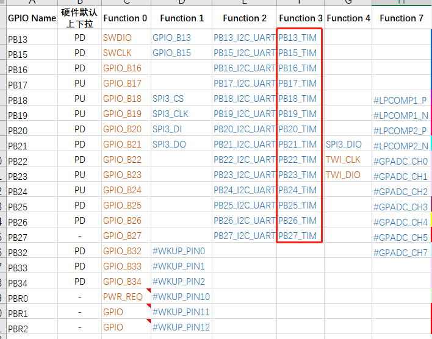<br>
2，56X,55X,52X系列如果采用Hcpu输出PWM，并且打开了#define BSP_PM_FREQ_SCALING 1 的Hcpu主频降频功能，Hcpu进入idle线程后，主频会变低，相对应Hcpu的PA口的PWM频率也会变化,<br>
解决方案：<br>
55X,56X系列，改用PB口，或者牺牲亮屏功耗关闭`BSP_PM_FREQ_SCALING`主频降频功能，<br>
52X系列，可以采用GPTIM2输出PWM，因为专门做了处理，GPTIM2的PWM不受系统频率变化的影响,<br>

3，56X,52X系列，能输出PWM的IO口，都可以配置任一个TIM和channel，<br>
参考pwm_config.h中，对pwm对应的cpu支持的定时器TIM和channel，比如：<br>
```c
HAL_PIN_Set(PAD_PA31, GPTIM1_CH3, PIN_NOPULL, 1);
HAL_PIN_Set(PAD_PA31, GPTIM1_CH1, PIN_NOPULL, 1); 
```
## 9.5 同一个PWM的不同channel接到不同器件的注意事项
1，52x的PWM的不同channel可以接到不同器件的，典型应用包括背光和马达；<br>
对于同一个PWM的不同channel，只能配置成同样的周期，但可以配置成不同的占空比；<br>
下图是，背光和马达都配置1kHz时，各自通道输出的波形如下：
<br>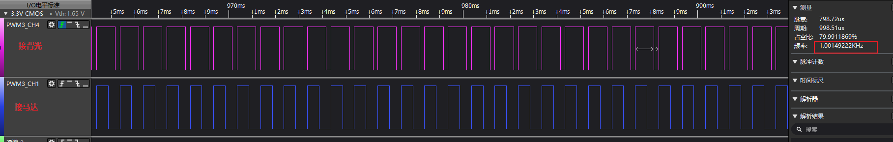<br> 
2，当背光和马达必须要配置成不同周期时，背光在亮屏的时候是一直使用的，无法做到和马达分时复用。所以，需要背光和马达配置到不同的PWM。<br>
HDK52X只有PWM3不受自动降频影响，所以一般背光使用PWM3,马达只能选择使用PWM2;<br>
由于PWM2 会随自动降频改变输出波形的周期，所以最好，在马达使用期间考虑不降频。<br>
参考实现如下：<br>
<br>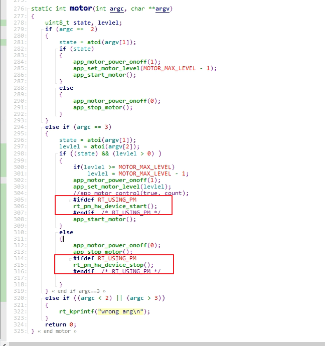<br> 
