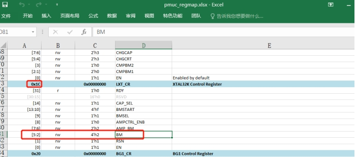
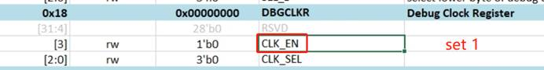
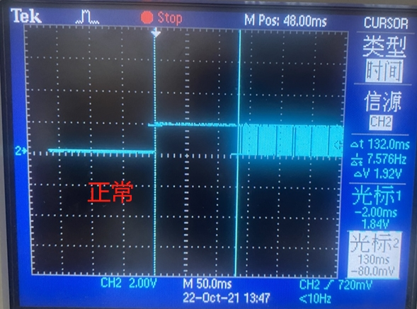
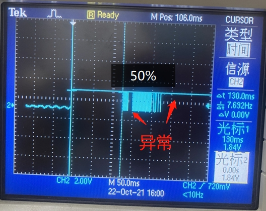
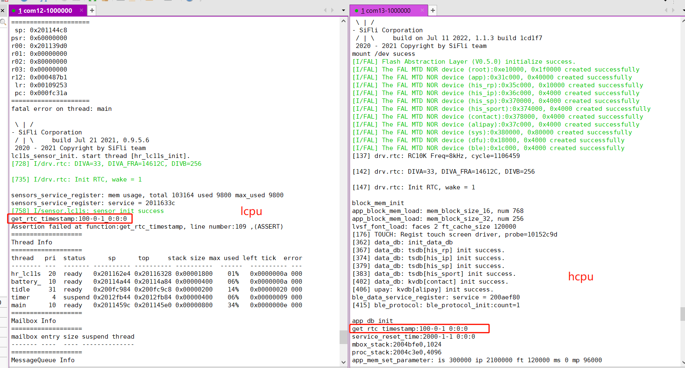
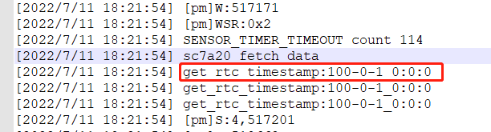
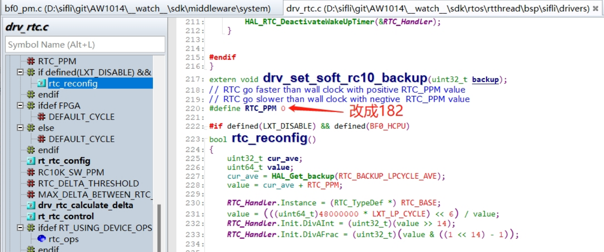

# 5 RTC相关
## 5.1 RTC时钟启动不起来
现象: <br>
一客户5块板子4块RTC不跑，2层板，换了我们evb上晶体，晶体偶尔能跑起来，也跑的慢，然后就不跑了，  
做的实验:<br>
1，mem32 0x4007a01c 1 寄存器中BM偏置电流默认是2，在jlink界面，重新写BM值为2，RTC可以跑起来;<br>
2，在代码HAL_PMU_EnableXTAL32中， BM偏置电流从默认0x2改成0x03由PMU寄存器增加晶体驱动电流， RTC慢慢能跑起来， 改到0x6， 10秒后可以跑起来， 改成0x9， 4秒后可以跑起来， 改成0xa后， 可以马上跑起来， 但出现了， 中间存在2秒重复;<br>
3，改成0xb后，测试RTC完全正常，;<br>
<br><br> 
由于寄存器0x4007a01c中BM从2提升到3， 会增加80nA电流， 如果直接提高到0xb会增加9倍的电流，
由于设置少于0xb， RTC又启动时间过长;<br>
今天又做了些实验， 定位了根本原因;<br>
a， 首先， 配置为把PB01输出32768时钟用于查看时钟，<br>
Jlink连接后<br>
```
a)，命令输入: w4 0x40043004 0x2f9 把PB01切换到function 9，
b)，命令输入: w4 0x4004F018 0x8 把LSYSCFG其中的DBGCLKR bit3 CLK_EN置1，
```
<br><br>  
可以用mem32 0x40043004 1 命令读回确认是否写进去，
如果代码中添加配置，可以在pinmux.c中修改PB01模式为9 DBG_CLK，<br>
```c
HAL_PIN_Set(PAD_PB01, DBG_CLK, PIN_NOPULL, 0);
_WWORD(0x4004F018, 0x8);   // PB01 output 32768 clk
```
b，查看正常板子和不正常板子的32768波形如下:<br>
<br><br>  
<br><br>  

b，对调正常与非正常板子32768晶体， 问题跟着主板走，跟晶体无关;<br>
c， 给Vbuck1供电1.25V， 测试RTC时钟正常;<br>
d， 因此怀疑Vbuck1供电存在问题， 更换DCDC 4.7uH电感，没改善， Vbuck DCDC 的4.7uF电容并了一个10uF电容后，rtc问题解决；<br>
根本原因: <br>
大板上DCDC电感和电容CPU太远， 电容滤波电容0402封装， 感觉容量也不足，
之前支持， 碰到过很多DCDC电感Isat电流不够， 导致的不良现象，
因此希望硬件工程师， 能够多留意DCDC电感，和滤波电容选型和布局走线.<br>

## 5.2 55X系列MCU的RTC时钟从PB口输出32768方法
例如：通过PB01输出32768时钟，具体方法:<br>
Jlink连接后<br>
```
A，命令输入: w4 0x40043004 0x2f9 把PB01切换到function 9，
B，命令输入: w4 0x4004F018 0x8 把LSYSCFG其中的DBGCLKR bit3 CLK_EN置1，
```
<br><br>  
可以用`mem32 0x40043004 1 `命令读回确认是否写进去，<br>
如果代码中添加配置，可以在pinmux.c中修改PB01模式为9 DBG_CLK，<br>
```c
HAL_PIN_Set(PAD_PB01, DBG_CLK, PIN_NOPULL, 0);
_WWORD(0x4004F018, 0x8);	// PB01 output 32768 clk
```

## 5.3 省32768晶体方案采用内部RC时钟方法
1，开启方法：<br>
Hcpu工程menuconfig中，勾选`(Top) → Board Config →  Lower crystal disabled`<br>
在rtconfig.h中生成下面的宏后，Hcpu会把配置写入寄存器中，Lcpu会通过函数HAL_LXT_DISABLED获取寄存器状态，，bootloader中，默认就是RC10k时钟，不需要修改；<br>
```
#define LXT_DISABLE 1
#define LXT_LP_CYCLE 200
```
此处200表示测量时长，单位是RC10K的周期，看200个RC10K周期里有多少个48M的周期，算出RC10K的实际频率;<br>
为了解决切换到RC时钟后，RTC走时不准的问题，方案是lcpu启动一个名字为“rc10或者rtc”的、15秒周期的定时器，hcpu起一个5分钟的定时器(52只有Hcpu一个15秒周期的定时器)，定时器起来后，基于48M的晶体的时钟进行校准，修正现在的RTC走时精度；<br>
2，修改为内部RC10K振荡器后，振荡频率从32768变成8000-10000，RC振荡会跟随温度变化，每块板子都有差异，因此时间戳的计算方法为：<br>
从601272/32.768 变成 601272/9 (ms)<br>
```
[160579] TOUCH: Power off done.
[pm]S:4,160586
[pm]W:601272
```
如上，sleep到wake之间的持续时间计算：<br>
```
(601272-160586)/9=48965(ms)
```
3，采用rc10k和外部32768晶体的对比优缺点如下：<br>
||rc10k|32768晶体|
| ----- | --------------- | ---- |
|精度|取决于48M晶体精度和校准算法|高|
|功耗|15秒周期唤醒开销约增加15uA|低|
|成本|低|高|
|IO输出32K|不能通过IO输出32768|能配置输出32768给wifi/gps等外设用|
## 5.4 RTC获取的时间戳是100年00月01日 0时0分0秒原因
1，第一种情况，整机复位或者Lcpu复位，在还没有往RTC写入时钟前<br>
如下图：<br>
<br><br>  
2，第二种情况，CPU从Standby醒来后, 马上读取RTC,延时不够1/256秒（约4ms）。
<br><br>  
由于Hcpu从standby醒来会超过4ms，醒来后可以直接读取RTC，<br>
Lcpu从standby醒来，马上读取RTC这会出现此现象，因此Lcpu从standby醒来不建议频繁读取RTC，如果需要频繁读取，可以采用我们提供的软时间方式，替代之前的直接读取RTC。<br>
```c
#ifdef SOC_BF0_LCPU	
	timestamp = service_lcpu_get_current_time();
#else
   	timestamp = time(RT_NULL);
#endif
```
而通过一个定时器30s，`service_lcpu_soft_timestamp_reset()`函数，来定时同步RTC和软RTC的时间。<br>

## 5.5 如何设置RTC默认时间（solution）
初始时间在在app_comm.c中的app_set_default_system_time中设置，按需修改对应的宏定义即可：<br>
```c
int app_set_default_system_time(void)
{
    if (PM_COLD_BOOT == SystemPowerOnModeGet())
    {
        setting_time_t default_time = {0};
        default_time.year = SIFLI_DEFAULT_YEAR;
        default_time.month = SIFLI_DEFAULT_MON;
        default_time.day = SIFLI_DEFAULT_DAY;
        default_time.hour = SIFLI_DEFAULT_HOUR;
        default_time.min = SIFLI_DEFAULT_MIN;
        default_time.second = SIFLI_DEFAULT_SECOND;
        default_time.zone = SIFLI_DEFAULT_TIMEZONE;
        app_update_system_time(&default_time);
    }
    return 0;
}
```


## 5.76 省32768晶体方案（内部RC10K时钟）走时不准调整方法
1，确保48Mhz的已校准，保证48M晶体的精度；<br>
2，可以调整校准的补偿，方法如下：<br>
```c
#define RTC_PPM 75 //可以为负数
```
<br><br> 
 计算算法：<br>
比如一客户反馈RTC 32小时慢了21S，由于是慢了，要跑快多少时钟就是增加 RTC_PPM， RTC_PPM就是每1M多跑多少个时钟<br>
计算公式如下：<br>
```
21 / (32 *60*60)  *1000000=182
```
32小时差不多是32*60*60 = 115200 秒， 慢了21秒，那就是1M秒慢了21/115200 * 1000000=182秒<br>
按照上面方法，计算补偿182后，测试40小时慢2s，达到客户要求。<br>
