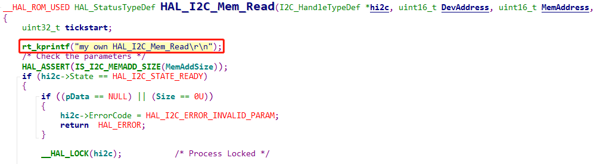
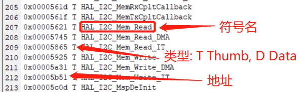
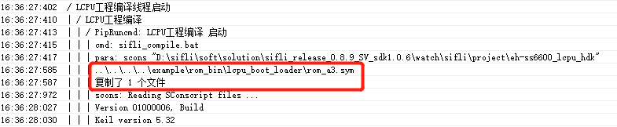
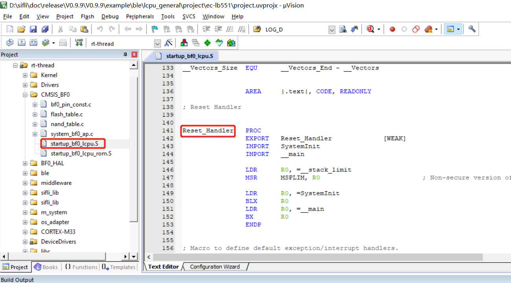
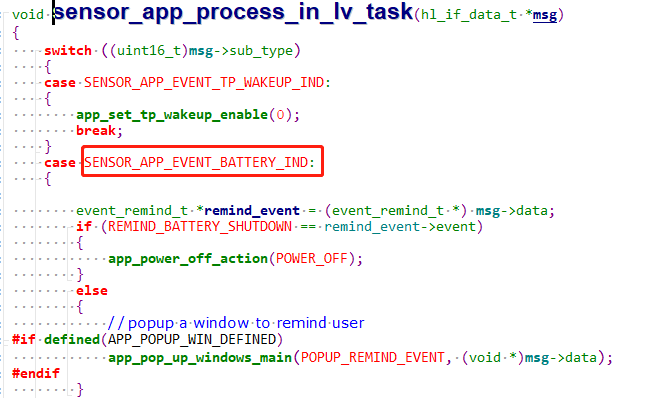
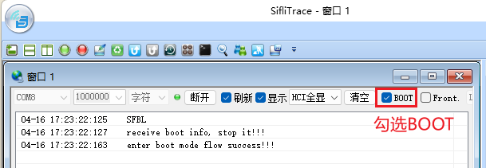
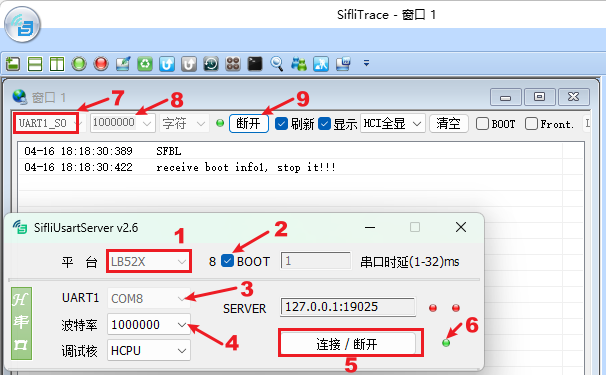

# 10 系统
## 10.1 Lcpu中ROM空间中固化的函数和变量该如何调用和替换?
  为了节省Lcpu RAM空间的代码，ROM中固化了BLE协议栈，RTT OS，完整的HAL代码和部分驱动代码，<br> 
Lcpu中，可以供客户调用的函数和变量，都通过symble file的方式放在:<br> 
`SDK\example\ble\lcpu_general\project\ec-lb551\rom.sym `文件中，并且声明为不带__weak参数的强函数.<br> 

因此编写代码时，在能调用ROM代码的情况， 都会尽量调用ROM中代码.
比如:<br> 
你在SDK中看到文件bf0_hal_i2c.c中函数HAL_I2C_Mem_Read，会参加编译，但是在链接时，该处定义成了弱函数:<br> 
```c
#define __HAL_ROM_USED __weak 
``` 
<br><br>  
而在对应的example\ble\lcpu_general\project\ec-lb551\rom.sym 文件中，如下图:<br> 
<br><br>  

也有同名函数，并且不是__weak弱函数， 因此会链接到ROM的强函数代码去，因此上面的rt_kprintf并不会打印出来.<br> 
如果想跑该HAL_I2C_Mem_Read的函数，替换掉ROM中的函数，先删除example\ble\lcpu_general\project\ec-lb551\rom.sym # 该路径项目不同会不一样，可以查看编译过程log来定位，如下图：<br> 
<br><br>   
再命令scons -c清掉lcpu编译结果重新编译，文件中对应的0x00005621 T HAL_I2C_Mem_Read 这一行，编译链接时，由于只存在这一个HAL_I2C_Mem_Read弱函数， 就会链接这个 __weak函数<br> 
这时上图中，你添加的rt_kprintf("my own HAL_I2C_Mem_Read\r\n");打印， 就能打印出来.<br> 
确认用的是ROM内函数还是代码中函数，可以在Lcpu编译出来的map文件内搜索这个函数对应地址来确认。<br> 

## 10.2 获取当前重启方式接口
目前SF32LB55X芯片，可以辨别的启动状态如下:<br> 
```
/** power on mode */
typedef enum
{
    PM_COLD_BOOT = 0，  /**< cold boot */
    PM_STANDBY_BOOT,   /**< boot from standby power mode */
    PM_HIBERNATE_BOOT, /**< boot from hibernate mode, system can be woken up by RTC and PIN precisely */
    PM_SHUTDOWN_BOOT,   /**< boot from shutdown mode, system can be woken by RTC and PIN, but wakeup time is not accurate */
} pm_power_on_mode_t;
```
可以通过调用:<br> 
```c
pm_power_on_mode_t SystemPowerOnModeGet(void)
{
    return g_pwron_mode;
}
```
来获取启动的模式;<br> 
注意:  上电， wdt，按键reset和HAL_PMU_Reboot四种cold root是没法区分;<br> 
## 10.3 main函数是lcpu的入口函数吗
lcpu复位地址在<br> 
<br><br>   
main函数， 是做完了初始化后， 起的其中一个线程的main函数;<br> 

## 10.4 Lcpu如何唤醒Hcpu
a，Lcpu可以通过 ipc_send_msg_from_sensor_to_app往hcpu发消息如下，此消息能唤醒Hcpu<br> 
```c
static void battery_send_event_to_app(event_type_t type)
{
    event_remind_t remind_ind;

    rt_kprintf("battery_send_event_to_app: event %d\n", type);
    remind_ind.event = type;
    ipc_send_msg_from_sensor_to_app(SENSOR_APP_EVENT_BATTERY_IND, sizeof(event_remind_t), &remind_ind);
}
```
b，Hcpu端醒来后，在task中，添加处理该消息的代码，如下：
<br><br>  

## 10.5 MCU进入Boot_Mode的方法

SiFli系列MCU内部ROM已经固化了一个boot代码，MCU在不用烧录任何代码的情况下，上电就会进入boot代码，boot代码已经带了常见的flash存储驱动，通过读取外部存储固定地址Flashtable的配置来决定代码如何跳转，boot代码在读取的flashtable不对的情况下，也会一直在boot_mode代码内，可以通过PC指针的地址，对照芯片手册的`HPSYS地址映射`，来判断是否在boot_mode代码区间，boot代码所在的ROM区间地址通常如下：<br>
Memory|Address space|Starting Address|Ending Address
:--|:--|:--|:--
ROM|64KB|0x0000_0000|0x0000_FFFF

进入boot_mode的用处:<br>
1，硬件调试，可以在不烧录任何程序的情况下，判断MCU是否运行正常；<br>
2，在用户程序死机或其他情形导致Jlink或者Uart不通的情况下，进入boot_mdoe模式确保正常下载程序；<br>

### 10.5.1 55/58/56系列MCU进入Boot Mode方法
<br><br>   
55，58，56系列MCU都有BOOT_MODE脚，BOOT_MODE拉高并且复位或上电，则会进入boot_mode，在Lcpu的默认debug串口会出现下面的log，此串口也是默认uart下载口
```
   Serial:c2,Chip:2,Package:0,Rev:0
    \ | /
   - SiFli Corporation
    / | \     build on Mar 20 2022, 1.2.0 build dbebac
    2020 - 2022 Copyright by SiFli team
   msh >
```
在boot_mode下，进行uart下载前，可以输入help命令验证串口是否通的，如下操作：
```
   Serial:c2,Chip:2,Package:0,Rev:0
    \ | /
   - SiFli Corporation
    / | \     build on Mar 20 2022, 1.2.0 build dbebac
    2020 - 2022 Copyright by SiFli team
   msh >
TX:help
   help
   RT-Thread shell commands:
   list_mem 
   uart 
   spi_flash 
   reboot 
   regop 
   dump_config 
   dfu_recv 
   reset 
   lcpu 
   sysinfo 
   version 
   console 
   help 
   time 
   free 
   msh >
```  
<br>**注意**<br> 
BOOT_MODE拉高后的boot_mode的log输出，是来自内部固化ROM代码不依赖外部代码，如果没有此log，请查串口连接和MCU工作条件是否已经满足<br> 
### 10.5.2 52系列MCU进入Boot Mode方法
<br><br> 
如上图，需要用到工具`SiFli-SDK\tools\SifliTrace\SifliTrace.exe`串口连接并勾选上BOOT选项，然后重启机器，在52固化的boot代码中会等待2秒， 勾选BOOT选项后工具SifliTrace会发命令让52进入boot_mode，如果只看到`SFBL`的log没有看到后面的2条log，可能是PC的TX到MCU的RX这路uart不通；<br>
```
SFBL
receive boot info, stop it!!!
enter boot mode flow success!!!
```
也可以采用工具`SiFli-SDK\tools\SifliUsartServer.exe`和SifliTrace.exe一起使用，如下图：
<br><br> 

<br>**注意**<br>
`SFBL`这条log，不依赖于软件，如果没有此log，请查串口连接和MCU工作条件是否已经满足<br>

## 10.6 52 PA34长按复位时间修改
58，56，52系列MCU都支持长按电源按键 (PWRKEY) 复位；如果芯片的电源按键 PB54（58系列）， PB32 （56系列），PA34（52系列）持续高电平超过10秒，会发生PWRKEY复位，将除RTC与IWDT以外的所有模块复位。通过PMUC寄存器WSR的`PWRKEY`标志可以查询是否发生过PWRKEY复位，通过PMUC寄存器WCR的`PWRKEY`可以清除该标志。<br> 
其中52系列可以修改长按按复位时间（58，56无此寄存器，不支持修改），`PWRKEY_HARD_RESET_TIME`默认参数10为10秒，可按照需要进行修改，内部采用RC32计数，并不依赖外部32768晶体时钟，另外按键的极性不能修改；
```c
#ifndef PWRKEY_HARD_RESET_TIME
    #define PWRKEY_HARD_RESET_TIME     (10)   /* unit:s */
#endif
```
对应代码配置在初始化函数HAL_PreInit内：
```c
hwp_pmuc->PWRKEY_CNT = PWRKEY_CNT_CLOCK_FREQ * PWRKEY_HARD_RESET_TIME ;  //set pwrkey hard reset time time*32768
```

