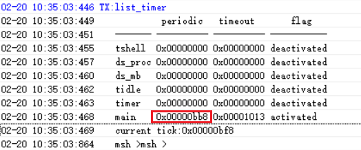

# 2 定时器相关
## 2.1 延时函数
1，HAL层延时函数：（等同于while中指令循环，延时时不会切到其他线程）<br> 
```c
HAL_Delay(10); /* 延时10ms */
HAL_Delay_us(10); /* 延时10us */
```
2，RTT接口的延时函数：<br> 
RTT接口的延时函数执行时，会切换到其他线程，比如ilde线程，当睡眠门限低于延时时长时会进入Standby睡眠<br>
```c
rt_thread_delay(100); /* 延时100ms */
```
## 2.2 获取时间戳 Tick值和RC10K振荡频率
1，获取时间戳：<br> 
```c
/* 32768晶体时钟，会1/32768秒，寄存器值加1*/
/* RC10K时钟，会约1/9000秒，寄存器值加1*/
uint32_t start_time = HAL_GTIMER_READ(); 
```
2，获取1m秒递增的Tick值：<br> 
```c
rt_tick_t start_timer = rt_tick_get(); /* RTT系统函数，1m秒返回值会加1 */
uint32_t tickstart = HAL_GetTick();  /* HAL层的函数，1m秒返回值会加1 */
```
3，获取当下时钟频率：<br> 
```c
/* 32768晶体时钟，会返回32768*/
/* RC10K时钟，会返回8k-10k之间的值*/
uint32_t mcuOscData = HAL_LPTIM_GetFreq(); 
```
## 2.3 串口查看现有定时器命令
```c
list_timer
```
 <br><br> 
list_timer的状态说明:<br> 
第一列"timer"为定时器名字;<br> 
第二列"periodic"为定时器周期(十六进制，单位ms);<br> 
第三列"timeout"为下一次定时器到来的时间戳;<br> 
第四列"flag"为该定时器是否为激活状态，<br> 
如上图，生效的定时器只有"main"的定时器（延时函数也是一个定时器），唤醒周期为0xbb8（3000ms）。<br> 
