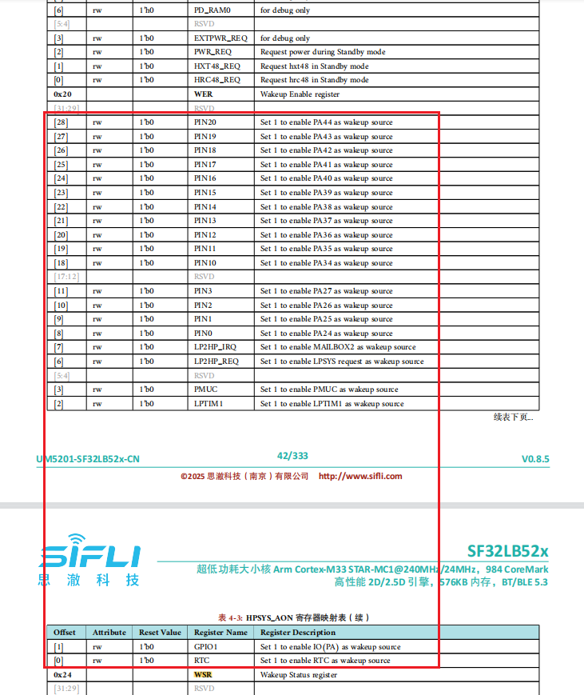

# 13 UART相关
## 13.1 UART的RX唤醒MCU怎么做
以下是MCU处于睡眠模式时的唤醒源：
<br><br>  

如果您要从Deep/Standby睡眠模式中唤醒，可以看到并没有uart唤醒的功能，因此需要把UART的RX配置为GPIO模式，然后启用此IO的唤醒功能，请参阅例程`\example\rt_device\pm\project\hcpu`，如下所示：<br>

```c
HAL_PIN_Set(PAD_PA26, USART2_TXD, PIN_PULLUP, 1); //uart2 default setting
HAL_PIN_Set(PAD_PA27, USART2_RXD, PIN_PULLUP, 1); //uart2 default setting 

static void gpio_wakeup_handler(void *args)
{
    rt_kprintf("gpio_wakeup_handler!\n");
    HAL_PIN_Set(PAD_PA27, USART2_RXD, PIN_PULLUP, 1); //switch to uart function
    rt_pm_request(PM_SLEEP_MODE_IDLE); //set MCU not to sleep
}
#if defined(SF32LB52X)
{
    HAL_PIN_Set(PAD_PA27, GPIO_A27, PIN_PULLUP, 1); //set PA27 to GPIO funtion

    HAL_HPAON_EnableWakeupSrc(HPAON_WAKEUP_SRC_PIN3, AON_PIN_MODE_POS_EDGE); //Enable #WKUP_PIN3 (PA27)

    rt_pin_mode(27, PIN_MODE_INPUT);

    rt_pin_attach_irq(27, PIN_IRQ_MODE_RISING, (void *) gpio_wakeup_handler,\
                (void *)(rt_uint32_t) 27); //PA34 GPIO interrupt
    rt_pin_irq_enable(27, 1);
}
#endif
```
建议使用独立的GPIO来唤醒MCU（大多数客户都是这样），如果你想让wakepin和uart rx2共享相同的GPIO，你需要像上面这样做更多的软件工作。等待唤醒完成（看到打印[pm]W:）后，才能接收UART数据，并保持mcu唤醒，直到rx工作完成。<br>

## 13.2 UART1不进入RX中断回调函数问题
根本原因：<br>
1，UART FIFO只有一个字节，系统如果忙的话，一个byte长度大约10bit, 115200需要大约1us, 收到中断1us之内不清空FIFO, 就会overflow;<br>
2，USART1_IRQHandler中断能进来，但是因为有错误，所以没有上层回调，上层回调只是在正常收到数据才会有。由于Uart1用于控制音频蓝牙，改成Segger打印，系统轮询，有可能导致来不及清RX中断。<br>
解决方案：<br>
改成DMA RX中断。<br>
 rt_device_open(g_bt_uart, RT_DEVICE_FLAG_INT_RX);
改成
 rt_device_open(g_bt_uart, RT_DEVICE_FLAG_DMA_RX);
