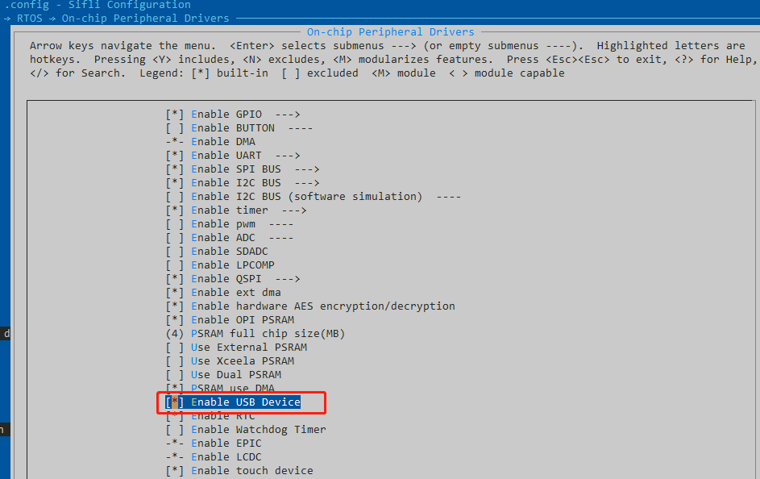
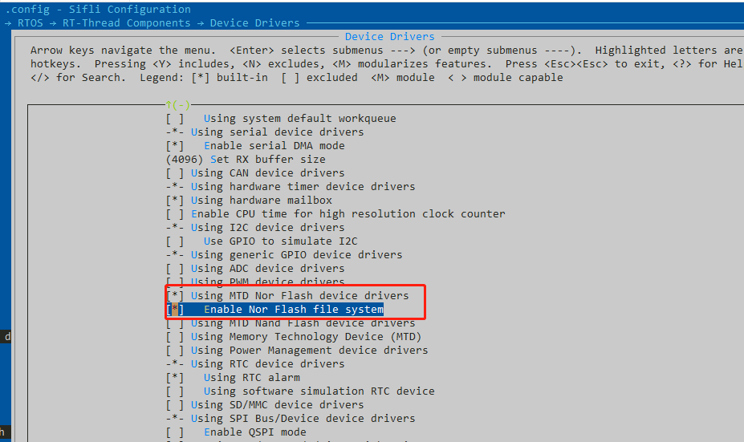
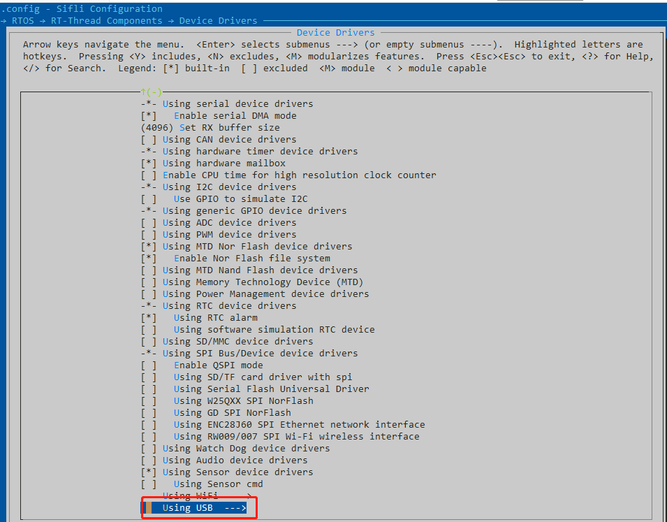
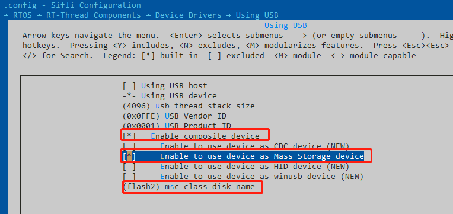

# 12 USB相关
## 12.1 USB做device存储
usb可以用做device存储功能，即设备插入PC之后，可以在PC上看到U盘显示，可以拷贝文件等。<br>
1，需要在工程下打开menuconfig，如下设置：<br>
打开usb device功能：<br>
<br><br>   
打开flash相关支持，使能flash文件系统：
<br><br>   
打开USB相关的具体配置：
<br><br>   
进行usb详细配置，选择Mass Storage device，并且由于flash1空间小，同时放入code代码，通常选择flash2作为U盘空间
<br><br>   
配置好相关定义之后，编译软件，下载之后，将设备通过usb插口连接pc，开机，需要在PC串口中输入指令：<br>
```
mkfs -t elm flash2    ---格式化
mountfs -t elm flash2 /  ---挂载
ls /dev      ---可以查看是否有usb的设备
mkdir abc    ---如果可以查看到usb设备，通过mkdir建立一个文件夹，可以在pc端看到U盘的图标，并且可以点击进入copy文件
```
PS：SDK支持device存储功能，需要进行相关配置，还需要客户根据自己的需求调试，有时需要重启之后重新挂载才可以看到U盘。
