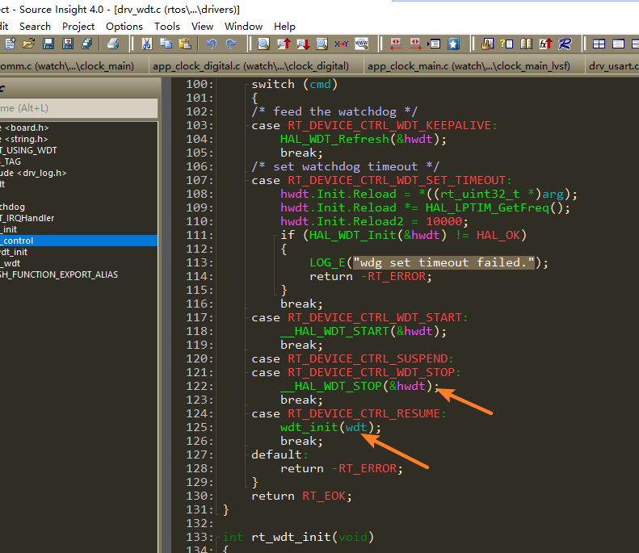

# 4 看门狗相关
## 4.1 看门狗WDT在Standby后的状态
<br><br>   
如上代码，目前的SDK是进入standby后，watchdog不会掉电，但代码中会停掉wdt，不管睡多长时间，watchdog都不生效发生reset。<br> 
从standby醒来会走resume那个case， 会重新初始化wdt， 相当于重新开始计数。<br> 

## 4.2 Jlink关闭看WDT的方法
1，场景1，如果Hcpu和Lcpu都开启了看门狗，机器出现反复重启，无法dump内存定位问题，可以jlink关闭看门狗, 
执行：<br> 
```
tools\segger\halt_all_cpu_and_disable_all_wdt_a0.bat
```
会关闭hcpu，lcpu的WDT，并且halt 两个cpu，便于dump内存。<br> 
2，场景2：如果只想关闭Hcpu的log，并且让Hcpu继续运行<br> 
修改：halt_all_cpu_and_disable_all_wdt_a0.bat对应的halt_all_cpu_and_disable_all_wdt_a0.jlink中命令内容，如下：<br> 
```
connect #连接jlink
w4 0x4004f000 0 #jlink切到Hcpu
connect #连接jlink
h #halt hcpu
w4  0x40014018  0x51ff8621
w4  0x4001400C  0x34
w4  0x40014018  0x58ab99fc
w4  0x4007c018  0x51ff8621
w4  0x4007c00C  0x34
w4  0x4007c018  0x58ab99fc
g #上面操作完WDT寄存器后，go，继续运行Hcpu
exit
```
3，场景3：如果只想关闭Lcpu的log，并且让Lcpu继续运行,截取halt_all_cpu_and_disable_all_wdt_a0.jlink中命令一部分并稍加修改即可。<br> 
```
connect
w4 0x4004f000 1
connect
w4 0x40070000 0 
h
w4  0x40055018  0x51ff8621
w4  0x4005500C  0x34
w4  0x40055018  0x58ab99fc
g
exit
```
## 4.3 清WDT位置在哪
1，rt_hw_watchdog_init初始化函数会通过rt_hw_watchdog_hook把rt_hw_watchdog_pet注册为一个钩子函数；<br> 
2，当系统无任务处理进入idle线程rt_thread_idle_entry后，里面就会执行上面注册在idle_hook_list中的钩子函数；<br> 
```c
__ROM_USED void rt_hw_watchdog_init(void)
{
    extern int rt_wdt_init(void);
    rt_wdt_init();
    wdt_dev = rt_device_find("wdt");
    if (wdt_dev)
    {
        rt_err_t err = rt_device_open(wdt_dev, RT_DEVICE_FLAG_RDWR);
        if (err == RT_EOK)
        {
            uint32_t count = WDT_TIMEOUT;
            rt_device_control(wdt_dev, RT_DEVICE_CTRL_WDT_SET_TIMEOUT, &count);
        }
    }
    rt_hw_watchdog_hook(1); //注册wdt钩子函数后，会在idle线程自动清狗
}

__ROM_USED void rt_hw_watchdog_pet(void) //手动清狗函数，可以调用此函数
{
    if (wdt_dev)
    {
        rt_device_control(wdt_dev, RT_DEVICE_CTRL_WDT_KEEPALIVE, NULL);
    }
}

```