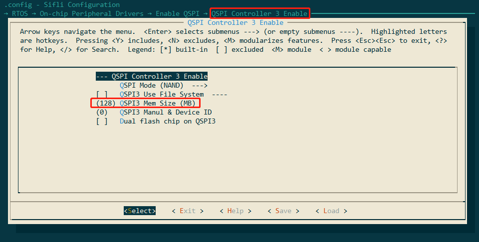
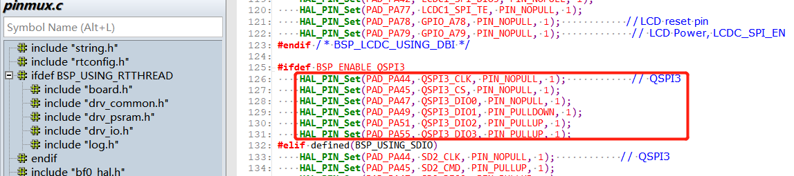
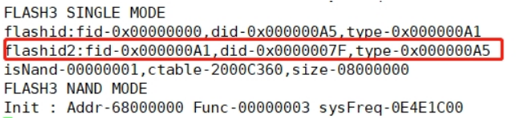
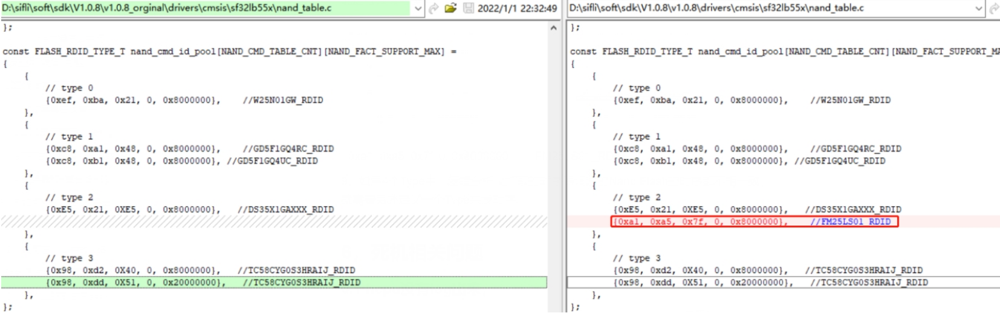
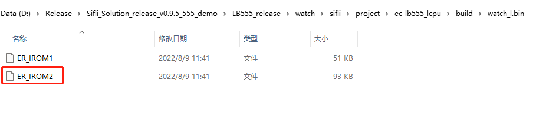

# 3 flash调试常见问题
## 3.1 SF32LB551的Flash3调试Nand Flash流程?
SF32LB551 Flash3连接在QSPI3，调试Nand flash注意点：<br> 
1，确保打开QSPI Controller 3 Enable，并设置好内存大小，
下图为128MB（1G bit/）
<br><br>  
2，由于QSPI3会占用PA49和PA51,因此hcpu的log必须得改成segger输出，具体方法参考 2.2.1 。<br> 
3, 查看QSPI3用到的PA44，PA45，PA47，PA49，PA51，PA55模式设置如下，确认其他地方没有使用这些Pin，确认方法，在Hcpu的shell平台分别用：pin status 44 命令查看各个pin状态是否设置正确。
<br><br>    
4，打开宏#define DRV_SPI_FLASH_TEST，支持spi_flas读写flash的测试shell命令。<br> 
5，用如下命令测试Flash读写是否正确。<br> 
具体命令参考函数int cmd_spi_flash(int argc, char *argv[])<br> 
```
spi_flash -id 0 2 /*显示flash3的ID，读操作发生在开机初始化，需要上电抓波形 */
spi_flash -read 0 2048 2 /*从flash3 十进制0的地址，读取2048个byte数据*/
spi_flash -read 4096 4096 2 /*从flash3 十进制4096的地址，读取4096个byte数据*/
spi_flash -write 4096 4096 0 2 /*从flash3 十进制地址4096，写4096个byte数据*/<
spi_flash -erase 0x20000 0x20000 2 /*从flash3 十六进制0x20000的地址，擦除0x20000个byte数据，注意只能按块擦除，地址和大小只能0x20000倍数 */<br> 
```
**注意：**<br> 
当今的NAND Flash读/写需要按照一个page，但是必须以block大小擦除，见下图：  
<br><br>      
每个page有2176个单元，所以每个page就是2048Byte + 128Byte（SA）。<br> 
每个Block有64个page组成，所以每个Block容量为2048x64=131,072（0x20000），即为131,072Byte + 8KByte （SA）<br> 
6，新的flash由于不在nand_cmd_id_pool列表中，采用spi_flash -id 0 2命令去读flash3的id，会返回0xff，<br> 
注意：如果逻辑分析仪抓读ID的时序，需要在上电的时候抓，读ID操作在上电的时候，<br> spi_flash -id 0 2命令只是打印出上电初始化时读到的ID。<br> 
7，把spi_flash -id 0 2命令读回的ID，读回值如下：<br> 
```
 msh >spi_flash -id 0 2
 spi_flash -id 0 2
 rt_flash_read_id_addr: 0x68000000,id:2,value:7fa5a1
 ```
新jlink的elf 驱动，uart3里面在下载0x68000000地址时，目前有添加打印ID的log，<br> 如下图：
<br><br>   
根据命令方式在nand_table.c中nand_cmd_id_pool列表中添加进对应的组别，如下图：
<br><br>   
{0xa1, 0xa5, 0x7f, 0, 0x8000000}, //FM25LS01_RDID<br> 
如果命令跟type2的命令一样，就能读写正常，通常修改nand_table.c文件<br> nand_cmd_id_pool和nand_cmd_table_list后，就能进行读擦写操作了。<br> 
8，如果4个Type中，逻辑分析仪抓取的时序跟调试的Nand Flash的几组type时序都不相一致，就需要另外定义一个Type来发时序。<br> 

## 3.2 SF32LB555 Lcpu挂载 Flash4流程
以A3芯片的\watch\sifli\project\ec-lb555_lcpu工程支持挂载flash4为例，参考如下附件差分包，相关修改差分都已经加上：<br> 
需要将\middleware\sifli_lib\lib下面的相关rom lib（A3芯片为sifli_rom_a3.lib，其他版本A0\A1\A2为sifli_rom.lib）文件里面flash相关函数拿掉，不要用rom里面的函数，采用代码中的函数，客户手中的rom lib文件可能版本不一，需要重点检查里面的FLASH相关函数。<br> 
修改\middleware\system下面的bf0_pm_a0.c文件<br> 
修改\rtos\rtthread\bsp\sifli\drivers下面的drv_spi_flash.c文件<br> 
修改\watch\sifli\project\ec-lb555_lcpu\linker_scripts下面的<br> link_lcpu_ram.sct分区文件，将一些算法放进flash4中<br> 
修改\watch\sifli\project\ec-lb555_lcpu的menuconfig，打开QSPI FLASH4支持<br> 
修改\watch\sifli\project\ec-lb555_lcpu下面的postbuild.bat文件，增加新的编译文件bin<br> 
修改\watch\sifli\project\ec-lb555_lcpu下面的SConstruct文件，增加新的编译文件bin<br> 
PS：编译的时候需要将ec-lb555_lcpu下的build手动删除掉，如果之前已经存在了bin<br> 文件，可能会出现编译不过的情况，编译成功之后请检查<br> \watch\sifli\project\ec-lb555_lcpu\build\watch_l.bin下是否增加了ER_IROM2文件：<br> 
<br><br>   

## 3.3 读Flash内SN,MAC接口
```c
rt_flash_config_read(FACTORY_CFG_ID_SN, (uint8_t *)mac, sizeof(mac));
rt_flash_config_read(FACTORY_CFG_ID_MAC, (uint8_t *)&mac[0], 6);
```
