# 1 LCD调试常见问题
## 1.1 LCD屏幕右侧绿条纹
如下图:<br>
<br>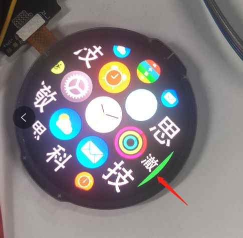<br> 
请按下图确认修改:<br>
<br>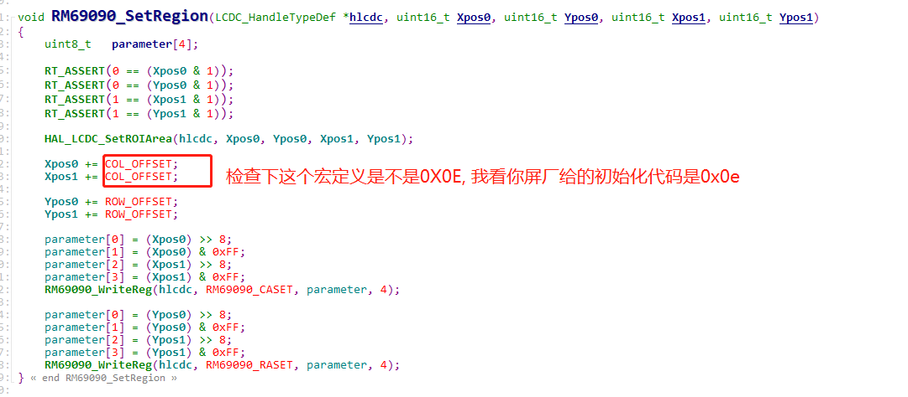<br> 

## 1.2 LCD显示花屏
debug方法，如下图:
<br>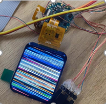<br>   
1， jlink连接后，敲h，让cpu停下来，<br>
2， cmd窗口到该目录执行\release\tools\crash_dump_analyser\script\save_ram_a0.bat保存内存信息<br>
3， dump出内存信息如下:<br>
<br>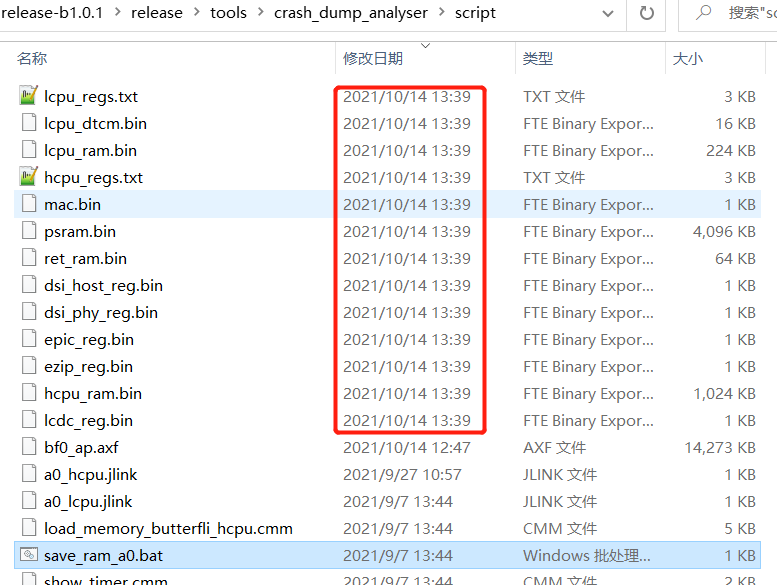<br> 
4， 运行release\tools\crash_dump_analyser\simarm\t32marm.exe工具， 恢复hcpu的现场，选择load_memory_butterfli_hcpu.cmm进行恢复操作，<br>
<br>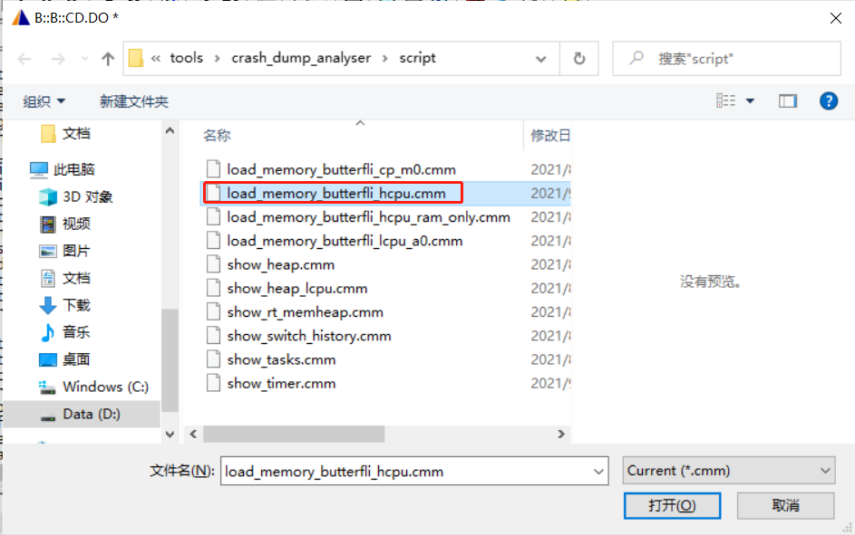<br>
然后再跳出，选择0x20000000地址bin时，选择hcpu_ram.bin<br>
<br>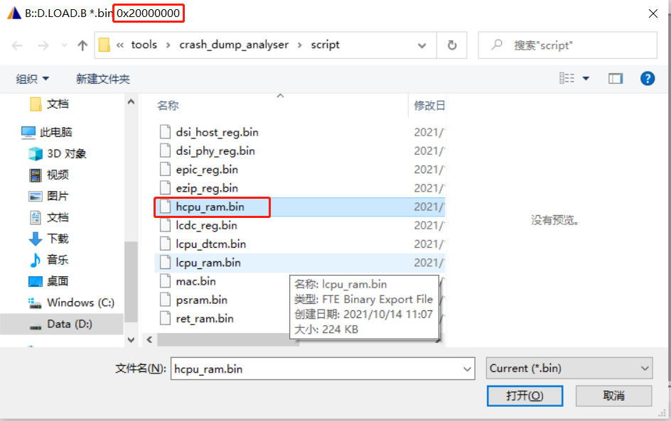<br> 
在跳出需要选择0x60000000地址的bin时， 选择psram.bin，如下图:<br>
<br>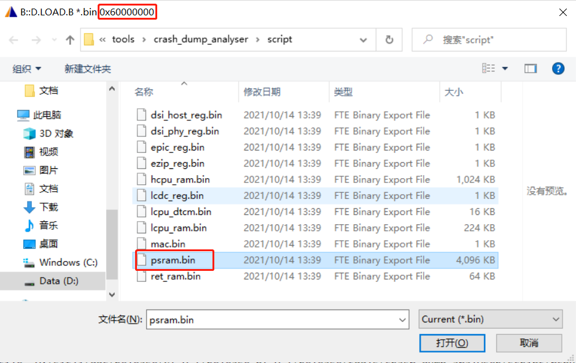<br> 
在跳出来需要选择*.axf文件时，选择你编译出来的hcpu的*.axf文件，<br>
Wachdemo工程对应的路径为: example\watch_demo\project\ec-lb551\build\bf0_ap.axf<br>
如下图:<br>
<br>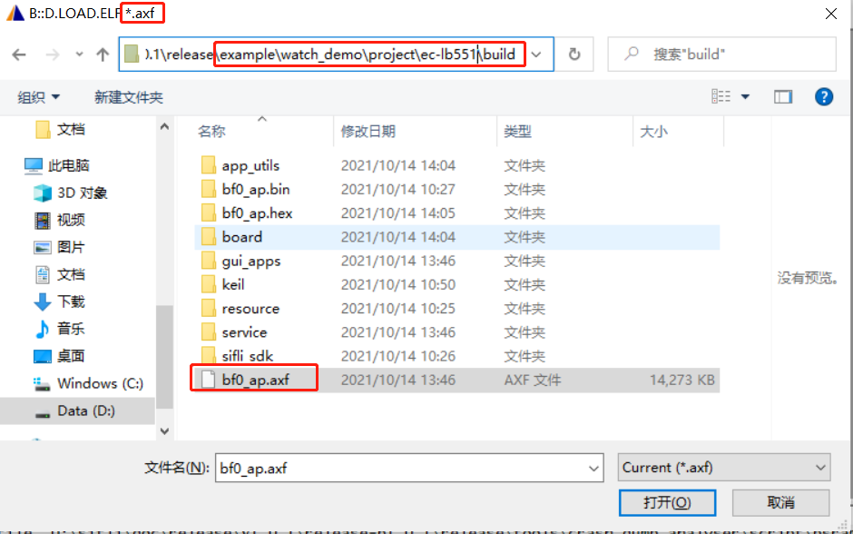<br> 
恢复现场后， 打开Var->watch窗口，输入要查找的drv_lcd变量，再添加到watch窗口查看，<br>
<br>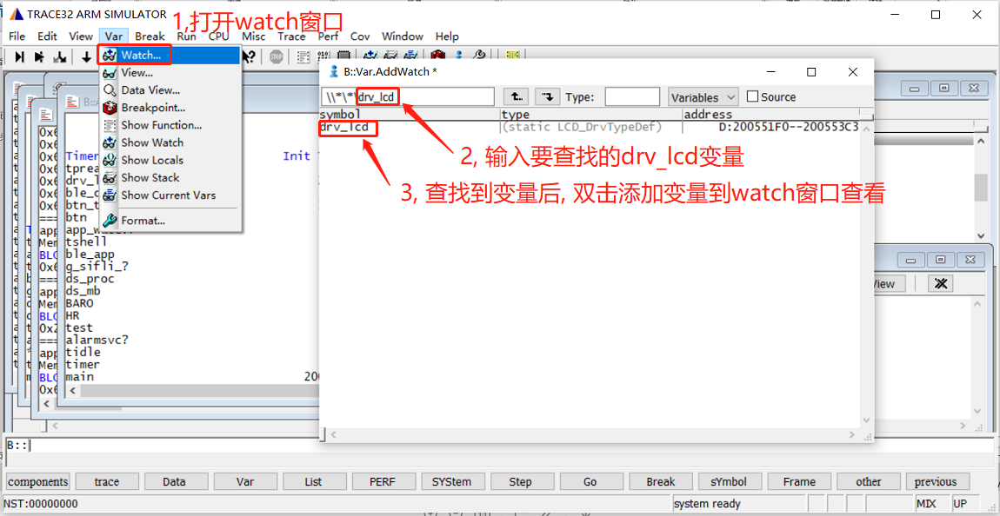<br> 
在watch窗口展开drv_lcd的变量，发现LCD设置的窗口尺寸大小与LCD驱动不符合，<br>
<br>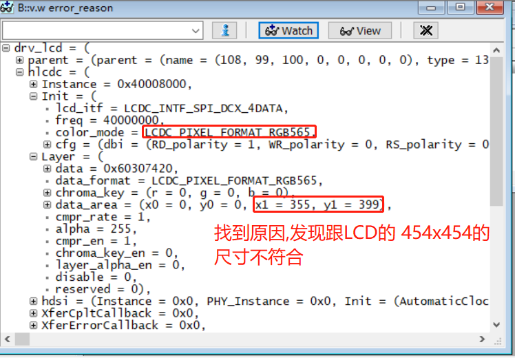<br> 
修改rtconfig.h文件中的，配置后，花屏问题解决.<br>
```c
#define LCD_HOR_RES_MAX 454
#define LCD_VER_RES_MAX 454
```
把对应littleVGL的屏设置寄存器几个宏也要改为和LCD尺寸一致<br>
```c
#define LV_HOR_RES_MAX 454
#define LV_VER_RES_MAX 454
#define LV_DPI 315
#define LV_FB_LINE_NUM 454
```

## 1.3 TFT屏开机或唤醒时第一帧花屏
花屏是开显示时，屏GRAM内数据不对，从开机显示逻辑来看，<br>
应该是先送好数， 再display_on芯片，再开背光，如果顺序错了，就会导致第一帧花屏， 也可以采用初始化完成后，送黑屏过去，如果屏驱IC支持写寄存器让输出黑屏，优先采用写屏寄存器方式，<br>
或者采用如下方法:<br>
参考代码中SPD2012驱动的做法，在打开屏幕之前，先通过LCDC的背景送黑屏的数据过去，清除屏幕内部的GRAM.<br>
<br>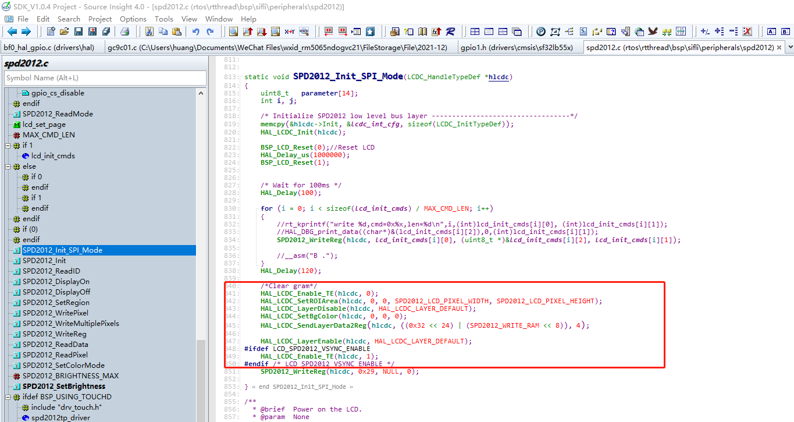<br> 

## 1.4 初始化读写都正常但不亮屏问题
每个屏IC，上电后到寄存器初始化之间延时会有不同，BSP_Power_Up函数中屏上电到LCD寄存器初始化init延时不够，会导致初始化时寄存器无法配置进去，导致LCD驱动不起来；<br>
解决方法：<br>
再LCD寄存器初始化init开始的时候，根据屏驱IC的要求添加一定延时。<br>
<br>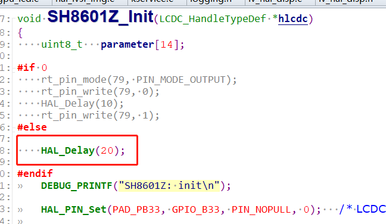<br>  
下面列出了屏初始化需要关注的3个延时长度，延时太大会导致屏点亮变慢，延时改小时一定要依据屏IC规格书<br>
```c
static void SPD2010_Init_SPI_Mode(LCDC_HandleTypeDef *hlcdc)
{
    uint8_t   parameter[14];
    int i, j;

    memcpy(&hlcdc->Init, &lcdc_int_cfg, sizeof(LCDC_InitTypeDef));
    HAL_LCDC_Init(hlcdc);

    BSP_LCD_Reset(0);//Reset LCD
  	rt_thread_delay(1);  //依据屏驱IC规格书配置此延时
    BSP_LCD_Reset(1);

    /* Wait for 50ms */
    rt_thread_delay(50); //依据屏驱IC规格书配置此延时

    for (i = 0; i < sizeof(lcd_init_cmds) / MAX_CMD_LEN; i++)
    {
        SPD2010_WriteReg_I(hlcdc, lcd_init_cmds[i][0], (uint8_t *)&lcd_init_cmds[i][2], lcd_init_cmds[i][1]);
		HAL_Delay_us(10);
    }
	rt_thread_delay(50); //依据屏驱IC规格书配置此延时
	
  SPD2010_WriteReg(hlcdc, 0x29,(uint8_t *)NULL, 0);

}
```

## 1.5 如何从Framebuffer 导出来看图像是否正常?
a，从build目录*.map文件找到buf1_1全局变量的地址，如下图:<br>
或者Ozone下也能找到buf1_1全局变量的地址，<br>
<br>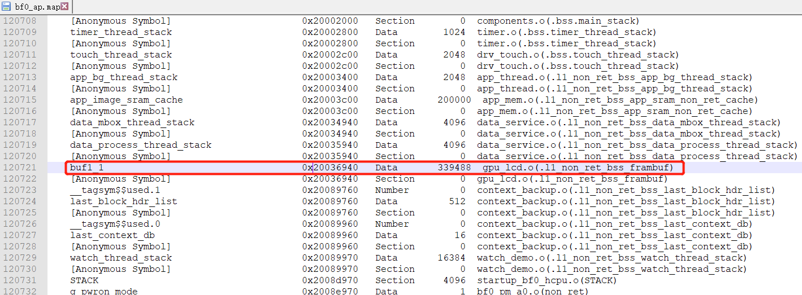<br> 
b， jlink保存内存值为bin文件，<br>
savebin <路径> <地址> <长度><br>
例如: savebin D:\sifli\customer\weizhang\lcd\1.bin 0x20036940 0x52e20<br>
该屏是rgb565格式，占2个byte， 412x412分辨率， 长度为412x412x2=339488=0x52E20<br>
c， 用tools\bin2bmp\bin2bmp.py 的python工具，把bin转换为bmp图片格式<br>
命令如下: <br>
旧命令：<br>
python bin2bmp.py <文件路径> <屏长> <屏宽> <每个像素占用bit> <bin的偏移地址><br>
例如: 屏412x412， 1.bin是从基址开始save，不需要偏移<br>
```
python bin2bmp.py 1.bin 412 412 16 0
```
新命令：<br>
python bin2bmp.py <文件路径> <颜色格式> <屏长> <屏宽>  <bin的偏移地址>
```
python bin2bmp.py 1.bin rgb565 412 412 0
```
支持的颜色格式: a8/rgb565/rgb888/argb8888/rgba8888<br>
d，新增了jlinkbin2bmp.py脚本，在jlink连接的情况下，从savebin到转换，一次性导出bmp图片，如下命令：<br>
```
 python jlinkbin2bmp.py SF32LB55X rgb565 412 412 2004E3E0
```
e，最新使用说明，请参考：tools\bin2bmp\readme.txt文件。<br>

## 1.6 LCD驱动中常见的Assert死机
 出现Assert：<br>
 ```
 Assertion failed at function:async_send_timeout_handler, line number:876 ,(0) 
```
<br>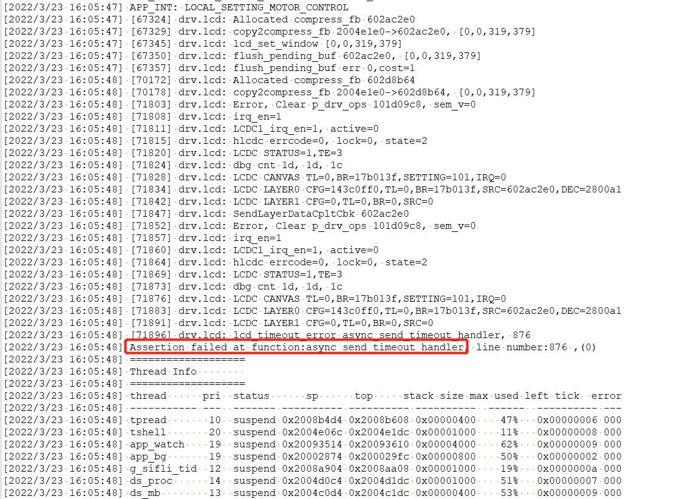<br> 
根本原因：<br>
开了宏 LCD_GC9B71_VSYNC_ENABLE 开启了TE功能，LCD送数后会等待TE信号再进行刷屏，一直没有等到LCD的TE信号到来，超时Assert。<br>
常见情形1：<br>
OTA过程出现该assert，因为马达的默认IO是PA44, 这个项目PA44是lcd的reset信号，进入dfu会启动马达，导致LCD被误reset，LCD不再有TE信号输出，然后dfu刷屏时死机。<br>
常见情形2：<br>
灭屏按键唤醒死机<br>
表现，就是灭屏后，按按键唤醒后，出现assert，死在刷屏等待TE的assert中。<br>
根本原因：<br>
初始化LCD屏后，在TP内初始化延时过长，存在100ms的延时。而客户采用的rt_thread_mdelay(100);延时函数，此时Hcpu进入IDLE进程，进入睡眠，<br>
定时器到了后，又从standby醒来，此时LCD掉过电，LCD没有初始化过，不会有TE信号，此时继续刷之前的刷屏，死机。<br>
解决方案：<br>
驱动中，不要用rt_thread_mdelay(10);延时函数，<br>
要改用：HAL_Delay(100); 或者 HAL_Delay_us(10); 函数，<br>
rt_thread_mdelay函数，会进行线程切换，切换到Idle进程后，就会睡眠，<br>
HAL_Delay函数，是死循环，不会切走到Idle进程。<br>

## 1.7 打静电ESD时LCD花屏和定屏问题
解决思路：通过屏驱IC的TE输出信号或者寄存器值来判断屏显示是否正常，不正常时重初始化LCD<br>
1. 如果LCD花屏或者定屏死机时，无TE信号输出，<br>
解决方案：<br>
drv_lcd.c文件中，在等待TE超时函数async_send_timeout_handler中：<br>
采用下面红框这块代码，就能重初始化LCD：<br>
```c
    drv_lcd.assert_timeout = 3; //配置刷屏超时情况下是assert、不做操作还是重初始化LCD
```
<br>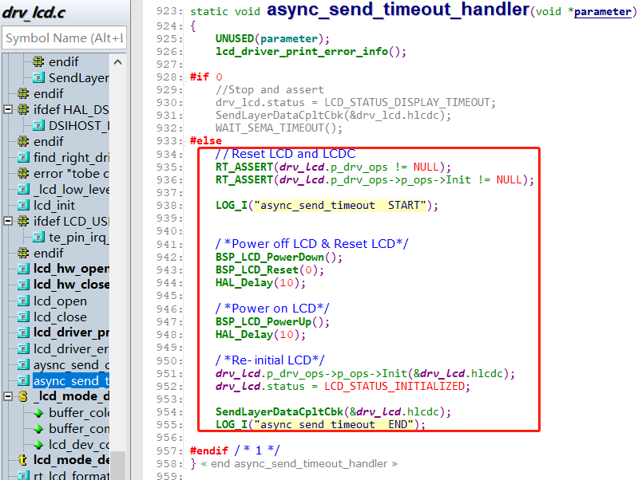<br> 
2. 如果是LCD花屏时，有TE信号输出，需要读取LCD寄存器值，才得知花屏状态。<br>
解决方案：<br>
- 按照上面的方案1，先打开刷屏timeout重初始化LCD代码。<br>
- 在LCD驱动的XXXX_WriteMultiplePixels送屏函数中，<br>
添加读取LCD寄存器值，如果发现寄存器不对，return出去，不进行刷屏，<br>
这时因为没有执行送屏操作，就会导致刷屏进入RT_ETIMEOUT中，依据配置`drv_lcd.assert_timeout`重初始化LCD，如下图：<br>
做了3次对LCD寄存器的判别，如果3次寄存器值都不对，认为LCD异常，return出去，触发刷屏timeout，重初始化LCD。<br>
<br>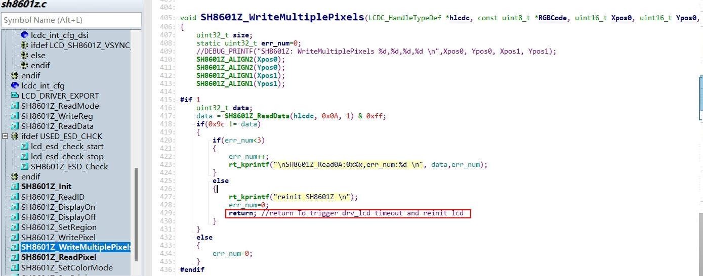<br>  
```c
void SH8601Z_WriteMultiplePixels(LCDC_HandleTypeDef *hlcdc, const uint8_t *RGBCode, uint16_t Xpos0, uint16_t Ypos0, uint16_t Xpos1, uint16_t Ypos1)
{
    uint32_t size;
	static uint32_t err_num=0;
	//DEBUG_PRINTF("SH8601Z: WriteMultiplePixels %d,%d,%d,%d \n",Xpos0, Ypos0, Xpos1, Ypos1);
    SH8601Z_ALIGN2(Xpos0);
    SH8601Z_ALIGN2(Ypos0);
    SH8601Z_ALIGN1(Xpos1);
    SH8601Z_ALIGN1(Ypos1);
    uint32_t data;
    data = SH8601Z_ReadData(hlcdc, 0x0A, 1) & 0xff;
	if(0x9c != data)
	{
		if(err_num<3)
		{
			err_num++;
			rt_kprintf("\nSH8601Z_Read0A:0x%x,err_num:%d \n", data,err_num);
		}
		else
		{
			rt_kprintf("reinit SH8601Z \n");
			err_num=0;
			return; //return To trigger drv_lcd timeout and reinit lcd
		}
	}
	else
	{
		err_num=0;
	}
    HAL_LCDC_LayerSetData(hlcdc, HAL_LCDC_LAYER_DEFAULT, (uint8_t *)RGBCode, Xpos0, Ypos0, Xpos1, Ypos1);
    HAL_LCDC_SendLayerData2Reg_IT(hlcdc, SH8601Z_WRITE_RAM, 1);
}
```

## 1.8 开关机动画或者充电图像显示扭曲问题
显示异常如下图：<br>
<br>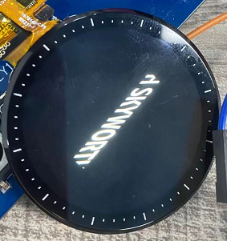<br>  
<br>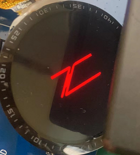<br>  
根本原因：<br>
像素对齐问题，需要送4的倍数的像素给屏，如下图一屏驱IC的datasheet，指明给屏送数，需要送像素为4的倍数：<br>
<br>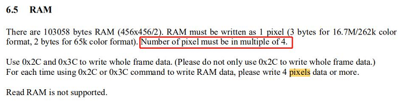<br>  
解决方案：<br>
1，修图：要保证开机动画，充电这种一幅图送往整屏的图像，要是偶数分辨率，如下图尺寸为161x80，修正为160x80后，图片扭曲问题解决。
<br><br>  
2，代码中，进行4倍像素对齐，比如如上图片为161x80，修改成164x80，另外3个像素填充背景色，<br>
或者丢掉一个像素为160x80。<br>

## 1.9 屏QSPI读不到屏ID的问题
目前55x,56x系列芯片，屏驱的QSPI只支持IO0读取QSPI/SPI数据，不支持读取IO1输出的SPI数据，屏ID从IO1输出，不支持（52x系列芯片可以支持配置IO0-IO3任一IO读取），如下图：
<br>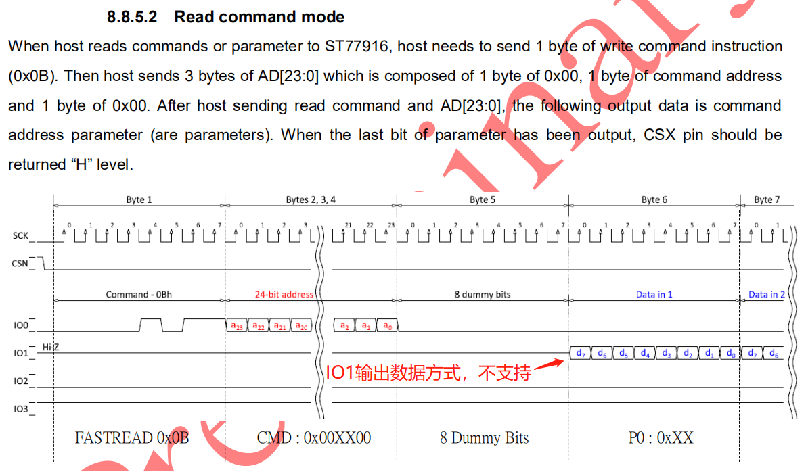<br>  
Interface-II方式输出，不支持，如下图：<br>
<br>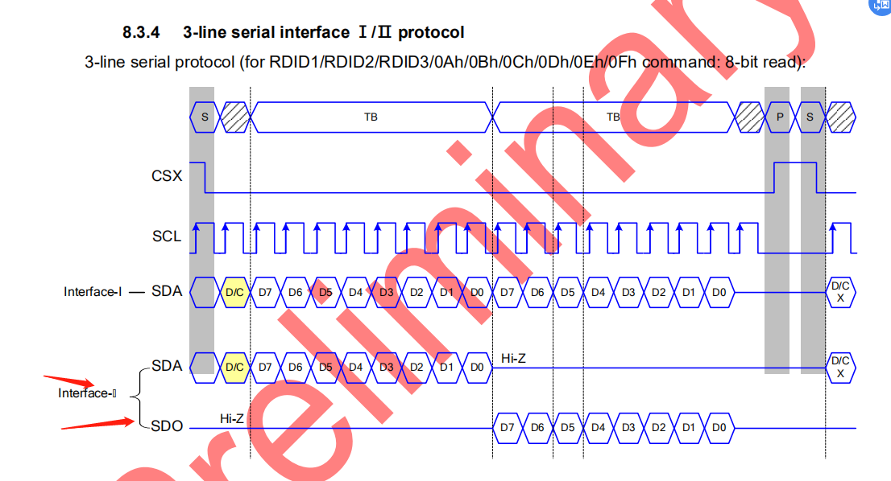<br>  
屏ID从IO0输出，支持，如下图：<br>
<br>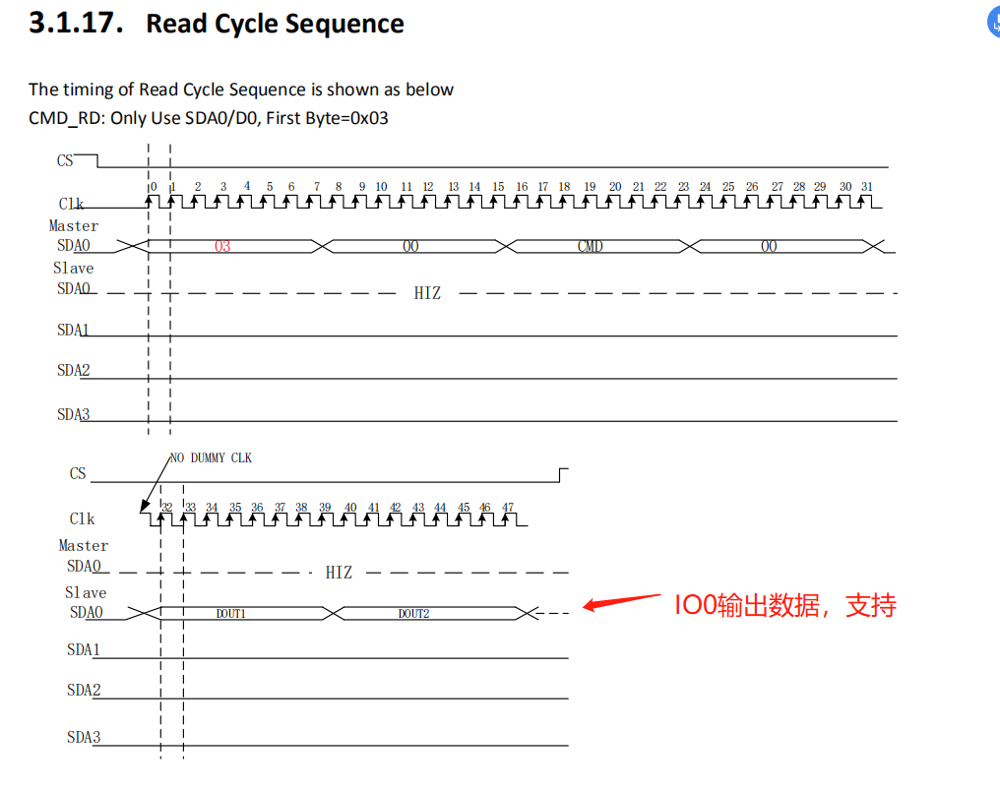<br>  
解决方案：<br>
GPIO模拟SPI读chipid<br>

**备注：**
目前52x系列芯片，已经支持屏驱的QSPI中IO0-IO3任一数据线，读写读取QSPI/SPI数据<br>
配置方法如下：<br>
```c
.readback_from_Dx= 0,  /* 0对应IO0,  1对应IO1,  2对应IO2,  3对应IO3,*/
```
<br>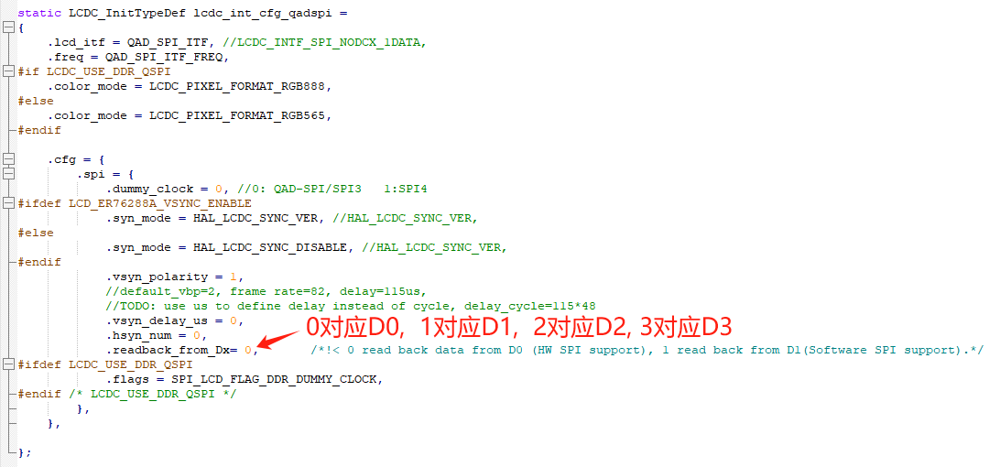<br> 

## 1.10 屏QSPI动态调整读写寄存器CLK速率
有些屏驱IC，在初始化的时候，对读写寄存器的CLK频率有上限要求，比如不能高于20Mhz, 送屏则可以到50Mhz，可以通过如下方式修改：<br>
默认送屏频率为.freq = 48000000, //48Mhz<br>
<br>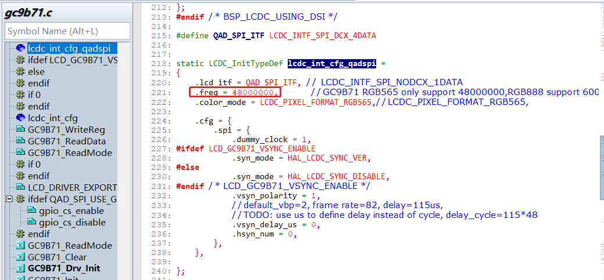<br> 
在读寄存器的时候，改成2Mhz，如下：<br>
<br>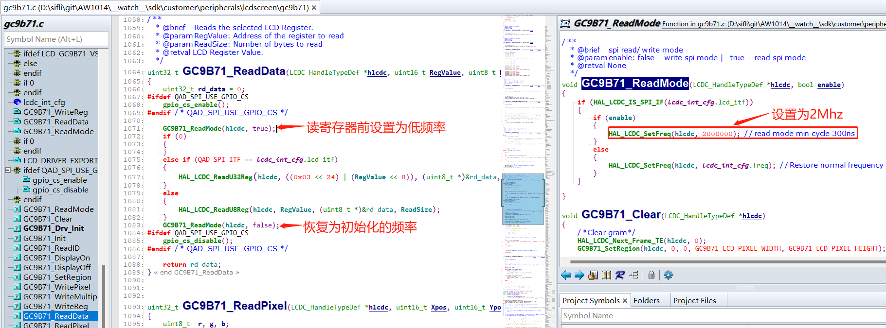<br> 
```c
void GC9B71_ReadMode(LCDC_HandleTypeDef *hlcdc, bool enable)
{
    if (HAL_LCDC_IS_SPI_IF(lcdc_int_cfg.lcd_itf)){
        if (enable){
            HAL_LCDC_SetFreq(hlcdc, 2000000); //read mode min cycle 300ns
        }
        else {
            HAL_LCDC_SetFreq(hlcdc, lcdc_int_cfg.freq); //Restore normal frequency
        }
    }
}
```
写寄存器GC9B71_WriteReg的时候，也可以采用如上的方法来调整clk速率。<br>
