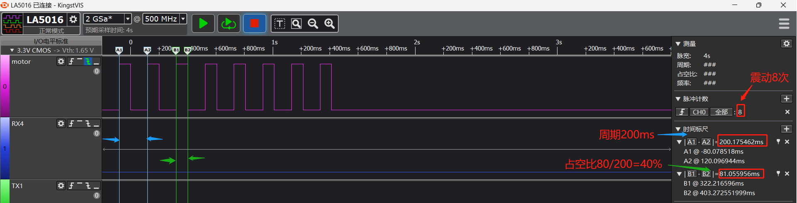

# 4 马达motor调试常见问题
## 4.1 GPIO模拟马达震动方式配置
考虑到任意IO口驱动马达，solution代码实现了GPIO驱动马达代码，<br>
rtconfig.h中menuconfig配置后的宏：<br>
```c
#define MOTOR_ENABLED 1 //启动马达
/* MOTOR_USE_PWM is not set */
#define MOTOR_PERIOD 200  //马达震动周期
#define MOTOR_POWER_IO -1 //马达开电，没有开电控制配置为-1
#define MOTOR_SW_CONTRL 1 //使能软件控制马达
#define MOTOR_CTRL_IO 121  // 配置为121-96 =PB25为马达驱动口
```
可以采用如下测试代码来进行测试马达功能：<br>
finsh串口命令：motor set 1 8 4<br>
参数：1代表启动motor，8代表震动8次，4代表40%的占空比，<br>
实际驱动波形如下图：<br>
<br><br>   
```c
#ifdef RT_USING_FINSH
int motor(int argc, char **argv)
{
char i;
 if (argc > 1)
 {
 if (strcmp("on", argv[1]) == 0)
 {
	 rt_kprintf("motor on!\n");
	 app_start_motor();
 	 app_set_motor_level(MOTOR_TEN_LEVEL);
 }
 else if (strcmp("off", argv[1]) == 0)
 {
	 rt_kprintf("motor off!\n"); 
	 app_stop_motor();
 }
 else if (strcmp("set", argv[1]) == 0)
 {
 	uint32_t mode = strtoul(argv[2], 0, 16);
	uint32_t time = strtoul(argv[3], 0, 16);
	uint32_t level = strtoul(argv[4], 0, 16);	
	rt_kprintf("turn on mode:%d,time:%d,level:%d\n",mode,time,level);
 	app_set_motor_level(level);	
	app_motor_control(mode,time);
 } 
 else
 {
 	rt_kprintf("command is err!\n");
	rt_kprintf("example:\n motor on\n motor off\n motor set 1 50\n");
 }
 }
 return 0;
}
MSH_CMD_EXPORT(motor, forward motor command); /* 导出到 msh 命令列表中 */
#endif
对应的占空比级别为
const app_motor_grade_t g_motor_level[MOTOR_MAX_LEVEL - 1] =
{
    {MOTOR_PERIOD, MOTOR_PERIOD / 10},
    {MOTOR_PERIOD, (MOTOR_PERIOD / 10) * 2},
    {MOTOR_PERIOD, (MOTOR_PERIOD / 10) * 3},
    {MOTOR_PERIOD, (MOTOR_PERIOD / 10) * 4},
    {MOTOR_PERIOD, (MOTOR_PERIOD / 10) * 5},
    {MOTOR_PERIOD, (MOTOR_PERIOD / 10) * 6},
    {MOTOR_PERIOD, (MOTOR_PERIOD / 10) * 7},
    {MOTOR_PERIOD, (MOTOR_PERIOD / 10) * 8},
    {MOTOR_PERIOD, (MOTOR_PERIOD / 10) * 9},
    {MOTOR_PERIOD, (MOTOR_PERIOD / 10) * 10},
};
```