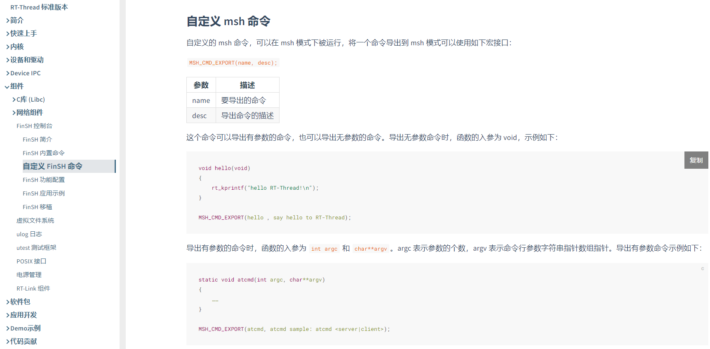
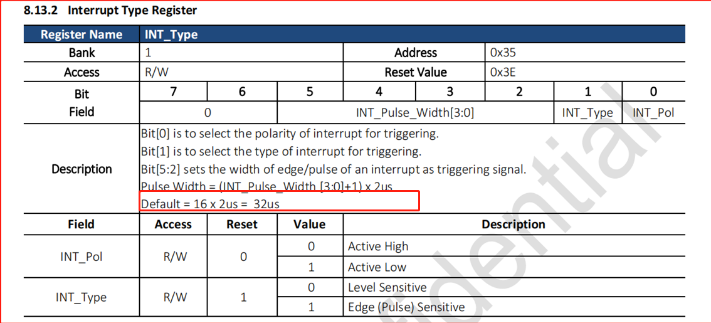

# 2 Sensor调试常见问题
## 2.1 Lcpu中的I2C5上添加了一个Gsensor驱动方法
a， 请在SDK\rtos\rtthread\bsp\sifli\peripherals\目录下，参考其他Gsensor目录创建一个目录，比如:<br>
复制并创建目录:stk8321，并修改对应目录里面的SConscript的宏`group = DefineGroup('Drivers', src, depend = ['ACC_USING_STK8321'], CPPPATH = CPPPATH),`<br>
该ACC_USING_STK8321宏依赖于 lcpu中的menuconfig的Kconfig配置，需要参考其他的外设添加.<br>

b， 在lcpu工程的menuconfig中，使能该Gsensor设备和I2C5，` → RTOS → On-chip Peripheral Drivers → Enable I2C BUS-> Enable I2C5 BUS`<br>
确认是否配置正确，请在lcpu对应工程目录下的rtconfig.h中，查看是否有<br>
```c
#define ACC_USING_STK8321
#define STK8321_BUS_NAME "i2c5
#define RT_USING_I2C
#define BSP_USING_I2C
#define BSP_USING_I2C4"
```
c，请确认pinmux.c中的I2C配置是否为I2C功能和上拉状态.<br>
```c
    HAL_PIN_Set(PAD_PB43, I2C5_SCL, PIN_PULLUP, 0);               //i2c5
    HAL_PIN_Set(PAD_PB44, I2C5_SDA, PIN_PULLUP, 0);
```    
d，I2C外设已经封装成标准的rt_thread I2C devices设备，可以在rt_thread的官网上查看I2C 设备的使用方法:<br>
可以参考I2C总线设备 (rt-thread.org)，官方文档:<br>
<br><br>  
e，如果lcpu 出来的log I2C读不到设备的ID，<br>
请依次排查: <br>
测试I2C的供电和工作条件， 包括RESET，LDO_ON等时序，<br>
再用示波器或者逻辑分析仪查看， I2C的输出的读写波形是否符合设备预期， I2C器件地址是否正常， 是否有ACK，<br>
f，可以自定义msh命令测试Gsensor工作是否正常<br>
详细可以参考rtthread官网文档:FinSH 控制台 (rt-thread.org)<br>
<br><br>  

## 2.2 系统进入休眠后Sensor概率不能触发GPIO中断
根本原因：<br>
心率传感器给的唤醒脉宽是最大为32us，脉冲宽度小，系统休眠后，采用32k频率，AON不能保证稳定检测到<br>
<br><br>  
解决方法：<br>
修改外设的寄存器或者固件，中断脉宽要大于时钟周期，RC10K振荡器下脉宽至少大于125us，常见FAQ中断章节<br>
