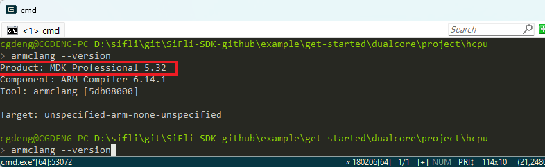
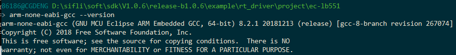
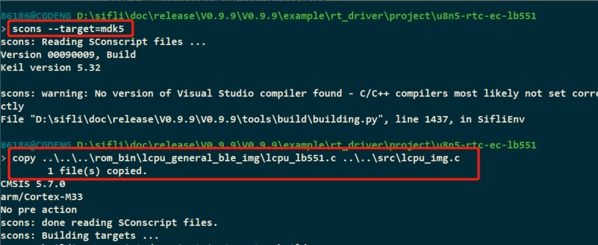
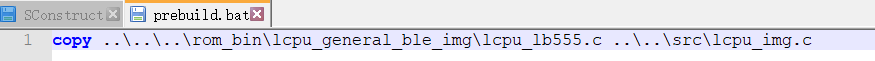
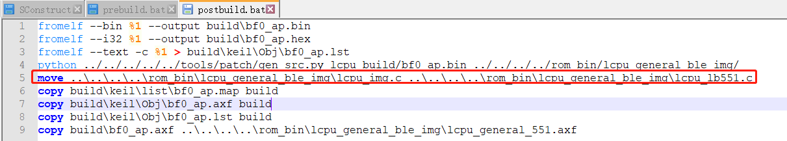
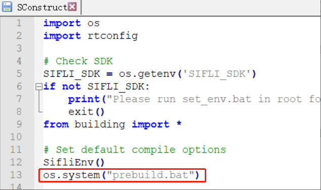
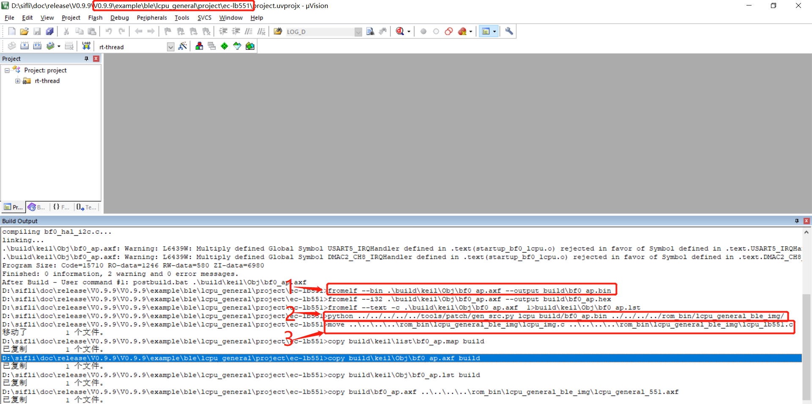

# 1 编译相关
## 1.1 如何把axf文件反汇编为asm汇编或bin文件
用keil的fromelf.exe工具先将需要反汇编的axf文件放在`C:\Keil_v5\ARM\ARMCC\bin`，
然后cmd窗口敲击命令：
```
c:\Keil_v5\ARM\ARMCC\bin\fromelf.exe lcpu_rom.axf --text -c >lcpu_rom.asm
c:\Keil_v5\ARM\ARMCC\bin\fromelf.exe hcpu.axf --text -c >hcpu.asm
```
从axf文件输出bin文件：
```
c:\Keil_v5\ARM\ARMCC\bin\fromelf.exe --bin --output=./lcpuaxf.bin ./lcpu.axf
```
## 1.2 支持的编译器和版本
Keil，`armclang --version` 推荐版本:
<br>
GCC，推荐版本: 
<br>
## 1.3 SDK工程中默认Lcpu的工程路径
请看下面编译时候的截图，有进行拷贝操作，
<br>
而..\..\..\rom_bin\lcpu_general_ble_img\lcpu_lb551.c 文件来自sdk\example\ble\lcpu_general\project\ec-lb551\工程的编译
具体代码拷贝操作，在相应工程目录的编译前prebuild.bat批处理文件和编译后postbuild.bat批处理文件中.
<br>
<br>
scons --target=mdk5 会运行下面
<br>
用keil编译提示如下:
<br>
keil编译前后执行批处理配置， 见问题:2.3.1
## 1.4 未用的全局变量如何编译不被优化
为了在调试方便，把某些值放在一个全局变量内便于查看，此时没有用的变量会被优化，
可以在定义变量时，前面添加上声明volatile，就不会被优化，如下：<br>
```
volatile uint32_t flash_dev_id=0xffffffff;
```
## 1.5 如何解决由于Windows TMP目录文件导致的编译异常问题
有时会发现编译项目时，个别Windows PC环境下编译生成的bootloader等会存在问题;<br>
这种情况下需要检查和确认是否是由于Windows临时目录缓存文件导致的，可以将临时目录下的内容清理一下，确认/显示对应目录路径可以通过命令行: "echo %TMP%"，将对应目录下的所有文件和目录删除即可。
## 1.6 常见编译错误
(1) The code size of this image (xxx bytes) exceeds the maximum sllowed for this version of the linker，如何解决？<br>
出现此错误时，需要检查keil许可是否可用。
## 1.7 强制函数为非内联函数方法
在Ozone跟踪代码时，会碰到有些函数编程为内联函数后，跟踪的代码变成了汇编语言，不便于跟踪代码，此时可以强制该函数为非内联函数，函数前添加声明：__attribute__ ( (noinline) ) 或__NOINLINE
```c
 #define __NOINLINE __attribute__ ( (noinline) )
```
如下：<br>
```c
__attribute__ ( (noinline) ) uint8_t _pm_enter_sleep(struct rt_pm *pm)
```
## 1.8 源文件文件编译为Lib方法
部分客户为了保密的需要或其他原因不愿意公开源码，需要编译出lib库提供给客户使用，SDK中提供了打包成Lib的例程`example\misc\generate_lib`，具体操作方法参加项目目录下`README.md`文档