# 2 Jlink
## 2.1 如何用JLINK RTT打印log信息?
目前我们默认软件Hcpu的log是从uart1 PA17/PA19(SF32LB555), PA49/51(SF32LB551)输出log<br>
Lcpu的log是从uart3 输出，<br>
客户只引出了uart3 PB45/PB46，或者Uart1被占用<br>
解决方案:<br>
考虑到uart3是连接到lcpu，后面lcpu也需要输出log，
可以采用menuconfig改成swd输出log<br>
Jlink swd打印hcpu的log 修改方法:<br>
1) 进入到SDK\example\rt_driver\project\ec-lb555目录<br>
2) menuconfig->Third party packages->选中Segger RTT package
去 <br>
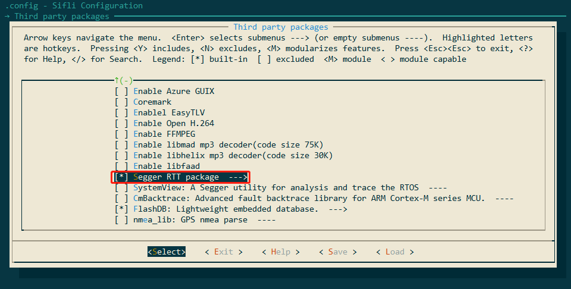<br>
3) menuconfig->RTOS -> RT-Thread Kernel->Kernel Device Object->the devices name for console 改成segger<br>
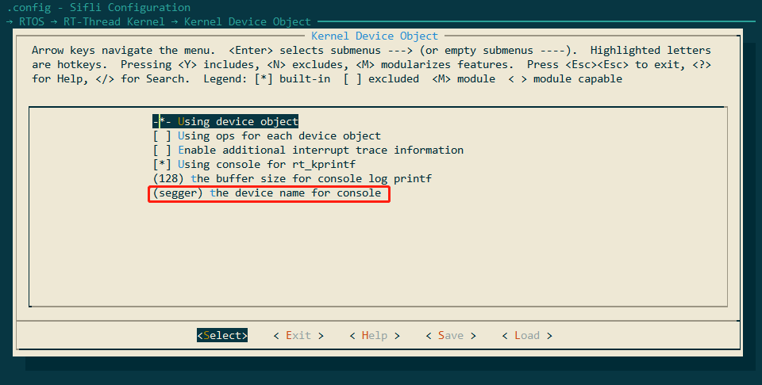<br> 
4) 连接jlink。
方法1：打开C:\Program Files (x86)\SEGGER\JLink\jlink.exe -> connect ->? ->s->默认4000khz->连接成功，如下图：<br>
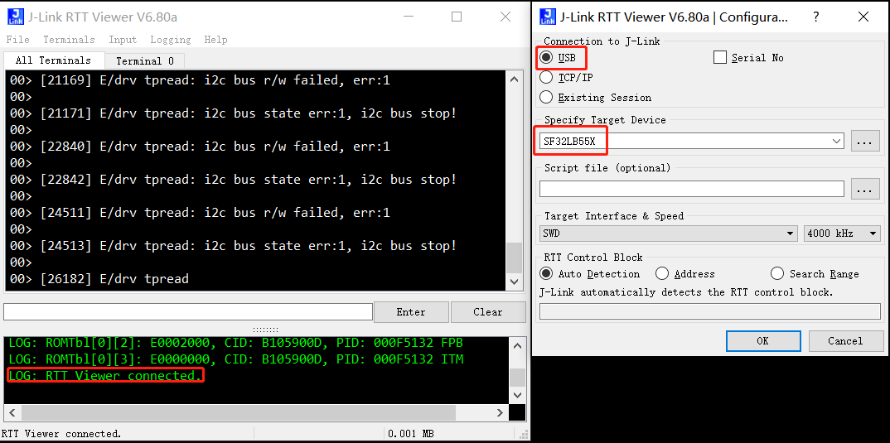<br> 
方法2：打开C:\Program Files (x86)\SEGGER\JLink\JLinkRTTViewer.exe配置和菜单File -> Connect，
连接成功能看到如下的 LOG: RTT Viewer connected.提示连接成功。<br>
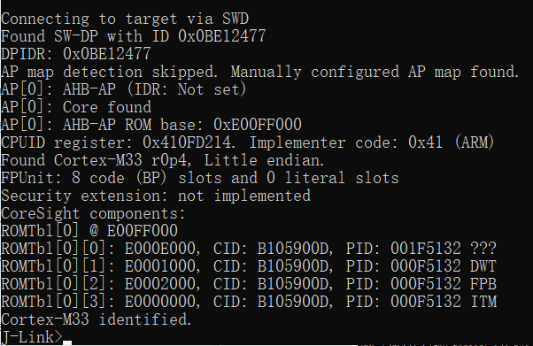<br> 
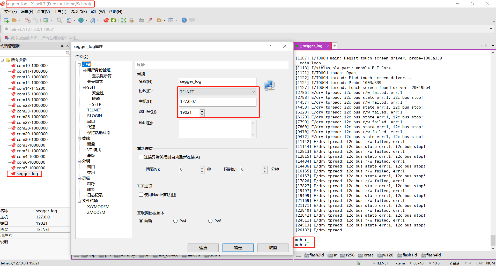<br>   
5) 运行Xshell，secureCRT等软件，通过telnet（hostname: 127.0.0.1 port: 19021）连接到jlink RTT viewer，查看日志；支持输出输入，如下图：<br>
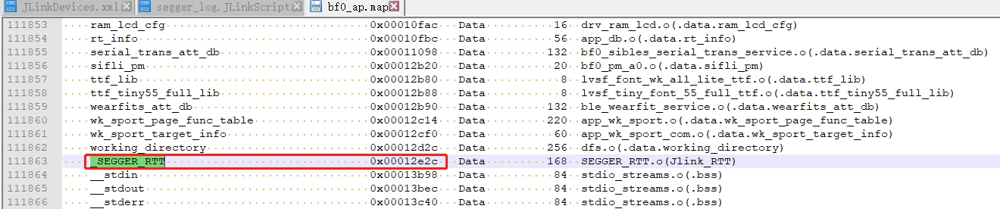<br> 
**注意** 如果Hcpu从standby醒来或者重启，需要重连jlink RTT viewer. <br>
F，如果按照如上配置，Segger还是没有打印，可以参考#2.2排查
## 2.2 Hcpu的log通过Jlink segger打印不出来
根本原因：<br>
新版本sdk为了优化内存，Jlink的Control block address： _SEGGER_RTT变量从HPSYS SRAM0x20000000改链接到了内存区域 HPSYS ITCM RAM0x00010000 0x0001FFFF 64*1024
如下图：<br>
<br>  
而Jlink默认搜索内存从0x20000000开始，因而搜索不到，连接不成功，<br>
老版本0.9.7编译后的地址在0x20000000之后，jlink能自动连接搜索到。<br>
解决方案1: <br>
J-Link RTT Viewer.exe 内指定地址，该地址可以从map文件中搜索到，如下图：<br>
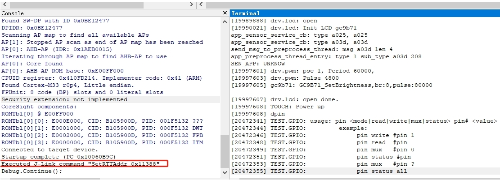<br> 
解决方案2:<br>
改用Ozone.exe，Ozone.exe能通过axf文件中找到该地址，如下图，存在SetRTTAddr地址命令：<br>
<br>  
解决方案3:<br>
做一个JLinkScript的命令，在jlink启动时会自动调用设置或者搜索Control block address范围，如下图命令：<br>
可以自己进行修改选择：<br>
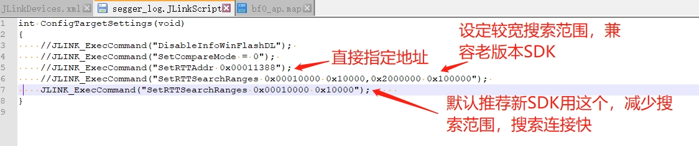<br>  
对应：xml文件修改：<br>
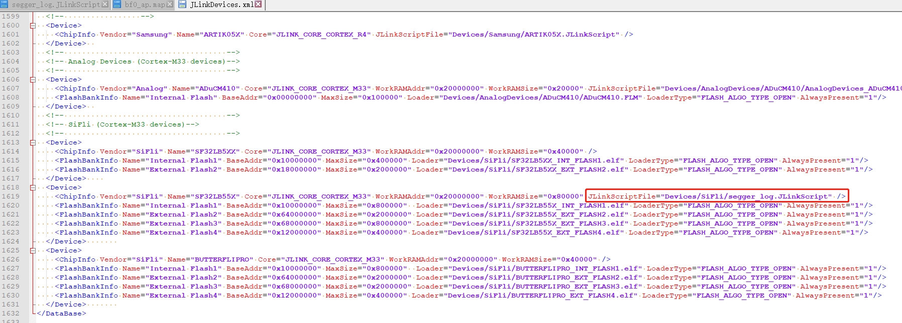<br>  
JLink.exe，J-Link RTT Viewer.exe ，还是像之前一样自动能连接上，方便很多.<br>
推荐用rttview.exe和telnet 127.0.0.1查看log的使用！
文件patch如附件，复制到Jlink对应安装目录：<br>
Program Files (x86).7z

## 2.3 Jlink读写flash的内容，
1) jlink连接成功后， 用mem32读 ， 用w4写， 用erase 擦写<br>
```
mem32 0x40014000 1 #读1个32bit的寄存器值
mem32 0x64000000 10 #读10个byte从flash2地址0x64000000开始，
w4 0x64000000 0x2f 0x2f 0x2f 0x2f 0x2f 0x2f #写内存或者寄存器值 从flash2地址0x64000000开始， 写入后续的数据
```
1) 用jflash读写<br>
跟jlink.exe在一个目录，有一个jflash工具，如下图菜单读取flash内容，
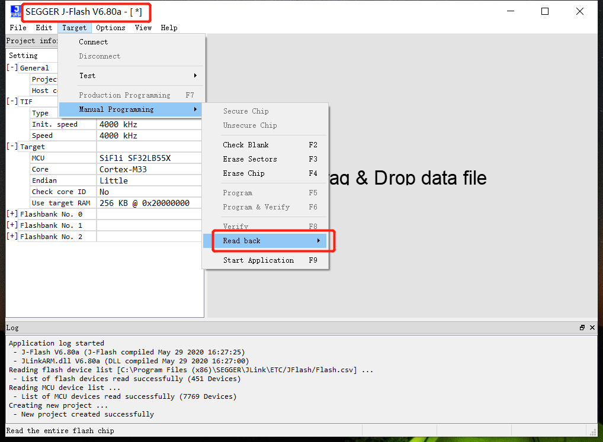<br>  
1) savebin命令读取<br>
```
savebin d:\1.bin 0x101b4000 0x100000 
```
如上0x101b4000为内存地址，0x100000为读写内存大小单位为byte
d，save出来的bin，再烧写回去方法
```
loadbin  d:\1.bin 0x101b4000
```
## 2.4 Jlink其他常用命令
1) halt，go命令<br>
输入命令h，可以让CPU停下来，查看PC指针所在位置<br>
输入命令g，可以让CPU继续跑起来，
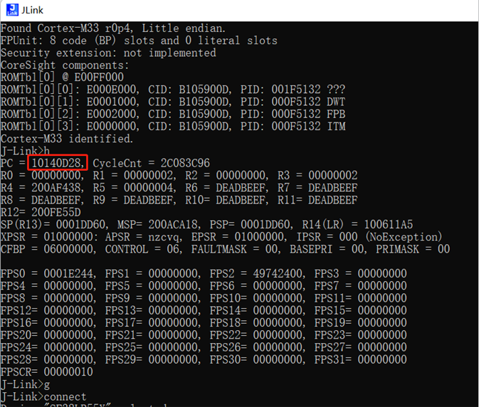<br>  
1) 设置PC指针<br>
常用于配合 __asm("B ."); 指令来用，当代码中执行到该指令后，会停住，<br>
如上图，如果此时PC指针在0x10140D28，此时PC指针加2，输入setpc 0x10140D2A， 可以跳过 __asm("B .");指令，继续往下运行。
1) 其他指令<br>
erase 0x00000000.0x0000FFFF<br>
loadbin <filename> <address>-- 下载filename文件到地址<br>
usb--------连接目标板<br>
r---------重启日标板<br>
halt-------停止cpu运行的程序<br>
loadbin----加载可执行的二进制文件<br>
g-------跳到代码段地址执行<br>
s-------单步执行 (调试用)<br>
setpc-----设置pc寄存器的值(调试用)<br>
setbp-----设置断点，断点停后可以指令g继续运行<br>
Regs-------读寄存器组织<br>
wreg-------写寄存器<br>
mem--------读内存<br>
w4--------写内存<br>
