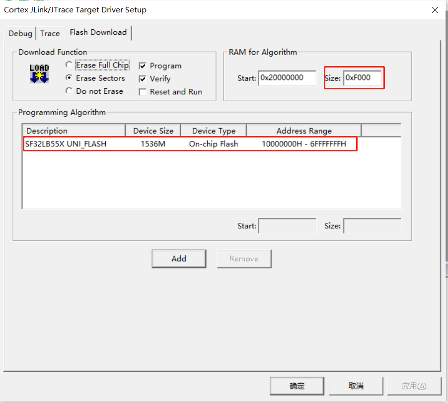
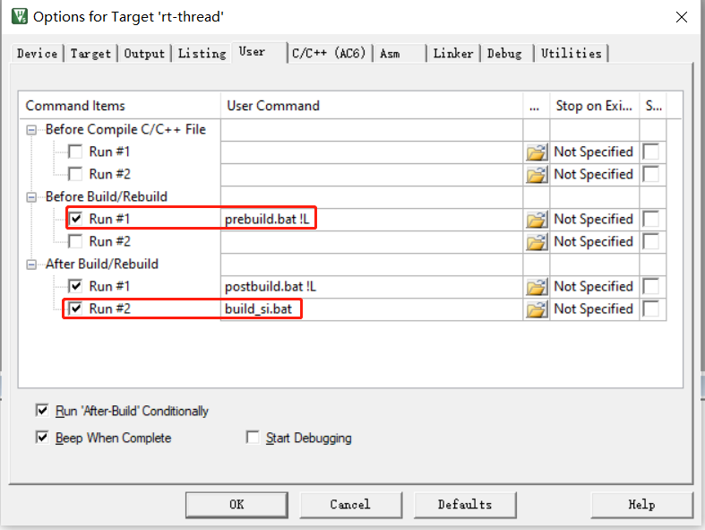

# 3 KEIL
## 3.1 修改配置文件
scons --target=mdk5 命令， 会基于sdk\tools\build\template\template.uvprojx下的工程，生成当前project. 
uvprojx工程， keil打开template.uvprojx修改后，保存退出后， 下次scons --target=mdk5 命令默认的就跟随template.uvprojx工程修改. 
正确使用，可以减少重复工作，提高效率. 
推荐修改1: 
  
推荐修改2: 
自定义编译前和编译后批处理操作， 常见的包含 
1) prebuil.bat批处理里面的对lcpu_img.c拷贝， 
2) 把axf文件，反汇编为asm汇编文件， 
  
 
