# 4 Ozone
## 4.1 Ozone下载和配置方法
1. 下载Ozone<br>
可以直接在Segger公司官网下载，如果是windows系统，选择windows版本，Ozone版本可以选择最新的
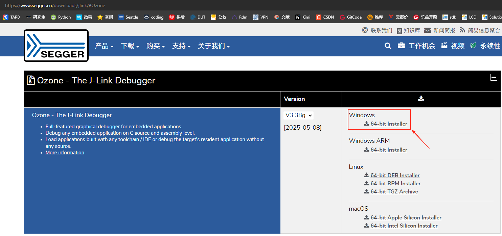<br> 
Segger公司的在线调试工具下载地址<br>
[Ozone - The J-Link Debugger Windows 64-bit Installer](https://www.segger.cn/downloads/jlink/#Ozone) [[调试死机方法](../tools/ozone.md#43Ozone单步调试Debug)]<br>
**注意：**<br>
高版本Ozone和Jlink超过V7.6后的版本，对盗版的Jlink调试器存在检查的问题，对于学习用途的开发者可以推荐[Ozone_Windows_V320d_x64.exe](https://www.segger.cn/downloads/jlink/Ozone_Windows_V320d_x64.exe)和[JLink_Windows_V758a_x86_64.exe](https://www.segger.cn/downloads/jlink/JLink_Windows_V758a_x86_64.exe)
 2. 配置Device、MCU外设寄存器和RT-Thread OS脚本<br> 
 A. 把`SiFli-SDK\tools\flash\jlink_drv\JLinkDevices.xml`文件替换Ozone配置`C:\Users\yourname\AppData\Roaming\SEGGER\JLinkDevices\JLinkDevices.xml`，另外`C:\Users\yourname\AppData\Roaming\SEGGER\JLinkDevices\Devices\`目录下，要创建一个目录SiFli，并把`SiFli-SDK-i\tools\flash\jlink_drv\sf32lb52x\SF32LB52X_*.elf`复制过去，对应目录和文件如下：<br> 
 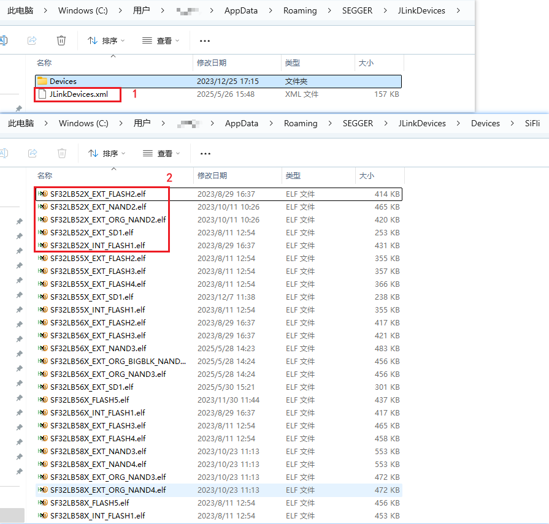<br>
 Jlink烧录驱动对应关系见文件JLinkDevices.xml的内容：<br>
 ```xml
<Device>
    <ChipInfo Vendor="SiFli" Name="SF32LB52X_NOR" Core="JLINK_CORE_CORTEX_M33" WorkRAMAddr="0x20000000" WorkRAMSize="0x60000" />
    <FlashBankInfo Name="Internal Flash1" BaseAddr="0x10000000" MaxSize="0x8000000"  Loader="Devices/SiFli/SF32LB52X_INT_FLASH1.elf" LoaderType="FLASH_ALGO_TYPE_OPEN" AlwaysPresent="1"/>
    <FlashBankInfo Name="External Flash2" BaseAddr="0x12000000" MaxSize="0x8000000" Loader="Devices/SiFli/SF32LB52X_EXT_FLASH2.elf" LoaderType="FLASH_ALGO_TYPE_OPEN" AlwaysPresent="1"/>
</Device>
 ```
 B. 把`D:\sifli\git\SiFli-SDK-i\tools\svd_external\SF32LB52X\SF32LB52x.*`外设寄存器配置文件复制到`C:\Program Files\SEGGER\Ozone\Config\Peripherals`目录下；<br> 
 C. 把`SiFli-SDK\tools\segger\RtThreadOSPlugin.js`复制到`C:\Program Files\SEGGER\Ozone\Plugins\OS\`目录下，对应目录和文件如下：<br> 
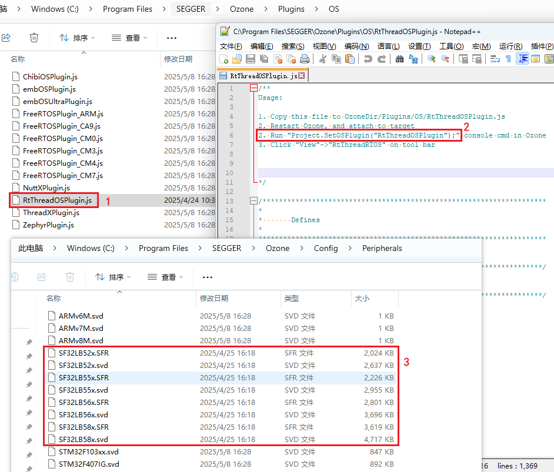<br> 
 配置A/B/C三项后，打开Ozone后，可以选择到需要调试的Devices和MCU外设寄存器<br> 
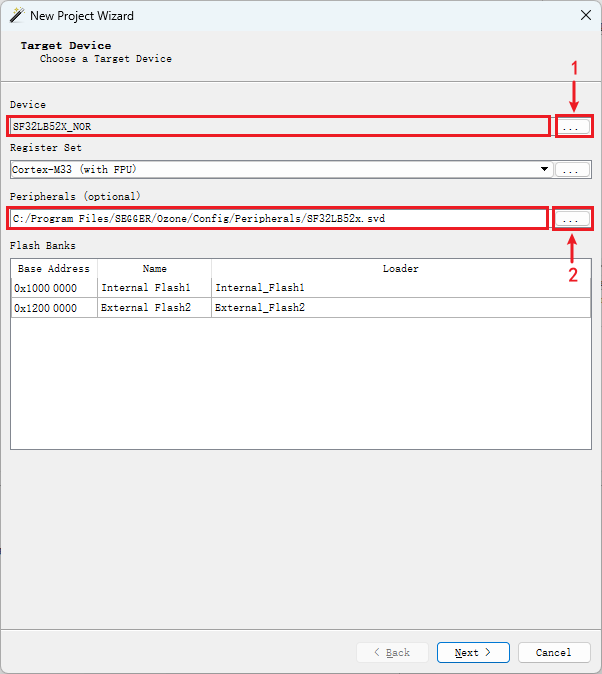<br> 

 配置好MCU外设寄存器和RT-Thread OS脚本后，进入Ozone界面，可以查看对应MCU外设寄存器和OS线程<br> 
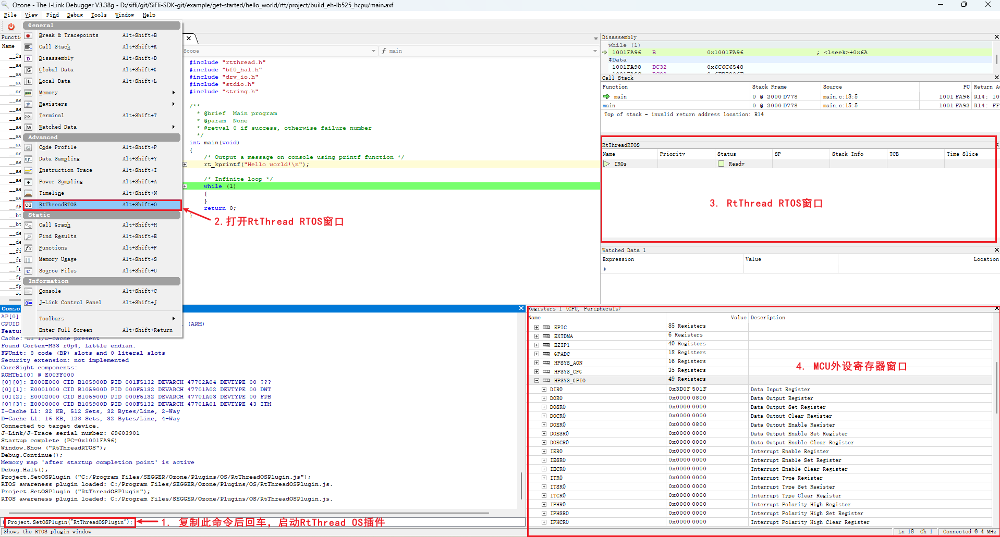<br> 
## 4.2 Ozone Debug连接不成功
提示:<br>
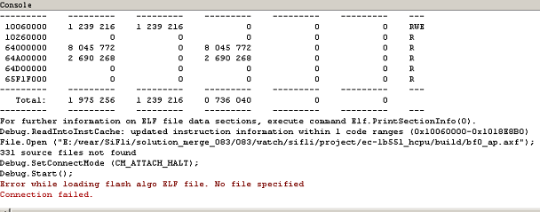<br>   
你需要按照jlink一样，添加好flash的驱动和xml配置文件， 这样Ozone才支持SF32LB55X芯片.<br>
```xml
C:\Program Files\SEGGER\Ozone\Devices\SiFli\SF32LB55X****.elf
C:\Program Files\SEGGER\Ozone\JLinkDevices.xml
#不同Jlink或者Ozone版本的路径可能如下：
C:\Users\yourname\AppData\Roaming\SEGGER\JLinkDevices.xml
C:\Users\yourname\AppData\Roaming\SEGGER\JLinkDevices\Devices\SF32LB55X****.elf
```
<a name="43Ozone单步调试Debug"></a>
## 4.3 Ozone单步调试Debug
1， Jlink默认connect会连接到hcpu，如果调试Hcpu，这一步可以跳过，直接debug Hcpu，如果要debug Lcpu，可以在windows cmd命令窗口执行SDK\tools\segger\jlink_lcpu_a0.bat（55），jlink_lcpu_pro.bat（58），jlink_lcpu_56x.bat（56）， 执行该批处理，执行的是\tools\segger\jlink_lcpu_xxx.jlink里面的几条命令:<br>
```
w4 0x4004f000 1
connect
w4 0x40070000 0 
exit
```
也可以直接在Jlink窗口依次输入这两条命令，切换到lcpu.<br>
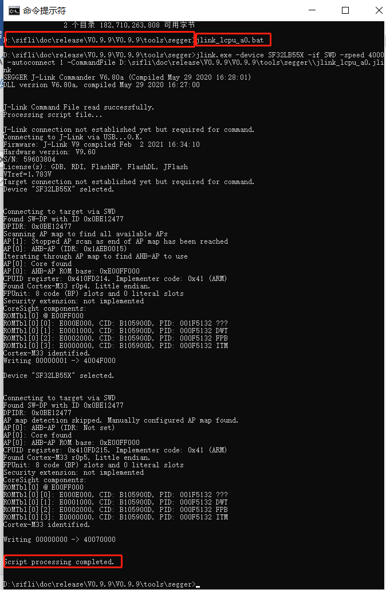<br>   
也可以在代码中，写寄存器把SWD Jlink切到Lcpu调试；<br>
2， 现在以55为例，演示Lcpu单步运行， 先创建一个新项目<br>
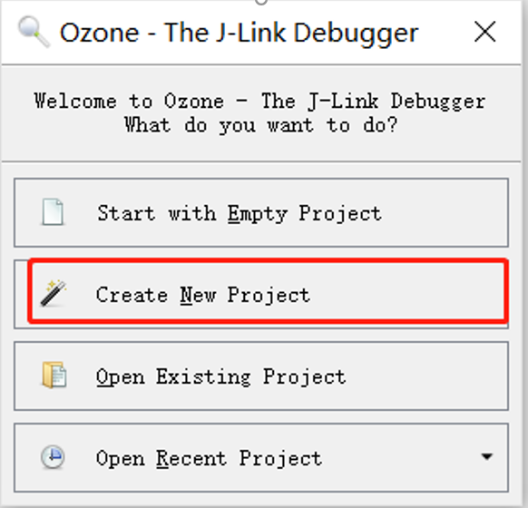<br>    
3， 选择调试芯片，
如果找不到，需要在
C:\Program Files\SEGGER\Ozone\JLinkDevices.xml 添加55x芯片型号配置
和C:\Program Files\SEGGER\Ozone\Devices\SiFli\SF32LB55X_****.elf  四个flash烧录文件<br>
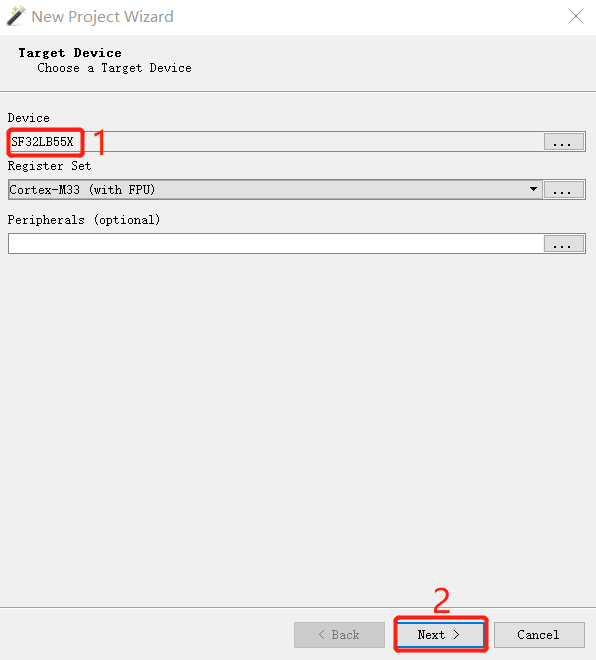<br>    
4， 选择已经连接PC的jlink器件， 如果找不到，检查jlink连接和jlink供电<br>
5， 选择你编译出来的*.axf或者*.elf文件，如果是watch_demo工程，Lcpu的axf路径会在
```
\release\example\rom_bin\lcpu_general_ble_img\lcpu_general_551.axf
```
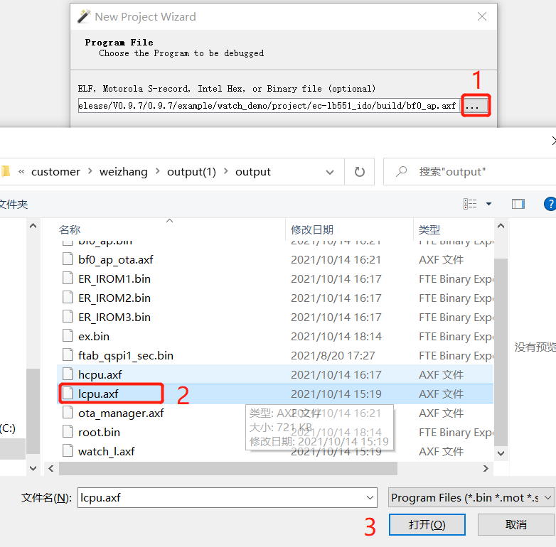<br>    
6，选择Jlink或者SifliUsartServer.exe虚拟的ip<br> 
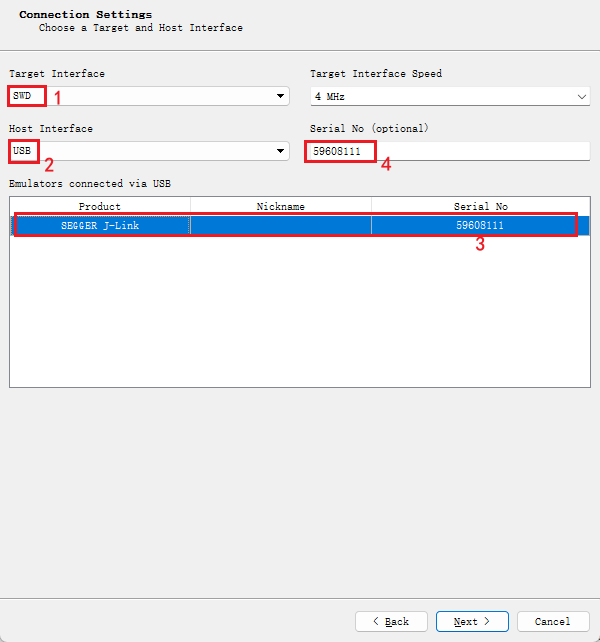<br> 
52默认为uart为调试口，需要SifliUsartServer.exe连接后，用ip 127.0.0.1:19025
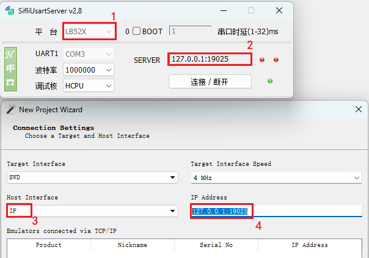<br> 
7，下一步是选择初始化PC指针和初始的堆栈从哪里获取，选择默认或者选择Do no set选项都行， finish完成<br>
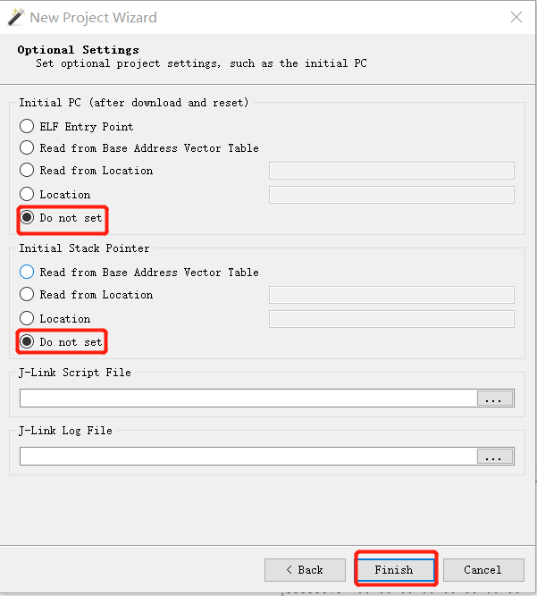<br>    
8， Attach并且halt Program 就是让jlink连接到lcpu，并停在当前运行的PC指针，
Attch并且Running Program就是让jlink连接到lcpu，并且开始从当前PC继续运行程序，<br>
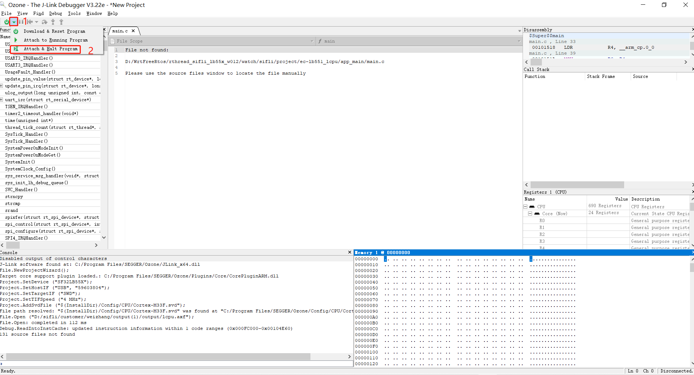<br>    
9，点击运行程序箭头图标后， 可以看到lcpu已经可以单步运行，可以添加断点，查看栈信息和寄存器状态.<br>
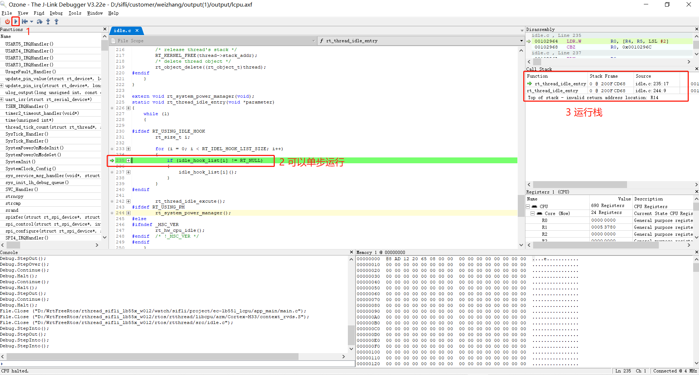<br>   
 
## 4.4 Ozone连接后出现断连问题
经常连接一会就会出现如下Target Connection Lost的对话框，然后连接丢失<br>
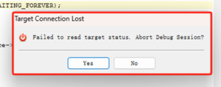<br>    
如果碰到以上问题，在连接Ozone进行调试前，请关闭Ozone的内存Memory窗口和其他不用的窗口，如下窗口读取了不存在的内存地址或者读取了尚未初始化好的PSRAM内存：<br>
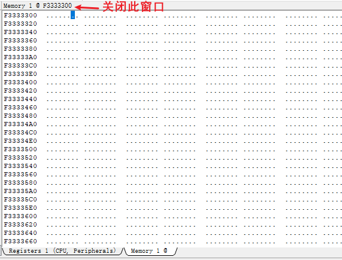<br> 
因为Ozone在连接的时候去读这些内存内容，如果读取失败就会出现断连。<br>
## 4.5 Ozone使能RTThread RTOS在线调试
复制\sdk\tools\segger\RtThreadOSPlugin.js文件到Ozone的安装目录:<br>
`C:\Program Files\SEGGER\Ozone\Plugins\OS\RtThreadOSPlugin.js`<br>
并且打开该文件，按照下面步骤操作，就可以使用Ozone在线切换RTThread线程进行查看和调试。<br>
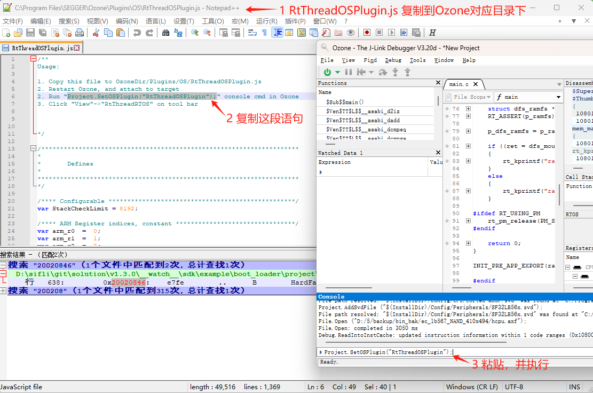<br>    
Ozone连接后，并使能Project.SetOSPlugin("RtThreadOSPlugin");的现场如下：<br>
 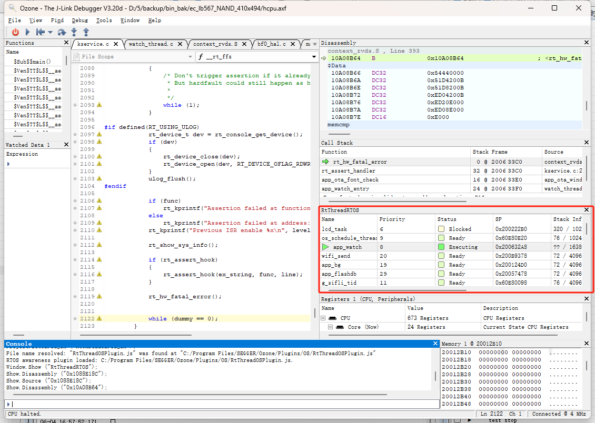<br>    
## 4.6 Ozone重定义文件路径
在烧录的bin的路径不是本地编译的情况下，用Ozone进行Debug，会提示File not find，无法定位到相应的c源代码，从而无法进行逐条跟踪定位问题。<br>
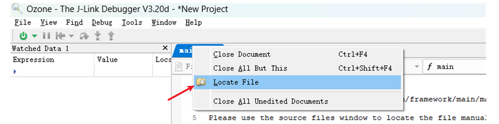<br>     
解决方法：<br>
单个文件找不到：鼠标右键该文件，Locate File到对应文件，就能定位到该c源文件<br>
批量文件基地址不对：使用Project.AddPathSubstitute命令重定位路径,比如将elf种的linux路径替换成windows的<br>
 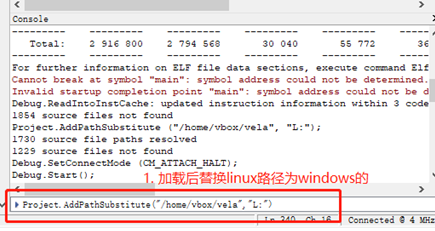

