# 5 SiFli
## 5.1 Impeller下载提示失败，是哪里没配置好吗？
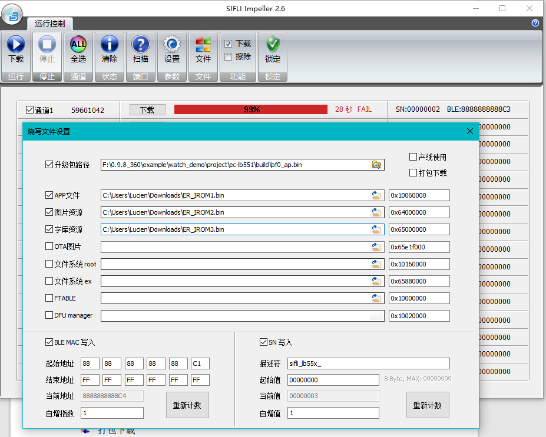<br>
根本原因: 16M flash， ER_IROM3指定了地址超出16Mflash0x00000-0xFFFFFF的地址范围，<br> 
解决方案: 1， SDK中watchdemo裁剪为16M flash的方法，如下图:<br> 
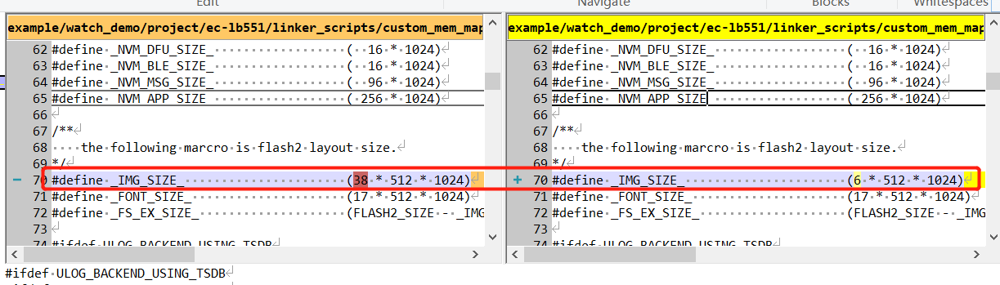<br> 
编译出来后， 地址下载地址从hex文件格式中查找，如下图:<br> 
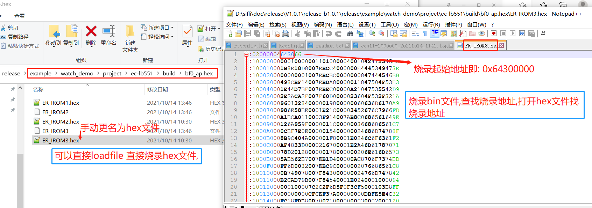<br> 
## 5.2 solution双击butterfli.exe打不开编译工具
a、打开PC或者笔记本的显示设置，将百分比设置为100%。（一些其他的分辨率百分比大小也可以，但需要保证butterfli.exe的页面显示正常）<br> 
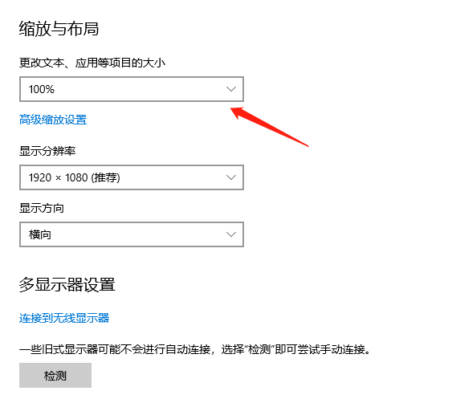<br> 
b、确保在显示---高级缩放设置中打开如下选项，否则会出现页面大小有变化，但是一些工具打开显示大小不变的情况，butterfli.exe可能仍然打不开：<br> 
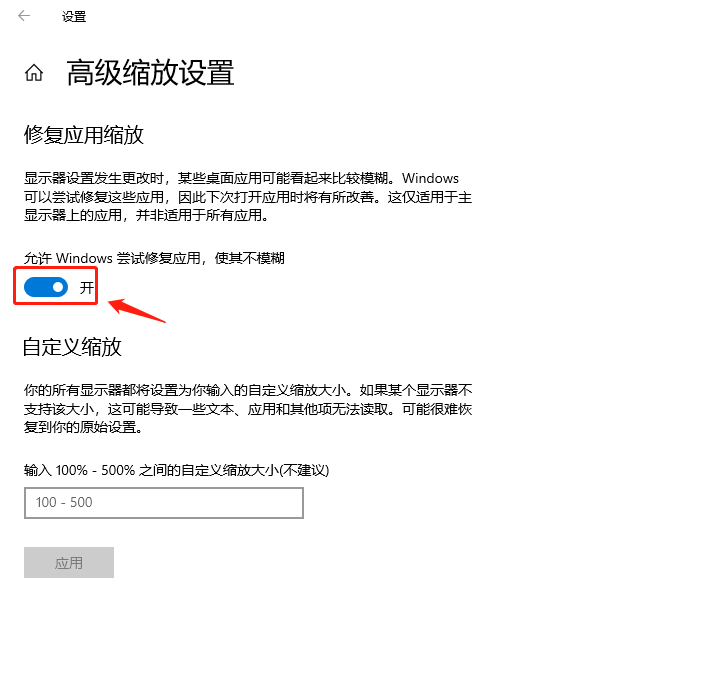<br> 
c、正常的butterfli.exe工具界面显示如下，如果有显示错乱，请调整分辨率以及显示百分比。<br> 
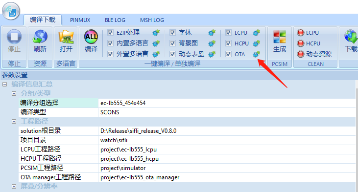<br> 
## 5.3  console finsh shell命令，如何用regop读写寄存器值?
```
regop unlock 0000 # 先需要解锁
regop read 40070018 2  # 16进制不能带0x前缀
regop read 4007001c 1
regop write 40007100 200 # 16进制不能带0x前缀
```
## 5.4 查看48M晶体是否校准过频偏的方法
1，在hcpu的串口命令行输入：crystal_get命令，如果返回一个非0或者0xFF值，证明板子已经经过校准，如下图：<br> 
<br>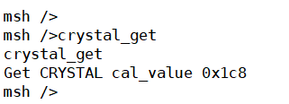<br>
没校准过的，返回如下：<br> 
```
msh />crystal_get
FACTORY_CFG_ID_CRYSTAL read fail with 0
```
对应代码：
```c
int32_t crystal_get(int32_t argc, char **argv)
{
    int res;
    uint32_t cal_value;

    res = rt_flash_config_read(FACTORY_CFG_ID_CRYSTAL, (uint8_t *)&cal_value, sizeof(cal_value));
    if (res <= 0)
    {
        rt_kprintf("FACTORY_CFG_ID_CRYSTAL read fail with %d\n", res);
        return -1;
    }
    else
    {
        rt_kprintf("Get CRYSTAL cal_value 0x%x\n", cal_value);
    }

    return 0;
}
MSH_CMD_EXPORT(crystal_get, crystal_get);
```
2,56x系列solution代码使用otp_factory_re ad读取所有otp分区数据,如下图：<br> 
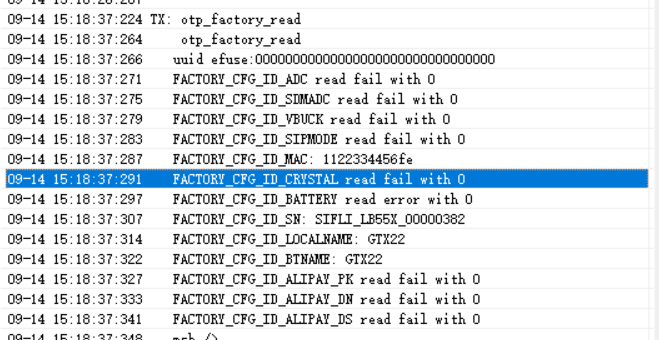<br> 


## 5.5 生成Source Insight工程文件list方法
1，SDK v1.1.3之后，增加了 `scons --target=si `命令，可以生成一个只参与编译的文件列表`si_filelist.txt`文件<br> 
在需要指定 `--board=em-lb525` 这样编译的命令中，需要添加board参数，命令如下：<br> 
```
scons --target=si 
scons --board=em-lb525 --target=si 
```
2，SourceInsight工具新建工程后，可以选择`菜单：project -> Add and Remove Project Files ->Add from list... `导入生成的`si_filelist.txt`进入工程，便于查看代码<br> 
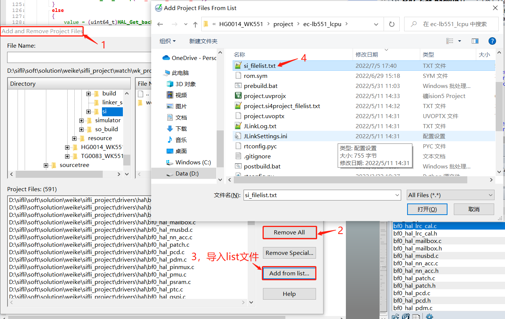<br> 
## 5.6 55X查看芯片工厂校准区OTP/Flash数据方法
1，可以用于查看ADC，晶体是否校准，是否被覆盖，以及序列号，蓝牙地址，名字等等。<br> 
下面是操作方法：<br> 
otp_debug_0922.7z<br> 
a, 确保jlink可以正常连接到sifli的机器，如果不行，把MODE拉高，再复位机器。<br> 
b，运行otp_debug_0922.7z中test.bat批处理命令，会进行烧录factory_cali.bin的文件到RAM中，并跳转到该RAM地址进行运行，不影响原flash程序。<br> 
c，运行JLinkRTTViewer.exe，连接方式选择Auto Detection，输入help有返回命令，然后就可以输入命令读取芯片OTP的数据。<br> 
d，otp_read 0 1 /*该命令读取所有的OTP*/<br> 

参考如下操作流程：<br> 
```
00> Serial:c2,Chip:1,Package:0,Rev:80
00>  \ | /
00> - SiFli Corporation
00>  / | \     build on Aug 18 2022, 1.1.1 build 4df1cb
00>  2020 - 2021 Copyright by SiFli team
00> debug: main thread run
00> msh >
  < help
00> help
00> RT-Thread shell commands:
00> list_mem         - list memory usage information
00> memcheck         - check memory data
00> memtrace         - dump memory trace information
00> pin              - pin gpio functions
00> uart             - uart setting
00> reboot           - Reboot System
00> regop            - Register read / write
00> pwr_ctrl         - BLE TX power adjust
00> crystal_cali     - crystal_cali 8 5 20(PB08 5ppm 20s)
00> crystal_cali_get - crystal_cali_get
00> crystal_cali_set - crystal_cali_set 0x1EA
00> otp_reset        - otp_reset 0
00> otp_read         - otp_read 0 1
00> battery_get      - battery_get
00> battery_r_set    - battery_r_set 1000 220
00> battery_cali_set - battery_cali_set 10000 0
00> battery_cali_get - battery_cali_get
00> battery_cali     - battery_cali 4000 400 10 1000 220(4000mV +-400mV +-10mv 1000k 220k)
00> efuse_uid_read   - efuse_uid_read
00> otp_fwenc_read   - otp_fwenc_read
00> fw_enc_wr        - fw_enc_wr
00> hcpu_jump_run    - hcpu_jump_run addr (eg: hcpu_jump_run 0x10020000)
00> lcpu             - forward lcpu command
00> sysinfo          - Show system information
00> adc              - adc function
00> version          - show RT - Thread version information
00> list_event       - list event in system
00> list_mailbox     - list mail box in system
00> list_msgqueue    - list message queue in system
00> list_memheap     - list memory heap in system
00> exit             - return to RT - Thread shell mode.
00> console          - Change MSH / FINSH console device.
00> help             - RT - Thread shell help.
00> time             - Execute command with time.
00> free             - Show the memory usage in the system.
00> 
00> msh >
  < otp_read 0 1
00> otp_read 0 1
00> READ otp addr 0x1000 with res 256
00> 0x06  0x04  0x0d  0x6b  0x07  0x06  0x04  0x04  
00> 0x9f  0x81  0xfb  0x82  0xff  0xff  0xff  0xff  
00> 0xff  0xff  0xff  0xff  0xff  0xff  0xff  0xff  
00> 0xff  0xff  0xff  0xff  0xff  0xff  0xff  0xff  
00> 0xff  0xff  0xff  0xff  0xff  0xff  0xff  0xff  
00> 0xff  0xff  0xff  0xff  
00> ULOG_WARN: trace loss 97,521
```
2，OTP数据解读：<br> 
OTP里面的数据是按照ID+LEN+DATA排放。<br> 
a，ID占用一个字节，在头文件里面定义好了几个ID；LEN占用一个字节，也就限制了一个ID的内容不能超过255字节；
DATA是实际的数据，按照ID自己定义的数据格式存放，OTP不关心实际数据。 <br> 
各个ID是紧密排放，没有其他同步字，所以查询的时候必然是从头开始，一个ID一个ID的查找。<br> 
b，修改已经存在的ID数据时，首先要从头开始查找，找到对应的ID，检测长度，如果新设置的长度与之前长度一致，则数据保存到同样位置，
如果长度有变化，则后面的ID数据向前移动，然后将修改的ID放到最后。<br> 
```c
#define FACTORY_CFG_ID_INVALID          0       /*!< Invalid ID */
#define FACTORY_CFG_ID_MAC              1       /*!< BLE MAC address */
#define FACTORY_CFG_ID_SN               2       /*!< Serial Number */
#define FACTORY_CFG_ID_CRYSTAL          3       /*!< Crystal tuning information */
#define FACTORY_CFG_ID_ADC              4       /*!< ADC tuning information*/
#define FACTORY_CFG_ID_SDMADC           5       /*!< SDMADC tuning information*/
#define FACTORY_CFG_ID_VBUCK            6       /*!< VBUCK /LDO information*/
#define FACTORY_CFG_ID_SECCODE          7       /*!< Security Code or something like this*/
#define FACTORY_CFG_ID_LOCALNAME        8       /*!< BLE localname*/
#define FACTORY_CFG_ID_BATTERY          9       /*!< Battery verify value*/
#define FACTORY_CFG_ID_FWVERIFY         10      /*!< FW verify code generated based in uid*/
#define FACTORY_CFG_ID_ALIPAY_PK        11      /*!< for alipay product key  code*/
#define FACTORY_CFG_ID_ALIPAY_DN        12      /*!< for alipay device name code*/
#define FACTORY_CFG_ID_ALIPAY_DS        13      /*!< for alipay device secret code*/
#define FACTORY_CFG_ID_UNINIT           0xFF    /*!< Uninitialized ID */
```
如下图的解析:<br> 
红框内ID: 0x06为FACTORY_CFG_ID_VBUCK， 数据长度0x04为数据长度，紧跟的0x0d，0x6b，0x05，0x06为数据。<br> 
蓝框内ID为0x04，对应为ADC校准数据，芯片出厂前ATE已保存，ID为0x09是产线第二次校准电池保存（下图无此项），计算电池电压时，两个组合来用。<br> 
绿框内ID为0x03，为晶体校准数据。<br> 
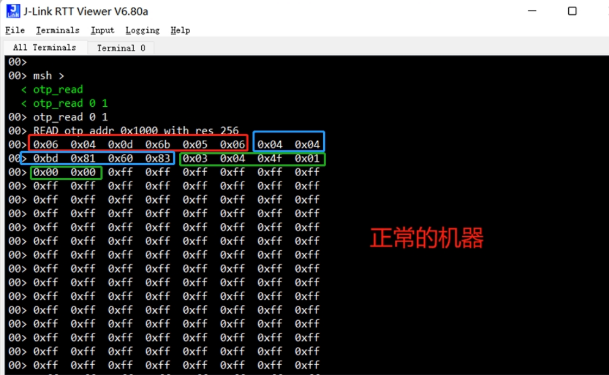<br>  
下面是一例出现问题的OTP数据：<br> 
如下图：即只有ID=0x07的数据，其他ADC校准和晶体校准数据都被覆盖了。<br> 
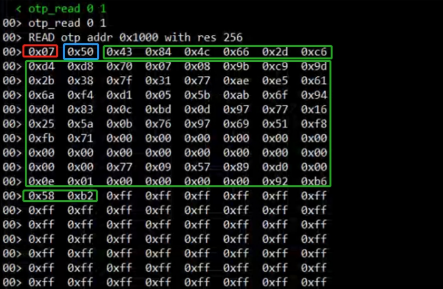<br>   
## 5.7 52X芯片查看芯片是否校准的方法
PMU的AON_BG寄存器，会在软件初始化时从EFUSE读取值更新该寄存器，如果该寄存器不是默认值0x18，这可以认为该芯片已经校准，具体方法如下：<br> 
1，正常开机后，代码执行到BSP_System_Efuse_Config();<br> 
2,  jlink.exe命令`mem32 0x500ca000 20`<br> 
查看对应的0x24寄存器值：<br> 
如下，对应0x500ca024寄存器为0x39，不是默认0x18，证明已经校准<br> 
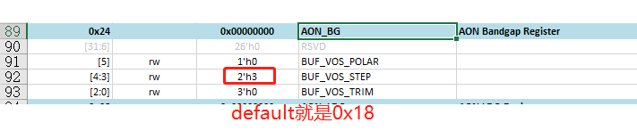<br>   
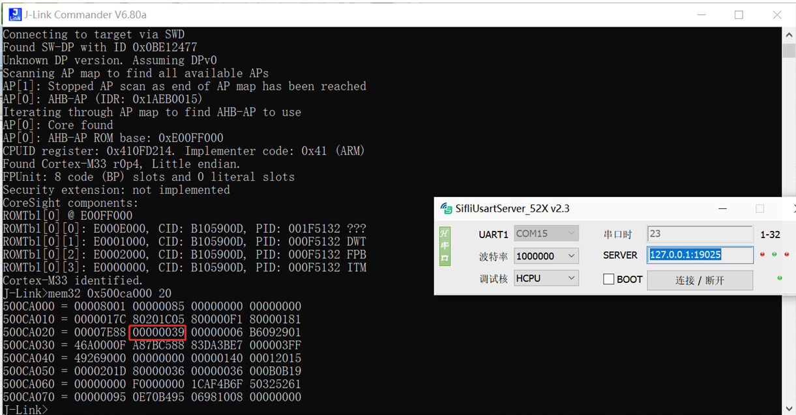<br>   
## 5.8 Dump内存方法
## 5.8.1 52x，56x用串口dump内存现场方法
打开`sdk\tools\crash_dump_analyser\script`目录，执行AssertDumpUart.exe，选择对应保存bin的路径，内存配置，芯片型号（支持52x，56x），串口号，点击导出，开始保存内存内容为bin文件，
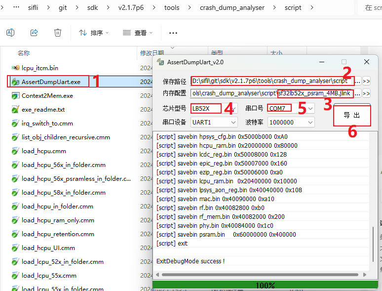<br>   
提示成功后，把生成的所有*.bin，*.txt, 和编译生成的axf文件放在一个目录，然后用Trace32工具进行解析。
## 5.8.2 55x，56x，58x，用jlink dump内存方法；
打开`sdk\tools\crash_dump_analyser\script`目录，如下图*.bat就是对应的dump批处理命令，可以文本编辑器打开看看内部具体执行操作。
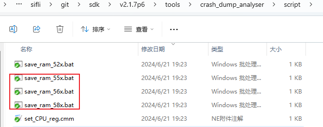<br>   
这个3个批处理都是用的jlink进行dump，在保证jlink可以联通设备的情况下，就可以执行对应需要dump的内存的*.bat文件，比如：save_ram_55x.bat打开后内容如下：
```
JLink.exe -Device CORTEX-M33 -CommanderScript sf32lb55x.jlink >log.txt
```
连接jlink后，会调用sf32lb55x.jlink（可以打开查看和编辑命令）内的一连串命令保存寄存器和内存为bin的操作，然后dump过程的log会保存在log.txt内，如果dump失败，可以打开查看失败原因。<br> 
完成后，会在*.bat的目录下生成`*.bin，*.txt文件`，把生成的所有`*.bin，*.txt`, 和编译生成的`hcpu/lcpu/bootloade`r的axf文件放在一个目录，然后用Trace32工具进行解析。
