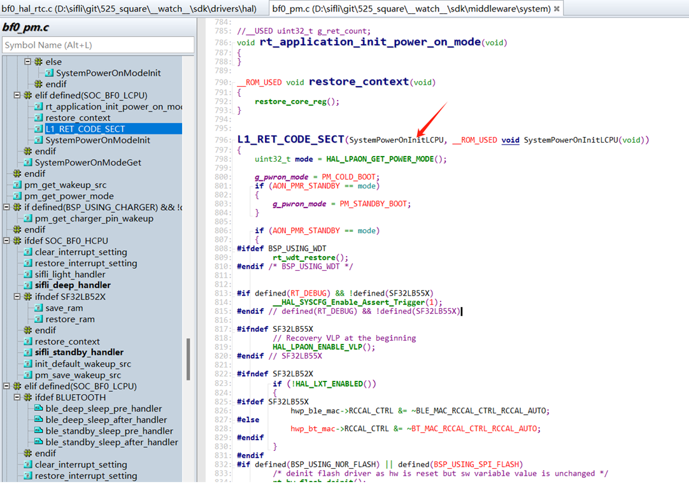
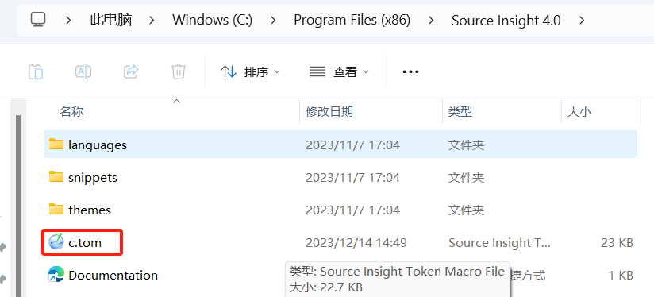
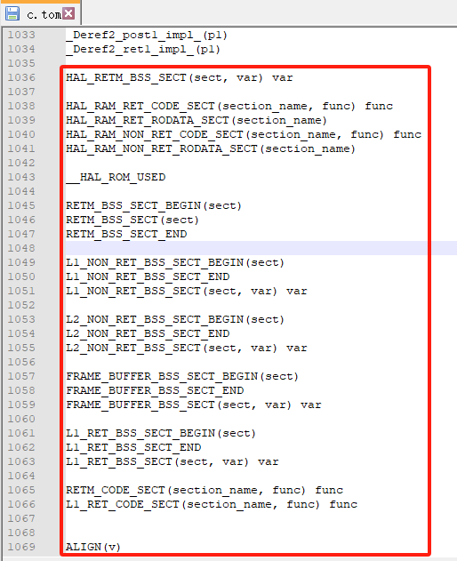
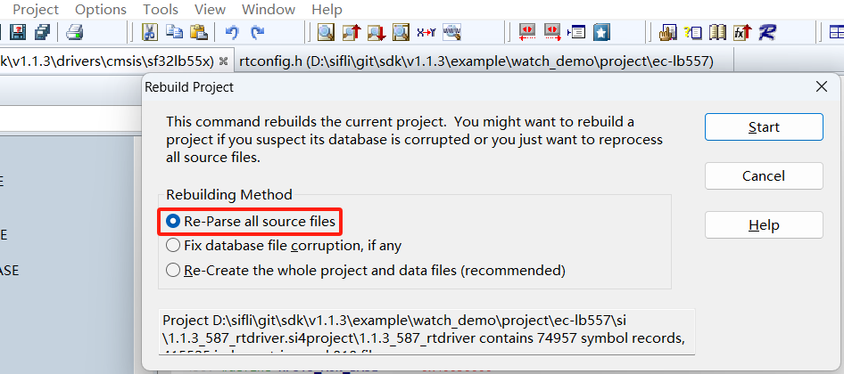

# 9 Source Insight相关

## 9.1 Source Insight部分符号无法解析问题
现象如下图，函数不能识别，给搜索和查看代码带来不便
<br><br>  
解决方案：<br>
1，修改source insight安装目录下文件C:\Program Files (x86)\Source Insight 4.0\c.tom
<br><br>   
2，文件结尾增加如下宏定义
<br><br>  
```c 
HAL_RETM_BSS_SECT(sect, var) var
HAL_RAM_RET_CODE_SECT(section_name, func) func
HAL_RAM_RET_RODATA_SECT(section_name)
HAL_RAM_NON_RET_CODE_SECT(section_name, func) func
HAL_RAM_NON_RET_RODATA_SECT(section_name)
__HAL_ROM_USED
RETM_BSS_SECT_BEGIN(sect)
RETM_BSS_SECT(sect)
RETM_BSS_SECT_END
L1_NON_RET_BSS_SECT_BEGIN(sect)
L1_NON_RET_BSS_SECT_END
L1_NON_RET_BSS_SECT(sect, var) var
L2_NON_RET_BSS_SECT_BEGIN(sect)
L2_NON_RET_BSS_SECT_END
L2_NON_RET_BSS_SECT(sect, var) var
FRAME_BUFFER_BSS_SECT_BEGIN(sect)
FRAME_BUFFER_BSS_SECT_END
FRAME_BUFFER_BSS_SECT(sect, var) var
L1_RET_BSS_SECT_BEGIN(sect)
L1_RET_BSS_SECT_END
L1_RET_BSS_SECT(sect, var) var
RETM_CODE_SECT(section_name, func) func
L1_RET_CODE_SECT(section_name, func) func
ALIGN(v)
```
3，生效方法：<br>
a, 重启Source Insight，<br>
b, 菜单 File->Close All 关闭所有文件<br>
c, 重新解释工程所有文件 <br>
<br><br>  
