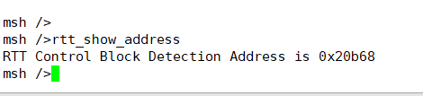
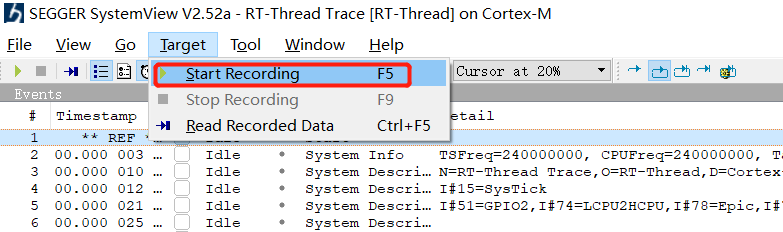
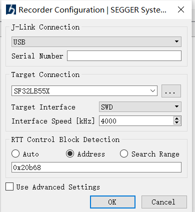
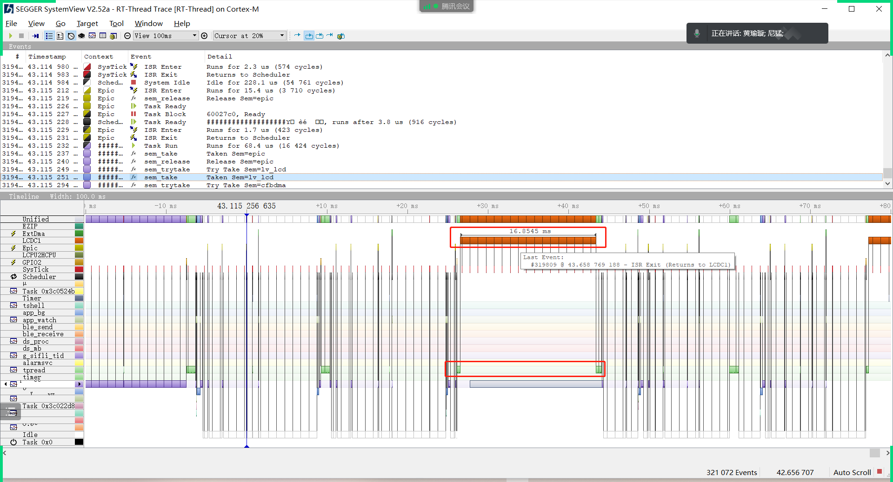
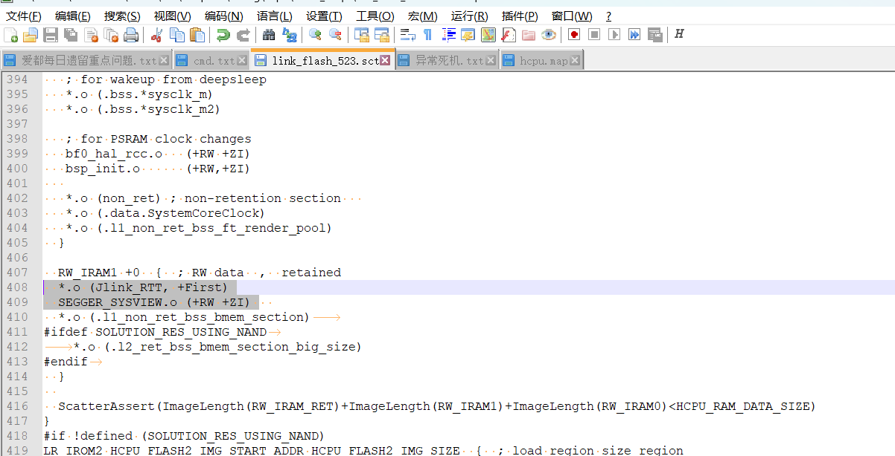

# 7 SystemView
## 7.1 SystemView能用来分析什么问题？
SystemView 是可视化分析工具,随着 MCU 的性能越来越强，嵌入式产品的功能越来越复杂，对于系统的调试和分析提出了新挑战，调试某个功能或问题通常需要花费大量精力，SystemView 是一款帮助用户进行系统调试和分析的强大工具，能够显著缩短开发和调试时间，提高开发效率。<br>  RT-Thread 上提供了 SystemView 工具对系统进行调试和分析。<br> 
该工具，可以详细的看到每一个线程，每一个中断，占用CPU的时间，特别适合找到占用CPU资源的地方，这里举例，以下两个场合用SystemView定位到的问题：<br> 
1，LCD显示图像偶尔撕裂，最后用SystemView定位到是存储数据读写Flash的时候，关闭了中断，导致一帧数据因为中断被关闭，分成了2帧来刷屏导致。<br> 
2，TP的I2C送数被打断了16ms，用SystemView定位是这个16ms是因为LCD控制器LCDC的中断内存在两次送数，导致中断程序持续过长。<br> 	
具体参考RT-Thread 官网文档：<br> 
[SystemView 分析工具 (rt-thread.org)]( https://www.rt-thread.org/document/site/#/rt-thread-version/rt-thread-standard/application-note/debug/systemview/an0009-systemview?id=systemview-%e4%bd%bf%e7%94%a8%e6%8c%87%e5%8d%97)：

## 7.2 SystemView如何启用
1，SDK的配置：Hcpu的menuconfig→ Third party packages → SystemView: A Segger utility for analysis and trace the RTOS 其他都采用默认配置。<br> 
2，Hcpu的串口console输入命令： `rtt_show_address`
会返回，RTT Control Block的地址，如下图：
<br><br> 
3，打开SystemView.exe软件，菜单->Target->Start Recording, 
<br><br>  
4，按如下选择，并且填好步骤2获取的地址。
<br><br>  
5，Start Recording记录后，就能看到如下的窗口：
<br><br>  
6，添加Segger打印到SystemView的串口中，可以在SDK的代码中添加如下代码：<br> 
```
extern void SEGGER_SYSVIEW_Print(const char* s);
 SEGGER_SYSVIEW_Print("A");
```
更多使用，请参考RT-Thread 官网文档或者DOC目录下文档

## 7.3 52X SystemView如何启用
参考## 7.2的前提下，因为52X默认是UART_DGB，采用SifliUsartServer.exe转的jlink非常慢，没法正常连接SystemView，因此需要把PA18,PA19配置为jlink接口模式，修改如下：<br> 
1，bsp_pinmux.c文件BSP_PIN_Init函数中，PA18,P19配置为jlink接口<br> 
```
#if 0
    // UART1
    HAL_PIN_Set(PAD_PA19, USART1_TXD, PIN_PULLUP, 1);
    HAL_PIN_Set(PAD_PA18, USART1_RXD, PIN_PULLUP, 1);
#else
    //SWD
    HAL_PIN_Set(PAD_PA18, SWDIO, PIN_PULLDOWN, 1);
    HAL_PIN_Set(PAD_PA19, SWCLK, PIN_PULLDOWN, 1);
    HAL_PIN_SetMode(PAD_PA18, 1, PIN_DIGITAL_IO_PULLDOWN);
    HAL_PIN_SetMode(PAD_PA19, 1, PIN_DIGITAL_IO_PULLDOWN);
#endif 
```
2，hcpu的log打印也改成jlink的segger打印<br> 
3，可以直接在编译出的hcpu工程bf0_ap.map文件中，搜索_SEGGER_RTT变量，<br> 
```
_SEGGER_RTT     0x603c3258   Data    168  SEGGER_RTT.o(Jlink_RTT)
```
3， 填入上述查询的_SEGGER_RTT地址0x603c3258，<br> 
4, 52X连接SystemView死机，原先放在PSRAM上面，跟上位机交互可能会出现psram cache异常，导致死机 <br> 
`*.o (Jlink_RTT, +First)
 SEGGER_SYSVIEW.o (+RW +ZI)` 把这两个放到sram里。
 <br><br> 
