# 6 Trace32
## 6.1 Trace32下载和配置方法
**1. 下载Trace32** <br>
可以直接在Lauterbach公司的官网下载，如下图：<br>
版本选择ARM版本的[simarm.zip](https://repo.lauterbach.com/download_demo.html)，免费版本在线调试和Script长度有限制，SiFli的全系列MCU目前只用到了离线调试功能；
<br>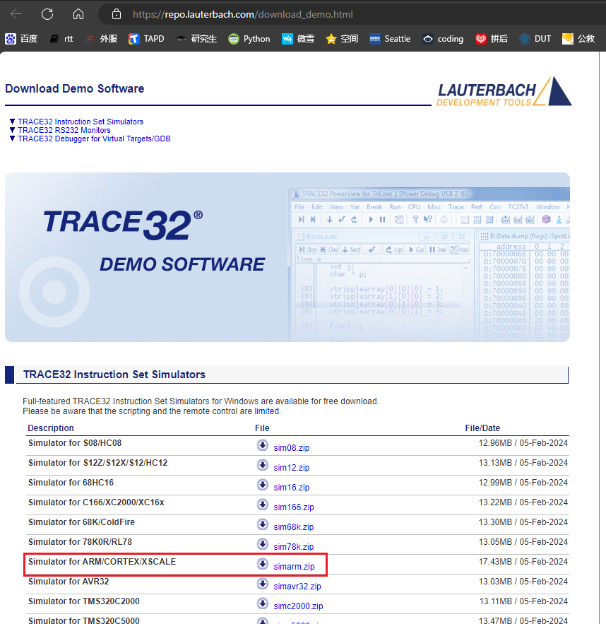<br>
Lauterbach公司的离线调试工具下载地址：<br>
[Simulator for ARM/CORTEX/XSCALE
  simarm.zip](https://repo.lauterbach.com/download_demo.html) [[使用方法](#62-用trace32恢复hcpu死机现场)]<br>
**2. 配置方法**<br>
打开安装说明文件`SiFli-SDK\tools\crash_dump_analyser\INSTALL.md`
```
# Installation Guide

- Download simarm from the link below: https://www2.lauterbach.com/download/simarm.zip
- Extract all files in `simarm.zip` to `simarm` folder, `simarm` folder should be in `crash_dump_analyser` folder
- Replace t32.cmm and t32.men in `simarm` folder with the ones in `patch` folder
```
下载的压缩包解压到`SiFli-SDK\tools\crash_dump_analyser\`目录内，再把此目录的`patch`的内容复制到刚解压的`simarm`目录内，如下图：
<br>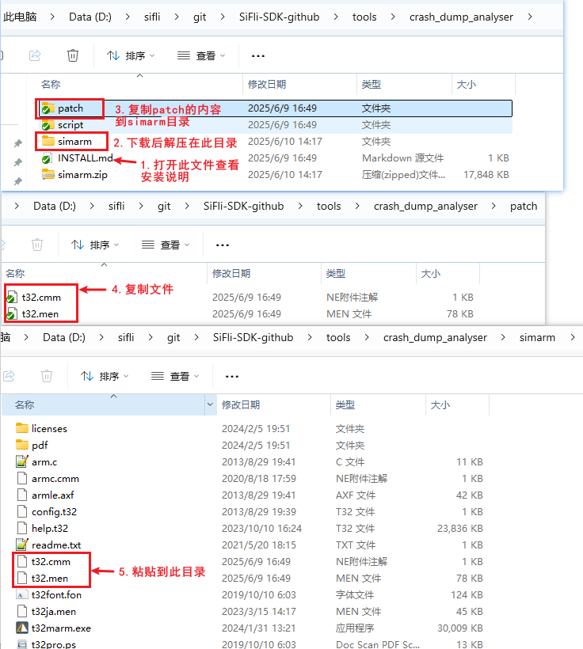<br>
**3. Trace32运行方法** <br>
该软件免安装，鼠标双击`simarm`目录内`t32marm.exe`可执行文件，就可以打开Trace32<br>
## 6.2 用Trace32恢复Hcpu死机现场
1，参照章节[5.8 Dump内存方法](../tools/sifli.md#Mark_Dump内存方法) Dump内存方法，Dump出内存和编译生成的axf文件放在一个目录内<br>
2，运行sdk目录下\tools\crash_dump_analyser\simarm\t32marm.exe<br>
3，查看Hcpu死机，点击HA按钮（HCPU assertion），如果有些bin不存在（例如有的dump没有PSRAM2），可以勾掉去掉。
<br>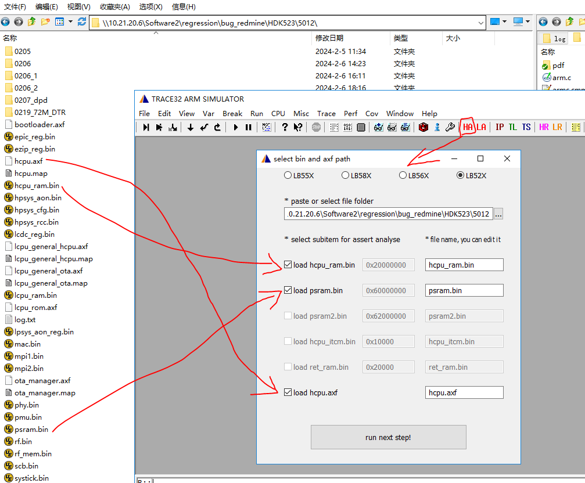<br>
点击 “run_next_step”按钮加载<br>
加载成功后显示下图的现场信息，<br>
<br>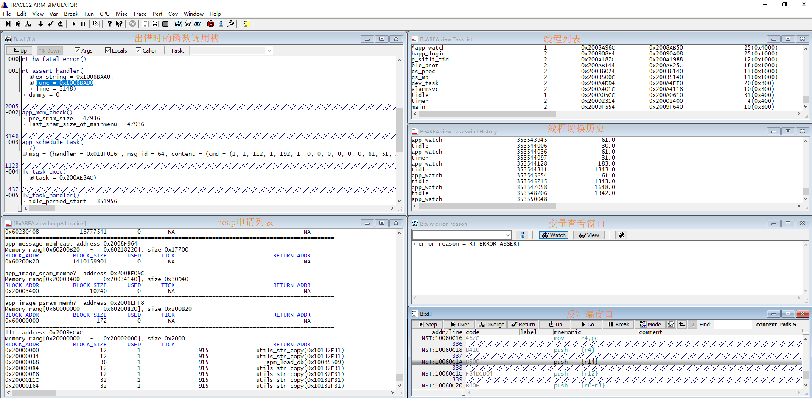<br> 
4，在save的内存相关bin都成功的情况下，内存和相关地址关系会建立起来，可以参考各芯片手册的Memory地址空间，如果现场没有恢复，需要查看dump的bin是否正常，查看log.txt内的PC等寄存器是否正确读出来，在特定情况下，比如psram没有准备好，可以修改对应的dump脚本，比如：sf32lb52x.jlink内的dump内容来添加或者减少需要dump的地址空间。
<br>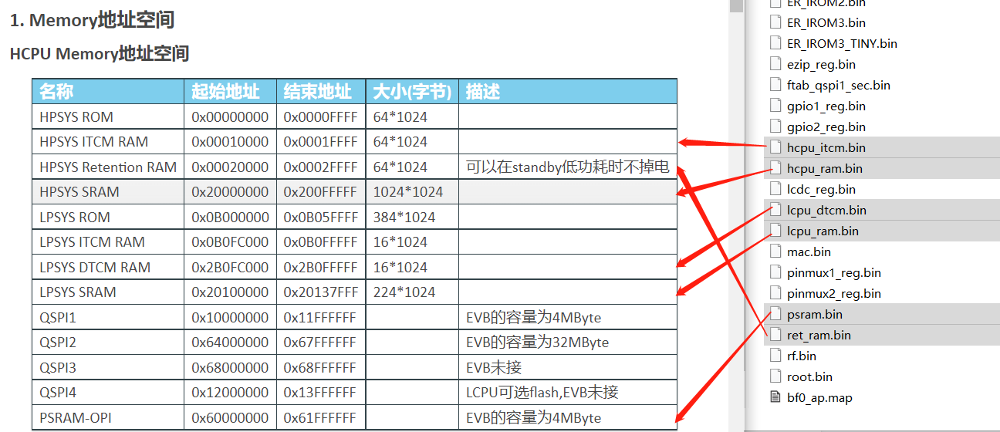<br> 
5，可以在Window菜单切换显示的窗口<br>
<br>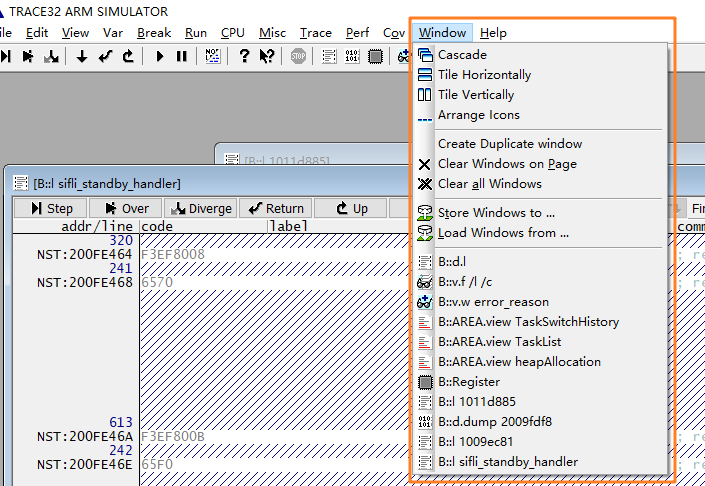<br> 
heapAllocation窗口显示了系统中所有heap pool的分配情况，包括system heap以及memheap_pool：<br>
system heap：rt_malloc和lv_mem_alloc使用的pool<br>
各个memheap_pool: 使用rt_memheap_init创建的pool，分配和释放使用rt_memheap_alloc和rt_memheap_free<br>
分配信息列表中的字段含义为：<br>
```
BLOCK_ADDR: 分配的内存块的起始地址，包括了管理项
BLOCK_SIZE: 申请的内存大小，不包括管理项长度
USED：是否已分配，1表示已分配，0表示未分配
TICK: 申请时间，单位为OS tick，即1ms
RETURN ADDR: 申请者地址
```
6，没有显示异常栈的处理<br>
做完前面几个步骤，有时候不会显示死机的现场栈，可能是dump内容中没有保存或者保存的异常，可以尝试以下3种办法：
<br>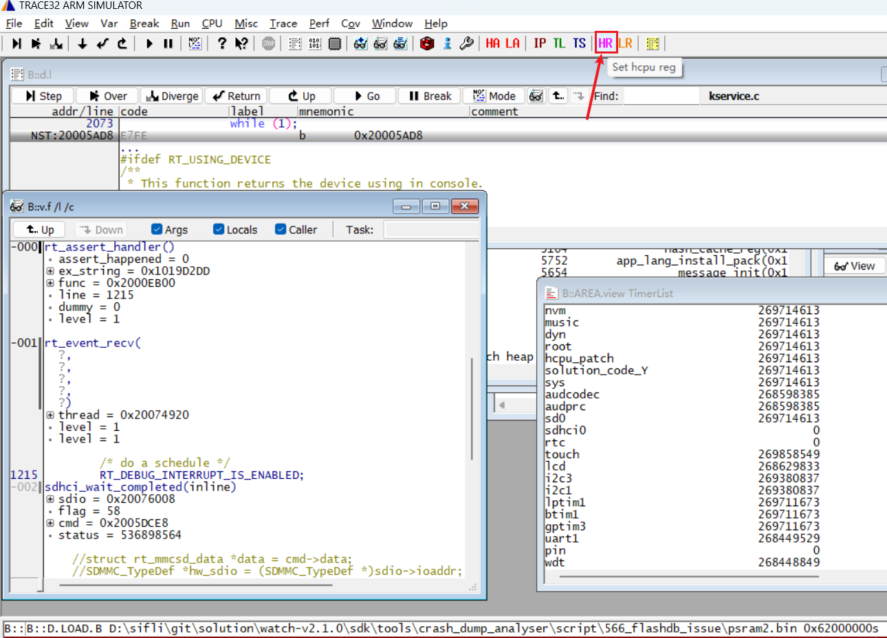<br>
1）从Jlink halt的log信息加载现场栈 HR(HCPU Registers)按钮用于恢复没有走到异常处理程序的CPU寄存器 点击按钮后选择导出现场的 log.txt 文件，他将把里面HCPU的16个寄存器回填到trace32
<br>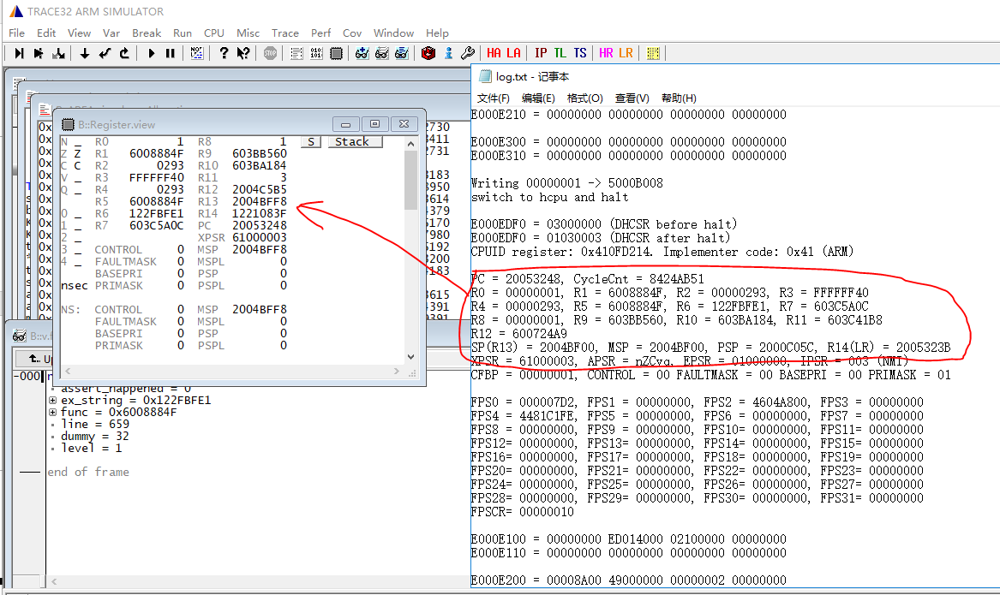<br> 
2）从log里面打印的16个寄存器中，回填到trace32的register窗口中
```
#提示：ARM内核中，寄存器对应关系如下：
SP <-> R13
LR <-> R14
PC <-> R15
```
<br><br> 
3）还有一种方法，直接从hardfault的现场手动恢复，参考6.6 Trace32手动恢复死机现场方法<br>
4）在hardfaul`RT_ERROR_HW_EXCEPTION` 死机的情况下，要特别留意出问题的PC汇编指令，要考虑为什么出现异常地址，异常指令，如下图：
<br>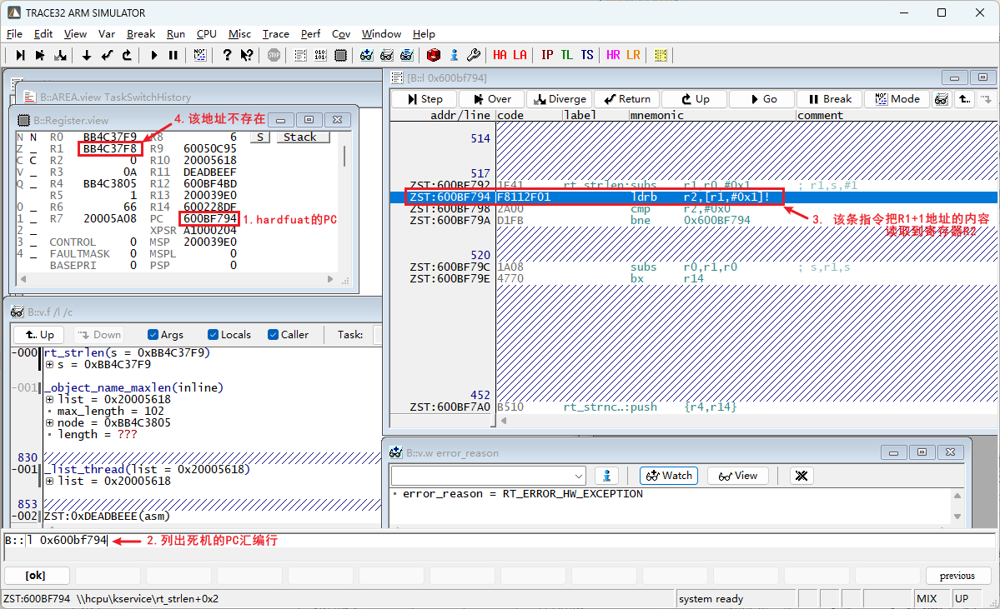<br>  
## 6.3 用Trace32恢复LCPU死机现场
与HCPU的恢复现场类似，选择LA按钮，按提示操作即可。 需要注意的是LCPU 多了rom axf的同步加载，可以按需要勾选。
<br>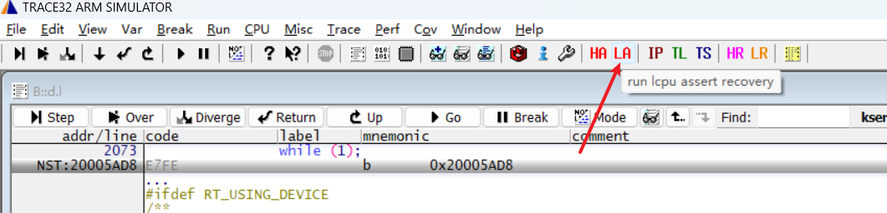<br>  

## 6.4 Trace32常用命令
1， 菜单：View->List Soure，调出查看源码窗口，或者命令L 10063c或者l 0x10063c， 可以查看PC指针为0x10063c的代码。<br>
2， 菜单：VarT->View, 或者命令：v.v * ，调出查看变量窗口，可以查找变量，函数，支持*通配符，如如下图：
<br><br>  
3， 菜单：CPU->CPU Registers,或者命令：r ，调出寄存器窗口，修改寄存器值。<br>
4， 菜单：View->Dump...,或者命令：data.dump，调出查看内存地址窗口，比如输入框内输入0x200c0000，可以查看0x200c0000的内存情况，或者命令：data.dump 0x200c0000查看0x200c0000内存。<br>
5，菜单：View->StackFrame with locals， 或者命令：frame /locals /caller ，查看调用栈和本地变量。<br>
6， 可以命令执行tools\crash_dump_analyser\script\下面的脚本，如下图： <br>
```
show_app_pages.cmm
show_heap.cmm
show_heap_lcpu.cmm
show_heap2.cmm
show_isr_history.cmm
show_reg.cmm
show_rt_memheap.cmm
show_running_app.cmm
show_switch_history.cmm
show_tasks.cmm
show_timer.cmm
switch_task.cmm
switch_to.cmm
``` 
对应命令:<br> 
`do show_tasks` #显示所有线程，有显示运行状态和压栈地址和优先级，如下图：
<br>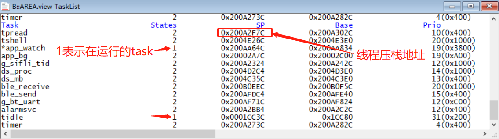<br> 
`do switch_to 0x200A2F7C` #可以命令切换其他线程，如下图，切换到TP线程：
<br>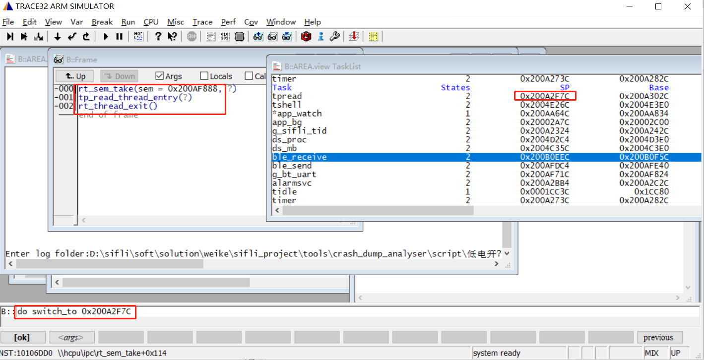<br> 
`do show_switch_history` #可以查看线程切换历史。<br>
`do show_timer` #可以查看timer的使用情况。<br>

7,内存地址强制转为结构体的方法：<br>
结构体 `struct rt_pm _pm;`<br>
转换命令：`(struct rt_pm *)0x101fa2b9 `<br>
如下图：<br>
<br>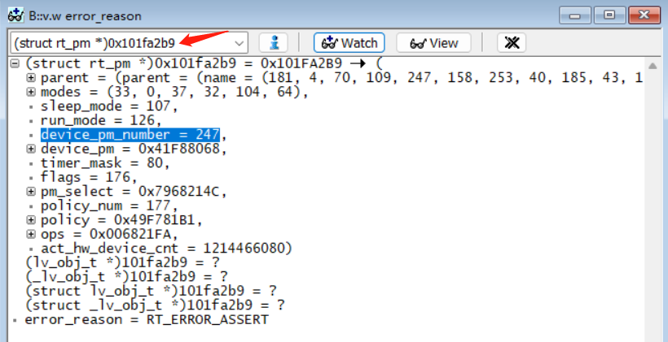<br>  
8,内存地址强制转为uint8，uint16等变量的方法：<br>
`(uint16_t *)0x101fa2b9`
<br>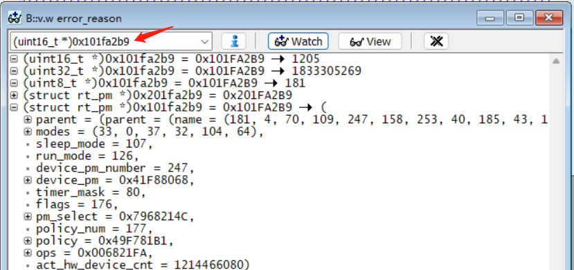<br>  

## 6.5 Trace32工程路径重定位
1，trace32恢复dump出来的内存文件在不同电脑恢复现场，会出现如下只显示汇编无法显示C语言的情况：<br>
原因是执行save_ram_a0.bat进行dump内存工程的路径，跟你trace32复现路径工程所在位置不一致。<br>
<br>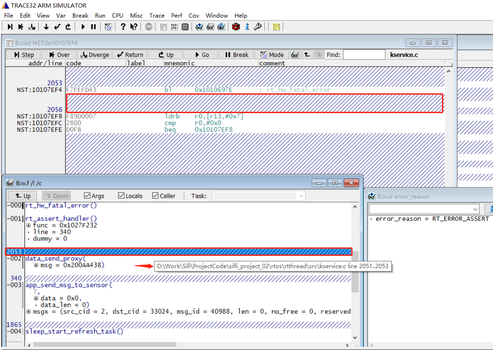<br>  
2，我们可以采用重定位工程路径的方式来解决这个问题，如下图：
<br>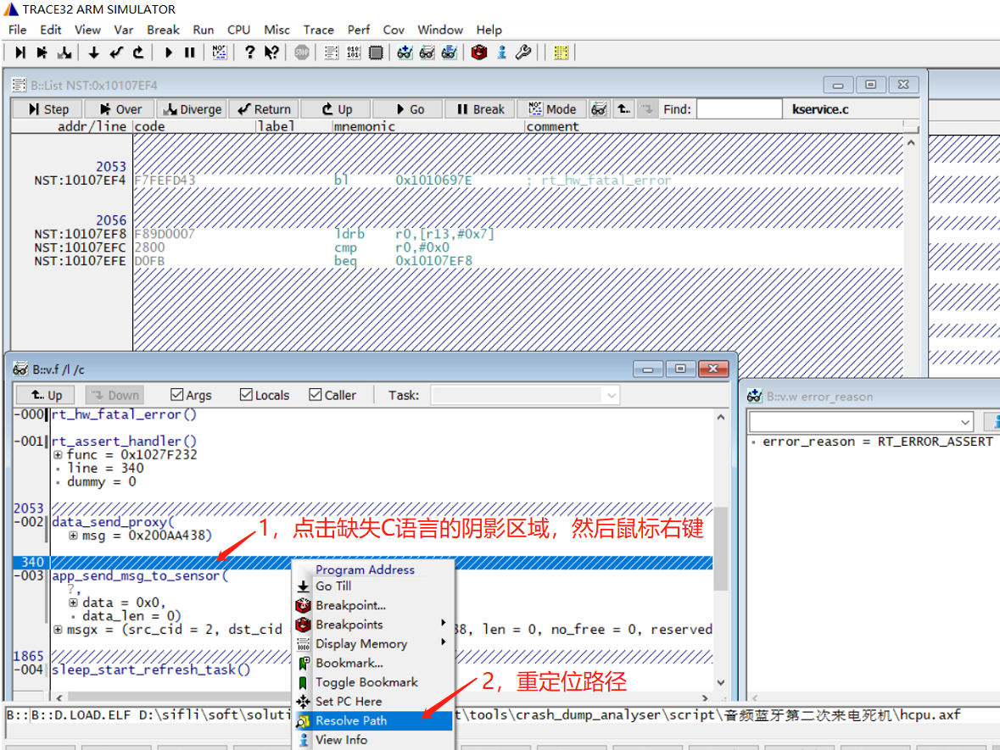<br>  
选择对应c文件所在的工程路径，选择这一个文件后，所有工程路径，都进行了重定位，如下图：
<br><br>  
3，重定位的trace32界面如下：除了在lib中的代码，都能显示出C语言代码。
<br>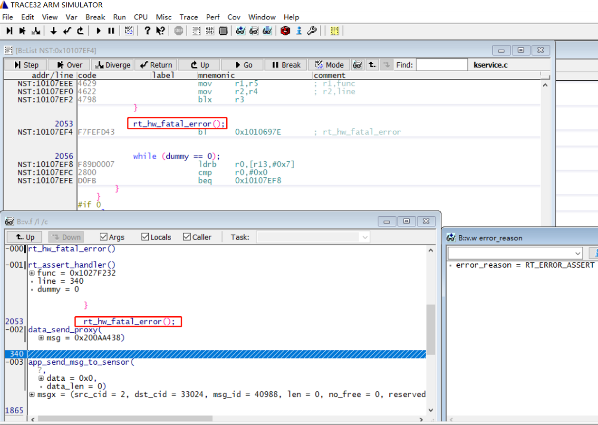<br>  
