# SF32LB52x-硬件设计指南

:::{attention}
本文档适配后缀为数字0、3、5、7的芯片，使用锂电池供电，支持USB充电。

对于后缀为字母B、E、G、J、H的芯片，属于SF32LB52X系列,使用3.3V供电。应该参照[硬件设计指南](/hardware/SF32LB52B-E-G-J-HW-Application)
:::


## 基本介绍

本文的主要目的是帮助开发人员完成基于SF32LB52x系列芯片的手表方案开发。本文重点介绍方案开发过程中的硬件设计相关注意事项，尽可能的减少开发人员工作量，缩短产品的上市周期。

SF32LB52x是一系列用于超低功耗人工智能物联网（AIoT）场景下的高集成度、高性能MCU芯片。芯片采用了基于Arm Cortex-M33 STAR-MC1处理器的大小核架构，集成高性能2D/2.5D图形引擎，人工智能神经网络加速器，双模蓝牙5.3，以及音频CODEC，可广泛用于腕带类可穿戴电子设备、智能移动终端、智能家居等各种应用场景。

:::{attention}
SF32LB52x是SF32LB52系列的**锂电池供电版本，供电电压3.2~4.7V，支持充电**，具体包含如下型号： \
SF32LB520U36，合封1MB QSPI-NOR Flash \
SF32LB523UB6，合封4MB OPI-PSRAM \
SF32LB525UC6，合封8MB OPI-PSRAM \
SF32LB527UD6，合封16MB OPI-PSRAM
:::

处理器外设资源如下：

- 44x GPIO
- 3x UART
- 4x I2C
- 2x GPTIM
- 2x SPI
- 1x I2S音频接口
- 1x SDIO 存储接口
- 1x PDM音频接口
- 1x 差分模拟音频输出
- 1x 单端模拟音频输入
- 支持单/双/四数据线SPI显示接口，支持串行JDI模式显示接口
- 支持带GRAM和不带GRAM的两种显示屏
- 支持UART下载和软件调试


## 封装


<div align="center"> 表2-1 封装信息表 </div>

```{table}

|封装名称|尺寸|管脚间距|
|:--|:-|:-|
|QFN68L | 7x7x0.85 mm | 0.35 mm |
```


  

<div align="center"> 图2-1 QFN68L管脚分布 </div>  <br> <br> <br>


## 典型应用方案

下图是典型的SF32LB52x运动手表组成框图，主要功能有显示、存储、传感器、震动马达和音频输入和输出。

<!-- 这里的图片有问题，需要替换为B3版本的框图 -->
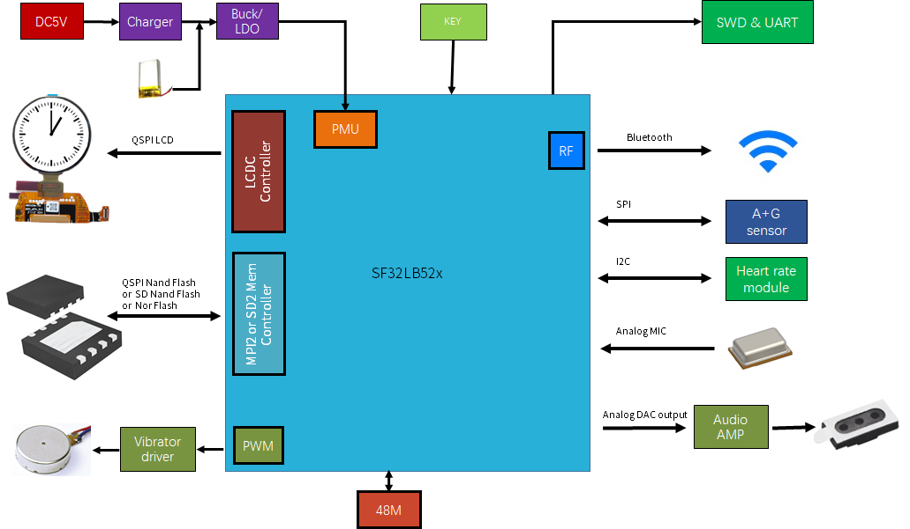  

<div align="center"> 图3-1 运动手表组成框图 </div>   <br>  <br>  <br>


:::{Note} 

   - 大小核双CPU架构，同时兼顾高性能和低功耗设计要求
   - 片内集成充电管理和PMU模块
   - 支持QSPI接口的TFT或AMOLED显示屏，最高支持512*512分辨率
   - 支持PWM背光控制
   - 支持外接QSPI Nor/Nand Flash和SD Nand Flash存储芯片
   - 支持双模蓝牙5.3
   - 支持模拟音频输入
   - 支持模拟音频输出
   - 支持PWM震动马达控制
   - 支持SPI/I2C接口的加速度/地磁/陀螺仪传感器
   - 支持SPI/I2C接口的心率/血氧/心电图/地磁传感器
   - 支持UART调试打印接口和烧写工具
   - 支持蓝牙HCI调试接口
   - 支持产线一拖多程序烧录
   - 支持产线校准晶体功能
   - 支持OTA在线升级功能
:::


## 原理图设计指导

### 电源

#### 处理器供电要求

<div align="center"> 表4-1 电源供电要求 </div>

```{table}

|电源管脚| 最小电压(V) | 典型电压(V) | 最大电压(V) | 最大电流(mA) |   详细描述 |
|:--|:--|:--|:--|:--|:----------------------------------------------------|
|VBUS       |4.6    |5.0    |5.5    |500    |VBUS电源输入 
|VBAT       |3.2    |-      |4.7    |500    |VBAT电源输出
|VCC        |3.2    |-      |4.7    |500    |系统电源输入{sup}`(1)` 
|VSYS       |-      |3.3    |-      |500    |VSYS电源输出{sup}`(2)` 
|BUCK_LX    |-      |1.25   |-      |50     |BUCK输出脚，接电感 
|BUCK_FB    |-      |1.25   |-      |50     |BUCK反馈和内部电源输入脚，接电感另一端，且外挂电容 
|VDD_VOUT1  |-      |1.1    |-      |50     |内部LDO，外挂电容，内部电源，不给外设供电 
|VDD_VOUT2  |-      |0.9    |-      |20     |内部LDO，外挂电容，内部电源，不给外设供电 
|VDD_RET    |-      |0.9    |-      |1      |内部LDO，外挂电容，内部电源，不给外设供电 
|VDD_RTC    |-      |1.1    |-      |1      |内部LDO，外挂电容，内部电源，不给外设供电 
|VDD18_VOUT |-      |1.8    |-      |30     |SIP电源{sup}`(3)` 内部电源，不给外设供电，关闭LDO时，可以外供
|VDD33_VOUT1|-      |3.3    |-      |150    |3.3V LDO 输出1{sup}`(4)`，默认无输出，需要软件配置才有3.3V输出
|VDD33_VOUT2|-      |3.3    |-      |150    |3.3V LDO 输出2，默认无输出，需要软件配置才有3.3V输出
|AVDD33_AUD |2.97   |3.3    |3.63   |50     |3.3V音频电源输入 
|AVDD_BRF   |2.97   |3.3    |3.63   |100    |射频电源输入 
|MIC_BIAS   |1.4    |-      |2.8    |-      |MIC电源输出 
```
:::{note} 

{sup}`(1)` VCC电源输入，锂电池供电，默认软件设置低电电压=3.48V；恒压电源供电时，供电范围3.6~4.7V，推荐3.8V供电 

{sup}`(2)` VSYS电源，给AVDD_BRF供电 

{sup}`(3)` VDD18_VOUT电源 \
SF32LB520U36，外供3.3V电源 \
SF32LB523UB6，SF32LB525UC6，SF32LB527UD6，使用内部LDO，不需要外供电源 \
软件设置时要根据芯片型号来配置内部的VDD18 LDO，外供电源时，不要开启 

{sup}`(4)` VDD33_VOUT1电源 \
SF32LB520U36，只给VDD18_VOUT、外挂Flash和AVDD33_AUD供电 \
SF32LB523UB6，SF32LB525UC6，SF32LB527UD6，只给外挂Flash和AVDD33_AUD供电 
:::

#### 处理器BUCK电感选择要求

**功率电感关键参数**
:::{important}
L(电感值) = 4.7uH ± 20%，DCR(直流阻抗) ≦ 0.4 ohm，Isat(饱和电流) ≧ 450mA。
:::

<!-- A3版本要增加电池及充电控制 -->
#### 电池及充电控制

充电电路有两种使用情景：外部充电管理芯片和片内集成充电管理模块。

##### 外部充电管理芯片

外部充电管理芯片分为两种类型：一种是不带PPM（电源路径管理）功能，一种是带PPM功能。图4-1是使用不带PPM功能的充电芯片的典型充电电路图，电池直接给SF32LB52x的VBAT和VCC管脚供电。图4-2是使用带PPM功能的充电芯片的典型充电电路图，充电芯片的VSYS给SF32LB52x的VCC管脚供电，充电芯片的VBAT连接到电池和SF32LB52xVBAT管脚。这两种方案都是通过SF32LB52x的VBAT管脚来测量电池的电压值。VBAT管脚内部集成了一路GPADC，可以采集VBAT的电压值，采样精度+/-30mV以内。

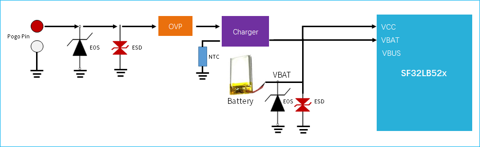  

<div align="center"> 图4-1 不带PPM功能的外部充电芯片电路示意图 </div>   <br>  <br>  <br>

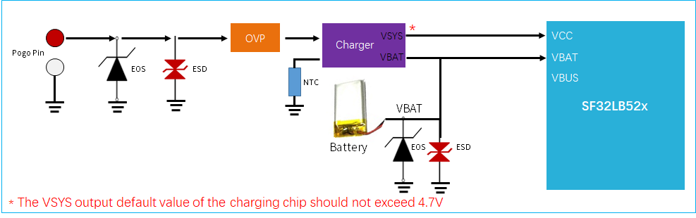  

<div align="center"> 图4-2 带PPM功能的外部充电芯片电路示意图 </div>   <br>  <br>  <br>

##### 片内集成充电管理模块

使用SF32LB52x的片内集成充电管理模块时，如图4-3所示，当电池电量低并关机时，插入充电器后，需要把电池充电到开机电压后，系统才可以正常启动并显示充电界面。

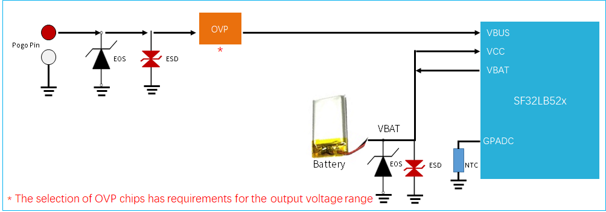  

<div align="center"> 图4-3 集成充电管理电路示意图 </div>   <br>  <br>  <br>

##### 使用片内集成充电管理模块时OVP芯片的选型

SF32LB52x VBUS管脚输入电压范围：4.5V ~ 5.5V，所以只能选择下面两个类型的OVP芯片
- 带OVLO可调的OVP芯片，参考芯片型号AW32905FCR
- 带Regulator输出的OVP芯片，参考芯片型号SGM4064YDE8G，LP5305AQVF

图4-4是带OVLO可调的OVP芯片的典型应用电路图，其中OVP芯片的输出电压VIN_OVLO要设定为5.2V~5.5V之间，计算时要考虑芯片和电阻的误差。具体公式为：
  <br>  <br>

**要求：其中VOVLO_TH要求误差≦3%，R1和R2的电阻误差≦1%**

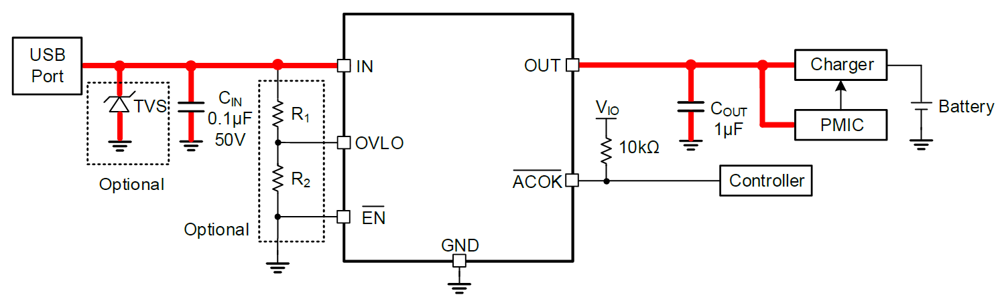  

<div align="center"> 图4-4 带OVLO可调的OVP芯片应用电路图 </div>   <br>  <br>  <br>

图4-5是Regulator输出的OVP芯片的典型应用电路图，其中OVP芯片的Regulator固定输出小于5.5V，用来给SF32LB52x的VBUS管脚供电。

**要求：OVP芯片的LDO输出电压在4.5V ~ 5.4V**

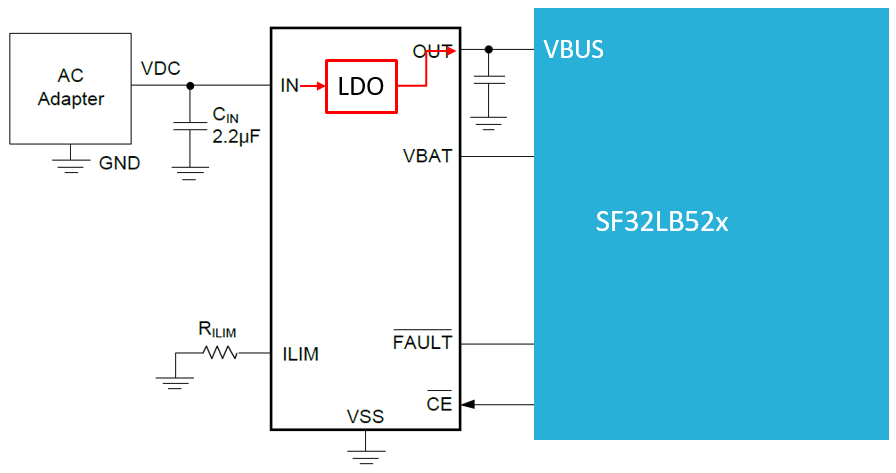  

<div align="center"> 图4-5 带Regulator输出的OVP芯片应用电路图 </div>   <br>  <br>  <br>

##### 内部充电管理模块及集成LDO使用注意事项

:::{important}
**SF32LB52x内部集成充电管理模块使用注意事项：**
- VBUS的输入电压范围：4.6V~5.5V
- VCC的输入电压范围：3.2V~4.7V
- Charger默认的涓流电流是56mA
- Charger默认的涓流到恒流的转变电压值是3.0V
- Charger默认的恒流电流是65mA，支持调整，调整范围5~560mA
- Charger默认的充满电压是4.2V，支持调整，最高支持4.45V满电电压
- Charger的复充电压为满电电压值-0.15V
- 充电器VBUS上至少要提供350mA的供电能力
- 注意VBUS路径上的直流阻抗，不易过大，整个充电过程中最大电流时，芯片VBUS管脚的电压值不能低于4.6V
- 采用无线充时，请确保无线充的供电能力大于恒流充电电流。

**SF32LB52x集成LDO使用注意事项：**
- 内部集成的VDD33_VOUT1，VDD33_VOUT2的输出路径上，电容之和不能超过9.6uF
- AVDD33_AUD只能使用VDD33_VOUT1供电，不能使用VSYS
- LCD不能使用内部LDO供电，需要使用外部LDO供电
:::

#### 如何降低待机功耗

为了满足手表产品的长续航要求，建议硬件设计上利用负载开关对各个功能模块进行动态电源管理；如果是常开的模块或通路，选择合适的器件以降低静态电流。

如图4-6所示，SF32LB52x系统的典型电源结构图中，推荐VDD33_VOUT2给Motor供电，VDD33_VOUT1给外部Flash和Sensor等外设供电，LCD采用外加的LDO供电。

设计时要注意控制电源开关的GPIO管脚的硬件默认状态，同时增加M级阻值的上下拉电阻，保证负载开关默认关闭。

电源器件选型上，LDO和Load Switch 芯片要选择静态电流Iq和关断电流Istb都小的器件，特别是常开的电源芯片一定要关注下Iq参数。

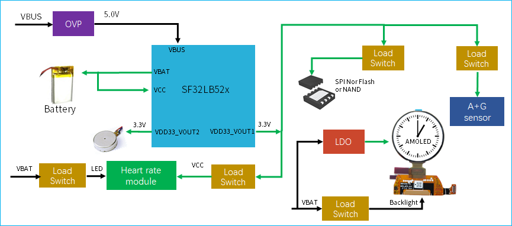  

<div align="center"> 图4-6 SF32LB52x系统电源结构图 </div>   <br>  <br>  <br>


### 处理器工作模式及唤醒源

<div align="center"> 表4-4 CPU Mode Table </div>

```{table}

|工作模式|CPU |外设  |SRAM |IO   |LPTIM |唤醒源 |唤醒时间 |
|:--|:-------|:----|:----|:----|:---- |:---- |:----   |
|Active |Run |Run |可访问 |可翻转 |Run |- |- |
|Sleep |Stop |Run |可访问 |可翻转 |Run |任意中断 |<0.5us |
|DeepSleep |Stop |Stop |不可访问，全保留 |电平保持 |Run |RTC，唤醒IO，GPIO，LPTIM，蓝牙 |250us |
|Standby |Reset |Reset |不可访问，全保留 |电平保持 |Run |RTC，唤醒IO，LPTIM，蓝牙 |1ms |
|Hibernate |Reset |Reset |不可访问，不保留 |高阻 |Reset |RTC，唤醒IO |>2ms |
```

如表4-5所示，全系列芯片支持15个Standby和Hibernate模式下可唤醒中断源。

<div align="center">表4-5 Interrupt wake up source Table </div>

```{table}

|中断源|管脚   |详细描述  |
|:--|:-------|:--------|
|LWKUP_PIN0 |PA24 |中断信号0 |
|LWKUP_PIN1 |PA25 |中断信号1 |
|LWKUP_PIN2 |PA26 |中断信号2 |
|LWKUP_PIN3 |PA27 |中断信号3 |
|LWKUP_PIN10 |PA34 |中断信号10 |
|LWKUP_PIN11 |PA35 |中断信号11 |
|LWKUP_PIN12 |PA36 |中断信号12 |
|LWKUP_PIN13 |PA37 |中断信号13 |
|LWKUP_PIN14 |PA38 |中断信号14 |
|LWKUP_PIN15 |PA39 |中断信号15 |
|LWKUP_PIN16 |PA40 |中断信号16 |
|LWKUP_PIN17 |PA41 |中断信号17 |
|LWKUP_PIN18 |PA42 |中断信号18 |
|LWKUP_PIN19 |PA43 |中断信号19 |
|LWKUP_PIN20 |PA44 |中断信号20 |
```

### 时钟
芯片需要外部提供2个时钟源，48MHz主晶体和32.768KHz RTC晶体，晶体的具体规格要求和选型如下：

:::{important}

<div align="center"> 表4-6 晶体规格要求 </div>

```{table}
:align: center
|晶体|晶体规格要求   |详细描述  |
|:--|:-------|:--------|
|48MHz |7pF≦CL≦12pF（推荐值8.8pF） △F/F0≦±10ppm ESR≦30 ohms（推荐值22ohms）|晶振功耗和CL,ESR相关,CL和ESR越小功耗越低，为了最佳功耗性能，建议采用CL和ESR在要求范围内相对较小值的物料。晶体旁边预留并联匹配电容,当CL<12pF时，无需焊接电容|
|32.768KHz |CL≦12.5pF（推荐值7pF）△F/F0≦±20ppm ESR≦80k ohms（推荐值38Kohms）|晶振功耗和CL,ESR相关,CL和ESR越小功耗越低，为了最佳功耗性能，建议采用CL和ESR在要求范围内相对较小值的物料。晶体旁边预留并联匹配电容,当CL<12.5pF时，无需焊接电容|
```

<div align="center"> 表4-7 推荐晶体列表 </div>

```{table}

|型号|厂家   |参数  |
|:---|:-------|:--------|
|E1SB48E001G00E  |Hosonic     |F0 = 48.000000MHz，△F/F0 = -6 ~ 8 ppm，CL = 8.8 pF，ESR = 22 ohms Max TOPR = -30 ~ 85℃，Package =（2016 公制）|
|ETST00327000LE  |Hosonic     |F0 = 32.768KHz，△F/F0 = -20 ~ 20 ppm，CL = 7 pF，ESR = 70K ohms Max TOPR = -40 ~ 85℃，Package =（3215 公制）|
|SX20Y048000B31T-8.8  |TKD    |F0 = 48.000000MHz，△F/F0 = -10 ~ 10 ppm，CL = 8.8 pF，ESR = 40 ohms Max TOPR = -20 ~ 75℃，Package =（2016 公制）|
|SF32K32768D71T01  |TKD       |F0 = 32.768KHz，△F/F0 = -20 ~ 20 ppm，CL = 7 pF，ESR = 70K ohms Max TOPR = -40 ~ 85℃，Package =（3215 公制）|
```
**
注：SX20Y048000B31T-8.8的ESR略大，静态功耗也会略大些。
PCB走线时，在晶体下面至少挖掉第二层的GND铜来减少时钟信号上的寄生负载电容。
**
:::

详细的物料认证信息，请参考：
[SIFLI-MCU-AVL-认证表](index)

### 射频

射频走线要求为50ohms特征阻抗。如果天线是匹配好的，射频上无需再增加额外器件。设计时建议预留π型匹配网络用来杂散滤波或天线匹配。

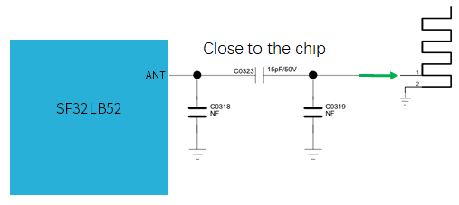  

<div align="center"> 图4-7 射频电路图 </div>   <br>  <br>  <br>


### 显示

芯片支持3-Line SPI、4-Line SPI、Dual data SPI、Quad data SPI和串行JDI 接口。支持16.7M-colors（RGB888）、262K-colors（RGB666）、65K-colors（RGB565）和 8-color（RGB111）Color depth模式。最高支持512RGBx512分辨率。LCD driver支持列表如表4-8所示。

<div align="center"> 表4-8 LCD driver支持列表 </div>

```{table}

| 型号   | 厂家  | 分辨率  | 类型   | 接口 |
| :-- | :-- | :-- | :-- | :-- |
| RM69090  | Raydium    | 368*448 | Amoled | 3-Line SPI，4-Line  SPI，Dual data SPI，  Quad data SPI，MIPI-DSI |
| RM69330  | Raydium    | 454*454 | Amoled | 3-Line SPI，4-Line  SPI，Dual data SPI，  Quad data SPI，8-bits  8080-Series MCU ，MIPI-DSI |
| ILI8688E | ILITEK     | 368*448 | Amoled | Quad data SPI，MIPI-DSI                                      |
| SH8601A  | 晟合技术    | 454*454 | Amoled | 3-Line SPI，4-Line  SPI，Dual data SPI，  Quad data SPI，8-bits  8080-Series MCU ，MIPI-DSI |
| SPD2012  | Solomon    | 356*400 | TFT    | Quad data SPI                                                |
| GC9C01   | Galaxycore | 360*360 | TFT    | Quad data SPI                                                |
| GC9B71   | Galaxycore | 320*380 | TFT    | Quad data SPI                                                |
| ST77903  | Sitronix   | 400*400 | TFT    | Quad data SPI                                                |
| ICNA3311 | Chipone    | 454*454 | Amoled | Quad data SPI                                                |
| FT2308   | FocalTech  | 410*494 | Amoled | Quad data SPI                                                |
```


#### SPI/QSPI显示接口

芯片支持 3/4-wire SPI和Quad-SPI 接口来连接LCD显示屏，各信号描述如下表所示。

<div align="center"> 表4-9 SPI/QSPI 信号连接方式 </div>

```{table}

|spi信号|管脚   |详细描述  |
|:--|:-------|:--------|
|CSx |PA03 |使能信号 |
|WRx_SCL |PA04 |时钟信号 |
|DCx |PA06 |4-wire SPI 模式下的数据/命令信号Quad-SPI 模式下的数据1  |
|SDI_RDx |PA05 |3/4-wire SPI 模式下的数据输入信号Quad-SPI 模式下的数据0  |
|SDO |PA05 |3/4-wire SPI 模式下的数据输出信号请和SDI_RDX短接到一起 |
|D[0] |PA07 |Quad-SPI 模式下的数据2 |
|D[1] |PA08 |Quad-SPI 模式下的数据3 |
|RESET |PA00 |复位显示屏信号 |
|TE |PA02 |Tearing effect to MCU frame signal |
```

#### JDI显示接口

芯片支持并行JDI接口来连接LCD显示屏，如下表所示。

<div align="center"> 表4-10 并行JDI屏信号连接方式 </div>

```{table}


| JDI信号  | I/O  | 详细描述   |
|:--|:-------|:--------|
| JDI_VCK  | PA39 | Shift clock for the vertical driver                  |
| JDI_VST  | PA08 | Start signal for the vertical driver                 |
| JDI_XRST | PA40 | Reset signal for the horizontal and  vertical driver |
| JDI_HCK  | PA41 | Shift  clock for the horizontal driver               |
| JDI_HST  | PA06 | Start signal for the horizontal driver               |
| JDI_ENB  | PA07 | Write enable signal for the pixel memory             |
| JDI_R1   | PA05 | Red image data (odd pixels)                          |
| JDI_R2   | PA42 | Red image data (even pixels)                         |
| JDI_G1   | PA04 | Green image data (odd pixels)                        |
| JDI_G2   | PA43 | Green image data (even pixels)                       |
| JDI_B1   | PA03 | Blue image data (odd pixels)                         |
| JDI_B2   | PA02 | Blue image data (even pixels)                        |
```


#### 触摸和背光接口

芯片支持I2C格式的触摸屏控制接口和触摸状态中断输入，同时支持1路PWM信号来控制背光电源的使能和亮度，如下表所示。

<div align="center"> 表4-11 触摸和背光控制连接方式 </div>

```{table}

| 触摸屏和背光信号 | 管脚 | 详细描述                   |
| ---------------- | ---- | -------------------------- |
| Interrupt        | PA43 | 触摸状态中断信号（可唤醒） |
| I2C1_SCL         | PA42 | 触摸屏I2C的时钟信号        |
| I2C1_SDA         | PA41 | 触摸屏I2C的数据信号        |
| BL_PWM           | PA01 | 背光PWM控制信号            |
| Reset            | PA44 | 触摸复位信号               |
```

### 存储
#### 存储器连接接口描述
芯片支持外挂SPI Nor Flash、SPI NAND Flash、SD NAND Flash和eMMC 四种存储介质。

<div align="center"> 表4-12 SPI Nor/Nand Flash信号连接 </div>

```{table}

| Flash 信号 | I/O信号 | 详细描述                                    |
| ---------- | ------- | ------------------------------------------- |
| CS#        | PA12    | Chip select, active low.                    |
| SO         | PA13    | Data Input (Data Input Output 1)            |
| WP#        | PA14    | Write Protect Output (Data Input Output  2) |
| SI         | PA15    | Data Output (Data Input Output 0)           |
| SCLK       | PA16    | Serial Clock Output                         |
| Hold#      | PA17    | Data Output (Data Input Output 3)           |
```


<div align="center"> 表4-13 SD Nand Flash和eMMC信号连接 </div>

```{table}

| Flash 信号 | I/O信号 | 详细描述 |
| ---------- | ------- | -------- |
| SD2_CMD    | PA15    | 命令信号 |
| SD2_D1     | PA17    | 数据1    |
| SD2_D0     | PA16    | 数据0    |
| SD2_CLK    | PA14    | 时钟信号 |
| SD2_D2     | PA12    | 数据2    |
| SD2_D3     | PA13    | 数据3    |
```
:::{note}
eMMC芯片有VCC和VCCQ两种电源域，方式1：可以2个电源一起做控制，关机功耗低，但eMMC在sleep时恢复慢，CPU平均功耗高；方式2：可以单独控制VCC，VCCQ常供不断电，关机功耗比方式1高，但eMMC在sleep时恢复快，CPU平均功耗比方式1低。
:::

#### 启动设置

芯片支持内部合封Spi Nor Flash、外挂Spi Nor Flash、外挂Spi Nand Flash和外挂SD Nand Flash启动。其中：
- SF32LB520Ux6 内部合封有flash，默认从内部合封flash启动
- SF32LB523/5/7Ux6 内部合封psram，必须从外挂的存储介质启动


<!-- 这里的图片需要修改，A3和B3要不同的版本 -->

  

<div align="center"> 图4-8 Bootstrap管脚推荐电路图 </div>   <br>  <br>  <br>

<!-- eMMC只有B3支持，A3要删除 -->
<div align="center"> 表4-14 启动选项设置 </div>

```{table}

|Bootstrap[1] (PA13) |Bootstrap[0] (PA17)    |Boot From ext memory  |
| ------------ | ------------ | -------------- |
| L            | L            | SPI Nor Flash  |
| L            | H            | SPI Nand Flash |
| H            | X            | SD Nand Flash  |
```

#### 启动存储介质电源控制
芯片支持对启动存储介质的电源开关控制，以降低关机功耗。电源开关的使能管脚必须使用PA21来控制，开关的使能电平要求是[高打开，低关闭]。

:::{important}
- SF32LB520Ux6 内部合封有flash，请给请使用VDD33_VOUT1给VDD18_VOUT供电，并且设置VDD18_VOUT内部的LDO为关闭状态。
- SF32LB523/5/7Ux6 内部合封psram，使用内部的LDO供电，VDD18_VOUT外挂电源即可。
- 外供存储介质是Nor Flash时，使用VDD33_VOUT1供电，中间无需额外增加电源开关。
- 外供存储介质是SPI Nand、SD Nand时，使用VDD33_VOUT1供电，需要增加电源开关。
- 参考设计中，PA13和PA17都预留了上拉电阻位置，根据存储介质类型选择上拉电阻，电阻推荐7.5K。
:::

### 按键
#### 开关机按键
芯片的PA34支持长按复位功能，可以设计成按键，实现开关机+长按复位功能。PA34的长按复位功能要求高电平有效，所以设计成默认下拉为低，按键按下后电平为高，如图4-9所示。

  

<div align="center">图4-9 开关机按键电路图 </div>   <br>  <br>  <br>


#### 机械旋钮按键

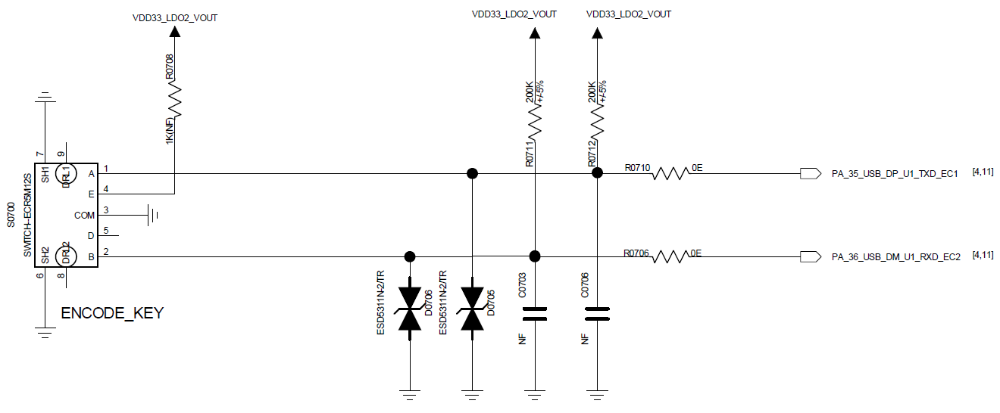  

<div align="center">图4-10 开关机按键电路图 </div>   <br>  <br>  <br>

### 振动马达

芯片支持PWM输出来控制振动马达。

<!-- 这里的内容需要A3和B3做区别处理 -->
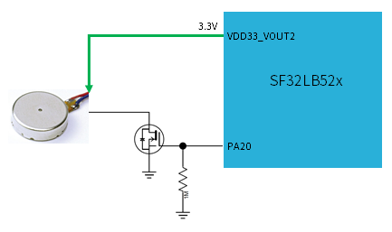  

<div align="center"> 图4-11 振动马达电路图 </div>  <br> <br> <br>


### 音频接口

芯片的音频相关接口，如表4-15所示，音频接口信号有以下特点：
1.	支持一路单端ADC输入，外接模拟MIC，中间需要加容值至少2.2uF的隔直电容，模拟MIC的电源接芯片MIC_BIAS电源输出脚；
2.	支持一路差分DAC输出，外接模拟音频PA， DAC输出的走线，按照差分线走线，做好包地屏蔽处理，还需要注意：Trace Capacitor < 10pF, Length < 2cm。

<div align="center"> 表4-15 音频信号连接方式 </div>

```{table}

|音频信号 |管脚   |详细描述 |
|:---|:---|:---|
|BIAS |MIC_BIAS |麦克风电源       |
|AU_ADC1P |ADCP |单端模拟MIC输入  |
|AU_DAC1P |DACP |差分模拟输出P    |
|AU_DAC1N |DACN |差分模拟输出N    |
```

模拟MEMS MIC推荐电路如图4-12所示，模拟ECM MIC 单端推荐电路如图4-13所示，其中MEMS_MIC_ADC_IN和ECM_MIC_ADC_IN连接到SF32LB52x的ADCP输入管脚。


  

<div align="center"> 图4-12 模拟MEMS MIC单端输入电路图 </div>   <br>  <br>  <br>


  

<div align="center"> 图4-13 模拟ECM单端输入电路图 </div>   <br>  <br>  <br>


模拟音频输出推荐电路如图4-14 所示，注意虚线框内的差分低通滤波器要靠近芯片端放置。


  

<div align="center"> 图4-14 模拟音频PA电路图 </div>   <br>  <br>  <br>


### 传感器

芯片支持心率、加速度和地磁等传感器。传感器的供电电源，选择Iq比较小的Load Switch来进行电源的开关控制。

### UART和I2C管脚设置

芯片支持任意管脚UART和I2C功能映射，所有的PA接口都可以映射成UART或I2C功能管脚。

### GPTIM管脚设置

芯片支持任意管脚GPTIM功能映射，所有的PA接口都可以映射成GPTIM功能管脚。

### 调试和下载接口

芯片支持DBG_UART接口用于下载和调试，通过3.3V接口的UART转USB Dongle板接PC机。

SWD接口和DGB_UART接口复用在PA18和PA19上，上电默认配置为DBG_UART功能。

DBG_UART支持单步调试，同时也支持log输出，具体参考SFtool和Impeller的使用手册。

<div align="center">表4-16 调试口连接方式 </div>

```{table}

|DBG信号 |管脚   |详细描述 |
|:---|:---|:---|
|DBG_UART_RXD |PA18 |Debug UART 接收 |
|DBG_UART_TXD |PA19 |Debug UART 发送 |
```

### 产线烧录和晶体校准

思澈科技提供脱机下载器来完成产线程序的烧录和晶体校准，硬件设计时，请注意至少预留测试点：PVDD、GND、AVDD33、DB_UART_RXD、DB_UART_RXD，PA01。

详细的烧录和晶体校准见“**_脱机下载器使用指南.pdf”文档，包含在开发资料包中。


### 原理图和PCB图纸检查列表

见“**_Schematic checklist_**.xlsx”和“**_PCB checklist_**.xlsx”文档，包含在开发资料包中。


## PCB设计指导

### PCB封装设计

SF32LB52x系列芯片的QFN68L封装尺寸：7mmX7mmx0.85mm；管脚数：68；PIN 间距：0.35mm。 详细尺寸如图5-1所示。

  

<div align="center"> 图5-1 QFN68L封装尺寸图 </div>   <br>  <br>  <br>


  

<div align="center"> 图5-2 QFN68L封装形状图 </div>   <br>  <br>  <br>


  

<div align="center"> 图5-3 QFN68L封装PCB焊盘设计参考图 </div>   <br>  <br>  <br>


### PCB叠层设计

SF32LB52x系列芯片支持单双面布局，器件可以放到单面，也可以把电容等放到芯片的背面。PCB支持PTH通孔设计，推荐采用4层PTH，推荐参考叠层结构如图5-4所示。

  

<div align="center"> 图5-4 参考叠层结构图 </div>   <br>  <br>  <br>


### PCB通用设计规则

PTH 板PCB通用设计规则如图5-5所示。

  

<div align="center"> 图5-5 通用设计规则 </div>   <br>  <br>  <br>


### PCB走线扇出

QFN封装信号扇出，所有管脚全部通过表层扇出，如图5-6所示。

  

<div align="center"> 如图5-6 表层扇出参考图 </div>   <br>  <br>  <br>


### 时钟接口走线

晶体需摆放在屏蔽罩里面，离PCB板框间距大于1mm,尽量远离发热大的器件，如PA，Charge，PMU等电路器件，距离最好大于5mm以上，避免影响晶体频偏，晶体电路禁布区间距大于0.25mm避免有其它金属和器件，如图5-7所示。

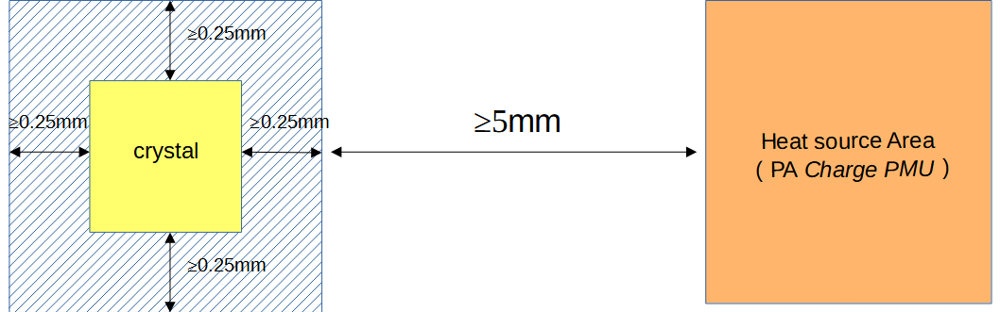  

<div align="center"> 图5-7 晶体布局图 </div>   <br>  <br>  <br>


48MHz晶体走线建议走表层，长度要求控制在3-10mm区间，线宽0.1mm，必须立体包地处理，并且远离VBAT、DC/DC及高速信号线。48MHz晶体区域下方表层及临层做禁空处理，禁止其它走线从其区域走，如图5-8，5-9，5-10所示。

  

<div align="center"> 图5-8 48MHz晶体原理图 </div>   <br>  <br>  <br>


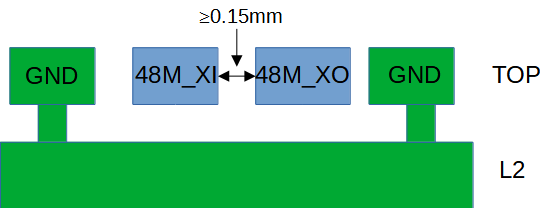  

<div align="center"> 图5-9 48MHz晶体走线模型 </div>   <br>  <br>  <br>


  

<div align="center"> 图5-10 48MHz晶体走线参考 </div>   <br>  <br>  <br>


32.768KHz晶体走线建议走表层，长度控制≤10mm，线宽0.1mm。32K_XI/32_XO平行走线间距≥0.15mm，必须立体包地处理。晶体区域下方表层及临层做禁空处理，禁止其它走线从其区域走，如图5-11，5-12，5-13所示。

  

<div align="center"> 图5-11 32.768KHz晶体原理图 </div>   <br>  <br>  <br>


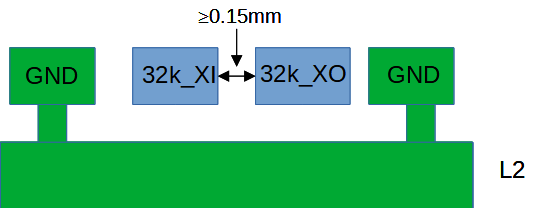  

<div align="center"> 图5-12 32.768KHz晶体走线模型 </div>   <br>  <br>  <br>


  

<div align="center"> 图5-13 32.768KHz晶体走线参考 </div>   <br>  <br>  <br>


### 射频接口走线

射频匹配电路要尽量靠近芯片端放置，不要靠近天线端。AVDD_BRF射频电源其滤波电容尽量靠近芯片管脚放置，电容接地管脚打孔直接接主地。RF信号的π型网络的原理图和PCB分别如图5-14，5-15所示。

  

<div align="center"> 图5-14 π型网络以及电源电路原理图 </div>   <br>  <br>  <br>


  

<div align="center"> 图5-15 π型网络以及电源PCB布局 </div>   <br>  <br>  <br>


射频走线建议走表层，避免打孔穿层影响RF性能，线宽最好大于10mil，需要立体包地处理，避免走锐角和直角。射频线做50欧阻抗控制，两边多打屏蔽地孔，如图5-16, 5-17所示。

  

<div align="center"> 图5-16 RF信号电路原理图 </div>   <br>  <br>  <br>


  

<div align="center"> 图5-17 RF信号PCB走线图 </div>   <br>  <br>  <br>


### 音频接口走线
AVDD33_AUD是音频的供电管脚，其滤波电容靠近对应管脚放置，这样滤波电容的接地脚可以良好地连接到PCB的主地。MIC_BIAS是给麦克风外设供电的电源输出管脚，其对应滤波电容靠近对应管脚放置。同样AUD_VREF管脚的滤波电容也靠近管脚放置，如图5-18a，5-18b所示。

  

<div align="center"> 图5-18a 音频相关电源滤波电路 </div>   <br>  <br>  <br>


  

<div align="center"> 图5-18b 音频相关电源滤波电路PCB参考走线 </div>   <br>  <br>  <br>


模拟信号输入ADCP管脚，对应电路器件尽量靠近芯片管脚放置，走线线长尽量短，做立体包地处理，远离其它强干扰信号，如图5-19a，5-19b所示。

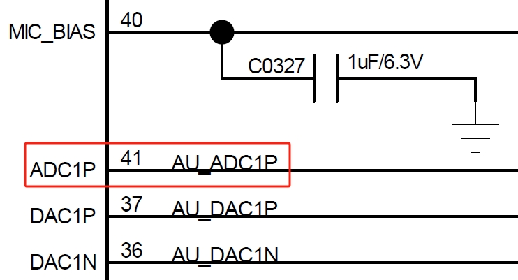  

<div align="center"> 图5-19a 模拟音频输入原理图 </div>   <br>  <br>  <br>


  

<div align="center"> 图5-19b 模拟音频输入PCB设计 </div>   <br>  <br>  <br>


模拟信号输出DACP/DACN管脚，对应电路器件尽量靠近芯片管脚放置，每一路P/N需要按照差分线形式走线，走线线长尽量短，寄生电容小于10pf，需做立体包地处理，远离其它强干扰信号，如图5-20a，5-20b所示。

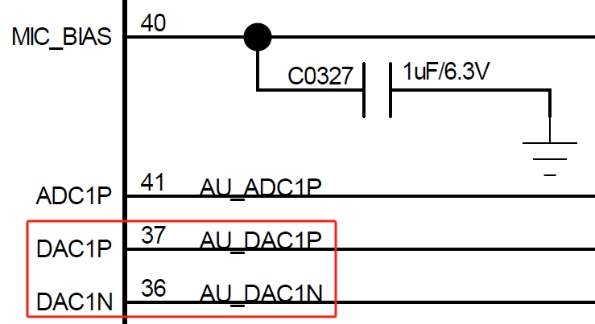  

<div align="center"> 图5-20a 模拟音频输出原理图 </div>   <br>  <br>  <br>


  

<div align="center"> 图5-20b 模拟音频输出PCB设计 </div>   <br>  <br>  <br>


### USB接口走线

USB走线PA35(USB DP)/PA36(USB_DN) 必须先过ESD器件管脚，然后再到芯片端，要保证ESD器件接地管脚能良好连接主地。走线需按照差分线形式走，并做90欧差分阻抗控制，且做立体包处理，如图5-21a，5-21b所示。


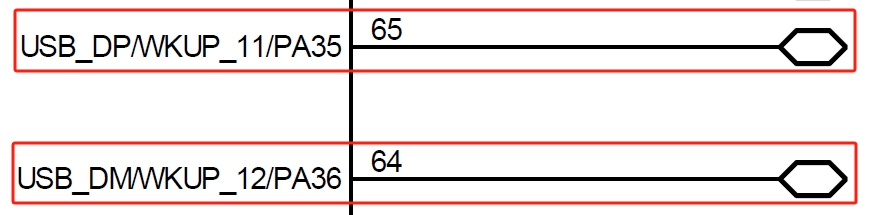  

<div align="center"> 5-21a USB信号原理图 </div>   <br>  <br>  <br>


  

<div align="center"> 5-21b USB信号PCB设计 </div>   <br>  <br>  <br>


图5-22a为USB信号的元件布局参考图，图5-22b为PCB走线模型。


  

<div align="center"> 图5-22a USB信号器件布局参考 </div>   <br>  <br>  <br>


  

<div align="center"> 图5-22b USB信号走线模型 </div>   <br>  <br>  <br>


### SDIO接口走线
SDIO信号走线尽量一起走，避免分开走，整个走线长度≤50mm, 组内长度控制≤6mm。SDIO接口时钟信号需立体包地处理，DATA和CMD信号也需要包地处理，如图5-23a，5-23b所示。

  

<div align="center"> 图5-23a SDIO接口电路图 </div>   <br>  <br>  <br>


  

<div align="center"> 图5-23b SDIO PCB走线模型 </div>   <br>  <br>  <br>


### DCDC电路走线
DC-DC电路功率电感和滤波电容必须靠近芯片的管脚放置。BUCK_LX走线尽量短且粗，保证整个DC-DC电路回路电感小；BUCK_FB管脚反馈线不能太细，必须大于0.25mm。所有的DC-DC输出滤波电容接地脚多打过孔连接到主地平面。功率电感区域表层禁止铺铜，临层必须为完整的参考地，避免其它线从电感区域里走线，如图5-24a，5-24b所示。

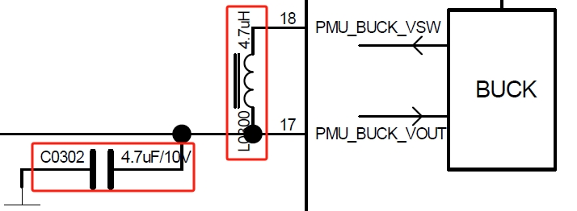  

<div align="center"> 图5-24a DC-DC关键器件电路图 </div>   <br>  <br>  <br>


  

<div align="center"> 图5-24b DC-DC关键器件PCB布局图 </div>   <br>  <br>  <br>


### 电源供电走线

VCC为芯片内置PMU 模块电源输入脚，对应的电容必须靠近管脚放置，走线尽量的粗，不能低于0.4mm，如图5-25a，5-25b所示。

<!-- 这里的内容需要A3和B3做区别处理 -->
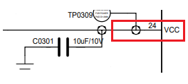  

<div align="center"> 图5-25a VCC电源走线图 </div>   <br>  <br>  <br>

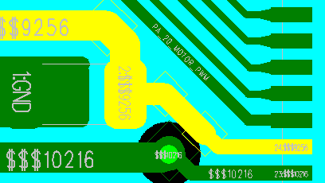  

<div align="center"> 图5-25b VCC电源走线图 </div>   <br>  <br>  <br>


VDD_VOUT1、VDD_VOUT2、VDD_RET、VDD_RTC、VDD18_VOUT、VDD33_VOUT1、VDD33_VOUT2、AVDD33_AUD和AVDD_BRF等管脚滤波电容靠近对应的管脚放置，其走线宽必须满足输入电流要求，走线尽量短粗，从而减少电源纹波提高系统稳定性。

<!-- A3版本需要增加充电部分内容 -->
### 充电电路走线

VBUS和VBAT 分别为芯片内置充电模块输入输出管脚，对应的滤波电容需要靠近管脚放置。由于充电回路电流比较大，管脚走线线宽最小0.4mm以上，禁止敏感线线与其平行走，避免充电时被干扰。走线采用星形走线不要与其它走线公用走线路径，避免充电时干扰其它电路模块。

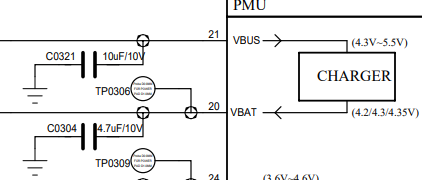  

<div align="center"> 图5-26a VBUS&VBAT电源走线图 </div>   <br>  <br>  <br>

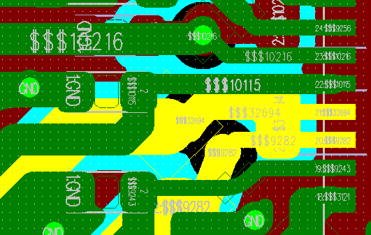  

<div align="center"> 图5-26b VBUS&VBAT电源走线图 </div>   <br>  <br>  <br>

### 其它接口走线

管脚配置为GPADC 管脚信号，必须要求立体包地处理，远离其它干扰信号，如电池电量电路，温度检查电路等。

### EMI&ESD
- 避免屏蔽罩外面表层长距离走线，特别是时钟、电源等干扰信号尽量走内层，禁止走表层。
- ESD保护器件必须靠近连接器对应管脚放置，信号走线先过ESD保护器件管脚，避免信号分叉，没过ESD保护管脚。
- ESD器件接地脚必须保证过孔连接主地，保证地焊盘走线短且粗，减少阻抗提高ESD器件性能。

### 其它

USB 充电线测试点必须放置在TVS 管前面，电池座TVS 管 放置在平台前面 其走线必须保证先过TVS 然后再到芯片端，如图5-27所示。

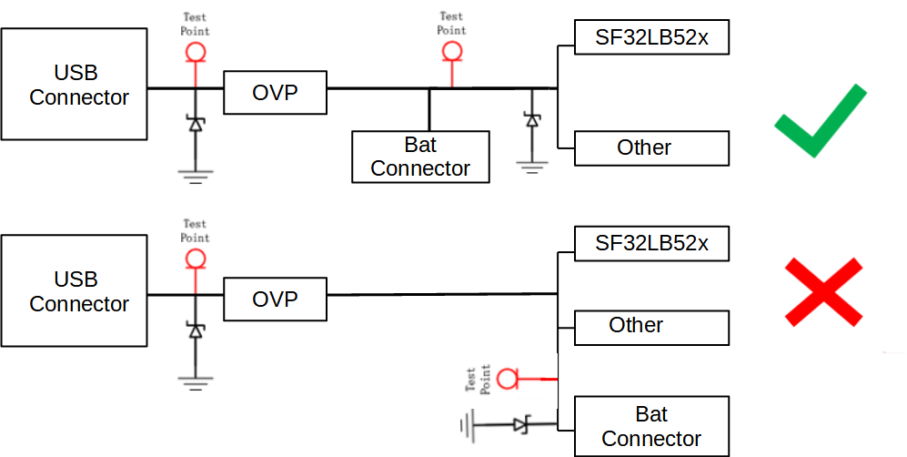  

<div align="center"> 图5-27 电源TVS布局参考 </div>   <br>  <br>  <br>

  

<div align="center"> 图5-28 TVS走线参考 </div>   <br>  <br>  <br>

TVS 管接地脚尽量避免走长线再连接到地，如图5-28所示。

## 修订历史

```{table}
:align: left
:name: sf32lb52X-B-history

|版本 |日期   |发布说明 |
|:---|:---|:---|
|0.0.1 |10/2024 |初始版本 |

```
