# SF32LB55x-硬件设计指南


## 基本介绍

本文的主要目的是帮助硬件工程师完成基于SF32LB55x系列芯片的原理图和PCB的设计。

SF32LB55x是一系列用于超低功耗人工智能物联网(AIoT) 场景下的高集成度、高性能的系统级(SoC) MCU芯片。芯片中的处理器能够很好地兼顾人机交互时的高计算性能与长时间待机时的超低运行与休眠功耗之间的平衡关系。可广泛用于腕带类可穿戴电子设备、智能移动终端、智能家居等各种应用场景。

本芯片集成了世界水平的低功耗蓝牙5.2收发机，接收灵敏度高，发射功率高，功耗低。

芯片提供了丰富的内部及外部存储资源。全封装芯片总共有多个QSPI存储接口，独立的OPI-PSRAM接口，以及SD/eMMC接口。并且针对不同的型号，芯片内部SIP有不同容量的NorFlash以及PSRAM组合。

为了便于更好地支持显示类应用，芯片提供了全方位的显示屏接口，其中包括8080，SPI/Dual-SPI/Quad-SPI，MIPI-DSI等。

## 封装

### 封装介绍

SF32LB55x 的封装信息如表2-1所示。

<div align="center"> 表2-1 封装信息列表 </div>

```{table}
:align: center
| 封装名称 | 尺寸        | 管脚间距 | 球直径  |
| -------- | ----------- | -------- | ------- |
| QFN68L   | 7x7x0.75 mm | 0.35 mm  | -       |
| BGA125   | 7x7x0.94 mm | 0.5 mm   | 0.25 mm |
| BGA145   | 7x7x0.94 mm | 0.5 mm   | 0.25 mm |
| BGA169   | 7x7x0.94 mm | 0.5 mm   | 0.25 mm |
```
### QFN68L封装

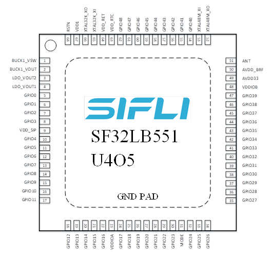

<div align="center"> 图2-1 QFN68L管脚分布 </div>  <br> <br> <br>

### BGA125封装

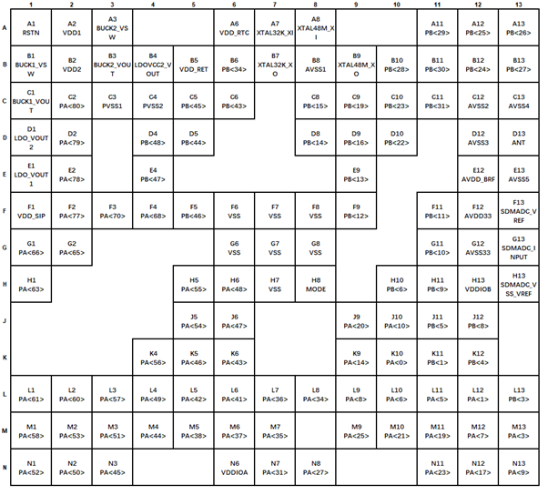

<div align="center"> 图2-2 BGA125管脚分布 </div>  <br> <br> <br>

### BGA145封装

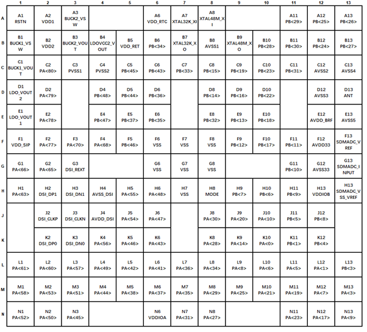

<div align="center"> 图2-3 BGA145管脚分布 </div>  <br> <br> <br>

### BGA169封装

BGA169封装有两种Ballmap，分别对应SF32LB557V8N6（已经EOL）和SF32LB557VD3A6。

SF32LB557VD3A6与SF32LB557V8N6相比，有6个Ballshi NC。

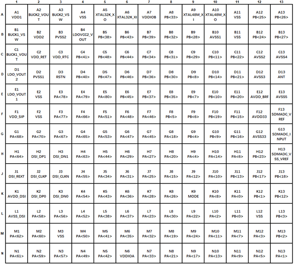

<div align="center"> 图2-4 SF32LB557V8N6 BGA169管脚分布 </div>  <br> <br> <br>

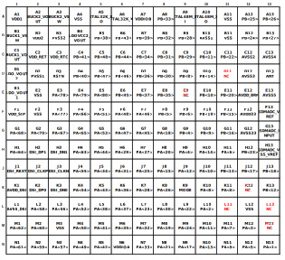

<div align="center"> 图2-5 SF32LB557VD3A6 BGA169管脚分布 </div>  <br> <br> <br>


## 原理图设计指导

### 电源

SF32LB55x系列芯片内置有PMU电源单元，支持2路BUCK输出，需要外接电感和电容再返回到芯片内部的电源输入。还有4个内部LDO电源需要芯片外面接电容。

#### 供电要求

SF32LB55x系列芯片的供电要求如表3-1，3-2，3-3，3-4，3-5所示。

<div align="center"> 表3-1 PMU供电规格 </div>

```{table}
:align: center
| PMU电源  管脚      | 最小电压(V) | 典型电压(V) | 最大电压(V) | 最大电流(mA) | 详细描述                                                    |
| ------------------ | ----------- | ----------- | ----------- | ------------ | ----------------------------------------------------------- |
| VDD1               | 1.71        | 1.8         | 3.6         | 50           | VDD1 电源输入                                              |
| VDD2               | 1.71        | 1.8         | 3.6         | 50           | VDD2 电源输入                                              |
| BUCK1_VSW  BUCK1_VOUT              | -           | 1.25        | -           | 50           | BUCK1 VSW输出，接电感内部电源输入1，接电感另一端，且外接电容 |
| BUCK2_VSW  BUCK2_VOUT  LDOVCC2_VOUT| -           | 0.9         | -           | 50           | BUCK2 VSW输出，接电感内部电源输入2，接电感另一端，且外接电容 |
| LDO_VOUT1          | -           | 1.1         | -           | 50           | LDO输出1，外接电容                                           |
| LDO_VOUT2          | -           | 0.9         | -           | 20           | LDO输出2，外接电容                                           |
| VDD_RET            | -           | 0.9         | -           | 1            | RET LDO输出，外接电容                                       |
| VDD_RTC            | -           | 1.1         | -           | 1            | RTC LDO输出，外接电容                                       |
```
:::{note}
QFN68L封装的SF32LB551没有VDD2、BUCK2_VSW、BUCK2_VOUT和LDOVCC2_VOUT这几个电源管脚。
:::

SF32LB55x系列芯片其他需要外部供电的电源规格如表3-2所示。

<div align="center"> 表3-2. 射频电源供电规格 </div>

```{table}
:align: center
| 其它电源管脚 | 最小电压(V) | 典型电压(V) | 最大电压(V) | 最大电流(mA) | 详细描述                     |
| ------------ | ----------- | ----------- | ----------- | ------------ | ---------------------------- |
| AVDD_BRF     | 1.71        | 1.8         | 3.63        | 30           | 射频电源输入                 |
| AVDD_DSI     | 1.71        | 1.8         | 2.75        | 20           | MIPI DSI电源输入  必须供电   |
| VDD_SIP      | 1.71        | 1.8         | 1.98        | 30           | 合封存储芯片电源输入         |
| AVDD33       | 3.15        | 3.3         | 3.63        | 50           | 电源输入                     |
| VDDIOA       | 1.71        | 1.8         | 3.63        | -            | PA I/O电源输入               |
| VDDIOB       | 1.71        | 1.8         | 3.63        | -            | PB I/O电源输入               |
```
:::{note}
QFN68L封装的SF32LB551和BGA125封装的SF32LB553没有AVDD_DSI这个电源管脚。
:::

SF32LB55x系列芯片电源管脚外接电容推荐值如表3-3所示

<div align="center"> 表3-3 电容推荐值 </div>

```{table}
:align: center
| 电源管脚              | 电容          | 详细描述                                                       |
| ------------------    | ------------- | ----------------------------------------------                |
| VDD1 VDD2             | 0.1uF + 10uF  | 短接VDD1和VDD2, 靠近管脚的地方至少放置10uF和0.1uF  共2颗电容   |
| BUCK1_VSW  BUCK1_VOUT | 0.1uF + 4.7uF | 靠近管脚的地方至少放置4.7uF和0.1uF  共2颗电容                  |
| BUCK2_VSW  BUCK2_VOUT | 0.1uF + 4.7uF | 靠近管脚的地方至少放置4.7uF和0.1uF  共2颗电容                  |
| LDOVCC2_VOUT          | 0.1uF + 4.7uF | BUCK2设置为BUCK模式，这个管脚悬空;BUCK2设置为LDO模式， BUCK2_VSW悬空， LDOVCC2_VOUT和BUCK2_VOUT短在一起，靠近管脚的地方至少放置4.7uF和0.1uF 共2颗电容                            |
| LDO_VOUT1             | 4.7uF         | 靠近管脚的地方至少放置1颗4.7uF电容                             |
| LDO_VOUT2             | 4.7uF         | 靠近管脚的地方至少放置1颗4.7uF电容                             |
| VDD_RET               | 0.47uF        | 靠近管脚的地方至少放置1颗0.47uF电容                            |
| VDD_RTC               | 1uF           | 靠近管脚的地方至少放置1颗1uF电容                               |
| VDD_SIP               | 1uF           | 靠近管脚的地方至少放置1颗1uF电容                               |
| SDMADC_VREF           | 4.7uF         | 靠近管脚的地方至少放置1颗4.7uF电容                             |
| AVDD_DSI              | 0.1uF + 10uF  | 靠近管脚的地方至少放置10uF和0.1uF  共2颗电容                   |
| AVDD33                | 4.7uF         | 靠近管脚的地方至少放置1颗4.7uF电容                             |
| AVDD_BRF              | 1uF           | 靠近管脚的地方至少放置1颗1uF电容                               |
| VDDIOA VDDIOB         | 2 × 0.1uF + 2 × 1uF  | 靠近管脚的地方每个管脚至少放置 1uF 和 0.1uF 共 2 颗电容 |
```
:::{note}
QFN68L封装的SF32LB551没有VDD2、BUCK2_VSW、BUCK2_VOUT、LDOVCC2_VOUT和AVDD_DSI这几个电源管脚。
BGA125封装的SF32LB553没有AVDD_DSI这个电源管脚。
:::

#### 上电时序和复位

SF32LB55x系列芯片内部集成了上电复位功能，要求VDD1和VDD2（SF32LB551没有VDD2）同时上电，具体要求如图3-1所示。

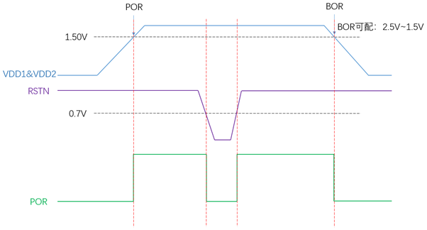

<div align="center"> 图3-1 上/下电时序图 </div>  <br> <br> <br>

RSTN复位信号，需要上拉到VDD1的输入电压域上，并接0.1uF电容到地，做一个RC延迟复位，如图3-2所示，图3-3是实测上电时序图。

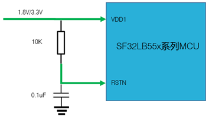

<div align="center"> 图3-2 复位电路图 </div>  <br> <br> <br>

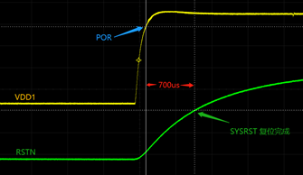

<div align="center"> 图3-3 实测上电时序图 </div>  <br> <br> <br>

#### 典型电源电路

SF32LB55x系列芯片BGA封装内置2路BUCK输出，BUCK2支持BUCK模式或LDO模式，推荐使用BUCK模式，如图3-4所示。

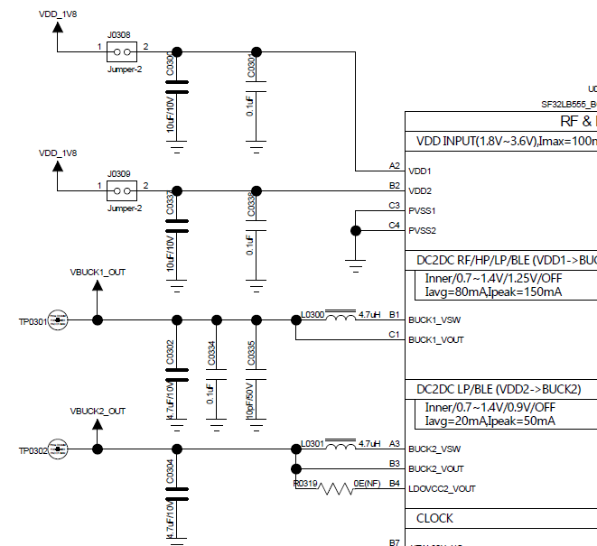

<div align="center"> 图3-4 BGA封装PMU电路图 </div>  <br> <br> <br>

SF32LB55x系列芯片QFN封装内置1路BUCK输出，如图3-5所示。


<div align="center"> 图3-5 QFN封装PMU电路图 </div>  <br> <br> <br>

#### BUCK电感选择要求

:::{important}

**功率电感关键参数**

L(电感值) = 4.7uH，DCR(直流阻抗) ≦ 0.4 ohm，Isat(饱和电流) ≧ 450mA

:::


### 启动模式

SF32LB55x系列芯片提供一个Mode管脚来配置启动模式，如表3-4所示。

<div align="center"> 表3-4 Mode模式描述 </div>

```{table}
:align: center
| Mode配置 | 详细描述                             |
| -------- | ------------------------------------ |
| 高       | 芯片上电启动后，进入下载模式         |
| 低       | 芯片上电启动后，跳转到用户程序区启动 |
```

:::{note}
**注意事项：**

1. Mode的电压域是和VDDIOA同一电压域；
2. Mode外接10K电阻到电源或GND，保持电平稳定，不能悬空也不能有toggle干扰；
3. Mode管脚在量产板上必须留测试点，程序下载或校准晶体时要用到，可以不用预留跳线；
4. Mode管脚在测试板上建议要预留跳线，程序死机后方便从下载模式启动下载程序。
:::

### 时钟

SF32LB55x系列芯片需要外部提供2个时钟源，48MHz主晶体和32.768KHz RTC晶体，具体要求如表3-5所示。

<div align="center"> 表3-5 晶体规格要求 </div>

```{table}
:align: center
|晶体|晶体规格要求   |详细描述  |
|:--|:-------|:--------|
|48MHz |7pF≦CL≦12pF（推荐值8.8pF） △F/F0≦±10ppm ESR≦30 ohms（推荐值22ohms）|晶振功耗和CL,ESR相关,CL和ESR越小功耗越低，为了最佳功耗性能，建议采用CL和ESR在要求范围内相对较小值的物料。晶体旁边预留并联匹配电容,当CL<9pF时，无需焊接电容|
|32.768KHz |CL≦12.5pF（推荐值7pF）△F/F0≦±20ppm ESR≦80k ohms（推荐值38Kohms）|晶振功耗和CL,ESR相关,CL和ESR越小功耗越低，为了最佳功耗性能，建议采用CL和ESR在要求范围内相对较小值的物料。晶体旁边预留并联匹配电容,当CL<12.5pF时，无需焊接电容|
```

 **晶体推荐**

详细的物料认证信息，请参考：
[SIFLI-MCU-AVL-认证表](index)

### 射频

SF32LB55x系列芯片的射频本身采用了片上集成宽带匹配滤波技术，只需保证射频PCB走线为50ohms特征阻抗即可，如果天线是匹配好的，射频上无需再增加额外器件。设计时建议预留π型匹配网络用来杂散滤波和天线匹配。请参考图3-6所示电路。

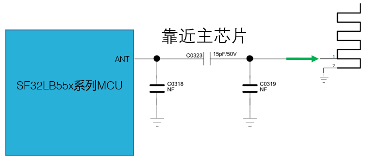 

<div align="center"> 图3-6 射频电路图 </div>  <br> <br> <br>

:::{note}
**注意：**

匹配网络的器件参数值需根据实际天线和PCB布局进行测试来确定。
:::

### 外部存储接口

#### OPI PSRAM接口

SF32LB55x系列芯片BGA145封装支持1通道OPI 接口的PSRAM芯片，PSRAM电路如图3-7所示，信号连接如表3-6所示。

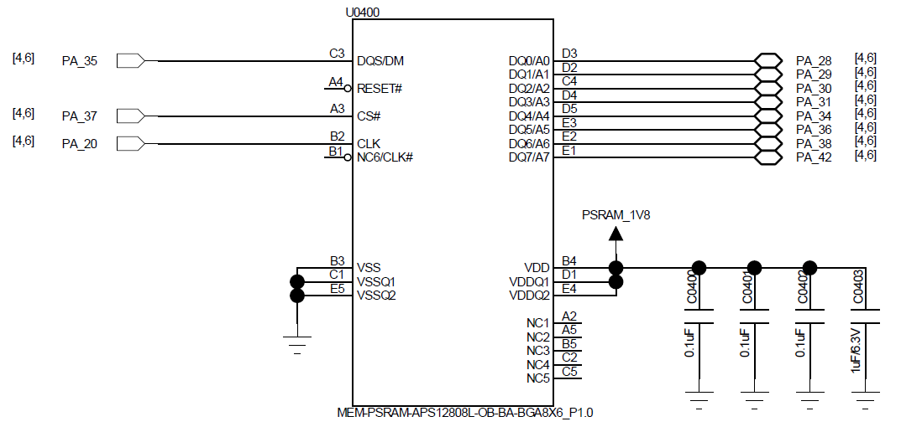

<div align="center"> 图3-7 BGA145封装PSRAM 电路 </div>  <br> <br> <br>

<div align="center"> 表3-6 BGA145封装PSRAM 信号连接 </div>

```{table}
:align: center
| PSRAM 信号 | I/O             | 详细描述                                    |
| ---------- | --------------- | ------------------------------------------- |
| CS#        | PA37            | Chip select output                          |
| CLK        | PA20            | Clock output                                |
| DQS        | PA35            | DQ strobe clock output for DQ[7:0]          |
| DQ0        | PA28            | Data Inout 0                                |
| DQ1        | PA29            | Data Inout 1                                |
| DQ2        | PA30            | Data Inout 2                                |
| DQ3        | PA31            | Data Inout 3                                |
| DQ4        | PA34            | Data Inout 4                                |
| DQ5        | PA36            | Data Inout 5                                |
| DQ6        | PA38            | Data Inout 6                                |
| DQ7        | PA42            | Data Inout 7                                |
```

SF32LB55x系列芯片BGA169封装支持2通道OPI 接口的PSRAM芯片，PSRAM电路如图3-8，图3-9所示，信号连接如表3-7，表3-8所示。

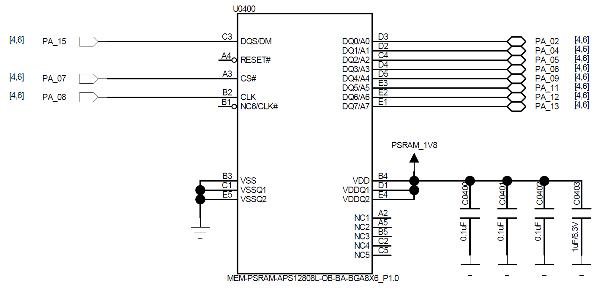

<div align="center"> 图3-8 BGA169封装PSRAM芯片1电路 </div>  <br> <br> <br>

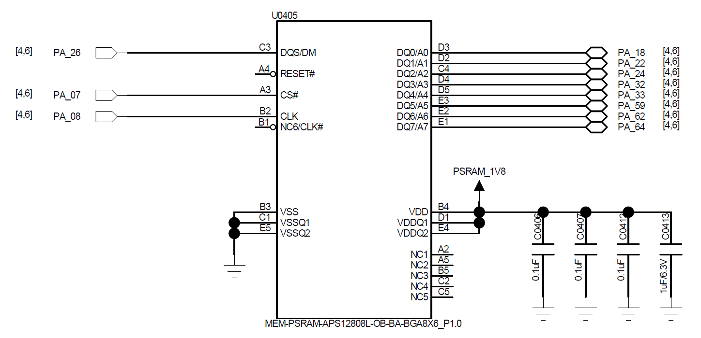

<div align="center"> 图3-9 BGA169封装PSRAM芯片2电路 </div>  <br> <br> <br>

<div align="center"> 表3-7 BGA169封装PSRAM芯片1 信号连接 </div>

```{table}
:align: center
| PSRAM 信号 | I/O             | 详细描述                                    |
| ---------- | --------------- | ------------------------------------------- |
| CS#        | PA07            | Chip select input                           |
| CLK        | PA08            | Clock input                                 |
| DQS        | PA15            | DQ strobe clock input for DQ[7:0]           |
| DQ0        | PA02            | Data Inout 0                                |
| DQ1        | PA04            | Data Inout 1                                |
| DQ2        | PA05            | Data Inout 2                                |
| DQ3        | PA06            | Data Inout 3                                |
| DQ4        | PA09            | Data Inout 4                                |
| DQ5        | PA11            | Data Inout 5                                |
| DQ6        | PA12            | Data Inout 6                                |
| DQ7        | PA13            | Data Inout 7                                |
```

<div align="center"> 表3-8 BGA169封装PSRAM芯片2 信号连接 </div>

```{table}
:align: center
| PSRAM 信号 | I/O             | 详细描述                                    |
| ---------- | --------------- | ------------------------------------------- |
| CS#        | PA07            | Chip select input                           |
| CLK        | PA08            | Clock input                                 |
| DQS        | PA26            | DQ strobe clock input for DQ[7:0]           |
| DQ0        | PA18            | Data Inout 0                                |
| DQ1        | PA22            | Data Inout 1                                |
| DQ2        | PA24            | Data Inout 2                                |
| DQ3        | PA32            | Data Inout 3                                |
| DQ4        | PA33            | Data Inout 4                                |
| DQ5        | PA59            | Data Inout 5                                |
| DQ6        | PA62            | Data Inout 6                                |
| DQ7        | PA64            | Data Inout 7                                |
```
:::{note}
外挂OPI PSRAM的电源供电，如果使用HCPU的GPIO进行控制，高电平打开，低电平关闭，必须选用HCPU的PU管脚。
:::

#### QSPI Nor/Nand Flash和PSRAM接口

SF32LB55x系列芯片支持3路 QSPI 接口来连接 Nor、Nand Flash和PSRAM设备。
QSPI PSRAM设备推荐使用QSPI2接口，信号连接如表3-9，表3-10，表3-11所示。

<div align="center"> 表3-9 QSPI2 信号连接 </div>

```{table}
:align: center
| Flash 信号 | QFN68  |BGA125/145/169 | 详细描述                                    |
| ---------- | ------ | ------------- | ------------------------------------------- |
| CS#        | GPIO9  | PA61          | Chip select, active low                     |
| SO         | GPIO7  | PA65          | Data Input (Data Input Output 1)            |
| WP#        | GPIO6  | PA66          | Write Protect Output (Data Input Output  2) |
| SI         | GPIO8  | PA63          | Data Output (Data Input Output 0)           |
| SCLK       | GPIO10 | PA60          | Serial Clock Output                         |
| Hold#      | GPIO5  | PA68          | Data Output (Data Input Output 3)           |
```

<div align="center"> 表3-10 QSPI3 信号连接 </div>

```{table}
:align: center
| Flash 信号 | QFN68  |BGA125/145/169 | 详细描述                                    |
| ---------- | ------ | ------------- | ------------------------------------------- |
| CS#        | GPIO16 | PA45          | Chip select, active low                     |
| SO         | GPIO14 | PA49          | Data Input (Data Input Output 1)            |
| WP#        | GPIO13 | PA51          | Write Protect Output (Data Input Output  2) |
| SI         | GPIO15 | PA47          | Data Output (Data Input Output 0)           |
| SCLK       | GPIO17 | PA44          | Serial Clock Output                         |
| Hold#      | GPIO12 | PA55          | Data Output (Data Input Output 3)           |
```

<div align="center"> 表3-11 QSPI4 信号连接 </div>

```{table}
:align: center
| Flash 信号 | QFN68/BGA125 |BGA145/169 | 详细描述                                    |
| ---------- | ------------ | --------- | ------------------------------------------- |
| CS#        | -            | PB33      | Chip select, active low                     |
| SO         | -            | PB36      | Data Input (Data Input Output 1)            |
| WP#        | -            | PB37      | Write Protect Output (Data Input Output  2) |
| SI         | -            | PB35      | Data Output (Data Input Output 0)           |
| SCLK       | -            | PB32      | Serial Clock Output                         |
| Hold#      | -            | PB07      | Data Output (Data Input Output 3)           |
```

:::{note}
1. VDD_SIP电源是给内部Flash供电，如果要做电源开关控制，必须用PA58做控制信号，要求电源开关在PA58设置为高电平时打开，设置为低电平时关闭。
2. 联系FAE同事评估接LCPU的G-sensor和HR的算法占的FLASH空间大小，确定是否增加QSPI4外接Nor FLASH。
3. 外挂的QSPI PSRAM的电源供电，如果使用HCPU的GPIO进行控制，高电平打开，低电平关闭，必须选用HCPU的PU管脚。
:::

#### SDIO eMMC/Micro SD接口

SF32LB55x系列芯片支持2路 SDIO 接口来连接 eMMC或Micro SD设备，信号连接如表3-12，表3-13，表3-14所示。

<div align="center"> 表3-12 SDIO1 4bit信号连接 </div>

```{table}
:align: center
| Flash 信号 | QFN68 | BGA125 |BGA145/169 | 详细描述                                    |
| ---------- | ----- | ------ | --------- | ------------------------------------------- |
| CLK        | -     | PA60   | PA34      | Clock input                                 |
| CMD        | -     | PA61   | PA36      | Command input                               |
| DATA0      | -     | PA63   | PA28      | Data 0                                      |
| DATA1      | -     | PA65   | PA29      | Data 1                                      |
| DATA2      | -     | PA66   | PA30      | Data 2                                      |
| DATA3      | -     | PA68   | PA31      | Data 3                                      |
```

<div align="center"> 表3-13 SDIO1 8bit信号连接 </div>

```{table}
:align: center
| Flash 信号 | QFN68 | BGA125 |BGA145/169 | 详细描述                                    |
| ---------- | ----- | ------ | --------- | ------------------------------------------- |
| CLK        | -     | -      | PA34      | Clock input                                 |
| CMD        | -     | -      | PA36      | Command input                               |
| DATA0      | -     | -      | PA28      | Data 0                                      |
| DATA1      | -     | -      | PA29      | Data 1                                      |
| DATA2      | -     | -      | PA30      | Data 2                                      |
| DATA3      | -     | -      | PA31      | Data 3                                      |
| DATA4      | -     | -      | PA47      | Data 4                                      |
| DATA5      | -     | -      | PA49      | Data 5                                      |
| DATA6      | -     | -      | PA51      | Data 6                                      |
| DATA7      | -     | -      | PA55      | Data 7                                      |
```

<div align="center"> 表3-14 SDIO2 4bit信号连接 </div>

```{table}
:align: center
| Flash 信号 | QFN68  |BGA125/145/169 | 详细描述                                    |
| ---------- | ------ | ------------- | ------------------------------------------- |
| CLK        | GPIO17 | PA44          | Clock input                                 |
| CMD        | GPIO17 | PA45          | Command input                               |
| DATA0      | GPIO17 | PA47          | Data 0                                      |
| DATA1      | GPIO17 | PA49          | Data 1                                      |
| DATA2      | GPIO17 | PA51          | Data 2                                      |
| DATA3      | GPIO17 | PA55          | Data 3                                      |
```

详细的物料认证信息，请参考：
[SIFLI-MCU-AVL-认证表](index)

### 显示

#### MIPI DSI 显示接口

SF32LB55x系列芯片BGA145/169封装支持2lane的MIPI DSI显示接口，信号连接如表3-15所示。 

<div align="center"> 表3-15 MIPI-DSI 信号连接 </div>

```{table}
:align: center 
| MIPI DSI signal | BGA145/169 I/O | Description                        |
| --------------- | -------------- | ---------------------------------- |
| CLKP            | DSI_CLKP       | MIPI 时钟信号+                     |
| CLKN            | DSI_CLKN       | MIPI 时钟信号-                     |
| D0P             | DSI_D0P        | MIPI 数据通道0+                    |
| D0N             | DSI_D0N        | MIPI 数据通道0-                    |
| D1P             | DSI_D1P        | MIPI 数据通道1+                    |
| D1N             | DSI_D1N        | MIPI 数据通道1-                    |
| -               | AVDD18_DSI     | MIPI 电源输入                      |
| -               | DSI_REXT       | 外接10K电阻到地                    |
| -               | AVSS_DSI       | 接地                               |
| TE              | PA77           | Tearing effect to MCU frame signal |
| RESET           | PB17           | 复位显示屏信号                     |
```

:::{note}
1. TE可以使用PA的其他GPIO；
2. 如果屏幕支持DSI 协议的TE，可以不需要额外的TE管脚；
3. RESET可以使用PB的其他GPIO。
:::

#### SPI/QSPI 显示接口

SF32LB55x系列芯片支持 3/4-wire SPI和Quad-SPI 接口来连接LCD显示屏，信号连接如表3-16所示。

<div align="center"> 表3-16 SPI/QSPI 信号连接方式 </div>

```{table}
:align: center 
| SPI信号 | QFN68  | BGA125 | BGA145/169 | 详细描述                                                  |
| ------- | ------ | ------ | ---------- | --------------------------------------------------------- |
| CSX     | GPIO22 | PA31   | PB33       | 使能信号                                                  |
| WRX_SCL | GPIO23 | PA20   | PB32       | 时钟信号                                                  |
| DCX     | GPIO30 | PA36   | PB36       | 4-wire SPI 模式下的数据/命令信号  Quad-SPI 模式下的数据1   |
| SDI_RDX | GPIO21 | PA34   | PB35       | 3/4-wire SPI 模式下的数据输入信号  Quad-SPI 模式下的数据0  |
| SDO     | GPIO21 | PA34   | PB35       | 3/4-wire SPI 模式下的数据输出信号  请和SDI_RDX短接到一起   |
| D[0]    | GPIO19 | PA38   | PB37       | Quad-SPI 模式下的数据2                                    |
| D[1]    | GPIO18 | PA42   | PB07       | Quad-SPI 模式下的数据3                                    |
| REST    | GPIO2  | PA78   | PB17       | 复位显示屏信号                                            |
| TE      | GPIO3  | PA77   | PB77       | Tearing effect to MCU frame signal                        |
```

:::{note}
1. TE可以使用PA77，也可以使用PA的其他GPIO模拟；
2. REST可以使用任意GPIO，如果需要AOD功能，推荐使用PB的管脚。
:::

#### MCU8080 显示接口

SF32LB55x系列芯片支持 MCU8080 接口来连接LCD显示屏，信号连接如表3-17所示。 

<div align="center"> 表3-17 MCU8080 屏信号连接方式 </div>

```{table}
:align: center 
| MCU8080信号 | QFN68  | BGA125 | BGA145/169 | 详细描述                            |
| ----------- | ------ | ------ | ---------- |------------------------------------ |
| CSX         | GPIO22 | PA31   | -          | Chip select                         |
| WRX         | GPIO23 | PA20   | -          | Writes strobe signal to  write data |
| DCX         | GPIO20 | PA36   | -          | Display data / command  selection   |
| RDX         | GPIO21 | PA34   | -          | Reads strobe signal to write  data  |
| D[0]        | GPIO19 | PA38   | -          | Data 0                              |
| D[1]        | GPIO18 | PA42   | -          | Data 1                              |
| D[2]        | GPIO17 | PA44   | -          | Data 2                              |
| D[3]        | GPIO16 | PA45   | -          | Data 3                              |
| D[4]        | GPIO15 | PA47   | -          | Data 4                              |
| D[5]        | GPIO14 | PA49   | -          | Data 5                              |
| D[6]        | GPIO13 | PA51   | -          | Data 6                              |
| D[7]        | GPIO12 | PA55   | -          | Data 7                              |
| REST        | GPIO2  | PA78   | -          | Reset                               |
| TE          | GPIO3  | PA77   | -          | Tearing effect to MCU frame signal  |
```

:::{note}
1. TE可以使用PA77，也可以使用PA的其他GPIO模拟；
2. REST可以使用任意GPIO，如果需要AOD功能，推荐使用PB的管脚。
:::

#### JDI显示接口

SF32LB55x系列芯片支持 并行和串行的JDI接口来连接LCD显示屏，支持PA的LCDC1或PB的LCDC2复用相应的信号，推荐使用PB接口的LCDC2，如表3-18，表3-19所示。


<div align="center"> 表3-18 并行JDI屏信号连接方式 </div>

```{table}
:align: center
| JDI信号      | I/O（LCDC1） | 详细描述                                                     |
| ------------ | ------------ | ------------------------------------------------------------ |
| JDI_VCK      | PA20         | Shift clock for the vertical driver                          |
| JDI_VST      | PA31         | Start signal for the vertical driver                         |
| JDI_XRST     | PA34         | Reset signal for the horizontal and  vertical driver         |
| JDI_HCK      | PA36         | Shift clock for the  horizontal driver                       |
| JDI_HST      | PA38         | Start signal for the horizontal driver                       |
| JDI_ENB      | PA42         | Write enable signal for the pixel memory                     |
| JDI_R1       | PA49         | Red image data (odd pixels)                                  |
| JDI_R2       | PA51         | Red image data (even pixels)                                 |
| JDI_G1       | PA55         | Green image data (odd pixels)                                |
| JDI_G2       | PA77         | Green image data (even pixels)                               |
| JDI_B1       | PA78         | Blue image data (odd pixels)                                 |
| JDI_B2       | PA79         | Blue image data (even pixels)                                |
| JDI_XFRP     | PA45         | Liquid crystal driving signal  ("On" pixel)                  |
| JDI_VCOM/FRP | PA47         | Common electrode driving signal/   Liquid crystal driving signal  ("Off" pixel) |
```
 

<div align="center"> 表3-19 串行JDI屏信号连接方式 </div>

```{table}
:align: center
| JDI信号      | I/O（LCDC1） | 详细描述                         |
| ------------ | ------------ | -------------------------------- |
| JDI_SCS      | PA31         | Chip Select Signal               |
| JDI_SCLK     | PA20         | Serial Clock Signal              |
| JDI_SO       | PA34         | Serial Data Output Signal        |
| JDI_DISP     | PA36         | Display ON/OFF Switching  Signal |
| JDI_EXTCOMIN | PA38         | COM Inversion Polarity Input     |
```

#### 触摸和背光接口

SF32LB55x系列芯片支持I2C格式的触摸屏控制接口和触摸状态中断输入，同时支持1路PWM信号来控制背光电源芯片的使能和亮度，信号连接如表3-20所示。

<div align="center"> 表3-20 触摸和背光控制连接方式 </div>

```{table}
:align: center
| 触摸屏和背光信号 | QFN68  | BGA125 | BGA145 | BGA169 | 详细描述                   |
| ---------------- | ------ | ------ | ------ | ------ | -------------------------- |
| Interrupt        | GPIO1  | PA79   | PA79   | PA79   | 触摸状态中断信号（可唤醒） |
| I2C1_SCL         | GPIO25 | PA10   | PA10   | PA10   | 触摸屏I2C的时钟信号        |
| I2C1_SDA         | GPIO24 | PA14   | PA14   | PA14   | 触摸屏I2C的数据信号        |
| BL_PWM           | GPIO0  | PA80   | -      | -      | 背光PWM控制信号            |
| Reset            | GPIO16 | PA00   | PA00   | PA00   | 触摸复位信号               |
| Power Enable     | GPIO26 | PA06   | PA06   | PA03   | 触摸屏电源使能信号         |
```

:::{note}
BL_PWM需要选用有GPTIM1_CHX功能的GPIO，选用GPIO的PU或PD，不能在冷启动时，异常打开背光。
:::

### 其它外设接口

#### 可唤醒按键

SF32LB55x系列芯片支持10个可以唤醒中断输入管脚：BGA125/145/169封装（PA77~PA80，PB43~PB48），QFN68封装(GPIO0~GPIO3，GPIO43~GPIO48)可以用来做按键唤醒功能。推荐使用按键输入管脚，如图3-10所示。

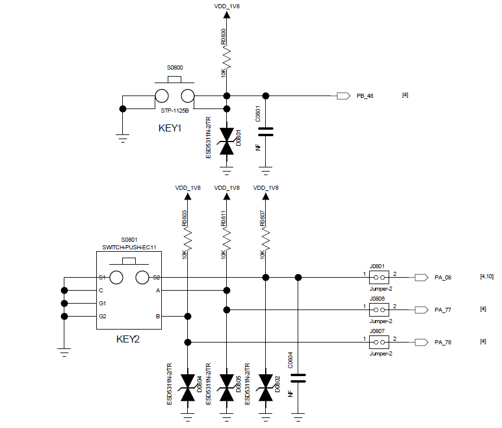

<div align="center"> 图3-10 按键电路图 </div>  <br> <br> <br>

#### 振动马达接口

SF32LB55x系列芯片支持多路PWM输出，可以用做振动马达的驱动信号。图3-11所示为推荐电路。

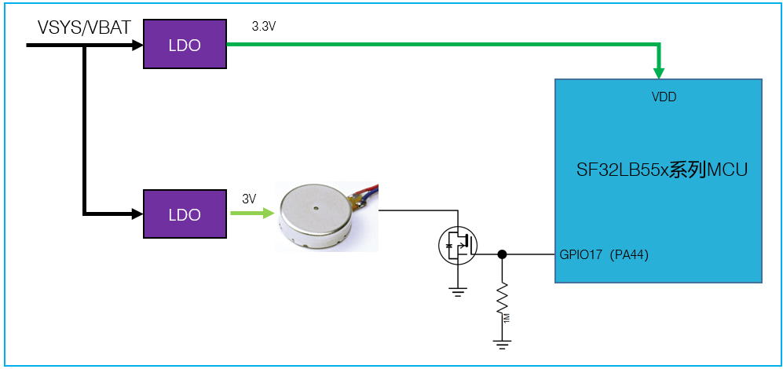

<div align="center"> 图3-11 振动马达电路图 </div>  <br> <br> <br>

:::{note}
马达的PWM控制信号需要选用有GPTIM1_CHx功能的GPIO，选用GPIO的PU或PD，不能在冷启动时，异常启动马达。
:::

### 可唤醒中断源

SF32LB55x系列芯片支持10个非屏蔽可唤醒中断源，如表3-21所示，HCPU有4个中断源，LCPU有6个中断源。每个中断源只能唤醒对应的CPU。


<div align="center"> 表3-21 中断源连接方式 </div>

```{table}
:align: center
| 中断源    | QFN68  | BGA125/145/169  | 详细描述      |
| --------- | ------ | --------------- | ------------- |
| WKUP_A0   | GPIO3  | PA77            | HCPU中断信号0 |
| WKUP_A1   | GPIO2  | PA78            | HCPU中断信号1 |
| WKUP_A2   | GPIO1  | PA79            | HCPU中断信号2 |
| WKUP_A3   | GPIO0  | PA80            | HCPU中断信号3 |
| WKUP_B0   | GPIO43 | PB43            | LCPU中断信号0 |
| WKUP_B1   | GPIO44 | PB44            | LCPU中断信号1 |
| WKUP_B2   | GPIO45 | PB45            | LCPU中断信号2 |
| WKUP_B3   | GPIO46 | PB46            | LCPU中断信号3 |
| WKUP_B4   | GPIO47 | PB47            | LCPU中断信号4 |
| WKUP_B5   | GPIO48 | PB48            | LCPU中断信号5 |
```

:::{note}
1. WKUP_A0~WKUP_A3，WKUP_B0~WKUP_B5这10个信号不能悬空，根据实际功能，添加外部上拉或者下拉，否则在芯片睡眠时可能有漏电问题。
2. Hibernate模式下，只有LCPU的6个中断源支持唤醒开机。
:::

### GPADC设计要求

SF32LB55x芯片支持5个通道的10bit GPADC，输入范围是0~0.9V。参考图3-12所示，如果测试电压VIN小于0.9V时，测试电压VIN可以直接输入到GPADC管脚上；如果测试电压VIN大于0.9V时，测试电压VIN需要用电阻分压后再输入到GPADC管脚上。

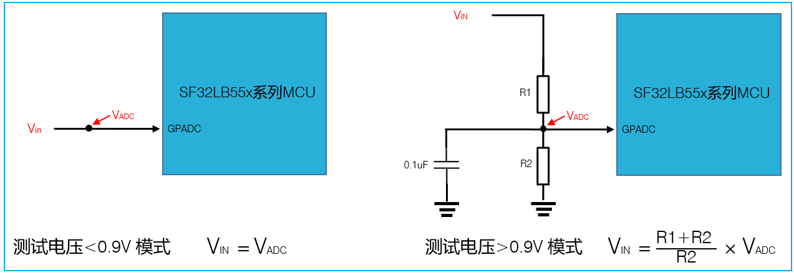

<div align="center"> 图3-12 GPADC参考电路图 </div>  <br> <br> <br>

测试锂电池电压VBAT时，需要选用电阻分压输入模式，VADC的输入电压要小于0.9V，这样R1和R2的比例是5 : 1左右，为了降低静态电流Iq，尽量使用M级别电阻，但电阻越大，GPADC的输入电压建立时间就会越长。综合测试推荐的电阻如表3-22所示：

<div align="center"> 表3-22 中断源连接方式 </div>

```{table}
:align: center
| 电阻组合    | R1(Kohm) ±%1  | R2(Kohm) ±%1  | 电压建立时间(ms) | Iq(uA) (VIN = 4.2V) |
| ----------- | ------------- | ------------- | ---------------- | ------------------- |
| 1           | 1000          | 220           | 138              | 3.44                |
| 2           | 2000          | 430           | 250              | 1.73                |
| 3           | 3000          | 680           | 302              | 1.14                |
| 4           | 4300          | 910           | -                | 0.81                |
| 5           | 5100          | 1100          | 420              | 0.68                |
```

### 传感器

SF32LB55x芯片支持心率、加速度传感器等。设计中，需要注意心率和加速度传感器的I2C、SPI、控制接口、中断唤醒等接口，必须使用LCPU的接口。心率和加速传感器的供电电源，选择Iq比较小的DCDC、LDO或Loadswitch，可以实现供电电源根据需要进行开关。

### 外挂蓝牙音频

SF32LB55x芯片支持外挂音频蓝牙，通讯接口采用HCPU的UART1，使用中注意接口电平必须要匹配，如果不匹配，UART中间添加电平转换芯片，如果外挂音频蓝牙在使用中，需要断电，此时，UART接口的电平转换芯片的电源也要同步关断，否则易造成漏电。

如果使用中，当SF32LB55x芯片进入Standby模式，外挂音频蓝牙不掉电，这时，外挂音频蓝牙的电源使能控制信号，如果是低电平打开电源，必须使用SF32LB55x芯片LCPU中默认PD的GPIO。


### 调试和下载接口

SF32LB55x系列芯片支持Arm®标准的SWD调试接口，可以连接到EDA工具上进行单步运行调试。如图3-13所示，连接SEEGER® J-Link® 工具时需要把调试工具的电源修改为外置接口输入，通过SF32LB55x电路板给J-Link工具供电。

SF32LB55x有5路UART接口可供选择进行调试信息输出，具体请参考表3-23。

<div align="center"> 表3-23 调试口连接方式 </div>

```{table}
:align: center
| UART信号 | QFN68  | BGA125/145/169 | 详细描述                       |
| -------- | ------ | -------------- | ------------------------------ |
| TXD1     | GPIO13 | PA19           | UART1的RXD信号                 |
| RXD1     | GPIO14 | PA17           | UART1的TXD信号                 |
| TXD2     | -      | PA07           | UART2的RXD信号                 |
| RXD2     | -      | PA05           | UART2的TXD信号                 |
| TXD3     | GPIO46 | PB46           | UART3的RXD信号，系统默认打印口 |
| RXD3     | GPIO45 | PB45           | UART3的TXD信号，系统默认打印口 |
| TXD4     | -      | PB14           | UART4的RXD信号                 |
| RXD4     | -      | PB12           | UART4的TXD信号                 |
| TXD5     | -      | PB11           | UART5的RXD信号                 |
| RXD5     | -      | PB06           | UART5的TXD信号                 |
| SWCLK    | GPIO41 | PB31           | SWD时钟信号                    |
| SWDIO    | GPIO42 | PB34           | SWD数据信号                    |
```

:::{note}
UARTx的RXD信号不能悬空，软件初始化时设置为内部上拉方式。
:::
 
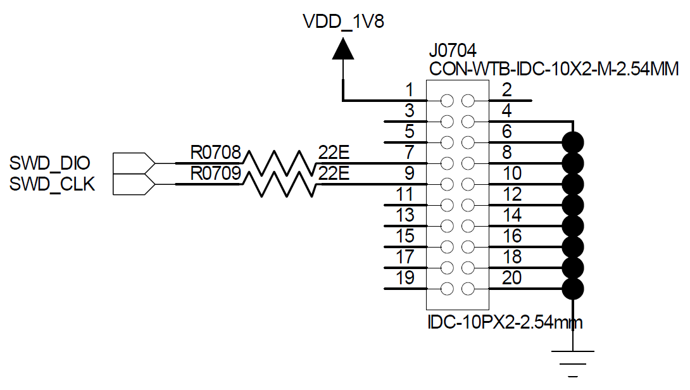 

<div align="center"> 图3-13 SWD调试接口电路图 </div>  <br> <br> <br> 


### 产线烧录和晶体校准

Sifli提供脱机下载器来完成产线程序的烧录和晶体校准。

:::{note}
硬件设计时，请注意至少预留测试点：VBAT、GND、VDDIOA、VDDIOB、RSTN、Mode、SWDIO、SWCLK、RXD1、TXD1、RXD3和TXD3。
产线生产需要测试点：VBAT、GND、boot_mode、VDDIOB、RXD3、TXD3。
:::

## PCB设计指导

### PCB 封装设计

#### 封装尺寸

SF32LB55x系列芯片有4种封装形式，不同封装形式对应不同产品型号和不同的功能，如下所示：

- 1. BGA125 封装，封装尺寸：7mm × 7mm × 0.94mm，Pitch：0.5mm，详细封装信息如图 4-1所示：
 
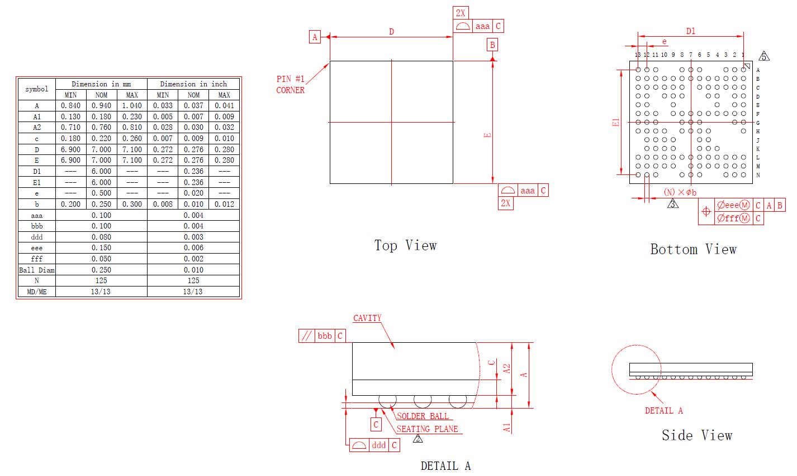  

<div align="center"> 图4-1 BGA125封装尺寸图 </div>  <br> <br> <br> 

- 2. BGA145 封装，封装尺寸：7mm × 7mm × 0.94mm，Pitch：0.5mm，详细封装信息如图 4-2所示： 

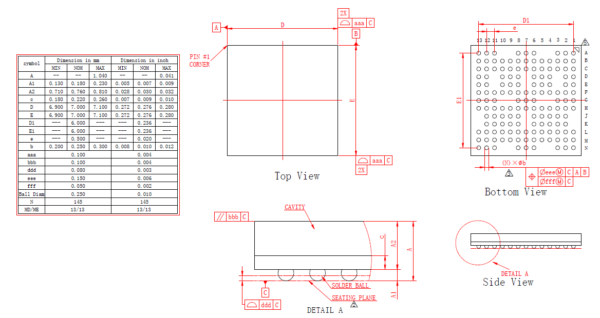  

<div align="center"> 图4-2 BGA145封装尺寸图 </div>  <br> <br> <br> 

- 3. BGA169 封装，封装尺寸：7mm × 7mm × 0.94mm，Pitch：0.5mm，详细封装信息如图 4-3所示：

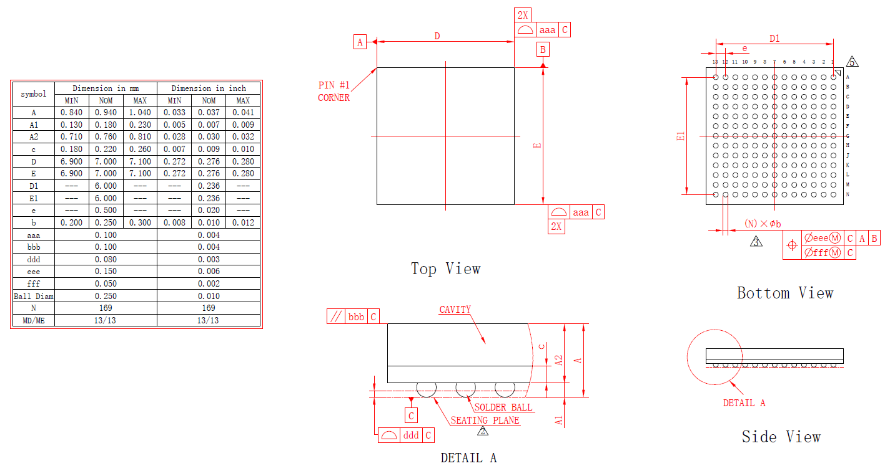  

<div align="center"> 图4-3 BGA169封装尺寸图 </div>  <br> <br> <br> 

- 4. QFN68L 封装，封装尺寸：7mm × 7mm × 0.75mm，Pitch：0.35mm，详细封装信息如图 4-4所示：

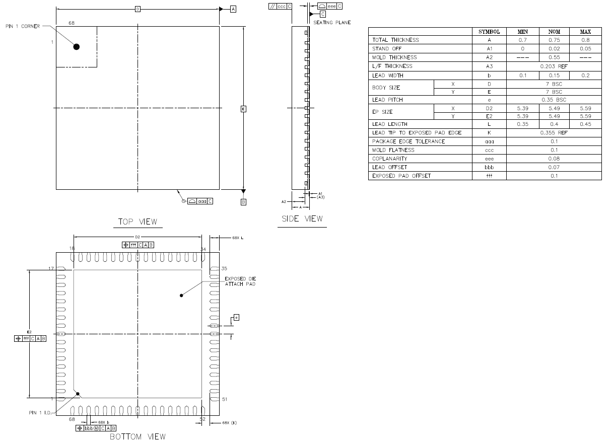  

<div align="center"> 图4-4 QFN68L封装尺寸图 </div>  <br> <br> <br> 

#### 封装形状

- 1. BGA 封装形式如图4-5所示。

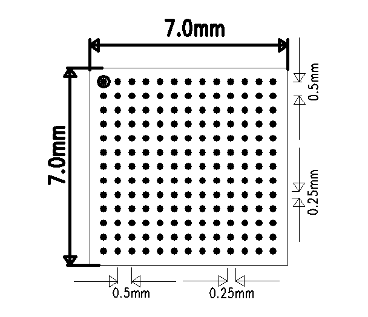  

<div align="center"> 图4-5 BGA封装形式 </div>  <br> <br> <br> 

- 2. BGA 封装 PCB 焊盘设计信息如图4-6所示。

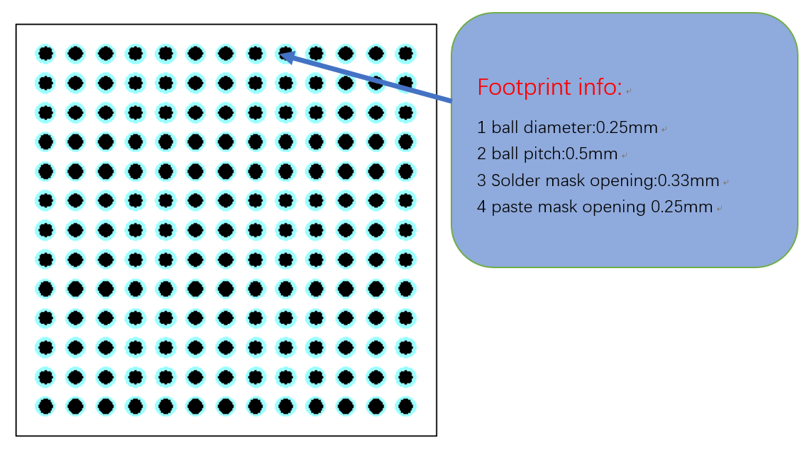  

<div align="center"> 图4-6 BGA封装PCB焊盘设计 </div>  <br> <br> <br> 

- 3. QFN68L 封装 PCB 焊盘设计信息如图4-7所示。

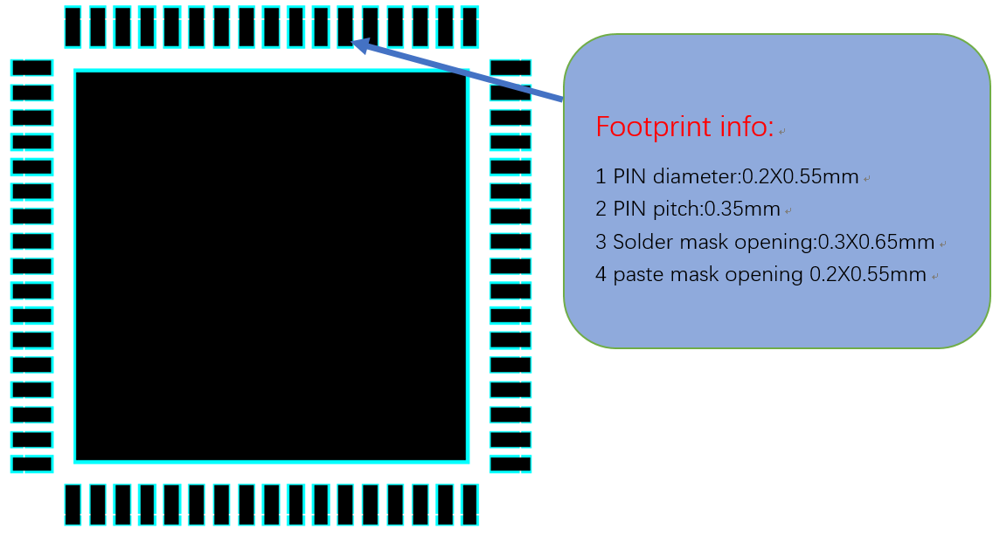  

<div align="center"> 图4-7 QFN68L封装PCB焊盘设计 </div>  <br> <br> <br> 

### PCB叠层设计

SF32LB55x 系列芯片支持单双面摆件。QFN68L、BGA125 和 BGA145 支持 PTH通孔板，推荐采用 4 层 PTH通孔板；BGA169 推荐采用 1 阶 HDI 盲埋孔板；推荐参考叠层结构如图 4-8和图4-9所示：

 
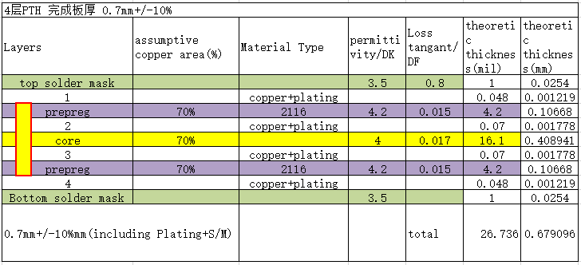  

<div align="center"> 图4-8 4层通孔板参考叠层结构图 </div>  <br> <br> <br>

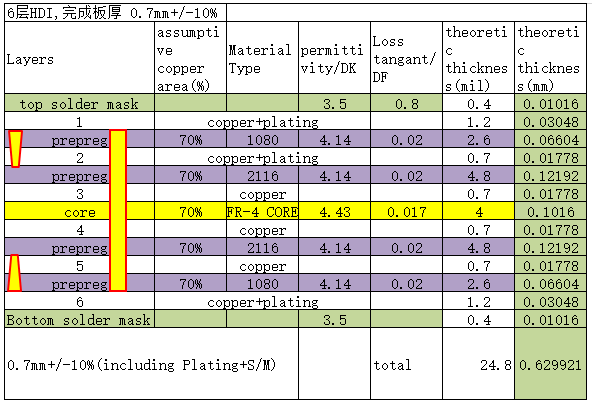  

<div align="center"> 图4-9 6层盲埋孔板参考叠层结构图 </div>  <br> <br> <br>

### PCB通用设计规则

PTH 通孔板 PCB 通用设计规则如图4-10所示。

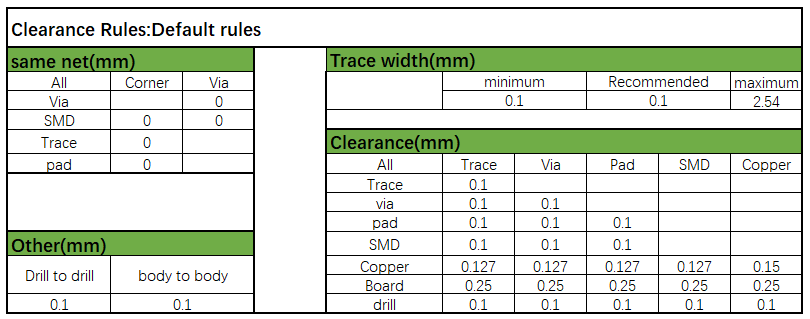  

<div align="center"> 图4-10 PTH通孔板PCB通用设计规则 </div>  <br> <br> <br> 

HDI-1阶 PCB 通用设计规则如图4-11所示。

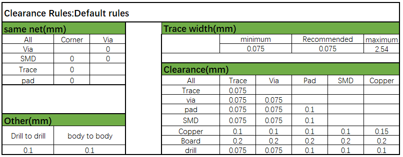  

<div align="center"> 图4-11 HDI-1阶盲埋孔板PCB通用设计规则 </div>  <br> <br> <br> 


### 芯片走线扇出

SF32LB55x系列芯片有多种封装形式，需要根据不同的封装形式采用不同的走线和扇出方式，如图4-12所示 BGA 封装走线和扇出，图4-13所示 QFN 封装走线和扇出：


  

<div align="center"> 图4-12 BGA封装走线扇出参考图 </div>  <br> <br> <br> 


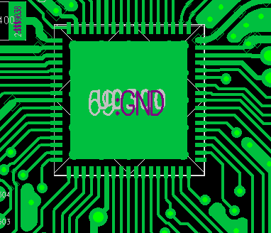  

<div align="center"> 图4-13 QFN封装走线扇出参考图 </div>  <br> <br> <br> 


### 时钟接口走线

晶体需摆放在屏蔽罩里面，离 PCB 板框间距大于 1mm，尽量远离发热大的器件，如 PA、Charge、PMU 等电路器件，距离最好大于 5mm 以上，避免影响晶体频偏，晶体电路禁布区间距大于 0.25mm 避免有其它金属和器件，如图4-14所示。

  

<div align="center"> 图4-14 晶体布局图 </div>  <br> <br> <br> 

48MHz 晶体走线建议走表层长度要求控制在 3-10mm 区间，线宽 0.1mm，必须立体包地处理，并且其走线需远离 VBAT、DC/DC 及高速信号线。48MHz 晶体区域下方表层及临层做禁空处理，禁止其它走线从其区域走，如图4-15、图4-16、图4-17所示。

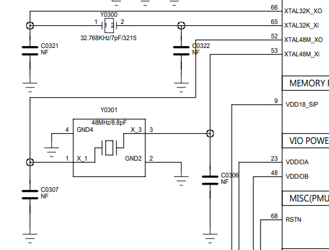  

<div align="center"> 图4-15 48MHz晶体原理图 </div>  <br> <br> <br> 

  

<div align="center"> 图4-16 48MHz晶体走线模型 </div>  <br> <br> <br> 

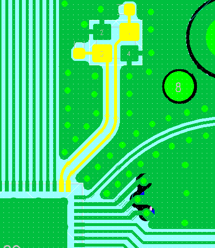  

<div align="center"> 图4-17 48MHz晶体走线参考 </div>  <br> <br> <br> 

32.768KHz 晶体建议走表层，走线长度控制 ≤10mm, 线宽 0.1mm，32K_XI/32_XO 平行走线间距 ≥0.15mm，必须立体包地处理，晶体区域下方表层及临层做禁空处理，禁止其它走线从其区域走，如图4-18、图4-19、图4-20所示。

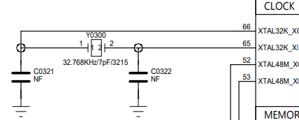  

<div align="center"> 图4-18 32.768KHz晶体原理图 </div>  <br> <br> <br> 

  

<div align="center"> 图4-19 32.768KHz晶体走线模型 </div>  <br> <br> <br> 

  

<div align="center"> 图4-20 32.768KHz晶体走线参考 </div>  <br> <br> <br> 

### 射频接口走线

射频匹配电路要尽量靠近芯片端放置，不要靠近天线端放置，AVDD_BRF 射频电源其滤波电容尽量靠近芯片管脚放置，电容接地 PIN 脚打孔直接接主地，RF 信号的 π 型网络的原理图和 PCB 分别如图4-21、图4-22所示。

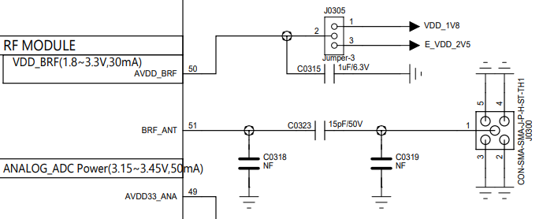  

<div align="center"> 图4-21 π型网络以及电源电路原理图 </div>  <br> <br> <br> 

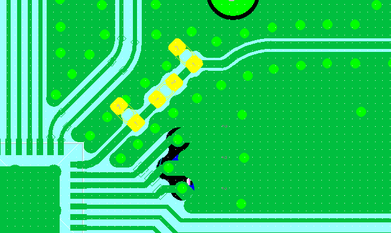  

<div align="center"> 图4-22 π型网络以及电源PCB走线 </div>  <br> <br> <br> 

射频线建议走表层，避免打孔穿层影响 RF 性能，线宽最好大于 10mil，需要立体包地处理，避免走锐角和直角，射频线两边多打屏蔽地孔，射频线需要做 50 欧阻抗控制，如图4-23、图4-24所示。


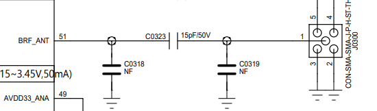  

<div align="center"> 图4-23 RF信号电路原理图 </div>  <br> <br> <br> 


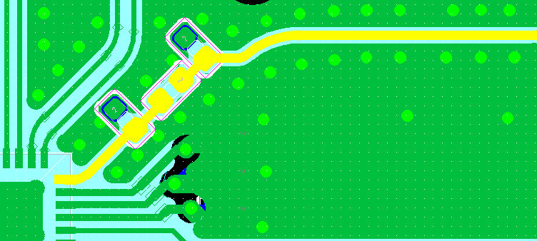  

<div align="center"> 图4-24 50欧姆RF信号PCB走线 </div>  <br> <br> <br> 


射频电路走线禁止 DC-DC、VBAT 和高速数字信号从其区域走，比如晶振、高频时钟，及数字接口信号（I2C、SPI、SDIO、I2S、UART 等）。

BGA 封装的 AVSS_TRF、AVSS_RRF、AVSS_BB、AVSS_VCO 为射频电路接地脚，必须保证其良好接地，接地焊盘处必须保证有足够多接到主地的过孔。

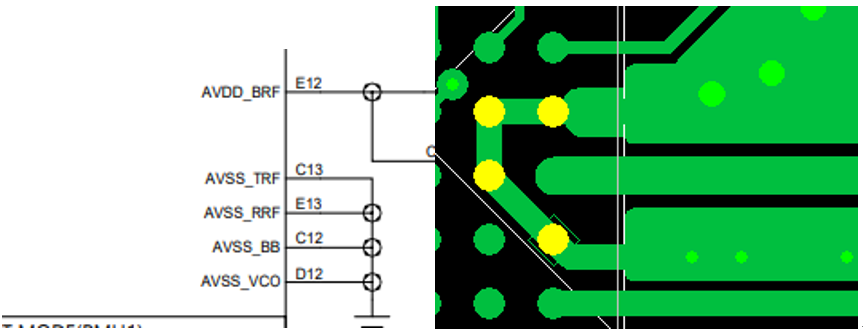

<div align="center"> 图4-25 射频电路接地信号PCB图 </div>  <br> <br> <br>

### 高速数字信号线走线

SF32LB55x 系列芯片的 MIPI_DSI、OPI PSRAM、LCDC_SPI 和 QSPI 接口需要按照高速数字信号线规则走线。

MIPI_DSI，要求走差分 100 欧姆特征阻抗控制，数据和时钟要做等长处理。

外置存储 PSRAM 芯片的 OPI 接口，走线做等长处理。

LCDC_SPI 和 QSPI 接口，走线尽量保持等长。

时钟线和 I2C 走线需要做包地处理，避免与其它线长距离平行走线。

### DC-DC 电路走线

DC-DC 电路功率电感和滤波电容必须靠近芯片的管脚放置，BUCK_VSW 走线尽量短且粗，保证整个 DC-DC 电路回路电感小，所有的 DC-DC 输出滤波电容接地脚多打过孔连接到主地平面；BUCK_VOUT 管脚反馈线不能太细，必须大于 0.25mm，功率电感区域表层禁止铺铜，临层必须为完整的参考地，避免其它线从电感区域里走线，如图4-26、4-27所示。
   
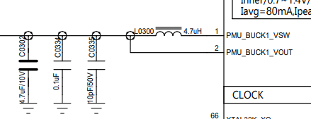

<div align="center"> 图4-26 DC-DC关键器件电路图 </div>  <br> <br> <br>

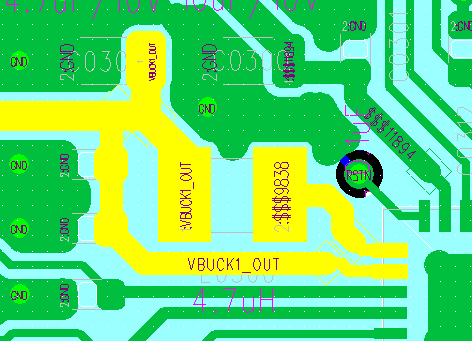

<div align="center"> 图4-27 DC-DC 关键器件PCB布局图 </div>  <br> <br> <br>

### 电源供电走线

PVDD_PMU1(PIN67) 为芯片内置 PMU 模块电源输入脚，对应的电容必须靠近管脚放置，走线尽量的粗，不能低于 0.3mm，如图4-28、图4-29所示。
   
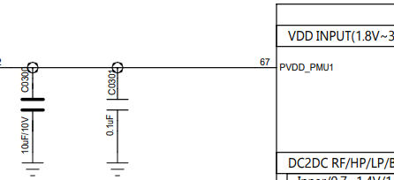

<div align="center"> 图4-28 电源供电电路 </div>  <br> <br> <br>

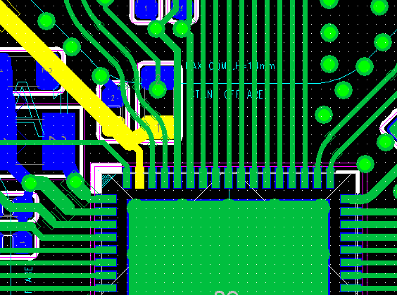

<div align="center"> 图4-29 电源供电电路PCB走线 </div>  <br> <br> <br>

### LDO和IO电源输入走线

所有的 LDO 输出和 IO 电源输入管脚滤波电容靠近对应的管脚放置，其走线宽必须满足输入电流要求，走线尽量短且粗，从而减少电源纹波提高系统稳定性。如图4-30、图4-31所示。


<div align="center"> 图4-30 LDO 内部供电滤波电路 </div>  <br> <br> <br>

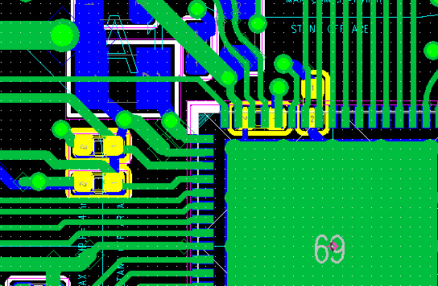

<div align="center"> 图4-31 LDO和IO输入电源走线示意图 </div>  <br> <br> <br>

### 其它接口走线

管脚配置为 GPADC 管脚信号，必须要求立体包地处理，远离其它干扰信号，如电池电量电路，温度检查电路等。

#### 芯片地走线

对于 QFN68 封装，封装中心区域的焊盘为整个芯片的接地 PIN，其中心区域 PIN 需要直接打孔连接到主地层，特别靠近 RF 接口管脚区域和 PMU 接口管脚区域，尽量多打孔，保证其良好接地。
   
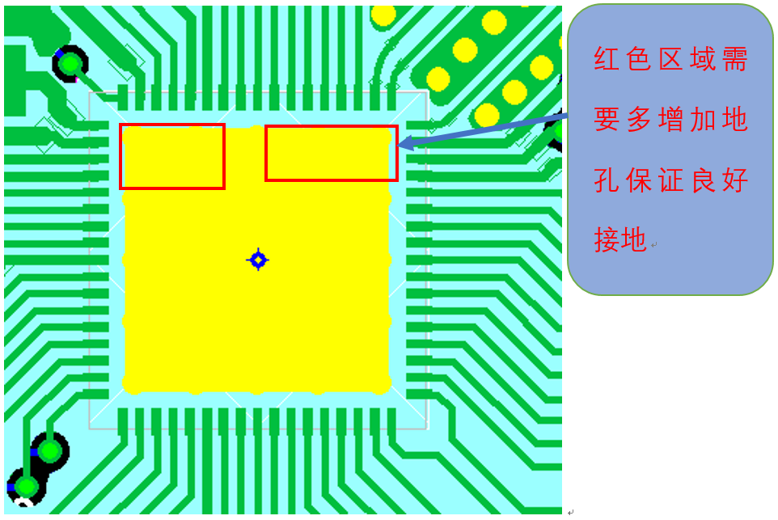

<div align="center"> 图4-32 QFN68 封装地走线 </div>  <br> <br> <br>

对于 BGA 封装，RF 接口地和 PMU 接口地是分开的，通过 BGA 球连接到地，需要保证，RF 接口地对应 BGA 球为 C13、E13、D12、E13 这几个，需要保证这几个球良好接主地，避免悬空或者没有连接到主地。PMU 接口DC-DC 对应的 BGA 球为 D2、B3 这两个，保证这两个管脚直接连接主地层，表层避免与其它接地球连接。

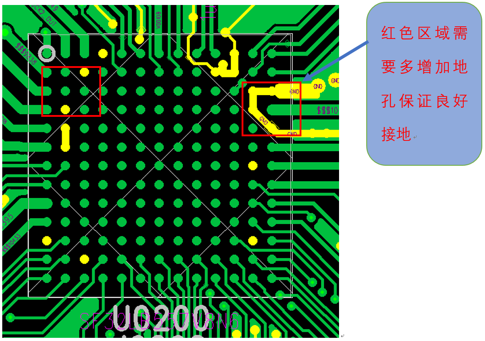

<div align="center"> 图4-33 BGA 封装地走线 </div>  <br> <br> <br>

#### EMI&ESD 走线

避免屏蔽罩外面表层长距离走线，特别是时钟，电源等干扰信号尽量走内层，禁止走表层；ESD 保护器件必须靠近连接器对应管脚放置，信号走线先过 ESD 保护器件管脚，避免信号分叉，没过 ESD 保护管脚，ESD 器件接地脚必须保证过孔连接主地，保证地焊盘走线短且粗，减少阻抗提高 ESD 器件性能。

#### 其它

USB 充电测试点必须放置在 TVS 管前面，电池座 TVS 管放置在平台前面，其走线必须保证先过 TVS 然后再到芯片端。
 
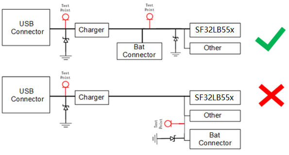

<div align="center"> 图4-34 电源TVS布局参考 </div>  <br> <br> <br>

TVS 管接地脚尽量避免长距离走线再连接到地。

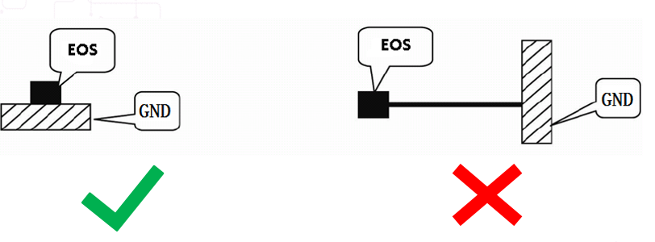

<div align="center"> 图4-35 TVS走线参考 </div>  <br> <br> <br>

## Q&A

- 问题1：为什么在Mode = 1 启动时，有些GPIO的默认状态和SPEC描述不同？
  答：Mode = 1 启动会进入下载模式，会把外接Flash的QSPI2和QSPI3相关GPIO的状态更改。

- 问题2：为什么贴片马达在程序下载过程中，会异常振动？
  答：马达的电源控制信号或PWM控制信号异常打开导致，如果是高电平起振，使用了PU的GPIO造成马达供电起振，故推荐使用PD的GPIO17或GPIO39输出PWM信号。

- 问题3：为什么焊接电池时可能会造成死机呢？如何避免？
  答：由于烙铁的接地不好，可能浪涌冲击导致死机。可以在电池接口上加防浪涌和静电保护，烙铁做良好接地处理就可以避免这些问题。

- 问题4：唤醒按键接到芯片的唤醒口，在Hibernate模式下，无法唤醒MCU？
  答：需要在Hibernate模式下，通过按键唤醒MCU，只能选用LCPU的GPIO43-GPIO48这6个GPIO，不能选用HCPU侧的GPIO0-GPIO3。

- 问题5：低功耗调试中，发现G-Sensor或心率等传感器功耗偏高或功能异常。如何避免？
  答：由于G-sensor或心率传感器程序是在LCPU运行，其数据信号I2C，SPI，控制信号，中断信号等都必须使用LCPU的接口，如果有信号使用了HCPU侧的接口，导致功耗偏高或者功能异常。

- 问题6：低功耗调试中，发现G-Sensor或心率等传感器功耗偏高，所有信号均接在LCPU的接口。如何避免？
  答：G-Sensor或心率使用I2C接口，低功耗调试时，关闭了G-Sensor或心率的供电，但是I2C的上拉电源没有关闭，造成G-Sensor或心率的I2C接口漏电，此时需要确保关闭了G-Sensor或心率的供电，同时也必须关闭其I2C接口，中断接口等信号的上拉电源。

- 问题7：低功耗调试中，GPIO26和GPIO27都使用做输出控制，导致功耗偏高。如何避免？
  答：当进入睡眠时，使GPIO26和GPIO27两个GPIO的电平一致，或至少将其中一个置为高阻状态(无上下拉)。

- 问题8：低功耗调试中，SS6600进入Hibernate模式，发现功耗偏高。如何避免？
  答：当进入Hibernate模式时，如果HCPU的4个唤醒口GPIO0-GPIO3 ，LCPU的6个唤醒口GPIO43-GPIO48的信号电平不是稳定的高电平或低电平，易造成漏电，特别注意当10个唤醒口保持上拉时，上拉电源一定要选用常供电的3.3V电源。

- 问题9：低功耗调试中，发现功耗偏高。如何避免？
  答：如果选取了Iq电流大的BUCK，LDO以及Loadswitch，都会造成功耗增加，建议选用Iq低于1uA的器件。

- 问题10：静电测试中，发现屏幕出现花屏。如何避免？
  答：TP的VDD，SCL，SDA，RESET，INT，LCD的电源，RESET等信号必须添加ESD器件。

- 问题11：熄屏显示功能异常。如何避免？
  答：熄屏显示功能，主要应用于功耗比TFT屏低的AMOLED屏，LCD_EN和LCD_RST等控制接口推荐使用PB接口的GPIO，如果是高电平使能使用PA接口的GPIO，必须使用PU的GPIO，如果使用PA的PD脚控制，唤醒后会造成10多ms的异常灭屏。

- 问题12：使用PA的GPIO控制外部音频蓝牙的开关，当SF32LB55X睡眠时，音频蓝牙需要保持电源供电，SF32LB55X唤醒后，导致外部音频蓝牙开关机异常。如何避免？
  答：如果要SF32LB55X进入睡眠后，保持外部音频蓝牙供电正常，必须使用LCPU的GPIO脚进行开关机控制，如果是低电平打开的，选用默认PD的GPIO管脚。

- 问题13：电池过放后，充电异常，无法正常进行电池的充电。如何避免？
  答：电池电压过低时，充电电路需要使用路径管理，确保充电器插入时，系统供电的电源由充电器提供，如果充电电路没有路径管理，此时选择的Charger IC涓流充电电流至少40mA。

- 问题14：充电器插入后，无法对电池进行充电。如何避免？
  答：充电器插入检测信号一定要接到LCPU侧，支持唤醒的GPIO43-GPIO48中任意一个GPIO接口，如果接到其他GPIO接口，无法正常启动充电流程。

- 问题15：MODE拉高，进入下载模式，电流偏大。如何避免？
  答：注意外设中电流偏大的，比如音频PA，如果高电平打开，需要选用PD的GPIO去控制开关，一定不能选用PU的GPIO去控制，如果选用了PU的GPIO，在进入下载模式时，容易异常开启造成电流增大影响程序下载。

- 问题16：MODE拉高，发现程序下载异常。如何避免？
  答：如果G_SENSOR等传感器的中断信号接到了GPIO46，当Mode管脚拉高，GPIO46默认是UART3_RX，会导致MCU程序下载异常，解决办法是G_SENSOR等传感器的中断信号接到GPIO43，GPIO44，GPIO47，GPIO48中的任意一个唤醒口，如果LCPU的唤醒口还不够，可以把按键信号（按键不能在主板上）串0欧姆电阻接到GPIO45或GPIO46上。

- 问题17：G-Ssensor和HR算法占用资源较多，现有存储器资源不足，如何避免？
  答：需要评估LCPU分配的存储空间是否足够，如果不够，需要在QSPI4上外挂Nor Flash。


## 修订历史

| 版本  | 日期       | 发布说明                         |
| ----- | ---------- | -------------------------------- |
| 0.7   | 06/26/2024 | 修改电容推荐值                   |
| 0.6   | 04/15/2024 | 修改格式                         |
| 0.5   | 12/01/2023 | 更新 PCB 设计指导部分             |
| 0.4   | 08/29/2022 | 更新部分描述，增加 Q&A 章节等内容 |
| 0.3   | 10/19/2021 | 增加免责声明和版权公告            |
| 0.2   | 10/18/2021 | 增加文档状态说明                  |
| 0.1   | 03/24/2021 | 初稿                              |
