# SF32LB56xV-硬件设计指南

## 基本介绍

本文的主要目的是帮助开发人员完成基于SF32LB56xV系列芯片的手表方案开发。本文重点介绍方案开发过程中的硬件设计相关注意事项，尽可能的减少开发人员工作量，缩短产品的上市周期。

SF32LB56xV芯片是用于超低功耗人工智能物联网（AIoT）场景下的高集成度、高性能的系统级（SoC）MCU芯片。芯片创新地采用了基于ARM Core-M33 STAR处理器的大小核架构，同时集成了业界最高性能2.5D图形引擎，人工智能神经网络加速器，以及低功耗蓝牙5.3，可广泛用于腕带类可穿戴电子设备、智能移动终端、智能家居等各种应用场景。

  SF32LB56xV芯片处理器外设资源如下：

- 120个GPIO

- 6x UART

- 7x I2C

- 5x GPTIM

- 4x SPI

- 1x I2S音频接口

- 2x SDIO 存储接口

- 1x差分模拟音频输出

- 1x差分模拟音频输入

- 支持单/双/四数据线SPI显示接口、DBI 8080、DPI和串/并行JDI模式显示接口

- 支持带GRAM和不带GRAM的两种显示屏

- 支持SWD和UART下载和软件调试

## 封装

### 封装介绍

SF32LB56xV的封装信息如表2-1所示。


<div align="center"> 表2-1  封装信息列表  </div>

```{table}
:align: center
| 封装名称 | 尺寸            | 管脚间距 | 球直径 |
| -------- | --------------- | -------- | ------ |
| WBBGA175 | 6.5x6.1x0.94 mm | 0.4 mm   | 0.25mm |
```

### WBBGA175封装

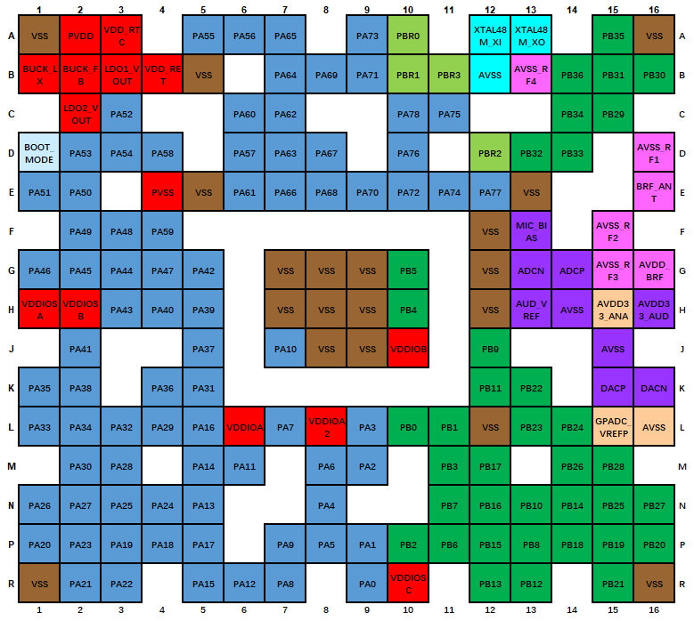 

<div align="center"> 图2-1 SF32LB56xV WBBGA175管脚分布 </div>  <br>  <br>  <br>


## 典型应用方案

图3-1是典型的运动手表组成框图，主要功能有显示、存储、传感器、震动马达和音频输入和输出。

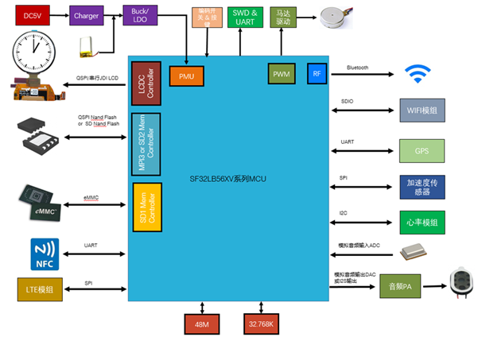 

<div align="center"> 图3-1 运动手表组成框图 </div>  <br>  <br>  <br>

:::{Note} 
- 大小核双CPU架构，同时兼顾高性能和低功耗设计要求

- 外置充电管理芯片

- 支持GPADC检测电池电压功能

- 电源供电采用Buck，LDO以及Load Switch方案

- 支持3/4-wire SPI、Dual/Quad data SPI、DBI 8080、DPI和串/并口JDI等显示屏，最高支持1024*1024分辨率

- 支持PWM背光控制

- 支持外接QSPI接口的Nor Flash存储芯片

- 支持外接QSPI接口的NAND Flash存储芯片

- 支持外接SDIO接口的NAND Flash存储芯片

- 支持蓝牙5.3通信

- 支持模拟音频输入

- 支持模拟音频输出

- 支持I2S音频接口

- 支持PWM震动马达控制

- 支持SPI/I2C接口的加速度/地磁/陀螺仪传感器

- 支持I2C接口的心率/血氧/心电图传感器

- 支持SEGGER J-Link SWD调试和烧写工具

- 支持UART调试打印接口

- 支持蓝牙 HCI调试接口

- 支持产线一拖多程序烧录

- 支持产线校准晶体功能

- 支持OTA在线升级功能
:::
  

## 原理图设计指导

### 电源

系列芯片内置有PMU单元，PVDD可以支持1.71~3.6V的电源输入。PMU支持1路Buck和多路LDO给芯片内部电路供电，各电源管脚的详细接法参考表4-1。

#### 处理器供电要求

SF32LB56xV供电规格：

<div align="center"> 表4-1  PMU 供电规格 </div>

```{table}
:align: center
| PMU电源管脚      | 最小电压(V) | 典型电压(V) | 最大电压(V) | 最大电流(mA) | 详细描述                                                  |
| :--------------- | :---------: | :---------: | :---------: | :----------: | :-------------------------------------------------------- |
| PVDD             |    1.71     |     1.8     |     3.6     |     100      | PVDD 电源输入                                             |
| BUCK_LX  BUCK_FB |      -      |    1.25     |      -      |     100      | BUCK_LX输出，接电感内部电源输入，接电感另一端，且外接电容 |
| LDO1_VOUT        |      -      |     1.1     |      -      |      50      | LDO1输出，外接电容                                        |
| LDO2_VOUT        |      -      |     0.9     |      -      |      20      | LDO2输出，外接电容                                        |
| VDD_RET          |      -      |     0.9     |      -      |      1       | RET LDO输出，外接电容                                     |
| VDD_RTC          |      -      |     1.1     |      -      |      1       | RTC LDO输出，外接电容                                     |
| MIC_BIAS         |     1.4     |      -      |     2.8     |      -       | MIC电源输出                                               |
| AVDD_BRF         |    1.71     |     1.8     |     3.3     |      1       | 射频电源输入                                              |
| AVDD33_ANA       |    3.15     |     3.3     |    3.45     |      50      | 模拟电源+射频PA电源输入                                   |
| AVDD33_AUD       |    3.15     |     3.3     |    3.45     |      50      | 模拟音频电源                                              |
| VDDIOA           |    1.71     |     1.8     |    3.45     |      -       | PA12-PA78 I/O电源输入                                     |
| VDDIOA2          |    1.71     |     1.8     |    3.45     |      -       | PA0-PA11 I/O电源输入                                      |
| VDDIOB           |    1.71     |     1.8     |    3.45     |      -       | PB I/O电源输入                                            |
| VDDIOSA          |    1.71     |     1.8     |    1.98     |      -       | SIPA电源输入                                              |
| VDDIOSB          |    1.71     |     1.8     |    1.98     |      -       | SIPB电源输入    
| VDDIOSC          |    1.71     |     1.8     |    1.98     |      -       | SIPC电源输入 |                                        
```

SF32LB56xV系列芯片电源管脚外接电容推荐值如表4-2所示。

<div align="center"> 表4-2 电容推荐值 </div>

```{table}
:align: center
| 电源管脚         | 电容          | 详细描述                                       |
| ---------------- | ------------- | ---------------------------------------------- |
| PVDD             | 0.1uF + 10uF  | 靠近管脚的地方至少放置10uF和0.1uF  共2颗电容.  |
| BUCK_LX  BUCK_FB | 0.1uF + 4.7uF | 靠近管脚的地方至少放置4.7uF和0.1uF  共2颗电容. |
| LDO1_VOUT        | 4.7uF         | 靠近管脚的地方至少放置1颗4.7uF电容.            |
| LDO2_VOUT        | 4.7uF         | 靠近管脚的地方至少放置1颗4.7uF电容.            |
| VDD_RET          | 0.47uF        | 靠近管脚的地方至少放置1颗0.47uF电容.           |
| VDD_RTC          | 1uF           | 靠近管脚的地方至少放置1颗1uF电容.              |
| AVDD_BRF         | 4.7uF         | 靠近管脚的地方至少放置1颗4.7uF电容.            |
| AVDD33_ANA       | 4.7uF         | 靠近管脚的地方至少放置1颗4.7uF电容.            |
| GPADC_VREFP      | 4.7uF         | 靠近管脚的地方至少放置1颗4.7uF颗电容.          |
| AVDD33_AUD       | 4.7uF         | 靠近管脚的地方至少放置1颗4.7uF颗电容.          |
| AUD_VREF         | 1uF           | 靠近管脚的地方至少放置1颗1uF颗电容.            |
| MIC_BIAS         | 1uF           | 靠近管脚的地方至少放置1颗1uF电容.              |
| VDDIOA           | 1uF           | 靠近管脚的地方至少放置1颗1uF电容.              |
| VDDIOA2          | 1uF           | 靠近管脚的地方至少放置1颗1uF电容.              |
| VDDIOB           | 1uF           | 靠近管脚的地方至少放置1颗1uF电容.              |
| VDDIOSA          | 0.1uF         | 靠近管脚的地方至少放置1颗0.1uF电容.            |
| VDDIOSB          | 0.1uF         | 靠近管脚的地方至少放置1颗0.1uF电容.            |
| VDDIOSC          | 0.1uF         | 靠近管脚的地方至少放置1颗0.1uF电容.            |
```

#### 思澈PMIC芯片电源分配

SF30147C是一款针对超低功耗可穿戴产品的高集成度、高效率、高性价比的电源管理芯片。SF30147C集成了1路高效率和低静态电流的BUCK，输出1.8V，最高提供500mA的驱动电流。SF30147C集成了4路低压差和低静态电流的LDO，输出2.8~3.3V，最大提供100mA的驱动电流。

SF30147C集成了7路低静态电流、低导通电阻负载开关。其中，2个高压负载开关，适用于电池电压直接驱动的外设，如音频功放等；5个低压开关，适用于1.8V供电的外设。

SF32LB56XV可以通过TWI接口和SF30147C通讯。SF30147C的各路电源输出使用情况请见表4-3所示，该芯片的详细情况请参见《DS0002-SF30147C-芯片技术规格书》文档。

<div align="center"> 表4-3 SF30147C电源分配表 </div>

```{table}
:align: center
| SF30147C  电源管脚 | 最小电压(V) | 最大电压(V) | 最大电流(mA) | 详细描述                                                     |
| ------------------ | ----------- | ----------- | ------------ | ------------------------------------------------------------ |
| VBUCK              | 1.8         | 1.8         | 500          | SF32LB56xV的PVDD，VDDIOA，VDDIOA2，VDDIOB，VDDIOSA，VDDIOSB，VDDIOSC，AVDD_BRF等1.8V电源输入 |
| LVSW1              | 1.8         | 1.8         | 100          | I2S Class-K PA逻辑供电输入                                   |
| LVSW2              | 1.8         | 1.8         | 100          | G-SENSOR 1.8V供电输入                                        |
| LVSW3              | 1.8         | 1.8         | 150          | 心率 1.8V供电输入                                            |
| LVSW4              | 1.8         | 1.8         | 150          | LCD 1.8V供电输入                                             |
| LVSW5              | 1.8         | 1.8         | 150          | EMMC CORE供电输入                                            |
| LDO1               | 2.8         | 3.3         | 100          | SF32LB56xV的AVDD33_ANA，AVDD33_AUD，VDDIOA2等3.3V电源输入    |
| LDO2               | 2.8         | 3.3         | 100          | EMMC或SD NAND供电输入                                        |
| LDO3               | 2.8         | 3.3         | 100          | LCD 3.3V供电输入                                             |
| LDO4               | 2.8         | 3.3         | 100          | 心率3.3V供电输入                                             |
| HVSW1              | 2.8         | 5           | 150          | 模拟Class-K PA供电输入                                       |
| HVSW2              | 2.8         | 5           | 150          | GPS供电输入                                                  |
```

#### 上电时序和复位

SF32LB56xV芯片PMU内部集成了POR(Power on reset)和BOR(Brownout reset)功能，具体要求如图4-1所示。

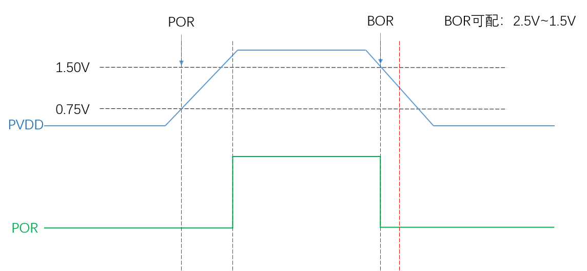 

<div align="center"> 图4-1 上/下电时序图 </div>  <br>  <br>  <br>

系统上电，PVDD上升到1.5V，系统完成POR；当PVDD下降到触发BOR的电压值（2.5V-1.5V可配置）时，PMU输出复位信号，系统复位。

#### 典型电源电路

推荐使用SF30147C给SF32LB56xV及各种外设供电，电路图参考如图4-2所示，具体说明参见表4-1。

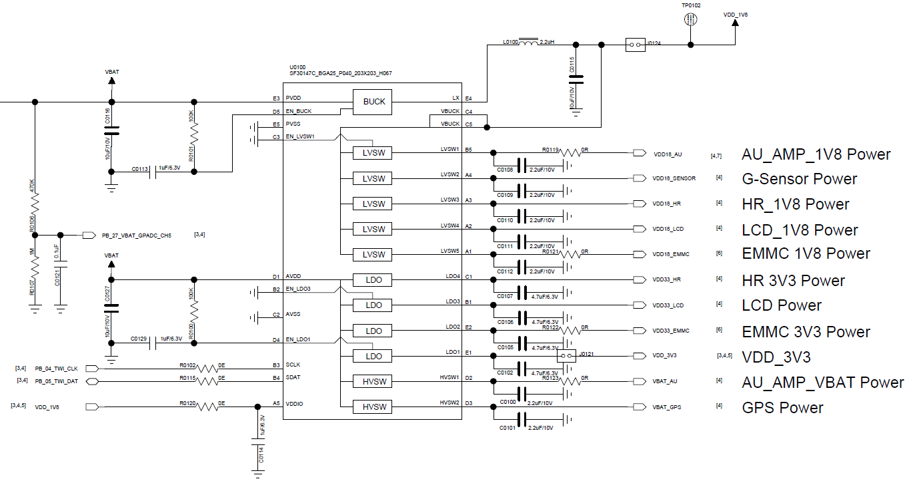 

<div align="center"> 图4-2 SF30147C供电图 </div>  <br>  <br>  <br>

SF32LB56xV系列芯片内置1路BUCK输出，如图4-3所示。

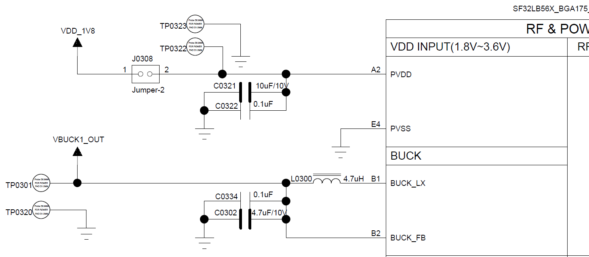 

<div align="center"> 图4-3 内置BUCK电路图 </div>  <br>  <br>  <br>

SF32LB56xV系列芯片内置4路LDO，如图4-4所示。

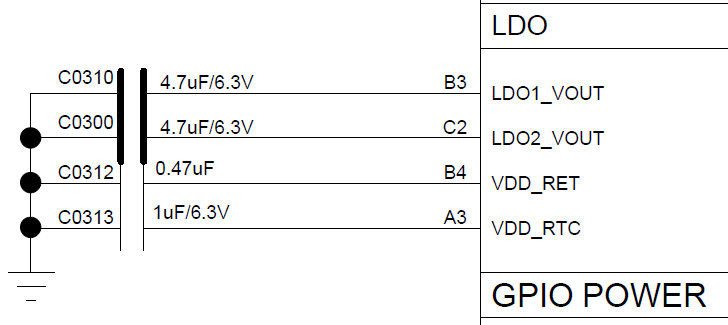 

<div align="center"> 图4-4 内置LDO电路图 </div>  <br>  <br>  <br>

#### 处理器BUCK电感选择要求

:::{important}
**功率电感关键参数**

L(电感值) = 4.7uH ± 20%，DCR(直流阻抗) ≦ 0.4 ohm，Isat(饱和电流) ≧ 450mA。
:::

#### 电池及充电控制

运动手表一般内置一块聚合物锂电池包，整个电源系统需要增加一套充电电路来完成电池的充电。

典型的充电电路由保护电路(EOS、ESD和OVP保护)、充电管理芯片和电池等组成。图4-5电路中的充电管理芯片不带路径管理功能，系统电源直接和电池VBAT挂在一起。该方案的成本较低，缺点是下游模块无法与VBAT彻底断开，漏电功耗较大，长期放置容易造成电池过放。

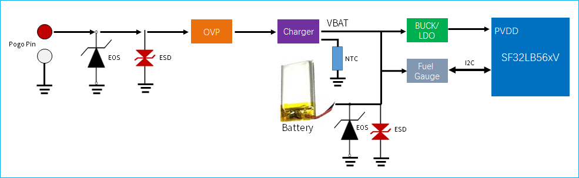 

<div align="center"> 图4-5 典型充电电路一 </div>  <br>  <br>  <br>

如图4-6所示，充电管理芯片的涓流充电电流必须大于i1+i2，才能实现对过放电池的充电，如果涓流充电电流小于i1+i2，导致无法对过放的电池进行充电。

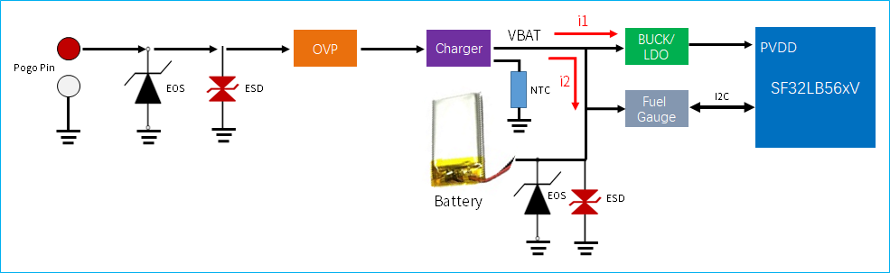 

<div align="center"> 图4-6 过放电池充电电路示意图 </div>  <br>  <br>  <br>

图4-7电路中的充电管理芯片带有路径管理功能，由于VSYS给系统供电和VBAT给电池充电是分开的，即使电池过放，也不影响对下游系统的供电。

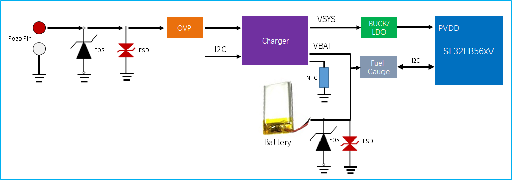 

<div align="center"> 图4-7 典型充电电路二 </div>  <br>  <br>  <br>

### 启动模式

SF32LB56xV系列芯片提供一个Mode管脚来配置启动模式，不使用时可悬空，参考电路图如图4-8所示：

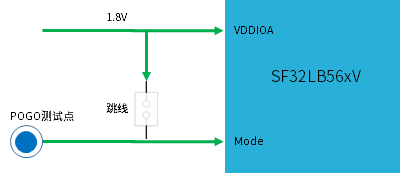 

<div align="center"> 图4-8 Mode管脚推荐电路图 </div>  <br>  <br>  <br>

:::{attention}
**Mode管脚定义：**

=1，系统启动时进入下载模式，不会进入用户程序；
=0，系统启动时rom会检查是否存在用户程序，存在就进入用户程序，否则就进入下载模式。

**注意事项：**

1. Mode的电压域是和VDDIOA同一电压域；
2. Mode外接10K电阻到电源或GND，保持电平稳定，不能悬空也不能有toggle干扰；
3. Mode管脚在量产板上必须留测试点，程序下载或校准晶体时要用到，可以不用预留跳线；
4. Mode管脚在测试板上建议要预留跳线，程序死机后方便从下载模式启动下载程序。
:::

### 处理器工作模式及唤醒源

SF32LB56xV系列芯片HCPU和LCPU都支持表4-4中的多种工作模式。

<div align="center"> 表4-4 CPU工作模式列表 </div>

```{table}
:align: center
| 工作模式      | CPU   | 外设  | SRAM                              | IO       | LPTIM | 唤醒源                                    | 唤醒时间         |
| ------------- | ----- | ----- | --------------------------------- | -------- | ----- | ----------------------------------------- | ---------------- |
| Active        | Run   | Run   | 可访问                            | 可翻转   | Run   |                                           |                  |
| WFI/WFE       | Stop  | Run   | 可访问                            | 可翻转   | Run   | 任意中断                                  | < 0.5us          |
| DEEPWFI       | Stop  | Run   | 可访问                            | 可翻转   | Run   | 任意中断                                  | < 5us            |
| Light sleep   | Stop  | Stop  | 不可访问，  全保留                | 电平保持 | Run   | RTC/GPIO/  LPTIM/LPCOMP/  跨系统中断/蓝牙 | < 100us          |
| Deep sleep    | Stop  | Stop  | 不可访问，  全保留                | 电平保持 | Run   | RTC/GPIO/  LPTIM/LPCOMP/  跨系统中断/蓝牙 | < 300us          |
| Standby       | Reset | Reset | 不可访问，LP全保留，HP只保留160KB | 电平保持 | Run   | RTC/按键/LPTIM/  跨系统中断/蓝牙          | 1.5ms  +recovery |
| Hibernate rtc | Reset | Reset | 数据不保留                        | 高阻     | Reset | RTC/按键                                  | > 2ms            |
| Hibernate pin | Reset | Reset | 数据不保留                        | 高阻     | Reset | 按键                                      | > 2ms            |
```

:::{attention}
- 使用Standby mode作为关机：
  * 由于GPIO的电平可以保持，VDDIOSA和VDDIOSB可以常供电，合封的存储器IO上不会漏电。
  * 需要将MPI1,MPI2上的存储设备设置为低功耗模式来降低功耗。
- 使用Hibernate mode作为关机：
  * 由于GPIO的电平无法保持，VDDIOSA和VDDIOSB的供电需要关闭，避免合封存储器的IO上漏电。
  * VDDIOSA和VDDIOSB的供电开关的控制信号使用PBR0。
- VDDIOSC需要常供电，进入Hibernate mode前使NOR Flash进入deep power down mode。
:::

如表4-5所示，全系列芯片支持14个可唤醒中断源，可以唤醒大核或小核CPU。

<div align="center"> 表4-5 可唤醒中断源列表 </div>

```{table}
:align: center
| 中断源     | 管脚 | 详细描述   |
| ---------- | ---- | ---------- |
| WKUP_PIN0  | PB32 | 中断信号0  |
| WKUP_PIN1  | PB33 | 中断信号1  |
| WKUP_PIN2  | PB34 | 中断信号2  |
| WKUP_PIN3  | PB35 | 中断信号3  |
| WKUP_PIN4  | PB36 | 中断信号4  |
| WKUP_PIN5  | PA50 | 中断信号5  |
| WKUP_PIN6  | PA51 | 中断信号6  |
| WKUP_PIN7  | PA52 | 中断信号7  |
| WKUP_PIN8  | PA53 | 中断信号8  |
| WKUP_PIN9  | PA54 | 中断信号9  |
| WKUP_PIN10 | PBR0 | 中断信号10 |
| WKUP_PIN11 | PBR1 | 中断信号11 |
| WKUP_PIN12 | PBR2 | 中断信号12 |
| WKUP_PIN13 | PBR3 | 中断信号13 |
```

### 时钟

SF32LB56xV系列芯片需要外部提供2个时钟源，48MHz主晶体和32.768KHz RTC晶体，晶体的具体规格要求和选型请参见表4-6，表4-7所示。

:::{important}
**晶体关键参数**

<div align="center"> 表4-6 晶体规格要求 </div>

```{table}
:align: center
|晶体|晶体规格要求   |详细描述  |
|:--|:-------|:--------|
|48MHz |7pF≦CL≦12pF（推荐值8.8pF） △F/F0≦±10ppm ESR≦30 ohms（推荐值22ohms）|晶振功耗和CL,ESR相关,CL和ESR越小功耗越低，为了最佳功耗性能，建议采用CL和ESR在要求范围内相对较小值的物料。晶体旁边预留并联匹配电容,当CL<12pF时，无需焊接电容|
|32.768KHz |CL≦12.5pF（推荐值7pF）△F/F0≦±20ppm ESR≦80k ohms（推荐值38Kohms）|晶振功耗和CL,ESR相关,CL和ESR越小功耗越低，为了最佳功耗性能，建议采用CL和ESR在要求范围内相对较小值的物料。晶体旁边预留并联匹配电容,当CL<12.5pF时，无需焊接电容|
```

**晶体推荐**

<div align="center"> 表4-7 推荐晶体列表 </div>

```{table}
:align: center
| 型号                | 厂家    | 参数                                                         |
| ------------------- | ------- | ------------------------------------------------------------ |
| E1SB48E001G00E      | Hosonic | F0 = 48.000000MHz，△F/F0 = -6 ~ 8 ppm，  CL = 8.8 pF，ESR =  22 ohms Max  TOPR  = -30 ~ 85℃，Package =（2016 公制） |
| ETST00327000LE      | Hosonic | F0 = 32.768KHz，△F/F0  = -20 ~ 20 ppm，  CL = 7 pF，ESR =  70K ohms Max  TOPR  = -40 ~ 85℃，Package =（3215 公制） |
| SX20Y048000B31T-8.8 | TKD     | F0 = 48.000000MHz，△F/F0 = -10 ~ 10 ppm，  CL = 8.8 pF，ESR =  40 ohms Max  TOPR  = -20 ~ 75℃，Package =（2016 公制） |
| SF32K32768D71T01    | TKD     | F0 = 32.768KHz，△F/F0  = -20 ~ 20 ppm，  CL = 7 pF，ESR =  70K ohms Max  TOPR  = -40 ~ 85℃，Package =（3215 公制） |
```
注：SX20Y048000B31T-8.8的ESR略大，静态功耗也会略大些。
   PCB走线时，在晶体下面至少挖掉第二层的GND铜来减少时钟信号上的寄生负载电容。
:::

详细的物料认证信息，请参考：
[SIFLI-MCU-AVL-认证表](index)

### 射频

SF32LB56xV系列芯片射频PCB走线要求为50ohms特征阻抗，如果天线是匹配好的，射频上无需再增加额外器件。设计时建议预留π型匹配网络用来杂散滤波。请参考图4-9所示电路。


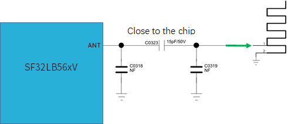 

<div align="center"> 图4-9 射频电路图 </div>  <br>  <br>  <br>

### 大小核处理器如何接外设

SF32LB56xV系列芯片内部有2个处理器系统，其中PAx的GPIO接到HCPU系统，PBx的GPIO接到LCPU系统；HCPU可以访问LCPU的所有外设资源，LCPU不推荐访问HCPU的资源。HCPU最高可以跑到240HMz主频，用来提供高性能运算、图形处理和高分辨率/帧率显示，外挂存储器、显示接口和其他高功耗的设备需要接到HCPU上。

LCPU常规跑48M@0.9V，最高可以跑到96M@1.1V，用来处理BLE的协议栈和低功耗模式下的心率和加速度传感器控制、充电和PMIC管理、电压监测和开关机管理。   

### 显示

SF32LB56xV系列芯片支持3-Line SPI、4-Line SPI、Dual data SPI、Quad data SPI、DBI 8080、DPI和串/并行JDI 接口。支持16.7M-colors（RGB888）、262K-colors（RGB666）、65K-colors（RGB565）和 8-color（RGB111）Color depth模式。最高支持1024RGBx1024 分辨率。LCD driver支持列表如表4-8所示。

<div align="center"> 表4-8 LCD driver支持列表 </div>

```{table}
:align: center
| 型号     | 厂家       | 分辨率  | 类型   | 接口                                                         |
| -------- | ---------- | ------- | ------ | ------------------------------------------------------------ |
| RM69090  | Raydium    | 368*448 | Amoled | 3-Line SPI，4-Line  SPI，Dual data SPI，  Quad data SPI，MIPI-DSI |
| RM69330  | Raydium    | 454*454 | Amoled | 3-Line SPI，4-Line  SPI，Dual data SPI，  Quad data SPI，8-bits  8080-Series MCU ，MIPI-DSI |
| ILI8688E | ILITEK     | 368*448 | Amoled | Quad data SPI，MIPI-DSI                                      |
| SH8601A  | 晟合技术   | 454*454 | Amoled | 3-Line SPI，4-Line  SPI，Dual data SPI，  Quad data SPI，8-bits  8080-Series MCU ，MIPI-DSI |
| SPD2012  | Solomon    | 356*400 | TFT    | Quad data SPI                                                |
| GC9C01   | Galaxycore | 360*360 | TFT    | Quad data SPI                                                |
| ST77903  | Sitronix   | 400*400 | TFT    | Quad data SPI                                                |
```

#### SPI/QSPI 显示接口

SF32LB56xV系列芯片支持 3/4-wire SPI和Quad-SPI 接口来连接LCD显示屏，各信号描述如表4-9所示。

<div align="center"> 表4-9 SPI/QSPI屏信号连接方式 </div>

```{table}
:align: center
| SPI信号      | I/O  | 详细描述                                             |
| ------- | ---- | -------------------------------------------------------- |
| CSX     | PA36 | 使能信号                                                  |
| WRX_SCL | PA37 | 时钟信号                                                  |
| DCX     | PA39 | 4-wire SPI 模式下的数据/命令信号  Quad-SPI 模式下的数据1    |
| SDI_RDX | PA38 | 3/4-wire SPI 模式下的数据输入信号  Quad-SPI 模式下的数据0   |
| SDO     | PA38 | 3/4-wire SPI 模式下的数据输出信号  请和SDI_RDX短接到一起    |
| D[0]    | PA40 | Quad-SPI 模式下的数据2                                    |
| D[1]    | PA41 | Quad-SPI 模式下的数据3                                    |
| REST    | PA43 | 复位显示屏信号                                            |
| TE      | PA33 | Tearing effect to MCU frame signal                       |
```

#### MCU8080显示接口

SF32LB56xV系列芯片支持 MCU8080 接口来连接LCD显示屏，如表4-10所示。

<div align="center"> 表4-10 MCU8080屏信号连接方式 </div>

```{table}
:align: center
| MCU8080信号 | I/O  | 详细描述                            |
| :------ | :--- | :---------------------------------- |
| CSX     | PA36 | Chip  select                        |
| WRX     | PA37 | Writes  strobe signal to write data |
| DCX     | PA39 | Display  data / command selection   |
| RDX     | PA38 | Reads  strobe signal to write data  |
| D[0]    | PA40 | Data 0                              |
| D[1]    | PA41 | Data 1                              |
| D[2]    | PA28 | Data 2                              |
| D[3]    | PA29 | Data 3                              |
| D[4]    | PA30 | Data 4                              |
| D[5]    | PA31 | Data 5                              |
| D[6]    | PA32 | Data 6                              |
| D[7]    | PA34 | Data 7                              |
| REST    | PA43 | Reset                               |
| TE      | PA33 | Tearing effect to MCU frame signal  |
```

#### DPI显示接口

SF32LB56xV系列芯片支持DPI接口来连接LCD显示屏，如表4-11所示。

<div align="center"> 表4-11 DPI屏信号连接方式 </div>

```{table}
:align: center
| DPI信号 | I/O  | 详细描述                               |
| ------- | ---- | -------------------------------------- |
| CLK     | PA45 | 时钟信号                               |
| DE      | PA47 | 数据有效信号                           |
| HSYNC   | PA44 | 行同步信号                             |
| VSYNC   | PA42 | 列同步信号                             |
| SD      | PA50 | 控制关闭Display                        |
| CM      | PA51 | 切换Normal Color还是Reduce  Color Mode |
| R0      | PA14 | 像素信号                               |
| R1      | PA13 | 像素信号                               |
| R2      | PA16 | 像素信号                               |
| R3      | PA24 | 像素信号                               |
| R4      | PA19 | 像素信号                               |
| R5      | PA21 | 像素信号                               |
| R6      | PA23 | 像素信号                               |
| R7      | PA25 | 像素信号                               |
| G0      | PA28 | 像素信号                               |
| G1      | PA30 | 像素信号                               |
| G2      | PA32 | 像素信号                               |
| G3      | PA33 | 像素信号                               |
| G4      | PA34 | 像素信号                               |
| G5      | PA29 | 像素信号                               |
| G6      | PA31 | 像素信号                               |
| G7      | PA35 | 像素信号                               |
| B0      | PA36 | 像素信号                               |
| B1      | PA37 | 像素信号                               |
| B2      | PA38 | 像素信号                               |
| B3      | PA43 | 像素信号                               |
| B4      | PA41 | 像素信号                               |
| B5      | PA39 | 像素信号                               |
| B6      | PA40 | 像素信号                               |
| B7      | PA46 | 像素信号                               |
```

#### JDI 显示接口

SF32LB56xV系列芯片支持并行和串行JDI接口来连接LCD显示屏，并行JDI如表4-12所示，串行JDI如表4-13所示。

<div align="center"> 表4-12 并行JDI屏信号连接方式 </div>

```{table}
:align: center
| JDI信号      | I/O  | 详细描述                                                     |
| ------------ | ---- | ------------------------------------------------------------ |
| JDI_VCK      | PA41 | Shift clock for the vertical driver                          |
| JDI_VST      | PA40 | Start signal for the vertical driver                         |
| JDI_XRST     | PA39 | Reset signal for the horizontal and  vertical driver         |
| JDI_HCK      | PA36 | Shift  clock for the horizontal driver                       |
| JDI_HST      | PA38 | Start signal for the horizontal driver                       |
| JDI_ENB      | PA43 | Write enable signal for the pixel memory                     |
| JDI_R1       | PA29 | Red image data (odd pixels)                                  |
| JDI_R2       | PA31 | Red image data (even pixels)                                 |
| JDI_G1       | PA34 | Green image data (odd pixels)                                |
| JDI_G2       | PA32 | Green image data (even pixels)                               |
| JDI_B1       | PA30 | Blue image data (odd pixels)                                 |
| JDI_B2       | PA28 | Blue image data (even pixels)                                |
| JDI_XFRP     | PBR1 | Liquid crystal driving signal  ("On" pixel)                  |
| JDI_VCOM/FRP | PBR2 | Common electrode driving signal/   Liquid crystal driving signal  ("Off" pixel) |
```

<div align="center"> 表4-13 串行JDI屏信号连接方式 </div>

```{table}
:align: center
| JDI信号      | 管脚 | 详细描述                         |
| ------------ | ---- | -------------------------------- |
| JDI_SCS      | PA39 | Chip Select Signal               |
| JDI_SCLK     | PA41 | Serial Clock Signal              |
| JDI_SO       | PA40 | Serial  Data Output Signal       |
| JDI_DISP     | PA36 | Display  ON/OFF Switching Signal |
| JDI_EXTCOMIN | PA38 | COM Inversion Polarity Input     |
```

#### 触摸和背光接口

SF32LB56xV系列芯片支持I2C格式的触摸屏控制接口和触摸状态中断输入，同时支持1路PWM信号来控制背光电源的使能和亮度，如表4-14所示。

<div align="center"> 表4-14 触摸和背光控制连接方式 </div>

```{table}
:align: center
| 触摸屏和背光信号 | 管脚 | 详细描述                   |
| ---------------- | ---- | -------------------------- |
| Interrupt        | PA50 | 触摸状态中断信号（可唤醒） |
| I2C1_SCL         | PA48 | 触摸屏I2C的时钟信号        |
| I2C1_SDA         | PA49 | 触摸屏I2C的数据信号        |
| BL_PWM           | PA35 | 背光PWM控制信号            |
| Reset            | PA44 | 触摸复位信号               |
```

### 存储

#### SF32LB56xV外接存储器

SF32LB56xV支持SPI Nor/Nand、SD Nand Flash和eMMC外设，其中SPI Nor/NAND Flash采用MPI接口，SD NAND Flash采用SD接口，这几种类型的flash芯片物理管脚完全兼容。接口定义如表4-15，4-16所示，表中的PA06~PA11这几个GPIO供电管脚是VDDIOA2，独立于其他GPIO的电压域。

MPI的信号定义如表4-15所示，SD的信号定义如表4-16所示，eMMC的信号定义如表4-17所示。

<div align="center"> 表4-15 SPI Nor/Nand Flash信号连接 </div>

```{table}
:align: center
| Flash 信号 | I/O信号 | 详细描述                                    |
| ---------- | ------- | ------------------------------------------- |
| CS#        | PA06    | Chip select, active low.                    |
| SO         | PA07    | Data Input (Data Input Output 1)            |
| WP#        | PA08    | Write Protect Output (Data Input Output  2) |
| SI         | PA09    | Data Output (Data Input Output 0)           |
| SCLK       | PA10    | Serial Clock Output                         |
| Hold#      | PA11    | Data Output (Data Input Output 3)           |
```
:::{note}
SPI NAND Flash的Hold#管脚需要通过10K电阻上拉到SPI NAND Flash的供电电源。
:::

<div align="center"> 表4-16 SD Nand Flash信号连接 </div>

```{table}
:align: center
| Flash 信号 | I/O信号 | 详细描述 |
| ---------- | ------- | -------- |
| SD2_CMD    | PA09    | 命令信号 |
| SD2_D1     | PA11    | 数据1    |
| SD2_D0     | PA10    | 数据0    |
| SD2_CLK    | PA08    | 时钟信号 |
| SD2_D2     | PA06    | 数据2    |
| SD2_D3     | PA07    | 数据3    |
```

<div align="center"> 表4-17 eMMC信号连接 </div>

```{table}
:align: center
| eMMC 信号 | I/O信号 | 详细描述 |
| --------- | ------- | -------- |
| SD1_CMD   | PA27    | 命令信号 |
| SD1_CLK   | PA26    | 时钟信号 |
| SD1_D0    | PA22    | 数据0    |
| SD1_D1    | PA15    | 数据1    |
| SD1_D2    | PA12    | 数据6    |
| SD1_D3    | PA20    | 数据3    |
| SD1_D4    | PA21    | 数据4    |
| SD1_D5    | PA19    | 数据 5   |
| SD1_D6    | PA13    | 数据6    |
| SD1_D7    | PA14    | 数据7    |
```

### 按键

SF32LB56xV系列芯片的PB32支持长按复位功能，推荐PB32设计为按键，同时支持短按开关机功能和长按复位功能。如图4-10所示，设计上采用高电平有效方式，长按复位功能需要长按10s以上芯片会自动复位。

SF32LB56xV系列芯片支持功能按键输入以及旋钮信号输入，按键或旋钮信号需要上拉。按键用法如图4-11所示。也可以支持光追踪传感器，推荐使用I2C4接口，信号连接如表4-18所示。

<div align="center"> 表4-18 光追踪传感器信号连接 </div>

```{table}
:align: center
| I2C信号 | I/O  | 详细描述                 |
| ------- | ---- | ------------------------ |
| SDA     | PA18 | 光追踪传感器I2C 数据信号 |
| SCL     | PA17 | 光追踪传感器I2C 时钟信号 |
```

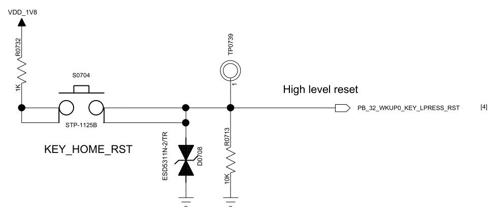 

<div align="center"> 图4-10 开关机按键电路图 </div>  <br>  <br>  <br>


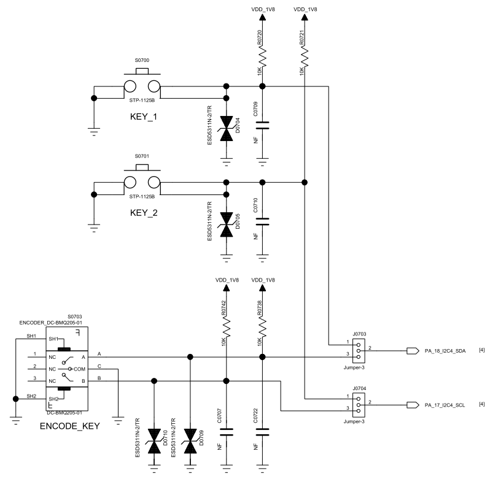 

<div align="center"> 图4-11 功能按键或旋钮电路图 </div>  <br>  <br>  <br>

:::{note}
一般的机械旋钮编码开关，有旋转后开关不能恢复到关闭状态，所以上拉电阻接的电源要求在待机时可以关闭，防止漏电。
:::

### 振动马达

SF32LB56xV系列芯片支持多路PWM输出，可以用做振动马达的驱动信号。图4-12所示为推荐电路，如果马达震动时的电流不会引起系统的不稳定，也可以直接使用VBAT供电。

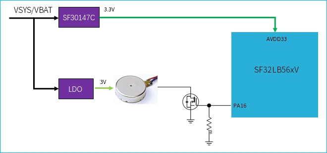 

<div align="center"> 图4-12 振动马达电路示意图 </div>  <br>  <br>  <br>

:::{important}
如果软件打开了`#define BSP PM FREQ SCALING 1`的HCPU主频降频功能宏定义,HCPU进入idle线程后，主频会变低，相对应Hcpu的PA口的PWM频率也会变化，
所以推荐使用PB接口来输出PWM信号。
:::

### 音频接口

SF32LB56xV系列芯片的音频相关接口，如表4-19所示，音频接口信号有以下特点：

- 支持一路差分ADC输入，外接模拟MIC，中间需要加容值至少2.2uF的隔直电容，模拟MIC的电源接芯片MIC_BIAS电源输出脚；
- 支持一路差分DAC输出，外接模拟音频PA， DAC输出的走线，按照差分线走线，做好包地屏蔽处理，还需要注意：Trace Capacitor < 10pF, Length < 2cm。 

<div align="center"> 表4-19 音频信号连接方式 </div>

```{table}
:align: center
| 音频信号  | I/O  | 详细描述               |
| --------- | ---- | ---------------------- |
| AU_ADC1P  | ADCP | 差分P或单端模拟MIC输入 |
| AU_ADC1N  | ADCN | 差分模拟MIC输入N或GND  |
| AU_DAC1P  | DACP | 差分模拟输出P          |
| AU_DAC1N  | DACN | 差分模拟输出N          |
| I2S1_LRCK | PA71 | I2S2帧时钟             |
| I2S1_SDI  | PA69 | I2S2数据输入           |
| I2S1_SDO  | PA64 | I2S2数据输出           |
| I2S1_BCK  | PA73 | I2S2位时钟             |
```

SF32LB56xV系列芯片模拟MEMS MIC推荐电路如图4-13所示，模拟ECM MIC 单端推荐电路如图4-14所示，模拟ECM MIC 差分推荐电路如图4-15所示，其中AU_ADC1P，AU_ADC1N是连接到SF32LB56xV的ADC输入管脚。

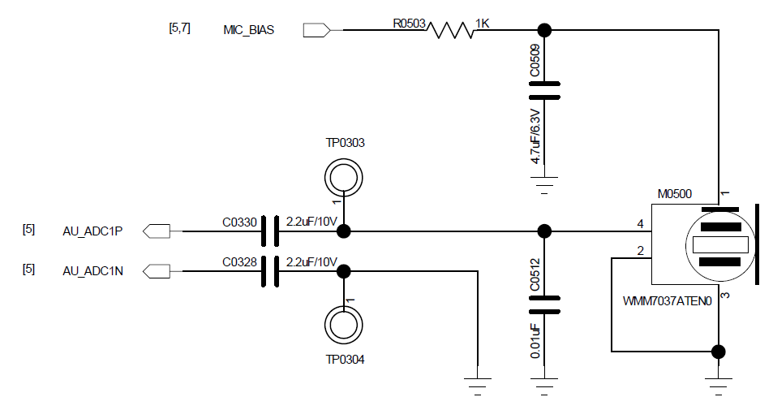 

<div align="center"> 图4-13 模拟MEMS MIC输入电路图 </div>  <br>  <br>  <br>


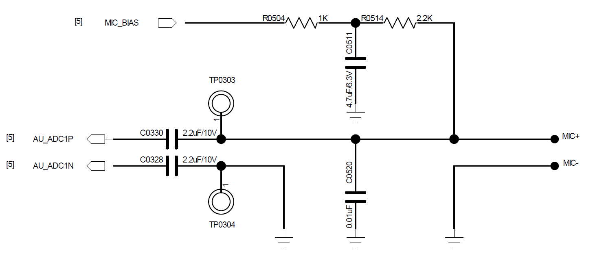 

<div align="center"> 图4-14 模拟ECM单端输入电路图 </div>  <br>  <br>  <br>


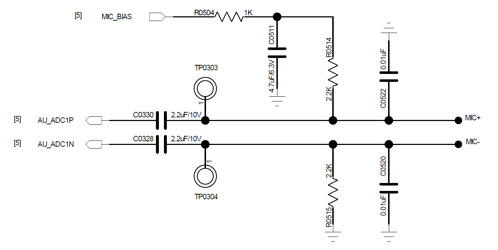 

<div align="center"> 图4-15 模拟ECM差分输入电路图 </div>  <br>  <br>  <br>

SF32LB56xV系列芯片的模拟音频输出推荐电路如图4-16所示，注意虚线框内的差分低通滤波器要靠近芯片端放置 。


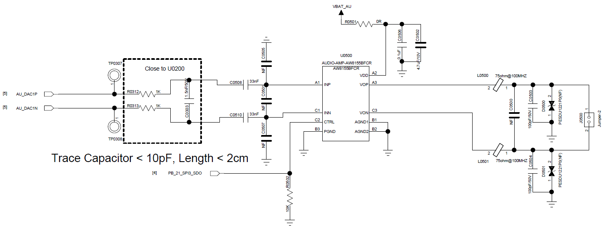 

<div align="center"> 图4-16 模拟音频PA电路图 </div>  <br>  <br>  <br>

I2S音频PA连接电路图如图4-17所示，采用I2C3配置I2S音频PA的寄存器。


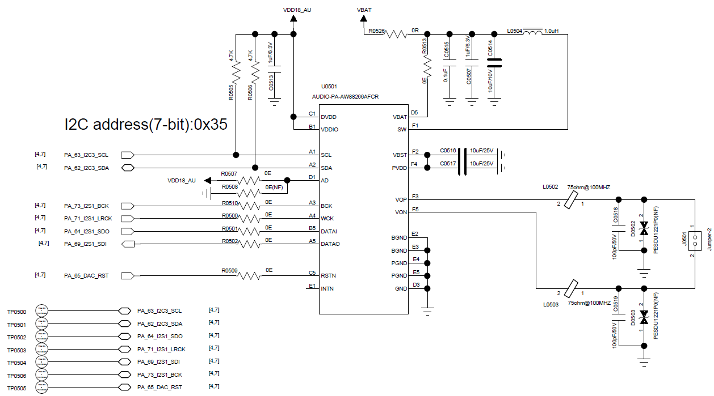 

<div align="center"> 图4-17 I2S音频PA电路图 </div>  <br>  <br>  <br>

### PBR接口说明

SF32LB56xV系列芯片提供4个PBR接口，其主要特点：

- PBR0在开机阶段会从0变1， 用来做某些外部LSW控制，PBR1-PBR3都是默认输出0；
- PBR0-PBR3无论是standby还是hibernate，都可以做输出；
- PBR0-PBR3可以输出LPTIM信号；
- PBR1-PBR3可以输出32K时钟信号；
- PBR0-PBR3可以配置为输入，用来做唤醒信号输入，MCU醒的时候，收不到中断。

### 传感器

SF32LB56xV系列芯片支持心率，加速度传感器等，设计中，需要注意心率，加速度传感器的I2C，SPI，控制接口，中断唤醒等接口，推荐使用LCPU的PB接口。心率和加速传感器的供电电源，采用SF30147C的LVSWx或LDO输出，可以实现供电电源根据需要进行开关。

### UART和I2C管脚设置

SF32LB56xV系列芯片支持任意管脚UART和I2C功能映射，所有的PA接口都可以映射成UART或I2C功能管脚。PB口除了PB32~36和PBR0~3外，所有的IO都可以映射成UART或I2C功能管脚。

### GPTIM管脚设置

SF32LB56xV系列芯片支持任意管脚GPTIM功能映射，所有的PA接口都可以映射成GPTIM功能管脚。PB口除了PB32~36和PBR0~3外，所有的IO都可以映射成GPTIM功能管脚。

### 调试和下载接口

SF32LB56xV系列芯片支持Arm®标准的SWD调试接口，可以连接到EDA工具上进行单步运行调试。如图4-18所示，连接SEEGER® J-Link® 工具时需要把调试工具的电源修改为外置接口输入，通过SF32LB56xV电路板给J-Link工具供电。

SF32LB56xV系列有1路SWD进行调试信息输出，有1路默认的UART口用来下载和打印log，具体请参考表4-20。

<div align="center"> 表4-20 调试口连接方式 </div>

```{table}
:align: center
| 信号         | 管脚 | 详细描述                       |
| ----------- | ---- | ----------------------------- |
| SWCLK       | PB15 | JLINK时钟信号，调试接口         |
| SWDIO       | PB13 | JLINK数据信号，调试接口         |
| UART4_RXD   | PB16 | 串口接收信号，下载和打印log接口  |
| UART4_TXD   | PB17 | 串口发送信号，下载和打印log接口  |
```

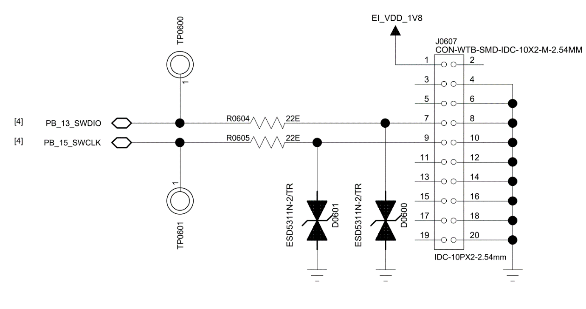 

<div align="center"> 图4-18 调试接口电路图 </div>  <br>  <br>  <br>

### 产线烧录和晶体校准

思澈科技提供脱机下载器来完成产线程序的烧录和晶体校准。

硬件设计时，请注意至少预留测试点：VBAT、GND、VDDIOB、Mode、SWDIO、SWCLK、RXD4、TXD4，PB20或PB21或PB25。

详细的烧录和晶体校准见“**_脱机下载器使用指南.pdf”文档，包含在开发资料包中。


### 原理图和PCB图纸检查列表

见“_Schematic checklist_.xlsx”和“_PCB checklist_.xlsx”文档，包含在开发资料包中。

## PCB设计指导

### PCB 封装设计

**封装尺寸**

SF32LB56xV芯片的封装为WBBGA封装，封装尺寸：6.5mmx6.1mmx0.94mm 管脚数：175；球间距：0.4mm, 详细尺寸如图5-1所示。

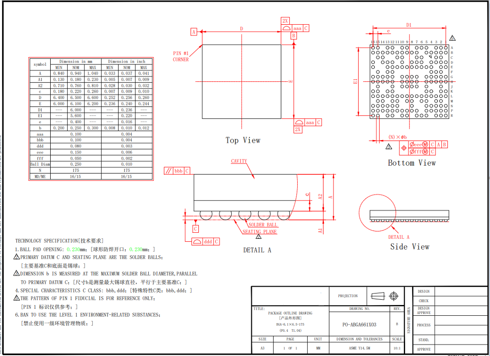  

<div align="center"> 图5-1 WBBGA封装尺寸图 </div>  <br> <br> <br>

**封装形状**

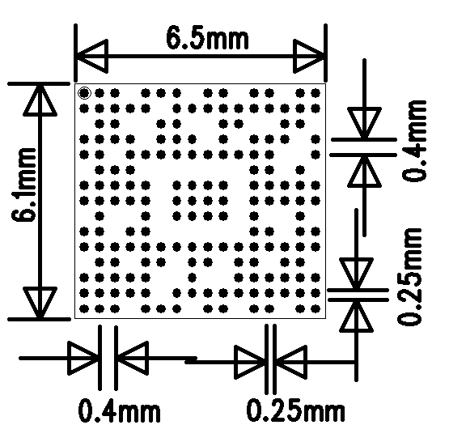  

<div align="center"> 图5-2 WBBGA封装形状图 </div>  <br> <br> <br>

**焊盘设计**

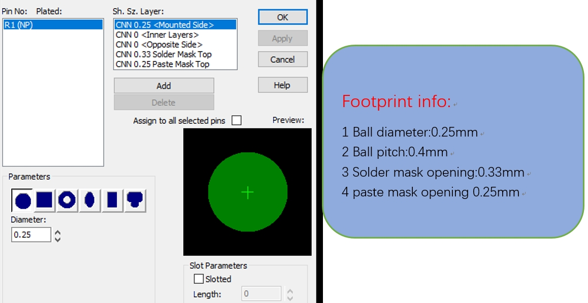  

<div align="center"> 图5-3 WBBGA 封装PCB焊盘设计参考 </div>  <br> <br> <br>

**封装PINOUT/BALLMAP**

SF32LB56xV的WBBGA封装PINOUT信息，如图5-4所示。

  

<div align="center"> 图5-4 SF32LB56xV封装PINOUT信息 </div>  <br> <br> <br>

**封装基板**

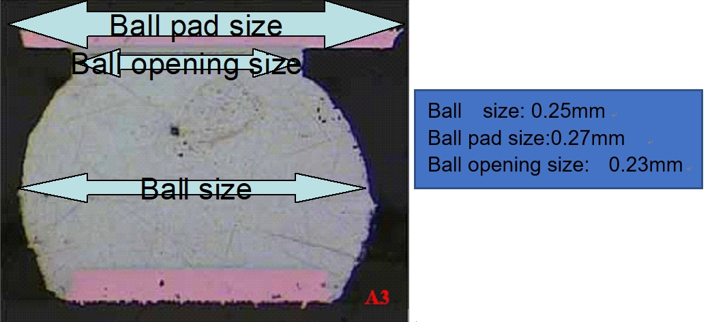  

<div align="center"> 图5-5 封装基板BALL信息 </div>  <br> <br> <br>

### PCB 叠层设计

SF32LB56xV系列芯片布局支持单双面，PCB不支持PTH板，只支持HDI板，推荐参考叠层如图示5-6所示。

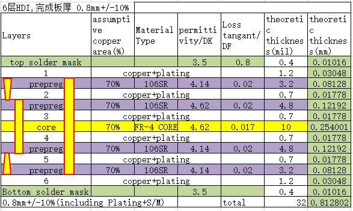  

<div align="center"> 图5-6 参考叠层结构图 </div>  <br> <br> <br>

### PCB通用设计规则

HDI板PCB通用设计规则如图5-7所示，单位为mm。

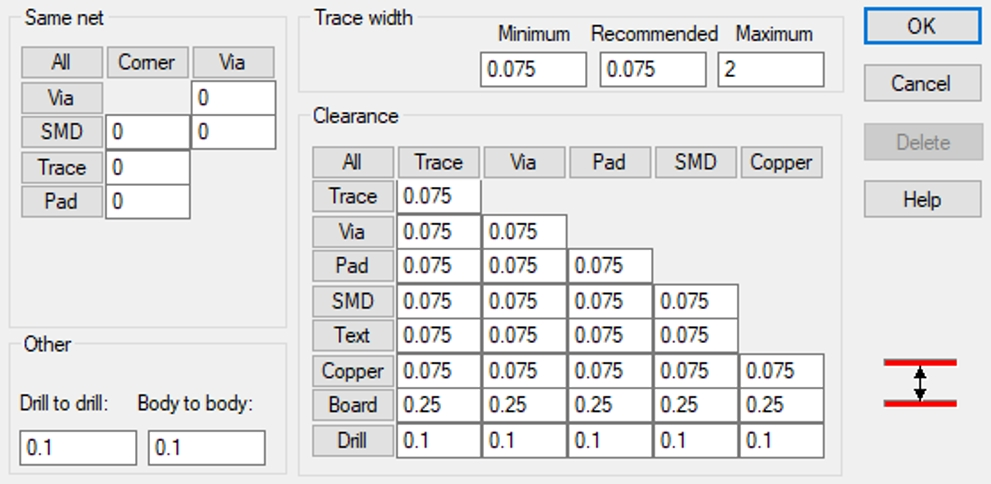  

<div align="center"> 图5-7 通用设计规则 </div>  <br> <br> <br>

#### 盲孔设计

PCB盲孔设计如图5-8所示，单位为mm。

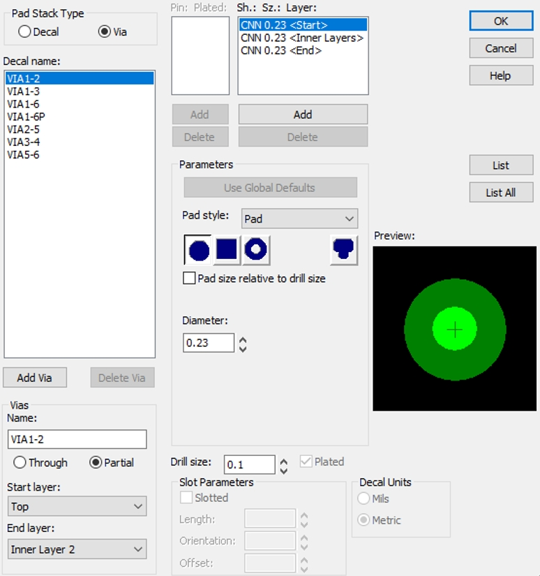  

<div align="center"> 图5-8 盲孔设计 </div>  <br> <br> <br>

#### 埋孔设计

PCB埋孔设计如图5-9所示，单位为mm。

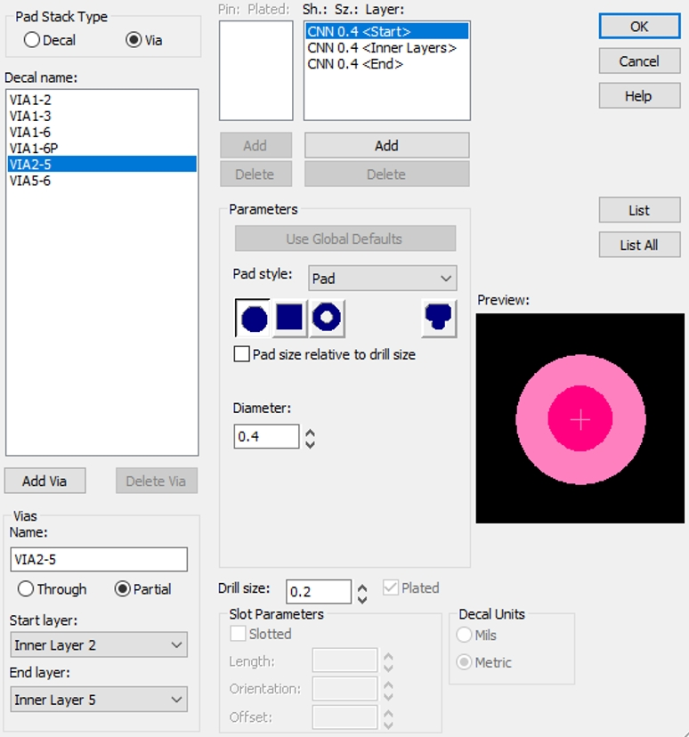  

<div align="center"> 图5-9 埋孔设计 </div>  <br> <br> <br>

### 芯片走线扇出

WBBGA封装行列前两排球通过表层扇出方式，如图5-10，其它的球通过内层扇出方式，如图示5-11 

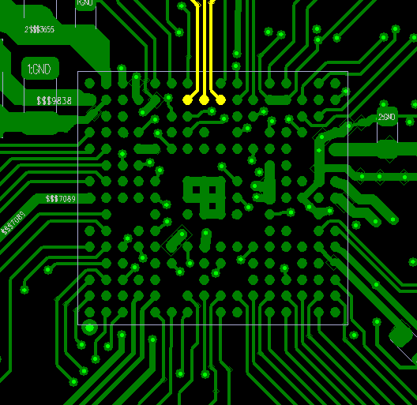  

<div align="center"> 图5-10 表层扇出参考图 </div>  <br> <br> <br>

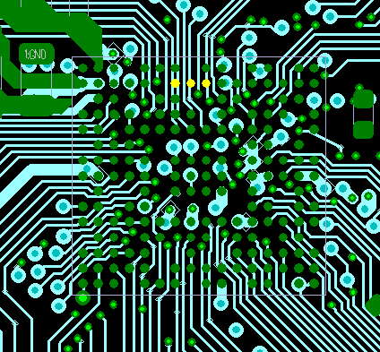  

<div align="center"> 图5-11 内层扇出参考图 </div>  <br> <br> <br>

### 时钟接口走线

晶体需摆放在屏蔽罩里面，离PCB板框间距大于1mm,尽量远离发热大的器件，如PA、Charge和PMU等电路器件，距离最好大于5MM以上，避免影响晶体频偏，晶体电路禁布区间距大于0.25mm避免有其它金属和器件，如图5-12所示。

  

<div align="center"> 图5-12 晶体布局图 </div>  <br> <br> <br>

48MHz晶体走线建议走表层长度要求控制在3-10mm区间,线宽0.075mm,必须立体包地处理，并且其走线需远离VBAT，DC/DC及高速信号线。48MHz晶体区域下方表层及临层做禁空处理，禁止其它走线从其区域走，如图5-13，5-14，5-15所示。

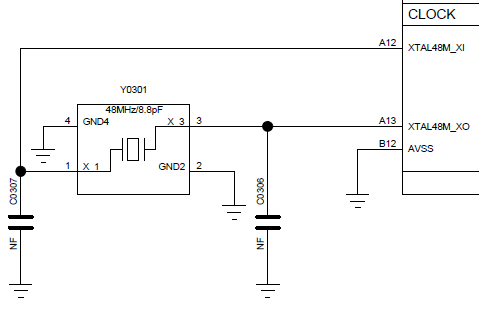  

<div align="center"> 图5-13 48MHz晶体原理图 </div>  <br> <br> <br>

  

<div align="center"> 图5-14 48MHz晶体走线模型 </div>  <br> <br> <br>

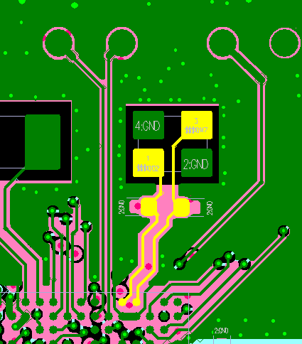  

<div align="center"> 图5-15 48MHz晶体走线参考 </div>  <br> <br> <br>

32.768KHz晶体建议走表层，走线长度控制≤10mm,线宽0.075mm,32K_XI/32_XO平行走线间距≥0.15mm,必须立体包地处理，晶体区域下方表层及临层做禁空处理，禁止其它走线从其区域走， 如图5-16，5-17，5-18所示。

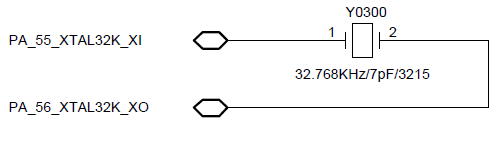  

<div align="center"> 图5-16  32.768KHz晶体原理图 </div>  <br> <br> <br>

  

<div align="center"> 图5-17  32.768KHz晶体走线模型 </div>  <br> <br> <br>

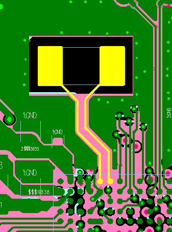  

<div align="center"> 图5-18  32.768KHz晶体走线参考 </div>  <br> <br> <br>

### 射频接口走线

射频匹配电路要尽量靠近芯片端放置，不要靠近天线端放置，AVDD_BRF射频电源其滤波电容尽量靠近芯片管脚放置，电容接地PIN 脚打孔直接接主地，RF信号的π型网络的原理图和PCB分别如图5-19，5-20所示。

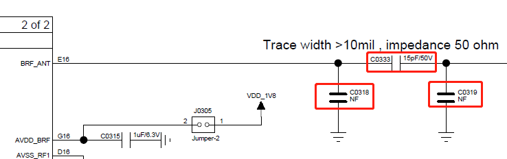  

<div align="center"> 图5-19 π型网络以及电源电路原理图</div>  <br> <br> <br>

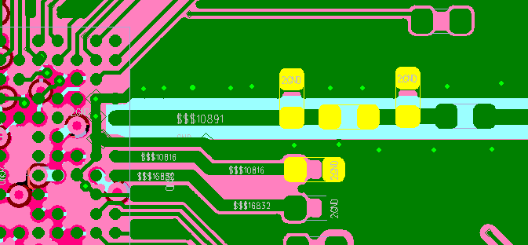  

<div align="center"> 图5-20 π型网络以及电源PCB布局 </div>  <br> <br> <br>

射频线建议走表层，避免打孔穿层影响RF 性能，线宽最好大于10mil，需要立体包地处理，避免走锐角和直角，射频线两边多打屏蔽地孔，射频线需做50欧阻抗控制，如图5-21, 5-22所示。

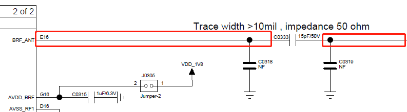  

<div align="center"> 图5-21 RF信号电路原理图 </div>  <br> <br> <br>

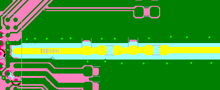  

<div align="center"> 图5-22 RF信号PCB走线 </div>  <br> <br> <br>

射频电路走线禁止DC-DC，VBAT和高速数字信号从其区域走，比如晶振，高频时钟，及数字接口信号（I2C,SPI,SDIO,I2S，UART等）。

AVSS_RRF，AVSS_TRF，AVSS_TRF2，AVSS_BB 为射频电路接地脚，必须保证其良好接地，建议在其焊盘上直接盲孔并连接到主地，如图5-23所示。

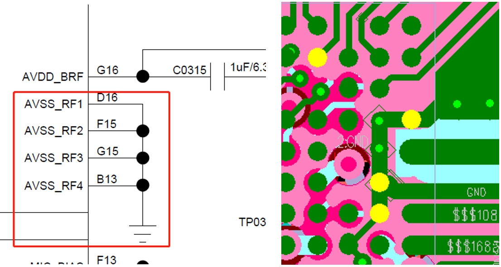  

<div align="center"> 图5-23 射频电路接地参考走线 </div>  <br> <br> <br>


### 音频接口走线

AVDD33_AUD为音频接口供电的管脚，其滤波电容靠近其对应管脚放置，滤波电容接地脚良好接主地，MIC_BIAS为音频接口麦克风的供电电路，其对应滤波电容靠近对应管脚放置，滤波电容接地脚良好接主地AUD_VREF滤波电容靠近管脚放置，如图5-24所示。

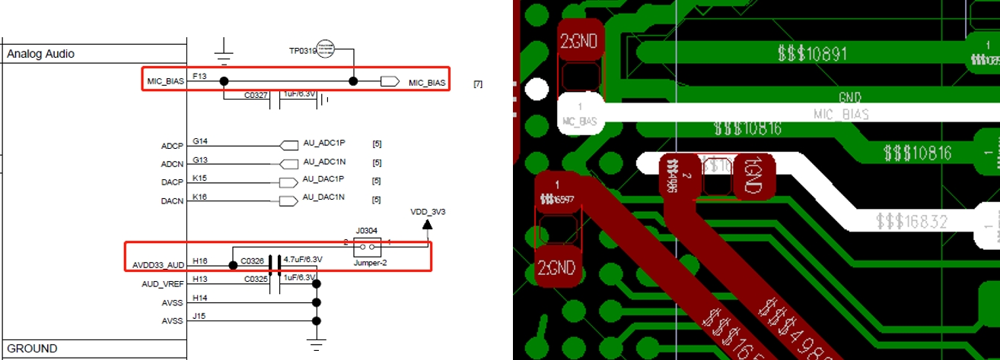  

<div align="center"> 图5-24  音频电路电源参考走线 </div>  <br> <br> <br>

ADCP/ADCN为模拟信号输入，对应电路器件尽量靠近对应管脚放置，每一路P/N需要按照差分线形式走线，走线线长尽量短，差分对走线做立体包地处理，其它接口强干扰信号，远离其走线，如图5-25所示。

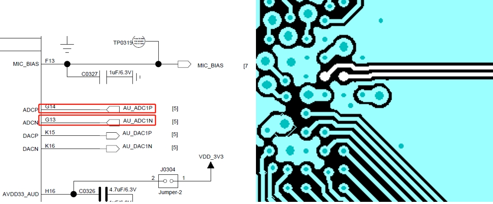  

<div align="center"> 图5-25  模拟音频输入参考走线 </div>  <br> <br> <br>


DACP/DACN为模拟信号输出，对应电路器件尽量靠近对应管脚放置，每一路P/N需要按照差分线形式走线，走线线长尽量短，走线寄生电容小于10pf, ,差分对走线需做立体包地处理，其它接口强干扰信号，远离其走线，如图5-26所示。

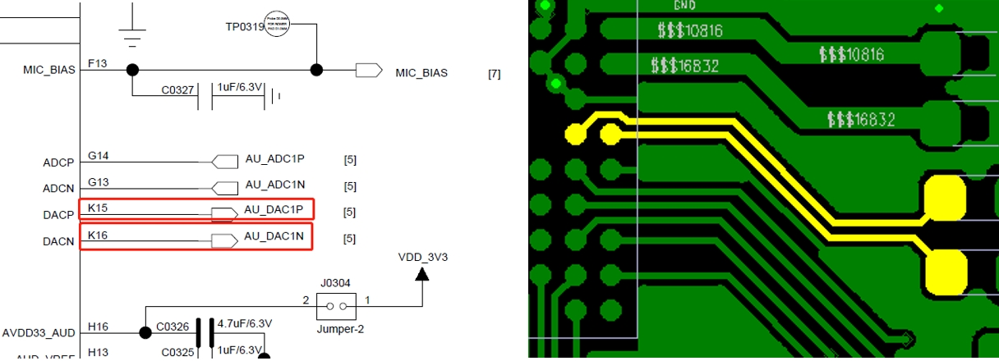  

<div align="center"> 图5-26  模拟音频输入参考走线 </div>  <br> <br> <br>


### USB 接口走线

USB走线必须先过ESD器件管脚，然后再到芯片端，要保证ESD器件接地PIN良好连接主地。PA17(USB DP)/PA18(USB_DN) 按照差分线形式走线，按照90欧差分阻抗控制，并做立体包处理，如图5-27所示。图5-28为USB信号的元件布局参考图和PCB走线模型。

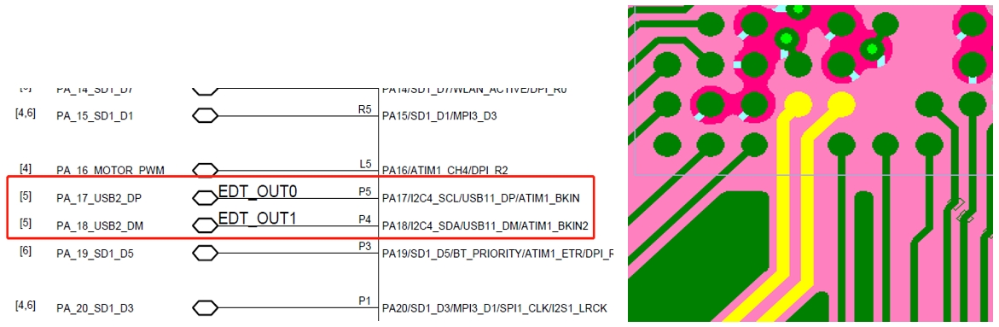  

<div align="center"> 图5-27  USB信号PCB设计 </div>  <br> <br> <br>


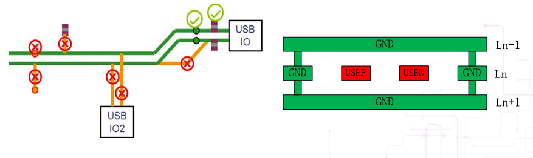  

<div align="center"> 图5-28  USB信号的元件布局参考图和USBPCB走线模型 </div>  <br> <br> <br>


### SDIO 接口走线

SF32LB56xV 支持2个SDIO接口，即SDIO1和SDIO2。所有的SDIO信号走线在一起，避免分开走，整个走线长度≤50mm, 组内长度控制≤6mm. SDIO接口时钟信号需立体包地处理，DATA和CM 信号也需要包地处理，如图5-29a，5-29b所示。

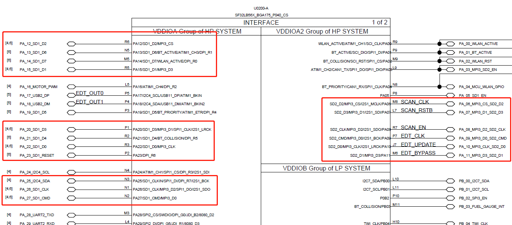  

<div align="center"> 图5-29a SDIO接口电路图 </div>  <br> <br> <br>

  

<div align="center"> 图5-29b SDIO PCB走线模型 </div>  <br> <br> <br>

### DC-DC 电路走线

DC-DC电路功率电感和滤波电容必须靠近芯片的管脚放置，BUCK_LX 走线尽量短且粗，保证整个DC-DC 电路回路电感小，所有的DC-DC输出滤波电容接地脚多打过孔连接到主地平面；BUCK_FB 管脚反馈线不能太细，必须大于0.25mm,功率电感区域表层禁止铺铜，临层必须为完整的参考地，避免其它线从电感区域里走线，如图5-30所示。

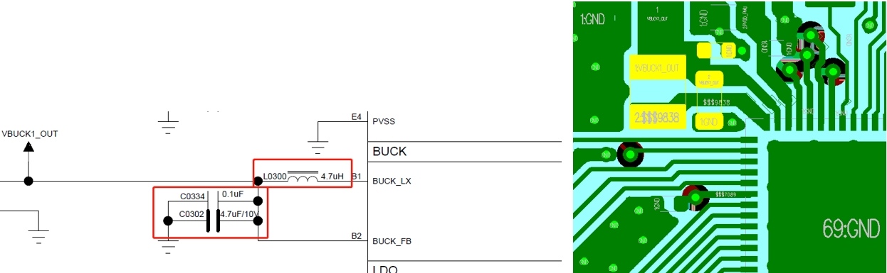  

<div align="center"> 图5-30 DC-DC 关键器件PCB布局图 </div>  <br> <br> <br>

### 电源供电走线

PVDD为芯片内置PMU 模块电源输入脚，对应的电容必须靠近管脚放置，走线尽量的粗，不能低于0.5mm; PVSS 为PMU模块接地脚，必须通过过孔连接到主地，避免浮空影响整个PMU 性能，如图5-31所示。

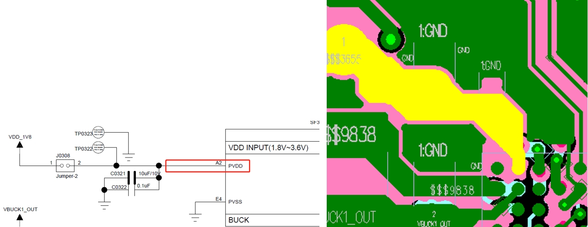  

<div align="center"> 图5-31 PVDD输入走线 </div>  <br> <br> <br>

### LDO和 IO 电源输入走线

所有的LDO输出和IO 电源输入管脚滤波电容靠近对应的管脚放置，其走线宽必须满足输入电流要求，走线尽量短粗，从而减少电源纹波提高系统稳定性；如图5-32所示。

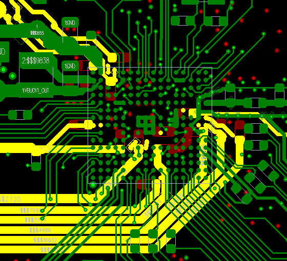  

<div align="center"> 图5-32 LDO和IO输入电源走线 </div>  <br> <br> <br>

### 其它接口走线

管脚配置为GPADC 管脚信号，必须要求立体包地处理，远离其它干扰信号，如电池电量电路，温度检查电路等。

PBR0~3管脚均可配置为时钟输出管脚信号网络，必须要求立体包地处理，远离其它干扰信号，如32K 输出等。

### SF32LB56xV芯片地走线

SF32LB56xV芯片中心区域的地网络需要用走线全部连接起来，保证足够的地平面并通过盲埋孔连接到主地平面。如图5-33a、5-33b所示。

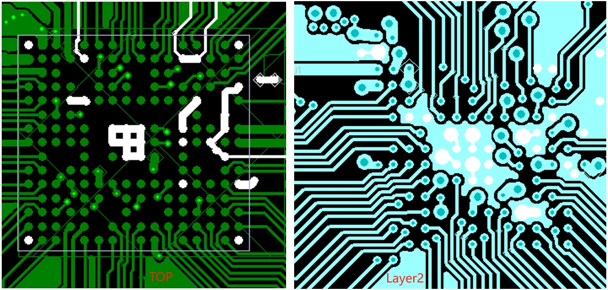  

<div align="center"> 图5-33a 芯片下1-2层地信号 </div>  <br> <br> <br>

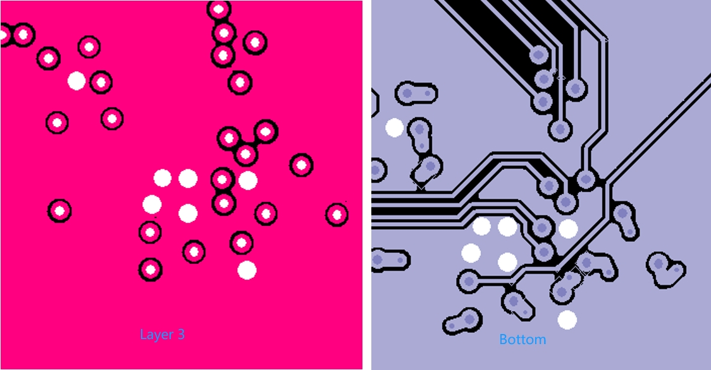  

<div align="center"> 图5-33b 芯片下3-4层地信号 </div>  <br> <br> <br>


### EMI&ESD 走线

避免屏蔽罩外面表层长距离走线，特别是时钟，电源等干扰信号尽量走内层，禁止走表层；ESD 保护器件必须靠近连接器对应管脚放置，信号走线先过ESD 保护器件管脚，避免信号分叉，没过ESD 保护管脚，ESD器件接地脚必须保证过孔连接主地，保证地焊盘走线短且粗，减少阻抗提高ESD器件性能。

### 其它

USB 充电线测试点必须放置在TVS 管前面，电池座TVS 管 放置在平台前面 其走线必须保证先过TVS 然后再到芯片端，如图5-34所示。


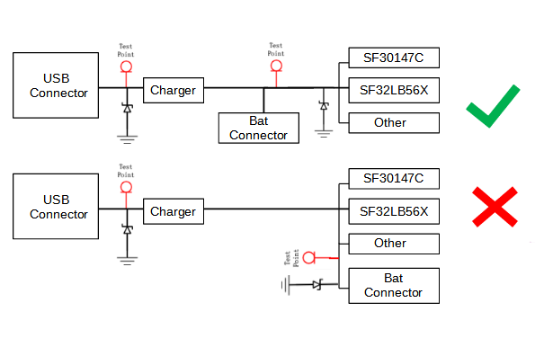  

<div align="center"> 图5-34 电源TVS布局参考 </div>  <br> <br> <br>

TVS 管接地脚尽量避免走长线再连接到地，如图5-35所示。


  

<div align="center"> 图5-35 TVS走线参考 </div>  <br> <br> <br>

## Q&A

问题1：为什么在Mode = 1 启动时，有些GPIO的默认状态和SPEC描述不同？

答：Mode = 1 启动会进入下载模式，会把外接Flash的MPI3相关GPIO的状态更改。

问题2：为什么焊接电池时可能会造成死机呢？如何避免？

答：由于烙铁的接地不好，可能浪涌冲击导致死机。可以在电池接口上加防浪涌和静电保护，烙铁做良好接地处理就可以避免这些问题。

##  修订历史

| 版本  | 日期   | 发布说明  |
| ----- | ------ | --------- |
| 0.0.1 | 9/2022 | Draft版本 |
|       |        |           |
|       |        |           |
