# SF32LB58x-硬件设计指南


## 基本介绍

本文的主要目的是帮助硬件工程师完成基于SF32LB58x系列芯片的原理图和PCB的设计。

SF32LB58x是一系列用于超低功耗人工智能物联网(AIoT) 场景下的高集成度、高性能的系统级(SoC) MCU芯片。芯片中的处理器能够很好地兼顾人机交互时的高计算性能与长时间待机时的超低运行与休眠功耗之间的平衡关系。可广泛用于腕带类可穿戴电子设备、智能移动终端、智能家居等各种应用场景。

本芯片集成了世界水平的低功耗蓝牙5.3收发机，接收灵敏度高，发射功率高，功耗低。

芯片提供了丰富的内部及外部存储资源。全封装芯片总共有多个QSPI存储器接口和SD/eMMC接口。并且针对不同的型号，芯片内部SIP有不同容量的NorFlash以及PSRAM组合。

为了便于更好地支持显示类应用，芯片提供了全方位的显示屏接口，其中包括MIPI-DSI，3/4-wire SPI，Dual/Quad data SPI，DBI 8080，DPI，并口/串口JDI等。

## 原理图设计指导

### 电源

SF32LB58x系列芯片内置有PMU电源单元，支持2路BUCK输出，需要外接电感和电容再返回到芯片内部的电源输入。还有3个内部LDO电源需要芯片外面接电容。SF32LB58x的手表方案设计，可以外搭思澈科技的PMIC芯片SF30147C，不但为SF32LB58x提供电源，也为相关的外设提供电源。

#### 思澈PMIC芯片电源分配

SF30147C是一款针对超低功耗可穿戴产品的高集成度、高效率、高性价比的电源管理芯片。SF30147C集成了4个LDO，每个LDO有较宽的输入和输出电压范围，最大可以提供100mA的负载电流。SF30147C针对不同的外设集成了7个低漏电、低导通电阻负载开关：2个高压负载开关，适用于电池电压直接驱动的外设，如音频功放等；5个低压开关，适用于1.8V供电的外设。SF32LB58x使用两个GPIO接口，模拟TWI信号，实现对SF30147C的控制。SF30147C的各路电源输出使用情况请见表2.1所示，该芯片的详细情况请参见《DS0002-SF30147C-芯片技术规格书》文档。

<div align="center"> 表2.1 SF30147C电源分配表 </div>

```{table}
:align: center
| SF30147C  电源管脚 | 最小电压(V) | 最大电压(V) | 最大电流(mA) | 详细描述                                                     |
| ------------------ | ----------- | ----------- | ------------ | ------------------------------------------------------------ |
| VBUCK              | 1.8         | 1.8         | 500          | SF32LB58x的PVDD1，PVDD2，VDDIOA，VDDIOA2，VDDIOB，AVDD_BRF，AVDD18_DSI等1.8V电源 |
| LVSW1              | 1.8         | 1.8         | 100          | I2S Class-K PA逻辑供电                                   |
| LVSW2              | 1.8         | 1.8         | 100          | G-SENSOR 1.8V供电                                        |
| LVSW3              | 1.8         | 1.8         | 150          | 心率 1.8V供电                                            |
| LVSW4              | 1.8         | 1.8         | 150          | LCD 1.8V供电                                             |
| LVSW5              | 1.8         | 1.8         | 150          | EMMC CORE供电                                            |
| LDO1               | 2.8         | 3.3         | 100          | SF32LB58x的AVDD33_USB，AVDD33_ANA，AVDD33_AUD，AVDDIOA2等3.3V电源 |
| LDO2               | 2.8         | 3.3         | 100          | EMMC或SD NAND供电                                        |
| LDO3               | 2.8         | 3.3         | 100          | LCD 3.3V供电                                             |
| LDO4               | 2.8         | 3.3         | 100          | 心率3.3V供电                                             |
| HVSW1              | 2.8         | 5           | 150          | 模拟Class-K PA供电                                       |
| HVSW2              | 2.8         | 5           | 150          | GPS供电                                                  |
```
#### SF32LB58x供电要求

SF32LB58x系列芯片内部集成PMU供电规格如表2.2所示。

<div align="center"> 表2.2 PMU供电规格 </div>

```{table}
:align: center
| PMU电源  管脚      | 最小电压(V) | 典型电压(V) | 最大电压(V) | 最大电流(mA) | 详细描述                                                    |
| ------------------ | ----------- | ----------- | ----------- | ------------ | ----------------------------------------------------------- |
| PVDD1              | 1.71        | 1.8         | 3.6         | 100          | PVDD1 电源输入                                              |
| PVDD2              | 1.71        | 1.8         | 3.6         | 50           | PVDD2 电源输入                                              |
| BUCK1_LX  BUCK1_FB | -           | 1.25        | -           | 100          | BUCK1_LX输出，接电感内部电源输入1，接电感另一端，且外接电容 |
| BUCK2_LX  BUCK2_FB | -           | 0.9         | -           | 50           | BUCK2_LX输出，接电感内部电源输入2，接电感另一端，且外接电容 |
| LDO_VOUT1          | -           | 1.1         | -           | 100          | LDO输出，外接电容                                           |
| VDD_RET            | -           | 0.9         | -           | 1            | RET LDO输出，外接电容                                       |
| VDD_RTC            | -           | 1.1         | -           | 1            | RTC LDO输出，外接电容                                       |
| MIC_BIAS           | 1.4         | -           | 2.8         | -            | MIC电源输出                                                 |
```

SF32LB58x系列芯片其他需要外部供电的电源规格如表2.3所示。

<div align="center"> 表2.3 其他电源供电规格 </div>

```{table}
:align: center
| 其它电源管脚 | 最小电压(V) | 典型电压(V) | 最大电压(V) | 最大电流(mA) | 详细描述                     |
| ------------ | ----------- | ----------- | ----------- | ------------ | ---------------------------- |
| AVDD_BRF     | 1.71        | 1.8         | 3.3         | 1            | 射频电源输入                 |
| AVDD18_DSI   | 1.71        | 1.8         | 2.5         | 20           | MIPI DSI电源输入  不用请悬空 |
| AVDD33_ANA   | 3.15        | 3.3         | 3.45        | 50           | 模拟电源+射频PA电源输入      |
| AVDD33_AUD   | 3.15        | 3.3         | 3.45        | 50           | 模拟音频电源输入             |
| AVDD33_USB   | 3.15        | 3.3         | 3.45        | 50           | USB电源输入                  |
| VDDIOA       | 1.71        | 1.8         | 3.45        | -            | PA12-PA93 I/O电源输入        |
| VDDIOA2      | 1.71        | 1.8         | 3.45        | -            | PA0-PA11 I/O电源输入         |
| VDDIOB       | 1.71        | 1.8         | 3.45        | -            | PB I/O电源输入               |
| VDDIOSA      | 1.71        | 1.8         | 1.98        | -            | SIPA电源输入                 |
| VDDIOSB      | 1.71        | 1.8         | 1.98        | -            | SIPB电源输入                 |
| VDDIOSC      | 1.71        | 1.8         | 1.98        | -            | SIPC电源输入                 |
```

SF32LB58x系列芯片电源管脚外接电容推荐值如表2.4所示

<div align="center"> 表2.4 电容推荐值 </div>

```{table}
:align: center
| 电源管脚           | 电容          | 详细描述                                       |
| ------------------ | ------------- | ---------------------------------------------- |
| PVDD1              | 0.1uF + 10uF  | 靠近管脚的地方至少放置10uF和0.1uF  共2颗电容.  |
| PVDD2              | 0.1uF + 10uF  | 靠近管脚的地方至少放置10uF和0.1uF  共2颗电容.  |
| BUCK1_LX  BUCK1_FB | 0.1uF + 4.7uF | 靠近管脚的地方至少放置4.7uF和0.1uF  共2颗电容. |
| BUCK2_LX  BUCK2_FB | 0.1uF + 4.7uF | 靠近管脚的地方至少放置4.7uF和0.1uF  共2颗电容. |
| LDO_VOUT1          | 4.7uF         | 靠近管脚的地方至少放置1颗4.7uF电容.            |
| VDD_RET            | 0.47uF        | 靠近管脚的地方至少放置1颗0.47uF电容.           |
| VDD_RTC            | 0.1uF         | 靠近管脚的地方至少放置1颗0.1uF电容.            |
| AVDD_BRF           | 1uF           | 靠近管脚的地方至少放置1颗1uF电容.              |
| AVDD18_DSI         | 4.7uF         | 靠近管脚的地方至少放置1颗4.7uF电容.            |
| AVDD33_ANA         | 1uF           | 靠近管脚的地方至少放置1颗1uF电容.              |
| AVDD33_AUD         | 4.7uF         | 靠近管脚的地方至少放置1颗4.7uF颗电容.          |
| AVDD33_USB         | 1uF           | 靠近管脚的地方至少放置1颗1uF电容.              |
| MIC_BIAS           | 1uF           | 靠近管脚的地方至少放置1颗1uF电容.              |
| VDDIOA             | 1uF           | 靠近管脚的地方至少放置1颗1uF电容.              |
| VDDIOA2            | 1uF           | 靠近管脚的地方至少放置1颗1uF电容.              |
| VDDIOB             | 1uF           | 靠近管脚的地方至少放置1颗1uF电容.              |
| VDDIOSA            | 1uF           | 靠近管脚的地方至少放置1颗1uF电容.              |
| VDDIOSB            | 1uF           | 靠近管脚的地方至少放置1颗1uF电容.              |
| VDDIOSC            | 1uF           | 靠近管脚的地方至少放置1颗1uF电容.              |
```

#### 上电时序和复位

SF32LB58x系列芯片内部POR(Power on reset) 和BOR（Brownout reset）功能，同时还支持外部硬件复位信号RSTN，具体要求如图2.1。


<div align="center"> 图2.1 上/下电时序图 </div>  <br> <br> <br>

SF32LB58x系列芯片的RSTN复位信号，需要上拉到PVDD1的输入电压域上，并接0.1uF电容到地，做一个RC延迟复位，如图2.2所示。


<div align="center"> 图2.2 复位电路图 </div>  <br> <br> <br>

#### 典型电源电路

SF32LB58x系列芯片可以使用思澈科技的PMIC SF30147C，供各种电源，各路输出情况如图2.3所示，具体使用情况请参见表2.1。


<div align="center"> 图2.3 SF30147C供电图 </div>  <br> <br> <br>

 SF32LB58x系列芯片封装内置2路BUCK输出，如图2.4所示。


<div align="center"> 图2.4 内置DCDC电路图 </div>  <br> <br> <br>

#### BUCK电感选择要求

:::{important}

**功率电感关键参数**

L(电感值) = 4.7uH，DCR(直流阻抗) ≦ 0.4 ohm，Isat(饱和电流) ≧ 500mA

:::

SF32LB58x系列芯片封装内置3路LDO输出，如图2.5所示。

 

<div align="center"> 图2.5 内置LDO电路图 </div>  <br> <br> <br>

### 启动模式

SF32LB58x系列芯片提供一个Mode管脚来配置启动模式，如表2.5所示。

<div align="center"> 表2.5 Mode模式描述 </div>

```{table}
:align: center
| Mode配置 | 详细描述                             |
| -------- | ------------------------------------ |
| 高       | 芯片上电启动后，进入下载模式         |
| 低       | 芯片上电启动后，跳转到用户程序区启动 |
```

:::{note}
**注意事项：**

1. Mode的电压域是和VDDIOA同一电压域；
2. Mode外接10K电阻到电源或GND，保持电平稳定，不能悬空也不能有toggle干扰；
3. Mode管脚在量产板上必须留测试点，程序下载或校准晶体时要用到，可以不用预留跳线；
4. Mode管脚在测试板上建议要预留跳线，程序死机后方便从下载模式启动下载程序。
:::

### 时钟

SF32LB58x系列芯片需要外部提供2个时钟源，48MHz主晶体和32.768KHz RTC晶体，具体要求如表2.6所示。

<div align="center"> 表2.6 晶体规格要求 </div>

```{table}
:align: center
|晶体|晶体规格要求   |详细描述  |
|:--|:-------|:--------|
|48MHz |7pF≦CL≦12pF（推荐值8.8pF） △F/F0≦±10ppm ESR≦30 ohms（推荐值22ohms）|晶振功耗和CL,ESR相关,CL和ESR越小功耗越低，为了最佳功耗性能，建议采用CL和ESR在要求范围内相对较小值的物料。晶体旁边预留并联匹配电容,当CL<12pF时，无需焊接电容|
|32.768KHz |CL≦12.5pF（推荐值7pF）△F/F0≦±20ppm ESR≦80k ohms（推荐值38Kohms）|晶振功耗和CL,ESR相关,CL和ESR越小功耗越低，为了最佳功耗性能，建议采用CL和ESR在要求范围内相对较小值的物料。晶体旁边预留并联匹配电容,当CL<12.5pF时，无需焊接电容|
```

 **晶体推荐**

<div align="center"> 表2.7 已认证晶体型号 </div>

```{table}
:align: center
| 型号                | 厂家    | 参数                                                         |
| ------------------- | ------- | ------------------------------------------------------------ |
| E1SB48E001G00E      | Hosonic | F0 = 48.000000MHz，△F/F0 = -6 ~ 8 ppm，  CL = 8.8 pF，ESR =  22 ohms Max  TOPR  = -30 ~ 85℃，Package =（2016 公制） |
| ETST00327000LE      | Hosonic | F0 = 32.768KHz，△F/F0  = -20 ~ 20 ppm，  CL = 7 pF，ESR =  70K ohms Max  TOPR  = -40 ~ 85℃，Package =（3215 公制） |
| SX20Y048000B31T-8.8 | TKD     | F0 = 48.000000MHz，△F/F0 = -10 ~ 10 ppm，  CL = 8.8 pF，ESR =  40 ohms Max  TOPR  = -20 ~ 75℃，Package =（2016 公制） |
| SF32K32768D71T01    | TKD     | F0 = 32.768KHz，△F/F0  = -20 ~ 20 ppm，  CL = 7 pF，ESR =  70K ohms Max  TOPR  = -40 ~ 85℃，Package =（3215 公制） |
```

:::{note}
SX20Y048000B31T-8.8的ESR略大，静态功耗也会略大些。

PCB走线时，在晶体下面至少挖掉第二层的GND铜来减少时钟信号上的寄生负载电容。
:::

详细的物料认证信息，请参考：
[SIFLI-MCU-AVL-认证表](index)

### 射频

SF32LB58x系列芯片的射频本身采用了片上集成宽带匹配滤波技术，只需保证射频PCB走线为50ohms特征阻抗即可。设计时建议预留π型匹配网络用来杂散滤波和天线匹配。请参考图2.6所示电路。

 

<div align="center"> 图2.6 射频电路图 </div>  <br> <br> <br>

:::{note}
**注意：**

匹配网络的器件参数值需根据实际天线和PCB布局进行测试来确定。
:::

### 外部存储接口

SF32LB58x系列芯片支持MPI3或MPI4接口外接Nor FLASH和SPI Nand FLASH；SD1接口外接SD NAND和EMMC。

#### QSPI Nand Flash接口

SF32LB58x系列芯片的EVB验证板默认使用'MPI4'外接SPI NAND Flash设备，使用信号请见表2.8，具体电路请参考图2.7所示。


<div align="center"> 图2.7 SPI Nand Flash连接参考电路 </div>  <br> <br> <br>


<div align="center"> 表2.8 MPI4信号连接 </div>

```{table}
:align: center
| Flash 信号 | I/O信号（MPI4） | 详细描述                                    |
| ---------- | --------------- | ------------------------------------------- |
| CS#        | PA10            | Chip select, active low.                    |
| SO         | PA04            | Data Input (Data Input Output 1)            |
| WP#        | PA01            | Write Protect Output (Data Input Output  2) |
| SI         | PA05            | Data Output (Data Input Output 0)           |
| SCLK       | PA09            | Serial Clock Output                         |
| Hold#      | PA06            | Data Output (Data Input Output 3)           |
```

:::{note}
**注意：**

1. 如果，如果产线需要下载程序到外置FLASH中，需要在下载工具软件中，将外部FLASH的电源控制脚PA43置高，打开外置FLASH的电源。

2. SPI NAND Flash的Hold#管脚需要通过10K电阻上拉到SPI NAND Flash的供电电源。
:::

#### SDIO eMMC/Micro SD接口

SF32LB58x系列芯片支持2路 SDIO 接口，EVB板默认SD1接EMMC或SD NAND，SD2接SD卡或WIFI芯片，请参考图2.8，2.9，2.10所示电路。

其中SD1接口所用的PA00-PA11共计12个GPIO，电源域为VDDIOA2，支持1.8V和3.3V供电，可根据外设的接口电平来设置输入电压。推荐SPI NAND FLASH和EMMC使用1.8V接口电平。因为SD NAND FLASH颗粒只支持3.3V接口电平，所以VDDIOA2要接3.3V电压。

  

<div align="center"> 图2.8 EMMC连接参考电路 </div>  <br> <br> <br>


 

<div align="center"> 图2.9 SD NAND连接参考电路 </div>  <br> <br> <br>


  

<div align="center"> 图2.10 SD卡连接参考电路 </div>  <br> <br> <br>


SF32LB58x系列芯片的SD1,SD2信号连接如表2.9，2.10所示。


<div align="center"> 表2.9 SD1信号连接 </div>

```{table}
:align: center
| SD1 信号 | I/O信号 | 详细描述 |
| -------- | ------- | -------- |
| SD1_D7   | PA00    | 数据7    |
| SD1_D2   | PA01    | 数据6    |
| SD1_D5   | PA03    | 数据 5   |
| SD1_D1   | PA04    | 数据1    |
| SD1_D0   | PA05    | 数据0    |
| SD1_D3   | PA06    | 数据3    |
| SD1_D4   | PA07    | 数据4    |
| SD1_D6   | PA08    | 数据6    |
| SD1_CLK  | PA09    | 时钟信号 |
| SD1_CMD  | PA10    | 命令信号 |
```

<div align="center"> 表2.10 SD2信号连接 </div>

```{table}
:align: center 
| SD2 信号 | I/O信号 | 详细描述 |
| -------- | ------- | -------- |
| SD2_CMD  | PA70    | 命令信号 |
| SD2_D1   | PA75    | 数据1    |
| SD2_D0   | PA76    | 数据0    |
| SD2_CLK  | PA77    | 时钟信号 |
| SD2_D2   | PA79    | 数据2    |
| SD2_D3   | PA81    | 数据3    |
```

### 显示

#### MIPI DSI 显示接口

SF32LB58x系列芯片支持2 lane的MIPI DSI显示接口，如表2.11所示。 

<div align="center"> 表2.11 MIPI-DSI 信号连接 </div>

```{table}
:align: center 
| MIPI DSI signal | I/O        | Description                        |
| --------------- | ---------- | ---------------------------------- |
| CLKP            | DSI_CLKP   | MIPI 时钟信号+                     |
| CLKN            | DSI_CLKN   | MIPI 时钟信号-                     |
| D0P             | DSI_D0P    | MIPI 数据通道0+                    |
| D0N             | DSI_D0N    | MIPI 数据通道0-                    |
| D1P             | DSI_D1P    | MIPI 数据通道1+                    |
| D1N             | DSI_D1N    | MIPI 数据通道1-                    |
| -               | AVDD18_DSI | MIPI 电源输入                      |
| -               | DSI_REXT   | 外接10K电阻到地                    |
| -                | AVSS_DSI   | 接地                               |
| TE              | PB2        | Tearing effect to MCU frame signal |
| RESET           | PB5        | 复位显示屏信号                     |
```

#### SPI/QSPI 显示接口

SF32LB58x系列芯片支持 3/4-wire SPI和Quad-SPI 接口来连接LCD显示屏，大核使用PA的LCDC1，小核使用PB的LCDC2，如表2.12所示。

<div align="center"> 表2.12 SPI/QSPI 信号连接方式 </div>

```{table}
:align: center 
| SPI信号 | I/O（LCDC1） | I/O（LCDC2） | 详细描述                                                  |
| ------- | ------------ | ------------ | --------------------------------------------------------- |
| CSX     | PA44         | PB08         | 使能信号                                                  |
| WRX_SCL | PA46         | PB10         | 时钟信号                                                  |
| DCX     | PA48         | PB03         | 4-wire SPI 模式下的数据/命令信号  Quad-SPI 模式下的数据1  |
| SDI_RDX | PA50         | PB09         | 3/4-wire SPI 模式下的数据输入信号  Quad-SPI 模式下的数据0 |
| SDO     | PA50         | PB09         | 3/4-wire SPI 模式下的数据输出信号  请和SDI_RDX短接到一起  |
| D[0]    | PA47         | PB04         | Quad-SPI 模式下的数据2                                    |
| D[1]    | PA45         | PB06         | Quad-SPI 模式下的数据3                                    |
| REST    | PA74         | PB05         | 复位显示屏信号                                            |
| TE      | PA43         | PB02         | Tearing effect to MCU frame signal                        |
```

#### MCU8080 显示接口

SF32LB58x系列芯片支持 MCU8080 接口来连接LCD显示屏，如表2.13所示。

<div align="center"> 表2.13 MCU8080 屏信号连接方式 </div>

```{table}
:align: center 
| MCU8080信号 | I/O  | 详细描述                            |
| ----------- | ---- | ----------------------------------- |
| CSX         | PA44 | Chip select                         |
| WRX         | PA46 | Writes strobe signal to  write data |
| DCX         | PA48 | Display data / command  selection   |
| RDX         | PA50 | Reads strobe signal to write  data  |
| D[0]        | PA47 | Data 0                              |
| D[1]        | PA45 | Data 1                              |
| D[2]        | PA26 | Data 2                              |
| D[3]        | PA27 | Data 3                              |
| D[4]        | PA42 | Data 4                              |
| D[5]        | PA51 | Data 5                              |
| D[6]        | PA52 | Data 6                              |
| D[7]        | PA58 | Data 7                              |
| REST        | PA24 | Reset                               |
| TE          | PA43 | Tearing effect to MCU frame signal  |
```

#### DPI显示接口

SF32LB58x系列芯片支持 DPI 接口来连接LCD显示屏，如表2.14所示。


<div align="center"> 表2.14 DPI屏信号连接方式 </div>

```{table}
:align: center
| DPI信号 | I/O  | 详细描述                               |
| ------- | ---- | -------------------------------------- |
| CLK     | PA12 | 时钟信号                               |
| DE      | PA13 | 数据有效信号                           |
| HSYNC   | PA14 | 行同步信号                             |
| VSYNC   | PA15 | 列同步信号                             |
| SD      | PA18 | 控制关闭Display                        |
| CM      | PA19 | 切换Normal Color还是Reduce  Color Mode |
| R0      | PA22 | 像素信号                               |
| R1      | PA23 | 像素信号                               |
| R2      | PA24 | 像素信号                               |
| R3      | PA25 | 像素信号                               |
| R4      | PA26 | 像素信号                               |
| R5      | PA27 | 像素信号                               |
| R6      | PA43 | 像素信号                               |
| R7      | PA44 | 像素信号                               |
| G0      | PA45 | 像素信号                               |
| G1      | PA46 | 像素信号                               |
| G2      | PA47 | 像素信号                               |
| G3      | PA48 | 像素信号                               |
| G4      | PA50 | 像素信号                               |
| G5      | PA53 | 像素信号                               |
| G6      | PA54 | 像素信号                               |
| G7      | PA55 | 像素信号                               |
| B0      | PA56 | 像素信号                               |
| B1      | PA57 | 像素信号                               |
| B2      | PA58 | 像素信号                               |
| B3      | PA61 | 像素信号                               |
| B4      | PA62 | 像素信号                               |
| B5      | PA63 | 像素信号                               |
| B6      | PA65 | 像素信号                               |
| B7      | PA67 | 像素信号                               |
```

#### JDI显示接口

SF32LB58x系列芯片支持 并行和串行的JDI接口来连接LCD显示屏，支持PA的LCDC1或PB的LCDC2复用相应的信号，推荐使用PB接口的LCDC2，如表2.15，表2.16所示。


<div align="center"> 表2.15 并行JDI屏信号连接方式 </div>

```{table}
:align: center
| JDI信号      | I/O（LCDC1） | I/O（LCDC2） | 详细描述                                                     |
| ------------ | ------------ | ------------ | ------------------------------------------------------------ |
| JDI_VCK      | PA19         | PB15         | Shift clock for the vertical driver                          |
| JDI_VST      | PA22         | PB19         | Start signal for the vertical driver                         |
| JDI_XRST     | PA25         | PB16         | Reset signal for the horizontal and  vertical driver         |
| JDI_HCK      | PA43         | PB05         | Shift clock for the  horizontal driver                       |
| JDI_HST      | PA44         | PB10         | Start signal for the horizontal driver                       |
| JDI_ENB      | PA45         | PB12         | Write enable signal for the pixel memory                     |
| JDI_R1       | PA46         | PB09         | Red image data (odd pixels)                                  |
| JDI_R2       | PA47         | PB06         | Red image data (even pixels)                                 |
| JDI_G1       | PA48         | PB08         | Green image data (odd pixels)                                |
| JDI_G2       | PA50         | PB04         | Green image data (even pixels)                               |
| JDI_B1       | PA65         | PB02         | Blue image data (odd pixels)                                 |
| JDI_B2       | PA67         | PB03         | Blue image data (even pixels)                                |
| JDI_XFRP     | PBR1         | PBR1         | Liquid crystal driving signal  ("On" pixel)                  |
| JDI_VCOM/FRP | PBR2         | PBR2         | Common electrode driving signal/   Liquid crystal driving signal  ("Off" pixel) |
```
 

<div align="center"> 表2.16 串行JDI屏信号连接方式 </div>

```{table}
:align: center
| JDI信号      | I/O（LCDC1） | I/O  （LCDC2） | 详细描述                         |
| ------------ | ------------ | -------------- | -------------------------------- |
| JDI_SCS      | PA82         | PB03           | Chip Select Signal               |
| JDI_SCLK     | PA84         | PB02           | Serial Clock Signal              |
| JDI_SO       | PA86         | PB06           | Serial Data Output Signal        |
| JDI_DISP     | PA90         | PB04           | Display ON/OFF Switching  Signal |
| JDI_EXTCOMIN | PA91         | PB05           | COM Inversion Polarity Input     |
```

### 触摸和背光接口

SF32LB58x系列芯片支持I2C格式的触摸屏控制接口和触摸状态中断输入，同时支持1路PWM信号来控制背光电源芯片的使能和亮度，如表2.17所示。


<div align="center"> 表2.17 触摸和背光控制连接方式 </div>

```{table}
:align: center
| 触摸屏和背光信号 | I/O  | 详细描述                   |
| ---------------- | ---- | -------------------------- |
| Interrupt        | PA69 | 触摸状态中断信号（可唤醒） |
| I2C1_SCL         | PA17 | 触摸屏I2C的时钟信号        |
| I2C1_SDA         | PA16 | 触摸屏I2C的数据信号        |
| BL_PWM           | PB44 | 背光PWM控制信号            |
| Reset            | PA15 | 触摸复位信号               |
| Power Enable     | PA12 | 触摸屏电源使能信号         |
```

### 调试和下载接口

SF32LB58x系列芯片支持Arm®标准的SWD调试接口，可以连接到EDA工具上进行单步运行调试。如图2.11所示，连接SEEGER® J-Link® 工具时需要把调试工具的电源修改为外置接口输入，通过SF32LB58x电路板给J-Link工具供电。

SF32LB58x有1路SWD和6路UART接口可供选择进行调试信息输出，具体请参考表2.18。


<div align="center"> 表2.18 调试口连接方式 </div>

```{table}
:align: center
| UART信号 | I/O  | 详细描述                       |
| -------- | ---- | ------------------------------ |
| TXD1     | PA31 | UART1的RXD信号，HCPU默认打印口 |
| RXD1     | PA32 | UART1的TXD信号，HCPU默认打印口 |
| TXD2     | PA28 | UART2的RXD信号                 |
| RXD2     | PA29 | UART2的TXD信号                 |
| TXD3     | PA21 | UART3的RXD信号                 |
| RXD3     | PA20 | UART3的TXD信号                 |
| TXD4     | PB37 | UART4的RXD信号，LCPU默认打印口 |
| RXD4     | PB36 | UART4的TXD信号，LCPU默认打印口 |
| TXD5     | PB18 | UART5的RXD信号                 |
| RXD5     | PB17 | UART5的TXD信号                 |
| TXD6     | PB14 | UART6的RXD信号                 |
| RXD6     | PB13 | UART6的TXD信号                 |
| SWCLK    | PB07 | JLINK时钟信号                  |
| SWDIO    | PB11 | JLINK数据信号                  |
```

:::{note}
**注意**

UARTx的RXD信号不能悬空，软件初始化时设置为内部上拉方式。
:::
 
 

<div align="center"> 图2.11 SWD调试接口电路图 </div>  <br> <br> <br> 


### 按键接口

#### 开关机和长按复位按键

SF32LB58x系列芯片开关机信号建议使用PB54，这样可以把短按开关机功能和长按复位功能合并到一个按键上。如图2-12所示，设计上采用高电平有效方式，长按复位功能需要长按10s以上芯片会自动复位。

  

<div align="center"> 图2.12 开关机按键电路图 </div>  <br> <br> <br>


#### 功能按键或旋钮

SF32LB58x系列芯片支持功能按键输入以及旋钮信号输入，按键或旋钮信号需要上拉。按键用法如图2.13所示。也可以支持光追踪传感器，推荐使用I2C4接口，信号连接如表2.19所示。


<div align="center"> 表2.19 光追踪传感器信号 </div>

```{table}
:align: center
| I2C信号 | I/O  | 详细描述                 |
| ------- | ---- | ------------------------ |
| INT     | PA58 | 光追踪传感器中断信号输入 |
| SDA     | PA59 | 光追踪传感器I2C 数据信号 |
| SCL     | PA60 | 光追踪传感器I2C 时钟信号 |
```


  

<div align="center"> 图2.13 功能按键或旋钮电路图 </div>  <br> <br> <br>


### 振动马达接口

SF32LB58x系列芯片支持多路PWM输出，可以用做振动马达的驱动信号，图2.14所示为推荐电路。

 
  

<div align="center"> 图2.14 振动马达电路图 </div>  <br> <br> <br>
 
:::{important}
如果软件打开了`#define BSP PM FREQ SCALING 1`的HCPU主频降频功能宏定义,HCPU进入idle线程后，主频会变低，相对应Hcpu的PA口的PWM频率也会变化，
所以推荐使用PB接口来输出PWM信号。
:::

### PBR接口说明

SF32LB58x系列芯片提供6个PBR接口，其主要特点：

1. PBR0在开机阶段会从0变1， 用来做某些外部LSW控制，PBR1-PBR5都是默认输出0；

2. PBR0-PBR5无论是standby还是hibernate，都可以做输出；

3. PBR0-PBR5可以输出LPTIM信号；

4. PBR0-PBR5可以输出32K时钟信号；

5. PBR0-PBR3可以配置为输入，用来做唤醒信号输入，MCU醒的时候，收不到中断。

### 可唤醒中断源

SF32LB58x系列芯片在light/deep sleep mode时所有GPIO都支持唤醒功能，在standby和Hibernate mode时，支持16个可唤醒中断源，如表2.20所示，PA有6个中断源，PB有10个中断源。


<div align="center"> 表2.20 中断源连接方式 </div>

```{table}
:align: center
| 中断源    | I/O  | 详细描述  |
| --------- | ---- | --------- |
| WKUP_PIN0 | PB54 | 中断信号0 |
| WKUP_PIN1 | PB55 | 中断信号1 |
| WKUP_PIN2 | PB56 | 中断信号2 |
| WKUP_PIN3 | PB57 | 中断信号3 |
| WKUP_PIN4 | PB58 | 中断信号4 |
| WKUP_PIN5 | PB59 | 中断信号5 |
| WKUP_PIN6 | PA64 | 中断信号6 |
| WKUP_PIN7  | PA65 | 中断信号7  |
| WKUP_PIN8  | PA66 | 中断信号8  |
| WKUP_PIN9  | PA67 | 中断信号9  |
| WKUP_PIN10 | PA68 | 中断信号10 |
| WKUP_PIN11 | PA69 | 中断信号11 |
| WKUP_PIN12 | PBR0 | 中断信号12 |
| WKUP_PIN13 | PBR1 | 中断信号13 |
| WKUP_PIN14 | PBR2 | 中断信号14 |
| WKUP_PIN15 | PBR3 | 中断信号15 |
```
 

### 音频接口

SF32LB58x系列芯片有各种音频相关接口，如表2.21所示，音频接口信号有以下特点：

1. 支持3组I2S，其中I2S1只能做输入，I2S2，I2S3支持输入和输出；3组I2S只支持Master模式，不支持Slave模式；

2. I2S1推荐接I2S MIC输入；

3. I2S2推荐接音频DAC；

4. I2S3推荐接音频Codec；

5. 支持两路PDM MIC输入；

6. 支持两路模拟MIC输入，中间需要加容值至少2.2uF的隔直电容，模拟MIC的电源使用SF32LB58x的MIC_BIAS；

7. 支持外接模拟音频PA，两路DAC输出的走线，均按照差分线走线，做好包地屏蔽处理，还需要注意：Trace Capacitor < 10pF, Length < 2cm。 

8. 支持立体声模拟耳机接入。


<div align="center"> 表2.21 音频信号连接方式 </div>

```{table}
:align: center
| 音频信号  | I/O  | 详细描述     |
| --------- | ---- | ------------ |
| I2S1_LRCK | PA14 | I2S1帧时钟   |
| I2S1_SDI  | PA18 | I2S1数据输入 |
| I2S1_BCK  | PA23 | I2S1位时钟   |
| I2S2_LRCK | PA84 | I2S2帧时钟   |
| I2S2_SDI  | PA86 | I2S2数据输入 |
| I2S2_SDO  | PA82 | I2S2数据输出 |
| I2S2_BCK  | PA91 | I2S2位时钟   |
| I2S3_LRCK | PB31 | I2S3帧时钟   |
| I2S3_SDI  | PB27 | I2S3数据输入 |
| I2S3_SDO  | PB24 | I2S3数据输出 |
| I2S3_BCK  | PB30 | I2S3位时钟   |
| I2S3_MCLK | PB34 | I2S3主时钟   |
| PDM1_CLK  | PA23 | PDM1时钟     |
| PDM1_DATA | PA18 | PDM1数据     |
| PDM2_CLK  | PA25 | PDM2时钟     |
| PDM2_DATA | PA22 | PDM2数据     |
| AU_ADC1P | ADC1P | 模拟输入1P |
| AU_ADC1N | ADC1N | 模拟输入1N |
| AU_ADC2P | ADC2P | 模拟输入2P |
| AU_ADC2N | ADC2N | 模拟输入2N |
| AU_DAC1P | DAC1P | 模拟输出1P |
| AU_DAC1N | DAC1N | 模拟输出1N |
| AU_DAC2P | DAC2P | 模拟输出2P |
| AU_DAC2N | DAC2N | 模拟输出2N |
```


SF32LB58x模拟MIC支持单端和差分输入，中间要串2.2uF电容。差分输入如图2.15所示，单端转差分输入如图2.16所示，其中AU_ADC1P，AU_ADC1N，AU_ADC2P，AU_ADC2N是连接到SF32LB58x，AU_ADC1P_IN和AU_ADC2P_IN是模拟MIC或耳机音频输入的信号。

 
  

<div align="center"> 图2.15 差分模拟音频输入电路图 </div>  <br> <br> <br>


 
  

<div align="center"> 图2.16 单端模拟音频输入电路图 </div>  <br> <br> <br>


SF32LB58x模拟音频输出电路图如图2.17所示，其中AU_DAC1P，AU_DAC1N，AU_DAC2P，AU_DAC2N是SF32LB58x输出信号，HP_DAC1P_OUT, HP_DAC1N_OUT，HP_DAC2P_OUT, HP_DAC2N_OUT是连接到立体声耳机PA输入脚，SPK_DAC1P_OUT和SPK_DAC1N_OUT是连接到模拟音频PA的输入脚。

 
  

<div align="center"> 图2.17 模拟音频输出电路图 </div>  <br> <br> <br>
 


模拟MIC输入连接的电路图如图2.18所示。

 
  

<div align="center"> 图2.18 模拟MIC电路图 </div>  <br> <br> <br>

 

立体声耳机连接电路图如图2.19所示。

 
  

<div align="center"> 图2.19 立体声耳机电路图 </div>  <br> <br> <br>

 
模拟音频PA连接电路图如图2.20所示，采用I2C3配置模拟音频PA的寄存器。

 
  

<div align="center"> 图2.20 模拟音频PA电路图 </div>  <br> <br> <br>


I2S音频PA连接电路图如图2.21所示，采用I2C3配置I2S音频PA的寄存器。

 
  

<div align="center"> 图2.21 I2S音频PA电路图 </div>  <br> <br> <br>
 

### USB接口

SF32LB58x系列芯片USB支持USB2.0 HS，支持HOST和Device模式，USB DP和DM上需要并联TVS接地，TVS的结电容要求小于5pF，另外就是DP，DM PCB走线按照差分90欧姆进行阻抗控制。USB接口连接示意图如图2.22所示。

  

<div align="center"> 图2.22 USB接口电路图 </div>  <br> <br> <br>


## PCB设计指导

### PCB 封装设计

#### 封装尺寸

SF32LB58x系列芯片封装为BGA256，8.5mmx6.5mmx0.94mm，0.4mm间距，详细尺寸如图3.1所示。

 
  

<div align="center"> 图3.1 BGA256封装尺寸图 </div>  <br> <br> <br> 
 

#### 封装形状

封装形状如图3.2所示。


  

<div align="center"> 图3.2 封装形状图 </div>  <br> <br> <br> 


#### 焊盘设计

PCB焊盘设计信息，如图3.3所示。


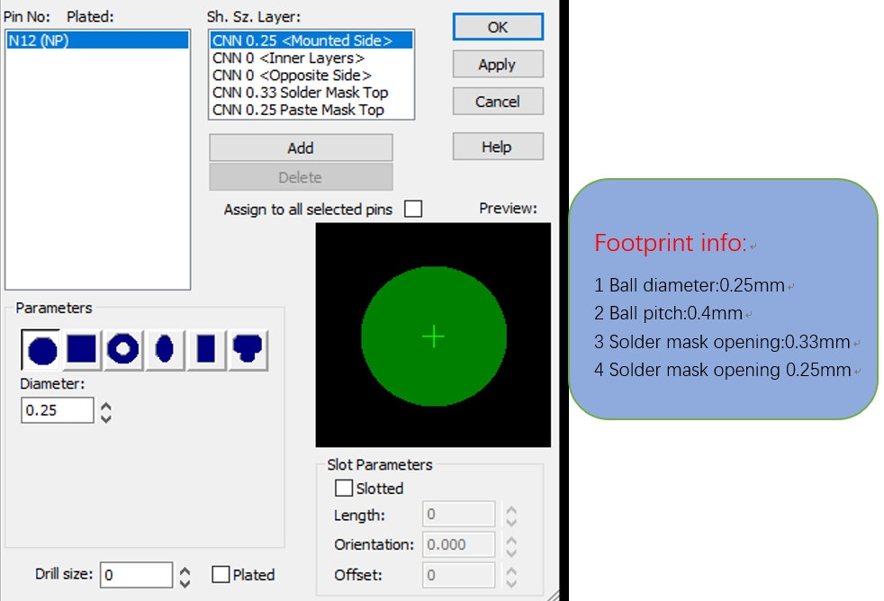   

<div align="center"> 图3.3 PCB焊盘焊盘设计参考 </div>  <br> <br> <br>  


#### 封装BALLMAP

 
封装BALLMAP信息，如图3.4所示。

  

<div align="center"> 图3.4 封装BALLMAP信息 </div>  <br> <br> <br> 


#### 封装基板


封装基板BALL信息，如图3.5所示。
​       
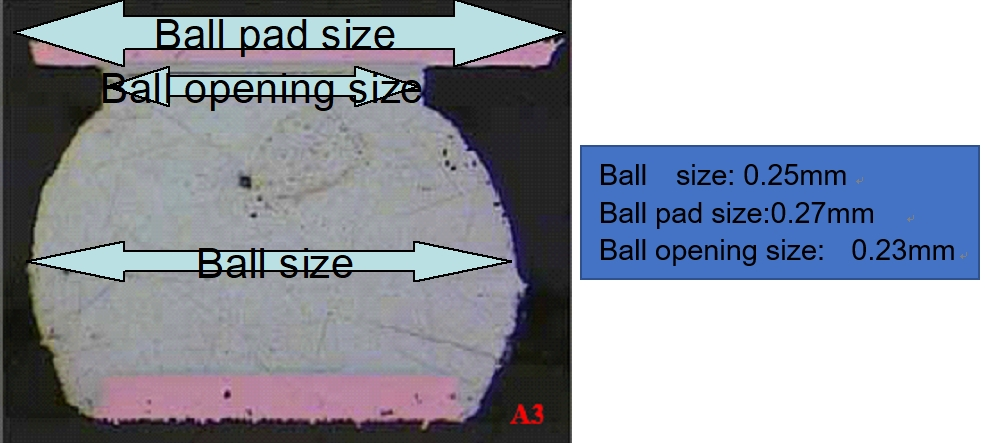  

<div align="center"> 图3.5 封装基板BALL信息 </div>  <br> <br> <br>


### PCB叠层设计

SF32LB58x系列芯片布局支持单双面，PCB只支持HDI板，不支持PTH板：推荐采用6HDI-2,推荐参考叠层结构如图3.6所示。

 
  

<div align="center"> 图3.6 参考叠层结构图 </div>  <br> <br> <br>


### PCB通用设计规则

PCB通用设计规则如图3.7所示，单位为mm。

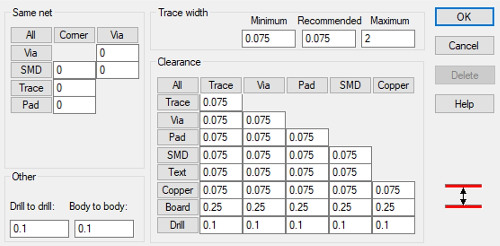  

<div align="center"> 图3.7 通用设计规则 </div>  <br> <br> <br> 


#### 盲孔设计

PCB盲孔设计如图3.8，3.9所示，单位为mm。

 
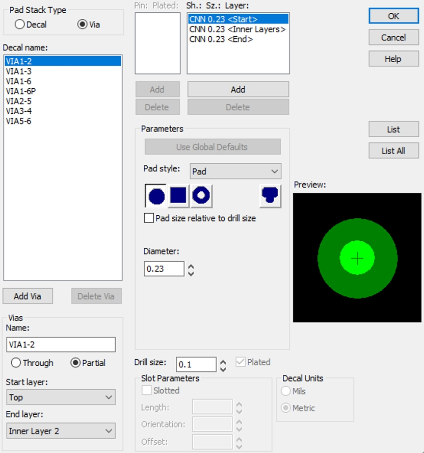  

<div align="center"> 图3.8 1-2盲孔设计 </div>  <br> <br> <br> 


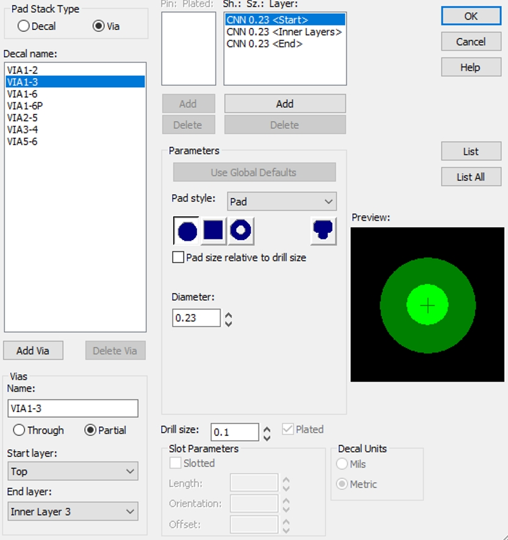  

<div align="center"> 图3.9 1-3盲孔设计 </div>  <br> <br> <br>    


#### 埋孔设计

PCB埋孔设计如图3.10所示，单位为mm。

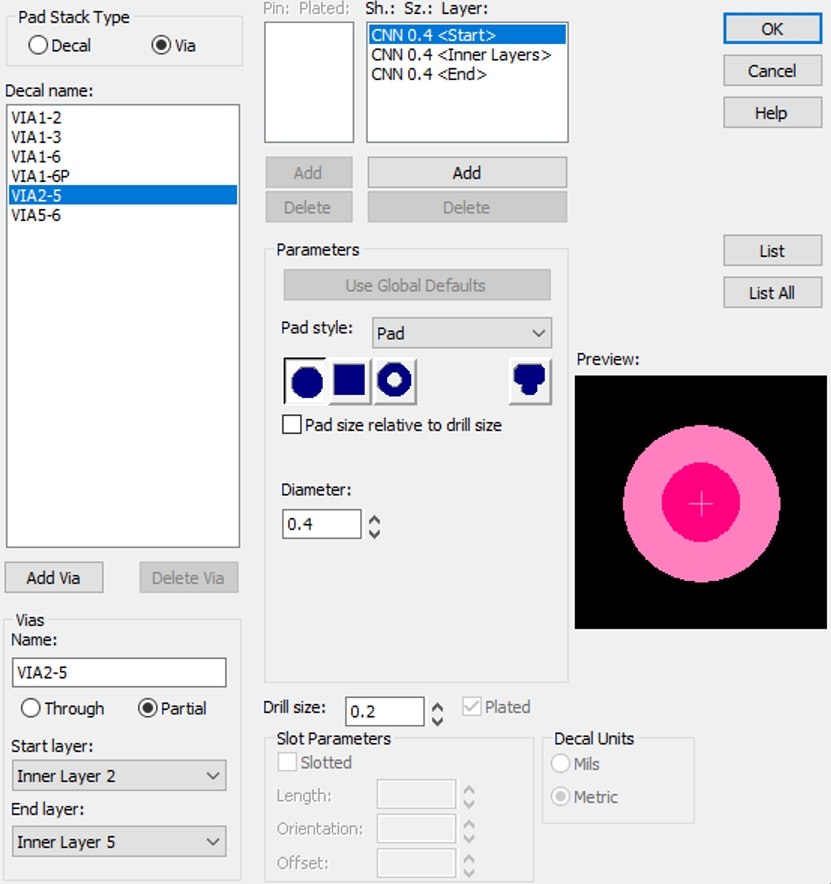  

<div align="center"> 图3.10 埋孔设计 </div>  <br> <br> <br> 


### SF32LB58x芯片走线扇出

BGA行列前两排球通过表层扇出方式，其它的球通过过孔内层扇出方式 如图3.11，3.12所示。


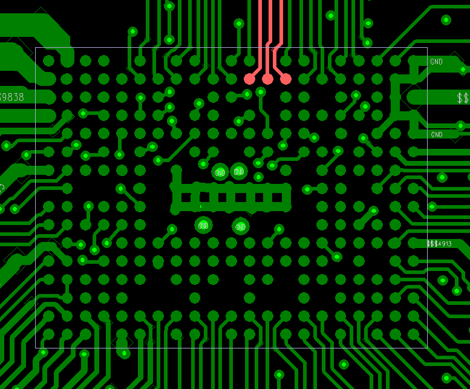  

<div align="center"> 图3.11 表层扇出参考图 </div>  <br> <br> <br> 


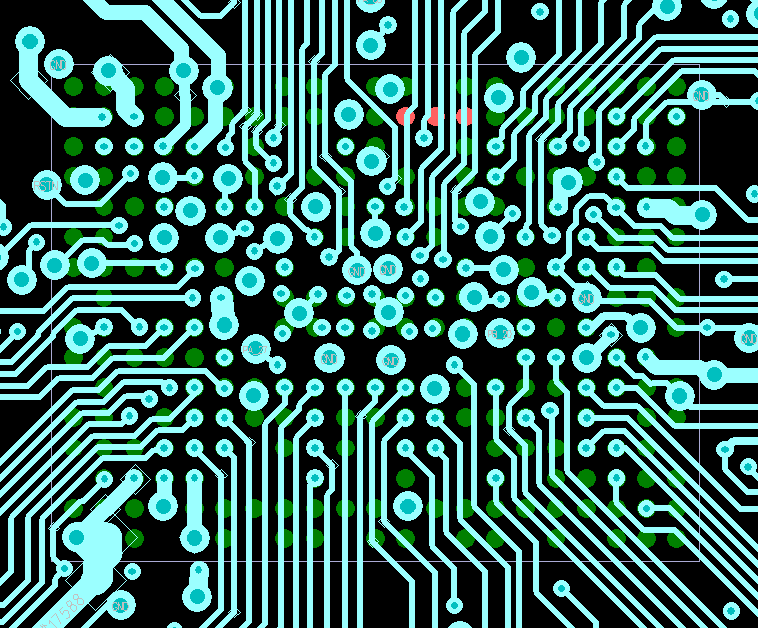  

<div align="center"> 图3.12 内层扇出参考图 </div>  <br> <br> <br> 


### 时钟接口走线

晶体需摆放在屏蔽罩里面，离PCB板框间距大于1mm,尽量远离发热大的器件，如PA、Charge和PMU等电路器件，距离最好大于5MM以上，避免影响晶体频偏，晶体电路禁布区间距大于0.25mm避免有其它金属和器件，如图3.13所示。


  

<div align="center"> 图3.13 晶体布局图 </div>  <br> <br> <br> 


48MHz晶体走线建议走表层长度要求控制在3-10mm区间,线宽0.075mm,必须立体包地处理，并且其走线需远离VBAT，DC/DC及高速信号线。48MHz晶体区域下方表层及临层做禁空处理，禁止其它走线从其区域走，如图3.14，3.15，3.16所示。


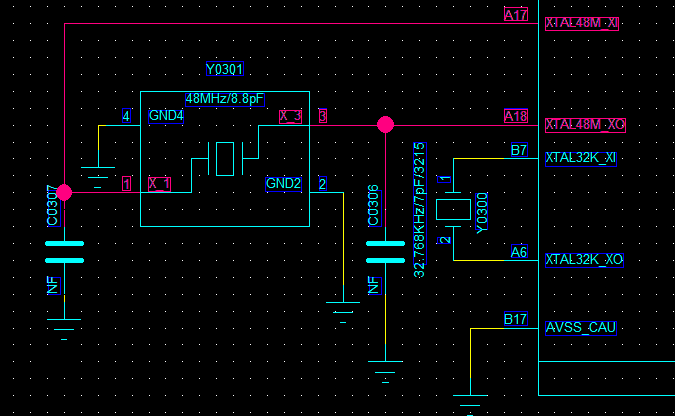  

<div align="center"> 图3.14 48MHz晶体原理图 </div>  <br> <br> <br> 


  

<div align="center"> 图3.15 48MHz晶体走线模型 </div>  <br> <br> <br> 


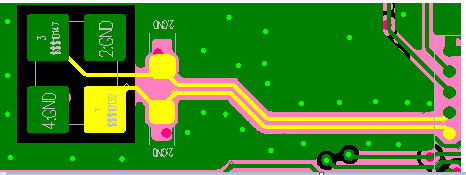  

<div align="center"> 图3.16 48MHz晶体走线参考 </div>  <br> <br> <br> 


32.768KHz晶体建议走表层，走线长度控制≤10mm,线宽0.075mm,32K_XI/32_XO平行走线间距≥0.15mm,必须立体包地处理，晶体区域下方表层及临层做禁空处理，禁止其它走线从其区域走， 如图3.17，3.18，3.19所示。


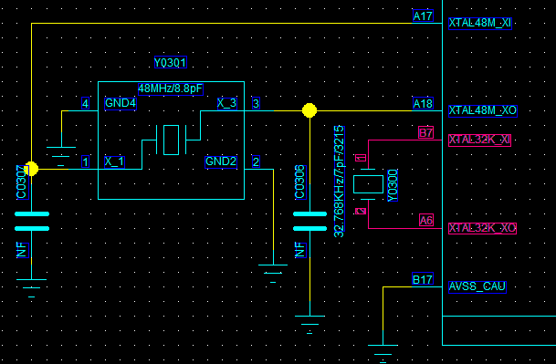  

<div align="center"> 图3.17 32.768KHz晶体原理图 </div>  <br> <br> <br> 


  

<div align="center"> 图3.18 32.768KHz晶体走线模型 </div>  <br> <br> <br> 


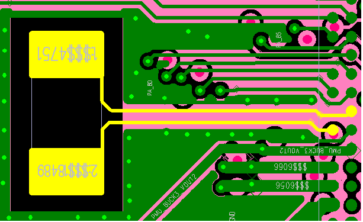  

<div align="center"> 图3.19 32.768KHz晶体走线参考 </div>  <br> <br> <br> 


### 射频接口走线

射频匹配电路要尽量靠近芯片端放置，不要靠近天线端放置，AVDD_BRF射频电源其滤波电容尽量靠近芯片管脚放置，电容接地PIN 脚打孔直接接主地，RF信号的π型网络的原理图和PCB分别如图3.20，3.21所示。


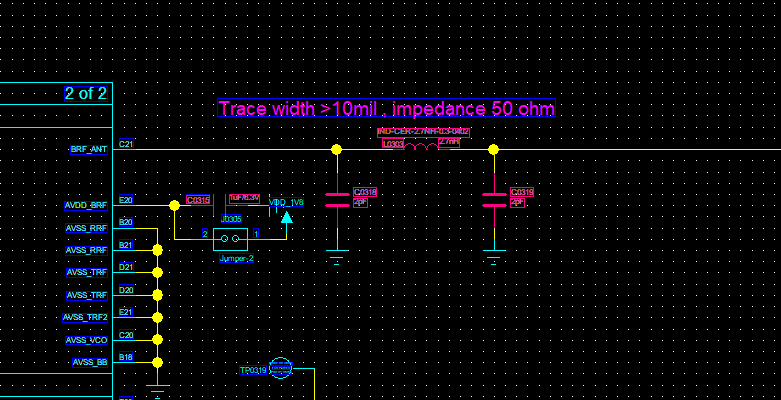  

<div align="center"> 图3.20 π型网络以及电源电路原理图 </div>  <br> <br> <br> 


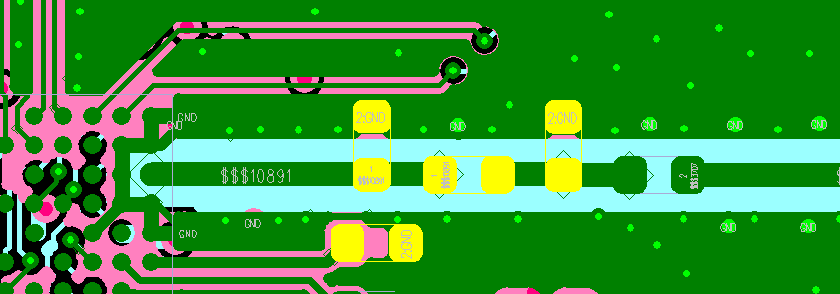  

<div align="center"> 图3.21 π型网络以及电源PCB布局 </div>  <br> <br> <br> 


射频线建议走表层，避免打孔穿层影响RF 性能，线宽最好大于10mil，需要立体包地处理，避免走锐角和直角，射频线两边多打屏蔽地孔，射频线需要做50欧阻抗控制，如图3.22,3.23所示。


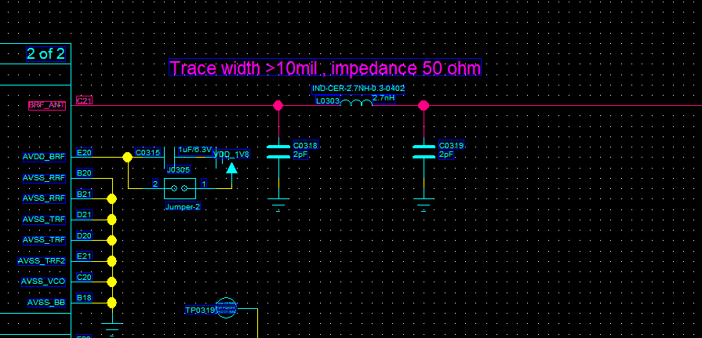  

<div align="center"> 图3.22 RF信号电路原理图 </div>  <br> <br> <br> 


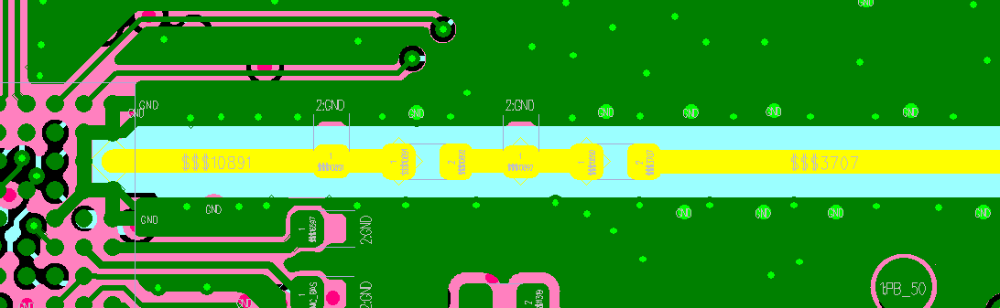  

<div align="center"> 图3.23 RF信号PCB走线 </div>  <br> <br> <br> 


射频电路走线禁止DC-DC，VBAT和高速数字信号从其区域走，比如晶振，高频时钟，及数字接口信号（I2C,SPI,SDIO,I2S，UART等）。
AVSS_RRF，AVSS_TRF，AVSS_TRF2，AVSS_VCO，AVSS_BB 为射频电路接地脚，必须保证其良好接地，建议在其焊盘上直接盲孔并连接到主地，如图3.24a，3.24b所示。


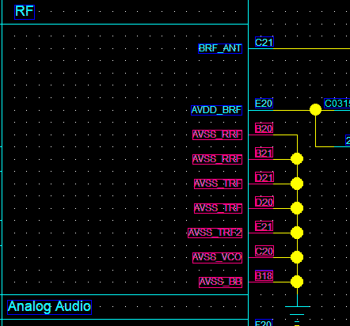

<div align="center"> 图3.24a 射频电路接地信号原理图 </div>  <br> <br> <br>


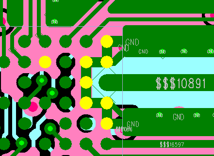

<div align="center"> 图3.24b 射频电路接地信号PCB图 </div>  <br> <br> <br>


### 音频接口走线

AVDD33_AUD 为音频接口供电的管脚，其滤波电容靠近其对应管脚放置，滤波电容接地脚良好接主地，MIC_BIAS 为音频接口麦克风的供电电路，其对应滤波电容靠近对应管脚放置，滤波电容接地脚良好接主地 AUD_VREF 滤波电容靠近管脚放置，如图3.25a，3.25b所示。


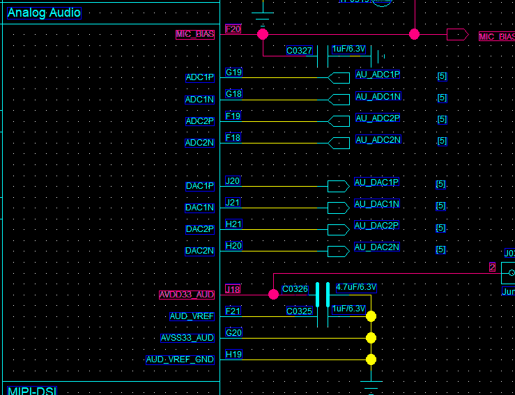

<div align="center"> 图3.25a 音频电路电源原理图 </div>  <br> <br> <br>


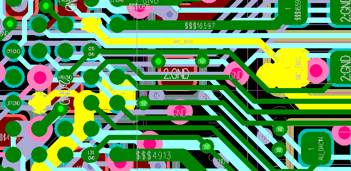

<div align="center"> 图3.25b 音频电路电源滤波电路PCB设计 </div>  <br> <br> <br>


AU_ADC1P/AU_ADC1N,AU_ADC2P/AU_ADC2N 为两路模拟信号输入，对应电路器件尽量靠近对应管脚放置，每一路P/N需要按照差分线形式走线，走线线长尽量短，差分对走线做立体包地处理，其它接口强干扰信号，远离其走线，如图3.26a，3.26b所示。


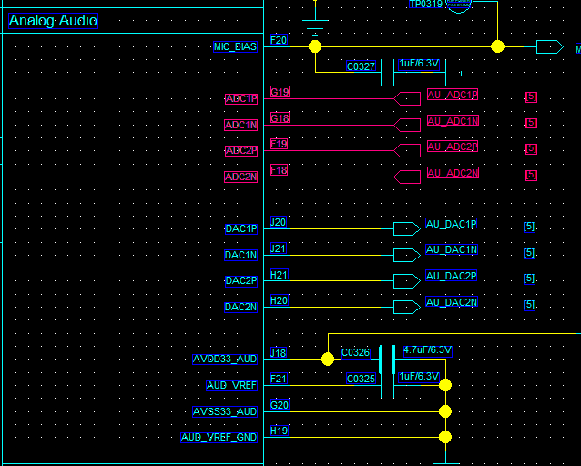

<div align="center"> 图3.26a 模拟音频输入原理图 </div>  <br> <br> <br>


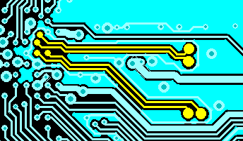

<div align="center"> 图3.26b 模拟音频输入PCB设计 </div>  <br> <br> <br>


AU_DAC1P/AU_DAC1N,AU_DAC2P/AU_DAC2N 为两路模拟信号输出，对应电路器件尽量靠近对应管脚放置，每一路P/N需要按照差分线形式走线，走线线长尽量短，并小于2mm,走线寄生电容小于10pf,差分走线线宽0.075mm,差分对走线需做立体包地处理，其它接口强干扰信号，远离其走线，如图3.27a，3.27b所示。


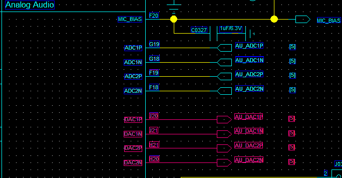

<div align="center"> 图3.27a 模拟音频输出原理图 </div>  <br> <br> <br>


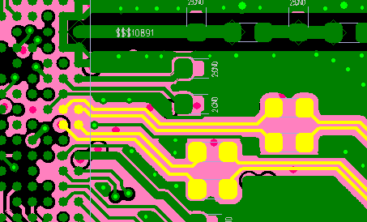

<div align="center"> 图3.27b 模拟音频输出PCB设计 </div>  <br> <br> <br>


### USB 接口走线

AVDD33_USB 为USB 接口供电脚，其滤波电容靠近管脚放置，接USB2_REXT 校准电阻靠近管脚放置， USB 走线必须先过ESD器件管脚，然后再到芯片端，要保证ESD 器件接地PIN 良好连接主地，USB DP/DN 按照差分线形式走线，按照90欧差分阻抗控制，并做立体包处理，如图3.28a，3.28b所示。图2.29a为USB信号的元件布局参考图，图3.29b为PCB走线模型。

   
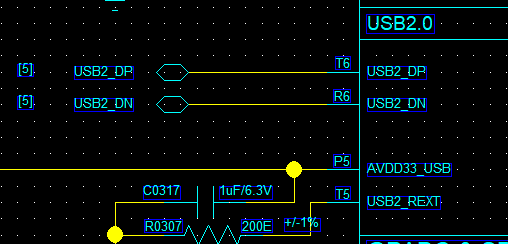

<div align="center"> 图3.28a USB信号原理图 </div>  <br> <br> <br>


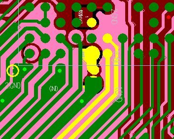

<div align="center"> 图3.28b USB信号PCB设计 </div>  <br> <br> <br>


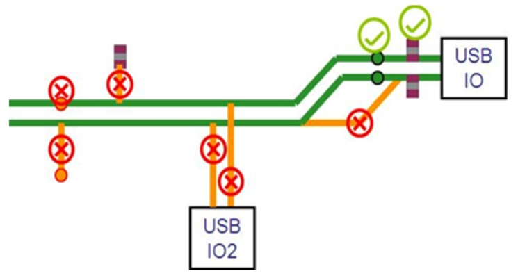

<div align="center"> 图3.29a USB信号器件布局参考 </div>  <br> <br> <br>


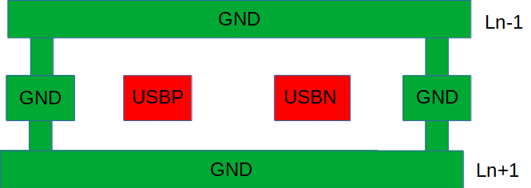

<div align="center"> 图3.29b USB信号走线模型 </div>  <br> <br> <br>


### SDIO 接口走线

SF32LB58X 提供2个SDIO接口分别为SDIO1和SDIO2,所有的SDIO 信号走线在一起，避免分开走，整个走线长度≤50mm, 组内长度控制≤6mm. SDIO接口时钟信号需立体包地处理，DATA和CM 信号也需要包地处理，如图3.30a，3.30b所示。


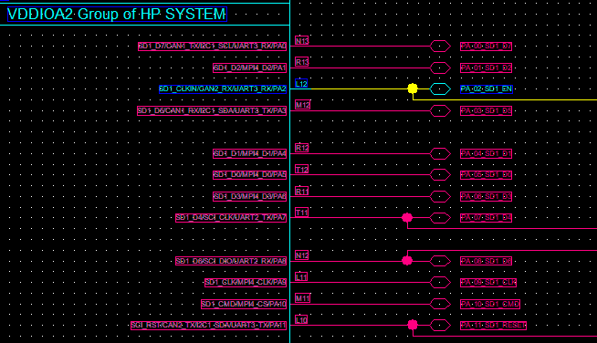

<div align="center"> 图3.30a SDIO1接口电路图 </div>  <br> <br> <br>


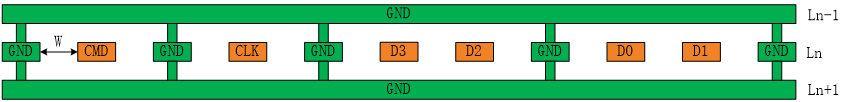

<div align="center"> 图3.30b SDIO1 PCB走线模型 </div>  <br> <br> <br>


### DSI 接口走线

AVDD18_DSI 为DSI 接口供电脚，其滤波电容靠近管脚放置，接DSI_REXT 校准电阻靠近管脚放置, DSI 接口走线按差分线形式走线，需要做差分100欧阻抗控制，并且时钟和数据需要做等长处理，差分对组内控制≤0.5mm，差分对组间按照≤2mm; 每对差分线需要做立体包地处理，如图3.31a，3.31b所示。


<div align="center"> 图3.31a DSI信号电路图 </div>  <br> <br> <br>


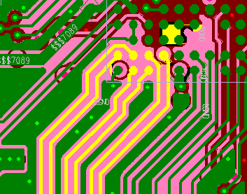

<div align="center"> 图3.31b DSI信号PCB走线 </div>  <br> <br> <br>


### DC-DC 电路走线

DC-DC电路功率电感和滤波电容必须靠近芯片的管脚放置，BUCK_LX 走线尽量短且粗，保证整个DC-DC 电路回路点感小，所有的DC-DC输出滤波电容接地脚多打过孔连接到主地平面；BUCK_FB 管脚反馈线不能太细，必须大于0.25mm,功率电感区域表层禁止铺铜，临层必须为完整的参考地，避免其它线从电感区域里走线，如图3.32a，3.32b所示。

   
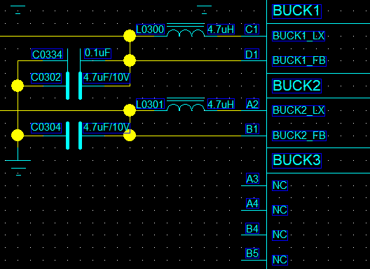

<div align="center"> 图3.32a DC-DC关键器件电路图 </div>  <br> <br> <br>


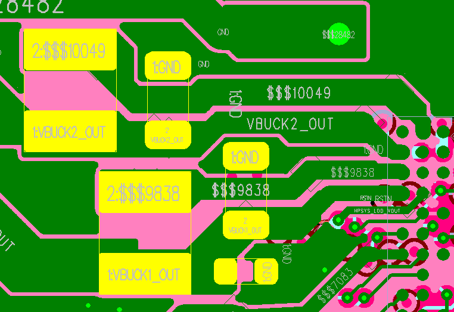

<div align="center"> 图3.32b DC-DC 关键器件PCB布局图 </div>  <br> <br> <br>


### 电源供电走线

PVDD1,PVDD2为芯片内置PMU 模块电源输入脚，对应的电容必须靠近管脚放置，走线尽量的粗，不能低于0.5mm; PVSS1,PVSS2 为PMU模块接地脚，必须通过过孔连接到主地，避免浮空影响整个PMU 性能，如图3.33a，3.33b所示。

   
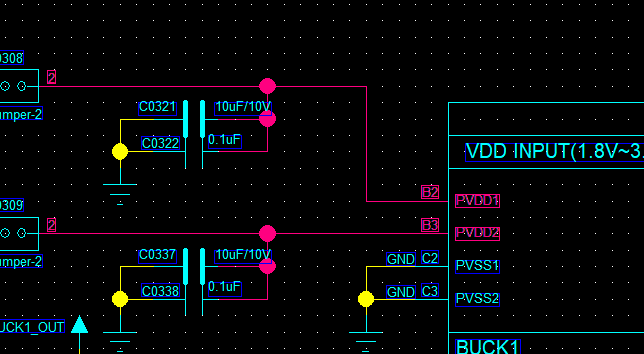

<div align="center"> 图3.33a DC-DC电路图 </div>  <br> <br> <br>


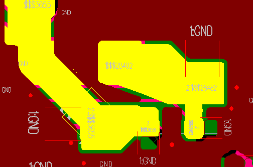

<div align="center"> 图3.33b DC-DC PCB走线 </div>  <br> <br> <br>


### LDO和IO电源输入走线

所有的LDO输出和IO 电源输入管脚滤波电容靠近对应的管脚放置，其走线宽必须满足输入电流要求，走线尽量短粗，从而减少电源纹波提高系统稳定性；如图3.14所示。


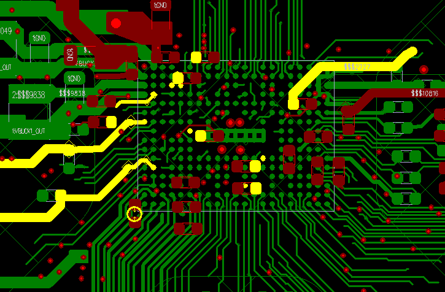

<div align="center"> 图3.34 LDO和IO输入电源走线示意图 </div>  <br> <br> <br>


### 其它接口走线

管脚配置为GPADC 管脚信号，必须要求立体包地处理，远离其它干扰信号，如电池电量电路，温度检查电路等。如图3.35所示。


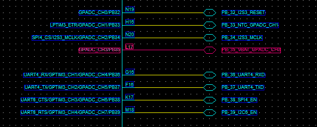

<div align="center"> 图3.35 GPADC电路图 </div>  <br> <br> <br>


管脚配置为时钟输入输出管脚信号网络，必须要求立体包地处理，远离其它干扰信号，如32K 输出等；如图3.36所示。


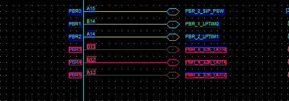

<div align="center"> 图3.36 32K时钟输出电路图 </div>  <br> <br> <br>


#### SF32LB58X 芯片地走线

SF32LB58X芯片中心区域的地网络需要用走线全部连接起来，保证足够的地平面并通过盲埋孔连接到主地平面。如图3.37a，3.37b，3.37c，3.37d；

   
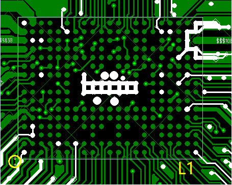

<div align="center"> 图3.37a 芯片下TOP层地信号 </div>  <br> <br> <br>

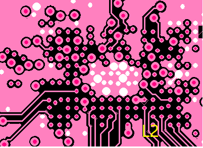

<div align="center"> 图3.37b 芯片下第二层地信号 </div>  <br> <br> <br>

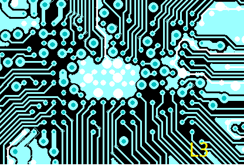

<div align="center"> 图3.37c 芯片下第三层地信号 </div>  <br> <br> <br>


<div align="center"> 图3.37d 芯片下第四层地信号 </div>  <br> <br> <br>


#### EMI&ESD 走线

避免屏蔽罩外面表层长距离走线，特别是时钟，电源等干扰信号尽量走内层，禁止走表层；ESD 保护器件必须靠近连接器对应管脚放置，信号走线先过ESD 保护器件管脚，避免信号分叉，没过ESD 保护管脚，ESD器件接地脚必须保证过孔连接主地，保证地焊盘走线短且粗，减少阻抗提高ESD器件性能。


#### 其它

USB 充电线测试点必须放置在TVS 管前面，电池座TVS 管 放置在平台前面 其走线必须保证先过TVS 然后再到芯片端，如图3.38所示。

 
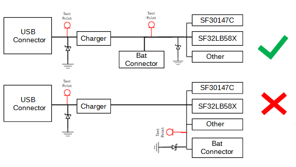

<div align="center"> 图3.38 电源TVS布局参考 </div>  <br> <br> <br>


TVS 管接地脚尽量避免走长线再连接到地，如图3.39所示。


<div align="center"> 图3.39 TVS走线参考 </div>  <br> <br> <br>


为了保证阻焊层不上焊盘，影响焊接可靠性，BGA 焊盘上的过孔要求打在BGA球的中心区域。避免打偏，如图3.40所示。


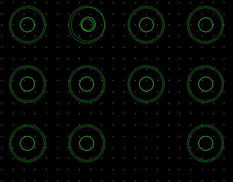

<div align="center"> 图3.40 BGA打孔示意图 </div>  <br> <br> <br>


为了提高可加工性良率，PCB设计时参考图如图3.41a，3.41b优化。

 
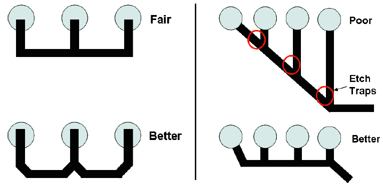

<div align="center"> 图3.41a BGA BALL连线参考图一 </div>  <br> <br> <br>


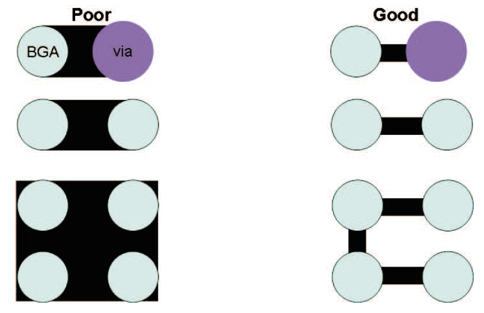

<div align="center"> 图3.41b BGA BALL连线参考图二 </div>  <br> <br> <br>


## 修订历史

| 版本   | 日期   | 发布说明  |
| ----- | ------ | --------- |
| 0.0.1 | 1/2025 | Draft版本  |
