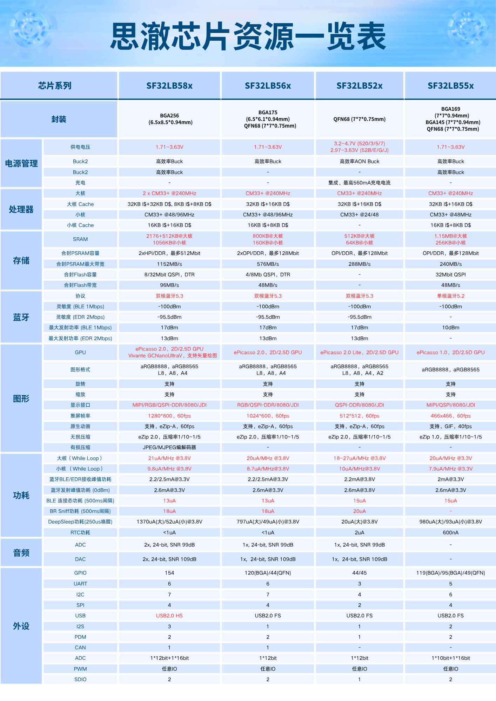

# 思澈芯片型号指南

## 芯片编号规则：SF32LB5xyZxYx6

### 前缀：*SF32LB5xy*

- SF：芯片系列
    - SiFli，公司logo
    - 另有SSxxxx系列，这里暂不包括
- 32：芯片系列
    - 32：32-bit MCU系列
    - 30：PMU系列，此系列后续都为数字，例如SF30147，不遵循下述编号规则
- LB：系列属性
    - LB：Low-power Bluetooth MCU
    - VB：采用RISC-V处理器的Bluetooth MCU
- 5：处理器系列
    - 5：基于32-bit Arm Cortex-M33 Star-MC1处理器，或类似算力的RISC-V处理器
    - 0：基于32-bit Arm Cortex-M0+处理器
- x：高中低定位
    - 8：5x系列旗舰产品
    - 6/5：5x系列中端产品
    - 2：5x系列性价比产品
- y：系列内产品定位
    - 一般依据内封PSRAM容量来定，具体数字因具体芯片而定

### 后缀：*ZxXx6*
- Z：封装
    - U：QFN封装
    - V：BGA封装
- xXx：内封NOR Flash或PSRAM容量编号，位数和组合根据具体封装情况而定
    - x为数字：内封NOR Flash容量
        - 1：2Mb
        - 2：4Mb
        - 3：8Mb
        - 4：16Mb
        - 5：32Mb
        - 6：64Mb
    - X为字母：内封PSRAM容量
        - A：16Mb QPI-PSRAM
        - B：32Mb OPI-PSRAM
        - C：64Mb OPI-PSRAM
        - D：128Mb OPI/HPI-PSRAM
        - E：256Mb HPI-PSRAM
- 6：温度范围
    - 5：-20~70C
    - 6：-40~85C

 ```{important}
  注意公司官方名称为SiFli，S、F为大写，其余为小写，意为Silicon Fli（Fly）；Sifli，sifli，SiFLi均为错误拼写。
 ```
```{note}
**下文缩写名词注解**
- NOR:  &ensp; QSPI NOR Flash
- QPI-P: &ensp; x4-PSRAM
- OPI-P: &ensp; x8-PSRAM
- HPI-P: &ensp; x16-PSRAM
```

## SF32LB52x/X系列主推型号列表
- SF32LB52x/X：
    - x为数字，为***锂离子电池供电***系列，如SF32LB520/3/5/7，彼此可以pin-to-pin兼容
    - X为部分字母，为***常规3.3V***供电系列，包括SF32LB52B/E，彼此可以pin-to-pin兼容
    - X为部分字母，为***特殊1.8V***供电系列，包括SF32LB52A/D，用于超低功耗场景
    - x为数字与X为字母两个系列，相互独立，***不能***pin-to-pin兼容，3.3V型号与1.8V型号虽然可以pin-to-pin对齐，但是电压不兼容，因此也不兼容；从合封内容看的对应关系为：
        - 锂电 &ensp;3.3V &ensp;1.8V
        - 520 -- 52B -- 52A
        - 523 -- 52E&nbsp;-- 52D
        - 525 -- 52G -- 52F
        - 527 -- 52J&nbsp; -- 52H
- SF32LB52x系列支持以下显示接口
    - SPI/DSPI/QSPI，包括墨水屏SPI接口
    - 8080-8bit

Part # | 520U36 | 523UB6 | 525UC6 | 527UD6 | 52AU36 | 52AU56 | 52BU36 | 52BU56 | 52DUB6 | 52EUB6| 52JUD6 
:-|-:|-:|-:|-:|-:|-:|-:|-:|-:|-:|-:
Package | QFN68L | QFN68L | QFN68L | QFN68L | QFN68L | QFN68L | QFN68L | QFN68L | QFN68L | QFN68L| QFN68L 
Sizes | 7x7x0.85 mm | 7x7x0.85 mm | 7x7x0.85 mm | 7x7x0.85 mm | 7x7x0.85 mm | 7x7x0.85 mm | 7x7x0.85 mm | 7x7x0.85 mm | 7x7x0.85 mm | 7x7x0.85 mm | 7x7x0.85 mm 
Pitch | 0.35mm | 0.35mm | 0.35mm      | 0.35mm      | 0.35mm      | 0.35mm      | 0.35mm      | 0.35mm      | 0.35mm      |      0.35mm | 0.35mm 
\# of GPIOs | 44 | 44 | 44 | 44 | 45 | 45 | 45 | 45 | 45 | 45|45
MPI1  SiP | 1MB NOR | 4MB OPI-P | 8MB OPI-P | 16MB OPI-P | 1MB NOR | 4MB NOR | 1MB NOR | 4MB NOR | 4MB OPI-P | 4MB OPI-P |16MB OPI-P
Power Supply | 3.2~4.7V | 3.2~4.7V | 3.2~4.7V | 3.2~4.7V | **1.8V** | **1.8V** | **3.3V** | **3.3V** | **1.8V** | **3.3V**|**3.3V**
I/O Voltage | 3.3V | 3.3V | 3.3V | 3.3V | 3.3V/1.8V | 3.3V/1.8V | 3.3V/1.8V | 3.3V/1.8V | 3.3V/1.8V | 3.3V/1.8V|3.3V/1.8V


## SF32LB56x系列主推型号列表

- SF32LB56x系列支持以下显示接口
    - DPI/RGB888，RGB565 （566VCB36和567VND36）
    - SPI/DSPI/QSPI，包括墨水屏SPI接口
    - 8080-8bit

Part # | 560UNN26 | 561UBN26 | 563UCN26 | 56WUND26 | 566VCB36 | 567VND36
:-|-:|-:|-:|-:|-:|-:
Package | QFN68L | QFN68L | QFN68L | QFN68L | BGA175 | BGA175
Sizes | 7x7x0.75 mm | 7x7x0.75 mm | 7x7x0.75 mm | 7x7x0.75 mm | 6.1x6.5x0.94 mm | 6.1x6.5x0.94 mm 
Pitch | 0.35mm | 0.35mm | 0.35mm | 0.35mm | 0.4mm | 0.4mm 
HCPU GPIOs | 24 | 24 | 24 | 24 | 79 | 79 
LCPU GPIOs | 20 | 20 | 20 | 20 | 41 | 41 
MPI5 Boot SiP | 512KB NOR | 512KB NOR | 512KB NOR | 512KB NOR | 1MB NOR | 1MB NOR 
MPI1 SiP | n/a | 4MB OPI-P | 8MB OPI-P | n/a | 8MB OPI-P | n/a 
MPI2 SiP | n/a | n/a | n/a | 16MB OPI-P | 4MB OPI-P | 16MB OPI-P 
Display Interface | QSPI/8080 | QSPI/8080 | QSPI/8080 | QSPI/8080 | DPI/QSPI/8080/JDI | DPI/QSPI/8080/JDI 
Power Supply | 1.71~3.63V | 1.71~3.63V | 1.71~3.63V | 1.71~3.63V | 1.71~3.63V | 1.71~3.63V
温度范围 | -40~85C | -40~85C | -40~85C | -40~85C | -40~85C | -40~85C 

## SF32LB58x系列主推型号列表

- SF32LB58x系列全系支持以下显示接口
    - MIPI-DSI，CMD mode或Video mode
    - DPI/RGB888，RGB565
    - SPI/DSPI/QSPI，包括墨水屏SPI接口
    - 8080-8bit
    - JDI MIP屏接口
    - 支持MIPI-DSI+SPI/DSPI/QSPI双屏异显

Part # | 580VNN36 | 581VCN36 | 583VCC36 | 585V5E56 | 586VDD36 | 587VEE56
:-|-:|-:|-:|-:|-:|-:
Package | BGA256 | BGA256 | BGA256 | BGA256 | BGA256 | BGA256
Sizes | 6.5x8.5x0.94 mm | 6.5x8.5x0.94 mm | 6.5x8.5x0.94 mm | 6.5x8.5x0.94 mm | 6.5x8.5x0.94 mm | 6.5x8.5x0.94 mm 
Pitch | 0.4mm | 0.4mm | 0.4mm | 0.4mm | 0.4mm | 0.4mm 
HCPU GPIOs | 94 | 94 | 94 | 94 | 94 | 94 
LCPU GPIOs | 66 | 66 | 66 | 66 | 66 | 66 
MPI5 Boot SiP | 1MB NOR | 1MB NOR | 1MB NOR | 4MB NOR | 1MB NOR | 4MB NOR 
MPI1 SiP | n/a | 8MB OPI-P | 8MB OPI-P | 4MB NOR | 16MB HPI-P | 32MB HPI-P 
MPI2 SiP | n/a | n/a | 8MB OPI-P | 32MB HPI-P | 16MB HPI-P | 32MB HPI-P 
Power Supply | 1.71~3.63V | 1.71~3.63V | 1.71~3.63V | 1.71~3.63V | 1.71~3.63V | 1.71~3.63V
温度范围 | -40~85C | -40~85C | -40~85C | -40~85C | -40~85C | -40~85C 

## SF32LB55x主推型号列表

- SF32LB55x系列因定义较早，后缀编号未完全遵从以上规则，仅557V3DA6适用上述后缀命名规则
- 相同封装可pin-to-pin兼容
- SF32LB55x系列根据封装不同支持以下全部或部分显示接口
    - MIPI-DSI，CMD mode
    - DPI/RGB888，RGB565
    - SPI/DSPI/QSPI，包括墨水屏SPI接口
    - 8080-8bit
    - JDI/Sharp MIP屏接口 （557VD3A6）
    - 支持MIPI-DSI+SPI/DSPI双屏异显 （557VD3A6）

Part # | SS6600A8 | 551U4O5 | 555V4O6 | 555V436 | 557VD3A6
-|-:|-:|-:|-:|-:
Package | QFN68L | QFN68L | BGA145 | BGA145 | BGA169
Sizes | 7x7x0.75 mm | 7x7x0.75 mm | 7x7x0.94 mm | 7x7x0.94 mm | 7x7x0.94 mm 
Pitch | 0.35mm | 0.35mm | 0.5mm | 0.5mm | 0.5mm 
HCPU GPIOs | 28 | 28 | 52 | 52 | 71 
LCPU GPIOs | 21 | 21 | 40 | 40 | 42 
QSPI1-L Boot SiP | 4MB NOR | 4MB NOR |        4MB NOR | 4MB NOR | 1MB NOR 
QSPI1-H SiP | 4MB NOR | n/a | n/a | n/a | n/a 
PSRAM SiP | n/a | 4MB OPI-P | 4MB OPI-P | 8MB OPI-P | 16MB OPI-P 
QSPI4 SiP | n/a | n/a | n/a | n/a | 2MB QPI-P 
Display Interface | QSPI/8080 | QSPI/8080 | MIPI/QSPI/8080 | MIPI/QSPI/8080 | MIPI/QSPI/8080/JDI
Power Supply | 2.97V~3.63V | 1.71~3.63V | 1.71~3.63V | 1.71~3.63V | 1.71~3.63V
温度范围 | -20~70C | -20~70C | -40~85C | -40~85C | -40~85C 

```{note}
- SS6600A8内置两颗4MB QSPI-NOR，并被配置为单颗8MB OSPI-NOR形态来运行
```

## 芯片型号对比表



## 样品获取

零售样品与小批量可直接在[淘宝](https://sifli.taobao.com/)购买，批量客户可发邮件到sales@sifli.com或淘宝找客服获取销售联系方式。

参与开源可以免费申请样品，可加入QQ群674699679进行交流。
