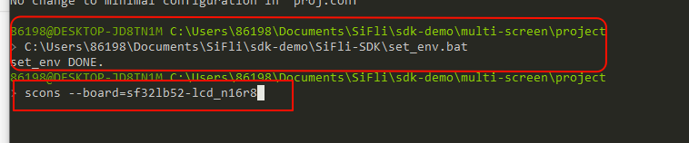
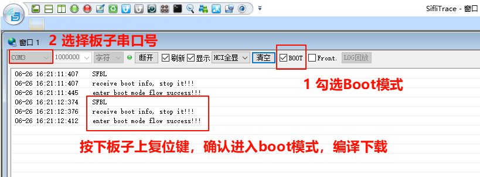
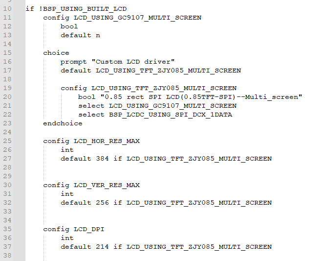
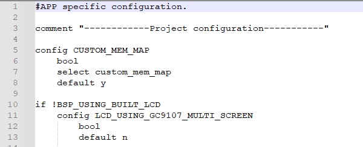
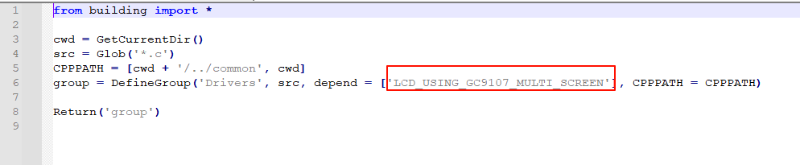
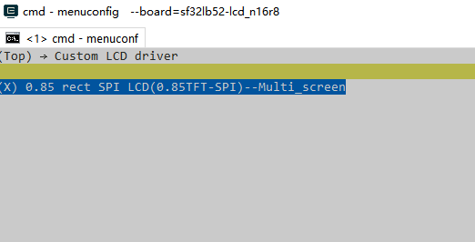
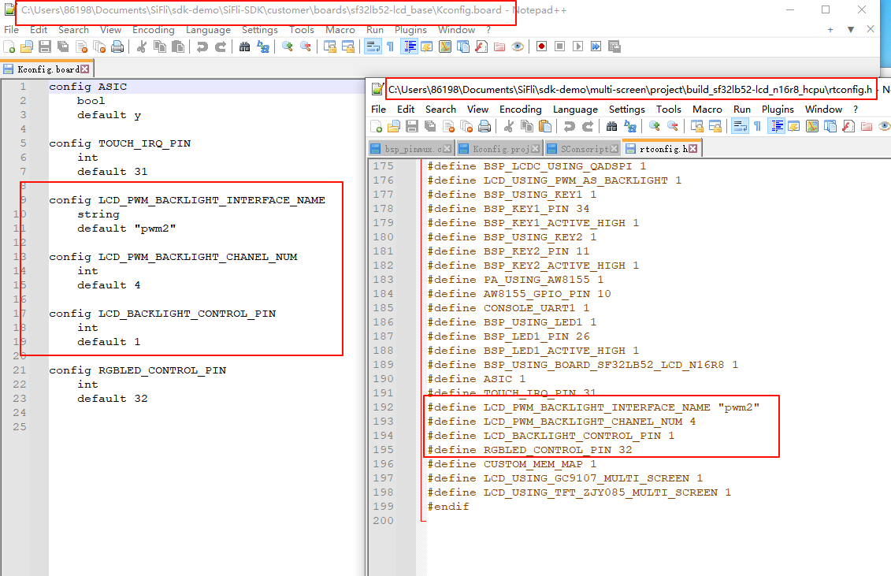
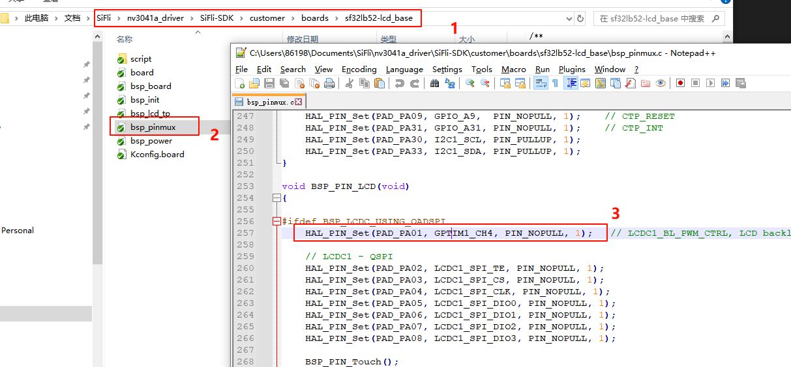
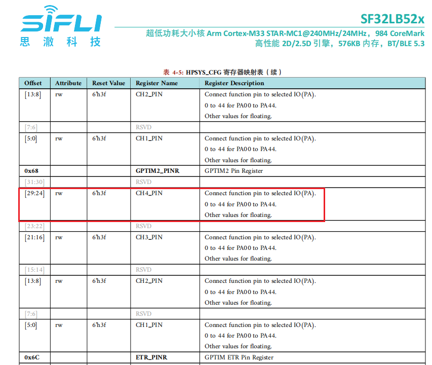

# SF32LB52x-DevKit-LCD添加SPI-LCD实例（外置）
### 1 确认rt-driver工程正常运行  
调屏推荐采用rt-driver工程，调试前确认rt-driver工程能正常运行并有Log打印<br>
#### 1.1 编译  
进入`example\rt_driver\project`目录，右键选择`ComEmu_Here`弹出编译命令串口，依次执行<br>
```
> D:\sifli\git\sdk\v2.2.4\set_env.bat   #设置编译环境路径
> scons --board=sf32lb52-lcd_n16r8 -j8   #指定sf32lb52-lcd_n16r8模块编译rt-driver工程
```
<br>
#### 1.2 进入BOOT模式
确认`sf32lb52-lcd_n16r8`模块板进入`boot`模式便于下载，如下图操作<br>
<br>
#### 1.3 下载
```
> build_sf32lb52-lcd_n16r8\uart_download.bat

     Uart Download

please input the serial port num:7 #然后选择sf32lb52-lcd_n16r8模块连接的串口号进行下载 
```
#### 1.4 确认正常LOG
如下图，运行用户程序需要去掉勾选进入`BOOT`选项，确认板子跑起来后，就可以继续下一步添加新屏幕模组<br>

### 2 添加屏驱gc9107
#### 2.1 创建gc9107驱动  
1）在新的屏驱文件夹`sdk-demo`中添加工程和修改Kconfig.proj文件  <br>
复制`SDK\example\rt_driver`（如果已有外置的工程，可以直接在工程中进行修改添加），并修改名称，以屏驱名称命名`multi_screen`放在SDK外部。并在`project`中修改`Konfig.proj`文件添加内容如下<br>
```
#APP specific configuration.

comment "------------Project configuration-----------"  

if !BSP_USING_BUILT_LCD
    ···
endif
```
2）修改`proj.conf`文件  <br>
* 在`project\proj.conf`中添加`# CONFIG_BSP_USING_BUILTIN_LCD is not set`，用来使用外置屏驱，关闭SDK内部屏驱。<br>
如果想单独某个板子使用外置屏驱，或者使用内置屏驱，需要再project目录下新建文件例如`sf32lb52-lcd_n16r8/proj.conf` 其中添加`# CONFIG_BSP_USING_BUILTIN_LCD is not set`或`CONFIG_BSP_USING_BUILTIN_LCD=y`
3） 复制驱动  <br>
SDK内屏驱动位于`sdk\customer\peripherals`内，复制一份其他`spi`接口的驱动放在新创建的屏驱文件夹`sdk-demo`中并更名为`qspi_gc9107`<br>
#### 2.2 Menuconfig添加gc9107_Multi_screen
1） 修改Kconfig在menuconfig中生成该屏的选项<br>
文本编辑器打开`project\Kconfig.proj`，添加spi的该屏的选项和分辨率，如下<br>
<br>
```
# menuconfig 生成菜单呈现的选项
    choice
        prompt "Custom LCD driver"
        default LCD_USING_TFT_ZJY085_MULTI_SCREEN
		
        config LCD_USING_TFT_ZJY085_MULTI_SCREEN
            bool "0.85 rect SPI LCD(0.85TFT-SPI)--Multi_screen"   #menuconfig中显示的字符
            select LCD_USING_GC9107_MULTI_SCREEN   #spi_gc9107文件夹内文件是否的编译依赖于此宏
            select BSP_LCDC_USING_SPI_DCX_1DATA    #选择SPI接口
	endchoice

    config LCD_HOR_RES_MAX  #为屏的水平分辨率 
        int
        default 384 if LCD_USING_TFT_ZJY085_MULTI_SCREEN

    config LCD_VER_RES_MAX  #为屏的垂直分辨率
        int
        default 256 if LCD_USING_TFT_ZJY085_MULTI_SCREEN

    config LCD_DPI     #像素密度，为屏一英寸多少个像素点，不知道就填默认315
        int
        default 214 if LCD_USING_TFT_ZJY085_MULTI_SCREEN
```
2） LCD_USING_GC9107_MULTI_SCREEN添加<br>
文本编辑器打开文件`project\Kconfig.proj`，添加如下<br>
```
if !BSP_USING_BUILT_LCD

	config LCD_USING_GC9107_MULTI_SCREEN  #添加该配置，Kconfig中才能select上
		bool
		default n

endif
```
<br>
3） SConscript修改<br>
文本编辑器打开文件`gc9107_Multi_screen\SConscript`，修改宏`LCD_USING_GC9107_MULTI_SCREEN`,这样该目录下的*.c和*.h文件就能加入编译<br>
<br>
#### 2.3 Menuconfig选中gc9107_Multi_screen
以上步骤完成后，编译窗口输入下面命令，并选中刚添加的gc9107_Multi_screen屏<br>
 `menuconfig --board=sf32lb52-lcd_n16r8` （打开menuconfig窗口）
在这个路径下`(Top) →Custom LCD driver`选中刚添加的屏，示例如下，保存退出，即选中了spi_gc9107_Multi_screen目录下屏驱动参加编译<br>
<br>

### 3 屏硬件连接
#### 3.1 排线连接
如果购买的是匹配的屏幕模组，直接排线连接到插座即可，如下图<br>
<br>
#### 3.2 飞线连接
如果新的屏幕模组，排线排列不一致，就需要自己设计排线转接板或者从插针飞线调试。  
转接板的设计可以参考[SF32LB52-DevKit-LCD转接板制作指南](../../board/sf32lb52x/SF32LB52-DevKit-LCD-Adapter.md#sf32lb52-devkit-lcd转接板制作指南)  
### 4 屏驱动配置
#### 4.1 默认IO配置
如果采用的默认IO，此处可以跳过
##### 4.1.1 IO模式设置
LCD采用的是LCDC1硬件来输出波形，需配置为对应的FUNC模式，<br>
每个IO有哪些Funtion可以参考硬件文档 [下载SF32LB52X_Pin_config](./assets/EH-SF32LB52X_Pin_config_V1.3.0_20241114.xlsx)<br>
<br>
LCD和TP的RESET脚都是采用GPIO模式，则默认已经配置为GPIO模式
```c
 HAL_PIN_Set(PAD_PA00, GPIO_A0,  PIN_NOPULL, 1);     // #LCD_RESETB
 HAL_PIN_Set(PAD_PA09, GPIO_A9,  PIN_NOPULL, 1);     // CTP_RESET
```
##### 4.1.2 IO上下电操作
下面是上电LCD初始化流程<br>
`rt_hw_lcd_ini->api_lcd_init->lcd_task->lcd_hw_open->BSP_LCD_PowerUp-find_right_driver->LCD_drv.LCD_Init->LCD_drv.LCD_ReadID->lcd_set_brightness->LCD_drv.LCD_DisplayOn`<br>
可以看到上电`BSP_LCD_PowerUp`在屏驱动初始化`LCD_drv.LCD_Init`之前<br>
所以需要在初始化LCD前，确保BSP_LCD_PowerUp中已经打开LCD供电<br>
<br>
##### 4.1.3 背光PWM配置
pwm软件中有一个默认配置，配置在文件`customer\boards\sf32lb52-lcd_n16r8\Kconfig.board`中，此`Kconfig.board`的配置会编译后在`rtconfig.h`中生成下面3个宏<br>
```c
//PWM3需要打开GPTIM2，PWM和TIMER对应关系，可以查看FAQ的PWM部分或者文件`pwm_config.h`
#define LCD_PWM_BACKLIGHT_INTERFACE_NAME "pwm3" //pwm设备名
#define LCD_PWM_BACKLIGHT_CHANEL_NUM 4 //Channel 4
#define LCD_BACKLIGHT_CONTROL_PIN 1 //PA01
```
用PWM3需要用到GPTIM2（位于Hcpu）输出，还需确认`rtconfig.h`下面宏是否生效<br>
```c
#define BSP_USING_GPTIM2 1 //如果用PWM3，需要menuconfig --board=sf32lb52-lcd_n16r8打开
#define RT_USING_PWM 1
#define BSP_USING_PWM 1
#define BSP_USING_PWM3 1 //如果没有，需要menuconfig --board=sf32lb52-lcd_n16r8打开
```
如下文件`pwm_config.h`中`pwm3`和`GPTIM2`的对应关系<br>
```c
#ifdef BSP_USING_PWM3
#define PWM3_CONFIG                             \
    {                                           \
       .tim_handle.Instance     = GPTIM2,         \
       .tim_handle.core         = PWM3_CORE,    \
       .name                    = "pwm3",       \
       .channel                 = 0             \
    }
#endif /* BSP_USING_PWM3 */
```
<br>
软件默认PA01从`GPTIM2`的`"pwm3"`设备输出PWM波形，默认配置在<br>
<br>
```c
HAL_PIN_Set(PAD_PA01, GPTIM2_CH4, PIN_NOPULL, 1);   // LCDC1_BL_PWM_CTRL, LCD backlight PWM
```
**备注：**<br>
通过函数`HAL_PIN_Set`配置后，GPTIM2_CH4跟PA01的对应关系就会建立起来，具体体现在寄存器配置`hwp_hpsys_cfg->GPTIM2_PINR`中，如下图：<br>
<br>
可以看到可以配置为CH1-CH4输出，而且必须是PA00-PA44口<br>
#### 4.2 屏驱复位时序
下面几个延时比较关键，需要参照屏驱IC相关文档的初始化时序，谨慎修改
```c
    BSP_LCD_Reset(0);//Reset LCD
    HAL_Delay_us(20);
    BSP_LCD_Reset(1);

```
#### 4.3 屏驱寄存器修改
每个屏驱IC的初始化寄存器配置差异较大，需要按照屏厂提供的寄存器参数，按照他们的SPI时序依次通过SPI写入屏驱IC,特别注意0x11寄存器后的延时长度要求<br>
```c
    LCD_WriteReg_More(hlcdc, 0x11, parameter, 1);
    LCD_DRIVER_DELAY_MS(120);

    LCD_WriteReg_More(hlcdc, 0xFE, parameter, 0); // internal reg enable
    LCD_WriteReg_More(hlcdc, 0xEF, parameter, 0); // internal reg enable
```
#### 4.4 屏驱参数配置
- .lcd_itf ： 选择LCDC_INTF_SPI_DCX_1DATA表示SPI 1线模式<br>
- .freq ：选择48000000，表示SPI的clk主频为48Mhz，这个时钟要依据屏驱IC支持的最高时钟来选择，越高每帧送数时间越短，帧率会越高<br>
- .color_mode ：选择RGB565 还是RGB888格式<br>
- .syn_mode ：选择是否启用TE防撕裂功能，如果启动TE，屏驱IC无TE信号，不会送屏，会出现Timeout死机，前期调试建议关闭TE<br>
- .vsyn_polarity ：选择TE的极性<br>
- .vsyn_delay_us ：选择TE波形到来后多久LCDC1开始送数给屏驱IC<br>
- .readback_from_Dx ： 选择QSPI读Chipid时，屏驱IC的数据是从D0-D3的哪条信号线输出（参照屏驱IC手册）<br>
```c
static LCDC_InitTypeDef lcdc_int_cfg =
{
    .lcd_itf = LCDC_INTF_SPI_DCX_1DATA,
    .freq = 48000000,
    .color_mode = LCDC_PIXEL_FORMAT_RGB565,
    .cfg = {
        .spi = {

            .dummy_clock = 0,
            .syn_mode = HAL_LCDC_SYNC_DISABLE,
            .vsyn_polarity = 0,
            .vsyn_delay_us = 0,
            .hsyn_num = 0,
        },
    },

};
```
### 5 编译烧录下载结果
#### 5.1 显示结果展示
如下图,如果显示正常会依次6种图像，3秒定时循环显示<br>
<br>