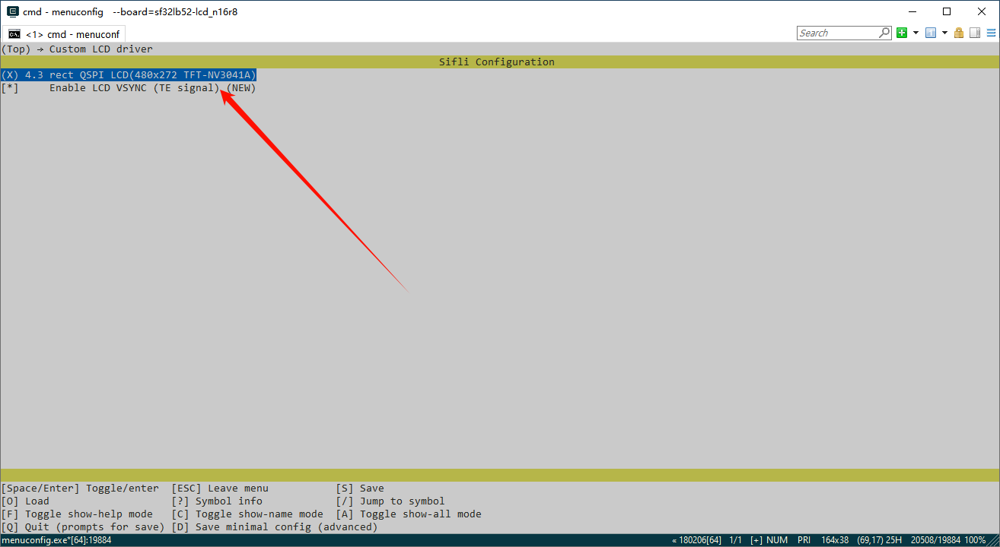

# 外置

屏幕模组的menuconfig选项是集合了屏驱IC、背光IC、触控IC的一个综合菜单选项，它指定了这个模组使用了哪个屏幕IC, 哪个触控IC, 使用什么类型的背光，同时指定了模组的液晶玻璃的分辨率、DPI、外形等信息。添加后就可以在工程里面[使用这个新的menuconfig菜单选项](add_lcd_menuconfig_1)。

总共分为以下几个步骤：
1. 创建一个新的屏驱文件夹和Kconfig.proj
2. 添加屏幕模组选项
3. 配置屏幕模组液晶的分辨率、DPI
4. 使用新的屏幕（通过Menuconfig选择）


## 1 添加屏驱文件宏定义
### 1、`Konfig.proj`框架如下  
* 在创建的文件夹中添加如下内容，复制`SDK\example\rt_driver`并修改名称，以屏驱名称命名（如果已有外置的工程，可以直接在工程中进行修改添加）
* 在`project`中创建新的`Konfig.proj`框架如下
```c
#APP specific configuration.

config CUSTOM MEM MAP
    boo1
    select custom mem map
    default y
comment "------------Project configuration-----------"  

if !BSP_USING_BUILT_LCD
    

endif
```
* 在`project\proj.conf`中添加`# CONFIG_BSP_USING_BUILTIN_LCD is not set`，用来使用外置屏驱，关闭SDK内部屏驱。<br>
如果想单独某个板子使用外置屏驱，或者使用内置屏驱，需要再project目录下新建文件例如`sf32lb52-lcd_n16r8/proj.conf` 其中添加`# CONFIG_BSP_USING_BUILTIN_LCD is not set`或`CONFIG_BSP_USING_BUILTIN_LCD=y`

### 2、在Kconfig文件中增加屏驱驱动IC的宏定义
首先打开SDK\customer\peripherals\Kconfig文件里面有很多类似LCD_USING_XXX的config，复制一个，在`project\Kconfig.proj`中添加新的config：
```c
if !BSP_USING_BUILT_LCD

config LCD_USING_NV3051F1
    bool
    default n

endif
```
### 3、在Kconfig文件中增加TP驱动IC的宏定义
首先打开SDK\customer\peripherals\Kconfig文件里面有很多类似TSC_USING_XXX的config，在`project\Kconfig.proj`中添加新的config：
```c
if !BSP_USING_BUILT_LCD

config TSC_USING_GT911
    bool
    default n

endif
```
### 4、在Kconfig文件中增加背光驱动IC的宏定义
首先打开SDK\customer\peripherals\Kconfig文件里面找到其他背光的定义处，比如`BL_USING_AW9364`的config，在`project\Kconfig.proj`中添加新的config：(例如加入的IC名字为NW9527)：
```c
if !BSP_USING_BUILT_LCD

config BL_USING_NW9527
    def_bool n

endif
```
<br>
<br>

**注意**: 如果已经有同名的屏驱IC，一定要修改成不同的名称，严禁与SDK内部命名相同
<br>
<br>

## 2 添加屏幕模组选项
- 新的屏幕模组的宏一般形式是`LCD_USING_AAA_BBB_CCC`形式, AAA是模组的生产厂家，BBB是模组的型号，CCC是模组的编号出厂日期等，这些信息在模组厂提供的屏幕模组信息里面有。
- 屏幕模组的名称，尽量写上尺寸，接口类型，模组厂家，模组编号，分辨率，等信息
```
if !BSP_USING_BUILT_LCD
    choice
        prompt "Custom LCD driver"
        default LCD_USING_TFT_AH034A01ZJINV4C30

        config LCD_USING_TFT_AH034A01ZJINV4C30            <<<<<<新的屏幕模组的宏,不能跟其他的有重名
            bool "3.4 round DSI Video TFT LCD(800x800)"   <<<<<<屏幕模组的名称,在menuconfig中显示的名称
            select TSC_USING_GT911 if BSP_USING_TOUCHD    <<<<<<<模组使用的TP的IC宏
            select LCD_USING_NV3051F1                     <<<<<<模组使用的屏驱IC宏
            select BL_USING_AW9364                        <<<<<<可选项，选择背光驱动 见注3 
            select BSP_USING_ROUND_TYPE_LCD               <<<<<<可选项，建议圆形屏幕添加,方形屏幕可删除这行
            select BSP_LCDC_USING_DSI_VIDEO               <<<<<<见注1
            depends on BSP_SUPPORT_DSI_VIDEO              <<<<<<可选项,见注2

    endchoice
endif
```

**注1**: 
指定该屏幕使用什么接口类型，支持以下选项：
| 宏定义 | 屏驱接口类型 |
| :---- | :----|
| BSP_LCDC_USING_SPI_NODCX_1DATA | 3SPI 1DATA(代表3线SPI，使用1根数据线，下同) |
| BSP_LCDC_USING_SPI_NODCX_2DATA | 3SPI 2DATA  |
| BSP_LCDC_USING_SPI_DCX_1DATA   | 4SPI 1DATA  |
| BSP_LCDC_USING_SPI_DCX_2DATA   | 4SPI 2DATA  |
| BSP_LCDC_USING_QADSPI          | 4SPI 4DATA，目前比较常用的QSPI接口  |
| BSP_LCDC_USING_DDR_QADSPI      | 4SPI 4DATA DDR（QSPI的接口基础上，使用双沿通信）  |
| BSP_LCDC_USING_DBI             |  DBI |
| BSP_LCDC_USING_DSI             |  DSI Command |
| BSP_LCDC_USING_DSI_VIDEO       |  DSI Video |
| BSP_LCDC_USING_DPI             |  DPI(RGB) |
| BSP_LCDC_USING_JDI_PARALLEL    |  JDI 并口 |
| BSP_LCDC_USING_EPD_8BIT        |  8BIT（墨水屏）  |

**注2**: 
可选项，根据当前开发板是否支持该类型的接口，来决定是否显示该menuconfig选项。
支持的选项如下（其他接口默认都支持，可以不设置）：
| 宏定义 | 屏驱接口类型 |
| :---- | :----|
| BSP_SUPPORT_DSI             |  DSI Command |
| BSP_SUPPORT_DSI_VIDEO       |  DSI Video |
| BSP_SUPPORT_DPI             |  DPI(RGB) |

(lcd_menuconfig_select_backlight_type)=
**注3**: 
可选项，背光驱动仅针对配有背光的屏幕模组，如AMOLED屏幕不需要背光，则可以不设置
支持的选项如下：
| 宏定义 | 屏驱接口类型 |
| :---- | :----|
| BL_USING_AW9364             |  使用AW9364背光芯片 |
| LCD_USING_PWM_AS_BACKLIGHT  |  直接使用芯片的PWM驱动背光 |


## 3 配置屏幕模组液晶的分辨率、DPI
- 分辨率在模组手册里面比较容易找到
- DPI（Dot Per Inch, 有的叫PPI - Pixel Per Inch）的值可能需要自己根据屏幕的物理大小和分辨率计算一下。但是这个值不会影响点亮屏幕, 一般在UI层才会用到这个值。
```
if !BSP_USING_BUILT_LCD
    config LCD_HOR_RES_MAX
        int
	    default 800 if LCD_USING_TFT_AH034A01ZJINV4C30  <<<<<<新增项,前面的数字代表水平分辨率是800

    config LCD_VER_RES_MAX
        int
        default 800 if LCD_USING_TFT_AH034A01ZJINV4C30   <<<<<<新增项,前面的数字代表垂直分辨率是800

    config LCD_DPI
        int
        default 235 if LCD_USING_TFT_AH034A01ZJINV4C30  <<<<<<新增项,前面的数字代表DPI值是235
endif
```

<br>
<br>
<br>

(add_lcd_menuconfig_1)=
## 4 使用新的屏幕（通过Menuconfig选择）
在完成最后一步添加屏幕模组后，就可以在所有支持该屏幕接口的板子上，通过menuconfig选项，选择该屏幕模组。

如图所示，是在之前添加的选项，


<br>
<br>
<br>